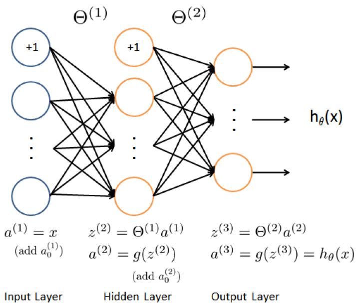

# Programming Assignment: Neural Network Learning


### 1. Neural Network

+ Implement the backpropagation algorithm to learn the parameters for the neural network

### 1.1 Visualizing the data

+ `ex4.m`
  + load the data
  + display on a 2-dim plot with `displayData` function

+ `ex3ata1.mat`
  + 5000 training examples
  + sample: 20 pixel by 20 pixel grayscale images of the digit
  + pixel: a floating point number indicating the grayscale intensity at that location
  + The 20 by 20 grid of pixels _unrolled_ into a 400-dimensional vector

+ Matrix `X`
  + A 5000 by 400 matrix
  + each row = a training example of a handwritten digit  image

  $$X = \begin{bmatrix} - & (x^{(1)})^T & - \\ - & (x^{(2)})^T & - \\ & \vdots & \\ - & (x^{(m)})^T & - \end{bmatrix}$$

+ Vector `y`
  + 5000-dim vector
  + containing labels for the training set
  + mapping the digit zero to the value 10
  + "0" digit labeled as "10" while the digits "1" to "9" labeled as "1" to "9" in the natural order


### 1.2 Model representation

+ 3-layer Neural Network
  + an input layer, a hidden layer, and an output layer
  + input layer: 400 units (image size: $20 \times 20$)
  + not counting the extra bias unit which always outputs +1)
  + hidden layer: 25 units
  + output layer: 10 units (10 digit classes)

  <div style="display:flex;justify-content:center;align-items:center;flex-flow:row wrap;">
    <div><a href="https://s3.amazonaws.com/spark-public/ml/exercises/on-demand/machine-learning-ex4.zip">
      
    </a></div>
  </div>

+ `extweights.mat`
  + a set of network parameters: $\Theta^{(1)}, \Theta^{(2)}$
  + variables: Theta1, Theta2

+ Loading dataset

  ```matlab
  % Load saved matrices from file
  load('ex4weights.mat');

  % The matrices Theta1 and Theta2 will now be in your workspace
  % Theta1 has size 25 x 401
  % Theta2 has size 10 x 26
  ```


### 1.3 Feedbackforward and cost function


### 1.4 Regularized cost function


### 2. Backpropagation

### 2.1 Sigmoid gradient


### 2.2 Random initialization


### 2.3 Backpropagation


### 2.4 Gradient checking


### 2.5 Regularized Neural Networks


### 2.6 Learning parameters using `fmincg`


### 3. Visualizing the hidden layer

### 3.1 Optional exercise


### Programming Ex.4

This is the toughest exercise so far, mainly because you have to implement a series of steps, each subject to error, before you get any feedback. These techniques may help:

See the tutorial below (developed for the Spring 2014 session).

__Use the command line__. The command line is your friend. Run enough of `ex4.m` to initialize `X`, `y`, `Theta1`, and `Theta2`, then work one statement or operation at a time to get the results you want. When you get a statement working, transfer it to nnCostFunction--and save the file.

__Use dimensions__. Use `size()` to check the dimensions of vectors and matrices to determine order of multiplication and whether a transpose is needed. This is especially valuable for the gradients. Keep in mind that the gradient matrices are the same size as Theta1 and Theta2. Also note that you will need to do some things that may seem counter-intuitive, like multiplying a $m \times 1$ vector by a $1 \times n$ vector to get an $m \times n$ matrix.

You may find it helpful to note the dimensions of each matrix in a comment on the line of code, as you define it and use it, e.g.:

```matlab
Theta1 = reshape(.....)   % (nhn x (n+1))  
a = b * c  % dimcheck: (nhn x (n+1))  = (nhn x m) * (m x (n+1))  
```

+ Do not hard-code. Specifically, do not hard-code the size of the 'binarized' y vector to 10. It will work fine for the initial tests, but will blow up with cryptic error messages later on.
+ If you get stuck on gradients, try working on a smaller, easier to grasp problem. You can steal code from checkNNGradients and paste it into the command line to get a 3-5-3 network that's a bit more manageable.
+ Full vectorization of backprop

If you want to get rid of the loop over the training samples in back propagation algorithm, you are facing the problem to create a logical vector for y for all training examples. Some smart guy from the spring 2013 instance of this course came up with the following elegant solution for this task

```matlab
yv=[1:num_labels] == y
```

(This does not seem to work in Octave 3.2.4, I use 3.6.4 Doesn't work on 3.4 either.)

After getting this, it was pretty straightforward to vectorize the loop. I could transform each line from my for-loop 1:1 to the vectorized code.

Note, the above expression relies on the [broadcasting feature of Octave](http://www.gnu.org/software/octave/doc/interpreter/Broadcasting.html).

A call to `bsxfun` is an equivalent solution that explicitly apply a broadcast:

```matlab
yv = bsxfun(@eq, y, 1:num_labels);
```

A different solution - kind of slow (this loop alone took about half the time of my vectorized solution on a mac laptop):

```matlab
yv = zeros(m, num_labels);
for i = 1:m
  yv(i, y(i)) = 1;
end
```

Using vectorization speeds up the code considerably.

Another method for generating the y matrix, this time looping over the labels:

```matlab
y_matrix = [];   % create a null matrix
for i = 1:num_labels
    y_matrix = [y_mat y == i];
end
```

Another vectorized one-line method (using vectorized indexing of an eye matrix)- Spring 2014 session:
```matlab
y_matrix = eye(num_labels)(y,:);  % works for Octave
...or
all_combos = eye(num_labels);
y_matrix = all_combos(y,:)        % works for Matlab
```

This method uses an indexing trick to vectorize the creation of 'y_matrix', where each element of 'y' is mapped to a single-value row vector copied from an eye matrix.

__FYI: Misleading Formula in Ex4 pdf for regularization term of cost__

The summation indexes for Theta 1 and 2 should be from 2 to 26 and 2 to 401 respectively.

Tutorial for Ex.4 Forward and Backpropagation (Spring 2014 session)

This tutorial outlines the process of accomplishing the goals for Programming Exercise 4. The purpose is to create a collection of all the useful yet scattered and obscure knowledge that otherwise would require hours of frustrating searches.This tutorial is targeted solely at vectorized implementations. If you're a looper, you're doing it the hard way, and you're on your own.I'll use the less-than-helpful greek letters and math notation from the video lectures in this tutorial, though I'll start off with a glossary so we can agree on what they are. I will also suggest some common variable names, so students can more easily get help on the Forum. It is left to the reader to convert these lines into program statements. You will need to determine the correct order and transpositions for each matrix multiplication. Most of this material appears in either the video lectures, slides, course wiki, or the ex4.pdf file, though nowhere else does it all appear in one place. __Glossary__:Each of these variables will have a subscript, noting which NN layer it is associated with.Θ: A matrix of weights to compute the inner values of the neural network. When we used single-vector theta values, it was noted with the lower-case character θ.z : is the result of multiplying a data vector with a Θ matrix. A typical variable name would be "z2".a : The "activation" output from a neural layer. This is always generated using a sigmoid function g() on a z value. A typical variable name would be "a2".δ : lower-case delta is used for the "error" term in each layer. A typical variable name would be "d2".Δ : upper-case delta is used to hold the sum of the product of a δ value with the previous layer's a value. In the vectorized solution, these sums are calculated automatically though the magic of matrix algebra. A typical variable name would be "Delta2".Θ gradient : This is the thing we're looking for, the partial derivative of theta. There is one of these variables associated with each Δ. These values are returned by nnCostFunction(), so the variable names must be "Theta1_grad" and "Theta2_grad".g() is the sigmoid function.g′() is the sigmoid gradient function.Tip: One handy method for ignoring a column of bias units is to use the notation `SomeMatrix(:,2:end)`. This selects all of the rows of a matrix, and omits the entire first column.Here we goNearly all of the editing in this exercise happens in `nnCostFunction.m`. Let's get started.

__A note regarding the sizes of these data objects__:See the Appendix at the bottom of the tutorial for information on the sizes of the data objects. __A note regarding bias units, regularization, and back-propagation__:There are two methods for handing the bias units in the back-propagation and gradient calculations. I've described only one of them here, it's the one that I understood the best. Both methods work, choose the one that makes sense to you and avoids dimension errors. It matters not a whit whether the bias unit is dropped before or after it is calculated - both methods give the same results, though the order of operations and transpositions required may be different. Those with contrary opinions are welcome to write their own tutorial. __Forward Propagation__:We'll start by outlining the forward propagation process. Though this was already accomplished once during Exercise 3, you'll need to duplicate some of that work because computing the gradients requires some of the intermediate results from forward propagation.

Step 1 - Expand the 'y' output values into a matrix of single values (see ex4.pdf Page 5). This is most easily done using an eye() matrix of size num_labels, with vectorized indexing by 'y', as in "eye(num_labels)(y,:)". Discussions of this and other methods are available in the Course Wiki - Programming Exercises section. A typical variable name would be "y_matrix".

Step 2 - perform the forward propagation:a1 equals the X input matrix with a column of 1's added (bias units)z2 equals the product of a1 and Θ1a2 is the result of passing z2 through g()a2 then has a column of 1st added (bias units)z3 equals the product of a2 and Θ2a3 is the result of passing z3 through g()__Cost Function, non-regularized__

Step 3 - Compute the unregularized cost according to ex4.pdf (top of Page 5), (I had a hard time understanding this equation mainly that I had a misconception that y(i)k is a vector, instead it is just simply one number) using a3, your ymatrix, and m (the number of training examples). Cost should be a scalar value. If you get a vector of cost values, you can sum that vector to get the cost.Remember to use element-wise multiplication with the log() function.Now you can run `ex4.m` to check the unregularized cost is correct, then you can submit Part 1 to the grader.

__Cost Regularization__

Step 4 - Compute the regularized component of the cost according to ex4.pdf Page 6, using Θ1 and Θ2 (ignoring the columns of bias units), along with λ, and m. The easiest method to do this is to compute the regularization terms separately, then add them to the unregularized cost from Step 3.You can run `ex4.m` to check the regularized cost, then you can submit Part 2 to the grader. __Sigmoid Gradient and Random Initialization__

Step 5 - You'll need to prepare the sigmoid gradient function g′(), as shown in ex4.pdf Page 7You can submit Part 3 to the grader.

Step 6 - Implement the random initialization function as instructed on ex4.pdf, top of Page 8. You do not submit this function to the grader. __Backpropagation__

Step 7 - Now we work from the output layer back to the hidden layer, calculating how bad the errors are. See ex4.pdf Page 9 for reference.δ3 equals the difference between a3 and the y_matrix.δ2 equals the product of δ3 and Θ2 (ignoring the Θ2 bias units), then multiplied element-wise by the g′() of z2 (computed back in Step 2).Note that at this point, the instructions in ex4.pdf are specific to looping implementations, so the notation there is different.Δ2 equals the product of δ3 and a2. This step calculates the product and sum of the errors.Δ1 equals the product of δ2 and a1. This step calculates the product and sum of the errors.

__Gradient, non-regularized__

Step 8 - Now we calculate the non-regularized theta gradients, using the sums of the errors we just computed. (see ex4.pdf bottom of Page 11)Θ1 gradient equals Δ1 scaled by 1/mΘ2 gradient equals Δ2 scaled by 1/mThe `ex4.m` script will also perform gradient checking for you, using a smaller test case than the full character classification example. So if you're debugging your nnCostFunction() using the "keyboard" command during this, you'll suddenly be seeing some much smaller sizes of X and the Θvalues. Do not be alarmed.If the feedback provided to you by `ex4.m` for gradient checking seems OK, you can now submit Part 4 to the grader. __Gradient Regularization__

Step 9 - For reference see ex4.pdf, top of Page 12, for the right-most terms of the equation for j>=1.Now we calculate the regularization terms for the theta gradients. The goal is that regularization of the gradient should not change the theta gradient(:,1) values (for the bias units) calculated in Step 8. There are several ways to implement this (in Steps 9a and 9b). Method 1: 9a) Calculate the regularization for indexes (:,2:end), and 9b) add them to theta gradients (:,2:end).Method 2: 9a) Calculate the regularization for the entire theta gradient, then overwrite the (:,1) value with 0 before 9b) adding to the entire matrix.Details for Steps 9a and 9b9a) Pick a method, and calculate the regularization terms as follows:(λ/m)∗Θ1 (using either Method 1 or Method 2)...and(λ/m)∗Θ2 (using either Method 1 or Method 2)9b) Add these regularization terms to the appropriate Θ1 gradient and Θ2 gradient terms from Step 8 (using either Method 1 or Method 2). Avoid modifying the bias unit of the theta gradients. Note: there is an errata in the lecture video and slides regarding some missing parenthesis for this calculation. The ex4.pdf file is correct. The `ex4.m` script will provide you feedback regarding the acceptable relative difference. If all seems well, you can submit Part 5 to the grader.Now pat yourself on the back.

__Appendix__:

Here are the sizes for the character recognition example, using the method described in this tutorial. a1: 5000x401z2: 5000x25a2: 5000x26a3: 5000x10d3: 5000x10d2: 5000x25Theta1, Delta1 and Theta1grad: 25x401Theta2, Delta2 and Theta2grad: 10x26Note that the `ex4.m` script uses a several test cases of different sizes, and the submit grader uses yet another different test case.

### Debugging Tip

The submit script, for all the programming assignments, does not report the line number and location of the error when it crashes. The follow method can be used to make it do so which makes debugging easier.

Open `ex4/lib/submitWithConfiguration.m` and replace line:

```matlab
 fprintf('!! Please try again later.\n');
```

(around 28) with:

```matlab
fprintf('Error from file:%s\nFunction:%s\nOn line:%d\n', e.stack(1,1).file,e.stack(1,1).name, e.stack(1,1).line );
```

That top line says '!! Please try again later' on crash, instead of that, the bottom line will give the location and line number of the error. This change can be applied to all the programming assignments.

#### Tips for classifying your own images:

There's no documentation on how the images were prepared for this course. These tips may be helpful.

+ The images must be gray-scale with 20x20 pixels.
+ The image pixels are scaled (or normalized) so that -1.0 is black, 0.0 is grey, and +1.0 is white. However, nearly all of the pixels are in the 0.0 to +1.0 range. The backgrounds are grey, and the image "pen strokes" are white.
+ Your images must use the same value range as the training data, otherwise the NN will not be able to classify them.
+ Center the digit image so it does not use the two pixels around the borders.


### Bonus: Neural Network does not need order in pixels of an image as humans do

The pixels order (as a human sees them) is not necessary (or relevant) for a Neural Network.

You can test it with a modified `ex3.m` program below (you can call it `ex3_rand.m`)

The program has a randomize pixel position step "scrambling" the 400 vector positions BEFORE the training. As long as you keep the same pixel position when predicting, the results are the same.

It is interesting to "see" how prediction perfectly works with a scrambled picture!

You can test it once you have submitted OK the `ex3.m` program (meaning that you have the oneVsAll function working OK first).

#### `ex3_rand.m` is a modified version of `ex3.m`

```matlab
ex3_rand.m (is a modified version of ex3.m to scramble pixels/features)
%
%% Machine Learning Online Class - Exercise 3 | Randomize Features

%% Initialization
clear; close all; clc

%% Setup the parameters you will use for this part of the exercise
input_layer_size  = 400; % 20x20 Input Images of Digits
num_labels = 10;         % 10 labels, from 1 to 10   
                         % (note that we have mapped "0" to label 10)

%% =========== Part 1: Loading and Visualizing Data =============
%  We start the exercise by first loading and visualizing the dataset. 
%  You will be working with a dataset that contains handwritten digits.
%

% Load Training Data
fprintf('Loading and Visualizing Data ...\n')

load('ex3data1.mat'); % training data stored in arrays X, y
m = size(X, 1);

% Randomly select 100 data points to display
rand_indices = randperm(m, 100);
sel = X(rand_indices,:);

displayData(sel);

fprintf('Program paused. Press enter to continue.\n');
pause;

%% ============ Part 2: Vectorize Logistic Regression ============
%  In this part of the exercise, you will reuse your logistic regression
%  code from the last exercise. You task here is to make sure that your
%  regularized logistic regression implementation is vectorized. After
%  that, you will implement one-vs-all classification for the handwritten
%  digit dataset.
%

% Added to randomize features (to probe that is irrelevant)
fprintf('\nRandomizing columns...\n');
X_rand = X(:, randperm(size(X,2)));

fprintf('\nTraining One-vs-All Logistic Regression...\n')

lambda = 0.1;
[all_theta] = oneVsAll(X_rand, y, num_labels, lambda);

fprintf('Program paused. Press enter to continue.\n');
pause;


%% ================ Part 3: Predict for One-Vs-All ================
%  After ...
pred = predictOneVsAll(all_theta, X_rand);

fprintf('\nTraining Set Accuracy:%f\n', mean(double(pred == y)) * 100);

%% ============ Part 4: Predict Random Samples ============
%  To give you an idea of the network's output, you can also run
%  through the examples one at the a time to see what it is predicting.

%  Randomly permute examples
rp = randperm(m);

for i = 1:m
   % Display 
    fprintf('\nDisplaying Example Randomized Image\n');
    displayData(X_rand(rp(i),:));

    pred = predictOneVsAll(all_theta, X_rand(rp(i),:));
    fprintf('\nNeural Network Prediction:%d (label%d)\n', pred, y(rp(i)));

   % Pause
    fprintf('Program paused. Press enter to continue.\n');
    pause;
end
```

#### Why the order is Irrelevant for the Neural-Network

You can see that the order of the pixels is irrelevant as long as you are consistent in two ways:

1. Between samples. Each feature should mean the same pixel. You can not change the pixel location for one sample and not for the others. You can scramble them but you have to keep the "scrambling" fixed for the entire samples.
2. Between labels. Each label should represent the same digit for its group of samples. Meaning a digit four is a four for all of the samples you labeled as four and can not change it.It does not matter if the pixels are 'scrambled", it is a four.


#### Equivalent example of order irrelevancy

An equivalent example is the order of variable names when solving a system of equations. It does not matter how you call a variable or the order as long as you are consistent through out the solution.

For example, this:

$\begin{array}{rcl} 3x_1 + 4x_2 &=& 26 \\ 2x_1 -3x_2 &=& -11 \end{array}$

Solution: $x_1=2; x_2=5$

...is equivalent to:

$\begin{array}{rcl} 3x_2 + 4x_1 &=& 26 \\ 2x_2 - 3x_1 &=& -11 \end{array}$

Solution: $x_2 = 2; x_1 = 5$

...also you can "scramble" the terms and "labels"

$\begin{array}{rcl} -3x_1 + 2x_2 &=& -11 \\ 4x_1 + 3x_2 &=& 26 \end{array}$

Solution: $x_1 = 5; x_2 = 2$

It has to do with convention. Any convention as long as it is the same all the way through.


