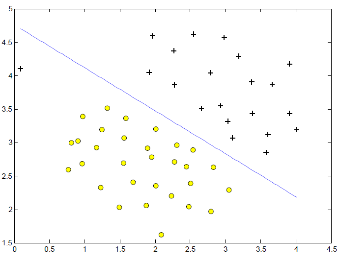
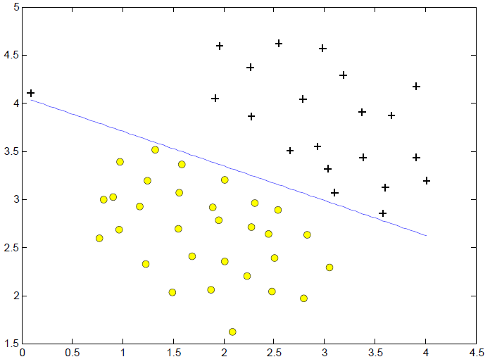
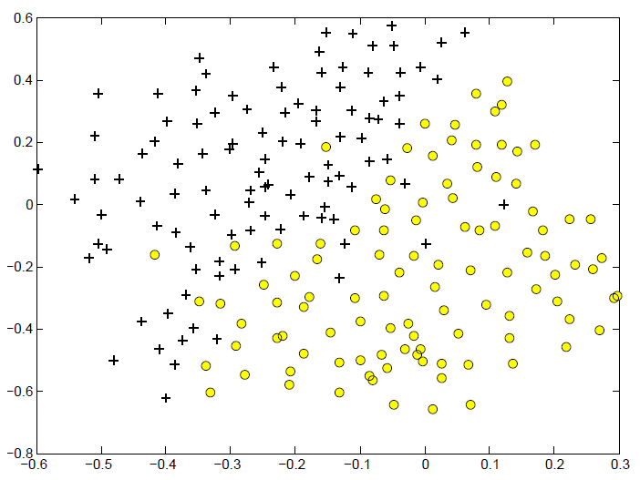
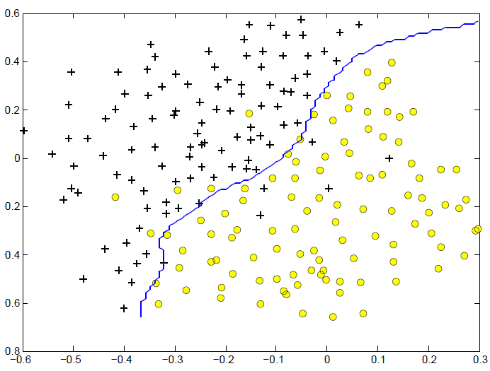
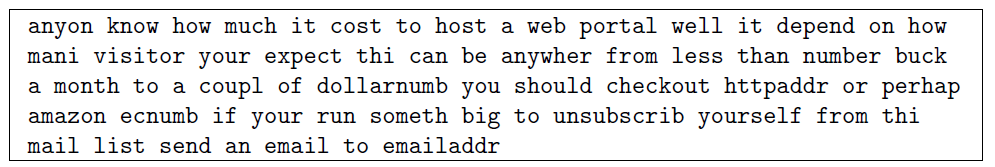
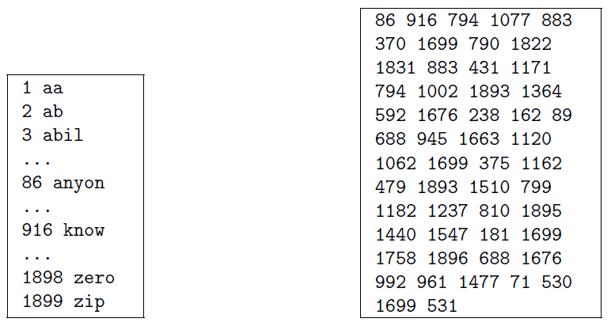

# Programming Assignment: Support Vector Machines

### 1 Support Vector Machines

+ gain an intuition of how SVMs work and how to use Gaussian kernel with SVMs

+ `ex6.m` step through the first half of the exercise

### 1.1 Example Dataset 1

+ Starting with a 2D example dataset deparated by a linear boundary

+ plot the training data
  + symbol +: positive examples
  + symbol o: negative examples
  + a natural separation indicated by the gap
  + an outlier with positive example

+ observe how outlier affects the SVM the SVM decision boundary

+ $C$ parameter
  + trying difference $C$ parameter with SVMs
  + a positive value that controls the penalty for misclassified examples
  + large $C$ parameter makes the SVM to try to classify all the examples correctly
  + play a roll similar to $\frac{1}{\lambda}$, $lambda$ is the regulation parameter w/ logistic regression

+ Example Dataset 1

  <div style="display:flex;justify-content:center;align-items:center;flex-flow:row wrap;">
    <div><a href="https://www.coursera.org/learn/machine-learning/programming/e4hZk/support-vector-machines">
      
      
    </a></div>
  </div>

  + $C=1$: the SVM puts the decision boundary in the gap between the two datasets and misclassifies the data point on the far left
  + $C=100$: the SVM classifies every single example correctly, but has a decision boundary separating every single point

+ Implementation Note:
  + Most SVM software automatically add the extra feature $x_0 = 1$ and automatically take care of the learning of the intercept term $\theta_0$
  + Octave works with training examples $x \in \mathbb{R}^n$ (rather than $x \in \mathbb{R}^{n+1}$)


### 1.2 SVM with Gaussian Kernels

+ using SVMs to do non-linear classification

+ using SVMs with Gaussian kernels on datasets not linearly separated


#### 1.2.1 Gaussian Kernel

+ implement a Gaussian kernel

+ Gaussian kernel
  + a similarity function that measures the "distance" between a pair of examples, $(x^{(i)}, x^{(j)}$)
  + $\sigma\;$: a bandwidth parameter that determines how fast the similarity metric decreases (to 0) as the examples are further apart

+ complete `gaussianKernel.m` to compute the Gaussian kernel between two examples, $(x^{(i)}, x^{(j)})$

+ The Gaussian function

  $$K_{gaussian}(x^{(i)}, x^{(j)}) = \exp(- \dfrac{\parallel x^{(i)} - x^{(j)} \parallel^2}{2\sigma^2}) = \exp(- \dfrac{\sum_{k=1}^n (x_k^{(i)} - x^{(j)})^2}{2\sigma^2})$$

+ `ex6.m` will test the kernel function and get a value of 0.324652.


#### 1.2.2 Example Dataset 2

+ load and plot dataset 2

+ observe that there is no linear decision boundary that separates the positive and negative examples for the dataset

+ using the Gaussian kernel with the SVM to learn a non-linear decision boundary

+ `ex6.m` train the SVM with the Gaussian kernel on the dataset

+ The decision boundary found by the SVM with a Gaussian kernel able to separate most of the positive and negative examples correctly


#### 1.2.3 Example Dataset 3

+ gain more practical skills on how to use a SVM with a Gaussian kernel

+ `ex6.m` loads and displays a 3rd dataset

+ Dataset `ex6data3.mat` given varians: `X`, `y`, `Xval`, `yval`

+ train the SVM classifier using the training set $(X, y)$ loaded from `dataset3Params.m`

+ Use the cross validation set `Xval`, `yval` to determine the best $C$ an $\sigma$ parameters
  + additional code to search over the parameter $C$ and $\sigma$
  + both $C$ adn $\sigma$ values: 0.01, 0.03, 0.1, 0.3, 1, 3, 10, 30
  + try al possible pairs of values for $C$ and $\sigma$

+ After determined the best $C$ and $\sigma$ parameters, modify the code in `datasetParams.m` w/ the best parameters

  <div style="display:flex;justify-content:center;align-items:center;flex-flow:row wrap;">
    <div><a href="https://www.coursera.org/learn/machine-learning/programming/e4hZk/support-vector-machines">
      
      
    </a></div>
  </div>

+ Implementation Tip
  + evaluate the error on cross validation set
  + error: the fraction of the cross validation examples that were classified incorrectly
  + Octave: compute the error using `mean(double(predictions ~= yval))`
  + `prediction`: a vector containing all the predictions from the SVM
  + `yval`: the true labels from the cross validation set
  + using the `svmPredict` function to generate the predictions for the cross validation set


### 2 Spam Classification

+ use SVM s to build your own spam filter

+ training a classifier to classify whether a given email, $x$, is spam ($y=1$) or non-spam ($y=0$)

+ convert each email into a feature vector $x \in \mathbb{R}^n$

+ using `ex6_spam.m` to complete the tasks.


### 2.1 Preprocessing Emails

+ email containing: 
  + common entities: other URL, email address, numbers
  + specific entities: specific URL, dollar amount

+ method to process emails: "normalize" the values, therefore, all URLs, email addresses, all numbers are treated the same
  
+ replace each URK with the the unique string "hpptaddr" to indicate that a URL was presented
  + affect of letting the spam classifier make a classification decision based on whether any URL was present, rather than whether a specific URL was present
  + improve the performance oof a spam classifier
  + seeing any particular URL again is odd

+ implement email preprocessing and normalization in `processEmail.m`
  + __Lower-casing__: convert all character into lower case
  + __Stripping HTML__: remove all HTML tags
  + __Normalizing URLs__: replace all URLs with "httpaddr"
  + __Normalizing Email Addresses__: replace email address with "emailaddr"
  + __Normalizing Numbers__: replace numbers with "number"
  + __Normalizing Dollars__: replace all dollar signs ($) with "dollar"
  + __Word Stemming__: reduce the words to their stemmed form
    + "discount": "discount", "discounts", "discounted", "discounting"
    + "includ": "include", "includes", "included", :including"
  + __Removal of non-words__: remove all non-words, punctuation, and white spaces (tabs, newlines, spaces)


#### 2.1.1 Vocabulary List

+ Example of preprocessing

  <div style="display:flex;justify-content:center;align-items:center;flex-flow:row wrap;">
    <div><a href="https://s3.amazonaws.com/spark-public/ml/exercises/on-demand/machine-learning-ex6.zip">
      
      
    </a></div>
  </div>

+ choose which words used in classifier and which to leave out

+ Choose only the most frequently occurring words as out set of words considered

+ words rarely occurred in the training set might cause the model to overfit

+ `vocab.txt` lists complete vocabularies selected by choosing all words which occur at least a 100 times in the spam corpus, resulting a 1899 words

+ in practice, a vocabulary list often used about 10,000 to 50,000 words

+ map each word in the preprocessed emails into a list of word indices that contains the index of the word in the vocabulary list

+ complete the code in `processEmail.m` to perform this mapping
  + given a string `str`, a single word from the preprocessed email
  + look up the word in the vocabulary list `vocabList
  + str in the list, then add the index of the word into the word_indices variable
  + str not in the list, skip the word

+ `ex6_spam.m` process the email sample and displays output similar to figures

+ Octave Tip
  + compare two strings with `strcmp` function
  + `strcmp(str1, str2)` returns 1 when `str1 == str2`
  + `vocabList`: a cell-array as a normal array except strings as elements
  + index into `vacabList` using curly braces instead of square brackets
  + use `vocabList{i}` to get index
  + use `length(vocabList)` to get the number of words in the vocabulary


### 2.2 Extracting Features from Emails

+ implement the feature extraction that converts each email into a vector in $\mathbb{R}^n$
  + using $n =\;$ words in vocabulary list

+ the feature $x_i \in \{0, 1\}$ for an email corresponds to whether the $i$-th word in the dictionary occurs in the email, e.g.,

  $$x = \begin{bmatrix} 0 \\ \vdots \\ 1 \\ 0 \\ \vdots \\ 1 \\ 0 \\ \vdots \\ 0 \end{bmatrix}$$

+ complete `emailFeatures.m` to generate a feature vector for an email, given the `word_indices`


### 2.3 Training SVM for Spam Classification

+ `ex6_spam.m` load a processed training dataset used to train a SVM classifier

+ `spamTrain.m`: 4000 training examples of spam and non-spam email.

+ `spamTest.mat`: 1000 test samples

+ `ex6_spam.m` trains a SVM to classify between spam ($y=1$) and non-spam ($y=0$)

+ Result: training accuracy = 99.8% and test accuracy = 98.5%


### 2.4 Top Predictors for Spam

+ inspect the parameters to see which words the classifier thinks are the most predictive of spam

+ `ex6_spam.m` finds the parameters with the largest positive values in the classifier and displays the corresponding words


### 2.5 Try your own emails (optional)

+ try other examples 

+ inspect the accuracy


### 2.6 Build your own dataset (optional)


### Programming Ex.6

Keep in mind that all the programming exercise solutions should handle any number of features in the training examples. Passing the test case in the PDF file is not sufficient to be sure of passing the submit grader's test case.

__Debugging Tip__

The submit script, for all the programming assignments, does not report the line number and location of the error when it crashes. The follow method can be used to make it do so which makes debugging easier.

Open ex6/lib/submitWithConfiguration.m and replace line:

```matlab
 fprintf('!! Please try again later.\n');

```

(around 28) with:

```matlab
fprintf('Error from file:%s\nFunction:%s\nOn line:%d\n', e.stack(1,1).file,e.stack(1,1).name, e.stack(1,1).line );
```

That top line says '!! Please try again later' on crash, instead of that, the bottom line will give the location and line number of the error. This change can be applied to all the programming assignments.


#### Update to ex6.m

At line 69/70, change "sigma = 0.5" to "sigma = %0.5f", and change the list of output variables from "sim" to "sigma, sim". This lets the screen output display the actual value of sigma, rather than an (incorrect) constant value.


#### Trouble with the contour plot (visualizeBoundary.m)

Octave 3.8.x and higher
If you have Octave 3.8.x, the ex6 script will not plot decision boundary, and prints 'Unknown hggroup property Color' with stack trace.

One fix is to modify line 21 in visualizeBoundary.m with this code:

```matlab
contour(X1, X2, vals, [1 1], 'linecolor', 'blue');

```

(Note: I tried this and although the error went away, I still don't see any contour line drawn; sokolov 3/22/2015)

I had the same problem with the line not displaying until i changed the [0 0] to [1 1] - tmcarthur 7/1/2016

OR

If you change line 21 to following, it will show two lines and will work with >= 3.8.x .

```matlab
contour(X1, X2, vals);
```

For more information see [here](http://lists.gnu.org/archive/html/octave-bug-tracker/2014-01/msg00226.html)

__Matlab__

In Matlab R2014b and R2015b, simply changing the [0 0] parameter on line 21 in visualizeBoundary.m to [1 1] plots the boundary.


#### processEmail no loop possible

Can use `find()` or `ismember()` for the word vocabulary cell array


#### Understanding SMO and the `svmTrain()` and `svmPredict()` methods

The `svmTrain.m` file is provided with this exercise and it contains an implementation of the Sequential Minimal Optimization (SMO) algorithm to minimize an SVM. You don't need to understand how it works in order to complete the exercise. There are comments in the code that reference numbered equations, but the code doesn't say what document those numbers reference. It turns out to be a section of the course materials from CS 229 at Stanford covering SMO, which can be found [here](http://cs229.stanford.edu/materials/smo.pdf)


#### More SVM explanations

"[An Idiot's Guide to Support Vector Machines](http://web.mit.edu/6.034/wwwbob/svm-notes-long-08.pdf)"


#### Information on SVMLIB

[This exercise](http://openclassroom.stanford.edu/MainFolder/DocumentPage.php?course=MachineLearning&doc=exercises/ex7/ex7.html) uses the SVMLIB package to solve an exercise similar to ex6 (also by Prof Ng).


#### Using LIBSVM in MATLAB/Octave

In the optional section of this exercise, Prof Ng recommended that we use LIBSVM to [solve the problem](http://www.csie.ntu.edu.tw/~cjlin/libsvm/).

Installing LIBSVM on MATLAB/Octave is very easy.

+ After downloading and unzipping the LIBSVM package, open MATLAB/Octave.
+ Go to the directory of the MATLAB/Octave version, e.g. "E:/CourseraML/machine-learning-ex6/ex6/libsvm-3.21/matlab"
+ Enter "make" in the command window.
+ That's it! You're done! Now read the README file in the MATLAB directory, and learn how to use svmtrain and svmpredict function.
+ In short, the syntax of these two functions are: `model = svmtrain( trainingLabelVector, trainingInstanceMatrix [, 'libsvmOptions'])` and `[predictedLabel, accuracy, decisionValues/probEstimates] = svmpredict( testingLabelVector, testingInstanceMatrix, model [, 'libsvmOptions']);`


### Ex6 Tutorials

Here are the ex6 tutorials by Tom Mosher:

__gaussianKernel()__:

The numerator is the sum of the squares of the difference of two vectors. That's similar to how you computed the linear regression cost function in ex1. Then use exp() with scaling based on the 'sigma' parameter, according to the kernel formula.

__dataset3Params()__:

One method is to use two nested for-loops - each one iterating over the range of C or sigma values given in the ex6.pdf file.

Inside the inner loop:

+ Train the model using svmTrain with `X`, `y`, a value for `C`, and the gaussian kernel using a value for sigma. See `ex6.m` at line 108 for an example of the correct syntax to use in calling `svmTrain()` and the gaussian kernel. Note: Use temporary variables for `C` and `sigma` when you call `svmTrain()`. Only use `C` and `sigma` for the final values you are going to return from the function.
+ Compute the predictions for the validation set using `svmPredict()` with model and `Xval`.
+ Compute the error between your predictions and `yval`.
+ When you find a new minimum error, save the C and sigma values that were used. Or, for each error computation, you can save the `C`, `sigma`, and `error` values as rows of a matrix. When all 64 computations are completed, use `min()` to find the row with the minimum error, then use that row index to retrieve the C and sigma values that produced the minimum error.

Sample code structure for `dataset3Params()`:

```matlab
results = []   % create an empty results matrix

for C_test = [list of values here]
    for sigma_test = [list of values here]

        % your code goes here to train using C_test and sigma_test
        %    and compute the validation set errors

        % save the results in the matrix
        results = [results ; C_test sigma_test err_value]

    endfor
endfor

% use the min() function to find the best C and sigma values
```

Here is an example of how to find the values in the row of a matrix Q that has the lowest value in column 3:

```matlab
>> Q = rand(6,3)
Q =

   0.3840651   0.0738230   0.7128092
   0.4558660   0.6360802   0.7075968
   0.3822171   0.4430273   0.6626950
   0.0090786   0.1231786   0.4371842
   0.5808400   0.0045790   0.6251304
   0.8679802   0.0193655   0.1613009

>> [v i] = min(Q(:,3))
v =  0.16130
i =  6

>> Q(i,1)
ans =  0.86798

>> Q(i,2)
ans =  0.019366
```

---------------------------------------

__processEmail()__:

To see what variables already exist in processEmail.m, you can set a breakpoint in the processEmail.m script template in the blank area below the "YOUR CODE HERE" comment block. Use the breakpoint tool in the GUI code editor. Then run the ex6_spam script from the console.

When program execution hits the breakpoint, it will activate the console in debug mode. There you can inspect the variables "str" and "vocabList" (type the variable name into the console and press `<Enter>`).

Observe that str holds a single word, and that vocabList is a cell array of all known words. Resume execution with the 'return' command in the debugger.

For the code you need to add:

Here is an example using the `strcmp()` function showing how to find the index of a word in a cell array of words:

```matlab
small_list = {'alpha', 'bravo', 'charlie', 'delta', 'echo'}
match = strcmp('bravo', small_list)
find(match)
```

`strcmp()` returns a logical vector, with a 1 marking each location where a word occurs in the list. If there is no match, all of the logical values are 0's.

The `find()` function returns a list of the non-zero elements in "match". You can add these index values to the word_indices list by concatenation.

Note that if there is no match, `find()` returns a null vector, and this can be concatenated to the word list without any problems.

Note that your word_index list must be returned as a column vector. If you make it a row vector, the submit grader will still give you credit, but your emailFeatures() function will not work correctly.

-------------------------------------

__emailFeatures__:

The `emailFeatures()` function is one of the simplest in the entire course:

+ You're given a list of word indexes.
+ For each index in that list, you're asked to set the corresponding entries in an 'x' array to the value '1'.

A couple of different methods could be used:

+ Loop through the list of word indexes, and use each index to set the corresponding value in the 'x' array to 1.
+ Take advantage of vectorized indexing, and do the same operation in one line of code without the loop.

Note that the 'x' feature list must be a column vector, and the word_indices list (which is provided by your processEmail() function) must be a column vector.

You can complete this function by adding only one line of code.Try this example in your console:

```matlab
vec = zeros(10,1)     % included in the function template
indexes = [1 3 5]     % you're provided with a list of indexes
vec(indexes) = 1      % set the values to 1
```

------------------------------------

How do I install and use LIBSVM?

See [this page](https://www.coursera.org/learn/machine-learning/resources/TEPQT)

#### [Tutorial for emailfeatures()](https://www.coursera.org/learn/machine-learning/programming/e4hZk/support-vector-machines/discussions/threads/unXCdEtOEeWpgBJUo9Z-Uw)

The emailFeature() function is one of the simplest in the entire course:

You're given a list of word indexes.
For each index in that list, you're asked to set the corresponding entries in an 'x' array to the value '1'.
A couple of different methods could be used:

Loop through the list of word indexes, and use each index to set the corresponding value in the 'x' array to 1.
Take advantage of vectorized indexing, and do the same operation in one line of code without the loop.
You can complete this function by adding only one line of code.Try this example in your console:


```matlab
vec = zeros(10,1)     % included in the function template
indexes = [1 3 5]     % you're provided with a list of indexes
vec(indexes) = 1      % set the values to 1
```


#### [FAQ for Week 7 and programming exercise 6](https://www.coursera.org/learn/machine-learning/discussions/weeks/7/threads/ytrutj_YEeai1RIqHM9jYQ)

##### VIDEO LECTURE FAQ

Lecture Notes are available in the Resources menu.

The lecture slides are now available in the "Review" section of each week's course materials.

__Q1) How are the landmarks defined and used?__

For each training example, the landmarks are all of the other training examples.

The SVM method is based on measuring the similarity between all pairs of training examples, then selecting a subset of them that will define the support vectors - that is, the vectors which provide the largest margin available for the given constraints.


__Q2) Why do Prof Ng's lectures about SVM use theta and f() and cost(i), but these don't appear in the programming exercise? And, why don't we implement the SVM functions ourselves?__

Prof Ng's lectures provide an intuition about how the SVM works. But this isn't a practical method of finding a solution. The method in the lectures does not have a mathematical solution.

There is SVM solution, but the math and implementation are outside the scope of this course. The programming exercises use the SMO (sequential minimial optimization) method, which is provided for you in the exercise scripts as the "svmTrain()" and "svmPredict()" functions. These use a data structure called the "model" that represents the factors used in the SMO method.

More information about the SMO method is available in the Resources menu - "Programming Ex. 6" section.


__Q3) How do we know that the theta is perpendicular to the decision boundary?__

(thanks to Mentor Chirag for this derivation)

We know that $\theta' * x = 0$ for any x on the boundary since the boundary is where sigmoid = 0.5.

$$\frac{1}{1+e^{-z}} = \frac{1}{2} \implies e^{-z} = 1 \implies -z = 0 \implies \theta' * x = 0$$

So pick two random points on the boundary $a$ and $b$, then

$\theta' * a = 0$ and $\theta' * b = 0 \implies \theta' * (a-b) = 0 \implies \theta' \cdot (a-b) = 0$

and we know that when the dot product of two vectors is 0, the angle between them is 90 degrees. And since the vector $(a-b)$ is on the decision boundary, $\theta$ is perpendicular to the decision boundary.


__Q4) How do I compute the answer to the quiz in the video "Mathematics Behind Large Margin Classification"?__

The key is this bit from the lecture slides:

SVM Decision Boundary

$$\begin{array}{ll} \displaystyle \min_\theta & \dfrac{1}{2} \displaystyle \sum_{j=1}^n \theta^2_j = \dfrac{1}{2} \parallel \theta \parallel^2 \\\\ \text{s.t. } & p^{(i)} \cdot \parallel \theta \parallel \geq 1 \quad \text{if } y^{(i)} = 1 \\ & p^{(i)} \cdot \parallel \theta \parallel \leq -1 \quad \text{if } y^{(i)} = 0 \end{array}$$


$p^{(i)}$ is the projection of x onto the theta axis. From the image in the video, you can see that equals 2. Plug this into the equation in the blue box and solve for the norm of \thetaθ

#### QUIZ FAQ

(none yet)

#### PROGRAMMING ASSIGNMENT FAQ

Note: Tutorials and additional Test Cases are available in the Resources menu.

Errata in ex6.pdf:

In ex6.pdf section 1.2.3, replace the text at the bottom of page 7 and top of page 8 with the following:

The `ex6.m` script reads in the `ex6data3.mat` dataset. This provides the training set (`X` and `y`), and the validation set (`Xval` and `yval`). The `ex6.m` script passes these parameters to the `dataset3Params()` function.

Your task is to modify the `dataset3Params.m` script so that it returns the best combination of `C` and `sigma` values.

In dataset3Params.m, you should write the additional code needed to check all combinations of C and sigma, using these values: `0.01, 0.03, 0.1, 0.3, 1, 3, 10`, and `30`, for both C and sigma. You should try all possible pairs of values for C and sigma. You will train a total of 64 different SVM models, by training on the training set, and measuring the validation error on the validation set. The best combination of `C` and `sigma` is the one that gives the lowest validation set error.

After you have determined the best C and sigma parameters, you can modify your code in dataset3Params.m, so that it immediately returns the best C and sigma values. This will allow the submit script to run more quickly.

__Q1) What does this line of code do (from ex6.m at line 108)?__

`model= svmTrain(X, y, C, @(x1, x2) gaussianKernel(x1, x2, sigma));`

This is the best line of code to use as a guide for the `dataset3Params()` function.

It uses the "anonymous function" method.

'x1' and 'x2' are dummy parameters. They are filled-in at runtime when `svmTrain()` calls your kernel function.

'x1' and 'x2' represent a pair of training examples. `svmTrain()` computes the similarity between all pairs of training examples.

The values you pass for `C` and `sigma` must be scalars. Rather than use the variables 'C' and 'sigma' in this function, it is probably better to use temporary variables, like 'C_test' and "sigma_test'. Only set the C and sigma variables to the values you are going to return from the function.

`svmTrain()` returns a data structure 'model', which specifies the parameters of the SMO (sequential minimal optimization) algorithm for computing the SVM. You can learn more about the SMO method in the Resources menu - "Programming Ex.6" section.


__Q2a) Why is the decision boundary not drawn?__

...or...

__Q2b) Why do I get this error message?__

"error: set: unknown hggroup property Color"

There is an error in the `visualizeBoundary.m` script. The fix is discussed in the Tutorial for ex6 - see the Resources menu for the list of tutorials.


__Q3) In dataset3Params(), what C and sigma values should I use?__

Use only the list of values that are on page 7 of ex6.pdf. The "suggested" values are the only ones that the submit grader will accept.


__Q4) My code for processEmail() or emailFeatures() has problems with either the ex6_spam.m script or with the submit grader.__

Check that your emailFeatures() and processEmail() functions both use and return column vectors for the word_indices list.


__Q5) Do you have any tips for ex6.pdf section 2.6 "Build your own dataset"?__

See [this thread](https://www.coursera.org/learn/machine-learning/discussions/all/threads/DZjwUh61Eeeq4gqhD-WaKA/replies/8GDYBYv7EeeN2RL2J8XzNg/comments/067UgZfjEeeimg44L3fEtg) from a student of the course


__Q6) Missing "+ model.b" for the gausian kernel in `svmPredict.m`__

At line 35 of svmPredict.m, add "+ model.b" so that the line reads ...

`p = sum(K, 2) + model.b;`

This fixes an error so that the gaussian kernel includes the 'b' parameter similarly to how it does for the linear kernel and the "other Non-linear" kernels.

Note the the missing "model.b" term does not alter the results of this exercise, because the 'b' values are small for the ex6 data sets. But for use of `svmPredict.m` with other data, this correction might be significant.


__Q7) How do I install and use LIBSVM?__

See [this page](https://www.coursera.org/learn/machine-learning/resources/TEPQT)


