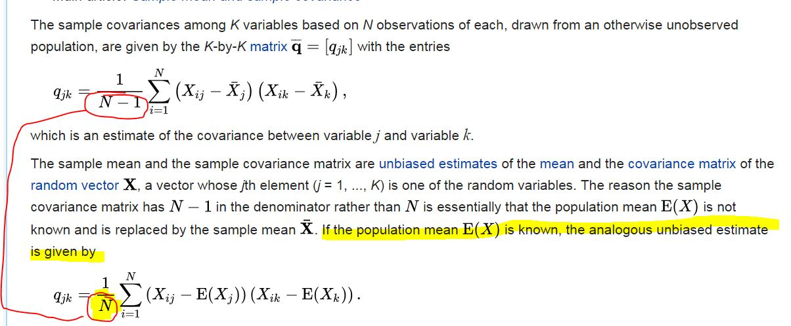

# Programming Assignment: K-Means Clustering and PCA

## 1 K-means Clustering

+ Implement the K-means algorithm and use it for image compression

+ Start on an example 2D dataset that will help to gain an intuition of how the K-means algorithm works

+ Use the K-means algorithm for image compression by reducing the number of colors that occur in an image to only those that are most common in that image


### 1.1 Implementing K-means

+ K-means algorithm: a method to automatically cluster similar data examples together

+ Given a training set $\{ x^{(1)}, \dots, x^{(m)} \}$ where $x^{(i)} \in \mathbb{R}^n$

+ Group the training data into a few cohesive "clusters"

+ Intuition of K-means algorithm:
  + an iterative procedure
  + start by guessing the initial centroids
  + refine by repeatedly assigning examples to their closest centroids
  + recompute the centroids based on the assignments

+ K-means algorithm

  ```matlab 
  % Initialize centroids
  centroids = kMeansInitCentroids(X, K);
  for iter = 1:iterations
  % Cluster assignment step: Assign each data point to the
  % closest centroid. idx(i) corresponds to cˆ(i), the index
  % of the centroid assigned to example i
  idx = findClosestCentroids(X, centroids);

  % Move centroid step: Compute means based on centroid
  % assignments
  centroids = computeMeans(X, idx, K);
  end
  ```

+ The inner-loop repeatedly runs two steps
  1. assigning each training example $x^{(i)}$ to its cloesest centroid
  2. recompute the mean of each centroid using the point assigned to it

+ The K-Mean algorithm
  + always converge to final set of means for centroids
  + converged solution might not always be idea
  + the final solution depends on the initial setting of centroids
  + usually run few times with different random initialization
  + choose the one with the lowest cost function value (distortion)


#### 1.1.1 Finding closest centroids

+ Assign every training example $x^{(i)}$ to its closest centroid, given the current positions of centroids

+ for every example $i$

  $$x^{(i)} := \quad \text{ that minimize } \parallel x^{(i)} - \mu_j \parallel^2$$

  + $c^{(i)} =\;$ the index of centroid that closest to $x^{(i)}$
  + $\mu_j = \;$ the position (value) of the $j$-th centroid
  + Note that $c^{(i)}$ corresponds to `idx(i)` in the starter code

+ complete the code in `findClosestCentroids.m`
  + take the data matrix $X$ and the locations of all centroids inside `centroids`
  + output a 1-dim array `idx` that holds the index of the closest centroid to every training example
  + index as a value in $\{ 1, \dots, K \}$, where $K$ = total number of centroids

+ implement the function using a loop over every training example and every centroid

+ run `ex7.m` to evaluate the output `[1 3 2]` corresponding to the centroid assignments for the first 3 examples.


#### 1.1.2 Computing centroid means

+ for each centroid, the mean of the points that were assigned to it

+ for every centroid $k$

  $$\mu_k := \dfrac{1}{|C_k|} \sum_{k \in C_k} x^{i}$$

  + $C_k\;$ = the set of examples assigned to centroid $k$

+ Complete code in `computeCentroid.m`
  + implement using for loop over the centroid, or
  + implement using examples
  + vectorized implementation running faster


### 1.2 K-means on example dataset

+ `ex7.m` executes the K-Means algorithm algorithm on a toy 2D dataset

+ call `runKmeans.m` and visualize each iteration

### 1.3 Random initialization

+ good strategy: initializing the centroids by selecting random examples from the training set

+ complete function `kMeansInitCentroids.m`

```matlab
% Initialize the centroids to be random example

% Randomly reorder the indices of example
randidx = randperm(size(X, 1));
% Take the first K examples as centroids
centroids = X(randidx(1:K), :);
```

### 1.4 Image compression with K-means

+ apply k-means to image compression

+ image
  + 24-bit collor representation of an image
  + each pixel represented as three 8-bit unsigned integers (0~255)
  + RGB encoding: red, blue and green intensity values

+ reduce the number of colors o 16

+ Only store the RGB values of the 16 selected colors

+ for each pixel only store the index of the color at that location (where only 4 bits required to represent 16 possibilities)

+ use K-means algorithm to select the 16 colors to represent the compressed image

+ treat every pixel in the original image as a data example

+ use K-means algorithm to find the 16 colors that best group (cluster) the pixels in the 3-dim RGB space


#### 1.4.1 K-means on pixels

+ image can be read with

  ```matlab
  % Load 128x128 color image (bird small.png)
  A = imread('bird small.png');
  % You will need to have installed the image package to used
  % imread. If you do not have the image package installed, you
  % should instead change the following line to
  %
  % load('bird small.mat'); % Loads the image into the variable A
  ```

+ the code creates a 3-dim matrix `A`
  + first 2 indices: position of a pixel
  + 3rd index: red, gree, or blue
  + e.g., A(50, 33, 3): blue intensity of the pixel at row 50 and column 33

+ `ex7.m` loads the image and reshapes it to create an $m \times 3$ matrix of pixel colors (where $m = 16384 = 128 \time 128$) and calls K-means function on it.

+ after iterating $K = 16$ colors, assign each pixel position to its closest centroid using the `findClosestCentroids` function

+ This significantly reduces number of bits to describe the image
  + original: 128 x 128 x 24 = 393,216 bits
  + reduced: 16 x 24 + 128 x 128 x 4 = 65,920 bits
  + compression factor ~ 6

+ reconstruct the image based on the centroid assignments

+ Reconstructed image retains most of the characteristics of the the original but with some compression artifacts


### 1.5 Use your own image

+ run the code with your own image

+ recommendation: resize your images to manageable sizes

+ Try various $K$ to see the effects on the compression


## 2 Principal Component Analysis

+ use principal component analysis (PCA) to perform dimensionality reduction

+ experiment with an example 2D dataset to get institution on how PCA works

+ use P=CA on a bigger dataset of 50000 face image dataset


### 2.1 Example Dataset

+ start with a 2D dataset which has one direction of large variation and one of smaller variation

+ `ex7_pca.m` plots the training dataset

+ visualize what happens whe using PCA to reduce the data from 2D to 1D

+ in practice, reduce the data from 256 to 50 dimensions, but further reduction applied in this assignment


### 2.2 Implementing PCA

+ implement PCA

+ PCA: two computational steps
  + compute the covariance matrix of the data
  + use `svd` function to compute the eigenvectors $U_1, U_2, \dots, U_n$ as the principle components of variation in the data

+ first normalize the data by subtracting the mean value of each feature from the dataset and scaling each dimensionso that they are in the same range

+ in `ex7_pca.m` , normalization has been performed by using `featureNormalize` function

+ run PCA to compute the principal components

+ complete the code in `pca.m` to compute the principle components of the dataset
  + compute the covariance matrix of the data

    $$\Sigma = \frac{1}{m} X^TX$$

    + $X = \;$ the data matrix with examples in rows
    + $m = \;$ the number of examplres
    + $\Sigma\;$: a $n \times n$ matrix
  + run SVD to compute the principal components
    + `[U, S, V] = svd(Sigma);`
    + $U\;$: containing principal components
    + $S\;$: a diagonal matrix

+ run PCA within `ex7_pca.m` on the example dataset
  + plot the corresponding principal components found
  + output the top principal components (eigenvector found)
  + observe output `[-0.707, 0.707]`


### 2.3 Dimensionality Reduction with PCA

+ using PCA to reduce the feature dimension of dataset by projecting each example onto a lower dimensional space $x^{(i)} \rightarrow z^{(i)}$

+ using eigenvector returned by PCA and project the example dataset into a 1-dim space

+ With a learning algorithm, such as logistic regression or a neural network, use the projected data instead of the original data

+ train learning model with the projected dataset faster as less dimensions in the inputs


#### 2.3.1 Projecting the data onto the principal components

+ complete the code in `projectData.m`

+ given a dataset `X`, the principle components `U`, and the desire number of dimensions to reduce to $K$

+ project each example in `X` onto the top $K$ components in `U`

+ the top $K$ components in `U` are given by the first $K$ columns in `U`, i.e., `U_reduce = U(:, 1:K)`

+ execute `ex7_pca.m` to project the first example onto the dirst dimension

+ observe a value about 1.481


### 2.3.2 Reconstructing an approximation of the data

+ approximately recover the data by projecting them back onto the original high dimensional space

+ complete the code in `recoverData.m` to project each example in `Z` back to the original space and return the recovered approximation in `X_rec`

+ `ex7_pac.m` recover an approximation of the first example and see a value about $[-1.047 -1.047]$


### 2.3.3 Visualizing the projections

+ `ex7_pca.m` perform both the projection and approximate reconstruction to show how the projection affects the data

+ the projection effectively only retains the info in the direction given by $U_1$


### 2.4 Face image Dataset


### 2.5 PCA for visualization (optional)


## Programming Exercise Tutorial

### [`findClosestCentroids()` tutorial](https://www.coursera.org/learn/machine-learning/discussions/weeks/8/threads/ncYc-ddQEeWaURKFEvfOjQ)

This tutorial gives a method for `findClosestCentroids()` by iterating through the centroids. This runs considerably faster than looping through the training examples.

+ Create a "distance" matrix of size (m x K) and initialize it to all zeros. $m$ is the number of training examples, $K$ is the number of centroids.
+ Use a for-loop over the `1:K` centroids.
+ Inside this loop, create a column vector of the distance from each training example to that centroid, and store it as a column of the distance matrix. One method is to use the `bsxfun`) function and the `sum()` function to calculate the sum of the squares of the differences between each row in the X matrix and a centroid.
+ When the for-loop ends, you'll have a matrix of centroid distances.
+ Then return idx as the vector of the indexes of the locations with the minimum distance. The result is a vector of size (m x 1) with the indexes of the closest centroids.

---------------------------------------------

Additional implementation tips on how to use `bsxfun()`:

`bsxfun()` means "broadcast function". It applies whatever function you specify (such as @minus) between the 1st argument (a matrix) and the second argument (typically a row vector).

Here's an example you can enter in your console:

```matlab
Q = magic(3)
D = bsxfun(@minus, Q, [1 2 3])
```

It returns a value that is the same size as the first argument.

As implemented for this function, each row in the matrix returned by bsxfun() is the differences between that row of X and each of the features of one of the centroids.

Then, for each row, you compute the sum of the squares of those differences. Here is code that does it.

```matlab
sum(D.^2,2);
```

Note that if you leave off the ',2' part, then `sum()` will sum over the rows, and you'll instead get a (1xn) vector. Using ',2' tells `sum()` to work over the columns, so you'll get a (m x 1) result.

We repeat this process for each of the centroids. Once we have the squared distance between each example and each centroid, we then return the index where the `min()` value was found for each example.


### [`computeCentroids()` tutorial](https://www.coursera.org/learn/machine-learning/discussions/weeks/8/threads/WzfDM7LjEeatew7zqUaXxg)

The method in this tutorial iterates over the centroids.

The function computeCentroids is called with parameters "X, "idx" and "K".

"K" is the number of centroids.

"idx" is a vector with one entry for each example in "X", which tells you which centroid each example is assigned to. The values range from 1 to K, so you will need a for-loop over that range.

You can get a selection of all of the indexes for each centroid with:

```matlab
sel = find(idx == i) % where i ranges from 1 to K
```

Now we want to compute the mean of all these selected examples, and assign it as the new centroid value:

```matlab
centroids(i,:) = mean(X(sel,:),1);
```

Note: Using `mean(...,1)` causes the mean to be computed over the rows, in the event that there is a centroid that has only one example.

Note: This method breaks if sel is a null vector (i.e. if no examples are assigned to centroid 'i'. In that case, probably should only update `centroid(i,:)` if sel is a non-null vector.

Repeat this procedure all each centroid. The function returns the computed centroid values.


### [Tutorials for ex7_pca functions - `pca()`, `projectData()`, `recoverData()`](https://www.coursera.org/learn/machine-learning/programming/ZZkM2/k-means-clustering-and-pca/discussions/threads/wp_NfU55EeWxHxIGetKceQ)

These are tutorials for all three functions in the ex7 PCA exercise. All of these functions have a vectorized implementation in one or two lines of code.

--------------------------

`pca()`

Compute the transpose of X times X, scale by 1/m, and use the `svd()` function to return the U, S, and V matrices.

X is size (m x n), so "X transpose X" and U are both size (n x n)

(note: the feature matrix X has already been normalized, see ex7_pca.m)

--------------------------

`projectData()`

__Errata:__

In projectData.m, make the following change in the Instructions section:

```matlab
% projection_k = x' * U(:, 1:k);
```

------------------

Return Z, the product of X and the first 'K' columns of U.

X is size (m x n), and the portion of U is (n x K). Z is size (m x K).

--------------------------

`recoverData()`

Return X_rec, the product of Z and the first 'K' columns of U.

Dimensional analysis:

+ The original data set was size (m x n)
+ Z is size (m x K), where 'K' is the number of features we retained.
+ U is size (n x n), where 'n' is the number of features in the original set.
+ So "U(:,1:K)" is size (n x K).


So to restore an approximation of the original data set using only K features, we multiply (m x K) * (K x n), giving a (m x n) result.


### [Programming Exercise 7:K-Means Clustering and PCA](https://www.coursera.org/learn/machine-learning/resources/ybmEa)

#### Debugging Tip

The submit script, for all the programming assignments, does not report the line number and location of the error when it crashes. The follow method can be used to make it do so which makes debugging easier.

Open ex7/lib/submitWithConfiguration.m and replace line:

```matlab
 fprintf('!! Please try again later.\n');

```

(around 28) with:

```matlab
fprintf('Error from file:%s\nFunction:%s\nOn line:%d\n', e.stack(1,1).file,e.stack(1,1).name, e.stack(1,1).line );
```

That top line says '!! Please try again later' on crash, instead of that, the bottom line will give the location and line number of the error. This change can be applied to all the programming assignments.


#### Workaround for problem in plotting routine

{CTA Note: This problem only effects certain versions of Octave} after completion of the computecentroids.m function, i ran into the following problem:

```matlab
    K-Means iteration 1/10...
    error: __scatter__: A(I): index out of bounds; value 4 out of bound 3
    error: called from:
    error:   /Applications/Octave.app/Contents/Resources/share/octave/3.4.0/m/plot/private/__scatter__.m at line 199, column 13
    error:   /Applications/Octave.app/Contents/Resources/share/octave/3.4.0/m/plot/scatter.m at line 71, column 11
    error:  ?/ex7/mlclass-ex7/plotDataPoints.m at line 12, column 1
    error:  ?/ex7/mlclass-ex7/plotProgresskMeans.m at line 11, column 1
    error:  ?/ex7/mlclass-ex7/runkMeans.m at line 48, column 9
    error:  ?/ex7/mlclass-ex7/ex7.m at line 92, column 19
```

i don't think it is caused by my solution, and found a workaround by modifying the plotDataPoints.m as follows

```matlab
   % use idx directly. It will index into the default color map.
   % scatter(X(:,1), X(:,2), 15, colors);
    scatter(X(:,1), X(:,2), 15, idx);
```

The issue is a bug in the scatter() function in certain versions of Octave.


#### `findClosestCentroids()` issue with regards to the grader

If two centroids have identical distances, the submit grader wants you to select the one with the lowest index value. This situation arises when running ex7_pca.m - some of the image pixels have the same minimum distance to more than one centroid. This restriction is most easily accommodated by using the min() function to find the centroid with the minimum distance. Students have found that using the find() function does not result in the answer the grader prefers.


#### Selecting the initial centroids - an additional consideration

This issue was omitted from the lectures. When the initial centroids are selected, be sure that they are each unique. For example, if using K-Means to compress an image, each of the initial centroids should represent a unique color. If two initial centroids were the exact same color, then you would effectively have K-1 centroids, not K.

Using the `kMeansInitCentroids()` method as given in ex7.pdf, an experiment on the "bird_small.mat" data set shows that approximately 5 tries in 10,000 will result in duplicate centroids. The method given in ex7.pdf only selects unique members of the training set as the centroids - it does not verify that they are not duplicate values.

One method for preventing duplicate centroids would be as follows:
+ Randomly select a set of K training examples as the initial centroids.
+ Use the unique(centroids, 'rows') function to get a matrix of all of the unique centroid values.If the number of unique rows is not equal to K, then re-select a new set of initial centroids.
+ Another method would be to prevent any duplicates at all by using the unique function on the training examples (unique(X, 'rows')) __before__ randomly selecting the initial centroids.


#### Fully vectorizing `findClosestCentroids()`

It is possible to fully vectorize this function by using 3D arrays for the training examples and the centroids.

__Tip 1__: To transform 2D arrays to 3D, you can use [permute](http://www.mathworks.com/help/matlab/ref/permute.html) with an extra dimension index. For example, you can transform a m×n (2D) matrix __A2__ to a m×1×n (3D) array A3 using A3 = permute(A2, [1 3 2]);

__Tip 2__: Instead of using [repmat](http://www.mathworks.com/help/matlab/ref/repmat.html) to "expand" a matrix for binary operations, it is usually faster to use [bsxfun](http://www.mathworks.com/help/matlab/ref/bsxfun.html).


#### Errata in projectData.m

Make the following change in the "Instructions" section:

```matlab
%      projection_k = x' * U(:, 1:k);
```

The "1:k" portion was missing the "1:" part.


### [FAQ for Week 8 and programming assignment 7](https://www.coursera.org/learn/machine-learning/discussions/weeks/8/threads/XLl24URmEea1pw5frt5utw)

#### Video Lecture FAQ

Lecture Notes are available in the Resources menu.

The lecture slides are now available in the "Review" section of each week's course materials.

__Q1) How do we know which are the most significant features to retain? Why can we choose just the first K of them? They aren't naturally ordered by significance are they? Wouldn't it make more sense to select the K most influential dimensions?__

Prof Ng doesn't get into the details of how Singular Value Decomposition (SVD) works, but it turns out that the output of SVD is exactly what we need for the purposes of PCA. It does "spectral decomposition" of the input matrix and gives it back expressed in a form in which it is obvious which are the important dimensions. The output of SVD is:

```matlab
[U,S,V] = svd(Sigma);
```

Where `Sigma` is the covariance matrix. The output values `U` and `V` are unitary matrices and the columns of `U` are the eigenvectors of the transformation. `S` is a diagonal matrix, containing the corresponding eigenvalues in decreasing order. In order words, the SVD has done the work to figure out which dimensions are the most significant and gives us the results in that order. Prof Ng does discuss this in the video entitled "Choosing the Number or Principal Components" around the 7:00 mark. There are a number of good articles on the web that give more information about SVD:

+ [Singular Value Decomposition - Wolfram MathWorld](http://mathworld.wolfram.com/SingularValueDecomposition.html)
+ [Singular value decomposition - Wikipedia](https://en.wikipedia.org/wiki/Singular_value_decomposition)

Here's the MATLAB doc for SVD:

[svd function](http://www.mathworks.com/help/matlab/ref/svd.html)


__Q2) Why don't we need to compute the matrix inverse of U in order to recover the data in the original dimensions?__

Please have a look at the references about Singular Value Decomposition above. It turns out that the U matrix that is returned has the special property that it is a Unitary Matrix. One of the special properties of a Unitary Matrix is:

$U^{-1} = U^{*}$ where the "*" means "conjugate transpose".

Since we are dealing with real numbers here, this is equivalent to:

$$U^{-1} = U^T$$

So we could compute the inverse and use that, but it would be a waste of energy and compute cycles.


__Q3) From the video "Advice for Applying PCA": Why do we only use PCA on the training set?__

If you apply PCA to the entire data set, and then split the set into training, validation, and test sets, then the data in the original test set will have an impact on the reduced training set.

That causes overfitting.


#### Ex7 Programming Assignment FAQ

Note: Tutorials and additional Test Cases are available in the Resources menu.


__Q1) When I run the image compression step in ex7.m, the image comes out as a uniform grey or brown color.__

This means that you neglected to fill in the random centroid initialization code in `kMeansInitCentroids`. The `ex7.pdf` file actually gives you the code to use, but the grader does not grade this routine which makes it easy to miss.


__Q2) K-Means: For robustness, be sure the initial centroids are unique__

(thanks to students Cameron Willden and Paul Nel for raising this issue)

Sometimes when running K-Means, you may get an error message due to having an empty cluster. This can happen if any of the initial centroids are identical.

This is most common if you are compressing an image that has large areas of a uniform background color.

You can avoid this issue by modifying your `kMeanInitCentroids.m` script as follows (updated April 20, 2018):

```matlab
% create a matrix of only the unique rows
X_unq = unique(X, 'rows');

% create a random permutation of the rows  
randidx = randperm(size(X_unq, 1));

% take the first K rows as centroids
centroids = X_unq(randidx(1:K), :);
```

This code creates a matrix of the unique rows of X, then randomly selects from this matrix for the initial centroids.


__Q3) For the covariance, why are we using 'N' instead of 'N-1'?__

From Wikipedia:

<div style="display:flex;justify-content:center;align-items:center;flex-flow:row wrap;">
  <div><a href="https://www.coursera.org/learn/machine-learning/discussions/weeks/8/threads/XLl24URmEea1pw5frt5utw">
    
  </a></div>
</div>


__Q4) For findClosestCentroids(), I get the correct results (1 3 2), but the submit grader gives me no points.__

Your code must work correctly for any number of features, not just two.


__Q5) Can findClosestCentroids() be implemented without a for-loop?__

There are several threads about this in the Week 8 discussion forum. You can find them by searching with the Week 8 forum for the term "vector".

[This thread](https://www.coursera.org/learn/machine-learning/discussions/weeks/8/threads/vFpmVbFuEeiINRIP7RuXjA) is a starting point


### [vectorized - computeCentroid](https://www.coursera.org/learn/machine-learning/discussions/weeks/8/threads/CHrCBRe9EeevPg7X4ZMqyg)

I always start with "dimensional analysis" on a problem like this. The input "sample matrix" $X$ is $m \times n$, where each of the $m$ rows is one sample. The input index vector $idx$ is $m \times 1$, where each row gives the $k$ value for the corresponding row of $X$ to tell which centroid it is assigned to. The output centroid matrix will be $K \times n$ where each row is the new $k^{th}$ centroid and is the average of all the rows of $X$ that are assigned to centroid number $k$. So here is the dimensional analysis:

I have a $m \times n$ matrix and I want to end up with a $K \times n$ matrix. So I need a $K \times m$ matrix so that I can do the following multiply:

$K \times m * m \times n \implies K \times n$ result

Now think about what the rows of that $K \times m$ matrix need to do: the $k^{th}$ row of it needs to "select" the rows of $X$ that are assigned to centroid $k$. So row $k$ needs to have a $1$ in the corresponding column positions that map to each of the mm rows of $X$ assigned to centroid $k$. Now the question is how can I construct such a "selector" matrix?

Consider the following operation:

```matlab
(idx == k)
```

What is that going to give you? Since $idx$ is a column vector of size $m \times 1$, the result will be a logical (Boolean) vector of the same dimension with a true (1) value in the positions that match the value $k$. So if you take the transpose of that, you get what should be the $k^{th}$ row of our selector matrix. If you can then figure out how to do all $K$ rows at the same time in a vectorized way, then we are mostly done. The only other issue is to count the number of rows assigned to each $k$ value so that we can compute the averages.


