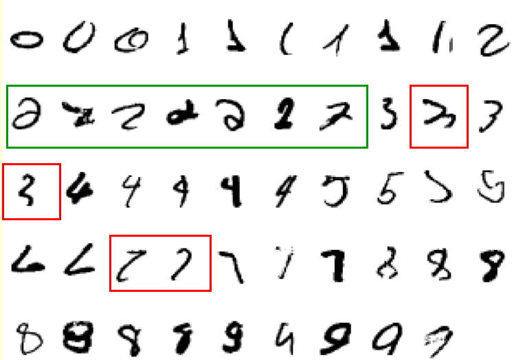

# Introduction to Machine Learning

## Why do we need machine learning

### Lecture Notes

+ What is Machine Learning?
  + difficult to write programs to solve problems like recognizing a 3D object
    + don't know how to be done in brian
    + horrendously complicated program
  + hard to write program to compute the probability of fraudulent transaction
    + no simpler and reliable rules
    + moving target

+ Machine Learning Approach
  + Collect lots of examples that specify the correct output for a given input
  + Develop a ML algorithm and then take these examples and produce a program to do the job
    + ML program different from typical hand-written program
    + Right solution works both on prediction and training datasets
    + Data changes result in parameter changes in program
  + Cheaper massive amounts of computation than salary to write a task-specific program

+ Examples for Machine Learning
  + Recognition patterns
    + Objects in real scenes
    + Facial identities or facial expressions
    + Spoken words
  + Recognizing anomalies
    + Unusual sequences of credit card transactions
    + Unusual patterns of sensor readings in a nuclear power plant
  + Prediction
    + Future stock prices or currency exchange rates
    + Which movies will a person like?

+ A Standard Example of Machine Learning in the course
  + lot of genetics done on fruit flies
    + convenient due to breed fast
    + well known
  + MNIST database of hand-written digits is the ML equivalent of fruit flies
    + publicly available and lean quite fast in a moderate-sized neural net
    + know a huge amount about how well various ML methods do on MNIST

+ Hard to say what makes a 2

  

    
  

+ The ImageNet Task
  + 1000 different object classes in 1.3 million high-resolution training images
    + best system in 2010 competition got 47% error for its first choice and 25% error for its top 5 choices
  + Jitendra Malik: this competition is a good test of whether deep neural networks work well for object recognition
    + very deep neural net (Krizhevsky et. al. 2012) gets less that 40% error for its first choice and less than 20% for its top 5 choices

+ The speech Recognition Task
  + Several stages
    + Pre-processing:
      + convert the sound wave into a vector of acoustic coefficients
      + extract a new vector about every 10 mille seconds
    + The acoustic model
      + use a few adjacent vectors of acoustic coefficients to place bets on which part of which phoneme is being spoken
    + Decoding
      + find the sequence of bets that does the best job of fitting the acoustic data
      + fit a model of the kinds of things people say
  + Deep neural networks
    + pioneered by George Dahl and Abdel-rahman Mohamed
    + replacing the previous ML method for the acoustic model

+ Phone recognition on the TIMIT benchmark
  + Procedures: 15 frames pf 40 filterbank output + their temporal derivatives --> 2000 logistic hidden units --> 2000 logistic hidden units -- (5 more layers of pre-trained weights) --> 2000 logistic hidden units -- (not pre-trained) --> 183 HMM-state labels
  + After standard post-processing using a bi-phone model, a deep net with 8 layers gets `20.7%` error rate
  + best previous speaker-independent result in TIMIT: `24.4%` and required averaging several models
  + Li Deng (at MSR) realized that this result could change the way speech recognition was done

+ Word error rates from MSR, IBM, & Google (Hinton et. al. IEEE Signal Processing Magazine, Nov. 2012)

  <table style="font-family: arial,helvetica,sans-serif;" table-layout="auto" cellspacing="0" cellpadding="5" border="1" align="center" width=90%>
    <thead>
    <tr>
      <th style="text-align: center; background-color: #3d64ff; color: #ffffff; width:20%;">The task</th>
      <th style="text-align: center; background-color: #3d64ff; color: #ffffff; width:10%;">Hours of training data</th>
      <th style="text-align: center; background-color: #3d64ff; color: #ffffff; width:10%;">Deep neural network</th>
      <th style="text-align: center; background-color: #3d64ff; color: #ffffff; width:10%;">Gaussian Mixture Model</th>
      <th style="text-align: center; background-color: #3d64ff; color: #ffffff; width:10%;">GMM with more data</th>
    </tr>
    </thead>
    <tbody>
    <tr>
      <td>Switchboard (Microsoft Research)</td><td>309</td><td>18.5%</td><td>27.4%</td><td>18.6% (2000 hrs)</td>
    </tr>
    <tr>
      <td>English broadcast news (IBM)</td><td>50</td><td>17.5%</td><td>18.8%</td><td></td>
    </tr>
    <tr>
      <td>Google voice search (Android 4.1)</td><td>5,870</td><td>12.3% (and falling)</td><td></td><td>16.0% (>>5,870 hrs)</td>
    </tr>
    </tbody>
  </table>

### Lecture Video

<video src="http://www.cs.toronto.edu/~hinton/coursera/lecture1/lec1a.mp4" preload="none" loop="loop" controls="controls" style="margin-left: 2em;" muted="" poster="http://www.multipelife.com/wp-content/uploads/2016/08/video-converter-software.png" width="180">
  <track src="subtitle" kind="captions" srclang="en" label="English" default>
  Your browser does not support the HTML5 video element.
</video> 

## What are neural networks

### Lecture Notes

+ Reasons to study neural computation
  + to understand how the brain actually works
    + big, complicated, and then die when poking --> computer simulation required
  + to understand a style of parallel computation inspired by neurons and their adaptive connections
    + different from sequential computation
    + good for things that brands are good at, e.g., vision
    + bad for things that brains are bad at, e.g., 23 x 71
  + to solve practical problems by using novel learning algorithms inspired by the brain
    + learning algorithms very useful even if they are not how the brain actually works

+ A typical cortical neuron
  + gross physical structure
    + axon: branches
    + dendritic tree: collect input from other neurons
  + Axons typically contact dendritic trees at synapses
    + a spike of activity in the axon causes charge to be injected into the post-synaptic neuron
  + Spike generation
    + axon hillock: generate outgoing spikes whenever enough charge has flowed in at synapses to depolarize the cell membrane

  

    
  

+ Synapses
  + when a spike of activity travels along an axon and arrives at a synapses it causes vesicles of transmitter chemical to be released
    + several kinds of transmitter
  + the transmitter molecules diffuse across the synaptic cleft and bind too receptor molecules in the membrane of the post-synaptic neuron thus changing their shape
    + open up holes to allow specific ions in or our

+ How synapses adapt
  + effectiveness of the synapse changes
    + vary the number of vesicles of transmitter
    + vary the number of receptor molecules
  + synapses are slow, but have advantages over RAM
    + small and low-power
    + adapt using locally available signals
      + what rules do they use to decide how to change?

+ How the brain works on one slide
  + each neuron receives inputs from other neurons
    + a few neurons also connect to receptors
    + cortical neurons use spikes to communicate
  + the effect of each input line on the neuron controlled by a synaptic weight
    + weights either positive or negative
  + synaptic weights adapt so that the whole network learns to perform useful computations
    + recognizing objects
    + understanding language
    + making plans
    + controlling the body
  + about $10^{11}$ neurons each with about $10^4$ weights
    + huge number of weights effect the computation in a very short time
    + better than a workstation

+ Modularity and the brain
  + different bits of the cortex do different things
    + local damage to the brain has specific effects
    + specific tasks increase the blood flow to specific regions
  + cortex looks pretty much the same all over
    + early brain damage makes functions relocate
  + cortex made of general purpose stuff that has the ability to turn into special purpose hardware in response to experience
    + rapid parallel computation plus flexibility
    + conventional computers get flexibility by having store sequential programs
    + require very fast central processors to perform long sequential computations

### Lecture Video

<video src="http://www.cs.toronto.edu/~hinton/coursera/lecture1/lec1b.mp4" preload="none" loop="loop" controls="controls" style="margin-left: 2em;" muted="" poster="http://www.multipelife.com/wp-content/uploads/2016/08/video-converter-software.png" width="180">
  <track src="subtitle" kind="captions" srclang="en" label="English" default>
  Your browser does not support the HTML5 video element.
</video> 

## Some simple models of neurons

### Lecture Notes

### Lecture Video

<video src="http://www.cs.toronto.edu/~hinton/coursera/lecture1/lec1c.mp4" preload="none" loop="loop" controls="controls" style="margin-left: 2em;" muted="" poster="http://www.multipelife.com/wp-content/uploads/2016/08/video-converter-software.png" width="180">
  <track src="subtitle" kind="captions" srclang="en" label="English" default>
  Your browser does not support the HTML5 video element.
</video> 

## A simple example of learning

### Lecture Notes

### Lecture Video

<video src="http://www.cs.toronto.edu/~hinton/coursera/lecture1/lec1d.mp4" preload="none" loop="loop" controls="controls" style="margin-left: 2em;" muted="" poster="http://www.multipelife.com/wp-content/uploads/2016/08/video-converter-software.png" width="180">
  <track src="subtitle" kind="captions" srclang="en" label="English" default>
  Your browser does not support the HTML5 video element.
</video> 

## Three types of learning

### Lecture Notes

### Lecture Video

<video src="http://www.cs.toronto.edu/~hinton/coursera/lecture1/lec1e.mp4" preload="none" loop="loop" controls="controls" style="margin-left: 2em;" muted="" poster="http://www.multipelife.com/wp-content/uploads/2016/08/video-converter-software.png" width="180">
  <track src="subtitle" kind="captions" srclang="en" label="English" default>
  Your browser does not support the HTML5 video element.
</video> 

