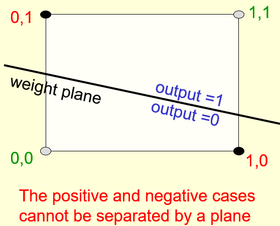

# Perceptron Learning Procedure

## An overview of the main types of network architecture

### Lecture Notes

+ Feed-forward neural networks
  + the commonest type of neural network in practice applications
    + first layer = input layer
    + last layer = output layer
    + deep neural network: more than one hidden layer
  + compute a series of transformations that change the similarities btw cases
    + activities of the neurons in each layer
    + non-linear function of the activities in the layer below

+ Recurrent networks
  + directed cycles in their connection graph
    + sometime get back to where started by following the arrows
  + complicated dynamics and difficult to train
    + a lot of interest ar present in finding efficient ways of training recurrent nets
  + more biologically realistic
  + recurrent nets with multiple hidden layers: a special case that has some of the hidden-->hidden connections missing

+ Recurrent neural networks for modeling sequences
  + a very natural way to model sequential data
    + equivalent to very deep nets with one hidden layer per time slice
    + using the same weights at every time slice and input at every time slice
  + the ability to remember information in their hidden state for a long time
    + hard to train them to use this potential

+ Example of what recurrent neural networks
  + Ilya Sutskever (2011): trained a special type of recurrent neural net to provide the next character in a sequence
  + training for a long time on a string of half a billion characters from English Wikipedia, then generate new text
    + generate by predicting the probability distribution for the next character
    + sampling a character from this distribution
  + example of this kind of text it generates: some text generated one character at a time

    ```txt
    In 1974 Northern Denver had been
    overshadowed by CNL, and several Irish
    intelligence agencies in the Mediterranean
    region. However, on the Victoria, Kings
    Hebrew stated that Charles decided to
    escape during an alliance. The mansion
    house was completed in 1882, the second in
    its bridge are omitted, while closing is the
    proton reticulum composed below it aims,
    such that it is the blurring of appearing on any
    well-paid type of box printer
    ```

+ Symmetrically connected networks
  + symmetrical connections between units, similar to recurrent networks
    + John Hopfield (and others): much easier to analyze than recurrent networks
    + more restricted in what they can do <-- obey an energy function
    + e.g., no model cycles
    + the same weight in both directions
  + Hopfield nets: symmetrically connected nets without hidden units
  + Boltzmann machines
    + symmetrically connected networks with hidden units
    + much more powerful models than Hopfield nets
    + less powerful than recurrent neural networks
    + a beautifully simple learning algorithm

<div style="margin: 0.5em; display: flex; justify-content: center; align-items: center; flex-flow: row wrap;">
  <a href="https://leonardoaraujosantos.gitbooks.io/artificial-inteligence/content/recurrent_neural_networks.html" ismap target="_blank">
    
  </a>
  <a href="url" ismap target="_blank">
    
  </a>
</div>


### Lecture Video

<video src="http://www.cs.toronto.edu/~hinton/coursera/lecture2/lec2a.mp4" preload="none" loop="loop" controls="controls" style="margin-left: 2em;" muted="" poster="http://www.multipelife.com/wp-content/uploads/2016/08/video-converter-software.png" width=180>
  <track src="subtitle" kind="captions" srclang="en" label="English" default>
  Your browser does not support the HTML5 video element.
</video><br/>


## Perceptrons: The first generation of neural networks

### Lecture Notes

+ Statistical pattern recognition and Perceptron architecture
  + Standard paradigm for statistical pattern recognition
    1. Convert the raw input vector into a vector of feature activations; <span style="color: green;">use hand-written programs based on common-sense to define the features</span>
    2. <span style="color: red;">Learn</span> how to weight each of the feature activations to get a single scalar quantity
    3. If this quantity is above some threshold, decide that the input vector is a positive example of the target class
  + The standard Perceptron architecture

    <div style="margin: 0.5em; display: flex; justify-content: center; align-items: center; flex-flow: row wrap;">
      <a href="http://www.cs.toronto.edu/~hinton/coursera/lecture2/lec2.pptx" ismap target="_blank">
        
      </a>
    </div>

+ History of Perceptrons
  + Popularized by Frank Rosenblatt in th early 1960's
    + appeared to be a very powerful learning algorithm
    + lots of grand claims were made for what they could learn to do
  + Minsky & Papert, "Perceptrons" (1969)
    + analyze what they could do and show their limitations
    + many people thought these limitations applied to all neural network models
  + Perceptron learning procedure: still widely used today for tasks with enormous feature vectors that contain many millions of features

+ Binary threshold neurons (decision units)
  + McCulloch-Pitts (1943)
    + compute a weighted sum of the inputs from other neurons (plus a bias)
    + ouput a 1 if the weighted sum exceeds zero

    $$z = b + \sum_i x_i w_i \quad y = \begin{cases}1 & \text{if } z \geq 0 \\ 0 & \text{otherwise} \end{cases}$$

+ How to learn biases using the same rule as we use for learning wights
  + threshold: equivalent to having a negative bias
  + avoid having to figure out a separate learning rule for the bias by using a trick
    + bias = a weight on an extra input line that always has an activity of 1
    + learn bias as if it were a weight

  <div style="margin: 0.5em; display: flex; justify-content: center; align-items: center; flex-flow: row wrap;">
    <a href="https://www.bo-song.com/coursera-neural-networks-for-machine-learning/" ismap target="_blank">
      
      
    </a>
  </div>

+ The perceptron convergence procedure: Training binary output neurons as classifiers
  + bias
    + add an extra component with value 1 to each input vector
    + "bias" weight on this component is minus the threshold
  + pick training cases using any policy that ensures that every training case will keep getting picked
    + correct output: leave the wights alone
    + incorrect output as 0: add the input vector to the weight vector
    + incorrect output as 1: subtract the input vector from the weight vector
  + guaranteed to find a set of weights that gets the right answer for all the training cases if any such set exists


### Lecture Video

<video src="http://www.cs.toronto.edu/~hinton/coursera/lecture2/lec2b.mp4" preload="none" loop="loop" controls="controls" style="margin-left: 2em;" muted="" poster="http://www.multipelife.com/wp-content/uploads/2016/08/video-converter-software.png" width=180>
  <track src="subtitle" kind="captions" srclang="en" label="English" default>
  Your browser does not support the HTML5 video element.
</video><br/>


## A geometrical view of perceptrons

### Lecture Notes

+ Weight space
  + the space: 1-dim per weight
  + point in the space: a particular setting of all the weights
  + each training case as a hyperplane through the origin (threshold eliminated) - black line
    + weights must lie on one side of this hyper-plan to get the answer correct
    + plane through the origin
    + plane perpendicular to the <span style="color: blue;">input vector</span>
    + the output is <span style="color: red;">wrong</span> because the scalar product of the weight vector with the input vector has the wrong sign
  + The cone of feasible solutions (put two left diagrams together to form the 3rd diagram)
    + to get all training cases right, find a point on the right side of all the planes
      + may no be any such point
    + any weight vectors that get the right answer for all cases
      + lie in a hyper-cone with its apex at the origin
      + the average of two good weight vectors is a good weight vector
      + convex problem

  <div style="margin: 0.5em; display: flex; justify-content: center; align-items: center; flex-flow: row wrap;">
    <a href="http://www.cs.toronto.edu/~hinton/coursera/lecture2/lec2.pptx" ismap target="_blank">
      
      
      
    </a>
  </div>


### Lecture Video

<video src="http://www.cs.toronto.edu/~hinton/coursera/lecture2/lec2d.mp4" preload="none" loop="loop" controls="controls" style="margin-left: 2em;" muted="" poster="http://www.multipelife.com/wp-content/uploads/2016/08/video-converter-software.png" width=180>
  <track src="subtitle" kind="captions" srclang="en" label="English" default>
  Your browser does not support the HTML5 video element.
</video><br/>


## Why the learning works

### Lecture Notes

+ Why the learning procedure works
  + consider the squared distance $d_a^2 + d_b^2$ btw any feasible weight vector and the current weight vector
  + Hopeful claim: every time the perceptron makes a mistake, then learning algorithm moves the current weight closer to all feasible weight vectors
    + Problem: weight vector not closer to this feasible vector (the left figure)
  + Solution: consider "generously feasible" weight vectors that lie within the feasible region by a margin at least as great as the length of the input vector that defines each constraint plane (the right figure)
  + Claim: every time the perceptron makes a mistake, the squared distance to all of these generously feasible weight vectors is always decreased by at least the squared length of the outdate vector

  <div style="margin: 0.5em; display: flex; justify-content: center; align-items: center; flex-flow: row wrap;">
    <a href="url" ismap target="_blank">
      
      
    </a>
  </div>

+ Informal sketch of proof of convergence
  + each time the perceptron makes a mistake, the current weight vector moves to decrease its squared distance from every weight vector in the "generously feasible" region
  + Squared distance decreases by at least the squared length of the input vector
  + after a finite number of mistakes, the weight vector must lie in the feasible region if this region exists


### Lecture Video

<video src="http://www.cs.toronto.edu/~hinton/coursera/lecture2/lec2e.mp4" preload="none" loop="loop" controls="controls" style="margin-left: 2em;" muted="" poster="http://www.multipelife.com/wp-content/uploads/2016/08/video-converter-software.png" width=180>
  <track src="subtitle" kind="captions" srclang="en" label="English" default>
  Your browser does not support the HTML5 video element.
</video><br/>


## What perceptrons can not do

### Lecture Notes

+ The limitations of Perceptrons
  + choosing the enough features by hand do almost anything
  + binary input vectors
    + a separate feature unit for each of the exponentially many binary vectors
    + make any possible discrimination on binary input vectors
    + this type pf table look-up won't generalize
  + determined hand-coded features: very strong limitations on what a perceptron can learn

+ What binary threshold neurons cannot do
  + a binary threshold output unit cannot even tell if two single bit eatures are the same
    + Positive cases (same): $(1, 1) \rightarrow 1; \quad (0, 0) \rightarrow 1$
    + Negative cases (different): $(1, 0) \rightarrow 0; \quad (0, 1) \rightarrow 0$
  + Four input-output pairs: four inequalities not possible to satisfy

    $$w_1 + w_2 \geq \theta, \; 0 \geq \theta$$

    where $w_1 < \theta, \quad w_2 < \theta$

  <div style="margin: 0.5em; display: flex; justify-content: center; align-items: center; flex-flow: row wrap;">
    <a href="https://www.bo-song.com/coursera-neural-networks-for-machine-learning/" ismap target="_blank">
      
    </a>
  </div>

+ Limitation of Binary Threshold
  + A geometric view of what binary threshold neurons cannot do
    + data-space: the axes correspond to components of an input vector
    + input vector: a point in this space
    + weight vector: a plane in data-space
    + the weight plane is perpendicular to the weight vector and misses the origin by a distance equal to the threshold
    + Example: positive & negative cases not able to separated by a plane
  + Discriminating simple patterns under translation with wrap-around
    + Use pixels as the features
    + Can a binary threshold unit discriminate between different patterns that have the same number of on pixels?<br/>
      Not if the patterns can translate with wrap-around!

  <div style="margin: 0.5em; display: flex; justify-content: center; align-items: center; flex-flow: row wrap;">
    <a href="https://www.youtube.com/watch?v=mI6jTc-8sUY&list=PLoRl3Ht4JOcdU872GhiYWf6jwrk_SNhz9&index=11&t=0s" ismap target="_blank">
      
      
    </a>
  </div>

+ Sketch proof
  + a binary decision unit cannot discriminate patterns with the same number of on pixels
  + Assumption: translation with wrap-around
  + Pattern A: using training cases in all possible translations
    + each pixel activated by 4 different translations of pattern A
    + total input received by the decision unit over all these patterns will be four times the sum of all the weights
  + Pattern B: using training cases in all possible translations
    + each pixel activated by 4 different translations of a pattern B
    + total input received by the decision unit over all these patterns will be four times the sum of all the weights
  + to discriminate correctly, every single case of pattern A must provide more input to the decision unit than every single case of pattern B
    + impossible if the sums over cases are the same

+ Why devastating for Preceptrons
  + The whole point of pattern recognition is to recognize patterns despite transformations like translations.
  + Minsky & Papert, "Group Invariance Theorem"
    + the part of a Perceptron that leas cannot learn to do this if the transformations from the group
    + translations with wrap-around from a group
  + a Perceptron to use multiple feature units to recognize transformations of informative sub-patterns
  + the tricky part of pattern recognition must be solved by the hand-coded feature detectors, not the learning procedure

+ Learning with hidden units
  + Networks without hidden units
    + very limited in the input-output mappings they can learn to model
    + more layers of linear units still linear
    + fixed output non-linearities not enough
  + Using multiple layers of adaptive, non-linear hidden units
    + how to train such nets?
    + required an efficient way of adapting all the weights, not just the last layer
    + learning the weights going into hidden units equivalent to learning features
    + difficulty: no obvious solution what the hidden units should do


### Lecture Video

<video src="https://youtu.be/mI6jTc-8sUY?list=PLoRl3Ht4JOcdU872GhiYWf6jwrk_SNhz9" preload="none" loop="loop" controls="controls" style="margin-left: 2em;" muted="" poster="http://www.multipelife.com/wp-content/uploads/2016/08/video-converter-software.png" width=180>
  <track src="subtitle" kind="captions" srclang="en" label="English" default>
  Your browser does not support the HTML5 video element.
</video><br/>

