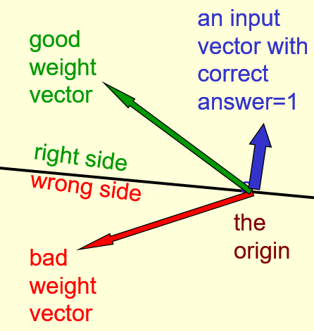

# Perceptron Learning Procedure

## An overview of the main types of network architecture

### Lecture Notes

+ Feed-forward neural networks
  + the commonest type of neural network in practice applications
    + first layer = input layer
    + last layer = output layer
    + deep neural network: more than one hidden layer
  + compute a series of transformations that change the similarities btw cases
    + activities of the neurons in each layer = non-linear function of the activities in the layer below

+ Recurrent networks (left diagram)
  + directed cycles in their connection graph
    + sometime get back to where started by following the arrows
  + complicated dynamics and difficult to train
    + a lot of interest at present in finding efficient ways of training recurrent nets
  + more biologically realistic
  + recurrent nets with multiple hidden layers: a special case w/ some missing hidden-->hidden connections

<div style="margin: 0.5em; display: flex; justify-content: center; align-items: center; flex-flow: row wrap;">
  <a href="https://leonardoaraujosantos.gitbooks.io/artificial-inteligence/content/recurrent_neural_networks.html" ismap target="_blank">
    
  </a>
  <a href="http://www.cs.toronto.edu/~hinton/coursera/lecture2/lec2.pptx" ismap target="_blank">
    
  </a>
  <a href="https://nthu-datalab.github.io/ml/labs/13_Sentiment_Analysis_and_Neural_Machine_Translation/13_Sentiment_Analysis_and_Neural_Machine_Translation.html" ismap target="_blank">
    
  </a>
</div>

+ Recurrent neural networks for modeling sequences (middle & right diagrams)
  + a very natural way to model sequential data
    + equivalent to very deep nets with one hidden layer per time slice
    + using the same weights at every time slice and input at every time slice
  + the ability to remember information in their hidden state for a long time
    + hard to train them to use this potential

+ Example of what recurrent neural networks
  + Ilya Sutskever (2011): trained a special type of recurrent neural net to provide the next character in a sequence
  + training from English Wikipedia, then generating new text
    + generate by predicting the probability distribution for the next character
    + sampling a character from this distribution
  + example of this kind of text it generates: some text generated one character at a time

    ```txt
    In 1974 Northern Denver had been overshadowed by CNL, and several Irish
    intelligence agencies in the Mediterranean region. However, on the Victoria, Kings
    Hebrew stated that Charles decided to escape during an alliance. The mansion
    house was completed in 1882, the second in its bridge are omitted, while closing is the
    proton reticulum composed below it aims, such that it is the blurring of appearing on any
    well-paid type of box printer
    ```

+ Symmetrically connected networks
  + John Hopfield (and others): symmetrical connections between units, similar to recurrent networks
    + much easier to analyze than recurrent networks
    + more restricted in what they can do $\leftarrow$ obey an energy function
    + e.g., no model cycles
    + the same weight in both directions
  + Hopfield nets: symmetrically connected nets without hidden units
  + Boltzmann machines
    + symmetrically connected networks with hidden units
    + much more powerful models than Hopfield nets
    + less powerful than recurrent neural networks
    + a beautifully simple learning algorithm

<div style="margin: 0.5em; display: flex; justify-content: center; align-items: center; flex-flow: row wrap;">
  <a href="https://towardsdatascience.com/the-mostly-complete-chart-of-neural-networks-explained-3fb6f2367464" ismap target="_blank">
    
  </a>
</div>


### Lecture Video

<video src="http://www.cs.toronto.edu/~hinton/coursera/lecture2/lec2a.mp4" preload="none" loop="loop" controls="controls" style="margin-left: 2em;" muted="" poster="http://www.multipelife.com/wp-content/uploads/2016/08/video-converter-software.png" width=180>
  <track src="subtitle" kind="captions" srclang="en" label="English" default>
  Your browser does not support the HTML5 video element.
</video><br/>


## Perceptrons: The first generation of neural networks

### Lecture Notes

+ Statistical pattern recognition and Perceptron architecture
  + Standard paradigm for statistical pattern recognition
    1. Convert the raw input vector into a vector of feature activations; <span style="color: green;">use hand-written programs based on common-sense to define the features</span>
    2. <span style="color: red;">Learn</span> how to weight each of the feature activations to get a single scalar quantity
    3. quantity > threshold, decide that the input vector is a positive example of the target class
  + The standard Perceptron architecture and orthers

    <div style="margin: 0.5em; display: flex; justify-content: center; align-items: center; flex-flow: row wrap;">
      <a href="http://www.cs.toronto.edu/~hinton/coursera/lecture2/lec2.pptx" ismap target="_blank">
        
      </a>
      <a href="https://sebastianraschka.com/Articles/2015_singlelayer_neurons.html" ismap target="_blank">
        
      </a>
    </div>
    <div style="margin: 0.5em; display: flex; justify-content: center; align-items: center; flex-flow: row wrap;">
      <a href="https://towardsdatascience.com/perceptron-the-artificial-neuron-4d8c70d5cc8d" ismap target="_blank">
        
      </a>
      <a href="https://www.researchgate.net/figure/The-McCulloch-Pitts-Neuron_fig1_265486784" ismap target="_blank">
        
      </a>
    </div>

+ History of Perceptrons
  + Popularized by Frank Rosenblatt in th early 1960's
    + appeared to be a very powerful learning algorithm
    + lots of grand claims were made for what they could learn to do
  + Minsky & Papert, "Perceptrons" (1969)
    + analyze what they could do and show their limitations
    + many people thought these limitations applied to all neural network models
  + Perceptron learning procedure: still widely used today for tasks with enormous feature vectors that contain many millions of features

+ Binary threshold neurons (decision units): McCulloch-Pitts (1943) (left figure)
  + compute a weighted sum of the inputs from other neurons (plus a bias)
  + output a 1 if the weighted sum exceeds zero

    $$z = b + \sum_i x_i w_i \quad y = \begin{cases}1 & \text{if } z \geq 0 \\ 0 & \text{otherwise} \end{cases}$$

+ How to learn biases using the same rule as we use for learning weights (right figure)
  + threshold: equivalent to having a negative bias
  + avoid having to figure out a separate learning rule for the bias by using a trick
    + bias = a weight on an extra input line that always has an activity of 1
    + learn bias as if it were a weight

  <div style="margin: 0.5em; display: flex; justify-content: center; align-items: center; flex-flow: row wrap;">
    <a href="https://www.bo-song.com/coursera-neural-networks-for-machine-learning/" ismap target="_blank">
      
      
    </a>
  </div>

+ The perceptron convergence procedure: Training binary output neurons as classifiers
  + bias
    + add an extra component with value 1 to each input vector
    + "bias" weight on this component is minus the threshold
  + pick training cases using any policy that ensures that every training case will keep getting picked
    + correct output: leave the wights alone
    + incorrect output as 0: add the input vector to the weight vector
    + incorrect output as 1: subtract the input vector from the weight vector
  + guaranteed to find a set of weights that gets the right answer for all the training cases if any such set exists


### Lecture Video

<video src="http://www.cs.toronto.edu/~hinton/coursera/lecture2/lec2b.mp4" preload="none" loop="loop" controls="controls" style="margin-left: 2em;" muted="" poster="http://www.multipelife.com/wp-content/uploads/2016/08/video-converter-software.png" width=180>
  <track src="subtitle" kind="captions" srclang="en" label="English" default>
  Your browser does not support the HTML5 video element.
</video><br/>


## A geometrical view of perceptrons

### Lecture Notes

+ Weight space
  + the __space__: 1-dim per weight
  + __point__ in the space: a particular setting of all the weights
  + each training case as a <span style="color: red; font-weight: bold;">hyperplane</span> through the origin (threshold eliminated) - black line
    + weights must lie on one side of this hyper-plan to get the answer correct
    + plane through the origin
    + plane perpendicular to the <span style="color: blue;">input vector</span>
    + the output is <span style="color: red;">wrong</span> because the scalar product of the weight vector with the input vector has the wrong sign
  + The cone of feasible solutions (put two left diagrams together to form the 3rd diagram)
    + to get all training cases right, find a point on the right side of all the planes
      + may no be any such point
    + any weight vectors that get the right answer for all cases
      + lie in a hyper-cone with its apex at the origin
      + the average of two good weight vectors is a good weight vector
      + convex problem

  <div style="margin: 0.5em; display: flex; justify-content: center; align-items: center; flex-flow: row wrap;">
    <a href="http://www.cs.toronto.edu/~hinton/coursera/lecture2/lec2.pptx" ismap target="_blank">
      
      
      
    </a>
  </div>


### Lecture Video

<video src="http://www.cs.toronto.edu/~hinton/coursera/lecture2/lec2d.mp4" preload="none" loop="loop" controls="controls" style="margin-left: 2em;" muted="" poster="http://www.multipelife.com/wp-content/uploads/2016/08/video-converter-software.png" width=180>
  <track src="subtitle" kind="captions" srclang="en" label="English" default>
  Your browser does not support the HTML5 video element.
</video><br/>


## Why the learning works

### Lecture Notes

+ Why the learning procedure works
  + Assume that procetrons learned to get that the precctrons get the the vector (feasible green dot), if exists, for all the training case right
  + Idea: every time a training case gets wrong, the current vector will be updated to make it closer to every feasible vector
  + Squared distance - unable to prove (the left figure)
    + consider the squared distance $d_a^2 + d_b^2$ btw any feasible weight vector and the current weight vector
    + Hopeful claim: every time the perceptron makes a mistake, then learning algorithm moves the current weight closer to __all feasible weight vectors__
    + Problem: weight vector not closer to this feasible vector
      + There is a feasible vector (the gold dot) just the right side of the plane defined on the training cases
      + the current weight vector is just the wrong side of the training cases
      + the input vector is quite big, so adding the input vector to the current vector makes it further away from the gold feasible vector
      + Contrary to the statement "__all__ feasible weight vectors"
  + Margin - problem fixed (the right figure)
    + consider "generously feasible" weight vectors that lie within the __feasible region__ by a __margin__ at least as great as the length of the input vector that defines each constraint plane
    + Claim: every time the perceptron makes a mistake, the squared distance to all of these generously feasible weight vectors is always decreased by at least the squared length of the update vector

  <div style="margin: 0.5em; display: flex; justify-content: center; align-items: center; flex-flow: row wrap;">
    <a href="url" ismap target="_blank">
      
      
    </a>
  </div>

+ Informal sketch of proof of convergence
  + each time the perceptron makes a mistake, the current weight vector moves to decrease its squared distance from every weight vector in the "generously feasible" region
  + Squared distance decreases by at least the squared length of the input vector
  + after a finite number of mistakes, the weight vector must lie in the feasible region <span style="color: red;">if this region exists</span>


### Lecture Video

<video src="http://www.cs.toronto.edu/~hinton/coursera/lecture2/lec2e.mp4" preload="none" loop="loop" controls="controls" style="margin-left: 2em;" muted="" poster="http://www.multipelife.com/wp-content/uploads/2016/08/video-converter-software.png" width=180>
  <track src="subtitle" kind="captions" srclang="en" label="English" default>
  Your browser does not support the HTML5 video element.
</video><br/>


## What perceptrons can not do

### Lecture Notes

+ The limitations of Perceptrons
  + choosing the enough features by hand do almost anything
  + E.g., discriminate binary input vectors
    + with a binary input unit vector, create a separate feature unit that gets activated by exactly one of those binary input vectors
    + required exponentially many feature units to make any possible discrimination on binary input vectors
    + no limitation if making enough feature units
    + this type of table look-up won't generalize
  + hand-coded features determined: very strong limitations on what a perceptron can learn
  + E.g., what binary threshold neurons cannot do
    + a binary threshold output unit cannot even tell if two single bit features are the same
      + Positive cases (same): $(1, 1) \rightarrow 1; \quad (0, 0) \rightarrow 1$
      + Negative cases (different): $(1, 0) \rightarrow 0; \quad (0, 1) \rightarrow 0$
    + Four input-output pairs: four inequalities not possible to satisfy

      $$(1, 1): w_1 + w_2 \geq \theta; \quad (0, 0): 0 \geq \theta; \quad (1, 0): w_1 < \theta; \quad (0, 1): w_2 < \theta$$

    + standard perceptron model unable to satisfy the four conditions

+ Interpretation of Binary Threshold
  + A geometric view of what binary threshold neurons cannot do (left figure)
    + data-space: the axes correspond to components of an input vector
    + input vector: a point in data space
    + weight vector: a plane in data-space
    + the weight plane is perpendicular to the weight vector and misses the origin by a distance equal to the threshold
    + positive & negative cases not able to separated by a plane
  + Discriminating simple patterns under translation with wrap-around (right figure)
    + Use pixels as the features
      + Pattern A (positive): four pixels of black and translate to the right, 3rd pattern translates with wrap-around
      + Pattern B (negative): four pixels of black and translate to the right, 3rd pattern translates with wrap-around
    + Can a binary threshold unit discriminate between different patterns that have the same number of on pixels?
      + No, it cannot discriminate two patterns with same number of pixels if the discrimination has to work when the patterns are translated and wrap-around
      + No threshold can always accept Pattern A and reject Pattern B

  <div style="margin: 0.5em; display: flex; justify-content: center; align-items: center; flex-flow: row wrap;">
    <a href="https://www.youtube.com/watch?v=mI6jTc-8sUY&list=PLoRl3Ht4JOcdU872GhiYWf6jwrk_SNhz9&index=11&t=0s" ismap target="_blank">
      
      
    </a>
  </div>

+ Sketch proof of Discriminating simple patterns under translation with wrap-around
  + Claim: a binary decision unit cannot discriminate patterns with the same number of on pixels with <span style="color: darkred;">translation and wrap-around</span>
  + Each pixel is activated by 4 different translations of both Pattern A and B
    + 4 different positions in which pattern A/B will activate that pixel
    + each pixel will be activated by 4 different translations of pattern A/B
  + Total input received by the decision unit over all these patterns will be four times the sum of all the weights for both Pattern A & B
    + each pixel will activate the decision unit 4 different times
    + sum of the pattern will get 4 times the sum of the weights
  + No threshold can always accept A & reject B
  + to discriminate correctly, every single case of pattern A must provide more input to the decision unit than every single case of pattern B
    + impossible if the sums over cases are the same

+ Why devastating for Preceptrons
  + The whole point of pattern recognition is to recognize patterns despite transformations like translations.
  + Minsky & Papert, "Group Invariance Theorem"
    + the part of a Perceptron that learns CANNOT learn to do this if the transformations form the group
    + the exaggerated claim: perceptrons could learn anything
    + careful chosen features to make it easy for the last stage to learn the classification
    + translations with wrap-around form a group -> impossible to discriminate
  + a Perceptron to use multiple feature units to recognize transformations of informative sub-patterns
    + required separate feature units for each position of those informative sub-patterns
    + the tricky part of pattern recognition must be solved by the hand-coded feature detectors, not the learning procedure
  + Is Neural network bad according to the above theorem??

+ Learning with hidden units
  + Networks without hidden units
    + very limited in the input-output mappings they can learn to model
    + more layers of linear units still linear
    + fixed output non-linearity not enough to represent the non-linearity characteristics of problem
  + Solution: using multiple layers of __adaptive__, non-linear hidden units
    + how to train such nets?
    + required an efficient way of adapting __all__ the weights, not just the last layer
    + learning the weights going into hidden units equivalent to learning features
    + difficulty: no obvious solution what the hidden units should do


### Lecture Video

<video src="https://youtu.be/mI6jTc-8sUY?list=PLoRl3Ht4JOcdU872GhiYWf6jwrk_SNhz9" preload="none" loop="loop" controls="controls" style="margin-left: 2em;" muted="" poster="http://www.multipelife.com/wp-content/uploads/2016/08/video-converter-software.png" width=180>
  <track src="subtitle" kind="captions" srclang="en" label="English" default>
  Your browser does not support the HTML5 video element.
</video><br/>

