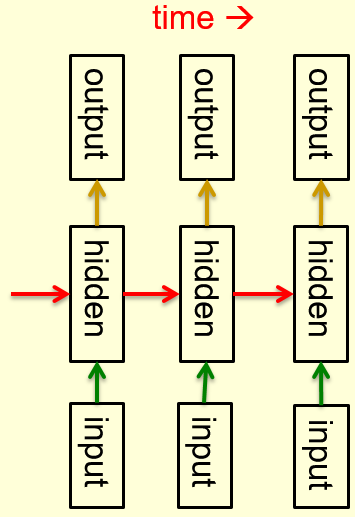

# Perceptron Learning Procedure

## An overview of the main types of network architecture

### Lecture Notes

+ Feed-forward neural networks
  + the commonest type of neural network in practice applications
    + first layer = input layer
    + last layer = output layer
    + deep neural network: more than one hidden layer
  + compute a series of transformations that change the similarities btw cases
    + activities of the neurons in each layer
    + non-linear function of the activities in the layer below

+ Recurrent networks
  + directed cycles in their connection graph
    + sometime get back to where started by following the arrows
  + complicated dynamics and difficult to train
    + a lot of interest ar present in finding efficient ways of training recurrent nets
  + more biologically realistic
  + recurrent nets with multiple hidden layers: a special case that has some of the hidden-->hidden connections missing

+ Recurrent neural networks for modeling sequences
  + a very natural way to model sequential data
    + equivalent to very deep nets with one hidden layer per time slice
    + using the same weights at every time slice and input at every time slice
  + the ability to remember information in their hidden state for a long time
    + hard to train them to use this potential

+ Example of what recurrent neural networks
  + Ilya Sutskever (2011): trained a special type of recurrent neural net to provide the next character in a sequence
  + training for a long time on a string of half a billion characters from English Wikipedia, then generate new text
    + generate by predicting the probability distribution for the next character
    + sampling a character from this distribution
  + example of this kind of text it generates: some text generated one character at a time

    ```txt
    In 1974 Northern Denver had been
    overshadowed by CNL, and several Irish
    intelligence agencies in the Mediterranean
    region. However, on the Victoria, Kings
    Hebrew stated that Charles decided to
    escape during an alliance. The mansion
    house was completed in 1882, the second in
    its bridge are omitted, while closing is the
    proton reticulum composed below it aims,
    such that it is the blurring of appearing on any
    well-paid type of box printer
    ```

+ Symmetrically connected networks
  + symmetrical connections between units, similar to recurrent networks
    + John Hopfield (and others): much easier to analyze than recurrent networks
    + more restricted in what they can do <-- obey an energy function
    + e.g., no model cycles
    + the same weight in both directions
  + Hopfield nets: symmetrically connected nets without hidden units
  + Boltzmann machines
    + symmetrically connected networks with hidden units
    + much more powerful models than Hopfield nets
    + less powerful than recurrent neural networks
    + a beautifully simple learning algorithm

<div style="margin: 0.5em; display: flex; justify-content: center; align-items: center; flex-flow: row wrap;">
  <a href="https://leonardoaraujosantos.gitbooks.io/artificial-inteligence/content/recurrent_neural_networks.html" ismap target="_blank">
    
  </a>
  <a href="url" ismap target="_blank">
    
  </a>
</div>


### Lecture Video

<video src="http://www.cs.toronto.edu/~hinton/coursera/lecture2/lec2a.mp4" preload="none" loop="loop" controls="controls" style="margin-left: 2em;" muted="" poster="http://www.multipelife.com/wp-content/uploads/2016/08/video-converter-software.png" width=180>
  <track src="subtitle" kind="captions" srclang="en" label="English" default>
  Your browser does not support the HTML5 video element.
</video><br/>


## Perceptrons: The first generation of neural networks

### Lecture Notes

+ Statistical pattern recognition and Perceptron architecture
  + Standard paradigm for statistical pattern recognition
    1. Convert the raw input vector into a vector of feature activations; <span style="color: green;">use hand-written programs based on common-sense to define the features</span>
    2. <span style="color: red;">Learn</span> how to weight each of the feature activations to get a single scalar quantity
    3. If this quantity is above some threshold, decide that the input vector is a positive example of the target class
  + The standard Perceptron architecture

    <div style="margin: 0.5em; display: flex; justify-content: center; align-items: center; flex-flow: row wrap;">
      <a href="http://www.cs.toronto.edu/~hinton/coursera/lecture2/lec2.pptx" ismap target="_blank">
        
      </a>
    </div>

+ History of Perceptrons
  + Popularized by Frank Rosenblatt in th early 1960's
    + appeared to be a very powerful learning algorithm
    + lots of grand claims were made for what they could learn to do
  + Minsky & Papert, "Perceptrons" (1969)
    + analyze what they could do and show their limitations
    + many people thought these limitations applied to all neural network models
  + Perceptron learning procedure: still widely used today for tasks with enormous feature vectors that contain many millions of features

+ Binary threshold neurons (decision units)
  + McCulloch-Pitts (1943)
    + compute a weighted sum of the inputs from other neurons (plus a bias)
    + ouput a 1 if the weighted sum exceeds zero

    $$z = b + \sum_i x_i w_i \quad y = \begin{cases}1 & \text{if } z \geq 0 \\ 0 & \text{otherwise} \end{cases}$$

+ How to learn biases using the same rule as we use for learning wights
  + threshold: equivalent to having a negative bias
  + avoid having to figure out a separate learning rule for the bias by using a trick
    + bias = a weight on an extra input line that always has an activity of 1
    + learn bias as if it were a weight

  <div style="margin: 0.5em; display: flex; justify-content: center; align-items: center; flex-flow: row wrap;">
    <a href="https://www.bo-song.com/coursera-neural-networks-for-machine-learning/" ismap target="_blank">
      
      
    </a>
  </div>

+ The perceptron convergence procedure: Training binary output neurons as classifiers
  + bias
    + add an extra component with value 1 to each input vector
    + "bias" weight on this component is minus the threshold
  + pick training cases using any policy that ensures that every training case will keep getting picked
    + correct output: leave the wights alone
    + incorrect output as 0: add the input vector to the weight vector
    + incorrect output as 1: subtract the input vector from the weight vector
  + guaranteed to find a set of weights that gets the right answer for all the training cases if any such set exists


### Lecture Video

<video src="http://www.cs.toronto.edu/~hinton/coursera/lecture2/lec2b.mp4" preload="none" loop="loop" controls="controls" style="margin-left: 2em;" muted="" poster="http://www.multipelife.com/wp-content/uploads/2016/08/video-converter-software.png" width=180>
  <track src="subtitle" kind="captions" srclang="en" label="English" default>
  Your browser does not support the HTML5 video element.
</video><br/>


## A geometrical view of perceptrons

### Lecture Notes


### Lecture Video

<video src="http://www.cs.toronto.edu/~hinton/coursera/lecture2/lec2c.mp4" preload="none" loop="loop" controls="controls" style="margin-left: 2em;" muted="" poster="http://www.multipelife.com/wp-content/uploads/2016/08/video-converter-software.png" width=180>
  <track src="subtitle" kind="captions" srclang="en" label="English" default>
  Your browser does not support the HTML5 video element.
</video><br/>


## Why the learning works

### Lecture Notes


### Lecture Video

<video src="http://www.cs.toronto.edu/~hinton/coursera/lecture2/lec2d.mp4" preload="none" loop="loop" controls="controls" style="margin-left: 2em;" muted="" poster="http://www.multipelife.com/wp-content/uploads/2016/08/video-converter-software.png" width=180>
  <track src="subtitle" kind="captions" srclang="en" label="English" default>
  Your browser does not support the HTML5 video element.
</video><br/>


## What perceptrons can not do

### Lecture Notes


### Lecture Video

<video src="http://www.cs.toronto.edu/~hinton/coursera/lecture2/lec2e.mp4" preload="none" loop="loop" controls="controls" style="margin-left: 2em;" muted="" poster="http://www.multipelife.com/wp-content/uploads/2016/08/video-converter-software.png" width=180>
  <track src="subtitle" kind="captions" srclang="en" label="English" default>
  Your browser does not support the HTML5 video element.
</video><br/>

