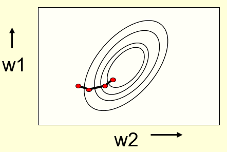

# Backpropagation Learning Procedure
  
## Learning the weights of a linear neuron

### Lecture Notes

+ Perceptron: the weights are always getting closer to a good set of weights

+ Linear neuron: the output always getting closer to target outputs

+ Perceptron learning procedure unable to generalize to hidden layers
  + perceptron convergence procedure
    + every time the weights change, get closer to every "generously feasible" set of weights
    + No guarantee to be extended to more complex networks
    + the average of two good solutions may be a bad solution
  + multi-layer neural networks not using the perceptron learning procedure
    + Never called multi-layer perceptrons

+ A different way to show that a learning procedure makes progress
  + Weight and target values
    + Statement: Instead of showing the weights get closer to a good set of weights, show that the actual output values get closer the target values
    + true even for non-convex problems that averaging different good sets of weights may give a bad set of weights
    + Not true for perceptron learning: the outputs as a whole can get further away from the target output even the weights are getting closer to good sets of weights
  + simplest example: a linear neuron with a squared error measure

+ Linear neurons
  + a.k.a linear filters in EE
  + real-valued output = weighted sum of its inputs

    $$y = \sum_i w_i x_i = \mathbf{W}^T \mathbf{x}$$

    + $y$: neuron's estimate the desired output
    + $\mathbf{W}$: weight vector
    + $\mathbf{x}$: input vector
  + aim of learning (objective): to minimize the error summed over all training cases
  + error (measure): the squared difference btw the desired output and the actual output

+ Why not solved analytically?
  + Standard engineering approach: straight-forward to write down
    + a set of equations
    + one per training case
    + to solve for the best set of weights
    + but not used, why?
  + Scientific answer
    + objective: find a method that real neurons could use
    + understand what real neurons might be doing
    + probably not solving equations symbolically
  + Engineering answer
    + objective: find a method that can be generalized to multi-layer, non-linear neural networks
    + analytic solution: based on linearity and squared error measure
    + iterative methods: less efficient but much easier to generalize

+ Example: illustrate the iterative method
  + Get lunch at the cafeteria every day
    + diet: fish, chips, and ketchup
    + several portions of each
  + Cashier only told the total price of the meal
  + Question: figure out the price of each portion after several days
  + iterative approach
    + start with random guesses for the prices
    + adjust them to get a better fir to the observed prices of whole meals

  + Solving the equations iteratively
    + Each meal price gives a linear constraint on the prices of the portions

      $$price = x_{fish} w_{fish} + x_{chips} w_{chips} + x_{ketchup} w_{ketchup}$$
    
    + The prices of the portions are like the weights in of a linear neuron

      $$\mathbf{W} = (w_{fish}, w_{chips}, w_{ketchup})$$

    + Start with guesses for the weights and then adjust the guesses slightly to give a better fit to the prices given by the cashier

  + A model of the cashier with arbitrary initial weights
    + Residual error = 350
    + the "delta-rule" for learning is: $\Delta w_i = \varepsilon x_i(t - y)$
    + with a learning rate $\varepsilon = 1/35$, the weight changes $ = (+20, +50, +30)$
    + The new weights: $(70, 100, 80)$
    + The weight for chips got worse
    + No guarantee the way of learning theta individual weights will keep getting better
    + Only the difference btw cashier & estimation

    

      
    

+ Deriving the delta rule
  + Define the error as the squared residuals summed over all training cases

    $$E = \displaystyle \frac{1}{2} \sum_{n \in training} (t^n - y ^n)^2$$

    + $1/2$: cancel 2 when differentiating

  + Now differentiate to get error derivatives for weights

    $$\dfrac{\partial E}{\partial w_i} = \frac{1}{2} \sum_n \dfrac{\partial y^n}{\partial w_i} \dfrac{dE^n}{dy^n} = - \sum_n x_i^n (t^n - y^n)$$

    + applying chain rule
    + explain how the output changes as we change the weights times how the error changes as we change the output
    + $\partial w_i$: many ways to change the output but just considering the change of the weight $w_i$
    + $\partial y^n / \partial w_i = x_i^n$ where $y^n = w_i \times x_i^n$
    + $d E / dy^n = 1/2 \times 2 \cdot (t^n - y^n) \cdot \frac{\partial}{\partial y^n} (t^n - y^n) = - (t^n - y^n)$

  + The batch delta rule changes the weights in portion to their derivatives summed over all training cases

    $$\Delta w_i = -\varepsilon \dfrac{\partial E}{\partial w_i} = \sum_n \varepsilon x_i^n (t^n - y^n)$$

+ Behavior of the iterative learning procedure
  + Does the learning procedure eventually get the right answer?
    + There may be no perfect answer
      + after providing the linear neuron a bunch of training cases with desired answers but no set of weights giving the desired answer
      + still some set of weights that gets the best approximation on all training cases minimizes the error measure summed over all training cases
    + by making the learning rate small enough we can get as close as we desire to the best answer
  + How quickly do the weights converge to their correct values?
    + very slow if two input dimensions are highly correlated
    + almost always have the same number of portions of ketchup and chips
    + hard to decide how to divide the price btw ketchup and chips

+ online delta-rule vs learning rule for perceptrons
  + perceptron learning
    + increment or decrement the weight vector by the input vector
    + only change the weights when making an error
  + online version of the delta-rule
    + increment or decrement the weight vector by the input vector but scaled by the residual error and the learning rate
    + choose a learning rate --> annoying
      + too big --> unstable
      + too small --> slow

### Lecture Video

<video src="https://youtu.be/Q0mTl9dQ4_I?list=PLoRl3Ht4JOcdU872GhiYWf6jwrk_SNhz9" preload="none" loop="loop" controls="controls" style="margin-left: 2em;" muted="" poster="http://www.multipelife.com/wp-content/uploads/2016/08/video-converter-software.png" width=180>
  <track src="subtitle" kind="captions" srclang="en" label="English" default>
  Your browser does not support the HTML5 video element.
</video> 

## The error surface for a linear neuron

### Lecture Notes

+ The error surface in extended weight space
  + error surface in a space
    + horizontal axis: weight
    + vertical axis: error
  + Linear neuron with a squared error
    + quadratic bowl: linear neuron with a squared error
    + parabolas: vertical cross-sections
    + ellipses: horizontal cross-sections
  + multi-layer, non-linear nets: much more complicated
    + smooth curves
    + local minima
  + pictorial view of gradient descent learning using Delta rule

  

    
    
  

+ Online vs batch learning
  + Simplest kind of batch learning (left diagram)
    + elliptical contour lines
    + steepest descent on the error surface
    + travel perpendicular to the contour lines
    + batch learning: the gradient descent summed over all training cases
  + simplest kind of online learning (right diagram)
    + online learning: update the weights in proportion to the gradient after each training case
    + zig-zag around the direction of steepest descent

  

    
  

+ Why learning can be slow
  + elongated ellipse: the direction of steepest descent almost perpendicular to the direction towards the minimum
  + the red gradient descent: 
    + large component along the short axis of the ellipse
    + small component along the long axis of th ellipse
  + opposite of what intended

  

    
  

### Lecture Video

<video src="https://youtu.be/tIovUOirJkE?list=PLoRl3Ht4JOcdU872GhiYWf6jwrk_SNhz9" preload="none" loop="loop" controls="controls" style="margin-left: 2em;" muted="" poster="http://www.multipelife.com/wp-content/uploads/2016/08/video-converter-software.png" width=180>
  <track src="subtitle" kind="captions" srclang="en" label="English" default>
  Your browser does not support the HTML5 video element.
</video> 

## Learning the weights of a logistic output neuron

### Lecture Notes

+ Logistic neurons
  + output: real value
  + a smooth and bounded function of their total input
  + nice derivatives making learning easy

  $$z = b + \sum_i x_i w_i \qquad y = \frac{1}{1 + e^{-z}}$$

  

    
  

  + Derivatives of the logit, $z$ w.r.t. the inputs and the weights are very simple

    $$z = b + \sum_i x_i w_i \quad \Rightarrow \quad \frac{\partial z}{\partial w_i} = x_i \quad \& \quad \frac{\partial z}{\partial x_i} = w_i$$

  + Derivative of the output w.r.t. the logit

    $$y = \frac{1}{1 + e^{-z}} \quad \Rightarrow \quad \frac{dy}{dz} = y(1-y)$$

+ Derivatives of a logistic neuron

  $$\begin{array}{rcl} y & = & \dfrac{1}{1 + e^{-z}} = (1 + e^{-z})^{-1} \\ \dfrac{dy}{dz} &=& \frac{-1 (-e^{-z})}{1 + e^{-z}} = \left( \frac{1}{1 + e^{-z}} \right) \left( \frac{e^{-z}}{1+e^{-z}} \right) = y(1-y) \\ \text{because } & & \frac{e^{-z}}{1 + e^{-z}} = \frac{(1+e^{-z}) - 1}{1 + e^{-z}} = \frac{(1+e^{-z})}{1+e^{-z}} \frac{-1}{1+e^{-z}} = 1- y \end{array}$$

+ Using the chain rule to get the derivatives

  

    
  

### Lecture Video

<video src="https://youtu.be/Z8jzCvb62e8?list=PLoRl3Ht4JOcdU872GhiYWf6jwrk_SNhz9" preload="none" loop="loop" controls="controls" style="margin-left: 2em;" muted="" poster="http://www.multipelife.com/wp-content/uploads/2016/08/video-converter-software.png" width=180>
  <track src="subtitle" kind="captions" srclang="en" label="English" default>
  Your browser does not support the HTML5 video element.
</video> 

## The backpropagation algorithm

### Lecture Notes

+ Learning with hidden units
  + network w/o hidden units: limited in the input-output mappings they can model
  + adding a layer of hand-coded features (as in a perceptron)
    + more powerful but hard to design the features
    + finding good features w/o requiring insights into the task or repeated trial and error
    + guess features and see how well they work
  + automate the loop of designing features for a particular task and seeing ho well they work

+ Learning by perturbing weights
  + Original idea
    + randomly perturb __one weight__ and see if it improves performance
    + save the change if performance improved
    + a form of reinforcement learning
    + Very inefficient:
      + multiple forward passes on a representative set of training cases just to change one weight
      + backpropagation much better
    + large weight perturbations always make things __worse__ when towards the end of learning weights required to have the right relative values
  + Alternative - slightly improved
    + randomly perturb all the __weights in parallel__ and correlate the performance gain with the weight changes
    + not any better
    + required lots of trials on each training case
    + observe the effect of changing one weight through the noise created by the changes to other weights
  + Better idea
    + randomly perturb the __activities__ of the hidden units
    + compute how to change the weights once the objective of a hidden activity on a given training case is   known
    + fewer activities than weights
    + backpropagation still wins by a factor of the number of neurons

+ The ideal behind backpropagation
  + Knowing what actions in the hidden units
    + compute how fast the error changes as a hidden activity changed
    + using error derivatives w.r.t. hidden activities instead of using desired activities to train the hidden units
    + each hidden activity able to effect many output units
    + combining the separate effect of errors
  + compute error derivatives for all the hidden unit efficiently at the same time
    + obtain the error derivatives for the weights going into a hidden unit

+ Sketch of the backpropagation algorithm on a single case
  + convert the discrepancy btw each output and its target value into an error derivative
  + compute error derivatives in each hidden layer from error derivatives in the layer above
  + using error derivatives w.r.t activities to get error derivatives w.r.t. the incoming weights

  $$\begin{array}{rcl}E &=& \frac{1}{2} \displaystyle \sum_{j \in output} (t_j - y_j)^2 \\ \frac{\partial E}{\partial y_j} & = & -(t_j - y_j) \end{array}$$

+ Backpropagating $dE/dy$

  $$\begin{array}{rcl} \dfrac{\partial E}{\partial z_j} & = & \dfrac{dy_j}{dz_j} \dfrac{\partial E}{\partial y_j} = y_j(1- y_j)\dfrac{\partial E}{\partial y_j} \\ \dfrac{\partial E}{\partial y_j} &=& \displaystyle \sum_j \dfrac{dz_j}{dy_i} \dfrac{\partial E}{\partial z_j} = \sum_j w_{ij} \dfrac{\partial E}{\partial z_j} \\ \dfrac{\partial E}{\partial w_{ij}} &=& \dfrac{\partial z_j}{\partial w_{ij}} \dfrac{\partial E}{\partial z_j} = y_i \dfrac{\partial E}{\partial z_j} \end{array}$$

  

    
  

  + assume using sigmoid function w/ output unit (logistic unit) $j$
  + $z_j$: the combined outputs as the input of unit $j$
  + $y_i$: output of unit $i$
  + $\frac{\partial E}{\partial y_i}$: the change of $E$ (equals to the sum of all changes on outputs) w.r.t. the change of $y_i$
  + $\frac{\partial E}{\partial w_{ij}}$: the change of $E$ w.r.t. the change of weights $w_{ij}$

### Lecture Video

<video src="https://youtu.be/LOc_y67AzCA?list=PLoRl3Ht4JOcdU872GhiYWf6jwrk_SNhz9" preload="none" loop="loop" controls="controls" style="margin-left: 2em;" muted="" poster="http://www.multipelife.com/wp-content/uploads/2016/08/video-converter-software.png" width=180>
  <track src="subtitle" kind="captions" srclang="en" label="English" default>
  Your browser does not support the HTML5 video element.
</video> 

## How to use the derivatives computed by the backpropagation algorithm

### Lecture Notes

+ Converting error derivatives into a learning procedure
  + the backpropagation algorithm: an efficient way of computing the error derivative $dE/dw$ for every weight on a single case
  + for a fully specified learning procedures, many other decisions about how to use the error derivatives
    + Optimization issues: how to discover a good set of weights with the error derivatives on individual cases? (Mod06)
    + Generalization issues: how to ensure non-seen cases during training work well with trained weights? (Mod07)

+ Optimization issues
  + how often to update the weights
    + __Online__: after each training case -> zig-zag but small enough to get into right direction
    + __Full batch__: after a full sweep through the training data -> if start with a bad set of weights with big training set, progress slow
    + __Mini-batch__: after a small sample of training cases -> typical use for big neural network on big data set
  + How much to update
    + use a fixed learning rate?
    + adapt the global learning rate?
    + adapt the learning rate on each connection separately?
    + Don't use steepest descent?
      + elongated ellipse as the typical case

+ Overfitting: the downside of using powerful models
  + training data
    + containing information about the regularities in the mapping from input to output
    + containing two types of noise as well
      + unreliable target values (usually only a minor worry)
      + sample error: accidental regularities due to the particular training cases chosen
  + Unable to identify which regularities causing errors
    + fit both kinds of regularity
    + flexible model fits the sampling error really well (diaster)
  + Simple example
    + Diagram illustrated
      + 6 data points shown in black dots
      + fit with a straight line (2 degree of freedom) - green line
      + fit with a polynomial with 6 degree of freedom - red line
    + Which model do you trust?
      + complicated model fits the data better
      + but not economical
    + convincing model as a simple model fits many data surprisingly well
    + Not surprising that a complicated model can fit a small amount of data well

    

      
    

+ Ways to reduce overfitting
  + a large number of different methods developed
  + Some examples
    + Weight-decay: make model simpler by keeping weights of the network small or keeping many of the weight zero
    + Weight-sharing: make model simpler by insisting that many of the weights exactly same as others
    + Early stopping: make fake test set and train with it, then stop training as the training gets worse
    + Model averaging: train with many different neural network and average them
    + Bayesian fitting of neural nets: fancy formal model averaging
    + Dropout: make model more robust by randomly emitting hidden units when training yet
    + Generative pre-training

### Lecture Video

<video src="https://youtu.be/vlSI79ringA?list=PLoRl3Ht4JOcdU872GhiYWf6jwrk_SNhz9" preload="none" loop="loop" controls="controls" style="margin-left: 2em;" muted="" poster="http://www.multipelife.com/wp-content/uploads/2016/08/video-converter-software.png" width=180>
  <track src="subtitle" kind="captions" srclang="en" label="English" default>
  Your browser does not support the HTML5 video element.
</video> 

