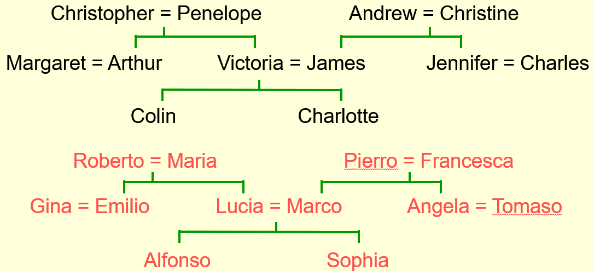
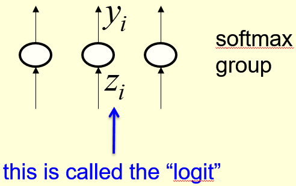
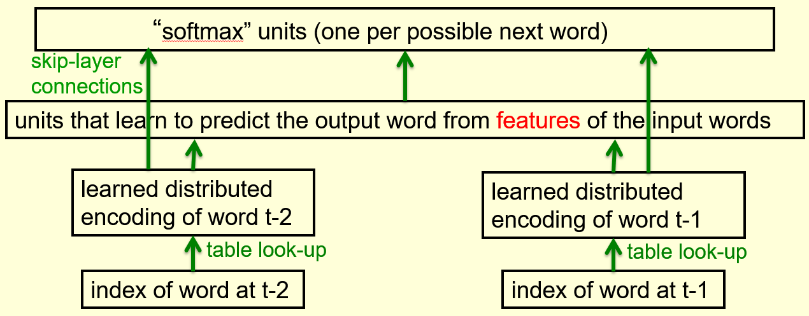

# Multiclasses Machine Learning

## Learning to predict the next word

### Lecture Notes

+ A simple example of relational information

  

    
  

  + Top family tree - British people
    + Christopher married to Penelope.  Their children: Arthur & Victoria
    + Andrew married to Christine.  Their children: James & Jennifer
    + Victoria married to James.  Their children: Colin & Charlotte
  + Bottom family tree - Italian people
  + Similar family tree structure

+ Another way to express the same information
  + Make a set of propositions using the 12 relationships
    + son, daughter, nephew, niece, father, mother, uncle, aunt
    + brother, sister, husband, wife
  + Examples:
    + (colin has-father james)
    + (colin has-mother victoria)
    + (james has-wife victoria) this follow from the two above
    + (charlotte has-brother colin)
    + (victoria bas-brother arthur)
    + (charlotte has-mother victoria)
    + (charlotte has-uncle arthur) this follow from the three above

+ A relational learning task
  + Figuring out the regularities from given family trees
    + express with symbolic rules
    + e.g., (x has-mother y) & (y has-husband z) $\implies$ (x has-father z)
  + Form a combinatorial space of discrete probabilities
  + Finding the symbolic rules: difficult search through a very large discrete space of possibilities
  + Q: using neural network to capture the same knowledge of rules?
    + continuous space of real-value weights
    + capture the information

+ The structure of the neural net and example

  

    
  

  + bottom layer (input): people (12 persons) and relationships (12 relationship)
  + objective (output): learn the person who's related to the other person by what relationship
  + Manual designed architecture
    + number of layers
    + the bottlenecks to force it to learn the interesting representation
  + Block: local encoding of person 1 (left diagram)
    + encode the information in a neutral way
    + 24 possible people
    + local encoding of personal 1 with 24 neurons
    + exactly one of neurons turns on for each training case
  + Block: local encoding of relationship (left diagram)
      + local encoding of person 1 w/ 12 relationship units
      + exactly one of units turns on for each training case
      + turn on one of the 24 people, who's relationship is the unique answer
  + Similarity
    + with the unique answer, no similarity btw people $\implies$ all pairs of people equally dissimilar
    + dissimilarity:
      + not cheating by giving the network information about who would like to
      + the people not connected to uninterpreted symbols
  + Output: with one people and one relationship turned on, one of the 24 people will turn on
  + Distributed encoding of person 1: (left and right diagram)
    + take input from local encoding of person 1
    + connect to a small set of neurons (6 units - big gray blocks)
    + Gray blocks:
      + top row: 12 British people
      + bottom row: 12 Italian people
    + each people has to represent the people as pattern activities over these 6 neurons
    + a person in the distributed pattern of activity encoded once the propositions learned via the neural net
    + the distributed patterns reveal the structuring the task or structure in the domain
    + Train the 112 propositions many times
    + changing the weights slowly each proposition with back propagation
    + Observe the 6 units in the layer
      + blobs within 6 blocks: the incoming weights for the one of the hidden units
      + top right unit (big grey block): nationality
        + top row: all British people positive (white)
        + bottom row: all Italian people negative (black)
        + indicating the input person whether British or Italian
        + no information provided explicitly with nationality
        + Input family trees not correlated
      + 2nd right block: generation
        + 4 big positive weights at the beginning $\implies$ Christopher & Andrew or their Italian equivalents
        + 2 big negative weights corresponding to Colin or his Italian equivalent
        + 4 more positive weights next to Colin or his Italian equivalent
        + 2 more negative weights at the end corresponding to Charlotte and her Italian equivalent
        + the neuron represents what generations somebody is
        + big positive weights to the oldest generation
        + big negative to the youngest generation
        + intermediate generation roughly zero weights
      + left bottom block: branches of family tree
        + big negative weights in the top row: Andrew, James, Charles, Christine, and Jennifer $\implies$ right hand branch of the family tree
        + learn which branch of the family tree
      + generations, nationality & branches: useful features to predict the output person

+ What the network learns
  + Six hidden units in the bottleneck
    + connected to the input representation of person 1
    + learn to represent features of people
    + useful for predicting the answer
    + e.g., nationality, generation, branch of the family tree
  + Features and central unit
    + features: only useful if the other bottlenecks use similar representations
    + central layer: learn how the features of input person and the features of the relationship predict the features of output
    + e.g.,  
      input personal of generation 3 and
      relationship requires answer to be one generation up implies 
      Output person is of generation 2
    + Requirements for the prediction
      + appropriately extract the features at the first & last hidden layers
      + make the middle layer related to those features correctly

+ Another way to see that it works
  + Generalization: able to complete those triples correctly?
    + train network on all cases but 4 of the triples
    + trained with 108 triples instead of 112 triples
    + sweep through the training set many times (randomly select the 4 triples)
    + adjust the weight slightly each time
  + Validate on the 4 held-out cases
    + about 3/4 correct with 24-way choice
    + small training data (not enough triples) to find the regularities well
    + perform much better than chance
    + able to train on a much smaller fraction of a big datasets

+ A large-scale example
  + Suppose a database with millions of relational facts of the form `(A r B)`
    + `(A r B)`: `A` has a relationship `r` with `B`
    + train a net to discover vector representations of the terms
    + predict 3rd term (B) from the first two terms (A & r)
    + a good way to clean the database
    + find things in database highly implausible but not guaranteed
    + using the trained net to find very unlikely triples
    + unlikely triples: potential errors in the database
    + e.g., Bach was born in 1902 and it could realize it was wrong because Bach was much older person and everything related to is much older than 1902
  + Using all three terms to predict probability that the fact is correct
    + required many correct facts to get high probability output
    + providing a good source of incorrect facts with a low output

### Lecture Video

<video src="https://youtu.be/ReUrmqStBd4?list=PLoRl3Ht4JOcdU872GhiYWf6jwrk_SNhz9" preload="none" loop="loop" controls="controls" style="margin-left: 2em;" muted="" poster="http://www.multipelife.com/wp-content/uploads/2016/08/video-converter-software.png" width=180>
  <track src="subtitle" kind="captions" srclang="en" label="English" default>
  Your browser does not support the HTML5 video element.
</video> 

## A brief diversion into cognitive science

### Lecture Notes

+ Concepts
  + debate in cognitive science about what it means to have a concept
  + The feature theory
    + a concept is a set of semantic features
    + good for explaining similarities between concepts
    + convenience: a concept is a vector of feature activities
  + The structuralist theory
    + the meaning of a concept lies in its relationships to other concepts
    + conceptual knowledge: best expressed as a relational graph
    + Minsky (1970s):
      + using the limitations of perceptrons as evidence against feature vectors
      + in favor of relational graph representations
  + Hinton - Both wrong
    + not rivals - neural networks
      + able to use vectors of semantic features to implement a relational graph
      + learns family trees: no explicit inference required to arrive at the intuitively obvious consequences of the facts that have been explicitly learned
      + micro features:
        + many probabilistic features influencing each other
        + not like explicit conscious features in real brain w/ millions of them and millions of interactions
        + one step of explicit influence to represent all interactions
      + intuit the answer in a forward pass
      + no intervening conscious steps but many computation in interactions of neurons
    + using both
      + explicit rules for conscious, deliberate, reasoning
      + commonsense, analogical reasoning: seeing the answer w/o conscious intervening steps
      + even using explicit rules, just see which rules to apply

+ Localist and distributed representations of concepts
  + Localist representation
    + implementation of relational graph in a neural net
      + neuron = node in the graph
      + connection = a binary relationship
    + "localist" method not working
      + many different types of relationship and the connections in neural nets w/o discrete labels
      + ternary relationships required as well as binary ones; e.g., A is between B and C
  + Distributed representations
    + open issue: how to implement relational knowledge in a neural net
    + many neurons probably used for one concept
    + each neuron probably involved in many concepts
    + many-to-many mapping btw concepts and neurons

### Lecture Video

<video src="https://youtu.be/gzUhkCnE8_U?list=PLoRl3Ht4JOcdU872GhiYWf6jwrk_SNhz9" preload="none" loop="loop" controls="controls" style="margin-left: 2em;" muted="" poster="http://www.multipelife.com/wp-content/uploads/2016/08/video-converter-software.png" width=180>
  <track src="subtitle" kind="captions" srclang="en" label="English" default>
  Your browser does not support the HTML5 video element.
</video> 

## Another diversion: The softmax output function

### Lecture Notes

+ Problem with squared error
  + Drawbacks
    + target value >> actual output: 
      + almost no gradient for a logistic unit to fix up the error
      + e.g., target = 1 & actual = 0.00000001
      + slope $\simeq$ horizontal $\implies$ slow convergence
    + summed outputs = 1 when assigning probability to mutually exclusive class
      + e.g., $p(a) = p(b) = 3/4$ impossible
      + depriving the network of mutually exclusive knowledge
  + appropriate cost function for mutually exclusive function
    + force the outputs to represent a probability distribution across discrete alternatives
    + a function to transform real values into a probability distribution
    + softmax: one of such functions

+ Softmax function
  + a.k.a. softargmax or normalized exponential function
  + a function that takes as input a vector of $K$ real numbers and normalizes it into a probability distribution consisting of $K$ probabilities proportional to the exponential of the input numbers
  + the output units in a softmax group use a non-local non-linearity
  + a soft continuous version of tht maximum function
  + $z_i$ depends on the $z$'s accumulated by their arrivals as well
  + $\sum_i y_i = 1$ and $y_i \in[0, 1]$

    

      
      
    

  + __Definition__. A softmax group $G$ is a group of output neurons whose outputs use the softmax activation defined by

    $$y_i = \frac{e^{z_i}}{\displaystyle \sum_{j \in G} e^{z_j}}$$

    so that the outputs sum to 1. The cost function is given by

    $$C = - \sum_j t_j \ln(y_j)$$
  
  + __Proposition__. By the Quotient Rule, the derivatives are

    $$\frac{\partial y_i}{\partial z_i} = \frac{\partial}{\partial z_i} \left(\frac{e^{z_i}}{\sum_{j \in G} e^{z_j}}\right) = y_i(1 - y_i) \qquad\qquad \frac{\partial y_i}{\partial z_j} = \frac{\partial}{\partial z_j} \frac{1}{2} (t_j - y_j)^2 = - y_i y_j$$

    or more fancy-like using the Kronecker Delta:

    $$\frac{\partial y_i}{\partial z_j} = y_i (\delta_{ij} - y_j)$$

  + __Proposition__. The derivatives of the cost function are

    $$\frac{\partial C}{\partial z_i} = y_i - t_i.$$

    _Proof_. Apply the Chain rule

    $$\frac{\partial C}{\partial z_i} = - \sum_j t_j \frac{\partial \ln(y_j)}{\partial z_i} = - \sum_j t_j \frac{\partial \ln(y_j)}{\partial y_j} \frac{\partial y_j}{\partial z_i}$$

    Using the formula for $\partial y_j / \partial z_i$, we get

    \[\frac{\partial C}{\partial z_i} = -\sum_j \frac{t_j}{y_j} y_j (\delta_{ij} - y_i) = -\sum_j t_j(\delta_{ij} - y_i)\]

    Recall that this is a multiclass classification problem, and so exactly one of the $t_j$'s is 1 and the rest are zro. Therefore,

    \[\frac{\partial C}{\partial z_i} = -t_i (1 - y_i) + \sum_{j \neq i} t_j y_i = -t_i + y_i \sum_j t_j = y_i - t_i \tag*{$\square$}\]

+ __Cross-entropy__: the suggested cost function to use with softmax
  + the right cost function: the negative log probability of the right answer

    $$C = - \sum_j t_j \ln(y_j) = -\ln(y_i)$$

    + $t_j$: target values
    + $t_j = \begin{cases} 1 & j \in I \subset G \\ 0 & j \in G-I \end{cases}$
    + $y_i$: the probability of the input belonging to class $I$
    + simply put 0 on the wrong answers and 1 for the right answer ($t_i$)
    + Cross-entropy cost function

  + __Property__. $C$ w/ very big gradient descent if target value = 1 and actual value approx. 0.

    __Proof__. $$\frac{\partial C}{\partial z_i} = \sum_j \frac{\partial C}{\partial y_j} \frac{\partial y_j}{\partial z_i} = y_i - t_i$$

    + e.g., 0.000001 much better than 0.000000001
    + the steepness of $d C / d y$ exactly balances the flatness of $dy / dz$
  + better than the gradient descent w/ squared error

### Lecture Video

<video src="https://youtu.be/mlaLLQofmR8?list=PLoRl3Ht4JOcdU872GhiYWf6jwrk_SNhz9" preload="none" loop="loop" controls="controls" style="margin-left: 2em;" muted="" poster="http://www.multipelife.com/wp-content/uploads/2016/08/video-converter-software.png" width=180>
  <track src="subtitle" kind="captions" srclang="en" label="English" default>
  Your browser does not support the HTML5 video element.
</video> 

## Neuro-probabilistic language models

### Lecture Notes

+ A basic problem in speech recognition
  + Not able to identify phonemes perfectly in noisy speech
  + Ambiguous acoustic input: several different words fitting the acoustic signal equally well
  + Human using their understanding of the meaning of the utterance to hear the right words
    + unconsciously
    + good at it
  + knowing which words are likely to come next and which are not in speech recognition
    + able to predict pretty well
    + no fully understanding required

+ The standard Trigram method
  + Gather a huge amount of text and count the frequencies of all triples or words
  + Use the formula to bet the relative probabilities of words with the two previous words

    $$\frac{p(w_3 = c | w_2 = b, w_1 = a)}{p(w_3 = d | w_2 =b, w_1 = a)} = \frac{\text{count}(abc)}{\text{count}(abd)}$$

  + The state-of-the-art methodology recently
    + unable to use a much bigger context
      + too many possibilities to store
      + counts almost zero
    + fall back to diagram if trigram frequencies too low
    + probability = 0 not mean never happened but not include in the training examples
  + drawback: not understand similarity btw words
  
+ Information that the trigram model fails to use
  + Seeing the 1st sentence: "the cat got squashed in the garden on Friday"
  + Help to predict words in the sentence: "the dog flattened in the yard on Monday"
  + Trigram not understanding the similarities between the terms: cat/dogsquashed/flattenedgarden/yardFriday/Monday
  + Solution
    + using semantic and syntactic features of previous words to predict the features of the next word
    + using a feature representation allows a context that contains many more previous words; e.g., 10

+ Bengio's neural net f19970701hkor predicting the next word

  

    
  

  + similar to family tree problem but larger scale
  + bottom layer:
    + a set of neurons for index of word: turn on just one is on
    + the weight of the neuron determined the pattern of activity in the next hidden layer
    + the weight through the active neuron in the bottom layer will give the pattern of activity in the layer w/ distributed representation of the word (feature vector)
    + i.e., table look-up a feature vector for each word
    + when learning, modify the feature vector equals to modifying the weights from a single active input
  + Typical 5 previous words used but shown 2 in the diagram
  + Using distributed representations via hidden layers to predict via huge sofmax to get probabilities for all various words might coming next
  + refinement:
    + skip layer connection to skip from input to output
    + input words individually informative about what the word might be
  + Slight worse than Trigram model
  + Combining both improved

+ A problem w/ a very large vector of weights
  + unnecessary duplicates: plural of a word and tenses of verbs
  + each unit in the last hidden layer w/ 100,000 outgoing weights
    + unable to afford to have so many hidden units unless a huge number of training cases
    + reduce the size of weight vector but hard to get right probabilities
      + ideally a big probability and many small probabilities
      + in practice, many words w/ small probabilities and relevant
      + two different rare words judged from the context
  + Any solution?

### Lecture Video

<video src="https://youtu.be/_1zwTzpc50Q?list=PLoRl3Ht4JOcdU872GhiYWf6jwrk_SNhz9" preload="none" loop="loop" controls="controls" style="margin-left: 2em;" muted="" poster="http://www.multipelife.com/wp-content/uploads/2016/08/video-converter-software.png" width=180>
  <track src="subtitle" kind="captions" srclang="en" label="English" default>
  Your browser does not support the HTML5 video element.
</video> 

## Dealing with large number of possible outputs

### Lecture Notes

+ A serial architecture

  

    
  

  + a method to avoid using a huge number of different output units in softmax
  + adding an extra input as candidate for the next word same as the context word
  + output: score for how good the candidate in the context
  + execute the net many times but most of them only one required

  + Learning
    + computing the logit score for each candidate word
    + using all of the logits in a softmax to get word probabilities
    + retaining cross-entropy error derivative by the difference btw the word probabilities and their target probabilities
      + raise the score of the correct candidate
      + lower the scores of its high-scoring rivals
    + Use a small set of candidates
      + time saving
      + e.g., use the neural net to revise the probabilities of the words w/ trigram model

+ Structure words as a tree (Minih and Hinton, 2009)
  + predicting a path through a tree
  + arranging all the words in a binary tree with words as the leaves
  + using the previous context to generate a __prediction vector__, $v$
    + compare $v$ with a learned vector, $u$, at each node of the tree: a scalar product of $u$ and $v$
    + apply the logistic function to the scalar product of $u$ and $v$ to predict the probabilities of taking the two branches of the tree
      + the calculated probability to take the right branch
      + the (1 - probability) chance to take the left branch

  

    
  

  + $\sigma$: the logistic function
  + along the path to get the word intended
  + using contexts to learn a prediction vector with the neural net
  + prediction vector: adding feature vector of each word and feature vectors directly contribute evidence in favor of a prediction vector
  + the prediction vector compared with the vectors learned for all the nodes on the path to the correct next word
  + e.g., $U-i$, $u_j$, and $u_m$ are words need to consider during learning
  + take the path with high sum of their log probabilities: take the high probability on each node

  + A convenient decomposition
    + maximizing the log probability of picking the target word
      + equivalent to maximizing the sum of the log probabilities of taking all the branches on the path
      + $\mathcal{O}(\log(N))$ instead of $\mathcal{O}(N)$: only consider the nodes on the correct path
      + knowing the correct branch and the current probability of each node
      + able to get derivatives for learning both the prediction vector $v$ and node vector $u$
    + Still slow at test time though a few hundred times faster
      + required to know the probabilities of many words
      + unable to consider on path only

+ Improvement: Collobert and Weston, 2008
  + a simpler way to learn feature vectors for words (left figure)
    + learned feature vectors for words
    + applied to many different natural language processing tasks well
    + not try to predict the next word but good feature vectors for words
    + use both the past and future contexts
    + observe a window with 11 words, 5 in the past and 5 in the future
    + the middle word either the correct word actually occurred in the text or a random word
    + train the neural net to produce the output
      + high probability: correct word
      + low probability: random word
    + map the individual words to feature vectors
    + use the feature vectors in the neural net (possible many hidden layers) to predict whether the word correct or not
  + Displaying the learned feature vectors in a 2-D map
    + get idea of the quality of the learned feature vectors
    + display similar vectors close to each other
    + T-SNE: a multi-scale method to display similarity at different scale
      + able to put very similar words close to each other
      + able to put similar cluster close to each other
  + Checking strings of words
    + learned feature vectors capturing  lots of subtle semantic distinctions
    + no extra supervision required
    + information of all words in the context
    + Consider "She scrommed him with the frying pan."
  + Examples
    + Diagram 1: words about games
      + similar kinds of words together
      + e.g., matches, games, races, clubs, teams, etc.
      + e.g., players, team, club, league, etc.
      + e.g., cup, bowl, medal, etc.
      + e.g., rugby, hockey, soccer, baseball, etc.
    + Diagram 2: places in map
      + Cambridge with a city very similar to it just underneath
      + Toronto close to Detroit, Boston while Quebec closer to Berlin and Paris
      + Iraq similar to Vietnam
    + Diagram 3: adverbs
      + which close to that, whom and what, how, whether, and why

  

    <a href="http://www.cs.toronto.edu/~hinton/coursera/lecture4/lec4.pptx" ismap target="_blank">
      
       
      
      
    </a>
  

### Lecture Video

<video src="https://youtu.be/hd2opRsjmEI?list=PLoRl3Ht4JOcdU872GhiYWf6jwrk_SNhz9" preload="none" loop="loop" controls="controls" style="margin-left: 2em;" muted="" poster="http://www.multipelife.com/wp-content/uploads/2016/08/video-converter-software.png" width=180>
  <track src="subtitle" kind="captions" srclang="en" label="English" default>
  Your browser does not support the HTML5 video element.
</video> 

