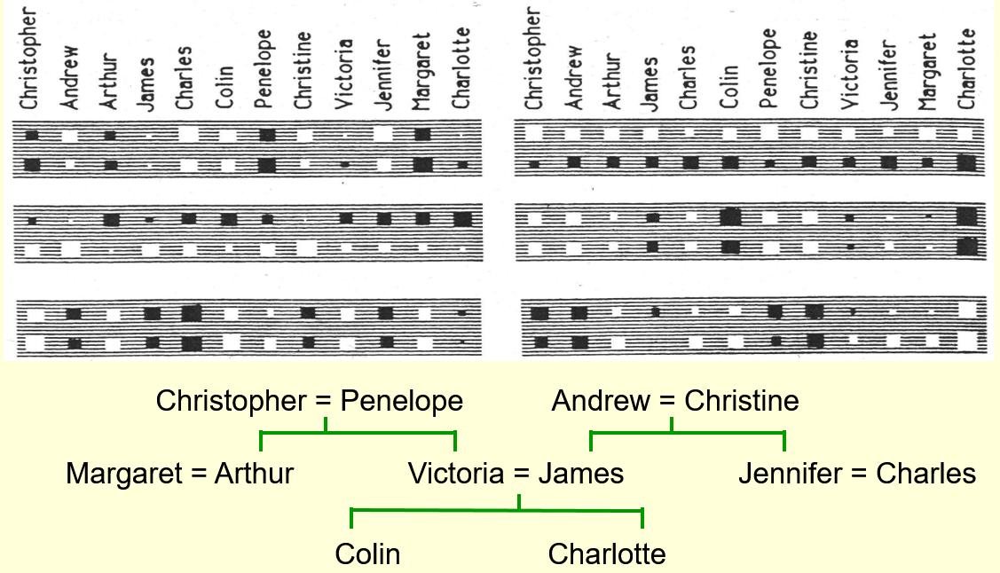

# Multiclasses Machine Learning

## Learning to predict the next word

### Lecture Notes

+ A simple example of relational information

  

    
  

  + Top family tree - British people
    + Christopher married to Penelope.  Their children: Arthur & Victoria
    + Andrew married to Christine.  Their children: James & Jennifer
    + Victoria married to James.  Their children: Colin & Charlotte
  + Bottom family tree - Italian people
  + Similar family tree structure

+ Another way to express the same information
  + Make a set of propositions using the 12 relationships
    + son, daughter, nephew, niece, father, mother, uncle, aunt
    + brother, sister, husband, wife
  + Examples:
    + (colin has-father james)
    + (colin has-mother victoria)
    + (james has-wife victoria) this follow from th two above
    + (charlotte has-brother colin)
    + (victoria bas-brother arthur)
    + (charlotte has-uncle arthur) this follow from th two above

+ A relational learning task
  + Figuring out the regularities from given family trees
    + express with symbolic rules
    + e.g., (x has-mother y) & (y has-husband z) $\Rightarrow$ (x has-father z)
  + Form a combinatorial space of discrete probabilities
  + Finding the symbolic rules: difficult search through a very large discrete space of possibilities
  + Q: using neural network to capture the same knowledge of rules?
    + continuous space of real-value weights
    + capture the information

+ The structure of the neural net and example

  

    
  

  + bottomer layer (input): people and relationships
  + objective (output): learn the person who's related to the other person by what relationship
  + Manual designed architecture
    + number of layers
    + the bottlenecks to force it to learn the interesting representation
  + Block: Local encoding of person 1 (left diagram)
    + encode the information in a neutral way
    + 24 possible people
    + local encoding of personal 1 with 24 neurons
    + exactly one of neurons turns on for each training case
  + Block: local encoding of relationship (left diagram)
      + local encoding of person 1 w/ 12 relationship units
      + exactly one of units turns on for each training case
      + turn on one of the 24 people, who's relationship is the unique answer
      + with the unique answer, no similarity btw people $\Rightarrow$ all pairs of people equally dissimilar
      + dissimilarity:
        + not cheating by giving the network information about who would like to
        + the people not connected to uninterpreted symbols
  + Distributed encoding of person 1: (left and right diagram)
    + take local encoding of a person 1
    + connect to a small set of neurons (6 units - big gray blocks)
    + Gray blocks:
      + top row: 12 British people
      + bottom row: 12 Italian people
    + each people has to represent the people as pattern activities over these 6 neurons
    + learn the propositions to encode a people in the distributed pattern of activity
    + reveal the structuring the task or structure in the domain
    + Train 112 propositions
    + changing the weights slowly each proposition with backpropagation
    + Observe the 6 units in the layer
      + blobs: the incoming weights for the one of the hidden units
      + top right unit (big grey block):
        + top row: all British people positive (white)
        + bottom row: all Italian people negative (black)
        + indicate the input person whether British or Italian
        + Input family trees not correlated
      + 2nd right block:
        + 4 big positive weights at the beginning $\Rightarrow$ Christopher & Andrew or their Italian equivalents
        + 2 big negative weights corresponding to Colin or his Italian equivalent
        + 4 more positive weights next to Colin or his Italian equivalent
        + 2 more negative weights at the end corresponding to Charlotte and her Italian equivalent
        + the neuron represents what generations somebody is
        + big positive weights to the oldest generation
        + big negative to the youngest generation
        + intermediate generation roughly zero weights
      + left bottom block
        + big negative weights in the top row: Andrew, James, Charles, Christine, and Jennifer $\Rightarrow$ right hand branch of the family tree
        + learn which branch of the family tree
      + Useful features to predict the output person  

+ What the network learns
  + Six hidden units in the bottleneck
    + connected to the input representation of person 1
    + learn to represent features of people
    + useful for predicting the answer
    + e.g., nationality, generation, branch of the family tree
  + Features and central unit
    + features: only useful if the other bottlenecks use similar representations
    + central layer: learn how the features of input person and the features of the relationship predict the features of output
    + e.g.,  
      input personal of generation 3 and
      relationship requires answer to be one generation up implies 
      Output person is of generation 2
    + Requirements for the prediction
      + appropriate extract the features at the hidden layer
      + appropriate extract the features of the last hidden layer
      + make the middle layer related to those features correctly

+ Another way to see that it works
  + Generalization: able to complete those triples correctly?
    + train network on all cases but 4 of the triples
    + trained with 108 triples instead of 112 triples
    + sweep through the training set many times (randomly select the 4 triples)
    + adjust the weight slightly each time
  + Validate on the 4 held-out cases
    + about 3/4 correct with 24-way choice
    + small training data (not enough triples) to find the regularities well
    + perform much better than chance
    + able to train on a much smaller fraction of a big datasets

+ A large-scale example
  + Suppose a database with millions of relational facts of the for `(A R B)`
    + `(A R B)`: A has a relationship R with B
    + train a net to discover vector representations of the terms
    + predict 3rd term (B) from the first two terms (A & R)
    + using the trained net to find very unlikely triples
    + unlikely triples: potential errors in the database
    + e.g., Bach was born in 1902 and it could realize it was wrong because Bach was much older person and everything related to is much older than 1902
  + Using all three terms to predict probability that the fact is correct
    + required many correct facts to get high probability output
    + providing a good source of incorrect facts with a low output

### Lecture Video

<video src="https://youtu.be/ReUrmqStBd4?list=PLoRl3Ht4JOcdU872GhiYWf6jwrk_SNhz9" preload="none" loop="loop" controls="controls" style="margin-left: 2em;" muted="" poster="http://www.multipelife.com/wp-content/uploads/2016/08/video-converter-software.png" width=180>
  <track src="subtitle" kind="captions" srclang="en" label="English" default>
  Your browser does not support the HTML5 video element.
</video> 

## A brief diversion into cognitive science

### Lecture Notes

+ Concepts
  + debate in cognitive science about what it means to have a concept
  + The feature theory
    + a concept is a set of semantic features
    + good for explaining similarities between concepts
    + convenience: a concept is a vector of feature activities
  + The structuralist theory
    + the meaning of a concept lies in its relationships to other concepts
    + conceptual knowledge: best expressed as a relational graph
    + Minsky (1970s):
      + using the limitations of perceptrons as evidence against feature vectors
      + in favor of relational graph representations
  + Hinton - Both wrong
    + not rivals - neural networks
      + able to use vectors of semantic features to implement a relational graph
      + learns family trees: no explicit inference required to arrive at the intuitively obvious consequences of the facts that have been explicitly learned
      + micro features:
        + many probabilistic features influencing each other
        + not like explicit conscious features in real brain w/ millions of them and millions of interactions
        + one step of explicit influence to represent all interactions
      + intuit the answer in a forward pass
      + no intervening conscious steps but many computation in interactions of neurons
    + using both
      + explicit rules for conscious, deliberate, reasoning
      + commonsense, analogical reasoning: seeing the answer w/o conscious intervening steps
      + even using explicit rules, just see which rules to apply

+ Localist and distributed representations of concepts
  + Localist representation
    + implementation of relational graph in a neural net
      + neuron = node in the graph
      + connection = a binary relationship
    + "localist" method not working
      + many different types of relationship and the connections in neural nets w/o discrete labels
      + ternary relationships required as well as binary ones; e.g., A is between B and C
  + Distributed representations
    + open issue: how to implement relational knowledge in a neural net
    + many neurons probably used for each concept
    + each neuron probably involved in many concepts
    + many-to-many mapping btw concepts and neurons

### Lecture Video

<video src="https://youtu.be/gzUhkCnE8_U?list=PLoRl3Ht4JOcdU872GhiYWf6jwrk_SNhz9" preload="none" loop="loop" controls="controls" style="margin-left: 2em;" muted="" poster="http://www.multipelife.com/wp-content/uploads/2016/08/video-converter-software.png" width=180>
  <track src="subtitle" kind="captions" srclang="en" label="English" default>
  Your browser does not support the HTML5 video element.
</video> 

## Another diversion: The softmax output function

### Lecture Notes

+ Problem with squared error
  + Drawbacks
    + target value >> actual output: no gradient for a logistic unit to fix up the error
    + summed outputs = 1 when assigning probability to mutually exclusive class, but depriving the network of this knowledge
  + Other better cost function
    + force the outputs to represent a probability distribution across discrete alternatives

+ Softmax function
  + the output units in a softmax group use a non-local non-linearity

    

      
    

  + __Definition__. A softmax group $G$ is a group of output neurons whose outputs use the softmax activation defined by 

    $$y_i = \frac{e^{z_i}}{\displaystyle \sum_{j \in G} e^{z_i}}$$

    so that the outputs sum to 1. The cost functon is given by 

    $$C = - \sum_j t_j \log(y_j)$$
  
  + __Proposition__. By the Quotient Rule, the derivatives are

    $$\frac{\partial y_i}{\partial z_i} = y_i(1 - y_i) = - y_i y_j$$

    or more fancy-like using the Kronecker Delta:

    $$\frac{\partial y_i}{\partial z_j} = y_i (\delta_{ij} - y_j)$$

  + __Proposition__. The derivatives of the cost function are

    $$\frac{\partial C}{\partial z_i} = y_i - t_i.$$

  + _Proof_. Apply the Chain rule

    $$\frac{\partial C}{\partial z_i} = - \sum_j t_j \frac{\partial \log y_j}{\partial z_i} = - \sum_j t_j \frac{\partial \log y_j}{\partial y_j} \frac{\partial y_j}{\partial z_i}$$

    Using the formula for $\partial y_j / \partial z_i$, we get

    $$\frac{\partial C}{\partial z_i} = -\sum_j \frac{t_j}{y_j} y_j (\delta_{ij} - y_i) = -\sum_j t_j(\delta_{ij} - y_i)$$

    Recall that this is a multiclass classification problem, and so exactly one of the $t_j$'s is 1 and the rest are zro. Therefore,

    $$\frac{\partial C}{\partial z_i} = -t_i (1 - y_i) + \sum_{j \neq i} t_j y_i = -t_i + y_i \sum_j t_j = y_i - t_i$$

    $$\tag*{$\blacksquare$}$$

+ Cross-entropy: the right cost function to use with softmax
  + the right cost function: the negative log probability of the right answer

    $$C = - \sum_j \underbrace{t_j}_{\text{target value}} \log y_j$$

  + $C$ w/ very big gradient descent if target value = 1 and actual value approx. 0.

    $$\frac{\partial C}{\partial z_i} = \sum_j \frac{\partial C}{\partial y_j} \frac{y_j}{\partial z_i} = y_i - t_i$$

    + e.g., 0.000001 much better than 0.000000001
    + the steepness of $d C / d y$ exactly balances the flatness of $dy / dz$

### Lecture Video

<video src="https://youtu.be/mlaLLQofmR8?list=PLoRl3Ht4JOcdU872GhiYWf6jwrk_SNhz9" preload="none" loop="loop" controls="controls" style="margin-left: 2em;" muted="" poster="http://www.multipelife.com/wp-content/uploads/2016/08/video-converter-software.png" width=180>
  <track src="subtitle" kind="captions" srclang="en" label="English" default>
  Your browser does not support the HTML5 video element.
</video> 

## Neuro-probabilistic language models

### Lecture Notes

### Lecture Video

<video src="url" preload="none" loop="loop" controls="controls" style="margin-left: 2em;" muted="" poster="http://www.multipelife.com/wp-content/uploads/2016/08/video-converter-software.png" width=180>
  <track src="subtitle" kind="captions" srclang="en" label="English" default>
  Your browser does not support the HTML5 video element.
</video> 

## ways to deal with large number of possible outputs

### Lecture Notes

### Lecture Video

<video src="url" preload="none" loop="loop" controls="controls" style="margin-left: 2em;" muted="" poster="http://www.multipelife.com/wp-content/uploads/2016/08/video-converter-software.png" width=180>
  <track src="subtitle" kind="captions" srclang="en" label="English" default>
  Your browser does not support the HTML5 video element.
</video> 

