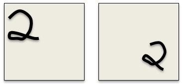
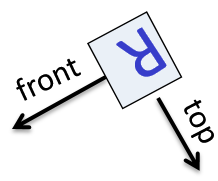
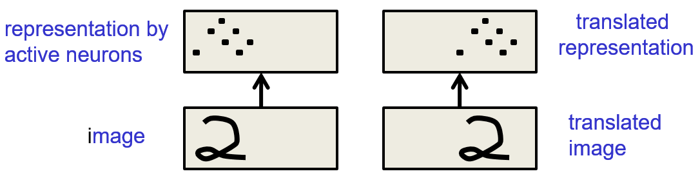
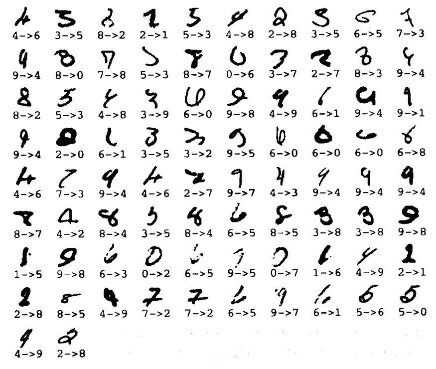
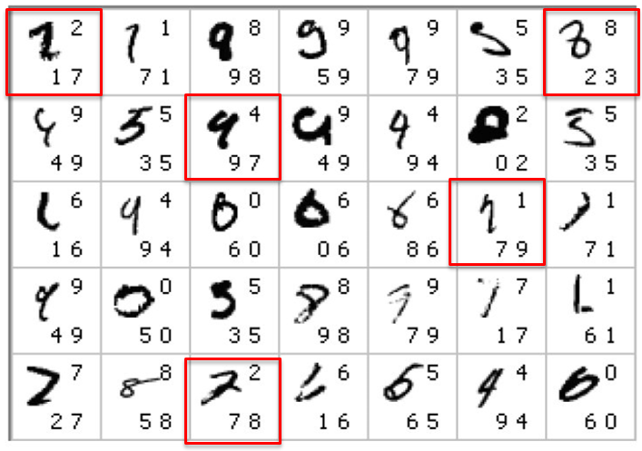

# Convolution Neural Networks (CNN)

## Why object recognition is difficult

### Lecture Notes

+ Issues about object recognition
  + Segmentation
    + real scenes cluttered with other objects
      + stereo cues: human due to two eyes but not static images
    + difficult to identify pieces as parts of the same object
    + parts of a object hidden behind other objects
  + Lighting
    + intensities of pixels determined by the nature of the object
    + intensities of pixels determined by the lighting as well
    + e.g., black surface in bright light w/ much more intense pixels than whit surface in very gloomy light
    + object recognition: convert many intensities of the pixels into a class label
    + intensities varying for all sorts of reasons nothing related to the identity of the object
  + Deformation
    + deforming objects in various non-affine ways
    + e.g., hand-written 2 w/ a large loop or just a cusp
  + Affordances
    + object classes defined by how they are used
    + e.g., chairs designed for sitting on w/ a wide variety of physical shapes, including armchairs, modern chairs mad with steel frames and wood backs
  + Viewpoint
    + 3-D object w/ variety of viewpoints
    + viewpoint changes $\implies$ changes in images
    + not coped with by standard learning methods
    + information hops btw input dimensions (i.e. pixels)
      + envision the input dimensions correspond to pixels
      + eyes not moving to follow object movement but images with different pixels
    + fix the issue in systematic way

  

    
  

+ dimension-hopping phenomenon
  + info jumping from one input dimension to another
  + e.g., age and weight of a patient are inputs
    + some coders change the info dimension
    + swap the age and weight fields
  + viewpoint carried

### Lecture Video

<video src="https://youtu.be/Qx3i7VWYwhI?list=PLoRl3Ht4JOcdU872GhiYWf6jwrk_SNhz9" preload="none" loop="loop" controls="controls" style="margin-left: 2em;" muted="" poster="http://www.multipelife.com/wp-content/uploads/2016/08/video-converter-software.png" width=180>
  <track src="subtitle" kind="captions" srclang="en" label="English" default>
  Your browser does not support the HTML5 video element.
</video> 

## Ways to achieve viewpoint invariance

### Lecture Notes

+ Viewpoint invariance
  + Human good at viewpoint invariant
  + one of the main difficulties in making computers perceive
  + still no accepted solutions
  + Approaches
    + using redundant invariant features
    + putting a box around the object w/ normalized pixels
    + convolutional neural networks by replicating features with pooling
    + using a hierarchy of parts that have explicit poses relative to the camera

+ Invariant feature approach
  + extract a large, redundant set of invariant features under transformations
    + e.g., pair of roughly parallel lines w/ a red dot btw them
    + what baby herring gulls used to know where to peck for food
    + if paint that feature on a piece of wood, the baby herring gulls will peck at the appropriate place on the piece of wood.
  + with enough invariant features, only one way to assemble them into an object
    + no need to represent the relationships btw features directly
    + relationship captured by other features
    + Psychologist Wayne: Strings of letters
      + Shimon Ullman envisioned it
      + sort of acute point requiring a big bag of features
      + with overlapping and redundant features, one feature will tell how two other features are related
  + avoid forming features from parts of different objects
    + human recognition: having a whole bunch of features composed of parts of different objects
    + very misleading for recognition

+ Judicious normalization approach
  + putting a box around the object
  + using the box as a coordinate frame for a set of normalized pixels
  + solving the dimension-hopping problem
    + the box on the rigid shape avoid the effect of changes in viewpoint
    + correctly choosing the box results in the same normalized pixels for the same part of an object
    + box not required to be rectangular
    + any box providing invariant to many degrees of freedom: translation, rotation, scale, shear, stretch, ...
  + difficulties on choosing the box
    + segmentation errors
    + occlusion: not just shrinking a box around things
    + unusual orientations: a 'd' with an extra stroke w/ the loop D as upright one of those characters
  + chicken-egr problem
    + to get the box right requires to recognize the shape
    + to recognize the shape requires to get the box right
  + Human recognizes the letter before doing mental rotation to decide if it's a mirror image
    + letter R w/ a vertical stroke at the back and a loop facing forwards at the top
    + recognize the letter R perfect well before any mental rotation
    + then recognized its upside down to know how to rotate it
    + mental rotation for dealing with judgement like handedness, e.g., correct R or mirror, not used for dealing with upside down

  

    
  

+ Brute force normalization approach
  + Using well-segmented, upright images to fit the correct box for training
  + Designing period - try all possible boxes in a range of positions and scales
    + widely used for computer vision
    + particularly to detect upright things like faces and house numbers in unsegmented images
    + much more efficient if the recognizer can cope with some variation in position and scale
    + then able to use a coarse grid when trying all possible boxes

### Lecture Video

<video src="https://youtu.be/SxD-YVxIygc?list=PLoRl3Ht4JOcdU872GhiYWf6jwrk_SNhz9" preload="none" loop="loop" controls="controls" style="margin-left: 2em;" muted="" poster="http://www.multipelife.com/wp-content/uploads/2016/08/video-converter-software.png" width=180>
  <track src="subtitle" kind="captions" srclang="en" label="English" default>
  Your browser does not support the HTML5 video element.
</video> 

## Convolutional neural networks for hand-written digit recognition

### Lecture Notes

+ The replicated feature approach
  + using many different copies of the same feature detector w/ different positions
    + might replicate across scale and orientation (tricky and expensive)
    + replication greatly reducing the number of free parameters to be learned
  + using several different feature types, each with tits own map of replicated detectors
    + allowing each patch of image to be represented in several ways

  

    
  

+ Backpropagation with weight constraints
  + modify the backpropagation algorithm to incorporated linear constraints btw the weights
  + compute the gradients as usual
  + modify the gradients to satisfy yje constraints
    + once the weights satisfying the constrains, they continue satisfying them
  + Procedure
  
    \[\text{To constraint: } w_1 = w_2 \implies \text{we need: } \Delta w_1 = \Delta w_2\]
  
    \[\text{Compute  }\frac{\partial E}{\partial w_1} \text{   and   } \frac{\partial E}{\partial w_2}\]

    \[\text{Use   } \frac{\partial E}{\partial w_1} + \frac{\partial E}{\partial w_2} \text{   for  } w_1 \text{ and } w_2\]

+ What replicating the feature detectors achieve?
  + Equivalent activities
    + replicated features not make the neural activities invariant to translation
    + activities equivalent
  + Invariant knowledge
    + a feature useful in some locations during training $\implies$ the feature available in all locations during testing

  

    
  

+ Pooling the outputs of replicated feature detectors
  + Gget a small amount of translational invariance at each level by averaging four neighboring neighboring replicated detectors to give a single output to the next level
      + reducing the number of input to the next layer of feature extraction
      + allowing much more different feature maps
      + taking the maximum of the four works slightly better
  + Problem
      + lost information about the precise positions of things after several levels of pooling
      + impossible to use the precise spatial relationships btw high-level parts for recognition

+ Le Net
  + Yann LeCun & collaborators
    + developed a really good recognizer for handwritten digits
    + using backpropagation in feedforward net
    + Architecture
      + many hidden layers
      + many maps of replicated units in each layer
      + pooling of the outputs of nearby replicated units
      + a wide net able to cope with several characters at once even if they overlap
      + a clever way of training a complete system, not just a recognizer
  + Used for reading~10% of the checks in North America
  + [Demons of LENET](http://yann.lecun.com)
  + The 82 errors made by LeNet5
    + most of the errors able to find easily by human
    + human error rate: 20~30 errors
    + but no patience to measure it

  

    
    
  

+ Priors and Prejudice
  + design appropriately by applying prior knowledge about the task into the network
    + connectivity
    + weight constraints
    + neuron activation functions
  + less intrusive than hand-designing the features
    + still prejudices the network towards the particular way of solving the problem in mind
  + Alternatively using prior knowledge to create a more training data
    + may require a lot of work (Hoffman & Tresp, 1993)
    + may take longer to learn
  + Allowing optimization to discover clever ways of using the multilayer network
    + never fully understand how it does it

+ The brute force approach
  + Designing LeNet w/ the invariant knowledge
    + local connectivity
    + weight-sharing
    + pooling
  + about 80 errors w/ origin LeNet
    + reduced to ~40 errors w/ many different transformations of input and other tricks (Ranzato 2008)
  + Ciresan et. al. net (2010)
    + applying knowledge of invariance
    + creating a huge amount of carefully designed extra training data
    + producing many new training examples by applying many different transformations on each training image
    + Achieving about 35 errors
    + Error example
      + top printed digit: the right answer
      + bottom two printed digits: the network's best two guesses
      + the right answer is almost always in the top 2 guesses
      + model averaging: ~ 25 errors

  

    
  

+ How to detect a significant drop in the error rate
  + Q: is 30 errors in 10,000 test cases significantly better than 40 errors?
  + depend on the particular errors
  + McNemar test
    + using the particular errors in diagrams
    + much more powerful than a test counting the numbers of errors

  

    
  

### Lecture Video

<video src="url" preload="none" loop="loop" controls="controls" style="margin-left: 2em;" muted="" poster="http://www.multipelife.com/wp-content/uploads/2016/08/video-converter-software.png" width=180>
  <track src="subtitle" kind="captions" srclang="en" label="English" default>
  Your browser does not support the HTML5 video element.
</video> 

## Convolutional neural networks for object recognition

### Lecture Notes

### Lecture Video

<video src="url" preload="none" loop="loop" controls="controls" style="margin-left: 2em;" muted="" poster="http://www.multipelife.com/wp-content/uploads/2016/08/video-converter-software.png" width=180>
  <track src="subtitle" kind="captions" srclang="en" label="English" default>
  Your browser does not support the HTML5 video element.
</video> 

