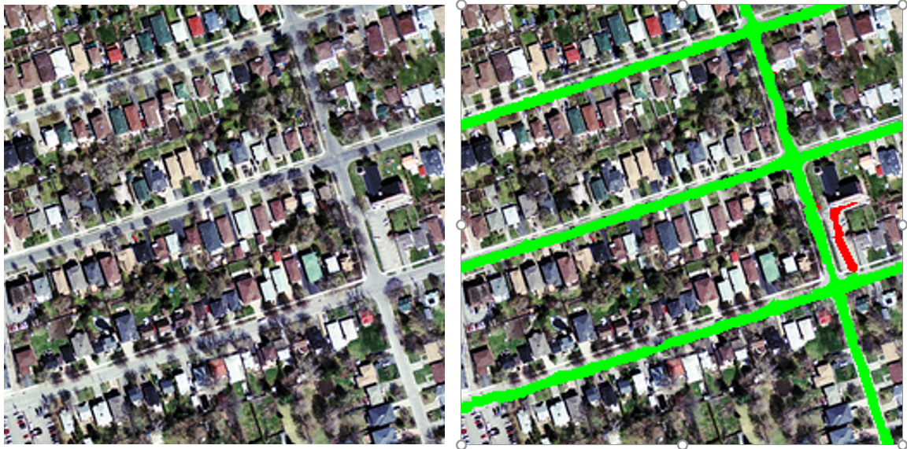

# Convolution Neural Networks (CNN)

## Why object recognition is difficult

### Lecture Notes

+ Issues about object recognition
  + Segmentation
    + real scenes cluttered with other objects
      + stereo cues: human due to two eyes but not static images
    + difficult to identify pieces as parts of the same object
    + parts of a object hidden behind other objects
  + Lighting
    + intensities of pixels determined by the nature of the object
    + intensities of pixels determined by the lighting as well
    + e.g., black surface in bright light w/ much more intense pixels than whit surface in very gloomy light
    + object recognition: convert many intensities of the pixels into a class label
    + intensities varying for all sorts of reasons nothing related to the identity of the object
  + Deformation
    + deforming objects in various non-affine ways
    + e.g., hand-written 2 w/ a large loop or just a cusp
  + Affordances
    + object classes defined by how they are used
    + e.g., chairs designed for sitting on w/ a wide variety of physical shapes, including armchairs, modern chairs mad with steel frames and wood backs
  + Viewpoint
    + 3-D object w/ variety of viewpoints
    + viewpoint changes $\implies$ changes in images
    + not coped with by standard learning methods
    + information hops btw input dimensions (i.e. pixels)
      + envision the input dimensions correspond to pixels
      + eyes not moving to follow object movement but images with different pixels
    + fix the issue in systematic way

  

    
  

+ dimension-hopping phenomenon
  + info jumping from one input dimension to another
  + e.g., age and weight of a patient are inputs
    + some coders change the info dimension
    + swap the age and weight fields
  + viewpoint carried

### Lecture Video

<video src="https://youtu.be/Qx3i7VWYwhI?list=PLoRl3Ht4JOcdU872GhiYWf6jwrk_SNhz9" preload="none" loop="loop" controls="controls" style="margin-left: 2em;" muted="" poster="http://www.multipelife.com/wp-content/uploads/2016/08/video-converter-software.png" width=180>
  <track src="subtitle" kind="captions" srclang="en" label="English" default>
  Your browser does not support the HTML5 video element.
</video> 

## Ways to achieve viewpoint invariance

### Lecture Notes

+ Viewpoint invariance
  + Human good at viewpoint invariant
  + one of the main difficulties in making computers perceive
  + still no accepted solutions
  + Approaches
    + using redundant invariant features
    + putting a box around the object w/ normalized pixels
    + convolutional neural networks by replicating features with pooling
    + using a hierarchy of parts that have explicit poses relative to the camera

+ Invariant feature approach
  + extract a large, redundant set of invariant features under transformations
    + e.g., pair of roughly parallel lines w/ a red dot btw them
    + what baby herring gulls used to know where to peck for food
    + if paint that feature on a piece of wood, the baby herring gulls will peck at the appropriate place on the piece of wood.
  + with enough invariant features, only one way to assemble them into an object
    + no need to represent the relationships btw features directly
    + relationship captured by other features
    + Psychologist Wayne: Strings of letters
      + Shimon Ullman envisioned it
      + sort of acute point requiring a big bag of features
      + with overlapping and redundant features, one feature will tell how two other features are related
  + avoid forming features from parts of different objects
    + human recognition: having a whole bunch of features composed of parts of different objects
    + very misleading for recognition

+ Judicious normalization approach
  + putting a box around the object
  + using the box as a coordinate frame for a set of normalized pixels
  + solving the dimension-hopping problem
    + the box on the rigid shape avoid the effect of changes in viewpoint
    + correctly choosing the box results in the same normalized pixels for the same part of an object
    + box not required to be rectangular
    + any box providing invariant to many degrees of freedom: translation, rotation, scale, shear, stretch, ...
  + difficulties on choosing the box
    + segmentation errors
    + occlusion: not just shrinking a box around things
    + unusual orientations: a 'd' with an extra stroke w/ the loop D as upright one of those characters
  + chicken-egr problem
    + to get the box right requires to recognize the shape
    + to recognize the shape requires to get the box right
  + Human recognizes the letter before doing mental rotation to decide if it's a mirror image
    + letter R w/ a vertical stroke at the back and a loop facing forwards at the top
    + recognize the letter R perfect well before any mental rotation
    + then recognized its upside down to know how to rotate it
    + mental rotation for dealing with judgement like handedness, e.g., correct R or mirror, not used for dealing with upside down

  

    
  

+ Brute force normalization approach
  + Using well-segmented, upright images to fit the correct box for training
  + Designing period - try all possible boxes in a range of positions and scales
    + widely used for computer vision
    + particularly to detect upright things like faces and house numbers in unsegmented images
    + much more efficient if the recognizer can cope with some variation in position and scale
    + then able to use a coarse grid when trying all possible boxes

### Lecture Video

<video src="https://youtu.be/SxD-YVxIygc?list=PLoRl3Ht4JOcdU872GhiYWf6jwrk_SNhz9" preload="none" loop="loop" controls="controls" style="margin-left: 2em;" muted="" poster="http://www.multipelife.com/wp-content/uploads/2016/08/video-converter-software.png" width=180>
  <track src="subtitle" kind="captions" srclang="en" label="English" default>
  Your browser does not support the HTML5 video element.
</video> 

## Convolutional neural networks for hand-written digit recognition

### Lecture Notes

+ The replicated feature approach
  + using many different copies of the same feature detector w/ different positions
    + might replicate across scale and orientation (tricky and expensive)
    + replication greatly reducing the number of free parameters to be learned
  + using several different feature types, each with tits own map of replicated detectors
    + allowing each patch of image to be represented by features in several ways
    + extend one feature type to many maps
    + each map replicas of the same feature
    + features constrained to be identical in different places
    + different map will learn to protect different features
  + Example

    

      
    

    + three feature detectors replicating each other
    + each of them has weights to nine pixels
    + those weights are identical btw the three feature detectors
    + therefore, the red arrow has the same weight on it for them all, same with the green and blue arrows
    + the 27 pixels in three different feature detectors with only 9 different weights

+ Backpropagation with weight constraints
  + modify the backpropagation algorithm to incorporated linear constraints btw the weights for replicated features
  + compute the gradients as usual
  + modify the gradients to satisfy the constraints
  + once the weights satisfying the linear constrains, they continue satisfying the linear constrain after weight update
  + Proof with two simple weights
  
    \[\text{To constraint: } w_1 = w_2 \implies \text{we need: } \Delta w_1 = \Delta w_2\]
  
    \[\text{Compute  }\frac{\partial E}{\partial w_1} \text{   and   } \frac{\partial E}{\partial w_2}\]

    \[\text{Use   } \frac{\partial E}{\partial w_1} + \frac{\partial E}{\partial w_2} \text{   for  } w_1 \text{ and } w_2\]

+ What replicated feature detectors achieve?
  + False: translation invariance
    + at least not true in the activities of the neurons
  + Equivariant activities
    + replicated features not make the neural activities invariant to translation
    + activities equivalent
    + Example with diagram below
      + black dot: activated neurons
      + the image changed and the representation also changed by just as much as the image
      + it's equivariance not invariance
  + Invariant knowledge
    + a feature useful in some locations during training $\implies$ the feature available in all locations during testing
    + knowing how to detect a feature in one place $\implies$ knowing how to detect same feature in another place
  + Achieving eqivaliance in the activities and invariance in the weights

  

    
  

+ Pooling for invariant activities
  + to achieve some invariance in the activities, pull the outputs of replicated feature detectors
  + Get a small amount of translational invariance at each level by averaging four neighboring neighboring replicated detectors to give a single output to the next level
    + reducing the number of input to the next layer of feature extraction
    + much more different feature maps allowing to learn more different kinds of features in the next layer
  + slightly better to take the maximum of the four neighboring feature detectors than averaging them
  + Problem
    + lost information about the precise positions of things after several levels of pooling, said 7 levels
    + face recognize w/ a few eyes, a nose and a mouth floating about in vaguely the same position
      + not an issue to recognize as a face
      + not able to recognize whose face
    + impossible to use the precise spatial relationships btw high-level parts for recognition
      + whose face recognition needs to use the precise spatial relationships btw eyes and btw the nose and the mouth
      + the information lost by convolutional neural networks

+ Le Net
  + Yann LeCun & collaborators
    + developed a really good recognizer for handwritten digits
    + using backpropagation in feedforward net
    + Architecture
      + many hidden layers
      + many maps of replicated units in each layer
      + pooling of the outputs of nearby replicated units btw layers
      + a wide net able to cope with several characters at once even if they overlap
      + no segmented individual characters required before fed into the net
      + a clever way of training a complete system, not just a recognizer for individual characters
      + maximum margined method: way before maximum margin invented
    + Architecture diagram (left figure)
      + input: pixels
      + feature maps (c1):
        + 6 different maps w/ 28x28 containing small features (as seen 3x3 pixels)
        + only about 9 parameters that their weights constrained together
        + much more efficient learning w/ much less data
      + Subsamling/pooling:
        + pull together the output of a bunch of neighboring replicated features in c1
        + providing a smaller map as input for next layer (S2)
      + built the hierarchy to get more complicated features but more invariant to position
  + Used for reading~10% of the checks in North America
  + [Demons of LENET](http://yann.lecun.com)
    + showing how well the system cope with variations
    + variations: size, orientation, position, overlapping and all sorts of background noises
  + The 82 errors made by LeNet5 (right figure)
    + dealing with tricky 10,000 test cases
    + better than 99% correct
    + most of the errors able to find easily by human
    + human error rate: 20~30 errors
    + but no patience to measure it

  

    
    
  

+ Priors and Prejudice
  + design appropriately by applying prior knowledge about the task into the network
    + connectivity
    + weight constraints
    + neuron activation functions
  + less intrusive than hand-designing the features
    + still prejudices the network towards the particular way of solving the problem in mind
    + having an idea bout how to do object cognition by
      + gradually making bigger and bigger features
      + replicating these features across space
    + force the network to do the way
  + Alternatively using prior knowledge to create a more training data
    + may require a lot of work (Hoffman & Tresp, 1993)
      + model what happen in a steel mill
      + find relationship btw what comes out of the steel mill and various input variables
      + Fortran simulator to simulate the steel mill
      + making all sorts of approximations
      + data: real + simulator (synthetic)
      + better result than just real data
    + may take longer to learn
      + much more efficient in terms of speed of learning
      + put in knowledge by using connectivity and weight constraints
      + generating synthetic data performs better as computer faster
  + Allowing optimization to discover clever ways of using the multilayer network
    + never fully understand how it does it
    + fine if only cares the good solutions to a problem

+ The brute force approach
  + Designing LeNet w/ the invariant knowledge
    + local connectivity
    + weight-sharing
    + pooling
  + about 80 errors w/ origin LeNet
    + reduced to ~40 errors w/ many different transformations of input and other tricks (Ranzato 2008)
  + Ciresan et. al. net (2010)
    + applying knowledge of invariance
    + creating a huge amount of carefully designed extra training data (synthetic data)
    + producing many new training examples by applying many different transformations on each training image
    + train a large deep, dumb net on a GPU w/o much overfitting
    + 3 tricks used to prevent from overfitting when generating synthetic data
    + Achieving about 35 errors
    + Error example
      + top printed digit: the right answer
      + bottom two printed digits: the network's best two guesses
      + the right answer is almost always in the top 2 guesses
      + model averaging: ~ 25 errors

  

    
  

+ How to detect a significant drop in the error rate
  + Q: is 30 errors in 10,000 test cases significantly better than 40 errors?
  + depend on the particular errors
  + McNemar test
    + using the particular errors in diagrams
    + much more powerful than a test counting the numbers of errors
  + Example:
    + left figure:
      + 29 errors for both models and 9959 for both model correct - not care
      + 1 case: model 1 right but model 2 wrong
      + 11 cases: model 2 right and model 1 wrong
      + 11:1 ratio - model 2 much better than model 1
    + right figure:
      + model 1 making 40 errors while model 2 making 30 errors
      + insignificant difference - no clear conclusion

  

    
  

### Lecture Video

<video src="https://youtu.be/UxY2pA_veBs?list=PLoRl3Ht4JOcdU872GhiYWf6jwrk_SNhz9" preload="none" loop="loop" controls="controls" style="margin-left: 2em;" muted="" poster="http://www.multipelife.com/wp-content/uploads/2016/08/video-converter-software.png" width=180>
  <track src="subtitle" kind="captions" srclang="en" label="English" default>
  Your browser does not support the HTML5 video element.
</video> 

## Convolutional neural networks for object recognition

### Lecture Notes

+ 3-D object recognition
  + Object recognition more complicated than hand-written digits
    + hundred times as many classes (1000 vs 10)
    + hundred times as many pixels (256 x 256 color vs 28 x 28 gray) - around 300 times more
    + two dimensional image of 3-D scene - lost many info
    + cluttered scenes requiring segmentation - occlusion of large parts of of objects by opaque other objects
    + multiple objects in each image
    + lighting issue
  + Will convolutional neural network work for 3-D color object?
    + prior knowledge required
    + generating extra training examples

+ The ILSVRC-2012 competition on ImageNet
  + dataset: a subset with 12 million high-resolution training images
  + classification task
    + 1000 classes
    + images manually labeled but not reliable
    + images could contain 2 or more objects but only one labeled
    + get the "correct" class in the top 5 bets
  + localization task
    + many computer vision systems using a bag of features approach for the whole image or said a quadrant of the image
    + knowing what features are but w/o knowing where they are
    + balance syndrome: a curious kind of brain damage recognizing objects w/o knowing where they are
    + put a box around the object for each bet
    + at least 50% overlap with the correct box
  + Best existing computer vision methods by groups from Oxford, INRIA, XRCE, ...
    + using complicated multi-stage computer vision systems
    + typically hand-tuned by optimizing a few parameters at the early stage
    + early stage of the systems: a learning algorithm but not learn a deep neural network with backpropagation
  + Examples for test set

    

      
    

    + the first two examples pretty confident
    + the last example within top 5 guesses
    + relative probabilities applied for th choosing top 5 guesses

  + Error rates of some groups

  <table style="font-family: arial,helvetica,sans-serif;" table-layout="auto" cellspacing="0" cellpadding="5" border="1" align="center" width=90%>
    <thead>
    <tr>
      <th style="text-align: center; background-color: #3d64ff; color: #ffffff; width:50%;">Institution</th>
      <th style="text-align: center; background-color: #3d64ff; color: #ffffff; width:10%;">Classification</th>
      <th style="text-align: center; background-color: #3d64ff; color: #ffffff; width:10%;">Classification & Localization</th>
    </tr>
    </thead>
    <tbody>
    <tr>
      <td>University of Tokyo</td> <td style="text-align: center;">26.1%</td> <td style="text-align: center;">53.6%</td>
    </tr>
    <tr>
      <td>Oxford University Computer Vision Group</td> <td style="text-align: center;">26.9%</td> <td style="text-align: center;">50.3%</td>
    </tr>
      <td>INRIA (French national research institute in CS) + XRCE (Xerox Research Center Europe)</td>
      <td style="text-align: center;">27.0%</td>
      <td style="text-align: center;"></td>
    </tr>
    <tr>
      <td>University of Amsterdam</td> <td style="text-align: center;">29.5%</td> <td style="text-align: center;"></td>
    </tr>
    <tr>
      <td>University of Toronto (Alex Krizhevsky</td> <td style="text-align: center;">16.4%</td> <td style="text-align: center;">24.1%</td>
    </tr>
    </tbody>
  </table>

+ A Neural Network for ImageNet - Alex Krizhevsky (NIPS 2012)
  + a very deep convolution neural net
  + Architecture
    + 7 hidden layers not counting max pooling layers
    + early layers: convolutional reducing
      + a lot of parameters
      + training data
      + computation time
      + local receptive fields w/o trying an weights required a much bigger computer
    + last two layers
      + globally connected using most of parameters
      + ~16 millions of parameters btw each pair of layers
      + objective: figure out the combinations of local features extracted by the early layers
  + Activation functions
    + Rectified linear units (ReLu) in every hidden layer
      + much faster
      + more expensive than logistic units
    + Competitive normalization with a layer
      + suppressing hidden activities that are looking nearby active localities
      + help a lot with variations in intensity
      + having edge detector to get somewhat active due to some fairly faint edge
      + irrelevant if much more intense things around
  + Generalization tricks
    + Transformations to enhance the training data
      + training on random 224x224 patches from the 256x256 images to get more data
      + much more image to train and help to deal with translation invariance
      + using left-right reflections of the images to double the images
      + no up-down reflection due to gravity
      + combine the opinions from the ten different patches
      + (4@224x224 corner patches + the central 224x224 patch) + reflection of those five patches
    + Dropout - regularizing the weights
      + using dropout to regularize the weights in globally connected layers
      + prevent from overfitting
      + the layers containing most of the parameters
      + dropout:
        + half of the hidden units in a layer randomly removed for each training example
        + the remaining half survived
        + unable to learn to fix up the errors left over by the other hidden units
        + the other might not exist to fix up an error
      + stop hidden units from relying too much on other hidden units
      + a lot of cooperation good for fitting the training data but bad for test distribution different significantly
  + Hardware
    + Very efficient implementation of convolutional nets on two Nvidia GTX 580 GPUs
    + GPU
      + over 1000 fast little cores
      + good for matrix-matrix multiplies
      + high bandwidth to memory
    + train the network in a week
    + quickly combining results from 10 patches at the same time
    + spreading a network over many cores if communicating the states fast enough
    + improving faster than old-fashioned computer vision systems (i.e. pre Oct 2012)

+ Vald Mnih (ICML 2012) - Finding roads
  + extra roads from cluttered aerial images of urban scenes 
  + a non-convolutional net w/ local fields and multiple layers of rectified linear units
  + taking a large image patch
  + predicting a binary road label for the central 16x16 pixels
  + lots of labeled training data available for this task
    + maps indicating where the center lines of roads w/ roughly fixed width
    + estimating the pixels of road from the vector of center lines of roads
  + Difficulty
    + occlusion by buildings trees and cars
    + shadows, lighting changes
    + minor viewpoint changes
  + Worse problems: incorrect labels
    + badly registered maps: a pixel ~ 1 squared meter
    + arbitrary decisions about what counts as a road and what counts as a laneway
  + Only hope: trained on big image patches w/ millions of examples
  + Examples

    

      
    

    + green line: the correct answer
    + red lines: incorrect answer

### Lecture Video

<video src="https://youtu.be/k4UEWXABWs4?list=PLoRl3Ht4JOcdU872GhiYWf6jwrk_SNhz9" preload="none" loop="loop" controls="controls" style="margin-left: 2em;" muted="" poster="http://www.multipelife.com/wp-content/uploads/2016/08/video-converter-software.png" width=180>
  <track src="subtitle" kind="captions" srclang="en" label="English" default>
  Your browser does not support the HTML5 video element.
</video> 

