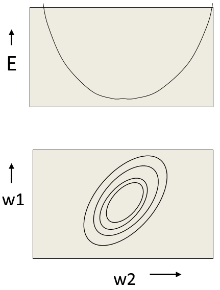
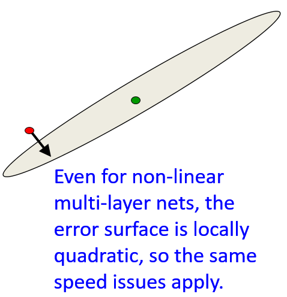
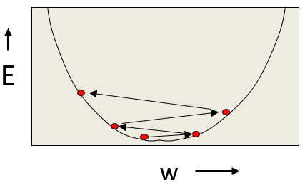

# Mini-batch Gradient Descent
  
## Overview of mini-batch gradient descent

### Lecture Notes

+ Reminder: the error surface for a linear neuron
  + error surface
    + lying in a space with a horizontal axis for each weight and one vertical axis for the error
    + quadratic bowl: a linear neuron with a squared error
    + parabolas: vertical cross-sections
    + ellipses: horizontal cross-sections
  + multi-layer, non-linear nets
    + more complicated
    + a piece of a quadratic bowl: a very good approximation

  

    
  

+ Convergence speed of full batch learning
  + going downhill reducing the error
  + the direction of steepest descent not point at the minimum unless the ellipse is circle
  + big gradient in the direction traveling a small distance
  + small gradient in the direction traveling a large distance
  + locally quadratic error surface applying the same speed issues even for non-linear multi-layer nets

  

    
  

+ How the learning goes wrong
  + big learning rate
    + the weights slosh to and fro across the ravine
    + too big causing oscillation diverges
  + what to achieve
    + quickly in directions with small but consistent gradients
    + slowly in directions with big but inconsistent gradients

  

    
  

+ Stochastic gradient descent
  + highly redundant dataset
    + the first half gradient $\simeq$ the second half gradient
    + update the weights using the first half gradient then get a gradient for the new weights on the second half gradient
  + online: update weights after each case
  + mini-batches usually better than online
    + less computation to update the weights
    + using matrix-matrix multiplies to compute the gradient for many cases simultaneously
    + efficient matrix multiplications, especially on GPUs
  + mini-batches required to be balanced for classes

+ Two types of learning algorithm
  + full gradient computed from all the training cases - ways to speed up learning
    + optimization community: the general problem of optimizing smooth non-linear functions
    + multilayer neural nets: not typical of the problems; required a lot of adaption
  + mini-batch learning for large neural networks w/ very large and highly redundant training sets
    + mini-batches may be quite big when adapting fancy methods
    + big mini-batches: more computationally efficient

+ A basic mini-batch gradient descent algorithm
  + guess an initial learning rate
    + reducing learning rate: error getting worse or oscillated
    + increasing learning rate: error falling fairly consistent but slowly
  + write a simple program to automate this way to adjusting the learning rate
  + end of mini-batch learning
    + nearly always help to turn down the learning rate
    + remove fluctuations in the final weights caused by the variations btw mini-batches
  + turn down the learning rate
    + the error stops decreasing
    + using the error on a separate validation set

### Lecture Video

<video src="url" preload="none" loop="loop" controls="controls" style="margin-left: 2em;" muted="" poster="http://www.multipelife.com/wp-content/uploads/2016/08/video-converter-software.png" width=180>
  <track src="subtitle" kind="captions" srclang="en" label="English" default>
  Your browser does not support the HTML5 video element.
</video> 

## A bag of tricks for mini-batch descent

### Lecture Notes

### Lecture Video

<video src="url" preload="none" loop="loop" controls="controls" style="margin-left: 2em;" muted="" poster="http://www.multipelife.com/wp-content/uploads/2016/08/video-converter-software.png" width=180>
  <track src="subtitle" kind="captions" srclang="en" label="English" default>
  Your browser does not support the HTML5 video element.
</video> 

## The momentum method

### Lecture Notes

### Lecture Video

<video src="url" preload="none" loop="loop" controls="controls" style="margin-left: 2em;" muted="" poster="http://www.multipelife.com/wp-content/uploads/2016/08/video-converter-software.png" width=180>
  <track src="subtitle" kind="captions" srclang="en" label="English" default>
  Your browser does not support the HTML5 video element.
</video> 

## A separate, adaptive learning rate for each connection

### Lecture Notes

### Lecture Video

<video src="url" preload="none" loop="loop" controls="controls" style="margin-left: 2em;" muted="" poster="http://www.multipelife.com/wp-content/uploads/2016/08/video-converter-software.png" width=180>
  <track src="subtitle" kind="captions" srclang="en" label="English" default>
  Your browser does not support the HTML5 video element.
</video> 

## rmsprop_divide the gradient

### Lecture Notes

### Lecture Video

<video src="url" preload="none" loop="loop" controls="controls" style="margin-left: 2em;" muted="" poster="http://www.multipelife.com/wp-content/uploads/2016/08/video-converter-software.png" width=180>
  <track src="subtitle" kind="captions" srclang="en" label="English" default>
  Your browser does not support the HTML5 video element.
</video> 

