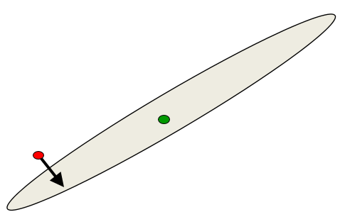

# Mini-batch Gradient Descent
  
## Overview of mini-batch gradient descent

### Lecture Notes

+ Reminder: the error surface for a linear neuron
  + error surface
    + lying in a space with a horizontal axis for each weight and one vertical axis for the error
    + quadratic bowl (top figure): a linear neuron with a squared error
    + parabolas: vertical cross-sections
    + ellipses (bottom figure): horizontal cross-sections
  + multi-layer, non-linear nets
    + more complicated
    + a piece of a quadratic bowl: a very good approximation

  

    
  

+ Convergence speed of full batch learning
  + going downhill reducing the error
  + the direction of steepest descent not point at the minimum unless the ellipse is circle (see figure)
  + big gradient in the direction traveling a small distance
  + small gradient in the direction traveling a large distance  
  + locally quadratic error surface applying the same speed issues even for non-linear multi-layer nets

  

    
  

+ How the learning goes wrong
  + big learning rate
    + the weights slosh to and fro across the ravine
    + too big causing oscillation diverges
  + what to achieve
    + quickly in directions with small but consistent gradients
    + slowly in directions with big but inconsistent gradients

  

    
  

+ Stochastic gradient descent
  + highly redundant dataset
    + the first half gradient $\simeq$ the second half gradient
    + update the weights using the first half gradient then get a gradient for the new weights on the second half gradient
  + online learning: update weights after each case
  + mini-batches usually better than online
    + typically 10, 100, even 1000 examples
    + advantages:
      + less computation to update the weights
      + using matrix-matrix multiplies to compute the gradient for many cases simultaneously
    + efficient matrix multiplications, especially on GPUs
  + mini-batches required to be balanced for classes
    + allocating the same class in a batch causing sloshing weights
    + random permutation for mini batches and randomly select the mini  batches for training

+ Two types of learning algorithm
  + full gradient computed from all the training cases
    + ways to speed up learning, eg. non-linear conjugate gradient
    + optimization community: the general problem of optimizing smooth non-linear functions
    + multilayer neural nets: not typical of the problems; required a lot of modification to make them work
  + mini-batch learning for large neural networks w/ very large and highly redundant training sets
    + mini-batches may be quite big when adapting fancy methods
    + big mini-batches: more computationally efficient

+ A basic mini-batch gradient descent algorithm
  + guess an initial learning rate
    + measured on a validation set
    + each mini-batch just a rough estimate of the overall gradient
    + reducing learning rate: error getting worse or oscillated
    + increasing learning rate: error falling fairly consistent but slowly
  + write a simple program to automate this way to adjusting the learning rate
  + toward end of mini-batch learning
    + nearly always help to turn down the learning rate
    + remove fluctuations in the final weights caused by the variations btw mini-batches
  + cease the learning (criteria)
    + the error stops decreasing
    + using the error on a separate validation set

### Lecture Video

<video src="https://youtu.be/4BZBog1Zx6c?list=PLoRl3Ht4JOcdU872GhiYWf6jwrk_SNhz9" preload="none" loop="loop" controls="controls" style="margin-left: 2em;" muted="" poster="http://www.multipelife.com/wp-content/uploads/2016/08/video-converter-software.png" width=180>
  <track src="subtitle" kind="captions" srclang="en" label="English" default>
  Your browser does not support the HTML5 video element.
</video> 

## A bag of tricks for mini-batch descent

### Lecture Notes

+ Initializing the weights
  + two different units w/ exactly the same bias and exactly the same incoming and outgoing weights
    + exactly the same gradients
    + never learn to be different features
    + break symmetry by initializing the weights to have small random values
  + overshooting learning
    + a hidden unit w/ a big fan-in: small changes on many of its incoming weights
    + a hidden unit w/ a small fan-in: bigger weights
    + generally smaller incoming weights when the fan-in is big
    + principle: initialize the weights to be proportional to sqrt(fan-in)
  + scale the learning rate the same way
 
+ Shifting and scaling the inputs
  + Shifting
    + adding a constant to each of the components of the inputs
    + when using steepest descent, shifting the input values makes a big
    + help to transform each component of the input vector so that it has zero mean over the whole training set
    + Example (left diagram)
      + a linear neuron w/ two weights
      + training cases: 
        + 1st case: 101 & 101 $\rightarrow$ output = 2
        + 2nd case: 101 & 99 $\rightarrow$ output = 0
      + error surface:
        + green line: a line along the weight will satisfy the 1st training case
        + red line: a line along the weights will satisfy the 2ns training case
      + two lines almost parallel and combine them to get a very elongated ellipse
      + by using squared error measure
        + a parabolic through along the red line
        + the red line: the bottom of this parabolic trough
        + another parabolic through along the green line
      + adding these two parabolic troughs #\rightarrow$ a quadratic bowl
      + subtract 100 from each case
        + 1st case: 1 & 1 $\rightarrow$ 2
        + 2ns case: 1 & -1 $\rightarrow$ 0
      + error surface: a circle
        + green line: weights added to 2 (1 x 1 + 1 x 1 = 2)
        + red line: weights added to 0 (1 x 1 + 1 x -1 = 0)
      + obtaining gradient descent easily w/ circle
    + considering the inputs from a hidden unit
      + the hyperbolic tangent (2*logistic - 1) produces hidden activations roughly zero mean
      + hyperbolic tangent btw $[-1, 1]$
      + faster learning in the next layer only if the inputs to the hyperbolic tangents distributed sensibly around 0
      + better than the logistic
    + Logistic better performance
      + logistic sweeps things under
      + output = 0 no matter how small the inputs are
      + fluctuations ignore in big negative inputs
      + hyperbolic tangent requires to go out of the plateau before ignoring
  + Scaling
    + when using steepest descent, scaling the input values makes a big difference
    + help to transform each component of the input vector so that it has unit variance over the whole training set
    + each component of the input with typical variance value of 1 or -1
    + Example (right diagram):
      + a simple net w/ two weights
      + error surface:
        + very small 1st component and much bigger 2nd component
        + ellipse with very high curvature w/ big component while very small curvature w/ very small input
      + color indicating the axis used not the training example
      + changing the variance of the inputs w/ rescaling to make these two components evenly
      + a nice circle error surface represented

  

    
  

+ Decorrelating the input components - a thorough method
  + guarantee to get a circle error surface at least for a linear neuron
  + decorrelate the components of the input vectors to make learning much easier
  + linear neuron: a big win by decorrelating each component of the input from the other input components
  + ways to decorrelate inputs
    + reasonable method: Principal Components Analysis
    + drop the principal components with the smallest eigenvalues
    + achieving some dimensionality reduction
    + divide the remaining principal components by the square roots of their eigenvalues
    + linear neuron: convert an axis aligned elliptical error surface into a circular one
  + circular error surface: the gradient points straight towards the minimum

+ Common problems occurring in multilayer networks
  + Starting w/ a very big learning rate
    + the weights of each hidden unit will all become very big and positive or very big and negative
    + driven the hidden units either firmly on or firmly off
    + state of the hidden unit no longer depends on the input
    + tiny error derivatives for the hidden units and not decreasing; the error root $\rightarrow$ 0
    + hit a plateau (zero derivatives): mistaken for a local minimum
  + Strategy w/ multilayer nets
    + classification networks: using a squared error or a cross-entropy error
    + the best guessing strategy: to make each output unit always produce an output equal to the proportion of time it should be a 1
    + quickly find the strategy and the error decrease quickly
    + multilayer nets:
      + improving over the guessing strategy requires sensible information through the whole nets
      + take a long time to improve on it by making use of the input
      + small weights result in the long learning time
    + quick learn w/ quick stop $\simeq$ local minimum $\rightarrow$ another plateau

+ Criteria to stop the learning
  + error fluctuations caused by the different gradients on different mini-batches
  + turing down the learning rate reduces the random fluctuations in the error
    + a quicker win (red curve)
    + a slower learning (green curve)
  + Don't turn down the learning rate too soon!

  

    
  

+ Methods to speed up mini-batch learning
  + use "momentum"
    + not using the gradient to change the position of the weight "particle"
    + using it to change the velocity
    + analogy:
      + weights = a ball on the error surface
      + gradient to change the position of the ball
      + gradient x learning rate to change the position of the ball by that vector
      + using the gradient to accelerate the ball $\rightarrow$ velocity of the ball w/ the position of the ball
      + ball w/ momentum: remember previous gradients in its velocity
  + use separate adaptive learning rates for each parameter
    + slowly adjust the rate using the consistency of the gradient for that parameter
    + based on empirical measurements
    + criteria: heep making progress by changing the weights in the same direction or oscillating around (sign of the gradient keeps changing)
    + reducing learning rate as oscillation
  + rmsprop
    + divide the learning rate for a weight by a running average of the magnitudes of recent gradients for that weight
    + providing a wide range of different gradients
    + the mini-batch version of just using the sign of the gradient
  + take a fancy method from the optimization literature that makes use of curvature information
    + using the full learning
    + adapt it to work for neural nets
    + adapt it to work for mini-batches

### Lecture Video

<video src="https://youtu.be/Xjtu1L7RwVM?list=PLoRl3Ht4JOcdU872GhiYWf6jwrk_SNhz9" preload="none" loop="loop" controls="controls" style="margin-left: 2em;" muted="" poster="http://www.multipelife.com/wp-content/uploads/2016/08/video-converter-software.png" width=180>
  <track src="subtitle" kind="captions" srclang="en" label="English" default>
  Your browser does not support the HTML5 video element.
</video> 

## The momentum method

### Lecture Notes

### Lecture Video

<video src="url" preload="none" loop="loop" controls="controls" style="margin-left: 2em;" muted="" poster="http://www.multipelife.com/wp-content/uploads/2016/08/video-converter-software.png" width=180>
  <track src="subtitle" kind="captions" srclang="en" label="English" default>
  Your browser does not support the HTML5 video element.
</video> 

## A separate, adaptive learning rate for each connection

### Lecture Notes

### Lecture Video

<video src="url" preload="none" loop="loop" controls="controls" style="margin-left: 2em;" muted="" poster="http://www.multipelife.com/wp-content/uploads/2016/08/video-converter-software.png" width=180>
  <track src="subtitle" kind="captions" srclang="en" label="English" default>
  Your browser does not support the HTML5 video element.
</video> 

## rmsprop_divide the gradient

### Lecture Notes

### Lecture Video

<video src="url" preload="none" loop="loop" controls="controls" style="margin-left: 2em;" muted="" poster="http://www.multipelife.com/wp-content/uploads/2016/08/video-converter-software.png" width=180>
  <track src="subtitle" kind="captions" srclang="en" label="English" default>
  Your browser does not support the HTML5 video element.
</video> 

