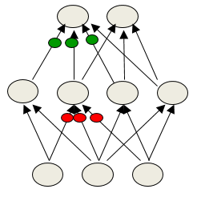

# Mini-batch Gradient Descent
  
## Overview of mini-batch gradient descent

### Lecture Notes

+ Reminder: the error surface for a linear neuron
  + error surface
    + lying in a space with a horizontal axis for each weight and one vertical axis for the error
    + quadratic bowl (top figure): a linear neuron with a squared error
    + parabolas: vertical cross-sections
    + ellipses (bottom figure): horizontal cross-sections
  + multi-layer, non-linear nets
    + more complicated
    + a piece of a quadratic bowl: a very good approximation

  

    
  

+ Convergence speed of full batch learning
  + going downhill reducing the error
  + the direction of steepest descent not point at the minimum unless the ellipse is circle (see figure)
  + big gradient in the direction traveling a small distance
  + small gradient in the direction traveling a large distance  
  + extended to non-linear multi-layer nets: locally quadratic error surface applying the same speed issues

  

    
  

+ How the learning goes wrong
  + big learning rate
    + the weights slosh to and fro across the ravine
    + too big causing oscillation diverges
  + what to achieve
    + quickly in directions with small but consistent gradients
    + slowly in directions with big but inconsistent gradients

  

    
  

+ Stochastic gradient descent
  + highly redundant dataset
    + the first half gradient $\simeq$ the second half gradient
    + update the weights using the first half gradient then get a gradient for the new weights on the second half gradient
  + online learning: update weights after each case
  + mini-batches usually better than online
    + typically 10, 100, even 1000 examples
    + advantages:
      + less computation to update the weights
      + using matrix-matrix multiplies to compute the gradient for many cases simultaneously
    + efficient matrix multiplications, especially on GPUs
  + mini-batches require to be balanced for classes
    + allocating the same class in a batch causing sloshing weights
    + random permutation for mini-atches and randomly select the mini-batches for training

+ Two types of learning algorithm
  + full gradient computed from all the training cases
    + ways to speed up learning, eg. non-linear conjugate gradient
    + optimization community: the general problem of optimizing smooth non-linear functions
    + multilayer neural nets: not typical of the problems; required a lot of modification to make them work
  + mini-batch learning for large neural networks w/ very large and highly redundant training sets
    + mini-batches may be quite big when adapting fancy methods
    + big mini-batches: more computationally efficient

+ A basic mini-batch gradient descent algorithm
  + guess an initial learning rate
    + measured on a validation set
    + each mini-batch just a rough estimate of the overall gradient
    + reducing learning rate: error getting worse or oscillated
    + increasing learning rate: error falling fairly consistent but slowly
  + write a simple program to automate this way to adjusting the learning rate
  + toward end of mini-batch learning
    + nearly always help to turn down the learning rate
    + remove fluctuations in the final weights caused by the variations btw mini-batches
  + criteria to cease the learning
    + the error stops decreasing
    + using the error on a separate validation set

### Lecture Video

<video src="https://youtu.be/4BZBog1Zx6c?list=PLoRl3Ht4JOcdU872GhiYWf6jwrk_SNhz9" preload="none" loop="loop" controls="controls" style="margin-left: 2em;" muted="" poster="http://www.multipelife.com/wp-content/uploads/2016/08/video-converter-software.png" width=180>
  <track src="subtitle" kind="captions" srclang="en" label="English" default>
  Your browser does not support the HTML5 video element.
</video> 

## A bag of tricks for mini-batch descent

### Lecture Notes

+ Initializing the weights
  + two different units w/ exactly the same bias and exactly the same incoming and outgoing weights
    + exactly the same gradients
    + never learn to be different features
    + break symmetry by initializing the weights to have small random values
  + overshooting learning
    + a hidden unit w/ a big fan-in: small changes on many of its incoming weights
    + a hidden unit w/ a small fan-in: bigger weights
    + generally smaller incoming weights when the fan-in is big
    + principle: initialize the weights to be proportional to sqrt(fan-in)
  + scale the learning rate the same way as initialization
 
+ Shifting and scaling the inputs
  + Shifting
    + adding a constant to each of the components of the inputs
    + when using steepest descent, shifting the input values makes a big
    + help to transform each component of the input vector so that it has zero mean over the whole training set
    + Example (left diagram)
      + a linear neuron w/ two weights
      + training cases: 
        + 1st case: 101 & 101 $\rightarrow$ output = 2
        + 2nd case: 101 & 99 $\rightarrow$ output = 0
      + error surface:
        + green line: a line along the weight will satisfy the 1st training case
        + red line: a line along the weights will satisfy the 2ns training case
      + two lines almost parallel and combine them to get a very elongated ellipse
      + by using squared error measure
        + a parabolic through along the red line
        + the red line: the bottom of this parabolic trough
        + another parabolic through along the green line
      + adding these two parabolic troughs $\rightarrow$ a quadratic bowl
      + subtract 100 from each case
        + 1st case: 1 & 1 $\rightarrow$ 2
        + 2ns case: 1 & -1 $\rightarrow$ 0
      + error surface: a circle
        + green line: weights added to 2 (1 x 1 + 1 x 1 = 2)
        + red line: weights added to 0 (1 x 1 + 1 x -1 = 0)
      + obtaining gradient descent easily w/ circle
    + considering the inputs from a hidden unit
      + the hyperbolic tangent (2*logistic - 1) produces hidden activations roughly zero mean
      + hyperbolic tangent btw $[-1, 1]$
      + faster learning in the next layer only if the inputs to the hyperbolic tangents distributed sensibly around 0
      + better than the logistic
    + Logistic performs better
      + logistic sweeps things under
      + output = 0 no matter how small the inputs are
      + fluctuations ignore in big negative inputs
      + hyperbolic tangent requires to go out of the plateau before ignoring
  + Scaling
    + when using steepest descent, scaling the input values makes a big difference
    + help to transform each component of the input vector so that it has unit variance over the whole training set
    + each component of the input with typical variance value of 1 or -1
    + Example (right diagram):
      + a simple net w/ two weights
      + error surface:
        + very small 1st component and much bigger 2nd component
        + ellipse with very high curvature w/ big component while very small curvature w/ very small input
      + color indicating the axis used not the training example
      + changing the variance of the inputs w/ rescaling to make these two components evenly
      + a nice circle error surface represented

  

    
  

+ Decorrelating the input components - a thorough method
  + guarantee to get a circle error surface at least for a linear neuron
  + decorrelate the components of the input vectors to make learning much easier
  + linear neuron: a big win by decorrelating each component of the input from the other input components
  + ways to decorrelate inputs
    + reasonable method: Principal Components Analysis
    + drop the principal components with the smallest eigenvalues
    + achieving some dimensionality reduction
    + divide the remaining principal components by the square roots of their eigenvalues
    + linear neuron: convert an axis aligned elliptical error surface into a circular one
  + circular error surface: the gradient points straight towards the minimum

+ Common problems occurring in multilayer networks
  + Starting w/ a very big learning rate
    + the weights of each hidden unit will all become very big and positive or very big and negative
    + driven the hidden units either firmly on or firmly off
    + state of the hidden unit no longer depends on the input
    + tiny error derivatives for the hidden units and not decreasing; the error root $\rightarrow$ 0
    + hit a plateau (zero derivatives): mistaken for a local minimum
  + Strategy w/ multilayer nets
    + classification networks: using a squared error or a cross-entropy error
    + the best guessing strategy: to make each output unit always produce an output equal to the proportion of time it should be a 1
    + quickly find the strategy and the error decrease quickly
    + multilayer nets:
      + improving over the guessing strategy requires sensible information through the whole nets
      + take a long time to improve on it by making use of the input
      + small weights result in the long learning time
    + quick learn w/ quick stop $\simeq$ local minimum $\rightarrow$ another plateau

+ Criteria to stop the learning
  + error fluctuations caused by the different gradients on different mini-batches
  + turing down the learning rate reduces the random fluctuations in the error
    + a quicker win (red curve)
    + a slower learning (green curve)
  + Don't turn down the learning rate too soon!

  

    
  

+ Methods to speed up mini-batch learning
  + use "momentum"
    + not using the gradient to change the position of the weight "particle"
    + using it to change the velocity
    + analogy:
      + weights = a ball on the error surface
      + gradient to change the position of the ball
      + gradient x learning rate to change the position of the ball by that vector
      + using the gradient to accelerate the ball $\rightarrow$ velocity of the ball w/ the position of the ball
      + ball w/ momentum: remember previous gradients in its velocity
  + use separate adaptive learning rates for each parameter
    + slowly adjust the rate using the consistency of the gradient for that parameter
    + based on empirical measurements
    + criteria: heep making progress by changing the weights in the same direction or oscillating around (sign of the gradient keeps changing)
    + reducing learning rate as oscillation
  + rmsprop
    + divide the learning rate for a weight by a running average of the magnitudes of recent gradients for that weight
    + providing a wide range of different gradients
    + the mini-batch version of just using the sign of the gradient
  + take a fancy method from the optimization literature that makes use of curvature information
    + using the full learning
    + adapt it to work for neural nets
    + adapt it to work for mini-batches

### Lecture Video

<video src="https://youtu.be/Xjtu1L7RwVM?list=PLoRl3Ht4JOcdU872GhiYWf6jwrk_SNhz9" preload="none" loop="loop" controls="controls" style="margin-left: 2em;" muted="" poster="http://www.multipelife.com/wp-content/uploads/2016/08/video-converter-software.png" width=180>
  <track src="subtitle" kind="captions" srclang="en" label="English" default>
  Your browser does not support the HTML5 video element.
</video> 

## The momentum method

### Lecture Notes

+ Momentum method
  + applied to both full batch or mini-batch learning
  + probably the commonest recipe for big neural nets: combining stochastic gradient descent with mini matches and momentum

+ The intuition behind the momentum method
  + Analogy
    + a ball on the error surface
    + weight vector: the location of the ball in the horizontal plane
    + the ball starting stationary
    + initialized by following the direction of steepest descent, the gradient
    + once gaining velocity, the ball no longer in the same direction as the gradient
    + its momentum making it keep going in the previous direction
  + damping oscillations in directions of high curvature by combining gradients w/ opposite signs
    + eventually getting to a low point on the surface
    + viscosity: making the velocity die off gently on each or update
  + built up speed in directions w/ a gradient but consistent gradient
  + Example:
    + red dot: starting point
    + green dot: the weights after two steps
    + the gradients pretty much equal and opposite
    + the gradient across the ravine canceled out
    + the gradient along the ravines not canceled
    + kept building up a speed along the ravine
    + once momentum settle down, tend to go along the bottom of the ravine accumulating velocity as it goes
    + might go faster than steepest descent

  

    
  

+ Mathematical representation of the momentum method
  
  \[\begin{align*}
    \mathbf{v}(t) &= \alpha \, \mathbf{v}(t-1) - \varepsilon \frac{\partial E}{\partial \mathbf{w}}(t) \tag*{(1)} \\\\
    \Delta \mathbf{w}(t) &= \mathbf{v} (t) \tag*{(2)} \\
     &= \alpha \, \mathbf{v}(t-1) - \varepsilon \frac{\partial E}{\partial \mathbf{w}}(t) \\
     &= \alpha \, \Delta \mathbf{w} (t-1) - \varepsilon \frac{\partial E}{\partial \mathbf{w}}(t) \tag*{(3)}
  \end{align*}\]

  + Eq. (1):
    + the velocity at time $t$: the mini-batch w/ $t-1$ attenuated by a number, like $0.9$, and adding the effect of the current gradient
    + $t$: the updates of weights
    + (alpha) momentum = the viscosity (0.9)
    + effect of gradient: downhill by a given learning rate times the gradient at time $t$
    + The effect of the gradient is to increment the previous velocity.
    + The velocity also decays by $\alpha$ which is slightly less than 1.
  + Eq. (2): The weight change is equal to the current velocity.
  + Eq. (3): The weight change can be expressed in terms of the previous weight change and the current gradient.

+ The behavior of the momentum method
  + error surface as a tilted plane
    + the gain of velocity from the gradient balanced by the multiplicative attenuation of the velocity due to the momentum term
    + the ball reaches a terminal velocity
    + if momentum $\rightarrow 1$, going down much faster than simple gradient descent
    + terminal velocity: as $t \rightarrow \infty$

    \[\mathbf{v}(\infty) = \frac{1}{1 - \alpha} \left( -\varepsilon \frac{\partial E}{\partial \mathbf{w}} \right)\]

    + Derivation

      \[\begin{align*}
        & v(\infty) = \alpha \, v(\infty) - \varepsilon \, \frac{\partial E}{\partial w} (t) \\
        & (1 - \alpha) \, v(\infty) = - \varepsilon \frac{\partial E}{\partial w} (t) \\
        & v(\infty) = \frac{1}{(1 - \alpha)} \, \left(-\varepsilon \frac{\partial E}{\partial w}(t)\right)
      \end{align*}\]

    + $\alpha = 0.99$: 100 times as fast as the learning rate alone
  + Initialized w/ big random weights
    + there may be very large gradients w/ many weights
    + not good for the task 
    + preventing big momentum to change quickly $\rightarrow$ difficult to find the right relative values of different weights
    + playing w/ a small momentum (e.g. 0.5) to average out sloshes in obvious ravines
    + once the large gradients disappeared and the weights stuck in a ravine the momentum
      + along the bottom of the ravine w/o sloshing to and fro
      + smoothly raised to the final value (e.g. 0.9 or even 0.99)
  + using a small learning rate with a big momentum to get rid of an overall learning rate
  + learning at a rate alone that would cause divergent oscillations without the momentum

+ A better type of momentum (Nesterov 1983)
  + standard momentum method
    1. compute the gradient at the current location
    2. take a big jump in the direction of the updated accumulated gradient
  + Ilya Sutskever (2012)
    + a new form of momentum working better
    + inspired by the Nesterov method for optimizing convex functions
  + Nesterov approach
    1. make a big jump in the direction of the previous accumulated gradient
    2. measure the gradient where ending up and making a correction: better to correct a mistake after you have made it
  + standard vs Nesterov
    + standard: adding the current gradient and then gambling on the big jump
    + Nesterov: using the previous accumulated gradient to make the big  and then correct itself at the place
  + Pictorial of Nesterov approach
    1. make a big jump in the direction of the previous accumulated gradient (brown vector)
    2. measure the gradient where end up and make a correction (red vector)
    3. combine the little correction step with the big jump to get the new accumulated gradient (green vector)
    4. attenuate the gradient (green vector) by a given number ($\alpha = 0.9 \text{ or } 0.99$)
    5. repeat the steps
  + Pictirial standard momentum approach
    1. start with an accumulated gradient (initialized brown vector)
    2. measure the gradient at current location (small blue vector)
    3. add to the accumulated gradient (brown vector) to make a big jump as the big blue vector (brown vector + little blue vector)
  + gamble need: better to (gamble first then make a correction) than (make a correct and then gamble)

  

    
  

  + brown vector = jump
  + red vector = correction
  + green vector = accumulated gradient
  + blue vector = standard momentum

### Lecture Video

<video src="https://youtu.be/LdkkZglLZ0Q?list=PLoRl3Ht4JOcdU872GhiYWf6jwrk_SNhz9" preload="none" loop="loop" controls="controls" style="margin-left: 2em;" muted="" poster="http://www.multipelife.com/wp-content/uploads/2016/08/video-converter-software.png" width=180>
  <track src="subtitle" kind="captions" srclang="en" label="English" default>
  Your browser does not support the HTML5 video element.
</video> 

## Adaptive learning rate for each connection

### Lecture Notes

+ Adaptive Learning rate
  + Robbie Jacobs initiated in 1980s
  + each connection in neural network should have its own adaptive learning rate
  + empirical setting by observing what happen to the weight on that connection when updating
  + if the weights
    + keep reversing the gradient, decreasing the learning rate
    + stay consistent w/ the gradient, increasing the learning rate

+ The intuition behind separate adaptive learning rates
  + appropriate learning rates vary widely between weights
    + different layers w/ different magnitudes of the gradients, in particular, small initial weights
    + the fan-in of a unit determining the size of the "overshoot" effect
    + overshoot effect: simultaneously changing many of the incoming weights of a unit to correct the same error
    + unit might not get enough input when changing all the weights at the same time to fix up the area causing too much input
  + using a global learning rate (set by hand) multiplied by an appropriate local gain determined empirically for each weight
  + Example
    + starting with small weights
    + the gradients often much smaller in the initial layers than the later ones
    + more or less the same fan-in values for both layers
    + the fan-in varies widely between layers

    

      
    

+ Approach to determine the individual learning rates
  + starting with a local gain of 1 for every weight
    + changing the weight $w_{ij}$ by the learning rate times the gain of $g_{ij}$ times the error derivative for that weight
  + increasing the local gain $g_{ij}$ if the gradient not changing sign for that weight
  + using small additive increases and multiplicative decreases (for mini-batch)
    + ensuring big gains decay rapidly when oscillations start
      + $t$ refers to weight updates
      + positive derivative product: two positive or two negative gradients
    + the gain hovering around 1
      + increasing $g_{ij}$ by plus $\delta$ half the time, small additive amount
      + decreasing $g_{ij}$ by times $1 - \delta$ half the time, larger decrement if oscillation starts
      + evenly distributed with totally random gradient
      + equilibrium point of gain as 1

  \[\begin{align*}
    \Delta w_{ij} &= -\varepsilon \, g_{ij} \; \frac{\partial E}{\partial w_{ij}} \\\\
    \text{if } & \; \left( \frac{\partial E}{\partial{w_{ij}}}(t) \frac{\partial E}{\partial w_{ij}} (t-1) \right) > 0 \\
    \text{then } & \; g_{ij}(t) = g_{ij}(t-1) + .05 \\
    \text{else } & \; g_{ij}(t) = g_{ij}(t-1) \times .95
  \end{align*}\]

+ Tricks for making adaptive learning rates work better
  + limit the gains to lie in some reasonable range
    + e.g. $[0.1, 10]$ or $[.01, 100]$
    + no huge gains to prevent instability and fast convergence
  + designed for full batch learning or big min-batches
    + ensuring changes in the sign of the gradient are not mainly due to the sampling error of a mini-batch
  + Adaptive learning rates combined with momentum
    + using the agreement in sign btw the current gradient for a weight and the velocity for that weight (Jacobs, 1989)
  + Adaptive learning rates only dealt with axis-aligned effects
    + momentum not care about the alignment of the axes
    + momentum deal with diagonal ellipses and along the diagonal direction quickly

### Lecture Video

<video src="https://youtu.be/GZG1hmWA-oA?list=PLoRl3Ht4JOcdU872GhiYWf6jwrk_SNhz9" preload="none" loop="loop" controls="controls" style="margin-left: 2em;" muted="" poster="http://www.multipelife.com/wp-content/uploads/2016/08/video-converter-software.png" width=180>
  <track src="subtitle" kind="captions" srclang="en" label="English" default>
  Your browser does not support the HTML5 video element.
</video> 

## rmsprop: Normalized the gradient

### Lecture Notes

+ rprop: using only the sign of the gradient
  + the magnitude of the gradient
    + different widely for different weights
    + change during learning
    + hard to choose a single global learning rate
  + full batch learning
    + deal with this variation by only using the sign of the gradient
    + just using the sign of the gradient
    + updating weight w/ the same magnitude
    + solution for quickly escaping from plateau even with tiny gradients
    + unable to achieve just by turning up the learning rate
  + approach
    + combining the idea of only using the sign of the gradient w/ the idea of adapting the step size separately for each weight
    + the sign of the last two gradients, not the magnitude of the gradients
      + agree: increasing the step size for a weight multiplicatively (e.g. times 1.2)
      + decrease the step size multiplicatively (e.g. times 0.5)
    + Mike Shuster's advice: limiting the step sizes to be less than 50 and more than a millionth ($10^{-6}$)
    + the step size depends on the problem dealing with
      + tiny inputs: big weights required for the inputs

+ rprop not working with mini-batches
  + rprop works with very big mini-batches where much more conservative changes to the step sizes
  + violate central idea of stochastic gradient descent
    + for small learning rate, the gradient gets effectively averaged over successive mini-batches
    + considering a weight
      + a gradients of +0.1 on nine mini-batches and a gradient of -0.9 on the tenth mini-batch (0.1 x 9 + (-0.9) x 1)
      + roughly average out the gradients
      + the weight to stay roughly where it is
  + rprop:
    + not following the idea of stochastic gradient descent
    + assumption: any adaptation of the step sizes is smaller on the time scale of the mini-batches
    + increasing the weight nine times by whatever it's current step size is
    + decreasing the weight only once
    + making the weight much bigger
    + weight vector grows
  + Criteria to judge the combination
    + the robustness of rprop: just using the sign of the gradient
    + the efficiency of mini-batches
    + the effective averaging of the gradients over mini-batches

+ rmsprop: A mini-batch version of rprop
  + problem w/ mini-batch rprop
    + using the gradient but also divided by the different magnitude of the gradient for each mini-batch
    + solution: force the number divided by to be very similar for adjacent mini-batches
  + rmsprop: keep a moving average of the squared gradient for each weight (e.g. $\alpha = 0.9$)

    \[MeanSquare(w, t) = \alpha \, MeanSquare(w, t-1) + (1 - \alpha) \, (\frac{\partial E}{\partial w}(t))^2\]
  
  + dividing the gradient by $\sqrt{MeanSquare(w, t)}$ makes the learning work much better (Tijmen Tieleman, unpublished)
  + not adapting the learning rate separately for each connection
  + A simple approach: for each connection keep a running average of the root mean squared gradient and the gradient divides by that RMS

+ Extension of rmsprop
  + combining rmsprop with standard momentum
    + not help as much as momentum normally does
    + more investigation required
  + combining rmsprop w/ Nesterov momentum (Sutskever 2012)
    + making the jump first then make a correction
    + work best if the RMS of the recent gradients used
    + divide the correction term rather than the large jump made in the direction of accumulated corrections
  + combining rmsprop with adaptive learning rates for each connection
    + more investigation required
  + other methods related to rmsprop
    + Yann LeCun's group: a fancy version in "No more pesky learning rates"

+ Summary of learning methods for neural networks
  + full-batch method
    + small datasets (e.g. 10,000 cases) or bigger datasets w/o much redundancy
    + optimization: non-linear conjugate gradient, LBFGS, ...
      + usually off-shelf packages existed
    + learning rate: adaptive learning rates, rprop, ...
  + mini-batch method
    + big, redundant datasets
    + try gradient descent w/ momentum
      + choose global learning rate
      + loop to adapt global learning rate based on whether the gradients change sign
    + try rmsprop (w/ momentum ?)
    + try LeCunn's latest recipe
  + No simple recipe
    + Very different neural nets
      + very deep nets (especially ones w/ narrow bottlenecks)
        + difficult to optimize
        + sensitive to very small gradients
      + recurrent nets
        + difficult to optimize
        + long memory required
      + wide shallow nets
        + use a lot in practice
        + often optimized w/ methods not very accurate due to stop too early before overfitting
    + Very different tasks
      + very different accuracy requirements on weights
      + cases w/ weird properties, e.g. many very rare cases, words as inputs

### Lecture Video

<video src="https://youtu.be/defQQqkXEfE?list=PLoRl3Ht4JOcdU872GhiYWf6jwrk_SNhz9" preload="none" loop="loop" controls="controls" style="margin-left: 2em;" muted="" poster="http://www.multipelife.com/wp-content/uploads/2016/08/video-converter-software.png" width=180>
  <track src="subtitle" kind="captions" srclang="en" label="English" default>
  Your browser does not support the HTML5 video element.
</video> 

