# 7. Recurrent Neural Networks

## 7.1 Modeling sequences: A brief overview

### Lecture Notes

+ Getting targets when modeling sequences
  + when applying machine learning to sequences, often turn an input sequence into an output sequence that lives in a different domain
    + e.g., turn a sequence of sound pressures into a sequence of word identities
  + when no separate target sequence, get a teaching signal by trying to predict the next term in the input sequence
    + target output sequence: the input sequence with an advance of 1 step
    + seeming much more natural than trying to predict one pixel in an image from other pixels, or one patch of an image from the rest of the image
    + temporal sequences: a natural order for the predictions
  + predicting the next terms in a sequence blurs the distinction between supervised and unsupervised learning
    + using methods designed for supervised learning but not require a separate teaching signal (sounds like unsupervised)

+ Memoryless models for sequences
  + autoregressive models: predict the next term in a sequence from a fixed number of previous terms using "delay taps"
  + feed-forward neural nets
    + these generalize autoregressive models by using one or more layers of non-linear hidden units
    + e.g. Bengio's first language model

  

    <a href="http://www.cs.toronto.edu/~hinton/coursera/lecture7/lec7.pdf" ismap target="_blank">
      
      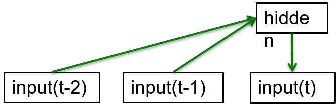
    </a>
  

+ Beyond memoryless models
  + generative model w/ hidden state that has its own internal dynamics
    + providing a much more interesting kind of model
    + storing information in its hidden state for a long time
    + dynamics is noisy $\to$ outputs generated from its hidden states is noisy $\to$ the exact hidden state unknown
    + best practice: infer a probability distribution over the space of hidden state vectors
  + inference: only tractable for two types of hidden state model
    + two types of hidden state model: linear dynamic systems & hidden Markov models
    + showing how RNNs differ

+ Linear dynamical systems (engineers perspective)
  + generative models
    + a real-value hidden state not able to observed directly
    + hidden state having linear dynamics w/ Gaussian noise
    + producing the observations using a linear model w/ Gaussian noise
    + there may also be driving inputs
  + to predict the next output
    + required to infer the hidden state
    + a linear transformed Gaussian is a Gaussian
    + distribution over the hidden state given the data so far is Gaussian
    + computed using "Kalman filtering", an efficient recursive way of updating the representation of the hidden state given a new observation
  + Summary: 
    + given the observations of the output system, not sure what hidden state in but able to estimate a Gaussian distribution over the possible hidden state it might have been in
    + always assuming the model is the correct one

  

    <a href="http://www.cs.toronto.edu/~hinton/coursera/lecture7/lec7.pdf" ismap target="_blank">
      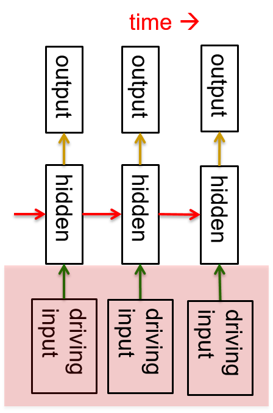
    </a>
  

+ Hidden Markov Models (computer scientists perspective)
  + a discrete one-of-N hidden state
    + transition btw states are stochastic and controlled by a transition matrix
    + stochastic outputs w/ a state
    + not sure which state produced a given output $\to$ the state is "hidden"
    + easy to represent a probability distribution across $N$ states w/ $N$ numbers
  + to predict the next output
    + required to infer probability distribution over hidden states
    + HMMs w/ efficient algorithms for inference and learning
  + an easy method based on dynamic programming to observer the output and compute the probability distribution across the hidden states

  

    <a href="http://www.cs.toronto.edu/~hinton/coursera/lecture7/lec7.pdf" ismap target="_blank">
      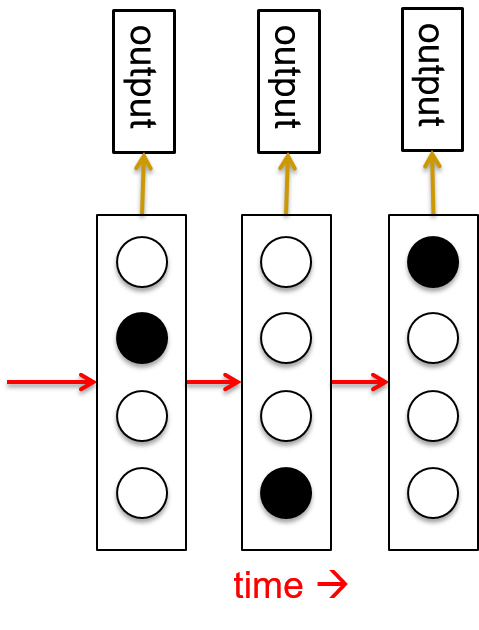
    </a>
  

+ A fundamental limitation of HMMs
  + considering what happens when a hidden Markov model generates data
    + select one of its hidden states at each time step
    + with $N$ hidden states, only remember $\log(N)$ bits about what it generated
  + considering the first half of an utterance contains about the second half
    + syntax to fit, e.g., number and tense agreement
    + semantic to fit; intonation to fit
    + accent, rate, volume and vocal tract characteristics must all fit
  + all aspects combined could be 100 bits of information that the fist half of an utterance needs to convey to the second half. $2^{100}$ is big!

+ Recurrent neural networks
  + efficient way to remember the information
  + very powerful
  + Properties of RNNs
    + distributed hidden state: to store a lot of information about the past efficiently
    + non-linear dynamics: to update their hidden state in complicated ways
  + with enough neurons and time RNNs able to compute anything that can be computed by your computer

  

    <a href="http://www.cs.toronto.edu/~hinton/coursera/lecture7/lec7.pdf" ismap target="_blank">
      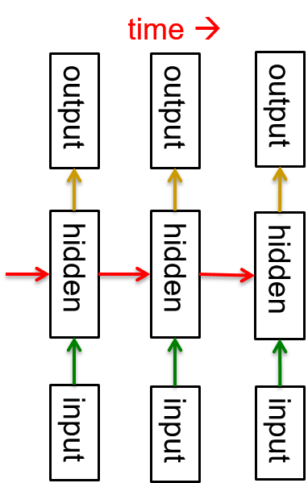
    </a>
  

+ Do generative models need to be stochastic?
  + stochastic models: both linear dynamical systems and hidden Markov models
    + the posterior probability distribution over their hidden states given the observed data so far is a deterministic function of the data
    + probability distribution: a bunch of numbers that are a deterministic function of the data
  + recurrent neural networks are deterministic
    + think of the hidden state of an RNN as the equivalent of the deterministic probability distribution over hidden states in a linear dynamical system or hidden Markov model
    + the numbers constitute the hidden state of a recurrent neural network

+ Recurrent neural networks
  + what kinds of behavior can RNNs exhibit?
    + oscillate: good for motor control?
    + settle to point attractors: good for retrieving memories?
    + chaotic behavior: bad for information processing? randomness?
    + RNNs potentially learn to implement lots small programs using different subsets of its hidden state
    + each program able to capture a nugget of knowledge
    + the programs able to run in parallel
    + interacting each other to produce very complicated effects
  + the computational power of RNNs makes them very hard to train
    + unable to exploit the computational power of RNNs
    + implementing on a parallel computer

### Lecture Video

<video src="https://youtu.be/enI1YMvCJ34?list=PLoRl3Ht4JOcdU872GhiYWf6jwrk_SNhz9" preload="none" loop="loop" controls="controls" style="margin-left: 2em;" muted="" poster="http://www.multipelife.com/wp-content/uploads/2016/08/video-converter-software.png" width=180>
  <track src="subtitle" kind="captions" srclang="en" label="English" default>
  Your browser does not support the HTML5 video element.
</video> 

## 7.2 Training RNNs with backpropagation

### Lecture Notes

+ The equivalence between feed-forward nets and recurrent nets
  + Architecture: 3 interconnected neurons
  + network running in discrete time, i.e., a clock w/ integer ticks
  + assumption: a time delay of 1 in using each connection
  + objective: how to train a recurrent network
  + recurrent network expended in time same as a feed-forward network
  + Activities:
    + time 0: network starts off in some initial state
    + time 1: using the weights on its connections to get new state
    + time 2: using the same weights again to get another new state
    + time 3: using the same weights again to get another new state
    + ...
  + the recurrent net is just a layered net that keeps reusing the same weights

  

    <a href="http://www.cs.toronto.edu/~hinton/coursera/lecture7/lec7.pdf" ismap target="_blank">
      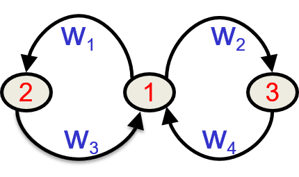
      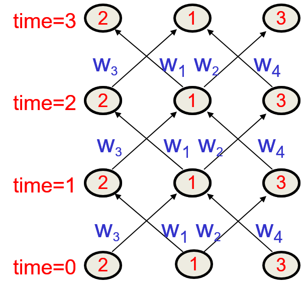
    </a>
  

+ Recall: backpropagation w/ weight constraints
  + easy to modify the backpropagation algorithm to incorporate linear constraints between the weights
  + computing the gradients as usual, and then modify the gradients to satisfy then constraints
  + continuing process to satisfy the constraints if the weights not satisfied  

    To constraint: $w_1 = w_2$

    we need: $\Delta w_1 = \Delta w_2$

    compute: $\frac{\partial E}{\partial w_1}$ and $\frac{\partial E}{\partial w_2}$

    use $\frac{\partial E}{\partial w_1} + \frac{\partial E}{\partial w_2}$ for $w_1$ and $w_2$
 
+ backpropagation through time
  + recurrent net: a layered, feed-forward net with shared weights
  + training the feed-forward net w/ weight constraints
  + training algorithm in the time domain
    + forward pass: a stack of the activities of all the units at each time step
    + backward pass: peeling activities off the stack to compute the error derivatives at each time step
    + adding the sum or average of the derivatives at all the different times for each weight after backward pass; i.e., changing all the copies of that weight by the same amount which is proportional to the sum or average of all those derivatives

+ An irritating extra issue
  + specifying the initial activity state of all the hidden and output units
  + could just fix these initial states to have some default value like 0.5
  + better to treat the initial states as learned parameters rather than activities
  + training them in the same way as we learn the weights
    + starting off w/ an initial random guess for the initial states for all units except for input units
    + at the end of each training sequence, backpropagate through time all the way to the initial states to get the gradient of the error function w.r.t. each initial state
    + adjusting the initial states by following the negative gradient

+ Input and Output of recurrent networks
  + specifying inputs in several ways (left diagram)
    + the initial states of all the units (e.g., bottom layer units):
      + the most natural thing to do when thinking of a recurrent net
      + like feed-forward network constrained weights
    + the initial states of a subset of the units (e.g. the only unit on bottom left of the network)
    + the states of the same subset of the units at every time step (e.g., the vertical units with $w_1$ weight connection)
      + the natural way to model most sequential data
  + specifying targets in several ways (right diagram)
    + desired final activities of all the units (e.g., the units on the top layer)
      + the most natural way for a feed-forward network w/ constrained weights
    + desired activities of all units for the last few steps (e.g. units on the last two top layers)
      + good for learning attractors
      + easy to add in extra error derivatives as backpropagated
      + e.g., get derivatives of the final time step, then go back through the layer before the top and add in the derivatives for that layer
    + the desired activity of a subset of the units (e.g., the right units of each layer)
      + other units: input or hidden units

  

    <a href="http://www.cs.toronto.edu/~hinton/coursera/lecture7/lec7.pdf" ismap target="_blank">
      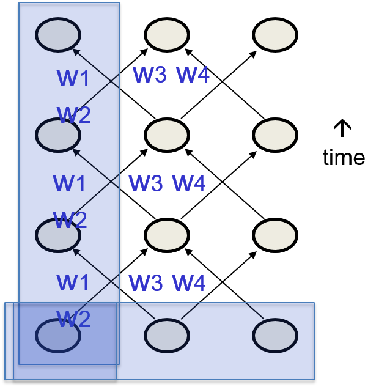
      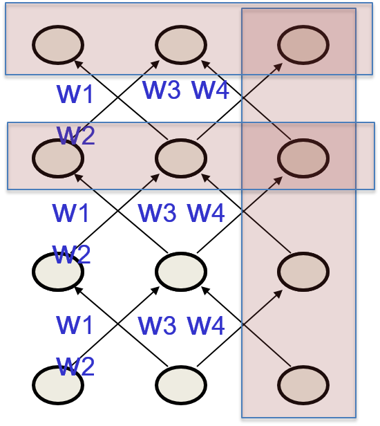
    </a>
  

### Lecture Video

<video src="https://youtu.be/hTcm8AJjvfE?list=PLoRl3Ht4JOcdU872GhiYWf6jwrk_SNhz9" preload="none" loop="loop" controls="controls" style="margin-left: 2em;" muted="" poster="http://www.multipelife.com/wp-content/uploads/2016/08/video-converter-software.png" width=180>
  <track src="subtitle" kind="captions" srclang="en" label="English" default>
  Your browser does not support the HTML5 video element.
</video> 

## 7.3 A toy example of training an RNN

### Lecture Notes

+ A good toy problem for a recurrent network
  + training a feed-forward net to do binary addition
    + there are obvious regularities that it cannot capture efficiently
    + decide in advance the maximum number of digits in each number
    + processing applied to the beginning of a long number does not generalize to the end of long number because it uses different weights
  + feed-forward nets not generalized well on the binary addition task

  

    <a href="http://www.cs.toronto.edu/~hinton/coursera/lecture7/lec7.pdf" ismap target="_blank">
      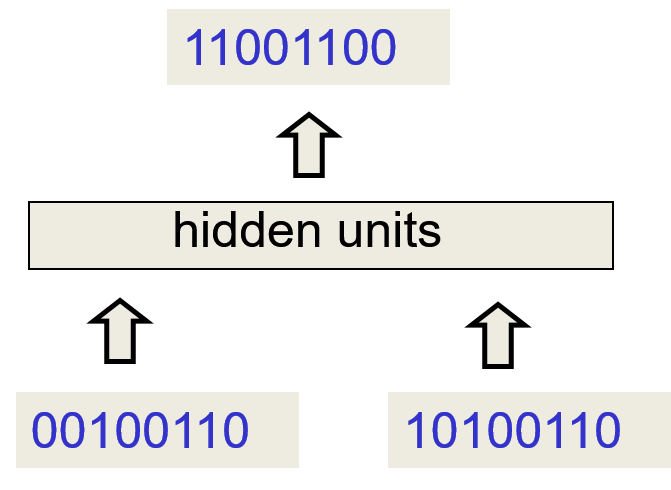
    </a>
  

+ The algorithm for binary addition
  + a finite state automation
  + system in one state at a time
  + performing the action to print 1 or 0 once entering a state
  + get input (the two number in the next column) when staying a state
  + the input deciding what transition to make by looking at the next column
  + making the transition
  + moving from right to left over the two input numbers
  + Binary addition algorithm example: top right state: a carry state to print 1 (see diagram)
    + (1, 1): back into itself
    + (0, 1) or (1, 0): entering carry state (bottom right) and printing 0
    + (0, 0): entering no carry state (top left) and print 1

  

    <a href="http://www.cs.toronto.edu/~hinton/coursera/lecture7/lec7.pdf" ismap target="_blank">
      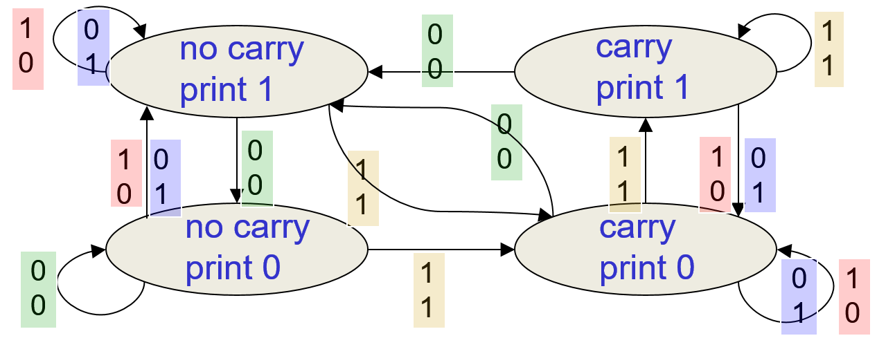
    </a>
  

+ A recurrent net for binary addition
  + Architecture: two input units and one output unit
  + given two input digits at each time step
  + desired output at each time step: the output for the column that was provided as input two time step ago
    + e.g., generate the bottom right $1$ as the output of (1, 1) inputs on the 3rd left column
    + taking one time step to update the hidden units based on the two input digits
    + taking another time step for the hidden units to cause the output

  

    <a href="http://www.cs.toronto.edu/~hinton/coursera/lecture7/lec7.pdf" ismap target="_blank">
      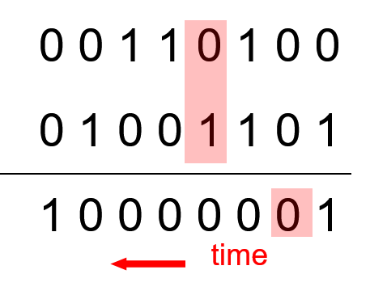
    </a>
  

+ The connectivity of the network
  + 3 hidden units fully interconnected in both directions (might be w/ different weights)
    + allowing a hidden activity pattern at one time step to vote for the hidden activity pattern at the next time step
  + input units having feed-forward connections (two-digit column) that allow them (the connection to the output unit) to vote (producing output) for the next hidden activity pattern

  

    <a href="http://www.cs.toronto.edu/~hinton/coursera/lecture7/lec7.pdf" ismap target="_blank">
      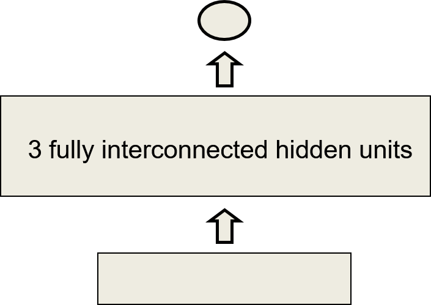
    </a>
  

+ What the network learns (the example)
  + learning 4 distinct patterns of activity for the 3 hidden units
    + the __patterns__ correspond to the nodes in the finite state automaton
    + not confusing units in a neural network w/ nodes in a finite state automaton
    + nodes in finite state automaton like activity vectors of the recurrent neural network
    + automaton restricted to be in exactly one __state__ at each time
    + hidden units restricted to have exactly one __vector__ of activity at each time
  + recurrent network emulating a finite state automaton
    + exponentially more powerful in representation
    + with $N$ hidden neurons, it has $2^N$ possible binary activity vectors
    + bottleneck in the representation: only $N^2$ weights; not able to make full use of all that representational power
    + a recurrent neural network able to do much better than a finite state automaton
    + this is important when the input stream has two separate things going on at once
    + finite state automaton requiring to square its number of states to deal w/ the fact that there's 2 things going on at once
    + RNN required to double its number of the hidden __units__; the doubling the number of units $\to$ square the number of binary vector states

### Lecture Video

<video src="https://youtu.be/bVGdxHgxG34?list=PLoRl3Ht4JOcdU872GhiYWf6jwrk_SNhz9" preload="none" loop="loop" controls="controls" style="margin-left: 2em;" muted="" poster="http://www.multipelife.com/wp-content/uploads/2016/08/video-converter-software.png" width=180>
  <track src="subtitle" kind="captions" srclang="en" label="English" default>
  Your browser does not support the HTML5 video element.
</video> 

## 7.4 Why it is difficult to train an RNN

### Lecture Notes

+ Linear backward pass
  + big difference between the forward and backward passes
  + forward pass: using squashing functions (like the logistic) to prevent the activity vector from exploding
  + backward pass:
    + completely __linear__
    + if double the error derivatives at the final layer, all error derivatives will be doubled
    + once the forward pass done, the slope of that tangent fixed
    + the forward pass determines the slope (red line) of the linear function (blue curve) used for backpropagating through each neuron
      + the slope of non-linearity fixed by the forward pass
      + different slopes for each step of backpropagation
      + linear backward pass suffers from a problem of linear system
      + the results tends to explode or shrink as iteration continues

  

    <a href="http://www.cs.toronto.edu/~hinton/coursera/lecture7/lec7.pdf" ismap target="_blank">
      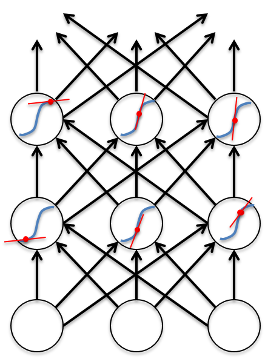
    </a>
  

+ The problem of exploding or vanishing gradients
  + magnitude of gradient backpropagted through may layers
    + small weight: shrinking exponentially
    + large weight: growing exponentially
  + typical feed-forward neural network can cope w/ these exponential effects because they only have a few hidden layers
  + RNN trained on long sequences (e.g. 100 steps)
    + gradient easily exploding or vanishing
    + growth/decaying rate about 100 times
    + solution: carefully initializing the weights
  + Hard to detect the current output
    + even w/ good initial weights, the current target output depends on an output from many time-steps ago
    + RNNs difficult to deal w/ long-range dependencies

+ Why the back-propagated gradient blows up
  + starting a trajectory within an attractor: small changes on initialization makes no difference to where the result end up
  + stating exactly on the boundary: tiny changes could mak ea hugh difference
  + Example of trajectory of gradients (see diagram)
    + two attractor states
    + vanishing gradient: end up the same point if starting within the blue/ping basin of attraction $\to$ no idea where it starts
    + exploding gradient:
      + starting point very close to the boundary btw blue and pink
      + a tiny difference at start point results in huge different where the dynamic system ends up

  

    <a href="http://www.cs.toronto.edu/~hinton/coursera/lecture7/lec7.pdf" ismap target="_blank">
      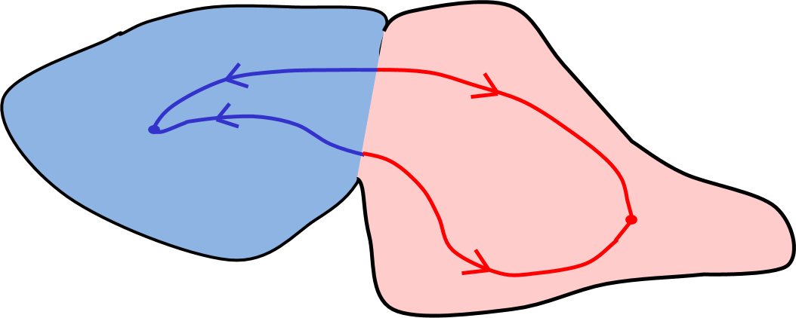
    </a>
  

+ Four effective ways to learn an RNN
  + __Long Short Term Memory__
    + making RNN out of little modules (architecture of neural network)
    + modules designed to remember values for a long time
  + __Hessian Free Optimization__
    + dealing with the vanishing gradient problem by using a fancy optimizer that can detect directions w/ a tiny gradient but even smaller curvature
    + e.g. FP Optimizer (Matens & Sutskever, 2011)
  + __Echo State Networks__
    + kind of evading the problem 
    + initialize the input$\to$hidden and hidden$\to$hidden and hidden$\to$output connections very carefully so that the hidden state has a huge reservoir of weakly coupled oscillators which can be selectively driven by the input
      + hit with an input sequence: reverberating for a long time and those reverberations and remembering what happened in the input sequence
      + then couple those reverberations to the output required
    + ESNs only need to learn the hidden$\to$output connections
      + linear output: easy to train
      + not used a fixed random recurrent bit but a carefully chosen one
      + just learned the hidden$\to$output connections 
  + __Good initialization w/ momentum__
    + initialize like in Echo State Networks
    + learn all of the connections using momentum

### Lecture Video

<video src="https://youtu.be/YZZye-AZCdQ?list=PLoRl3Ht4JOcdU872GhiYWf6jwrk_SNhz9" preload="none" loop="loop" controls="controls" style="margin-left: 2em;" muted="" poster="http://www.multipelife.com/wp-content/uploads/2016/08/video-converter-software.png" width=180>
  <track src="subtitle" kind="captions" srclang="en" label="English" default>
  Your browser does not support the HTML5 video element.
</video> 

## 7.5 Long term short term memory

### Lecture Notes

+ Long short term memory (LSTM)
  + Hochreiter & Schmidhuber (1997) proposed
  + solving the problem of getting an RNN to remember things for a long time (like hundreds of time steps)
  + designed a memory cell using logistic and linear units (gates) w/ multiplicative iterations
  + "write" gate on: information get into the cell
  + "keep" gate on: information stayed in the cell
  + "read" gate on: information read from the cell

+ Implementing a memory cell in a neural network
  + using a circuit to implement an analog memory cell
  + to preserve information for a long time in activities of an RNN (left diagram)
    + a linear unit to maintain its state (keep gate & 1.73):
      + a self-link w/ a weight of 1
      + the rest of the system determines the state of that logistic keep gate
      + input $\backsimeq 1 \to$ the information just cycles around $\to$ the value of 1.73 will stay
      + system would like to get rid of the value: set the keep gate to have value of 0 $\to$ information disappeared
    + "write" gate activated (write gate & input from rest of RMM):
      + information stored in the cell
      + rest of the system turns on the write gate
      + whatever the input provided to the memory cell from the rest of the system will get written into the memory cell (1.73 changed)
    + "read" gate activated (read gate & output to rest of RMM)
      + information retrieved
      + the rest of the system turn on the logistic read gate
      + value in the memory cell (1.73) comes out and affect the rest of the recurrent neural network
    + backpropagating through this circuit because logistics have nice derivatives
      + learn by using this kind of circuit over many time steps
  + Example of backpropagation through a memory cell block (right diagram)
    + forward pass (from left to right as time elapsed)
      + time step 0 (initial)
        + keep = 0 $\to$ wiped out whatever the information was and 
        + write = 1: value = 1.7 coming from the rest of the neural network and get written into the memory cell
        + read = 0: no output
      + time step 1:
        + keep = 1 (manually or by the rest of the system): value written back into memory cell it stored
        + write = read = 0: information not influenced by what's going on in the rest of the net and not influence what's going on in the rest of the net $\to$ insulated
      + time step 2:
        + keep = 1: information stored for one more time step
        + write = 0: no information written
        + read = 1: retrieve the information stored in memory cell and come out of the memory cell $\to$ influence the rest of the network
      + time step 3:
        + keep = 0: information removed
    + backward pass
      + the triangular symbol triggers the connection if the value next to it is 1
      + along the path from the 1.7 stored to retrieve
      + whatever error derivative we have when 1.7 retrieved get back propagated to where the value (1.7) 
      + rather retrieved a bigger value to make the right things happen now
      + send the information back and tell it to store a bigger value
      + as long as the relevant gates with values of 1, no attenuation in this back propagated signal
      + the attenuation of logistic gate is too small to ignore $\to$ information can travel back through hundreds of time steps

  

    <a href="http://www.cs.toronto.edu/~hinton/coursera/lecture7/lec7.pdf" ismap target="_blank">
      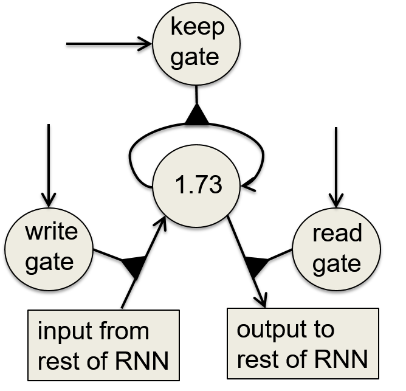
      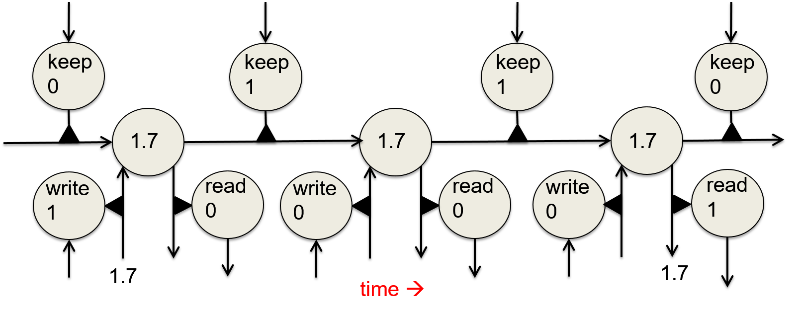
    </a>
  

+ Reading cursive handwriting
  + a natural task for an RNN
  + input: a sequence of $(x, y, p)$ coordinates of the tip of the pen, where $p$ indicates whether the pen is up or down
  + output: a sequence of characters
  + Graves & Schmidhuber (2000)
    + RNNs w/ LSTM are currently the best systems for reading cursive writing
    + used a sequence of small images as input rather than pen coordinates

+ A [demonstration](https://youtu.be/mLxsbWAYIpw) of online handwriting recognition by an RNN w/ Long Term Memory (from Alex Graves)
  + Row 1:
    + the characters are recognized
    + never revise its output so different decisions are more delayed
  + Row 2:
    + the states of a subset of the memory cells
    + notice how they get reset when it recognizes a character
  + Row 3:
    + the writing
    + the net sees the $x$ and $y$ coordinates
    + optical input actually works a bit better than pen coordinates
  + Row 4:
    + the gradient backpropagted all the way to the $x$ and $y$ inputs from the currently most active character
    + let you see which bits of the data are influencing the decision

### Lecture Video

<video src="https://youtu.be/93rzMHtYT_0?list=PLoRl3Ht4JOcdU872GhiYWf6jwrk_SNhz9" preload="none" loop="loop" controls="controls" style="margin-left: 2em;" muted="" poster="http://www.multipelife.com/wp-content/uploads/2016/08/video-converter-software.png" width=180>
  <track src="subtitle" kind="captions" srclang="en" label="English" default>
  Your browser does not support the HTML5 video element.
</video> 

