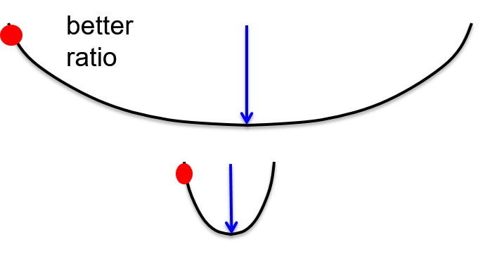
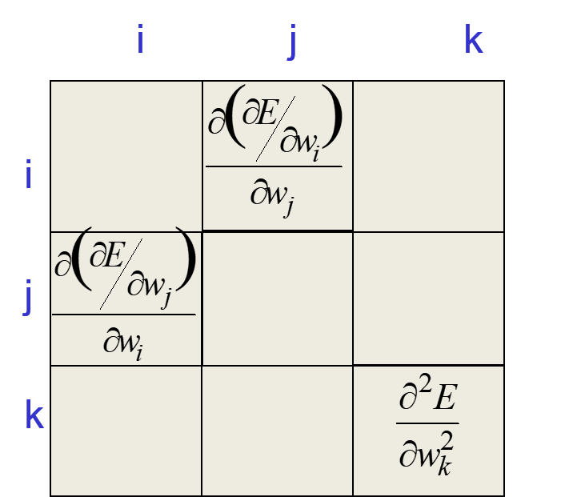
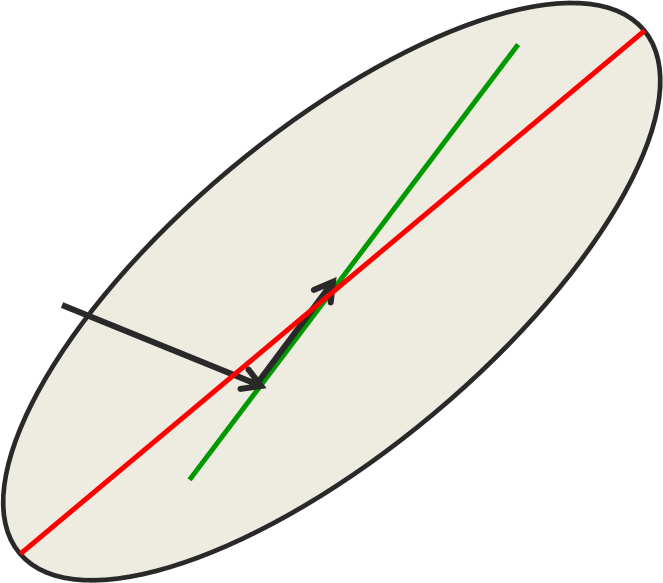
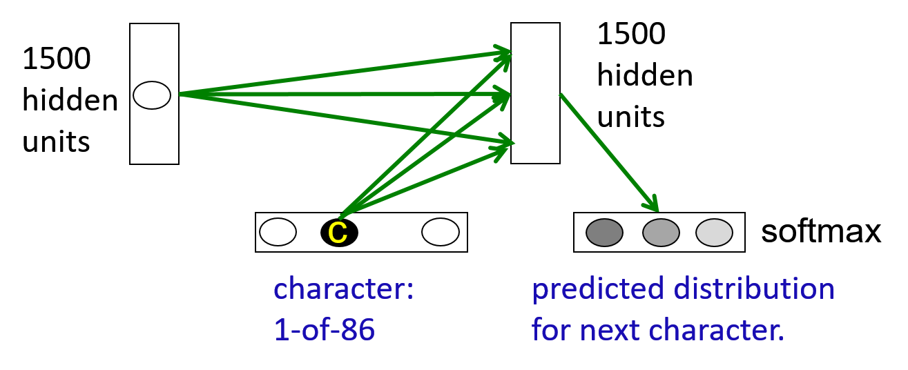
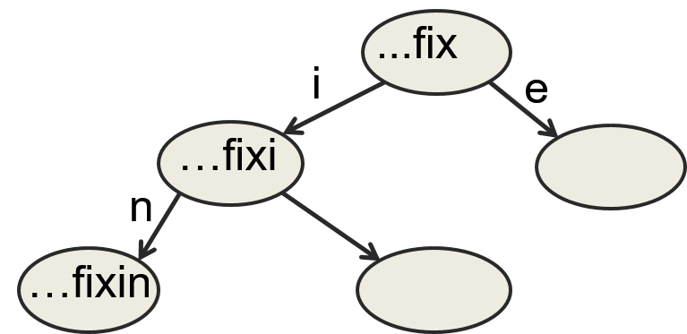
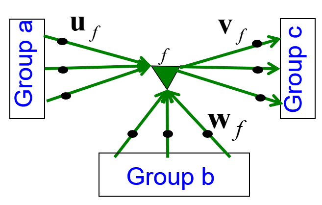
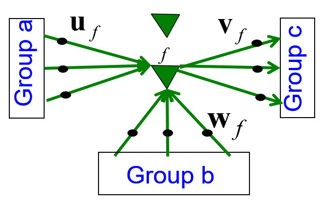
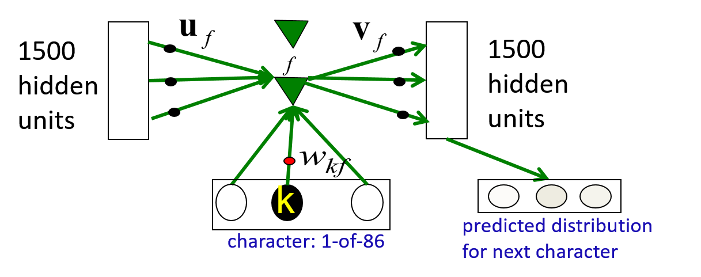

# 8. Recurrent Neural Networks II
  
## 8.1 A brief overview of Hessian-free optimization

### Lecture Notes

+ How much can we reduce the error by moving in a given direction?
  + If choosing a direction to move in and keep going in that direction, how much does the error decrease before it starts rising again?
    + assumption: the curvature is constant; i.e. a quadratic error surface
    + assumption: the magnitude of the gradient decreases as moving down the gradient, i.e. the error surface is convex upward
  + maximum error reduction
    + depending on the ratio of the gradient to the curvature
    + good direction to move in: the one w/ a high ratio of gradient to curvature, even if the gradient itself is small
  + Example of a direction to move in (see diagram)
    + vertical axis: error
    + horizontal axis: weights in the direction moving
    + blue arrow: the reduction we get if the start at the red point
    + upper diagram w/ a gentle gradient
      + a better gracious gradient to the curvature
      + a bigger reduction in the arrow by the time to get minimum
    + how can we find the directions w/ the upper diagram?
    + directions in which even though the gradient may be small, the curvature is even smaller
  + how to find such directions?

  

    
  

+ Newton's method
  + the basic problem
    + assumption: the steepest descent on a quadratic error surface
    + not the direction where the gradient would go in
    + error surface w/ circular cross-section: the gradient is a good direction which points to the minimum
    + applying a linear transformation to turn ellipses into circles; going downhill in a circular error surface
  + Newton's method multiplies the gradient vector by the inverse of the curvature matrix $H$

    \[ \Delta \mathbf{w} = -\varepsilon H(\mathbf{w})^{-1} \frac{d E}{d\mathbf{w}} \]

    + $H(\mathbf{w})$: the Hessian transformation, a function of weights
    + real quadratic surface: jump to the minimum in one step if $\varepsilon$ chosen correctly
    + infeasible to invert the matrix w/ many parameters, e.g., a million weights $\to$ trillion terms of the curvature matrix

+ Curvature Matrix
  + elements of curvature matrix
    + each weight $w_i$ or $w_j$ telling how the gradient in one direction changes as you change in another direction
    + ie, if $w_i$ changed, how does the gradient of the error w.r.t. $w_j$ change? $\to$ typical off diagonal terms
    + for diagonal entry, how the gradient of the error changes in direction of the weight as you change that weight
    + specifying how the gradient in one direction changes as moving into some other direction
    + off-diagonal terms correspond to twists in the error surface
    + twist: when you travel in one direction, the gradient in another direction changes
    + nice circular bulb: all those off diagonal terms are zero, ie, the gradient in other directions not changed
  + reason about wrong direction w/ steepest descent
    + the gradient for one weight messed up by the simultaneous changes to all the other weights
    + ie, updating other weights while changing one weight
    + curvature matrix determines the sizes of these interactions

  

    
  

+ How to avoid inverting a huge matrix
  + curvature matrix w/ too many terms in a big network
    + Le Cun: just using the terms along the leading diagonal of the curvature matrix
      + making the step size depends on the leading diagonal
      + get different step size w/ different weights
    + only a tiny fraction of the interactions (self-interactions)
      + ignoring most of the terms in the curvature matrix
  + approximated in many different ways
    + approximation w/ much lower rank matrix which captures the main aspects of the curvature matrix
    + including, Hessian-free method, LBFGS, and many other methods trying to do an approximate second-order method for minimizing the error
  + Hessian-free (HF) method
    + making an approximation to the curvature matrix
    + assuming the approximation correct
    + the curvature known and the error surface really quadratic
    + using conjugate gradient, an efficient technique to minimize the error $\to$ close to a minimum on this approximation to the curvature
    + making another approximation and reaching the minimum w/ conjugate gradient again
    + RNN
      + adding a penalty for changing any of the hidden activities too much
      + preventing from changing a weight early on that causes huge effects later on in the sequence
      + putting quadratic penalty on those changes then combining it w/ the rest of the Hessian method

+ Conjugate gradient
  + an alternative to going to the minimum in one step by multiplying by the inverse of the curvature matrix
    + start by taking the direction of steepest descent and go to the minimum in that direction
    + might involve re-evaluating the gradient or re-evaluating the error a few times to find the minimum in that direction
  + using a sequence of steps each of which finds the minimum along one direction
  + ensuring moving in the conjugate direction
    + conjugate direction: a direction conjugate to the previous directions
    + not messing up the minimization already done
    + conjugate: as you go in the new direction, you do not change the __gradients__ in the previous directions
    + opposite: twist
  + a picture of conjugate gradient (see diagram)
    + red line: major axis of the ellipse
    + black arrow: start off one step of steepest descent and all the way to the minimum in that direction
    + the minimum not always lying on the red line
    + gradient = 0 $\to$ black arrow perpendicular to the red line
    + the actual black arrow (the gradient) not perpendicular to the red line
    + making a little progress by making a small step at right angle to the red line and a small step along the red line
    + the gradient in the direction of the first step is zero at all points on the green line
      + the gradient in the direction of black arrow is zero w.r.t the green line
    + if moving along the green line, don't mess up the minimization already did in the first direction
    + searching on the green line to find how far we should go to minimize the error along the green line
    + repeating the procedure in high dimensional error surface $\to$ reaching the minimum eventually
    + all directions considered $\to$ global minimum

    

      
    

+ Goal of conjugate 
  + Objective: global minimum of an $N$-dim quadratic surface
  + in $N$ steps, conjugate gradient guaranteed to find the minimum of an $N$-dim quadratic surface
    + managing to get thr gradient = 0 in N directions
    + not orthogonal directions but independent of one another $\to$ global minimum
    + usually many cases w/ less than $N$ steps, it has typically got the error very close to the minimum value
    + not full $N$ step executed $\to$ expensive as inverting the whole matrix
  + non-linear conjugate gradient
    + able to apply directly to a non-quadratic error surface, such as the error surface for a multilayer non-linear neural network
    + usually working well
    + essentially a batch method and able to apply it to large mini batches
    + done by many steps of conjugate gradient on the same large mini batch and then move on to the next item in your batch
  + HF optimizer:
    + using conjugate gradient for minimization on a genuinely quadratic surface where it excels
    + genuinely quadratic surface: the quadratic approximation to the true surface made by Hessian-free matrix

### Lecture Video

<video src="https://youtu.be/K2X0eBd-0lc?list=PLoRl3Ht4JOcdU872GhiYWf6jwrk_SNhz9" preload="none" loop="loop" controls="controls" style="margin-left: 2em;" muted="" poster="http://www.multipelife.com/wp-content/uploads/2016/08/video-converter-software.png" width=180>
  <track src="subtitle" kind="captions" srclang="en" label="English" default>
  Your browser does not support the HTML5 video element.
</video> 

## 8.2 Modeling character strings with multiplicative connections

### Lecture Notes

+ modeling text: advantages of working with characters
  + web page composed of character strings
  + powerful learning method
    + by understanding the world by reading the web
    + to learn which strings make words
  + pre-processing text to get words is a big hassle
    + what about morphemes (prefixes, suffixes etc)
    + what about subtle effects line "sn" words?
    + what about New York?
    + what about Finnish (ymm&auml;rt&auml;m&auml;ttomyydell&auml;ns&auml;k&auml;&auml;n)

+ An obvious recurrent neural network
  + a lot easier to predict 86 characters than 100,000 words

  

    
  

+ Tree structure for character string
  + exponentially many nodes in the tree of all character strings of length $N$
  + RNN:
    + each node is a hidden state vector
    + next character must transform to a new node
  + node implemented as hidden states in an RNN
    + different node able to share structure
    + using distributed representation
  + next hidden representation
    + depending on the conjunction of the current character and the current hidden representation

  

    
  

+ Multiplicative connections
  + inputs of recurrent net
    + traditional: using the inputs to the recurrent net to provide additive extra input to the hidden states
    + using the current input character to choose the whole hidden-to-hidden weight matrix
    + requirement: 86x1500x1500 parameters
    + making the net overfit
  + multiplicative interaction w/ fewer parameters
    + different transition matrix for each of the 86 characters
    + these 86 character-specific weight matrices to share parameters
    + e.g., the character 9 and 8 should have similar matrices

+ Using factors to implement multiplicative interactions
  + get groups a nd b to interact multiplicatively by using "factors"
    1. each factor first computes a weighted sum for each of its input groups
    2. the send the product of the weighted sums to its output group

    \[ \mathbf{c}_f = \left( \mathbf{b}^T \mathbf{w}_f \right) \left( \mathbf{a}^T \mathbf{u}_f \right) \mathbf{v}_f \]

    + $\mathbf{c}_f$: vector of inputs to group $c$
    + $(\mathbf{b}^T \mathbf{w}_f)$: scalar input to $f$ from group $b$
    + $(\mathbf{a}^T \mathbf{u}_f)$: scalar input to $f$ from group $a$

  

    
  

+ Using factors to implement a set of basis matrices
  + each factor defines a rank 1 transition matrix from $a$ to $c$

  \[\begin{align*}
    \mathbf{c}_f &= \left( \mathbf{b}^T \mathbf{w}_f \right) \left( \mathbf{a}^T \mathbf{u}_f \right) \mathbf{v}_f \\
      &= \left( \mathbf{b}^T \mathbf{w}_f \right) \left( \mathbf{u}^T \mathbf{v}^T_f \right) \mathbf{a} \\
    \mathbf{c} &= \left( \sum_f \left( \mathbf{b}^T \mathbf{w}_f \right) \left( \mathbf{u}_f \mathbf{V}_f^T \right) \right) \mathbf{a}
  \end{align*}\]

  + $( \mathbf{b}^T \mathbf{w}_f )$: scalar coefficient
  + $( \mathbf{u}^T \mathbf{v}^T_f )$: outer product transition matrix with rank 1

  

    
  

+ Using a 3-way factors to allow a character to create a whole transition matrix
  + each factor, $f$, defines a rank one matrix, $\mathbf{U}_f \mathbf{V}_f^T$
  + each character, $k$, determines a gain $W_{kf}$ for each of these matrices

  

    
  

### Lecture Video

<video src="url" preload="none" loop="loop" controls="controls" style="margin-left: 2em;" muted="" poster="http://www.multipelife.com/wp-content/uploads/2016/08/video-converter-software.png" width=180>
  <track src="subtitle" kind="captions" srclang="en" label="English" default>
  Your browser does not support the HTML5 video element.
</video> 

## 8.3 Learning to predict the next character using HF

### Lecture Notes

### Lecture Video

<video src="url" preload="none" loop="loop" controls="controls" style="margin-left: 2em;" muted="" poster="http://www.multipelife.com/wp-content/uploads/2016/08/video-converter-software.png" width=180>
  <track src="subtitle" kind="captions" srclang="en" label="English" default>
  Your browser does not support the HTML5 video element.
</video> 

## 8.4 Echo state networks

### Lecture Notes

### Lecture Video

<video src="url" preload="none" loop="loop" controls="controls" style="margin-left: 2em;" muted="" poster="http://www.multipelife.com/wp-content/uploads/2016/08/video-converter-software.png" width=180>
  <track src="subtitle" kind="captions" srclang="en" label="English" default>
  Your browser does not support the HTML5 video element.
</video> 

