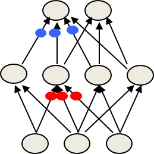

# 8. Recurrent Neural Networks II
  
## 8.1 A brief overview of Hessian-free optimization

### Lecture Notes

+ How much can we reduce the error by moving in a given direction?
  + If choosing a direction to move in and keep going in that direction, how much does the error decrease before it starts rising again?
    + assumption: the curvature is constant; i.e. a quadratic error surface
    + assumption: the magnitude of the gradient decreases as moving down the gradient, i.e. the error surface is convex upward
  + maximum error reduction
    + depending on the ratio of the gradient to the curvature
    + good direction to move in: the one w/ a high ratio of gradient to curvature, even if the gradient itself is small
  + Example of a direction to move in (see diagram)
    + vertical axis: error
    + horizontal axis: weights in the direction moving
    + blue arrow: the reduction we get if the start at the red point
    + upper diagram w/ a gentle gradient
      + a better gracious gradient to the curvature
      + a bigger reduction in the arrow by the time to get minimum
    + how can we find the directions w/ the upper diagram?
    + directions in which even though the gradient may be small, the curvature is even smaller
  + how to find such directions?

  

    
  

+ Newton's method
  + the basic problem
    + assumption: the steepest descent on a quadratic error surface
    + not the direction where the gradient would go in
    + error surface w/ circular cross-section: the gradient is a good direction which points to the minimum
    + applying a linear transformation to turn ellipses into circles; going downhill in a circular error surface
  + Newton's method multiplies the gradient vector by the inverse of the curvature matrix $H$

    \[ \Delta \mathbf{w} = -\varepsilon H(\mathbf{w})^{-1} \frac{d E}{d\mathbf{w}} \]

    + $H(\mathbf{w})$: the Hessian transformation, a function of weights
    + real quadratic surface: jump to the minimum in one step if $\varepsilon$ chosen correctly
    + infeasible to invert the matrix w/ many parameters, e.g., a million weights $\to$ trillion terms of the curvature matrix

+ Curvature Matrix
  + elements of curvature matrix
    + each weight $w_i$ or $w_j$ telling how the gradient in one direction changes as you change in another direction
    + ie, if $w_i$ changed, how does the gradient of the error w.r.t. $w_j$ change? $\to$ typical off diagonal terms
    + for diagonal entry, how the gradient of the error changes in direction of the weight as you change that weight
    + specifying how the gradient in one direction changes as moving into some other direction
    + off-diagonal terms correspond to twists in the error surface
    + twist: when you travel in one direction, the gradient in another direction changes
    + nice circular bulb: all those off diagonal terms are zero, ie, the gradient in other directions not changed
  + reason about wrong direction w/ steepest descent
    + the gradient for one weight messed up by the simultaneous changes to all the other weights
    + ie, updating other weights while changing one weight
    + curvature matrix determines the sizes of these interactions

  

    
  

+ How to avoid inverting a huge matrix
  + curvature matrix w/ too many terms in a big network
    + Le Cun: just using the terms along the leading diagonal of the curvature matrix
      + making the step size depends on the leading diagonal
      + get different step size w/ different weights
    + only a tiny fraction of the interactions (self-interactions)
      + ignoring most of the terms in the curvature matrix
  + approximated in many different ways
    + approximation w/ much lower rank matrix which captures the main aspects of the curvature matrix
    + including, Hessian-free method, LBFGS, and many other methods trying to do an approximate second-order method for minimizing the error
  + Hessian-free (HF) method
    + making an approximation to the curvature matrix
    + assuming the approximation correct
    + the curvature known and the error surface really quadratic
    + using conjugate gradient, an efficient technique to minimize the error $\to$ close to a minimum on this approximation to the curvature
    + making another approximation and reaching the minimum w/ conjugate gradient again
    + RNN
      + adding a penalty for changing any of the hidden activities too much
      + preventing from changing a weight early on that causes huge effects later on in the sequence
      + putting quadratic penalty on those changes then combining it w/ the rest of the Hessian method

+ Conjugate gradient
  + an alternative to going to the minimum in one step by multiplying by the inverse of the curvature matrix
    + start by taking the direction of steepest descent and go to the minimum in that direction
    + might involve re-evaluating the gradient or re-evaluating the error a few times to find the minimum in that direction
  + using a sequence of steps each of which finds the minimum along one direction
  + ensuring moving in the conjugate direction
    + conjugate direction: a direction conjugate to the previous directions
    + not messing up the minimization already done
    + conjugate: as you go in the new direction, you do not change the __gradients__ in the previous directions
    + opposite: twist
  + a picture of conjugate gradient (see diagram)
    + red line: major axis of the ellipse
    + black arrow: start off one step of steepest descent and all the way to the minimum in that direction
    + the minimum not always lying on the red line
    + gradient = 0 $\to$ black arrow perpendicular to the red line
    + the actual black arrow (the gradient) not perpendicular to the red line
    + making a little progress by making a small step at right angle to the red line and a small step along the red line
    + the gradient in the direction of the first step is zero at all points on the green line
      + the gradient in the direction of black arrow is zero w.r.t the green line
    + if moving along the green line, don't mess up the minimization already did in the first direction
    + searching on the green line to find how far we should go to minimize the error along the green line
    + repeating the procedure in high dimensional error surface $\to$ reaching the minimum eventually
    + all directions considered $\to$ global minimum

    

      
    

+ Goal of conjugate 
  + Objective: global minimum of an $N$-dim quadratic surface
  + in $N$ steps, conjugate gradient guaranteed to find the minimum of an $N$-dim quadratic surface
    + managing to get thr gradient = 0 in N directions
    + not orthogonal directions but independent of one another $\to$ global minimum
    + usually many cases w/ less than $N$ steps, it has typically got the error very close to the minimum value
    + not full $N$ step executed $\to$ expensive as inverting the whole matrix
  + non-linear conjugate gradient
    + able to apply directly to a non-quadratic error surface, such as the error surface for a multilayer non-linear neural network
    + usually working well
    + essentially a batch method and able to apply it to large mini batches
    + done by many steps of conjugate gradient on the same large mini batch and then move on to the next item in your batch
  + HF optimizer:
    + using conjugate gradient for minimization on a genuinely quadratic surface where it excels
    + genuinely quadratic surface: the quadratic approximation to the true surface made by Hessian-free matrix

### Lecture Video

<video src="https://youtu.be/K2X0eBd-0lc?list=PLoRl3Ht4JOcdU872GhiYWf6jwrk_SNhz9" preload="none" loop="loop" controls="controls" style="margin-left: 2em;" muted="" poster="http://www.multipelife.com/wp-content/uploads/2016/08/video-converter-software.png" width=180>
  <track src="subtitle" kind="captions" srclang="en" label="English" default>
  Your browser does not support the HTML5 video element.
</video> 

 
## 8.2 Modeling character strings with multiplicative connections

### Lecture Notes

+ Modeling text: advantages of working with characters
  + web page composed of character strings
  + powerful learning method
    + by understanding the world by reading the web
     + to learn which strings make words
  + big hassle: pre-processing text to get words
    + what about morphemes (prefixes, suffixes etc)
      + morpheme: the smallest meaningful unit in a language
    + what about subtle effects line "sn" words?
      + "sn": very high chance of meaning somthing about the lips or nose, particularly he upper lip or nose
      + e.g., snarl, sneexe, snot, snog, snort
      + how about snow?  a good word for cocaine
    + what about New York?
      + treated as on elxical item
      + "new york Minster roof": treat new and york to separate lexical items
    + what about Finnish?
      + put lots of morphemes to make a great big words
      + (ymm&auml;rt&auml;m&auml;ttomyydell&auml;ns&auml;k&auml;&auml;n): combine fiev words

+ An obvious recurrent neural network
  + purpose: modeling character strings
  + architecture and process:
    + 1500 hidden states
    + inputs: characters and hiddent state dynamics
    + hidden state dynamics: the hidden state at time $t$ providing input to determine the hidden state at time $t+1$
    + predict the next character when retaining the new hidden state (new character + previous hidden state dynamics)
    + single softmax over the 86 characters
    + try to find high probability to the correct next character and low probability to the ortehrs
    + train the whole system by back propagating from that softmax the log probability of getting the correct character
      + back propagat the log probability through the two output connections back through the hidden two character connections
      + then through the hideent-to-hidden connections
      + all the way back till the beginning of the string
  + a lot easier to predict 86 characters than 100,000 words
  + easy to use the softmax at output
  + no problem w/ a great big sofmax

  

    
  

+ Tree structure for character string
  + reeason for not using RNN but instead a different kind of network
  + modeling string w/ tree
    + ranging all possible character strings int a tree w/ a branching ratio of 86 here
    + a tiny little subtree of that great big tree: occuring many times bu w/ different things represented by that dots (...) before the fix
    + representing many characters followed by `...fix`
      + left branch: trailed by 'i'
      + right branch: trailed by 'e'
    + every new character moving one step down in the the tree to a new node
  + exponentially many nodes in the tree of all character strings of length $N$
    + might be too many nodes to store them all
    + proabaility on each connection: the probability of producing that letter given the context of the node
  + RNN:
    + enormous tree
    + a hidden state vector to represent each node
    + next character must transform to a new node
      + the node w/ the hidden state vector represnting a whole string of characters followed by 'fix'
      + operating on the hidden state vector to produce the appropriate new hidden state vector
  + node implemented as hidden states in an RNN
    + different node able to share structure
      + most likely a verb as 'fix' shown
      + the character 'i' is more likely beacuse of the ending 'ing'
      + the knowledge of verb w/ 'fix' sharing w/ lots of nodes
    + operting on the part of the state represnting a verb able to share with all the verbs
    + using distributed representation
  + next hidden representation
    + conjunction of the current state at and the character to determine which branch to take
      + fllowed 'fix' not saying that 'i' tends to expect an 'n' next
      + but supposed that the string is a verb, an 'i' should expect an 'n' next
      + conjunction the fact that a verb gets into this state labeled 'fixi' expecting to see an 'n'
    + depending on the conjunction of the current character and the current hidden representation

  

    
  

+ Multiplicative connections
  + inputs of recurrent net
    + traditional: using the character inputs to the recurrent net to provide extra additive input to the hidden states
    + capturing inputs by using multiplicative connections
      + use those characters to swap in a whole hidden-to-hidden weight matrix
      + the character determined the transistion matrix
      + using the current input character to choose the whole hidden-to-hidden weight matrix
    + naive method: 86x1500x1500 parameters $\to$ too many parameters $\to$ making the net overfit
  + multiplicative interaction w/ fewer parameters
    + different transition matrix for each of the 86 characters
    + characters w/ common characteristics
    + making these 86 character-specific weight matrices to share parameters
    + e.g., all digits are similar to each other in the way they amkd the hidden state evolve
    + e.g., the character 9 and 8 should have similar matrices

+ Using factors to implement multiplicative interactions
  + factor
    + the triangle w/ $f$ (see diagram)
    + group $a$ and group $b$ interact multiplicatively to provide input to group $c$
  + get groups $a$ and $b$ to interact multiplicatively by using "factors"
    1. each factor first computes a weighted sum for each of its input groups
      + taking the vector state of group $a$
      + multiplying the vector by the weight on the connection comming into the factor
      + i.e., taking the scalar product of the vector $a$ and the weight vector $\mathbf{u}$
      + obtaining a number at the left-hand vertex of that triangle
      + similarly, taking vector state of group $b$ and mutiplying by the weight vector $\mathbf{w}$ to get the bottomvertex of that triangle
    2. the send the product of the weighted sums to its output group
      + multiply those two number obtained in step 1
      + obtain a scalar number
      + use the scalar to scal ethe outgoing weight $\mathbf{v}$ to provide input of group $c$
      + the input of group $c$: product of the two numbers from the two vertices of the triangle times the outgoing weight vector $\mathbf{v}$
    + mathematical representation

    \[ \mathbf{c}_f = \left( \mathbf{b}^T \mathbf{w}_f \right) \left( \mathbf{a}^T \mathbf{u}_f \right) \mathbf{v}_f \]

    + $\mathbf{c}_f$: vector of inputs to group $c$
    + $(\mathbf{b}^T \mathbf{w}_f)$: scalar input to $f$ from group $b$
    + $(\mathbf{a}^T \mathbf{u}_f)$: scalar input to $f$ from group $a$

  

    
  

+ Using factors to implement a set of basis matrices
  + each factor defines a rank 1 transition matrix (the product of two vectors) from $a$ to $c$
  + treat a factor as computing two scallar products multiplying them
  + using the product as a weight on the outgoing vector $\mathbf{v}$
  + mathematical representation

    \[\begin{align*}
      \mathbf{c}_f &= \left( \mathbf{b}^T \mathbf{w}_f \right) \left( \mathbf{a}^T \mathbf{u}_f \right) \mathbf{v}_f \\
        &= \left( \mathbf{b}^T \mathbf{w}_f \right) \left( \mathbf{u}^T \mathbf{v}^T_f \right) \mathbf{a} \\
      \mathbf{c} &= \left( \sum_f \left( \mathbf{b}^T \mathbf{w}_f \right) \left( \mathbf{u}_f \mathbf{V}_f^T \right) \right) \mathbf{a} \tag{1}
    \end{align*}\]

    + $( \mathbf{b}^T \mathbf{w}_f )$: scalar coefficient
    + $( \mathbf{u}^T \mathbf{v}^T_f )$: outer product transition matrix with rank 1
    + $\mathbf{c}$: the sum of all factors

  + the sum of left-hand side of Eq. (1): a great big transistion matrix
  + multiply the transition matrix by the current hiddent state to produce a new hidden state
  + synthesized the transition matrix out of these rank 1 matrices provided by each factor
  + the current character in group $b$: determined the weight on each of the rank 1 matrices

  

    
  

+ Using a 3-way factors to allow a character to create a whole transition matrix
  + each factor, $f$, defines a rank one matrix, $\mathbf{U}_f \mathbf{V}_f^T$
  + each character, $k$, determines a gain $W_{kf}$ for each of these matrices
  + a number of factors (~1500)
  + the character input is different in only one of those active $\to$ only one relvant weight at a time
  + $\mathbf{w}_kf$: the weight from the current character $k$

  

    
  

### Lecture Video

<video src="https://youtu.be/qhFF6-K-5kM?list=PLoRl3Ht4JOcdU872GhiYWf6jwrk_SNhz9" preload="none" loop="loop" controls="controls" style="margin-left: 2em;" muted="" poster="http://www.multipelife.com/wp-content/uploads/2016/08/video-converter-software.png" width=180>
  <track src="subtitle" kind="captions" srclang="en" label="English" default>
  Your browser does not support the HTML5 video element.
</video> 

## 8.3 Learning to predict the next character using HF

### Lecture Notes

+ Training the character model
  + Ilya Sutskever proposal: [Generating Text with Recurrent Neural Networks](https://www.cs.utoronto.ca/~ilya/pubs/2011/LANG-RNN.pdf)
  + Ilya Sutskever [thesis](https://www.cs.utoronto.ca/~ilya/pubs/ilya_sutskever_phd_thesis.pdf)
  + Model
    + used 5 million strings of 100 characters taken from English Wikipedia
    + very doog at completing sentences in interesting ways
    + objective: predict after 11th character of each string
  + Procedure
    + using RNN and starting off in a default state
    + read 11 characters changing hidden state each time
    + then ready to start predicting
    + trained by back propagating the error made in prediction
  + using HF optimizer: a moth on a GPU board to get a really good model
  + Ilya's current best RNN: might be the best signgle model for character prediction
    + combinations of many models do better
  + working in a very different way from the best other models
    + able to balance quotes and brackets over long distances
    + any model relying on matching previous contexts unable to do that
    + e.g., a sentence w/ a open bracket would like to close it 35 character later
      + a model relying on matching the previous contexts would have to match all 35 intervening characters
      + very unlikely to stor the whole string

+ How to generate character strings from the model
  + model learned $\to$ knowing what the model knows by generating strings from the model
  + Procedure
    + starting the model w/ its default hidden state
    + give it a "burn-in" sequence of characters and let it update its hidden state after each character
    + then let it predict by looking at the probability distribution it predicts for the next character
    + pick a character randomly from the distribution
      + if it predicts that the probability of a 'Q' is $1/1000$, pick 'Q' one time in a thousand
      + telling the net that this was the character that actually occurred
      + i.e., tell it that its guess was correct, whatever it guessed
    + continue to let it pick character until bored
    + look at the character string it produces to see what it "knows"
  + Example
    + string produced by the model after some burn-in
    + selected from a much longer passage of the text
    + a continuous passage to demo the work performing well

    > He was elected President during the Revolutionary War and forgave Opus Paul at Rome. The regime of his crew of England, is now Arab women's icons in  and the demons that use something between the characters‘ sisters in lower coil trains were always operated on the line of the ephemerable street, respectively, the graphic or other facility for deformation of a given proportion of large segments at RTUS). The B every chord was a "strongly cold internal palette pour even the white blade.”

    + weird semantic association: 'Opus Paul at Rome' - no one would ever say that but we understand these words ae highly connected
    + not really having any long-range thematic (having or relating subjects) structue $\to$ change topic after each full stop
    + producing very few norm words
      + even though it's predicting probabilities of characters
      + as soon as got enough characters, the only one way to complete it as an English word
      + predicting the next character almost perfectly
      + if not the case, it will produce norm words
      + even producing a norm word (the word in red) $\to$ not absolutely certain it is an English word
    + not always balanced:
      + pruducing closing bracket often w/o opening bracket
      + priducing closeing quote (") w/o opening quote
    + many good local syntax: little strings w/ 3~4 words perfectly reasonable
    + many good semantic knowledge

  + some completions produced by the model
    + given a non-word, `thrunge`, and the model expects it to be a verb due to its form
    + English: Shelia thrunges &nbsp;&nbsp;&nbsp;&nbsp;(most frequent)
    + French: People thruge &nbsp;&nbsp;&nbsp;&nbsp;&nbsp;&nbsp;&nbsp;&nbsp;(most frequent next character is space)
    + Emulate as a name w/ capital: Shiela, Thrungelini del Rey &nbsp;&nbsp;&nbsp;&nbsp;&nbsp;&nbsp;&nbsp;&nbsp;(first tru)
    + The meaning of the life is literary regognition. &nbsp;&nbsp;&nbsp;&nbsp;&nbsp;&nbsp;&nbsp;&nbsp;(6th try); syntactically and semantically sensible
    + The meaning of life is the tradition of the ancient human reproductio: it is less favorable tot he good boy for when to remove her biggeer. &nbsp;&nbsp;&nbsp;&nbsp;&nbsp;&nbsp;&nbsp;&nbsp;(one fo the first 10 tries for a model trained for longer.)

+ What does the mode know?
  + a huge number of words in English and a lot about proper names, dates, and numbers
    + non-word extremely rare but did happen
  + good at balancing quotes and brackets
    + count brackets: none, one, many
    + unlikely producing closing bracket if no openning bracket
    + very likely to produce closing bracket within 20 characters if openning bracket appears
    + with two openning brackets, the model produces a closing bracket very quickly
    + with 3 openning brackets, not making it any faster
  + a lot about syntax but very hard to pin down exactly what form this knowledge has
    + unlike trigram moded which have just learned little sequences of words or rather having a table contains little sequence of the words
    + actually synthesizing strings of the words w/ sensible syntax
    + hard to say what form that syntactic knowledge has
    + not having a bunch of rules like a linguist has
    + like what's in the linguists head when when he speaks his native language
  + a lot of weak semantic associations
    + only ever produced the word 'Wittgenstein' once but produced soon after producing the workd Plato
    + knowing Plato associated w/ Wittgenstein
    + knowing cabbage associated w/ vegetable
    + not knowing much about the precise ways in which these things are associated
    + people are like that too if getting response very fast
    + eg, response very fast about "what does cow drink?", most likely say "milk" but it's not logical to say so.  The answeer associates with "drink" and "cow"

+ RNNs for predicting the next word
  + Tomas Mikolov et. al. proposal
    + [Recurrent neural network based language model](https://www.fit.vutbr.cz/research/groups/speech/publi/2010/mikolov_interspeech2010_IS100722.pdf), 2010
    + [Distributed Representations of Words and Phrases and their Compositionality](https://papers.nips.cc/paper/5021-distributed-representations-of-words-and-phrases-and-their-compositionality.pdf), 2013
    + [On the difficulty of training Recurrent Neural Networks](https://arxiv.org/pdf/1211.5063.pdf), 2013
    + [Learning Longer Memory in Recurrent Neural Networks](https://arxiv.org/pdf/1412.7753), 2015
  + train large RNNS on quite large training sets to predict the next work by using BPTT
    + using the technique same as the feed-forward neural networks
    + Procedure
      + convert a word to a real-valued feature vector
      + ussing these features as input to the rest of the network
    + better than feed-forward neural nets
    + better than the best other modes
    + even betetr when averaged w/ other models
  + the best language models currently used
  + interesting RNN propery:
    + require much less training data to reach the same level of performance as other models
    + improve faster than other methods as the dataset getting bigger
    + e.g., trigram model 
      + better w/ bigger datasets but it's a very slow process
      + double of the dataset to get a small improvement
    + similar to the role of large deep neural networks for object recognition

### Lecture Video

<video src="https://youtu.be/bNcb4MhSZ0s?list=PLoRl3Ht4JOcdU872GhiYWf6jwrk_SNhz9" preload="none" loop="loop" controls="controls" style="margin-left: 2em;" muted="" poster="http://www.multipelife.com/wp-content/uploads/2016/08/video-converter-software.png" width=180>
  <track src="subtitle" kind="captions" srclang="en" label="English" default>
  Your browser does not support the HTML5 video element.
</video> 

## 8.4 Echo state networks

### Lecture Notes

+ Key idea for RNNs
  + not to train the hidden$\to$hidden connections
  + just fix hidden$\to$hidden connections randomly and hope able to learn sequences by just training the way they affect the outputs
  + a simple network w/ perceptrons (feed-forward network)
    + make the early layers of feature detectors random and fixed
    + put in sensible sized random weights
    + objective: to learn the last layer w/ linear model
    + learning a linear model from the activities of the hidden units in the last layer to the outputs $\to$ faster
    + using the transformed input to predict the target outputs
    + a big random expansion of the input vector often makes it easy for a linear model to fit the data
    + if not able to fit the data well just looking at the war input
    + example (see diagram)
      + red weights: fixed at random to expand the input vector
      + using that expanded representation to fit a linear model
      + a strong similarities w/ SVM which is just a real efficient way of doing this
  + equivalent idea for RNN
    + fix the input$\to$hidden connections
    + randomly assigned values for the hidden$\to$hidden connections
    + only learning the hidden$\to$output connections
    + simple learning w/ linear output unit assumption $\to$ fast
    + set the random connections very careful $to$ RNN not exploding or vanishing

  

    
  

+ Setting the random connections
  + set the hidden$\to$hidden weights
    + the length of the activity vector stays about the same after each iteration
    + linear system & matrices: settings to make the spectral radius equals to one
    + the proper magnitude of weights allowing the input to echo around the network for a long time
  + using sparse connectivity
    + i.e., setting most of the weights to zero
    + create a lots of loosely coupled oscillators
    + information able to hang around in one part of the net w/o being propagated to other parts of the net too quickly
  + carefully choosing the scale of the input$\to$hidden connections
    + drive the loosely coupled oscillators
    + must not wipe out the information those oscillators contained about the recent history
  + fast learning in ESNs
    + able to try many different scales for weights and sparasenesses
    + a learning loop to learn the scales of those connections w/ the feedback from experiments
    + learn the level of spareseness required in the hidden$\to$hidden connections
    + often necessary to do experiments to get the system to work well

+ Simple example from the web of an ESN
  + input sequence: a real-valued time-varying the specifies the frequency of a sine wave
  + target output sequence: a sine wave w/ the current specified frequency
  + learning method: fit a similar model that takes the states of the hidden units as input and predict the correct scalar output value
  + The basic schema of an ESN (left figure)
    + illustrated with a tuneable frequency generator task
    + input signal: the desired frequency of the sine wave
    + dynamic reservoir:
      + input signals drive those loosely coupled oscillators
      + causing complicated dynamics continuously for a long time
      + output weights are learning to map that complicated dynamics to the particular dynamics required
    + black boxes w/ blue signals from dynamics reservoir: the actual dynamics of individual units inside the dynamic reservoir
    + connections from output back to reservoir: not always needed but tll the reservoir what output produced so far
    + output signal: a sine wave either learned or learning w/ frequency specified by the input
    + solid arrows: fixed, random connections
    + dotted arrows: trainable connections.
  + A test run of the frequency generator demo network (right figure)
    + the plotted step function is the input signal which was fed to the trained ESN
    + output:
      + begining: a sine wave in phase
      + end: producing a sine wave of the right frequency but w/ wrong phase (to indicate the reprocing the frequency)
    + black sinewaves: the correct output (unknown to the network)
    + gray sinewaves: the network output
    + Notice that phase differences are inevitable.

  

    
  

+ Beyond echo state networks
  + Good aspects
    + trained very fast: only fit a linear model
    + sensible to initializing weights
    + modeling of 1-dimensional time-space:
      + able to observe the time series for a while and then predict it very well a long time into the future
      + unable to compete seriously for high-dimensional data; e.g., frames of acoustic coefficients or frames of video (pre-processed)
  + Bad aspects
    + require more hidden units for a given task than an RNN that learns the hidden$\to$hidden weights
    + Ilya Sutskever (2012):
      + applying all the tricks developed by the ESNs to initialize RNNs
      + if the weights are initialized using the ESN methods, RNNs cna be trained very effectively
      + learn well by learniong the hidden$\to$output connections
      + using rmsprop w/ momentum

+ References
  + I. Sutskever, et. al., [On the importance of initialization and momentum in deep learning](http://proceedings.mlr.press/v28/sutskever13.pdf)

### Lecture Video

<video src="https://youtu.be/vlRwUV_sGcs?list=PLoRl3Ht4JOcdU872GhiYWf6jwrk_SNhz9" preload="none" loop="loop" controls="controls" style="margin-left: 2em;" muted="" poster="http://www.multipelife.com/wp-content/uploads/2016/08/video-converter-software.png" width=180>
  <track src="subtitle" kind="captions" srclang="en" label="English" default>
  Your browser does not support the HTML5 video element.
</video> 

