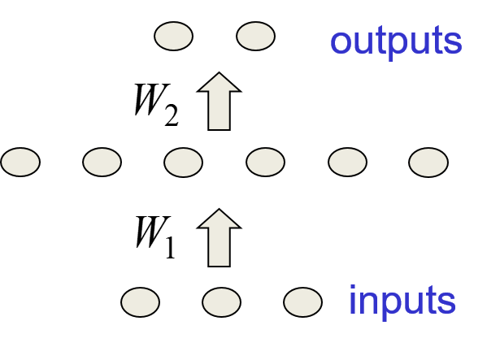
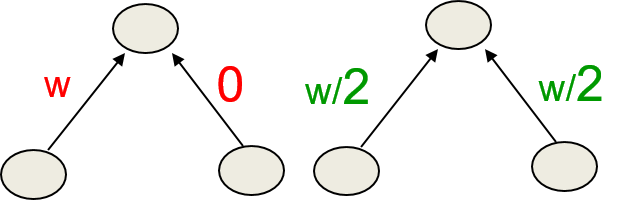
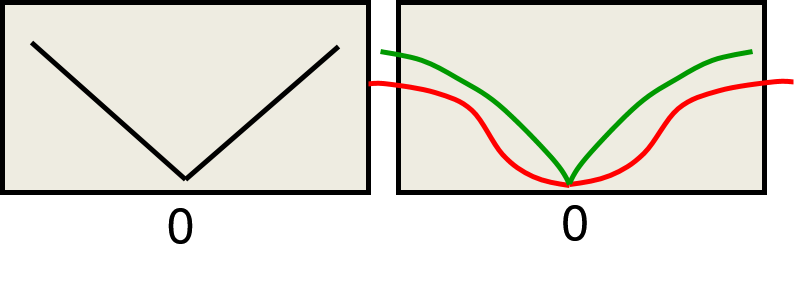
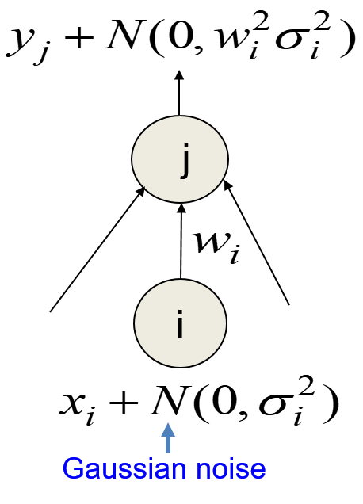
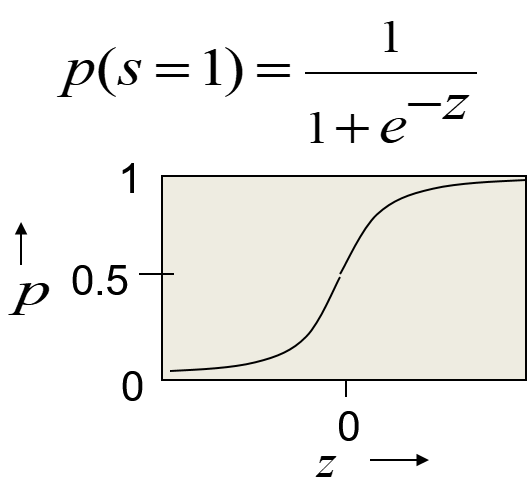
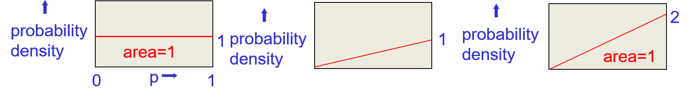
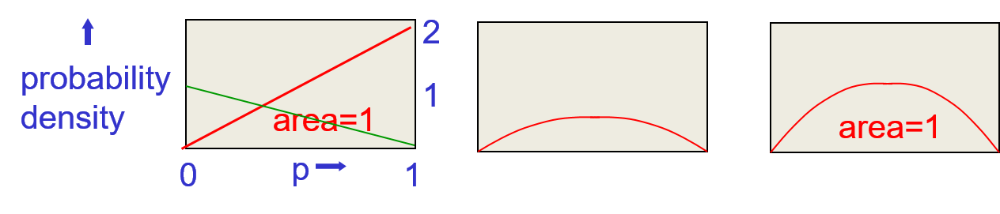
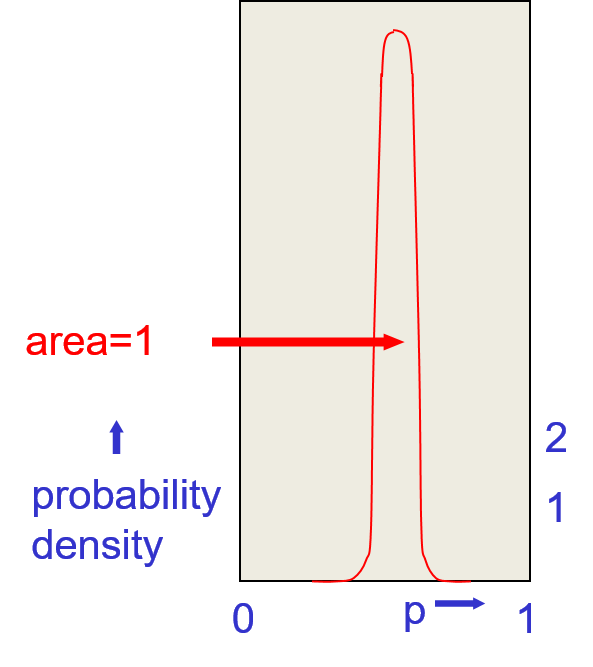
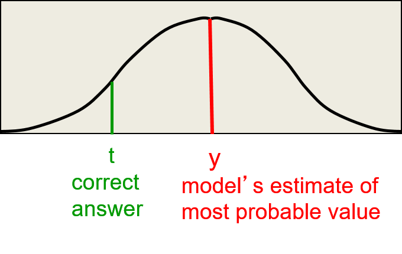
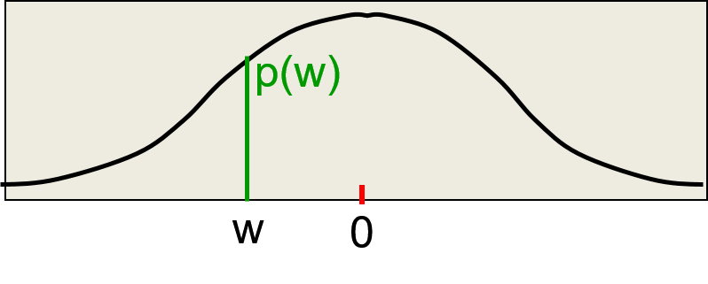

# Overfitting
  
## 9.1 Overview of ways to improve generalization

### Lecture Notes

+ Reminder: Overfitting
  + true and accidental regularities: training data in the mapping from input to output
    + containing information about the regularities
    + containing sampling error
    + accidental regularities existed because of the particular training cases that were chosen
  + unable to identify the regularities real or caused by sampling error
    + fit both kinds of regularity
    + flexible model able to model the sampleing error really well
  + variance:
    + fit the model w/ another training set drawn from the same distribution over cases
    + making different predictions on the test data

+ Preventing overfitting
  + Approach 1: get more data!
    + almost always the best bet if the data is cheap
    + require more computing power to train on more data
  + Approach 2: using a model w/ the right capacity
    + enough to fit the true regularities
    + not enough to fit spurious regularities (if they are weaker)
  + Approach 3: average many different models
    + use models w/ different forms
    + bagging: train the model on different subsets of the training data
  + Approach 4: Bayesian
    + use a single neural network architecture
    + average the predictions made by many different weight vectors

+ Ways to limit the cpacity of a neural network
  + controlling capacity w/
    + architecture: limit the number of hidden layers and the number of units per layer
    + early stopping: start w/ small weights and stop the learning before it overfits
    + weight-decay:
      + given model a number of hidden layers or units per layer which is a little too large
      + penalize large weights using penalties or constrains on their squared values (L2 penalty) or absolute values (L1 penalty)
    + noise: add to the weights of the activities
  + typically, using a combinaition of several of these methods

+ Meta parameters to control capacity
  + meta parameters: the number of hidden units, the number of layers, or the size of the weight penalty
  + trying lots of alternatives and choosing the one w/ the best performance on the test set
    + wrong method
    + easy to do but giving false impression of how well the methods work
    + settings w/ best performance on a test set unlikely to work on new data set drawn from the same distribution
    + model tuned for a particular test set
  + extreme example
    + assume that the test set has random answers that does not depend on the input
    + the best architecture performs better than chance on the test set
    + unable to be expected to do better than chance on a new test set

+ Cross-validation
  + a better way to choose meta parameters
  + divide the total dataset into 3 subsets
    + training data: used for learning the parameters of the model
    + validation data: not for learning but for deciding what settings of the meta parameters work best
    + test data: 
      + used to get a final, unbiased estimate of how well the network works
      + expect the estimate to be worse than on the validation data
  + competitions:
    + organizations held back the true test data and asked participationers to send in predictions
    + then validate the predictions can really predict on true test data or they're just overfitting to validation data by selecting meta parameters particularly well on the validation data but won't generalize to new test sets
  + N-fold cross-validation
    + divide the total dataset into one final test set and $N$ other subsets
    + train on all but one of those subsets to get $N$ different estimates of the validation error rate
    + the $N$ estimates not independent

+ Early stopping
  + goal: preventing overfitting
  + expensive to keep re-training the model
    + assumption: lots of data and a big model
    + training w/ different sized penalities on the weights of different architectures
  + Solution:
    + start w/ very small weights
    + grow the weights until the performance on the validation set starts getting worse
  + issues:
    + hard to decide when the performance getting worse
      + performance on the validation set might fluctuate
      + particularly, measure on error rate rather than a squared error or cross-emtropy error
    + limited capacity of the model
      + smaller weights give the network less capacity
      + weights not had time to grow big
  + Why small weights lower the cpacity?

+ Why early stopping works
  + very small weights
    + every hidden unit in its linear range
    + even w/ a large layer of hidden units
    + no more capacity than a linear net (inputs directly connected to outputs)
  + as weights grow
    + hidden units start using the non-linear ranges
    + capacity grows
  + example: (see diaggram)
    + hidden units w/ logistic units
    + small weights $\implies$ total inputs close to zero
    + the inputs for hidden units in the middle of their linear range $\implies$ very likely linear unit
    + multiply the inputs with weight matrice $w_1$ and $w_2$ to connect to the outputs
    + hidden units behave much like linear net
    + therefore, no more capacity than the linear net
    + $(3 \times 6) + (6 \times 2)$ wights $\implies$ no more capacity than a network w/ $(3 \times 2)$ weights
    + weight grow $\implies$ using the nonlinear region of the sigmoid
    + start making use of all those parameters $\implies$ from 6 to 30 weights increasing smoothly
    + early stopping: stop the learning w/ the right number of parameters $\implies$ optimize the trade-off between fitting the true regularities in the data and fitting the spurious regularities

  

    
  

### Lecture Video

<video src="https://youtu.be/W0SP8FTmGW0?list=PLoRl3Ht4JOcdU872GhiYWf6jwrk_SNhz9" preload="none" loop="loop" controls="controls" style="margin-left: 2em;" muted="" poster="http://www.multipelife.com/wp-content/uploads/2016/08/video-converter-software.png" width=180>
  <track src="subtitle" kind="captions" srclang="en" label="English" default>
  Your browser does not support the HTML5 video element.
</video> 

## 9.2 Limiting size of the weights

### Lecture Notes

+ Weight decay
  + the standard L2 weight penalty
    + a.k.a weight decay in NN literature
    + the derivative of the penalty acts as a force pulling weight towards to zero
    + adding an extra term to the cost function that penalizes the squared weights
    + keep the weights small unless they have big error derivaties
    + cost function: parabolic curve as weight increasing
  + cost function: optimize by reducing the normal error

    \[\begin{align*} 
      C &= E + \frac{\lambda}{2} \sum_i w_i^2 \\
      \frac{\partial C}{\partial w_i} &= \frac{\partial E}{\partial w_i} + \lambda w_i
    \end{align*}\]

    + weight cost: $\frac{\lambda}{2}$ to determin how strong the weight penalty is
    + $\frac{\partial C}{\partial w_i} = 0 \implies w_i = - \frac{1}{\lambda} \frac{\partial E}{\partial w_i}$
    + big weights $\impliedby$ minimum of the cost function $\iff$ maximum error derivatives

+ The effect of L2 weight cost
  + prevent the network from using weights not needed
    + improve generalization significantly $\impliedby$ stop the network from fitting the sampling error
    + a smoother model: the output changes more slowly as the inputs changes
  + prefer to equally divide the weight on each branch (see diagrams)
    + a network w/ two very similar inputs
    + put half the weight on each tather than all the weight on one

  

    
  

+ Other kinds of weight penalty
  + L1 penalty: the cost function as the left diagram
  + penalize the absolute values of the weights
    + make many weights exactly equal to zero which helps interpretation a lot
  + weight penalty w/ negligible effect on large weights
    + the gradient of the cost function actually get smaller when the weight gets really big
    + allowing a few large weights w/o pulled towards to zero

  

    
  

+ Weight penalities vs weight constraints
  + penalities: usually penalize the squared value of each weight separately
  + constraint on the maximum squared length of the incoming weight vector of each hidden or output unit
    + an update violates constraint $\implies$ scale down the vector of incoming weights to the allowed length
  + advantages of weight constraints over weight penalities
    + easier to set a sensible value for the squared length of the incoming weight vector than to select a weight penalty
    + preventing hidden units getting stuck near zero w/ their weights being tiny and not doing anything useful
    + prevent weights exploding
  + the effectiveness of weight penalty determined by the big gradients
    + when a unit hits its constraint
    + more effective than a fixed penalty at pushing irrelevant weights towards zero
    + some of the incoming weights have very big gradients $\implies$ trying to push the length of the incoming weight vector up $\implies$ push down all the other weights
    + look like that penalty scales itself as to be appropriate for the big weights and to suppress the small weights
    + the penalty just the Lagrange multipliers required to keep the constraints satisfied

### Lecture Video

<video src="https://youtu.be/oUZrj0Jz4Bc?list=PLoRl3Ht4JOcdU872GhiYWf6jwrk_SNhz9" preload="none" loop="loop" controls="controls" style="margin-left: 2em;" muted="" poster="http://www.multipelife.com/wp-content/uploads/2016/08/video-converter-software.png" width=180>
  <track src="subtitle" kind="captions" srclang="en" label="English" default>
  Your browser does not support the HTML5 video element.
</video> 

## 9.3 Using noise as a regularizer

### Lecture Notes

+ L2 weight-decay via noisy input
  + Adding Gaussian noise to the inputs
    + the variance of the noise amplified by the squared weight before going into the next layer
  + linear network $\implies$ amplified noise simply adds to the output (diagram)
    + input $x_i$ w/ additional Gaussian noise w/ zero mean and variance $\sigma_i$
    + the Gaussian noise multiplied by the squared weight
    + pass through the linear output unit $j$
    + output: $y_j + N(0, w_i^2 \sigma_i^2)$
  + making an additive contribution to the squared error
    + minimizing the squared error tends to minimize the squared weights when the inputs are noisy
    + noise independent to $y_j$
    + correspond to an L2 penalty on $w_i$ w/ a penalty strength of $\sigma_i^2$

  

    
  

  + output on one case

    \[ y^{noise} = \sum_i w_i x_i + \sum_i w_i \varepsilon_i \]

    + $\varepsilon_i$ sampled from $N(0, \sigma_i^2)$

  + expected squared difference between $y^{noise}$ and target value $t$

    \[\begin{align*}
      E[(y^{noise} - t)^2] &= E\left[ \left( y + \sum_i w_i \varepsilon_i - t \right)^2 \right] = \left[\left((y-t)+\sum_i w_i \varepsilon_i \right)^2 \right] \\
        &= (y-t)^2 + \underbrace{E\left[2(y-t) \sum_i w_i \varepsilon_i \right]}_{\varepsilon_i \text{ independent of } \varepsilon_j \text{ and } \\ \varepsilon_i \text{ independent of } (y-t)} + E\left[\left(\sum_i w_i \varepsilon_i \right)^2 \right] \\
        &= (y-t)^2 + E\left[\sum_i w_i^2 \varepsilon_i^2 \right] = (y-t)^2 + \sum_i w_i^2 \sigma_i^2
    \end{align*}\]

    $\therefore \sigma_i^2 \equiv$ an L2 penalty

+ Noisy weights in complex nets
  + adding Gaussian noise to the weights of a multilayer non-linear architecture
  + not exactly equivalent to using an L2 weight penalty
  + may work better, especially in recurrent networks
  + Alex Graves: handwritting recognition recurrent net significantly better w/ noise

+ Using noise in the activities as a regularizer
  + using backpropagation to train a multilayer NN composed of logistic units
    + forward pass: units w/ binary and stochastic
    + backward pass: as if we done the normal deterministic forward pass using the real value
  + logistic function (see diagram)
    + treat a logistic unit in the forward pass as if a stochastic binary neuron
    + compute the output of the logistic $p$ as a probability of outputting "1"
    + the forward pass makes a random decision wether to "1" or "0" using the probability
    + for backward pass, using the real value $p$ for backpropagating derivatives through the hidden unit
    + not exact the stochastic system but close if all of the units make small contributions to each unit in the layer above

    

      
    

  + Characteristics:
    + worse on the training set
    + considerably slower
    + significantly better on the test set

### Lecture Video

<video src="https://youtu.be/LN0xtUuJsEI?list=PLoRl3Ht4JOcdU872GhiYWf6jwrk_SNhz9" preload="none" loop="loop" controls="controls" style="margin-left: 2em;" muted="" poster="http://www.multipelife.com/wp-content/uploads/2016/08/video-converter-software.png" width=180>
  <track src="subtitle" kind="captions" srclang="en" label="English" default>
  Your browser does not support the HTML5 video element.
</video> 

## 9.4 Introduction to the Bayesian approach

### Lecture Notes

+ The Bayesian framework
  + instead of looking for the most likely setting of the parameters of a model, consider all possible settings of the parameters
  + trying to figure out for each of these possible settings have probabilities given the data we observed
  + assumption: always have a prior distribution for everything
    + the prior may be very vague
    + with given data, combine the prior distribution w/ a likelihood term to get a posterior distribution
  + likelihood term: how probable the observed data is given the parameters of the model
    + flavor parameter settings that make the data likely
    + fight the prior
    + always win w/ enough data: even w/ the wrong prior but end up w/ the right hypothesis if awful of data

+ Example: coin toss
  + Assumption:
    + each tossing event produces a head w/ some unknown probability $p$ and a tail w/ probability $1-p$
    + model of a coin w/ parameter $p$
  + Suppose we observe 100 tosses and there are 53 heads: what is $p$?
  + the frequentest answer ( also called maximum likelihood): pick the value $p$ that makes the observation of 53 heads nad 47 tails most probable
    + the value $p = 0.53$
  + probability of a particular sequence containing 53 heads and 47 tails
  
    \[\begin{align*}
      P(D) &= p^{53}(1-p)^{47} \\
      \frac{dP(D)}{d p} &= 53 \cdot p^{52}(1-p)^{47} - 47 \cdot p^{53}(1-p)^{46} \\
        &= \left(\frac{53}{p} - \frac{47}{(1-p)} \right) \left[ p^{53}(1-p)^{47} \right] = 0 \text{ if } p=.53
    \end{align*}\]

+ Issues on picking the parameters
  + picking the parameters that are most likely to generate the data
  + only one coin toss and got one head
    + is $p=1$ a sensible answer?
    + surely $p=0.5$ is a much better answer
  + is it reasonable to give a single answer?
    + not much data $\implies$ unsure about $p$
    + computations of probabilities will work much better if we take this uncertainty into account
  + example
    + Using a distribution over parameter values (left set of diagrams)
      + start w/ a prior distribution over $p$, such as uniform distribution
      + multiply the prior probability of each parameter value by the probability of observing a head given that value $\implies$ un-normalized posterior (area under the curve is not equal to 1)
      + scale up all of the probability densities so that their integral comes to 1 $\implies$ the posterior distribution
    + continue w/ a distribution for tails (right set of diagrams)
      + start w/ a prior distribution over $p$
        + red line: the posterior probability of the head from the above observation
        + green line: the probability for trail
      + multiply the prior probability of each parameter value by the probability of observing a tail given that value
      + then re-normalize to get the posterior distribution.  Look how sensible it is!

      

        
      

    + Consecutive tossing
      + Another 98 times
      + after 53 heads and 47 tails $\to$ get a very sensible posterior distribution w/ peak at 0.53

      

        
      

+ Bayes Theorem
  + equivalent expression for the join probability
  
    \[ p(D)p(W|D) = p(D, W) = p(W)p(D|W) \]

    + $p(D, W)$: join probability with a set of parameters $W$ and some data $D$
    + for supervised learning, the data is going to consist of the target values
    + $p(W|D), p(D|W)$: conditional probability

  + Bayes theorem

    \[ p(W|D) = \frac{p(W) p(D|W)}{p(D)} \]

    + $p(W|D)$: posterior probability of weight vector $W$ given training data $D$
    + $p(W)$: prior probability of weight vector $W$
    + $p(D|W)$: probability of observed data given $W$
    + $p(D) = \int_W p(W)p(D|W)$

+ [Maximum likelihood estimation](https://en.wikipedia.org/wiki/Maximum_likelihood_estimation) (MLE)
  + a method of estimating the parameters of a probability distribution by maximizing a likelihood function
  + the assumed statistical model: the observed data is most probable
  + maximum likelihood estimate: the point in the parameter space that maximizes the likelihood function
  + Bayesian inference: a special case of maximum a posteriori estimation (MAP) that assumes a uniform prior distribution of the parameters
  + frequentist inference: a special case of an extremum estimator, with the objective function being the likelihood

### Lecture Video

<video src="https://youtu.be/YcwZFNd3UvI?list=PLoRl3Ht4JOcdU872GhiYWf6jwrk_SNhz9" preload="none" loop="loop" controls="controls" style="margin-left: 2em;" muted="" poster="http://www.multipelife.com/wp-content/uploads/2016/08/video-converter-software.png" width=180>
  <track src="subtitle" kind="captions" srclang="en" label="English" default>
  Your browser does not support the HTML5 video element.
</video> 

## 9.5 The Bayesian interpretation of weight decay

### Lecture Notes

+ Bayesian approaches
  + full Bayesian model: try to compute the posterior probability of every possible setting of the parameters of a model
  + reduced form of the Bayesian approach: look for single set of parameters that is best compomise between 
    + fitting my prior beliefs about what the parametres should be like
    + fitting the data observed

+ Supervised Maximum Likelihood Learning
  + finding a weight vector that minimizes the squared residuals is equivalent to finding a weight vector that minimizes the log probability density of the correct answer
  + assume the answer is generated by adding Gaussian noise to the output of the neural network
    + make a prediction by first running the NN on the input to get the output
    + then adding some Gaussian noise
    + what's the probability to get the correct answer
  + max likelihood learning (see diagram)
    + model's output: the center of a Gaussian
    + goal: having the target value have high probability under the Gaussian
    + the probability of producing the target value $t$ given network output $y$, the probability density of $t$ under a Gaussian centered at $y$

  

    
  

  + output of the net

    \[ y_c = f(input, W) \]

  + probability density of the target value given the net's output plus Gaussian noise

    \[ p(t_c | y_c) = \underbrace{\frac{1}{\sqrt{2\pi} \sigma} e^{-\frac{(t_c - y_c)^2}(2\sigma^2)}}_{\text{Gaussian distribution centered at the net's output}} \]

  + cost: minimizing squared error is the same as maximizing log prob under a Gaussian

    \[ -\log p(t_c | y_c) = k + \frac{(t_c - y_c)^2}{2 \sigma^2} \]

    + $k$ derives from the coefficient $\frac{1}{\sqrt{2\pi}\sigma}$
    + whenever a squared error being minimized, the probabilistic interpretation would maximize the log probability under Gaussian

+ MAP: Maximum a Posterior
  + proper Bayesian approach
    + to find the full posterior distribution over all possible weight vectors
    + more than a handful of weights $\implies$ hopelessly difficult for a non-linear net
    + Bayesian have all sort of clever tricks for approximating this horrendous distribution, including Monte Carlo methods
  + simple way to find the most probable weight vector
    + single setting of the weights that's most probable given the prior knowledge we have and given the data
    + find an optimum starting w/ a random weight vector and then adjusting it in the direction that improves $p(W|D)$
    + only a local optimum
  + easier to work in the log domain than the probability domain: minimize a cost $\implies$ using negative log probabilities
  + math representation

    \[\begin{array}{rcccccc}
      & p(W|D) & = & p(W) & p(D|W) & / & p(D) \\
        & \downarrow & & \downarrow & \downarrow & & \downarrow\\
      Cost = & -\log p(W|D) &=& - \log p(W) & -\log p(D|W) & + & \log p(D)
    \end{array}\]

    + $\log p(W)$: log probability of $W$ under the prior
    + $\log p(D|W)$: log probability of target values given $W$
    + $\log p(D)$: an integral over all possible weight vectors so it does not depend on $W$

+ Why maximize sums of log probabilities
  + to maximize the product the probabilities of the producing the target values on all the different training cases
  + assume that output errors on different cases, $c$, are independent

    \[ p(D|W) = \prod_c p(t_c|W) = \prod_c p(t_c | f(input_c, W)) \]

  + Monotonic log function
    + not change where the maxima are
    + maximize sums of log probabilities $\to$ more stable and work better on computer
    + maximize tge log probability of the data given the weights $\implies$ simply maximizing sum over all the training cases as the log probability of the output for that training case given the input and given the weights

      \[ \log p(D|W) = \sum_c \log p(t_c | W) \]

+ The log probability of a weight under its prior
  + maximizing the log probability of a weight related to minimizing a squared distance
  + same as maxizing the log probability of producing the correct target value related to a squared distance
  + minimizing the squared weights is equivalent to maxizing the log probability of the weights under a zero-mean Gaussian prior
  + Gaussian distribution (see diagram)
    + mean: 0
    + maximizing the probability of the weights or the log probability of the weights
    + goal: $W$ close to the mean 0 

  \[\begin{align*}
    p(w) &= \frac{1}{\sqrt{2\pi}\sigma} e^{-\frac{w^2}{2\sigma_W^2}} \\
    -\log p(w) &= \frac{w^2}{2\sigma_W^2} + k
  \end{align*}\]

  

    
  

+ The Bayesian interpretation of weight decay/penalty

  \[\begin{array}{cccc}
    -\log p(W|D) & = & -\log p(D|W) & -\log p(W) & + \underbrace{\log p(D)}_{\text{constant}} \\
    \downarrow & & \downarrow & \downarrow & \\
    C^* & = & \frac{1}{2\sigma_D^2} \sum_c (y_c - t_c)^2 & + \frac{1}{2\sigma_W^2} \sum_i w_i^2
  \end{array}\]

  + assuming that the model makes a Gaussian prediction: $\frac{1}{2\sigma_D^2} \sum_c (y_c - t_c)^2$
  + assuming a Gaussian prior for the weights: $\frac{1}{2\sigma_W^2} \sum_i w_i^2$
  + Aggregating all cases for cost function

    \[ C = E + \frac{\sigma_D^2}{\sigma_W^2} \sum_i w_i^2 \]

    + $E$: the sum over all the training cases of the squared differences between the output of the net and the target
    + $\frac{\sigma_D^2}{\sigma_W^2} \sum_i w_i^2$: the ratio of two variances times sum of the squares of the weights; i.e., weight penalty
    + the correct value if the weight decay parameter is the ratio of two variances, not just an arbitrary hack

### Lecture Video

<video src="https://youtu.be/vEPQNwxd1Y4?list=PLoRl3Ht4JOcdU872GhiYWf6jwrk_SNhz9" preload="none" loop="loop" controls="controls" style="margin-left: 2em;" muted="" poster="http://www.multipelife.com/wp-content/uploads/2016/08/video-converter-software.png" width=180>
  <track src="subtitle" kind="captions" srclang="en" label="English" default>
  Your browser does not support the HTML5 video element.
</video> 

## 9.6 MacKays quick and dirty method of fixing weight costs

### Lecture Notes

+ Estimateing the variance of the output noise
  + find the best value for the output noise
    + minimizing the squared error w/ a learned model
    + maxizing the probability of producing exactly the correct answers after adding Gaussian
    + found by simply using the variance of the residual errors

+ Estimating the variance of the Gaussian prior on the weights
  + empirical Bayes
    + after learning a model w/ some initial choice of variance for the weight prior
    + set the variance of the Gaussian prior to be whatever makes the weights that the model learned most likely
      + i.e., use the data itself to decide what your prior is!
    + done by simply fitting a zero0mean Gaussian to the one-dimensional distribution of the learned weight values
      + easily learn different variances for different sets of weights
  + no validation set required

+ MacKay's method
  + quick and dirty approach of choosing the ratio of the noise variance to the weight prior variance
  1. start w/ guesses for both the noise variance and the weight prior variance
  2. while not yet bored
    + learning using the ratio of the variances as the weight penalty coefficient
    + reset the noise variance to be the variance of the residual errors
    + reset the weight prior variance to be the variance of the distribution of the actual learned weights
  + repeat step 1 & 2

### Lecture Video

<video src="https://youtu.be/EJfqOAi_rj8?list=PLoRl3Ht4JOcdU872GhiYWf6jwrk_SNhz9" preload="none" loop="loop" controls="controls" style="margin-left: 2em;" muted="" poster="http://www.multipelife.com/wp-content/uploads/2016/08/video-converter-software.png" width=180>
  <track src="subtitle" kind="captions" srclang="en" label="English" default>
  Your browser does not support the HTML5 video element.
</video> 

