# 10. Model Combination and Dropouts
  
## 10.1 Why it helps to combine models

### Lecture Notes

+ Combining networks: the bias-variance trade-off
  + limited amount of training data $\implies$ overfitting
    + reducing overfitting by averaging the predictions of many different models
    + most useful w/ models making very different predictions
  + regression: squared error = "bias" term + "variance" term
    + large bias:
      + model w/ too little capacity to fit the data
      + measuring how poorly the model approximates the true function
    + high variance:
      + so much capacity that it is good at fitting the sampling error in each particular training set
      + another training set w/ same size from the same distribution $\to$ fit differently due to different sampling error $\implies$ variance in the model fitting different training set
  + using high variance and high capacity (typically w/ low bias) models to average out the variance

+ Combined predictor vs individual predictors
  + on any one test case, some individual predictors may be better than the combined predictor
    + different individual predictors will be better on different cases
  + individual predictors disagree significantly
    + combined predictor typically better than all of the individual predictors when averaging over test cases
    + try to make the individual predictors disagree (w/o making them much worse individually)

+ Combining networks reduces variance
  + compare two expected squared errors
    + randomly pick a predictor to make prediction
    + average all the predictors: $i$ as an index over the $N$ models, $<\;>$ as expection

      \[ \overline{y} = \;<y_i>_i \;=\; \frac{1}{N} \sum_{i=1}^{N} y_i \]

  + expected squared errors

    \[\begin{align*}
      <(t-y_i)^2>_i &= <\left( (t - \overline{y}) - (y_i - \overline{y}) \right)^2>_i \\
       &= <(t-\overline{y})^2 + (y_i - \overline{y})^2 - 2 (t-\overline{y})(y_i - \overline{y})>_i \\
       &= (t - \overline{y})^2 + \underbrace{<(y_i - \overline{y})^2>_i}_{\text{variance of }y_i} \underbrace{\;-2 \; (t - \overline{y})<(y_i - \overline{y})_i>_i}_{\text{vanished}}
    \end{align*}\]

  + Pictorial explanation (see diagram)
    + horizontal line: the possible values of the output
    + all of the different models predict a value too high
    + bad guy: the predictors that are further than average from $t$ make bigger than average squared errors
    + good guy: the predictors that are nearer than average to $t$ make smaller then average squared errors
    + the bad guy dominates because its square error contributes more

      \[ \frac{(\overline{y} - \varepsilon)^2 + (\overline{y} + \varepsilon)^2}{2} = \overline{y}^2 + \varepsilon^2 \]

    + Don't try averaging: the nose is not Gaussian

    

      <a href="http://www.cs.toronto.edu/~hinton/coursera/lecture10/lec10.pptx" ismap target="_blank">
        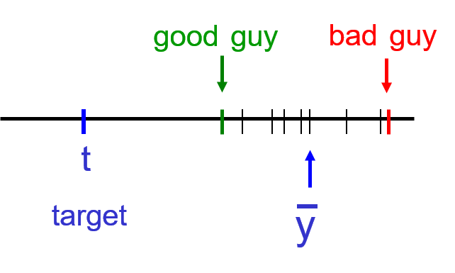
      </a>
    

+ Discrete distributions over class labels
  + Assumption:
    + one model gives the correct label probability $p_i$
    + the other model gives the correct probability $p_j$
  + better way: randomly pick one model or averaging two probabilities?

    \[ \log \left( \frac{p_i + p_j}{2} \right) \geq \frac{\log p_i + \log p_j}{2} \]

  

    <a href="http://www.cs.toronto.edu/~hinton/coursera/lecture10/lec10.pptx" ismap target="_blank">
      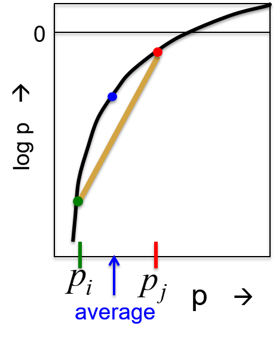
    </a>
  

  + the average of $p_i$ and $p_j$ (middle point of gold line) below the blue dot due to log probability

+ Overview of ways to make predictors differ
  + rely on the learning algorithm getting stuck in different local optima $\implies$ a dubious hack (but worth to try)
  + using different non-neural network models
    + decision trees
    + gaussian process models
    + support vector machines
    + others
  + neural network models
    + different numbers of hidden layers
    + different numbers of units per layer
    + different types of unit, e.g., rectified linear units and logistic units
    +_different types or strengths of weight penalty; e.g., early stopping, L2 penalty, and L1 penalty
    + different learning algorithms; e.g., full bach and mini-batch

+ Making models different  by changing the training data
  + Bagging
    + train different models on different subsets of the data
    + get different training sets by using sampling w/ replacement; e.g., $a, b, c, d, e \to a \, c \, c \, d \, d$
    + random forest: using lots of different decision trees trained using bagging (better result)
  + able to use w/ neural networks w/ bagging but very expensive; e.g., 20 neural nets $\implies$ 20 training and 20 testing
  + Boosting
    + train a sequence of low capacity models w/ the whole training set
    + weight the training cases differently for each model in the sequence
    + boosting up-weights cases w/ previous models got wrong
    + boosting down-weight cases w/ previous cases got right
    + use resources to try and deal w/ wrong models
    + example
      + an early use of boosting was w/ neural networks for MNIST due to low computational power
      + focused the computational resources on modeling the tricky cases

### Lecture Video

<video src="https://youtu.be/yIIFnTkvhrQ?list=PLoRl3Ht4JOcdU872GhiYWf6jwrk_SNhz9" preload="none" loop="loop" controls="controls" style="margin-left: 2em;" muted="" poster="http://www.multipelife.com/wp-content/uploads/2016/08/video-converter-software.png" width=180>
  <track src="subtitle" kind="captions" srclang="en" label="English" default>
  Your browser does not support the HTML5 video element.
</video> 

## 10.2 Mixtures of experts

### Lecture Notes

+ Purpose of mixtures of experts
  + Better way than just averaging models
    + possible: looking at the input data for a particular case to help decide which model to rely on
    + allowing particular models to specialize in a subset of the training cases
    + not learn on cases for which they are not picked $\implies$ ignore stuff not good at modeling
    + individual model might be very good at something and very bad at other things
  + key idea
    + make each model or expert focus on predicting the right answer
    + the cases w/ right answer where it is already doing better than the other experts
    + causing specialization

+ A spectrum of models
  + Very local model (left diagram)
    + e.g., nearest neighbors
    + very fast to fit: just store training cases
    + predict $y$ from $x$ $\implies$ simply find the stored value of $x$ closest to the test value of $x$ to predict the $y$
    + local smoothing would obviously improve things
  + Fully global models (right diagram)
    + e.g., a polynomial
    + may be slow to fit and also unstable
    + small changes to data can cause big changes to the fit
    + each parameter depends on all the data

  

    <a href="http://www.cs.toronto.edu/~hinton/coursera/lecture10/lec10.pptx" ismap target="_blank">
      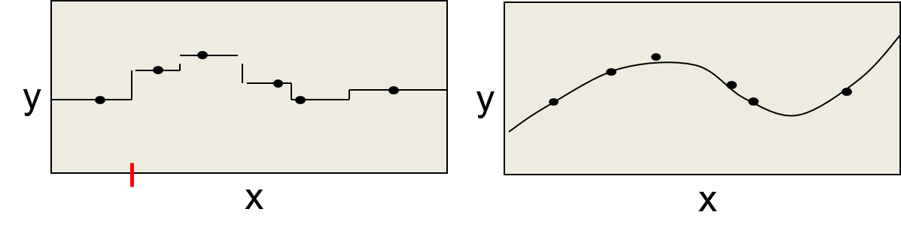
    </a>
  

+ Multiple local models
  + in between the very local & fully global models
  + using several models of intermediate complexity than using a single global model or lots of very local models
    + good if the dataset contains several different regimes which have different relationships btw input and output
    + e.g., the state of the economy has a big effect on determining the mapping between inputs and outputs 
      + using different models for different states of the economy
      + unknown in dadvance how to decide what constitutes different states of the economy $\implies$ required to learn
  + how to partition the dataset into different regimes?

+ Datset partitioning
  + ways: based on input vs. based on the input-output relationship
  + cluster the training cases into subsets
  + one for each local model
  + aim of the clustering:
    + Not to find clusters of similar input vectors
    + each cluster to have a relationship btw input and output that can be well-modeled by one local model
  + example (see diagram)
    + four data points nicely fitted by the red parabola
    + another four data points nicely fitted by the green parabola
    + partition the data based on the input-output mapping 
      + based on the idea that a parabola will fit the data nicely
      + the brown line partitions the data
    + partition the data by just clustering the input
      + the blue line partitioning accordingly
      + the left side of the blue line $\to$ stuck w/ a sunset of data
      + unable to model nicely by a simple model

  

    <a href="http://www.cs.toronto.edu/~hinton/coursera/lecture10/lec10.pptx" ismap target="_blank">
      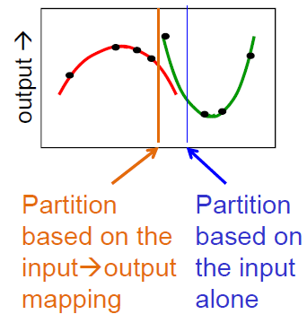
    </a>
  

+ Cooperation vs. Specialization
  + error function encouraging cooperation
    + compare the average to all the predictors w/ the target
    + train all the predictors together to reduce the discrepancy btw the target and the average
    + overfit badly
      + making the model much more powerful than training each predictor separately
      + the models learn to fix up the errors that other models make

      \[ E = (t - \underbrace{<y_i>_i}_{\text{average of all}\\ \text{the predictor}})^2 \]

  + pictorial explanation: averaging models during training causes cooperation not specialization

    

      <a href="http://www.cs.toronto.edu/~hinton/coursera/lecture10/lec10.pptx" ismap target="_blank">
        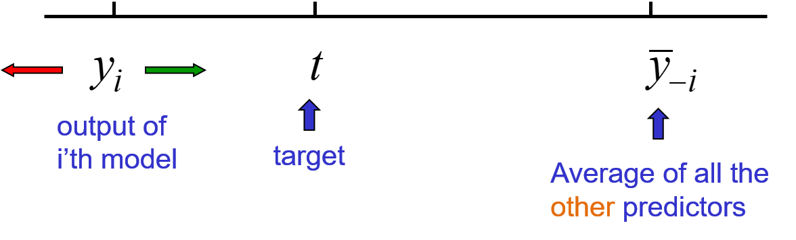
      </a>
    

    + average all models except for model $i$ on the right side
    + model $i$ alone on the left side
    + overall average to be close to the target $\implies$ move the output of model $i$ away from the target value
    + model $i$ learning to compensate for the errors made by all other models
    + really want to move the output of model $i$ in the wrong direction?
    + intitutively, it is better to move model $i$ towards the target (green arrow)

  + error function encouraging specialization
    + compare each predictor separately w/ the target
    + use a "manager" to determine the probability of picking each expert
    + most experts end up ignoring most targets
      + each expert only deal w/ a small subset of the training cases
      + good at learning w/ the small subset of data

      \[ E = <p_i(t-y_i)^2> \]

    + $p_i$: probability of the manager picking expert $i$ for this case
  
+ The mixture of experts architecture (almost)
  + a simple cost function:
    + an intuition for explanation
    + a better cost function based on a mixture model introduced later

    \[ E = \sum_i p_i (t - y_i)^2 \]

  + architecture
    + different experts (the right hand side) making their own predictions based on the input
    + the manager (the left hand side)
      + multiple layer(s)
      + the last layer: softmax
      + output: probabilities for the experts
    + using output of manager and experts to compute the value of the error function

    

      <a href="http://www.cs.toronto.edu/~hinton/coursera/lecture10/lec10.pptx" ismap target="_blank">
        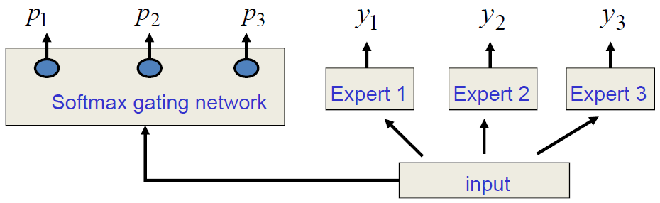
      </a>
    

+ The derivatives of the simple cost function
  + differentiate w.r.t. the outputs of the experts
    + a signal for training each expert
    + the gradient as the probability of picking that expert times the difference btw that expert and the target
  + differentiate w.r.t. the outputs of the gating network
    + a signal for training the gating network
    + as differentiate w.r.t. the quantity entering the softmax
    + the derivative w.r.t. $x_i$ as product of 
      + the probability of the expert picked and the difference btw the squared error made by the expert
      + the average over all experts when using the weighting provided by the manager of the squared error
    + raise $p$ for all experts that give less than the average squared error of all the experts (weighted by $p$)
      + expert $i$ makes a lower square error than the average of the other experts $\to$ raise the probability of expert $i$
      + expert $i$ makes a higher squared error than the average of the other experts $\to$ lower its probability
      + causing specialization
  + math representation

    \[ p_i = \frac{e^{x_i}}{\sum_j e^{e^{x_j}}}, \qquad\qquad E = \sum_i p_i (t-y_i)^2 \]

    \[ \frac{\partial E}{\partial y_i} = p_i (t-y_i) \qquad\qquad \frac{\partial E}{\partial x_i} = p_i \left( (t-y_i)^2 - E \right) \]

+ A better cost function for mixtures of experts
  + Jacobs, Robert & Jordan, Michael & Nowlan, Steven & Hinton, Geoffrey. (1991). [Adaptive Mixture of Local Expert](https://www.cs.toronto.edu/~hinton/absps/jjnh91.pdf). Neural Computation. 3. 78-88. 10.1162/neco.1991.3.1.79.
  + each expert as making a prediction w/ a Gaussian distribution around its output (w/ variance 1)
    + assumption (see the left diagram)
      + $y_1$ as the output of a particular value w/ a unit variance Gaussian prediction (red expert)
      + $y_2$ as the prediction of another expert makes a Gaussian prediction (green expert)
  + the manager:
    + deciding on a scale for each of these Gaussian
    + the scale called a "mixing proportion"; e.g., $\{ 0.4 \; 0.6 \}$ for red and green experts respectively (see right diagram)
    + predictive distribution of mixture of expert: no longer Gaussian after summing of scaled down read Gaussian and scaled down green Gaussian
  + maximize the log probability of the target value under this mixture of Gaussian model; i.e., the sum of the two scaled Gaussian
    + max the log probability under the black curve
    + black curve as the sum of red and green curves

  

    <a href="http://www.cs.toronto.edu/~hinton/coursera/lecture10/lec10.pptx" ismap target="_blank">
      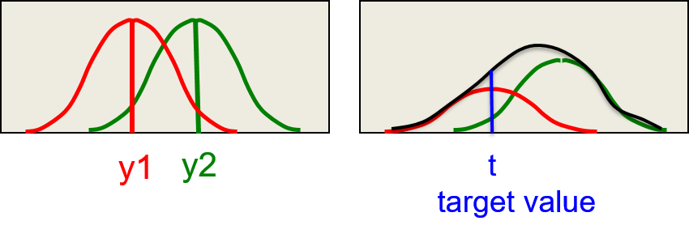
    </a>
  

  + the probability of the target under a mixture of Gaussian

    \[ p(t^c | MoE) = \sum_i p_i^c \frac{1}{\sqrt{2\pi}} \exp \left(-\frac{1}{2} (t^c - y_i^c)^2 \right) \]

    + $p(t^c | MoE)$: prob. of target value on case $c$ given the mixture
    + $p_i^c$: mixing proportion assigned to expert $i$ for case $c$ by the gating network
    + $y_i^c$: output of expert $i$
    + $1/\sqrt{2 \pi}$: normoralization term for a Gaussian w/ $\sigma^2 = 1$

### Lecture Video

<video src="https://youtu.be/d_GVvIBlWtI?list=PLoRl3Ht4JOcdU872GhiYWf6jwrk_SNhz9" preload="none" loop="loop" controls="controls" style="margin-left: 2em;" muted="" poster="http://www.multipelife.com/wp-content/uploads/2016/08/video-converter-software.png" width=180>
  <track src="subtitle" kind="captions" srclang="en" label="English" default>
  Your browser does not support the HTML5 video element.
</video> 

## 10.3 The idea of full Bayesian learning

### Lecture Notes

+ Full Bayesian learning
  + compute the full posterior distribution over all possible parameter settings
    + tradition: trying to find the best single setting of the parameters (as in Maximum Likelihood or MAP)
    + extremely computationally intensive for all but the simple models (its feasible for a biased coin)
  + making prediction
    + prediction based on each different setting o the parameters
    + combine all these predictions by weighting each of them by the posterior probability of that setting of the parameters
    + very computationally intensive
  + advantage: allowing to use complicated models even w/o much data

+ Overfitting: a frequentist illusion?
  + overfitting: fit a complicated model to a small amount of data
  + result of not bothering to get the full posterior distribution over the parameters
  + not much data
    + using simple model than complex one to prevent overfitting
    + only if assume that fitting a model means choosing a single best setting of the parameters
  + using full posterior distribution over parameter setting
    + overfitting disappear
    + little data $\implies$ ver vague predictions
    + many different parameters settings have significant posterior probability
  + more and more data:
    + posterior probability will get more and more focused on a few settings of parameters
    + posterior prediction will get much shaper

+ A class example of overfitting
  + example: (left diagram)
    + 6 data points
    + red line: fit w/ a fifth order polynomial $\implies$ exactly thought the data more or less
    + green line: a straight line w/ only two degrees of freedom
  + which model better?
    + complicated models fitting the data better: 
      + 6 coefficients and almost perfectly
      + not economical
      + making silly predictions
    + simple model
      + two coefficients
      + fit data badly
    + blue arrow:
      + red curve predict a value lower than any of the observed data points $\implies$ nor reasonable
      + green line: predict a sensible value
  + more complicated model (right diagram)
    + starting w/ a reasonable prior over all fifth-order polynomials w/ coefficient not too big
    + compute the full posterior distribution over the fifth order polynomial
    + red lines shown as samples from the distribution
    + thicker line means higher probability in the posterior
    + thin curves miss a few of data points by quite a lot, nevertheless they're quite close to most of the data points
    + get vague and sensible predictions
    + blue arrow will get different predictions w/ different models
    + on average they make a prediction quite close to the prediction made by the green line
  + no reason why the amount of data should influence prior beliefs about the complexity of the model
  + true Basian:
    + you have prior about how complicatied things might be
    + because you haven't elected any data yet
    + not mean things much simplier

  

    <a href="http://www.cs.toronto.edu/~hinton/coursera/lecture10/lec10.pptx" ismap target="_blank">
      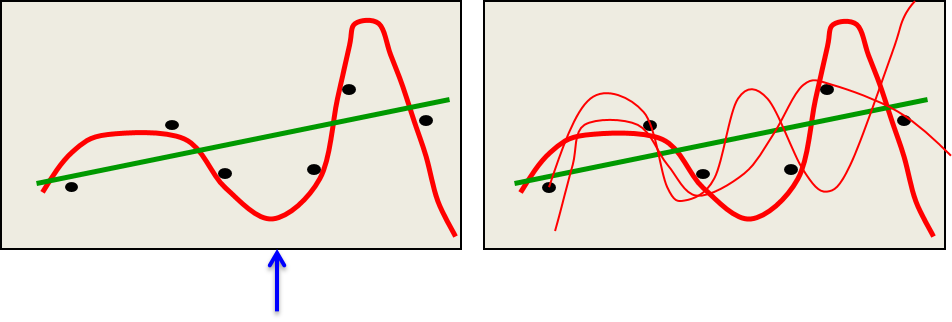
    </a>
  

+ Approximating full Bayesian learning in a neural network
  + neural network w/ a few parameters
    + put a grid over the parameters space
    + evaluate $p(W|D)$ at each grid-point
    + each parameter only allow a few alternative values
    + taking the cross-product of all these values for all the parameters
    + evaluate at each point how well the mode predict the data as if supervised learning hwo well the model predicts the targets
    + the posterior probability of that group point
      + the product of how well it predicts the data and how likely it is under the prior
      + then with the whole thing normalized
    + characteristics:
      + expensive
      + not involving any gradient descent
      + no local optimum issues
  + evaluating all predictions made w/ gride points on test data
    + expensive
    + much better than ML learning when the posterior is vague or multimodal (happened when data is scarce)

  \[ p(t_{test} | input_{test}) = \sum_{g \in grid} p(W_g | D) p(t_{test} | input_{test}, W_g) \]

+ Example of full Bayesian learning
  + Assign 6 weights and biases
    + 9 possible values: $-2, -1.5, -1, -0.5, 0, 0.5, 1.0, 1.5, 2$
    + totally $9^6$ grid-points in parameter space
  + each grid-point: computing the probability of the observed outputs of all the training cases
  + multiply the prior for each grid-point by the likelihood term
  + normalize the product term to get the posterior probability for each grid-point
  + make predictions by using the posterior probabilities to average the predictions made by the different grid-points

  

    <a href="http://www.cs.toronto.edu/~hinton/coursera/lecture10/lec10.pptx" ismap target="_blank">
      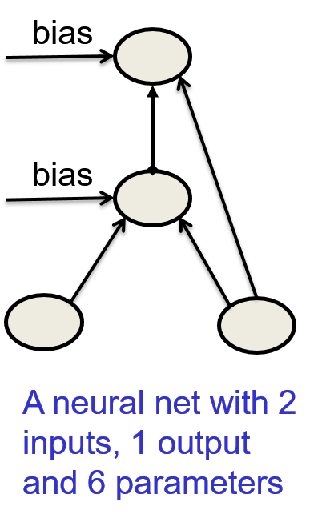
    </a>
  

### Lecture Video

<video src="https://youtu.be/mAoSCUZQEMY?list=PLoRl3Ht4JOcdU872GhiYWf6jwrk_SNhz9" preload="none" loop="loop" controls="controls" style="margin-left: 2em;" muted="" poster="http://www.multipelife.com/wp-content/uploads/2016/08/video-converter-software.png" width=180>
  <track src="subtitle" kind="captions" srclang="en" label="English" default>
  Your browser does not support the HTML5 video element.
</video> 

## 10.4 Making full Bayesian learning practical

### Lecture Notes

+ Dealing w/ too many parameters for a grid
  + the numbder of grid-point
    + exponential growth as the number of parameters increase
    + unable to deal w/ more than a few parameters using a grid
  + enough data
    + making most parameter vectors very unlikely
    + only a tiny fraction of the grid points makes a significant contribution to the predictions
    + focus on evaluating this tiny fraction
  + idea: good enough to just sample weight vectors according to their posterior probabilities

    \[ p(y_{test} | input_{test}, D) = \sum_i \underbrace{p(W_i | D)}_{\text{sample weight vectors}\\ \text{with this probability}} p(y_{text} | input_{test}, W_i) \]

+ Sampling weight vectors
  + standard backpropagation
    + keep moving the weights in the direction that decreases the cost (left diagram)
      + start w/ some small value of the weights
      + follow the gradient to move downhill in the cost function
    + the direction: increasing the log likelihood plus the log prior, summed over all training cases
  + situations of the weights
    + settle into a local minimum
    + get stuck on a plateau
    + just move so slowly that we run out of patience
  + adding Gaussian noise after each update (right diagram)
    + weight vector never settle down
    + keep wandering around but tend to prefer low cost regions of the weight space
    + how often visiting each possible setting of the weights?
    + red dots:
      + samples take of the weights as wandering around the space and then save the weights after every 10000 steps
      + a few of them in high-cost regions $\impliedby$ big regions
      + the depest minimum w/ the most red dots while other minima w/ red dots as well
      + the dots not right at bootom or minimum  $\impliedby$ noisy samples

  

    <a href="http://www.cs.toronto.edu/~hinton/coursera/lecture10/lec10.pptx" ismap target="_blank">
      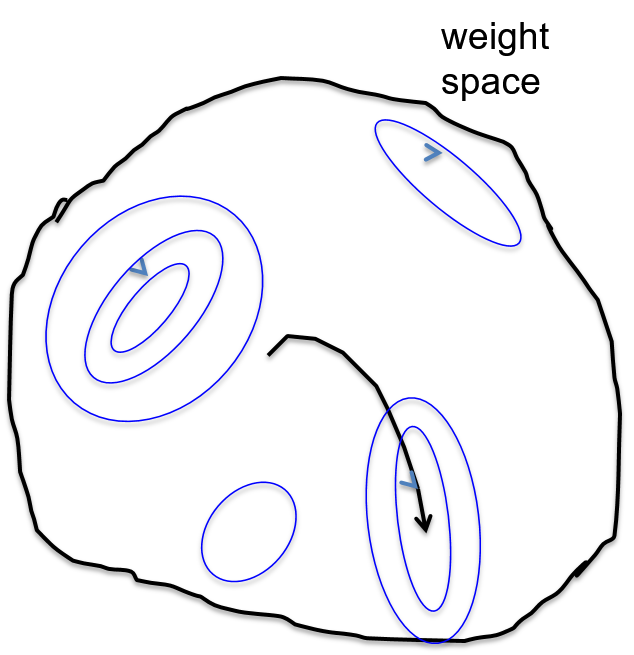
      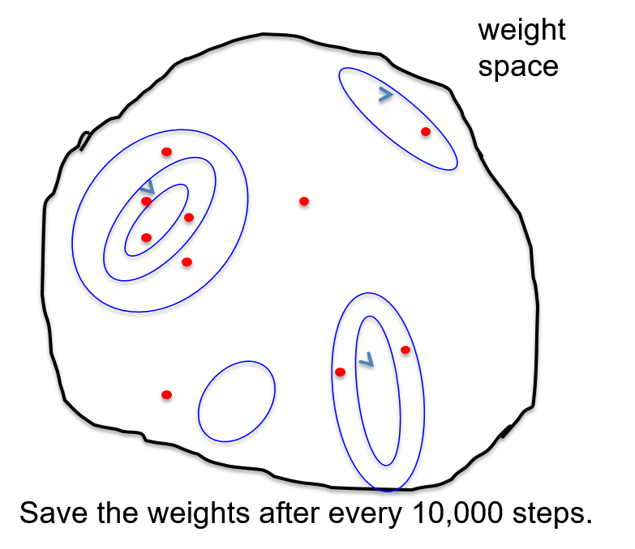
    </a>
  

+ Markov Chain Monte Carlo (MCMC)
  + property of Markov Chain Monte Carlo method
    + use just the right amount noise
    + let the weight vector wander around for long enough taking a sample
    + get an unbiased sample from the true posterior over weight vectors
      + red dots shown in the above diagram will be samples from posterior
      + weight vectors highly probable under the posterior are much more likely to be represented by a red dot
    + make it feasible to use full Bayesian learning w/ thousands of parameters
  + related MCMC methods
    + more complicated but more efficient
    + no need to let weights wander around for so long before getting samples from the posterior

+ Full Bayesian learning w/ mini-batches
  + computing the gradient of the cost function on a random mini-batch
    + get an unbiased estimate w/ sampling noise
    + might use the sampling noise to provide the noise that an MCMC method needs
  + proposal of Ahn, Korattikara & Welling
    + [Bayesian Posterior Sampling via Stochastic Gradient Fisher Scoring](https://arxiv.org/pdf/1206.6380), Proceedings of the 29th International Conference on Machine Learning (ICML), 2012
    + how to do this efficiently
    + possible w/ lots of parameters

### Lecture Video

<video src="https://youtu.be/OC6w_LZIyRo?list=PLoRl3Ht4JOcdU872GhiYWf6jwrk_SNhz9" preload="none" loop="loop" controls="controls" style="margin-left: 2em;" muted="" poster="http://www.multipelife.com/wp-content/uploads/2016/08/video-converter-software.png" width=180>
  <track src="subtitle" kind="captions" srclang="en" label="English" default>
  Your browser does not support the HTML5 video element.
</video> 

## 10.5 Dropout an efficient way to combine neural nets

### Lecture Notes

+ Two ways to average models
  + Mixture
    + combine models by averaging their output probabilities
    + example:
      + Model A: $\{.3, .2, .5\}$
      + Model B: $\{.1, .8, .1\}$
      + Combined: $\{().3+.1)/2=.2, (.2+.8)/2=.5, (.5+.1)/2=.3\}$
  + Product
    + combine models by taking geometric means of their output probabilities
    + example:
      + Combined: $\{\sqrt{.03}, \sqrt{.16}, \sqrt{.05}\} / (\sqrt{.03}+\sqrt{.16}+\sqrt{.05})$

+ Dropout
  + an efficient way to average many large neural nets
  + G. Hinton, N. Srivastava, A. Krizhevsky, I. Sutskever, R. Salakhutdinov, [Improving neural networks by preventing co-adaptation of feature detectors](https://arxiv.org/pdf/1207.0580), 2012
  + consider a neural net w/ one hidden layer
  + randomly omit each hidden unit w/ probability $0.5$ for a training example
  + randomly sampling from $2^H$% different architectures where $H$ as the number of hidden units
  + all architectures share weights: a hidden unit uses the same weights as it has in other architectures

  

    <a href="http://www.cs.toronto.edu/~hinton/coursera/lecture10/lec10.pptx" ismap target="_blank">
      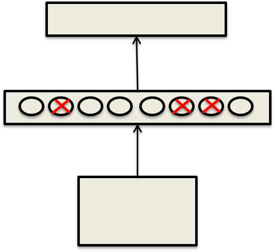
    </a>
  

  + a form of model averaging
    + sample from $2^H$ models
      + only a few of the models ever get trained
      + only get one training example when selected
      + as extreme form of bagging
      + the training sets
        + very different for the different models
        + very small number
    + sharing weights with other models
      + every model is very strongly regularized by the others
      + much better than L2 and L1 penalities that pull the weights towards zero
      + regularized by by something that tends to pull the weights towards the correct value

+ Testing
  + naive method
    + sample many different architectures
    + take the geometric mean of their output distribution
  + efficient method
    + use all of the hidden units but to halve their outgoing weights $\implies$ the same expected effect as they did when we were sampling
    + using all of the hidden units w/ half of their outgoing weights
    + exactly compute the geometric mean of the predictions of all $2^H$ models
    + using a softmax output group

+ Multiple hiddent layers
  + use dropout of %0.5$ in every layer
  + testing: use the "mean net" that has all the outgoing weights halved
    + using a net w/ all of the hidden units butthe weights are halved
    + not exactly the same as averaging all the separate dropped out model
    + a pretty good approximation and fast
  + stochastic model w/ dropout:
    + run the stochastic model several times on the same input
    + average across those stochastic models
    + provide an idea of the uncertainty in the answer

+ Input layer
  + use dropout too
  + but w/ a higher probability of keeping an input unit
  + used by the "denoising autoencoders"
  + P. Vincent, H. Larochelle, Y. Bengio, and P.Manzagol, [Extracting and Composing Robust Features with Denoising Autoencoders](https://www.cs.toronto.edu/~larocheh/publications/icml-2008-denoising-autoencoders.pdf), 2008

+ How well dropout work
  + Alex Krizhevsky:
    + recording breaking object recognition net
    + using dropout and help a lot
  + usually reduce the number of errors significantly w/ significantly overfitting deep neural net
    + "early dropping" do better than "dropout"
    + cost: longer training time and might be more hidden units
  + deep neural net w/o overfitting:
    + using a bigger one
    + using dropout that's assuming enough computational power

+ Viewpoint of Cooperation and Specialization
  + related to mixtures of experts
  + what's wrong when all the experts cooperate
  + what's preventing specialization
  + a hidden unit knows which other hidden units present
    + co-adapt to them on the training data
      + training a hidden unit is trying to fix up the error that's left over
      + the remaining error caused by when all the other hidden units had their say that's what's being backpropagated to train the weights of each hidden unit
    + complex co-adaptions likely to go wrong on new test data
    + big, complex conspiracies not robust
      + similar to involving many people is sum to go wrong because there's always things you did not think of
      + many people involved but one of them behaved in an unexpected way and then the others will be doing the wrong thing
    + better w/ conspiracies to have lots of little conspiracies
      + when unexpected things happened
      + many of the little conspiracies failed but some of them still succeed
  + a hidden unit work well w/ combinatorially many sets of co-works
    + more likely to do something that is individually useful
    + tend to do something that is marginally useful given what its co-workers achieve

### Lecture Video

<video src="https://youtu.be/vAVOY8frLlQ?list=PLoRl3Ht4JOcdU872GhiYWf6jwrk_SNhz9" preload="none" loop="loop" controls="controls" style="margin-left: 2em;" muted="" poster="http://www.multipelife.com/wp-content/uploads/2016/08/video-converter-software.png" width=180>
  <track src="subtitle" kind="captions" srclang="en" label="English" default>
  Your browser does not support the HTML5 video element.
</video> 

