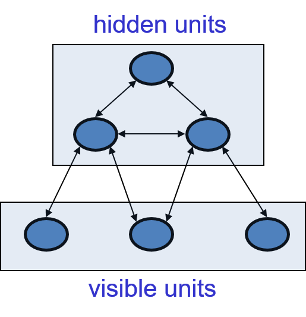
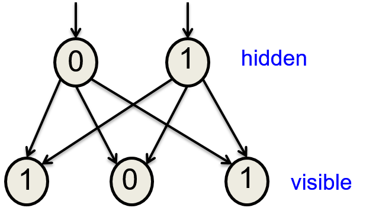
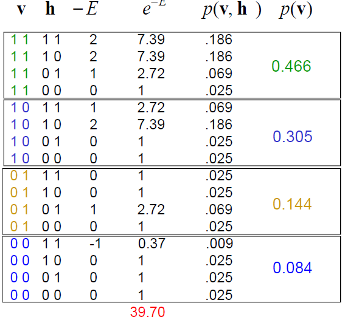
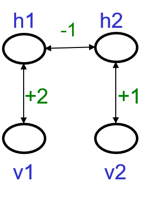

# Hopfield Nets and Boltzmann Machines

## 11.1 Hopfield Nets

### Lecture Notes

+ Hopfield Networks
  + energy-based model: properties derive from a global energy function
  + combposed of binary threshold units w/ recurrent connections between them
  + recurrent network of non-linear units
    + generally very hard to analyze
    + behave in many different ways
      + settle to a stable state
      + oscillate
      + follow chaotic trajectories that cannot be predicted far into the future unless knowing the starting state w/ infinite precision
  + John Hopfield's proposal
    + J. J. Hopfield, "[Neural networks and physical systems with emergent collective computational abilities](https://www.pnas.org/content/pnas/79/8/2554.full.pdf)", Proceedings of the National Academy of Sciences of the USA, vol. 79 no. 8 pp. 2554–2558, April 1982
    + existing a global energy function w/ __symmetric__ connections
    + each binary "configuration" of the whole network w/ an energy
      + binary configuration: an assignment of binary values to each neuron in the network
      + each neuron w/ a particular binary value in a configuration
    + binary threshold decision rule causing the network to settle to a minimum of the energy function

+ The energy function
  + global energy: the sum of many local contributions
  + the main contributions: the form of the product of one connection weight w/ the binary of two neurons

    \[ E = - \sum_i s_i \cdot b_i - \sum_{i < j} s_i s_j \cdot w_{ij} \]

    + energy is bad $\implies$ low energy is good $\implies$ minus sign (-) for the equation
    + $s_i$: binary variable w/ values of $1$ or $0$ or in another kind of Hopfield net w/ values of $1$ or $-1$
    + $w_{ij}$: weight for the symmetric connection strength btw two neurons
    + $s_i b_i$: bias term involves the state of individual units
    + $s_i s_j$: the activities of the two connected neurons

  + simple _quadratic_ energy function makes it possible for each unit to compute locally how it's state affects the global energy:

    \[ \text{Energy gap} = \Delta E_i = E(s_i = 0) - E(s_i = 1) = b_i + \sum_j s_j \cdot w_{ij} \]

    + the energy gap for unit $i$ = the difference of the global energy of the whole configuration depending on whether or not unit $i$ is on
    + $E(s_i = 0) - E(s_i = 1)$: the difference btw the energy when unit $i$ is off and the energy when unit $i$ is on; computed by the binary threshold decision rule

+ Settling to an energy minimum
  + finding the minimum energy
    + start from a random state
    + sequential update: update units _one at a time_ in random order
    + update each unit to whichever of its two states gives the lowest global energy independent of what state it was previously
    + i.e., use binary threshold units
  + commputing the goodness: all pairs of units w/ on and add in the weight between them
  + example:
    + start w/ random global state (carefully selected random state for demo) $\to$ goodness as $-E = 3$
    + 1st fig: randomly pick a unit (top right cornere one)
      + input: $1 \times -4 + 0 \times 3 + 0 \times 3 = -4$
      + unit state: $-4 < 0 \to 0 \implies$ state off
    + 2nd fig: randomly pick a unit except for computed one (bottom left corner one)
      + input: $1 \times 3 + 0 \times (-1) = 3$
      + unit state: $3 > 0 \to 1 \implies$ state on
    + 3rd fig: randomly pick a unit except for computed ones (botton middle one)
      + input: $1 \times 2 + 1 \times (-1) + 0 \times 3 + 0 \times (-1) = 1$
      + unit state: $1 > 0 \to 0 \implies$ turn on
      + goodness: $-E = 3 + 2 -1 = 4$
    + probing any of the units: no state changed $\implies$ settle to minimum
    + 4th fig: the deepest energy minimum
      + 3rd fig is one of the two minima of the net
      + 4th fig shows the deepest energy minimum
      + when the other triangle of units supports each orther is on
      + goodness: $-E = 3 + 3 -1 = 5$+ two triangles in the net (4th fig)
      + two triangles:
        the three units mostly support each other although a little bit disagreement at the bottom
        + each triangle mostly hates the other triangle via connection on top
      + the triangle on the left differs from one on the right by having a wight of two where the other one has a weight of 3 $\implies$ the triangle on the right will provide the deepest minimum

  

    
  

+ Sequential decisions
  + if units make __simultaneous__ decisions the energy could go up
  + simultaneous parallel updating $\implies$ getting oscillations (always w/ period 2)
  + the updates occur in parallel but w/ random timing $\implies$ the oscillations usually destroyed
    + not waiting for one update to communicate the state to everybody before considering another update
    + but waiting for random length of time between doing updates of a given unit
    + the random timing will often destory these bi-phasic oscillations
    + the updates have to be sequential, not as bad as it seems from a biological perspective (?)
  + example:
    + a network w/ units have biases at +5 and weight between them of -100
    + start w/ both states off
    + at the next parallel step, both units will turn on $\impliedby$ assume to improve via the bias term but worse due to -100
    + w/ high energy, both turn off again

    

      
    

+ Neat way to compute sequential decisions
  + Hopfield proposal
    + memories could be energy minima of a neural net w/ symmetric weights
    + binary threshold decision rule used to "clean up" incomplete or corrupted memories
      + clean up partial memory into full memory
      + fill out the memory caused by corrupted memory due to wrong computation or undecided
  + Principles of Literary Criticism
    + I. A. Richards (1924) proposal [wikipedia](https://en.wikipedia.org/wiki/I._A._Richards)
    + idea of memories as energy minima
    + memories are like a large crystal that can sit on different phases
  + energy minima
    + represent memories w/ a content-addressable memory
    + access an item by just knowing part of its content
      + set the states of some neurons in the net
      + randomly put the other neurons in random states
      + apply the binary threshold rule w/ a bit of luck
      + fill up that memory to be some stored item you know about
    + biological property: robust against hardware damage
    + psychological point of view: like reconstructing a dinosaur from a few bones
      + knowing something about how the bones are meant to fit together
      + the weight in the net provides infomation about how states of neurons fit together
      + given the states of a few neurons $\implies$ fill out the whole state to recover a whole memory

+ Storing memories in a Hopefield net
  + with activities of $1$ and $-1$
    + stored as a binary state vector by incrementing the weight btw any two units by the product of their activities
    + treating biases as weights from a permanently on unit
    + very simple rule: not error-driven
      + just go through data once and done
      + a genuine online rule
      + not predicting what the right answer is and then making small adjustments
    + both its strength and weakness
      + not error correction rule
      + able to be online but not a very efficient way to store things

    \[ \Delta w_{ij} = s_i \cdot s_j \]

  + with state of $0$ and $1$, the rule is slightly more complicated

    \[ \Delta w_{ij} = 4 (s_i - \frac{1}{2}) (s_j - \frac{1}{2}) \]

### Lecture Video

<video src="https://youtu.be/DS6k0PhBjpI?list=PLoRl3Ht4JOcdU872GhiYWf6jwrk_SNhz9" preload="none" loop="loop" controls="controls" style="margin-left: 2em;" muted="" poster="http://www.multipelife.com/wp-content/uploads/2016/08/video-converter-software.png" width=180>
  <track src="subtitle" kind="captions" srclang="en" label="English" default>
  Your browser does not support the HTML5 video element.
</video> 

## 11.2 Dealing with spurious minima in Hopfield nets

### Lecture Notes

+ Storage capacity
  + Hopfield nets w/ memory storage devices
  + obsessed by the storage capacity of the Hopfield net
  + the capacity of a totally connected net w/ $N$ units by Hopfield storage rule
    + only about $0.15N$ memories
      + before memories start getting confused w/ one another
      + the number to store and retrive memories sensibly
    + only $0.15N^2$ bits at $N$ bits per memory
      + each memory randomly configures the $N$ units
      + $N$ bits information in it
    + not making efficient use of the bits required to store the weights
      + how many bits the computer used to store the weight?
      + using well over $0.15N^2$ bits to store the weihts
      + local distributed memory in local energy minima is making efficient use of the bits in the computer
      + able to analyze how many bits in the computer to make efficient use of the bits $\to N^2$
  + the net w/ $N^2$ weights and biases
  + after storing $M$ memories, the integer value range of each connection weight is $[-M, M]$
    + assume that states are $-1$ and $1$
    + increase or decrease by one each time when storing a memory
    + not all values are equal-probable
  + number of bits to store the weights and biases:

    \[ N^2 \log(2M+1) \]

    + compress the information and ignore the number of bits taken to store a connection weight in the naive way
    + total number of bits of computer memory used is the order of $N^2 \log(2M+1)$
    + the scales logarithmically with $M$ and storing things as Hopfield suggested $\to$ getting constant $0.15$

+ Spurious minima limit capacity
  + create a new energy minimum for each configuration memorizing (top fig)
    + state space for all the states of the net depicted horizontally
    + the energy depicted vertically
    + one energy minimum for the blue pattern
    + another energy minimum for the green pattern
  + limitation of the capacity of Hopfield net (bottom fig)
    + two nearby patterns $\implies$ unable to separate two minimum
    + merging to create one minimum at an intermediate location
    + unable to distinguish these two separate memories
  + diagrams mis-interpresent Hopfield nets
    + state space: the corners of a hypercube
    + unable to show the corners of a hypercub w/ a 1-D continuous space 

    

      
    

+ Avoiding spurious minima
  + unlearing
    + J. Hopfield, D. Feinstein and R. Palmer, [‘Unlearning’ has a stabilizing effect in collective memories](https://www.researchgate.net/profile/John_Hopfield/publication/16333131_'Unlearning'_has_a_stabilizing_effect_in_collective_memories/links/563fef2f08aec6f17ddb84cc/Unlearning-has-a-stabilizing-effect-in-collective-memories.pdf), Nature 304(5922):158-9 · July 1983
    + strategy
      + let the net settle from a random initial state and then do __unlearning__
        + whatever binary state it settles, apply the opposite of the storage rule
        + example w/ the previous figs
          + the red merged minimum if the net settle there and did some unlearning on that merge minimum
          + get back to two separate minima becaus of pulling up the red point
      + get rid of deep, spurious minima and increase memory capacity
    + shown that the strategy works but no good analysis to explain
  + analogy w/ Reverse Learning
    + proposed by F. Crick and G. Mitchison
    + [reorganisational theory of dreaming - Reverse Learning](https://en.wikipedia.org/wiki/Reverse_learning)
    + F. Crick: one the discovers of the structure of DNA
    + a model of what dreams are for
      + during REM sleep that is rapid eye movement sleep
      + during day people store lots of things and get spurious minima
      + at night put the network in a random state and settle to a minimum $\implies$ unlearn what settled to
      + at night people dream for several hours, those dreams are gone when wake up in the morning
      + the dreams are not quite all gone
      + the dream just before wake up will get into short-term memory
      + once people think of it, it will be remembered for a long time
      + all dreaming is paradoxical because the state of people's brain look extremely like the state of brain when awake
      + except that it isn't being driven by real input but driven by a relay station just after the real input, called the thalamus
      + the theory explains functionally what the point of dreams is to get rid of those spurious minima
    + that's what why you don't remember them
  + how much unlearning should apply?
    + unlearning as part of the process of fitting a model to data
    + apply maximum likelihood fitting of the model
    + unlearning automatically come out of fitting the model
    + knowing how much unlearning to do
  + derive unlearning as the right way to minimize some cost function
    + the cost function is how well the neural net models the data people saw during the day

+ Increasing the cpacity
  + physics:
    + the math already known might explain how the brain works
    + many papers published in physics journals
    + related to Hopfield nets and their storage capacity
  + Elizabeth Gardiner proposal
    + using the full capacity of the weights
    + a much better storage rule
  + updating the memories
    + cycle through the training set many times than storing vectors in on shot
      + loose the nice online property
      + gain more efficient storage
    + using the perceptron convergence procedure
      + to train each unit to have the correct state given the states of all the other units in that global vector that would like to store
      + take the net and put into the memory state willing to store
      + take each unit separately and judge that the unit adopt to the state you want for it given the states of all the other units
        + yes: leave its incoming weight alone
        + no: change its incoming weights in the way specified by the perceptron convergence procedure (integer changes to the weights)
      + process several times
      + too many memories $\implies$ diverge
      + only converge w/ perceptron convergence procedure settled a set of weights to solve the problem
  + statistics: pseudo-likelihood
    + get one thing right given all the other things
    + w/ high dimensional data, trying to get the value on 1-dim right given the values on all the other dimensions
    + main difference btw perceptron convergence procedure: 
      + in the Hopfield net the weights are symmetric
      + two sets of gradients for each weight and average them
  + the way to use the full capacity of Hopfield net
    + to use the perceptron convergence procedure
    + go through the data several times

### Lecture Video

<video src="https://youtu.be/GgLNhHQ4ACY?list=PLoRl3Ht4JOcdU872GhiYWf6jwrk_SNhz9" preload="none" loop="loop" controls="controls" style="margin-left: 2em;" muted="" poster="http://www.multipelife.com/wp-content/uploads/2016/08/video-converter-software.png" width=180>
  <track src="subtitle" kind="captions" srclang="en" label="English" default>
  Your browser does not support the HTML5 video element.
</video> 

## 11.3 Hopfields Nets with hidden units

### Lecture Notes

+ Introduction
  + the weights btw units represent constraints on good interpretations
  + finding a low energy state $\to$ finding a good interpretation of the input data

+ Hopfield combines two ideas
  + find local energy minimum by using as network of symmetrically connected binary threshold units
  + local energy minimum might correspond to memories

+ Different computational role
  + using Hopfield net to construct interpretations of sensory input instead of using net to store memories
  + Notations:
    + input: visible units
    + interpretation: the states of the hidden units
    + badness of the interpretation: the energy
  + construct an interpretation of input in the set of hidden units
  + the interpretation or explanation of the input as a binary configuration over the hidden units
  + the energy of the whole system represents the badness of that interpretation
  + to get good interpretations according to current model is the energy function
  + to find the low energy states of the hidden units given by the input represented by the visible units

  

    
  

+ Infer about 3-D edges from 2-D lines
  + 2-D line in an image might be caused by many different 3-D edges
  + a straight 3-D edge
    + information lost in the image
    + lost the 3-D depth of each end of the 2-D line
    + a family of 3-D edges all corresponding to the same 2-D lines
  + pictorial explanation of 2-D and 3-D mapping (left diagram)
    + red lines: two lines of sight coming from the center of eyeball
    + black line: a possible 3-D edge leading to a 2-D line on people's retina
    + all 3-D edges (black lines) having exactly the same appearance in the image
    + lose the information about how far away the ends of the line are along that line of sight
    + the end is somewhere along the line of sight but the depth unknown
    + only see one of these 3-D edge at a time
    + 3-D edges occlude one another
  + find low energy states of a network binary unit to find interpretations of sensory input
  + example: Interpreting a line drawing to 3-D image (right diagram)
    + 2-D line
      + using one "2-D line" for each possible line in the picture
      + any particular picture will only activate a very small subset of the line units
      + two edges activating two of the neurons in the picture
      + those neurons represent 2-D lines as data
    + 3-D line
      + using one "3-D line" for each for each possible 3-D line in the scene
      + 2-D line unit projected to many possible 3-D lines
      + competition between these 3-D lines
      + only one 3-D line seen on 2-D line
      + s stack of 3-D line units
      + green connection: excitatory connections coming from 2-D line unit w/ equal weights
      + the 2-D line unit represents to tur on all of these 3-D line units
      + red line: competition btw these 3-D line units
      + the neural network in the green and red connections understands that each 2-D line can correspond to many different 3D edges but only one of them should be present at a time
    + make 3-D lines support each other if they join in 3-D
      + double arrow green line: join the two 3-D edge units w/ same or different depth
      + two joined units support each other
      + join different depth of 3-D edge unit very unlikely
      + therefore, expect coincide in the image to correspond too 3-D edges on the same depth of that point
    + make 3-D lines __strongly support__ each other if they join at right angles
      + thicker green line: join two 3-D edge unit w/ same depth and right angle

  

    
  

+ Two difficult computational issues
  + using the states of the hidden units to represent an interpretation of input raises two difficult issues
  + Search:
    + how do we avoid getting trapped in poor local minima of the energy function?
    + poor minima represent sub-optimal interpretations
    + able to simply go downhill in energy from some random starting state?
  + Learning:
    + how do we learn the weights on the connections to the hidden units and btw the hidden units?
    + any simple algorithm for adjusting all those weights $\implies$ get sensible perceptual interpretations?
    + no supervisor so far

### Lecture Video

<video src="https://youtu.be/vVEju0zMCaA?list=PLoRl3Ht4JOcdU872GhiYWf6jwrk_SNhz9" preload="none" loop="loop" controls="controls" style="margin-left: 2em;" muted="" poster="http://www.multipelife.com/wp-content/uploads/2016/08/video-converter-software.png" width=180>
  <track src="subtitle" kind="captions" srclang="en" label="English" default>
  Your browser does not support the HTML5 video element.
</video> 

## 11.4 Using stochastic units to improve search

### Lecture Notes

+ Noisy networks
  + Hopfield always making decisions to reduce the energy $\implies$ impossible to escape from local minima
  + using random noise to escape from poor minima
    + start w/ a lot of noise to cross energy barriers
      + allowing to explore the space on a coarse scale
      + finding the generally good regions of the space
    + simulated annealing: slowly reduce the noise so that the systems ends up in a deep minimum
      + concentrating on the best nearby minima
      + propgated by Kirkpatrick around the same time as Hopfield nets

+ Temperature in physical system
  + energy function in simulated system
  + high temperature transition probabilities (top diagram)
    + the probability of going uphill from B to A lower than the probability of going downhill from A to B but not much lower
    + temperature flattens the energy landscape
    + particles (black dots) moving according to the transition probabilities from an energy function and a temperature
    + a typical distribution if the system at high temperature $\implies$ easier to cross barriers
    + difficult to stay in deep minimum
  + low temperature transition probabilities (bottom diagram)
    + probability of crossing barriers much smaller
    + ratio of the probability from A to B vs. the probability from B to A is much better
    + expect all the particles in B
    + running long time at low temperature $\implies$ long time for particles to escape from A
  + better solution: start w/ high temperature and then gradually reduce the temperature

  

    
  

+ Stochastic binary units
  + biased random decisions w/ binary stochastic units
    + temperature controls the amount of noise
    + raising the noise level equivalent to decreasing all the energy gaps btw configuration
  + normal logistic equation

    \[ p(s_i = 1) = \frac{1}{1 + \exp(-\Delta E_i / T)} \]

    + $T$: temperature
    + energy gap scaled by a temperature
    + $T \to \infty, \exp(-\Delta E_i / T) \approx 0 \to p(s_i=1) = 1/(1+1) \implies$ knees on and off states
    + $T \to 0, \exp(-\Delta E_i/T) \approx -\infty \text{ or } \infty \text{ (depending on value of } \Delta E_i) \to p(s_i =1) = 0 \text{ or } 1 \implies$ firmly off or on $\implies$ behave deterministically and a binary threshold unit
  + energy gap

    \[ \text{Energy gap} = \Delta E_i = E(s_i = 0) - E(s_i = 1) = b_i + \sum_j s_j \cdot w_{ij} \]

    + difference in the energy of the whole system
    + depending on the unit $i$ is off or on

+ Simulated annealing
  + S. Kirkpatrick, C. D. Gelatt and M. P. Vecchi, [Optimization by Simulated Annealing](https://www.researchgate.net/profile/Scott_Kirkpatrick/publication/220118677_Optimization_by_Simulated_Annealing/links/543d17040cf24ef33b766d9e/Optimization-by-Simulated-Annealing.pdf), Science, New Series, Vol. 220, No. 4598. (May 13, 1983), pp. 671-680
  + a powerful method for improving searches that get stuck in local optima
  + one of the idea leading to Boltzmann machines
  + a big distraction from the main ideas behind Boltzmann machines
  + using binary stochastic units having a temperature of 1 for standard logistic function in the energy gap

+ Thermal equilibrium
  setting temperature as 1 $\implies$ fixed temperature
  + a difficult concept
    + reaching thermal equilibrium not meant that the system has settled down into the lowest energy configuration
    + state units still rattling around at thermal equilibrium unless the temperature  is zero
    + settle down means the probability distribution over configurations
    + settle to the stationary distribution determined by the energy function of the system
    + stationary distribution: the probability of any configuration proportional to $\exp(-E)$
  + intuitive view
    + imagine a huge ensemble of systems w/ exactly same energy function
      + large number of stochastic Hopfield nets w/ all the same weights
      + w/ huge ensemble, define the probability of a configuration as a fraction of the systems w/ the configuration
    + the probability of a configuration: just the fraction of the systems w/ that configuration

+ Approaching thermal equilibrium
  + start w/ any distribution for all the identical systems
    + start w/ all the systems in the same configuration $\implies$ the distribution w/ the probability of configuration w/ $p(x=1) = 1$ and $p(x= 1) = 0$
    + start w/ an equal number of systems in each possible configuration $\implies$ uniform distribution
  + then keep applying stochastic update rule to pick the next configuration for each individual system
    + pick a unit then examine its energy gap
    + make random decision based on the energy gap to turn on or off
  + running the systems stochastically in the right way
  + eventually reach a situation where the fraction of systems in each configuration remains constant
    + thermal equilibrium: the stationary distribution in physics
    + any given system keeps changing its configuration
      + states of units keep flipping btw 0 and 1
      + the fraction of systems in each configuration does not change

+ Analogy of thermal equilibrium
  + full of card dealers
  + procedure
    + start w/ the card packs in standard order
    + the dealers all start shuffling their packs
    + after a few steps the king of spades still has a good chance of being next to the queen of spades
    + the packs have not yet forgotten where they started
    + after prolonged shuffling, the packs will have forgotten where they started $\implies$ irrelevant to the initial order
    + $52!$ possible orders in each packs
    + one equilibrium reached, the number of packs that leave a configuration at each step will be equal to the number that enter the configuration
  + wrong aspect in the analogy:
    + all the configurations w/ equal energy
    + w/ same probability
  + generally, reaching equilibrium for systems that some configurations w/ lower energy than others

### Lecture Video

<video src="https://youtu.be/hmL9Kozwf7A?list=PLoRl3Ht4JOcdU872GhiYWf6jwrk_SNhz9" preload="none" loop="loop" controls="controls" style="margin-left: 2em;" muted="" poster="http://www.multipelife.com/wp-content/uploads/2016/08/video-converter-software.png" width=180>
  <track src="subtitle" kind="captions" srclang="en" label="English" default>
  Your browser does not support the HTML5 video element.
</video> 

## 11.5 How a Boltzmann machine models data

### Lecture Notes

+ Boltzmann machine
  + a stochastic Hopfield networks w/ hidden units
  + good at modeling binary data

+ Modeling binary data
  + building a model
    + given a training set of binary vectors
    + fit a model $\implies$ assign a probability to every possible binary vector
  + useful for deciding if other binary vectors come from the same distribution
  + example: documents represented by binary features that represents the occurrence of a particular word
    + examine a new binary vector and then decide which distribution it came from
    + different kinds of documents represented by a number of binary features
    + each of feature which whether more than 0 occurrences of a particular word in that document
    + different documents expect different counts for the different words and different correlations btw words
    + using a set of hidden units to model the distribution for each document then picking up the most likely document
    + assign a testing document to the appropriate class by seeing which class of documents is most likely to produce that binary vector
  + used for monitoring complex systems to detect unusual behavior
  + example: all dials are binary in a nuclear power station
    + many binary numbers to display the state of the power station
    + purpose: identify unusual states
    + not using supervised learning for that because of no example of states that to blow up
    + rather able to detect such a state w/o ever seeing before
    + build a model w/ the normal states alike
    + noticing the states different from the normal states
  + models of several different distributions $\implies$ used to computer the posterior probability that a paticular distribution produced the observed data by using Bayes theorem

    \[ p(Model \; i | data) = \frac{p(data | Model \; i)}{\displaystyle \sum_j p(data | Model \; j)} \]

+ causal generative model
  + generate the states of some latent variables
  + using latent variables to generate binary vector
  + procedures
    + pick the hidden states from their prior distribution (hidden layer)
      + usually independent variables in the prior
      + the probability of turning on depending on some biases if they were binary latent variables
    + pick the visible states from their conditional distribution given by the hidden states (visible layer)
      + using the picked states in the hidden layer units to generate the states of visible units by using weighted connections in this model
      + a kind of neural network causal generative model: 
        + using logistic units, biases for the hidden units, and weights on the connections between hidden and visible units
        + assign the probability to every possible visible vector
  + probability of generating a visible vector, $\mathbf{v}$
    + computed by summing over all possible hidden states
    + the probability of generating that hidden state times the probability of generating $\mathbf{v}$ given that already generated that hidden state
    + a causal model factor analysis; e.g., a causal model using continuous variables
    + probably the most natural way to generate data
    + generative model: a causal model alike
    + each hidden state is an "explanation" of $\mathbf{v}$

    \[ p(\mathbf{v}) = \sum_{\mathbf{h}} p(\mathbf{h}) p(\mathbf{v}|\mathbf{h}) \]

  

    
  

+ Generating data in Boltzmann machine
  + not a causal generative model but an energy based model
  + everything defined in terms of the energies of joint configurations of the visible and hidden units
  + energies of join configuration related to their probabilities in two ways
    + simply define the probability to be $p(\mathbf{v}, \mathbf{h}) \propto \exp(-E(\mathbf{v}, \mathbf{h}))$
    + define the probability to be the probability of finding the network in that joint configuration after updating all of the stochastic binary units many times
    + two definitions agree
  + The energy of a joint configuration

    \[ -E(\mathbf{v}, \mathbf{h}) = \underbrace{\sum_{i \in vis} v_i b_i + \sum_{k \in hid} h_k b_k}_{\text{bias terms}} + \sum_{i < k} v_i v_j \cdot w_{ij} + \sum_{i, k} v_i h_k \cdot w_{ik} + \sum_{k < l} h_k h_l \cdot w_{kl} \]

    + $E(\mathbf{v}, \mathbf{h})$: energy w/ configuration $\mathbf{v}$ on the visible units and $\mathbf{h}$ on the hidden units
    + $v_i$: binary state of unit $i$ in $\mathbf{v}$
    + $b_k$: bias of unit $k$
    + $w_{ik}$: weight between visible unit $i$ and hidden unit $k$
    + $i < k$: indexes every non-identical pair of $i$ and $j$ once

+ Using energies to define probabilities
  + the probability of a joint configuration over both visible and hidden units
    + the energy of that joint configuration compared w/ the energy of all other joint configurations

    \[ p(\mathbf{v}, \mathbf{h}) = \frac{e^{-E(\mathbf{v}, \mathbf{h})}}{\displaystyle \sum_{\mathbf{u}, \mathbf{g}} e^{-E(\mathbf{u}, \mathbf{g})}} \]

    + $\sum_{\mathbf{u}, \mathbf{g}} e^{-E(\mathbf{u}, \mathbf{g})}$: normalized term or partition function in physics
  + the probability of a configuration of the visible units

    \[ p(\mathbf{v}) = \frac{\sum_{\mathbf{h}} e^{-E(\mathbf{v}, \mathbf{h})}}{\sum_{\mathbf{u}, \mathbf{g}} e^{-E(\mathbf{u}, \mathbf{g})}} \]

  + example of how weights define a distribution
    + $\mathbf{v}$ columns: all possible states in visible units
    + $\mathbf{h}$ columns: all possible states in hidden units

  

    
  

+ Getting a sample from the model
  + the normalizing term (the partition function): growing exponentially as hidden units increase
  + Markov Chain Monte Carlo (MCMC)
    + get samples from the model starting from a random global configuration
    + keep picking units randomly and allowing them to stochastically update their states based on their energy gaps
    + energy gaps deptermined by the states of all the other units in the network
  + run the Markov chain
    + reaching the stationary distribution (thermal equilibrium at a temperature of 1)
    + the probability of a global configuration related to its energy by the Boltzmann distribution

    \[ p(\mathbf{v}, \mathbf{h}) \propto e^{-E(\mathbf{v}, \mathbf{h})} \]

+ Sample from the posterior distribution
  + get sample from the posterior distribution over hidden configurations for a given data vector
  + the number of possible hidden configurations is exponential
    + apply MCMC to sample from the posterior
    + same as getting a sample from the model
    + except for keeping the visible units clamped to the given data vector
    + only the hidden units allowed to change states
  + purpose:
    + getting samples from the posterior given a data vector required for learning the weights
    + knowing a good explanation for the observed data
      + hidden configuration: an "explanation" of an observed visible configuration
      + actions based on that good explanation
      + using for learning
    + better explanations having lower energy

### Lecture Video

<video src="https://youtu.be/5jaBneYd5Ig?list=PLoRl3Ht4JOcdU872GhiYWf6jwrk_SNhz9" preload="none" loop="loop" controls="controls" style="margin-left: 2em;" muted="" poster="http://www.multipelife.com/wp-content/uploads/2016/08/video-converter-software.png" width=180>
  <track src="subtitle" kind="captions" srclang="en" label="English" default>
  Your browser does not support the HTML5 video element.
</video> 

