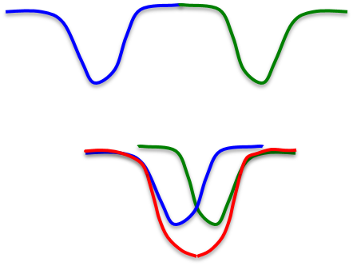

# Hopfield Nets and Boltzmann Machines

## 11.1 Hopfield Nets

### Lecture Notes

+ Hopfield Networks
  + energy-based model: properties deriva from a global energy function
  + combposed of binary threshold units w/ recurrent connections between them
  + recurrent network of non-linear units
    + generally very hard to analyze
    + behave in many different ways
      + settle to a stable state
      + oscillate
      + follow chaotic trajectories that cannot be predicted far into the future unless knowing the srating state w/ infinite precision
  + John Hopfield's proposal
    + J. J. Hopfield, "[Neural networks and physical systems with emergent collective computational abilities](https://www.pnas.org/content/pnas/79/8/2554.full.pdf)", Proceedings of the National Academy of Sciences of the USA, vol. 79 no. 8 pp. 2554–2558, April 1982
    + existing a global energy function w/ __symmetric__ connections
    + each binary "configuration" of the whole network w/ an energy
      + binary configuration: an assignment of binary values to each neuron in the network
      + each neuron w/ a particular binary value in a configuration
    + binary threshold decision rule causing the network to settle to a minimum of the energy function

+ The energy function
  + global energy: the sum of many local contributions
  + the main contributions: the form of the product of one connection weight w/ the binary of two neurons

    \[ E = - \sum_i s_i \cdot b_i - \sum_{i < j} s_i s_j \cdot w_{ij} \]

    + energy is bad $\implies$ low energy is good $\imples$ minus sign (-) for the equation
    + $w_{ij}$: weight for the symmetric connection strength btw two neurons
    + $s_i s_j$: the activities of the two connected neurons
    + $s_i$: binary variable w/ values of $1$ or $0$ or in another kind of Hopfield net w/ values of $1$ or $-1$
    $s_i b_i$: bias term involves the state of individual units

  + simple _quadratic_ energy function makes it possible for each unit to compute locally how it's state affects the global energy:

    \[ \text{Energy gap} = \Delta E_i = E(s_i = 0) - E(s_i = 1) = b_i + \sum_j s_j \cdot w_{ij} \]

    + the energy gap for unit $i$ = difference of in the global energy of the whole configuration depending on whether or not $i$ is on
    + $E(s_i = 0) - E(s_i = 1)$: the difference btw the energy when $i$ is off and the energy when $i$ is on; computed by the binary threshold decision rule

+ Settling to an energy minimum
  + finding the minimum energy
    + start from a random state
    + then update units _one at a time_ in random order $\implies$ sequential update
    + update each unit to whichever of its two states gives the lowest global energy independent of what state it was previously
    + i.e., use binary threshold units
  + commputing the goodness: all pairs of units w/ on and add in the weight between them
  + example:
    + start w/ random global state (carefully selected random state for demo) $\to$ goodness as $-E = 3$
    + 1st fig: randomly pick a unit (top right cornere one)
      + input: $1 \time -4 + 0 \times 3 + 0 \times 3 = -4$
      + unit state: $-4 < 0 \to 0 \implies$ state off
    + 2nd fig: randomly pick a unit except for computed one (bottom left corner one)
      + input: $1 \times 3 + 0 \time (-1) = 3$
      + unit state: $3 > 0 \to 1 \implies$ state on
    + 3rd fig: randomly pick a unit except for computed ones (botton middle one)
      + input: $1 \times 2 + 1 \times (-1) + 0 \time 3 + 0 \time (-1) = 1$
      + unit state: $1 > 0 \to 0 \implies$ turn on
      + goodness: $-E = 3 + 2 -1 = 4$
    + probing any of the units: no state changed $\implies$ settle to minimum
    + 4th fig: the deepest energy minimum
      + 3rd fig is one of the two minima of the net
      + 4th fig shows the deepest energy minimum
      + when the other triangle of units supports each orther is on
      + goodness: $-E = 3 + 3 -1 = 5$+ two triangles in the net (4th fig)
      + two triangles:
        the three units mostly support each other although a little bit disagreement at the bottom
        + each triangle mostly hates the other triangle via connection on top
      + the triangle on the left differs from one on the right by having a wight of two where the other one has a weight of 3 $\implies$ the triangle on the right will provide the deepest minimum

  

    
  

+ Sequential decisions
  + if units make __simultaneous__ decisions the energy could go up
  + simultaneous parallel updating $\implies$ getting oscillations
    + they always have a period of 2
  + the updates occur in parallel but w/ random timing $\implies$ the oscillations usually destroyed
    + not waiting for one update to communicate the state to everybody before considering another update
    + but waiting for random length of time between doing updates of a given unit
    + the random timing will often destory these bi-phasic oscillations
    + the updates have to be sequential, not as bad as it seems from a biological perspective (?)
  + example:
    + a network w/ units have biases at +5 and weight between them of -100
    + start w/ both states are off
    + at the next parallel step, both units will turn on $\impliedby$ assume to improve via the bias term but worse due to -100
    + w/ high energy, both turn off again

    

      
    

+ Neat way to compute sequential decisions
  + Hopfield proposal
    + memories could be energy minima of a neural net w/ symmetric weights
    + binary threshold decision rule used to "clean up" incomplete or corrupted memories
      + clean up partial memory into full memory
      + fill out out the memory caused by corrupted memory due to wrong computation or undecided
  + Principles of Literary Criticism
    + I. A. Richards (1924) proposal [wikipedia](https://en.wikipedia.org/wiki/I._A._Richards)
    + idea of memories as energy minima
    + memories are like a large crystal that can sit on different phases
  + energy minima
    + represent memories w/ a content-addressable memory
    + access an item by just knowing part of its content
      + set the states of some neurons in the net
      + randonly put the other neurons in random states
      + apply the binary threshold rule w/ a bit of luck
      + fill up that memory to be some stored item you know about
    + biological property: robust against hardware damage
    + psychological point of view: like reconstructing a dinosaur from a few bones
      + knowing something about how the bones are meant to fit together
      + the weight in the net provides infomation about how states of neurons fit together
      + given the states of a few neurons $\immplies$ fill out the whole state to recover a whole memory

+ Storing memories in a Hopefield net
  + with activities of $1$ and $-1$
    + stored as a binary state vector by incrementing the weight btw any two units by the product of their activities
    + treating biases as weights from a permanently on unit
    + very simple rule: not error-driven
      + just go through data once and done
      + a genuine ionline rule
      + not predicting what the right answer is and then making small adjustments
    + both its strength and its weakness
      + not error correction rule
      + able to be online but not a very efficient way to store things

    \[ \Delta_{ij} = s_i \cdot s_j \]

  + with state of $0$ and $1$, the rule is slightly more complicated

    \[ \Delta w_{ij} = 4 (s_i - \frac{1}{2}) (s_j - \frac{1}{2}) \]

### Lecture Video

<video src="https://youtu.be/DS6k0PhBjpI?list=PLoRl3Ht4JOcdU872GhiYWf6jwrk_SNhz9" preload="none" loop="loop" controls="controls" style="margin-left: 2em;" muted="" poster="http://www.multipelife.com/wp-content/uploads/2016/08/video-converter-software.png" width=180>
  <track src="subtitle" kind="captions" srclang="en" label="English" default>
  Your browser does not support the HTML5 video element.
</video> 

## 11.2 Dealing with spurious minima in Hopfield nets

### Lecture Notes

+ Storage capacity
  + Hopfield nets w/ memory storage devices
  + obsessed by the storage capacity of the Hopfield net
  + the capacity of a totally connected net w/ $N$ units by Hopfield storage rule
    + only about $0.15N$ memories
      + before memories start getting confused w/ one another
      + the number to store and retrive memories sensibly
    + only $0.15N^2$ bits at $N$ bits per memory
      + each memory randomly configure the $N$ units
      + $N$ bits information in it
    + not making efficient use of the bits required to store the weights
      + how many bits the computer used to store the weight?
      + using well over $0.15N^2$ bits to store the weihts
      + local distributed memory in local energy minima is making efficient use of the bits in the computer
      + able to analyze how many bits in the computer to make efficient use of the bits $\to N^2$
  + the net w/ $N^2$ weights and biases
  + after storing $M$ memories, the integer value range of each connection weight is $[-M, M]$
    + assume that states are $-1$ and $1$
    + increase or decrease by one each time when storing a memory
    + not all values are equal-probable
  + number of bits to store the weights and biases:

    \[ N^2 \log(2M+1) \]

    + compress the information and ignore the number of bits taken to store a connection weight in the naive way
    + total number of bits of computer memory used is the order of $N^2 \log(2M+1)$
    + the scales logarithmically with $M$ and storing things as Hopfield suggested $\to$ getting constant $0.15$

+ Spurious minima limit capacity
  + create a new energy minimum for each configuration memorizing (top fig)
    + state space for all the states of the net depicted horizontally
    + the energy depicted vertically
    + one energy minimum for the blue pattern
    + another energy minimum for the green pattern
  + limitation of the capacity of Hopfield net (bottom fig)
    + two nearby patterns $\implies$ unable to separate two minimum
    + merging to create one minimum at an intermediate location
    + unable to distinguish these two separate memories
  + diagrams mis-interpresent Hopfield nets
    + state space: the corners of a hypercube
    + unable to show the corners of a hypercub w/ a 1-D continuous space 

    

      
    

+ Avoiding spurious minima
  + unlearing
    + J. Hopfield, D. Feinstein and R. Palmer, [‘Unlearning’ has a stabilizing effect in collective memories](https://www.researchgate.net/profile/John_Hopfield/publication/16333131_'Unlearning'_has_a_stabilizing_effect_in_collective_memories/links/563fef2f08aec6f17ddb84cc/Unlearning-has-a-stabilizing-effect-in-collective-memories.pdf), Nature 304(5922):158-9 · July 1983
    + strategy
      + let the net settle from a random initial state and then do __unlearning__
        + whatever binary state it settles, apply the opposite of the storage rule
        + example w/ the previous figs
          + the red merged minimum if the net settle there and did some unlearning on that merge minimum
          + get back to two separate minima becaus of pulling up the red point
      + get ride of deep, spurious minima and increase memory capacity
    + shown that the strategy works but no good analysis to explain
  + analogy w/ F. Crick and G. Mitchison
    + [reorganisational theory of dreaming - Reverse Learning](https://en.wikipedia.org/wiki/Reverse_learning)
    + F. Crick: one the discovers of the structure of DNA
    + a model of what dreams are for
      + during REM sleep that is rapid eye movement sleep
      + during day people store lots of things and get spurious minima
      + at night put the network in a random state and settle to a minimum $\implies$ unlearn what settled to
      + at night people dream for several hours, those dreams are gone when wake up in the morning
      + the dreams are not quite all gone
      + the dream just before wake up will get into short-term memory
      + once people think of it, it will remembered for a long time
      + all dreaming is paradoxical because the state of people's brain look extremely like the state of brain when awake
      + except that it isn't being driven by real input but friven by a relay station just after the real input, called the thalamus
      + the theory explains functionally what the point of dreams is to get rid of those spurious minima
    + that's what why you don't remember them
  + how much unlearning should apply?
    + unlearning as part of the process of fitting a model to data
    + apply maximum likelihood fitting of the model
    + unlearning automatically come out of fitting the model
    + knowing how much unlearning to do
  + derive unlearning as the right way to minimize some cost function
    + the cost function is how well the neural net models the data people saw dueing the day

+ Increasing the cpacity
  + physics:
    + the math already known might explain how the brain works
    + many papers published in physics journals
    + related to Hopfield nets and their storage capacity
  + Elizabeth Gardiner proposal
    + using the full capacity of the weights
    + a much better storage rule
  + updating the memories
    + cycle through the training set many times than storing vectors in on shot
      + loose the nice online property
      + gain more efficient storage
    + using the perceptron convergence procedure
      + to train each unit to have the correct state given the states of all the other units in that global vector that would like to store
      + take the net and put into the memory state willing to store
      + take each unit separately and judge that the unit adopt to the state you want for it given the states of all the other units
        + yes: leave its incoming weight alone
        + no: change its incoming weights in the way specified by the perceptron convergence procedure (integer changes to the weights)
      + process several times
      + too many memories $\implies$ diverge
      + only converge w/ perceptron convergence procedure settled a set of weights to solve the problem
  + statistics: pseudo-likelihood
    + get one thing right given all the other things
    + w/ high dimensional data, trying to get the value on 1-dim right given the values on all the other dimensions
    + main difference btw perceptron convergence procedure: 
      + in the Hopfield net the weights are symmetric
      + two sets of gradients for each weight and average them
  + the way to use the full capacity of Hopfield net
    + to use the perceptron convergence procedure
    + go through the data several times

### Lecture Video

<video src="https://youtu.be/GgLNhHQ4ACY?list=PLoRl3Ht4JOcdU872GhiYWf6jwrk_SNhz9" preload="none" loop="loop" controls="controls" style="margin-left: 2em;" muted="" poster="http://www.multipelife.com/wp-content/uploads/2016/08/video-converter-software.png" width=180>
  <track src="subtitle" kind="captions" srclang="en" label="English" default>
  Your browser does not support the HTML5 video element.
</video> 

## 11.3 Hopfields Nets with hidden units

### Lecture Notes

### Lecture Video

<video src="url" preload="none" loop="loop" controls="controls" style="margin-left: 2em;" muted="" poster="http://www.multipelife.com/wp-content/uploads/2016/08/video-converter-software.png" width=180>
  <track src="subtitle" kind="captions" srclang="en" label="English" default>
  Your browser does not support the HTML5 video element.
</video> 

## 11.4 Using stochastic units to improve search

### Lecture Notes

### Lecture Video

<video src="url" preload="none" loop="loop" controls="controls" style="margin-left: 2em;" muted="" poster="http://www.multipelife.com/wp-content/uploads/2016/08/video-converter-software.png" width=180>
  <track src="subtitle" kind="captions" srclang="en" label="English" default>
  Your browser does not support the HTML5 video element.
</video> 

## 11.5 How a Boltzmann machine models data

### Lecture Notes

### Lecture Video

<video src="url" preload="none" loop="loop" controls="controls" style="margin-left: 2em;" muted="" poster="http://www.multipelife.com/wp-content/uploads/2016/08/video-converter-software.png" width=180>
  <track src="subtitle" kind="captions" srclang="en" label="English" default>
  Your browser does not support the HTML5 video element.
</video> 

