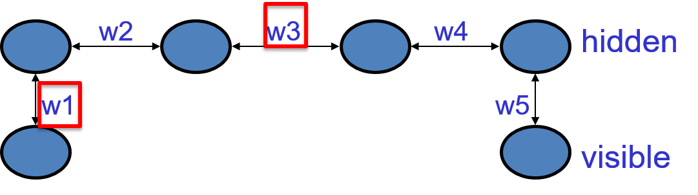
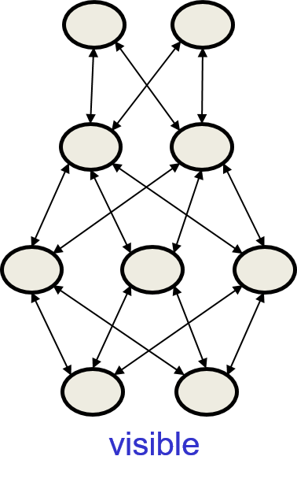
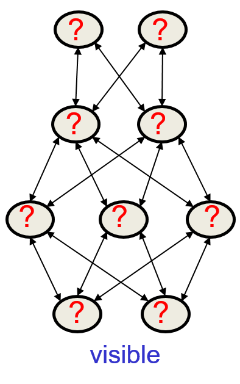
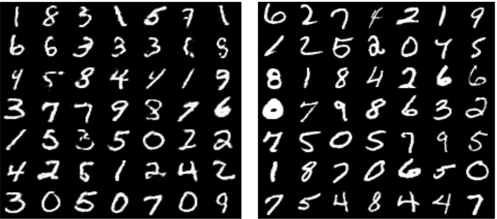
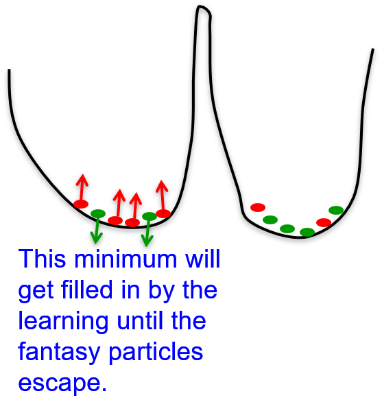
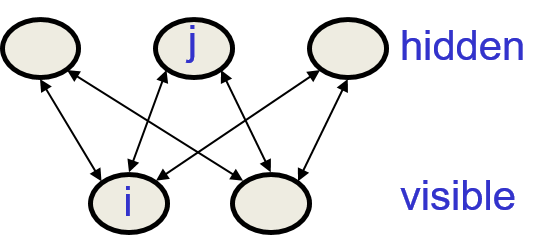
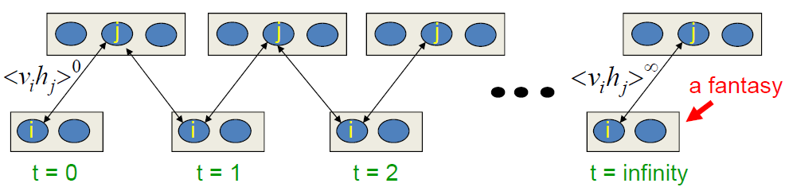
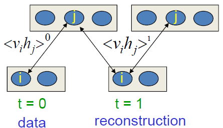
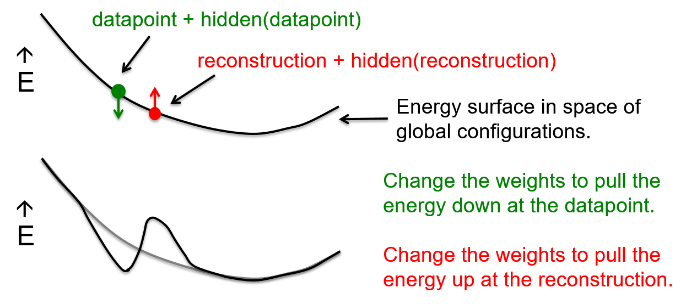

# 12. Restricted Boltzmann Machine (RBMs)

## 12.1 The Boltzmann machine learning algorithm

### Lecture Notes

+ Boltzmann machine learning algorithm
  + an unsupervised learning algorithm
  + no backpropagation required

+ Goal of learning
  + maxizing the product of the probabilities that the Boltzmann machine assigns to a set of binary vectors in the training set
  + equivalent to maxizing the sum of the log probabilities that the Boltzmann machine assigns to the training vectors
  + equivalent to maximizing the probability to obtain exactly the $N$ training cases if
    + settle the network to its stationary $N$ different times w/o external input
    + sample the visible vector once each time
    + repeat the previous two steps

+ Issue for learning
  + consider a chain of hidden units w/ visible units at the ends (see diagram)
  + Goal: the training set consisting of $(1, 0)$ and $(0, 1)$; i.e., two visible units to be in opposite states
  + Solution: by making the product of all the weights to be negative
    + all weights positive:
      + turning on $w1$ will tend to turn on the first hidden unit
      + then tend to turn on the 2nd unit, and so on
      + the 4th unit tends to turn oon the other visible unit
    + negative weight: get anti-correlation between the two visible units
  + knowing $w3 \to$ change $w1$ or $w5$
    + to learn $w1 \to$ required to know other weights
    + to change weight $w1 \to$ knowing information about $w3$
    + $w3 < 0$: action on $w1$ is the opposite of what we are doing w/ $w1$ if $w3 >0$

  

    
  

+ Surprising fact
  + one weight needs to know about other weights in order to be able to change even in the right direction
  + the learning algorithm only requires local information
  + everything that one weight needs to know about the other weights
  + the data contained in the difference of two correlations
  + derivatives of log probability of a visible vector

    \[ \frac{\partial \log p(\mathbf{v})}{\partial w_{ij}} = \langle s_i s_j \rangle_{\mathbf{v}} - \langle s_i s_j \rangle_{model} \]

    + the probability of Boltzmann machine assigns to a visible vector $\mathbf{v}$
    + $\frac{\partial \log p(\mathbf{v})}{\partial w_{ij}}$: derivative of log probability of one training vector, $v$ under the model
    + $\langle s_i s_j \rangle_{\mathbf{v}}$: expected value of product of states at thermal equilibrium when $v$ is clamped on the visible units
      + how often unit i$i$ and unit $j$ on together when $\mathbf{v} clamped in the visible units
      + the network at thermal equilibrium
    + $\langle s_i s_j \rangle_{model}$: expected value of product of states at thermal equilibrium w/o clamping
  + changing weight

    \[ \Delta w_{ij} \propto \langle s_i s_j \rangle_{data} - \langle s_i s_j \rangle_{model} \]

    + $\langle s_i s_j \rangle_{data}$: 
      + changing in the weight proportional to the expected product of the activities averaged over all visible vectors in the training set (data)
      + raise the weights in proportion to the product of activities that units have when presenting data
      + simplest form of Bayesian learning rule
      + synapses in the brian might use a rule alike
      + the first term makes the synapse strengths keep getting stronger
      + the weight are all become very positive $\implies$ system blow up
      + similar to the storage term in Hopfield nets
    + $\langle s_i s_j \rangle_{model}$: the product of the same rwo activities when not clamped anything and the the network reaches thermal equilibrium w/o external interference
      + keep the changing weight under control w/ this term
      + reducing the weight in proportion to how often those two units are on together when sampling from the model distributions
      + similar to unlearning to get rid of spurious minima in Hopfield nets

+ Simple derivative
  + the probability of a global configuration at thermal equilibrium
    + exponential function of its energy ($e^{-E}$)
    + a linear function of the energy achieved by the log probability when settling to equilibrium
  + the energy: a linear function of the weights and states

    \[ - \frac{\partial E}{\partial w_{ij}} = s_i s_j \]
  
  + the process of settling to thermal equilibrium propagates information about the weight $\implies$ no backpropagation required
  + two stages required:
    + settle w/ the data
    + settle w/o data
  + the units deep in the network doing the same thing just w/ different boundary conditions
  + backpropagation: the forward pass and backward pass really rather different

+ Negative phases
  + similar to unlearning in Hopfield nets to get rid of spurious minima

  \[ p(\mathbf{v}) = \frac{\sum_{\mathbf{h}} w^{-E(\mathbf{v}, \mathbf{h})}}{\sum_{\mathbf{u}} \sum_{\mathbf{g}} e^{-E(\mathbf{u}, \mathbf{g})}} \]

  + $\sum_{\mathbf{h}} w^{-E(\mathbf{v}, \mathbf{h})}$:
    + the positive phase finds hidden configurations that work well w/ $v$ and lowers their energies
    + decreasing the energy terms in that sum of terms that already large
    + find these terms by settling to thermal equilibrium w/ vector $\mathbf{v}$ clamped
    + able to find an $\mathbf{h}$ w/ a nice low energy $\mathbf{v}$
    + sampled those vectors $\mathbf{h}$ then changing the weights to make that energy even lower
    + making the term bi
  + $\sum_{\mathbf{u}} \sum_{\mathbf{g}} e^{-E(\mathbf{u}, \mathbf{g})}$: the negative phase finds the joint configurations that are the best competitors and raises their energies
    + similar to the first term but for partition function
    + the normalizing term on the bottom line
    + finding the global configurations w/ combinations of visible and hidden states to have low energy
    + therefore, large contributions to the partition function
    + finding the global configurations raising their energy to contribute less
    + making the term small

+ Collecting statistics for learning
  + G. Hinton and T. Sejnowski, [Optimal perceptual inference](https://papers.cnl.salk.edu/PDFs/Optimal%20Perceptual%20Inference%201983-646.pdf), Proceedings of the IEEE conference on Computer Vision and Pattern Recognition
  + G. Hinton and T. Sejnowski, [Learning and relearning in Boltzmann machines](https://www.researchgate.net/profile/Terrence_Sejnowski/publication/242509302_Learning_and_relearning_in_Boltzmann_machines/links/54a4b00f0cf256bf8bb327cc/Learning-and-relearning-in-Boltzmann-machines.pdf), In Rumelhart, D. E. and McClelland, J. L., editors, Parallel Distributed Processing: Explorations in the Microstructure of Cognition. Volume 1: Foundations, MIT Press, Cambridge, MA., 1986
  + Positive phase
    + clamp a data vector on the visible units
    + set the hidden units to random binary states
    + update the hidden units one at a time until the network reaches thermal equilibrium at a temperature of 1
      + starting with high temperature
      + the reducing the temperature
    + sample $\langle s_i s_j \rangle$ for every connected pair of units
      + how often two units are on together
      + measuring the correlation btw unit $i$ and unit $j$ w/ that visible vector clamped
    + repeat for all data vectors in th training set and average
  + Negative phase
    + prevent from clamping a data vector on the visible units $\implies$ unlearning
    + set all the units to random binary states
    + update all he units one at a time until the network reaches thermal equilibrium at a temperature of 1
    + sample $\langle s_j s_j \rangle$ for every connected pair of units
    + repeat many times (how many?) and average to get good estimates
    + expect the energy landscape to have many different seperately minima w/ about the same energy
      + using Boltzmann machine to do things like model a set of images
      + reasonable images w/ about the same energy
      + unreasonable images w/ much higher energy
    + expect a small fraction of the spae to be these low energy states and a very large fraction of the space to be bad high energy states
    + multiple modes: unclear how many times to repeat the process to be able to sample those modes

### Lecture Video

<video src="https://youtu.be/MMBX--6_hA4?list=PLoRl3Ht4JOcdU872GhiYWf6jwrk_SNhz9" preload="none" loop="loop" controls="controls" style="margin-left: 2em;" muted="" poster="http://www.multipelife.com/wp-content/uploads/2016/08/video-converter-software.png" width=180>
  <track src="subtitle" kind="captions" srclang="en" label="English" default>
  Your browser does not support the HTML5 video element.
</video> 

## 12.2 More efficient ways to get the statistics

### Lecture Notes

+ Better way to collect statistics
  + initial w/ a random state
    + long time to reach thermal equilibrium
    + very hard to tell when reaching there
  + initial w/ the last state - warm start
    + remember the interpretation of the data vector in the hidden units
    + particle: stored sates of the interpretation of the data vector
  + Advantage of warm start
    + small changedon weights at some thermal equilibrium
    + only a few updates to get back to equilibrium
    + able to useparticles for both 
      + the positive phase for a clamp data factor
      + the negative phase w/o clamped

+ Radford Neal's method for collecting statistics
  + Positive phase
    + keep a set of "data-specific particles" per training case
    + each particle w/ a current value, ie., a configuration of the hidden units + which data vector goes with
    + sequentially update all the hidden units a few times in each particle w/ the relevant data vector clamped
    + connected pair of units: average the probability of the two units $s_i, s_j$ on over all the data-specific particles
  + Negative phase
    + keep a set of "fantasy particles"
    + each particle w/ a value that is a global configuration
    + sequentially update all the units in each fantasy particle a few times $\implies$ updating the visible units
    + connected pair of units: average $s_i s_j$ over all the fantasy particles
  + change in the weight

    \[ \Delta w_{ij} \propto \langle s_i s_j \rangle_{data} - \langle s_i s_j \rangle_{model} \]

  + mini-batches
    + not working well
    + by the time get back to the same data vector again, the weights will have been updated many times
    + the data-specific particle not anywhere near thermal equilibrium anymore $\implies$ the hiddent units not in thermal equilibrium w/ the visible units of the particle given the new weights
    + no idea how long to reach theremal equilibrium again
  + strong assumption about how people understand the world ( kind of epistemological assumption)
    + assume clamped data vector:
      + the set of good explannations (i.e., hidden unit states as interpretations of the data vector) is uni-modal
      + for sensory input there's one correct explannation and if there exists a good model of data $\implies$ one energy minimum for that data point
    + restricting learning model: one sensory input vector w/o multiple very different explannations
      + for a given data vector two very different explananions for that data vector
      + learning algorithm incapable of learning models in which a data vector has many very different explanantions
    + w/ this assumption able to use a very efficient method for approaching thermal equilibrium or an approximation thermal equilibrium w/ the data

+ Simple mean field approximation
  + right statistics $\implies$ updating the units stochastically and sequentially (Eq.(1))
    + the update rule is the probability of turning on unit $i$ w/ logistic function of the total input received from the other units and its bias
    + $s_j$: the state of another unit is a stochastic binary value
  + using probabilities instead of binary states and update the unit in parallel to accelerate (Eq.(2))
    + keep a real value in $[0, 1]$ as a probability
    + $p_i^{t+1}$: the output of the logistic function w/ input of bias and sum of the other probabilities at time $t$ times the weights
    + replacing the stochastic binary value by a real value probability
    + only correct w/ a linear function
    + not correct: putting probabilities instead of flucating binary values inside the nonlinear function
    + however, it works well
  + using damped mean field to avoid bi-phasic oscillations
    + bi-pgasic oscillations result in updating everything in parallel
    + damped mean field (Eq.(3)) resolves the oscillations

    \[\begin{align*} 
      prob(s_i) &= \sigma \left( b_i + \sum_j s_j w_{ij} \right)  \tag{1}\\
      p_i^{t+1} &= \sigma \left( b_i + \sum_j p_j^t w_{ij} \right) \tag{2}\\
        &= \lambda p_i^t + (1 - \lambda) \sigma \left( b_i + \sum_j p_j^t w_{ij} \right) \tag{3}
    \end{align*}\]

+ Efficient mini-batch learning procedure
  + G. Hinton, R. Salakhutdinov, [A Better Way to Pretrain Deep Boltzmann Machines](http://papers.nips.cc/paper/4610-a-better-way-to-pretrain-deep-boltzmann-machines.pdf), Advances in Neural Information Processing Systems 25 (NIPS 2012)
  + Positive phase
    + initialize all the hidden probabilities at $0.5$
    + clamp a data vector on the visible units
    + update all the hidden units in parallel until convergence (when probability stop changing) using mean field updates
    + after net converged, record $p_i p_j$ for every connected pair of units and average this over all data in the mini-batch
  + Negative phase
    + keep a set of "fantasy particles"
    + each particle w/ a value  that is a global configuration
    + sequentially update all the units in each fantasy particle a few times
    + connected pair of units: average $s_i s_j$ (stochastic binary values) over all the fantasy particles
  + the difference btw these averages:
    + the learning rule
    + change the weights by amount proportional to that difference

+ Parallel updates
  + general Boltzmann machine: the stochastic updates of units need to be sequential
  + Deep Boltzmann Machine (DBM) (left diagram)
    + special architecture: allowing alternative parallel updates for fantasy particles $\implies$ more efficient
    + no connections within a layer
    + no skip-layer connections
    + general Boltzmann machine w/ many missing connections
  + Update for states (right diagram)
    + update the states of the 1st hidden layer (top) and 3rd hidden layer (3 units) w/ current states of the visible units and 2nd hidden layer (2 units)
    + the update the states if the visible units in the 2nd hidden layer
    + repeat the previous two processes
    + update half of the states of all units in parallel

  

    
  

+ Example: modling MNIST digits w/ DBM
  + can a DBM learn a good model of the MNIST digits?
    + a DBM trained by using mean field for the positive phase and updating fantasy particles by alternating btw even layer and odd layer for negative phase
    + judgement: 
      + remove all the input and then generate samples from your model
      + run the Markov chain for a long time until it's burned in
      + look at the samples got
  + do samples from the model look like real data?
    + right figure: real data
    + left figure: data got from model
    + looks similar $\implies$ a good model

  

    
  

  + Issue
    + running model w/ 100 samples and the same 100 fantasy particles for every mini-batch
    + Able to estimate the "negative phase statistics" well w/ only 100 negative examples to characterize the whole space of possible configurations?
    + find all interesting problems the GLOBAL configuration space is highly multi-modal
    + how to find and represent all the modes w/ only 100 particles?

+ Effective mixing rate
  + learning
    + interact w/ the Markov chain used to gather the "negative statistics"; i.e., the data-independent statistics
      + the one used to update the fantasy particles
      + interact w/ it to make it have a much higher effective mixing rate
    + not able to analyze the learning by viewing it as an outer loop and the gathering of statistics as an inner loop
      + the learning is affecting how effective that inner loop is
  + fantasy particles outnumber the positive data
    + raising energy surface $\to$ an effect on the mixing rate of the Markov chain
    + the fantasies rush around hyperactively
    + moving around MUCH faster than the mixing rate of the Markov chain defined by the static current weights
  + Moving fantasy particles btw model's modes (see diagram)
    + more fantasy particles than data
      + energy surface raised until the fantasy particles escape
      + overcome energy barrier: too high for the Markovchain to jump in a reasonable time
      + left mode:
        + 4 fantasy particles and only 2 data points
        + the effect of learning: raise the energy there
        + energy barrier too high for Markov chain to cross $\implies$ low mixing rate
        + the learning actually spill those red particles out of that energy minimum by rasing the minimum
        + the fantasy particles escape and go off somewhere else to some other deep minimum
    + changing energy surface: mixing in addition to defining the model
      + energy surface represent the model
      + energy surface manipulated by the learning algorithm to make the Markov chain mix faster or rather have the affect of a faster mixing Markov chain
    + fantasy particles filled in a hole
      + rush off somewhere else to deal w/ the next problem
      + like investigative journalists

    

      
    

### Lecture Video

<video src="https://youtu.be/ltv1KjVLCdE?list=PLoRl3Ht4JOcdU872GhiYWf6jwrk_SNhz9" preload="none" loop="loop" controls="controls" style="margin-left: 2em;" muted="" poster="http://www.multipelife.com/wp-content/uploads/2016/08/video-converter-software.png" width=180>
  <track src="subtitle" kind="captions" srclang="en" label="English" default>
  Your browser does not support the HTML5 video element.
</video> 

## 12.3 Restricted Boltzmann machines

### Lecture Notes

+ Restricted Boltzmann Machines
  + restrict the connectivity to make inference and learning easier
    + only one layer of hidden units
    + no connections btw hidden units
    + typical architecture (see diagram)

      \[ p(h_j = 1) = \frac{1}{1 + e^{-(b_j + \sum_{i \in vis} v_i w_{ij})}} \]

    

      
    

  + take only one step to reach thermal equilibrium when the visible units are clamped
    + quickly get  the exactly value of:

      \[ \langle v_i h_j \rangle_{\mathbf{v}} \]

+ Persistent Contrastive Divergence (PDC)
  + T. Tieleman, [Training Restricted Boltzmann Machines using Approximations to the Likelihood Gradient](https://www.cs.toronto.edu/~tijmen/pcd/pcd.pdf), Machine Learning, Proceedings of the Twenty-Fifth International Conference (ICML 2008), Helsinki, Finland, June 5-9, 2008
  + an efficient mini-batch learning procedure for Restricted Boltzmann Machines
  + positive phase
    + clamp a data vector on the visible units
    + compute the exact value of $\langle v_i h_j \rangle$ for all pairs of a visible and a hidden unit
    + connected pair of units: average $\langle v_i h_j \rangle$ over all data in the mini-batch
  + negative phase:
    + keep a set of "fantasy particles"
    + each particle w/ a value that is a global configuration
    + update each fantasy particle a few times using alternating parallel updates
    + connected pair of units: average $\langle v_i h_j \rangle$ over all the fantasy particles
  + inefficient version of the Boltzmann machines learning algorithm for an RBM (left diagram)
    + start w/ a training vector on the visible units
    + then alternate btw updating all the hidden units in parallel and updatingall the visible units in parallel

      \[ \Delta w_{ij} = \varepsilon \left(\langle v-i h_j \rangle^0 - \langle v_i h_j \rangle^\infty \right) \]
  
  + contrastive divergence (right diagram)
    + surprising short-cut
    + start w/ a training vector on the visible units
    + update all the hidden units in parallel
    + update the all visible units in parallel to get a "reconstruction"
    + update the hidden units again
    + not following the gradient of the log likelihood, but working well

      \[ \Delta w_{ij} = \varepsilon \left(\langle v-i h_j \rangle^0 - \langle v_i h_j \rangle^1 \right) \]

  

    
  

+ Why contrastive divergence works?
  + initiate w/ data
    + the Markov chain wanders away from the data and towards things that it likes more
    + able to see what direction it is wandering in after only a few steps
  + lowering the probability of the configurations
    + achieved after one full step
    + raise the probability of the data
    + then stop wandering away
    + canceling out once the confabulations and the data have the same distribution
  + example

  

    
  

+ Limitation of contrastive divergence
  + regions of the data-space
    + the model likes but regions very far away from any data
    + low energy holes causing the normalization term to be big
    + unable to sense the low energy holes when using the short-cut
    + persistent particles: eventually fall into a hole
    + filling up the hole then moe on to another hole
  + compromise btw speed and correctness
    + start w/ small weights and use CD1
    + the weight $\uparrow \to$ Markov chain mixing more slowly $\to$ using CD3
    + the weight $\uparrow\uparrow \to$ using CD10
    + CDx: use x full steps to get the "negative data"

### Lecture Video

<video src="https://youtu.be/JvF3gninXi8?list=PLoRl3Ht4JOcdU872GhiYWf6jwrk_SNhz9" preload="none" loop="loop" controls="controls" style="margin-left: 2em;" muted="" poster="http://www.multipelife.com/wp-content/uploads/2016/08/video-converter-software.png" width=180>
  <track src="subtitle" kind="captions" srclang="en" label="English" default>
  Your browser does not support the HTML5 video element.
</video> 

## 12.4 An example of contrastive divergence learning

### Lecture Notes

### Lecture Video

<video src="url" preload="none" loop="loop" controls="controls" style="margin-left: 2em;" muted="" poster="http://www.multipelife.com/wp-content/uploads/2016/08/video-converter-software.png" width=180>
  <track src="subtitle" kind="captions" srclang="en" label="English" default>
  Your browser does not support the HTML5 video element.
</video> 

## 12.5 RBMs for collaborative filtering

### Lecture Notes

### Lecture Video

<video src="url" preload="none" loop="loop" controls="controls" style="margin-left: 2em;" muted="" poster="http://www.multipelife.com/wp-content/uploads/2016/08/video-converter-software.png" width=180>
  <track src="subtitle" kind="captions" srclang="en" label="English" default>
  Your browser does not support the HTML5 video element.
</video> 

