# 12. Restricted Boltzmann Machine (RBMs)

## 12.1 The Boltzmann machine learning algorithm

### Lecture Notes

+ Boltzmann machine learning algorithm
  + an unsupervised learning algorithm
  + no backpropagation required

+ Goal of learning
  + maxizing the product of the probabilities that the Boltzmann machine assigns to a set of binary vectors in the training set
  + equivalent to maxizing the sum of the log probabilities that the Boltzmann machine assigns to the training vectors
  + equivalent to maximizing the probabilities to obtain exactly the $N$ training cases if
    + settle the network to its stationary $N$ different times w/o external input
    + sample the visible vector once each time
    + repeat the process

+ Issue for learning
  + consider a chain of hidden units w/ visible units at the ends (see diagram)
  + Goal: the training set consisting of $(1, 0)$ and $(0, 1)$; i.e., two visible units to be in opposite states
  + Solution: by making the product of all the weights to be negative
    + all weights positive:
      + turning on $w1$ will tend to turn on the first hidden unit
      + then tend to turn on the 2nd unit, and so on
      + the 4th unit tends to turn on the other visible unit
    + negative weight: get anti-correlation between the two visible units
  + knowing $w3 \to$ change $w1$ or $w5$
    + to learn $w1 \to$ required to know other weights
    + to change weight $w1 \to$ knowing information about $w3$
    + $w3 < 0$: action on $w1$ is the opposite of what we are doing w/ $w1$ if $w3 >0$

  

    
  

+ Surprising fact
  + one weight needs to know about other weights in order to be able to change even in the right direction
  + the learning algorithm only requires local information
  + everything that one weight needs to know about the other weights
  + the data contained in the difference of two correlations
  + derivatives of log probability of a visible vector

    \[ \frac{\partial \log p(\mathbf{v})}{\partial w_{ij}} = \langle s_i s_j \rangle_{\mathbf{v}} - \langle s_i s_j \rangle_{model} \]

    + the probability of Boltzmann machine assigns to a visible vector $\mathbf{v}$
    + $\frac{\partial \log p(\mathbf{v})}{\partial w_{ij}}$: derivative of log probability of one training vector, $v$ under the model
    + $\langle s_i s_j \rangle_{\mathbf{v}}$: expected value of product of states at thermal equilibrium when $v$ is clamped on the visible units
      + how often unit $i$ and unit $j$ on together when $\mathbf{v}$ clamped in the visible units
      + the network at thermal equilibrium
    + $\langle s_i s_j \rangle_{model}$: expected value of product of states at thermal equilibrium w/o clamping
  + changing weight

    \[ \Delta w_{ij} \propto \langle s_i s_j \rangle_{data} - \langle s_i s_j \rangle_{model} \]

    + $\langle s_i s_j \rangle_{data}$: 
      + changing in the weight proportional to the expected product of the activities averaged over all visible vectors in the training set (data)
      + raise the weights in proportion to the product of activities that units have when presenting data
      + simplest form of Bayesian learning rule
      + synapses in the brian might use a rule alike
      + the first term makes the synapse strengths keep getting stronger
      + the weights are all become very positive $\implies$ system blows up
      + similar to the storage term in Hopfield nets
    + $\langle s_i s_j \rangle_{model}$:
      + the product of the same two activities when not clamped anything and the network reaches thermal equilibrium w/o external interference
      + keep the changing weight under control w/ this term
      + reducing the weight in proportion to how often those two units are on together when sampling from the model distributions
      + similar to unlearning to get rid of spurious minima in Hopfield nets

+ Simple derivative
  + the probability of a global configuration at thermal equilibrium
    + exponential function of its energy ($e^{-E}$)
    + a linear function of the energy achieved by the log probability when settling to equilibrium
  + the energy: a linear function of the weights and states

    \[ - \frac{\partial E}{\partial w_{ij}} = s_i s_j \]
  
  + the process of settling to thermal equilibrium propagates information about the weight $\implies$ no backpropagation required
  + two stages required:
    + settle w/ the data
    + settle w/o data
  + the units deep in the network doing the same thing just w/ different boundary conditions
  + backpropagation: the forward pass and backward pass really rather different

+ Phases of energy function
  + similar to unlearning in Hopfield nets to get rid of spurious minima

  \[ p(\mathbf{v}) = \frac{\sum_{\mathbf{h}} e^{-E(\mathbf{v}, \mathbf{h})}}{\sum_{\mathbf{u}} \sum_{\mathbf{g}} e^{-E(\mathbf{u}, \mathbf{g})}} \]

  + $\sum_{\mathbf{h}} e^{-E(\mathbf{v}, \mathbf{h})}$:
    + the positive phase finds hidden configurations that work well w/ $v$ and lowers their energies
    + decreasing the energy terms in that sum of terms that already large
    + find these terms by settling to thermal equilibrium w/ vector $\mathbf{v}$ clamped
    + able to find an $\mathbf{h}$ w/ a nice low energy $\mathbf{v}$
    + sampled those vectors $\mathbf{h}$ then changing the weights to make that energy even lower
    + making the term big
  + $\sum_{\mathbf{u}} \sum_{\mathbf{g}} e^{-E(\mathbf{u}, \mathbf{g})}$:
    + the negative phase finds the joint configurations that are the best competitors and raises their energies
    + similar to the first term but for partition function, the normalizing term on the bottom line
    + finding the global configurations w/ combinations of visible and hidden states to have low energy
    + therefore, large contributions to the partition function
    + finding the global configurations raising their energy to contribute less
    + making the term small

+ Collecting statistics for learning
  + G. Hinton and T. Sejnowski, [Optimal perceptual inference](https://papers.cnl.salk.edu/PDFs/Optimal%20Perceptual%20Inference%201983-646.pdf), Proceedings of the IEEE conference on Computer Vision and Pattern Recognition
  + G. Hinton and T. Sejnowski, [Learning and relearning in Boltzmann machines](https://www.researchgate.net/profile/Terrence_Sejnowski/publication/242509302_Learning_and_relearning_in_Boltzmann_machines/links/54a4b00f0cf256bf8bb327cc/Learning-and-relearning-in-Boltzmann-machines.pdf), In Rumelhart, D. E. and McClelland, J. L., editors, Parallel Distributed Processing: Explorations in the Microstructure of Cognition. Volume 1: Foundations, MIT Press, Cambridge, MA., 1986
  + Positive phase
    + clamp a data vector on the visible units
    + set the hidden units to random binary states
    + update the hidden units one at a time until the network reaches thermal equilibrium at a temperature of 1
      + starting with high temperature
      + then reducing the temperature
    + sample $\langle s_i s_j \rangle$ for every connected pair of units
      + how often two units are on together
      + measuring the correlation btw unit $i$ and unit $j$ w/ that visible vector clamped
    + repeat for all data vectors in the training set and then average hem
  + Negative phase
    + prevent from clamping a data vector on the visible units $\implies$ unlearning
    + set all the units to random binary states
    + update all the units one at a time until the network reaches thermal equilibrium at a temperature of 1
    + sample $\langle s_j s_j \rangle$ for every connected pair of units
    + repeat many times (how many?) and average to get good estimates
    + expect the energy landscape to have many different seperately minima w/ about the same energy
      + using Boltzmann machine to do things like model a set of images
      + reasonable images w/ about the same energy
      + unreasonable images w/ much higher energy
    + expect a small fraction of the space to be these low energy states and a very large fraction of the space to be bad high energy states
    + multiple modes: unclear how many times to repeat the process to be able to sample those modes

### Lecture Video

<!--
<video src="https://youtu.be/MMBX--6_hA4?list=PLoRl3Ht4JOcdU872GhiYWf6jwrk_SNhz9" preload="none" loop="loop" controls="controls" style="margin-left: 2em;" muted="" poster="http://www.multipelife.com/wp-content/uploads/2016/08/video-converter-software.png" width=180>
  <track src="subtitle" kind="captions" srclang="en" label="English" default>
  Your browser does not support the HTML5 video element.
</video> 
-->

 

## 12.2 More efficient ways to get the statistics

### Lecture Notes

+ Better way to collect statistics
  + initial w/ a random state
    + long time to reach thermal equilibrium
    + very hard to tell when reaching there
  + initial w/ the last state - warm start
    + remember the interpretation of the data vector in the hidden units
    + particle: stored states of the interpretation of the data vector
  + Advantage of warm start
    + small changed on weights at some thermal equilibrium
    + only a few updates to get back to equilibrium
    + able to use particles for both
      + the positive phase w/ clamped data
      + the negative phase w/o clamped data

+ Radford Neal's method for collecting statistics
  + Positive phase
    + keep a set of "data-specific particles" per training case
    + each particle w/ a current value, ie., a configuration of the hidden units which data vector goes with
    + sequentially update all the hidden units a few times in each particle w/ the relevant data vector clamped
    + connected pair of units: average the probability of the two units $s_i, s_j$ on over all the data-specific particles
  + Negative phase
    + keep a set of "fantasy particles"
    + each particle w/ a value that is a global configuration
    + sequentially update all the units in each fantasy particle a few times $\implies$ updating the visible units
    + connected pair of units: average $s_i s_j$ over all the fantasy particles
  + weight changing

    \[ \Delta w_{ij} \propto \langle s_i s_j \rangle_{data} - \langle s_i s_j \rangle_{model} \]

  + mini-batches
    + not working well
    + by the time get back to the same data vector again, the weights will have been updated many times
    + the data-specific particle not anywhere near thermal equilibrium anymore $\implies$ the hiddent units not in thermal equilibrium w/ the visible units of the particle given the new weights
    + no idea how long to reach theremal equilibrium again
  + strong assumption about how people understand the world ( kind of epistemological assumption)
    + assume clamped data vector:
      + the set of good explanations (i.e., hidden unit states as interpretations of the data vector): uni-modal
      + for sensory input there's one correct explannation and $\exists$ a good model of data $\implies$ one energy minimum for that data point
    + restricting learning model: one sensory input vector w/o multiple very different explannations
      + for a given data vector two very different explananions for that data vector
      + learning algorithm incapable of learning models in which a data vector has many very different explanantions
    + w/ this assumption able to use a very efficient method for approaching thermal equilibrium or an approximation thermal equilibrium w/ the data

+ Simple mean field approximation

  \[\begin{align*}
    prob(s_i) &= \sigma \left( b_i + \sum_j s_j w_{ij} \right)  \tag{1}\\
    p_i^{t+1} &= \sigma \left( b_i + \sum_j p_j^t w_{ij} \right) \tag{2}\\
      &= \lambda p_i^t + (1 - \lambda) \sigma \left( b_i + \sum_j p_j^t w_{ij} \right) \tag{3}
  \end{align*}\]

  + right statistics $\implies$ updating the units stochastically and sequentially (Eq.(1))
    + the update rule is the probability of turning on unit $i$ w/ logistic function of the total input received from the other units and its bias
    + $s_j$: the state of another unit is a stochastic binary value
  + using probabilities instead of binary states and update the unit in parallel to accelerate (Eq.(2))
    + keep a real value in $[0, 1]$ as a probability
    + $p_i^{t+1}$: the output of the logistic function w/ input of bias and sum of the other probabilities at time $t$ times the weights
    + replacing the stochastic binary value by a real value probability
    + only correct w/ a linear function
    + not correct: putting probabilities instead of fluctuating binary values inside the nonlinear function
    + however, it works well
  + using damped mean field to avoid bi-phasic oscillations
    + bi-phasic oscillations result in updating everything in parallel
    + damped mean field (Eq.(3)) resolves the oscillations

+ Efficient mini-batch learning procedure
  + G. Hinton, R. Salakhutdinov, [A Better Way to Pretrain Deep Boltzmann Machines](http://papers.nips.cc/paper/4610-a-better-way-to-pretrain-deep-boltzmann-machines.pdf), Advances in Neural Information Processing Systems 25 (NIPS 2012)
  + Positive phase
    + initialize all the hidden probabilities at $0.5$
    + clamp a data vector on the visible units
    + update all the hidden units in parallel until convergence (when probability stops changing) using mean field updates
    + after net converged, record $p_i p_j$ for every connected pair of units and average this over all data in the mini-batch
  + Negative phase
    + keep a set of "fantasy particles"
    + each particle w/ a value  that is a global configuration
    + sequentially update all the units in each fantasy particle a few times
    + connected pair of units: average $s_i s_j$ (stochastic binary values) over all the fantasy particles
  + the difference btw these averages:
    + the learning rule
    + change the weights by amount proportional to that difference

+ Parallel updates
  + general Boltzmann machine: the stochastic updates of units need to be sequential
  + Deep Boltzmann Machine (DBM) (left diagram)
    + special architecture: allowing alternative parallel updates for fantasy particles $\implies$ more efficient
    + no connections within a layer
    + no skip-layer connections
    + general Boltzmann machine w/ many missing connections
  + Update for states (right diagram)
    + update the states of the 1st hidden layer (top) and 3rd hidden layer (3 units) w/ current states of the visible units and 2nd hidden layer (2 units)
    + update the states if the visible units in the 2nd hidden layer
    + repeat the previous two processes
    + update half of the states of all units in parallel

  

    
  

+ Example: modeling MNIST digits w/ DBM
  + can a DBM learn a good model of the MNIST digits?
    + a DBM trained by using mean field for the positive phase and updating fantasy particles by alternating btw even layer and odd layer for negative phase
    + judgement:
      + remove all the input and then generate samples from your model
      + run the Markov chain for a long time until it's burned in
      + look at the samples got
  + do samples from the model look like real data?
    + right figure: real data
    + left figure: data got from model
    + looks similar $\implies$ a good model

  

    
  

  + Issue
    + running model w/ 100 samples and the same 100 fantasy particles for every mini-batch
    + Able to estimate the "negative phase statistics" well w/ only 100 negative examples to characterize the whole space of possible configurations?
    + find all interesting problems $\to$ the GLOBAL configuration space is highly multi-modal
    + how to find and represent all the modes w/ only 100 particles?

+ Effective mixing rate
  + learning
    + interact w/ the Markov chain used to gather the "negative statistics"; i.e., the data-independent statistics
      + the one used to update the fantasy particles
      + interact w/ it to make it have a much higher effective mixing rate
    + not able to analyze the learning by viewing it as an outer loop and the gathering of statistics as an inner loop
      + the learning is affecting how effective that inner loop is
  + fantasy particles outnumber the positive data
    + raising energy surface $\to$ an effect on the mixing rate of the Markov chain
    + the fantasies rush around hyperactively
    + moving around MUCH faster than the mixing rate of the Markov chain defined by the static current weights
  + Moving fantasy particles btw model's modes
    + more fantasy particles than data
      + energy surface raised until the fantasy particles escape
      + overcome energy barrier: too high for the Markov chain to jump in a reasonable time
      + left mode (see diagram)
        + 4 fantasy particles and only 2 data points
        + the effect of learning: raise the energy there (red dots)
        + energy barrier too high for Markov chain to cross $\implies$ low mixing rate
        + the learning actually spill those red particles out of that energy minimum by rasing the minimum
        + the fantasy particles escape and go off somewhere else to some other deep minimum
    + changing energy surface: mixing in addition to defining the model
      + energy surface represent the model
      + energy surface manipulated by the learning algorithm to make the Markov chain mix faster or rather have the affect of a faster mixing Markov chain
    + fantasy particles filled in a hole
      + rush off somewhere else to deal w/ the next problem
      + like investigative journalists

    

      
    

### Lecture Video

<!--
<video src="https://youtu.be/ltv1KjVLCdE?list=PLoRl3Ht4JOcdU872GhiYWf6jwrk_SNhz9" preload="none" loop="loop" controls="controls" style="margin-left: 2em;" muted="" poster="http://www.multipelife.com/wp-content/uploads/2016/08/video-converter-software.png" width=180>
  <track src="subtitle" kind="captions" srclang="en" label="English" default>
  Your browser does not support the HTML5 video element.
</video> 
-->

 

## 12.3 Restricted Boltzmann machines

### Lecture Notes

+ Restricted Boltzmann Machines
  + restrict the connectivity to make inference and learning easier
    + only one layer of hidden units
    + no connections btw hidden units
  + typical architecture (see diagram)
    + a bipartite graph
    + no connection btw units on the same layer

    

      
    

  + advantage
    + reach thermal equilibrium in one step when the visible units are clamped to a data
    + quickly get the expected value of $\langle v_i h_j \rangle_{\mathbf{v}}$
      + compute the exact probability w/ which unit $j$ turns on
      + independent of all other hidden units in the hidden layer
  + the probability of unit $j$ will turn on:
    + a logistic function w/ input from visible units
    + quite independent of what other hidden units doing
    + compute the probabilities all in parallel

    \[ p(h_j = 1) = \frac{1}{1 + e^{-(b_j + \sum_{i \in vis} v_i w_{ij})}} \]

+ Persistent Contrastive Divergence (PCD)
  + T. Tieleman, [Training Restricted Boltzmann Machines using Approximations to the Likelihood Gradient](https://www.cs.toronto.edu/~tijmen/pcd/pcd.pdf), Machine Learning, Proceedings of the Twenty-Fifth International Conference (ICML 2008), Helsinki, Finland, June 5-9, 2008
  + an efficient mini-batch learning procedure for Restricted Boltzmann Machines
  + positive phase
    + clamp a data vector on the visible units
    + compute the exact value of $\langle v_i h_j \rangle$ for all pairs of a visible and a hidden unit $\impliedby v_i$  fixed
    + connected pair of units: average $\langle v_i h_j \rangle$ over all data in the mini-batch
  + negative phase:
    + keep a set of "fantasy particles"
    + each particle w/ a value that is a global configuration
    + update each fantasy particle a few times using alternating parallel updates $\implies$ bring back to close to equilibrium
    + connected pair of units: average $\langle v_i h_j \rangle$ over all the fantasy particles
  + advantage:
    + work well
    + allow RBM to build good density models of sets of binary vectors
  + inefficient version of the Boltzmann machines learning algorithm for an RBM (left diagram)
    + times ($t$) not about weight updates but to note steps in a Markov chain
    + process:
      + $t=0$:
        + start w/ a training vector on the visible units
        + the visible vector $\to$ update the hidden units
        + choose binary states for the hidden units
        + measure the expected value of $v_i h_j$ for all pairs of visible binary units connected
        + $\langle v_i h_j \rangle^0$: measurement at $t=0$ w/ the hidden units being determined by the visible units
        + update all hidden units in parallel
      + $t=1$
        + using the hidden vector to update all the visible units in parallel
        + update all the hiddent units in parallel
        + reconstruction or one-step reconstruction: the visible vector at $t=1$
      + then alternate btw updating all the hidden units in parallel and updatingall the visible units in parallel
        + repeat the process for long time
        + system reaching thermal equilibrium at $t=\infty$
      + measure the correlation of $v_i$ and $h_j$: as $\langle v_i h_j \rangle^\infty$
        + fantasy: a visible state at $t=\infty$
  + the learning rule w/ weight updating

    \[ \Delta w_{ij} = \varepsilon \left(\langle v_i h_j \rangle^0 - \langle v_i h_j \rangle^\infty \right) \]

    + $\varepsilon$: the learning rate
  + disadvantage: running algorithm for a long time to reach thermal equilibrium $\to$ misleading w/ $t=\infty$

  

    
  

+ Contrastive divergence (right diagram)
  + not good at building density models but much faster
  + surprising short-cut
  + start w/ a training vector on the visible units
  + update all the hidden units in parallel
  + update all visible units in parallel to get a "reconstruction"
  + update the hidden units again
  + measure statistics after doing one full update of the Markov chain
  + not following the gradient of the log likelihood, but working well

    \[ \Delta w_{ij} = \varepsilon \left(\langle v_i h_j \rangle^0 - \langle v_i h_j \rangle^1 \right) \]

  

    
  

+ Why contrastive divergence works?
  + initiate w/ data
    + the Markov chain wanders away from the data and towards initial weights (the equilibrium distribution)
    + able to see what direction it is wandering in after only a few steps
      + initial weight not good $\to$ waste time to go all the way to equilibrium
      + knowing how to change them to stop it wandering away from the data w/o reaching the equilibrium
  + lowering the probability of the reconstruction (or configurations in psychology)
    + achieved after one full step
    + raise the probability of the data
    + then stop wandering away
    + cancelling out once the configurations and the data have the same distribution

+ Example of Contrastive Divergence
  + energy surface in space of global configuration (top diagram)
  + datapoint: both the visible vector and the particular hidden vector
  + particular hidden vector got by stochastic updating the hidden units
  + hidden vector: a function of what the data point is
  + start w/ the data point
  + run the Markov chain for one full step to get a new visible vector and the hidden vector that goes with it
  + a reconstruction of the data point plus the hidden vector that goes with that reconstruction
  + then change the weights to pull the energy down at the datapoint and to pull the energy up of the reconstruction
  + the changes will make the surface as shown in the bottom diagram
  + at the data: beginning to construct an energy minimum
  + away from data: stay what it was

  

    
  

+ Limitation and Practice of contrastive divergence
  + reconstruction fails for places away from the data
  + regions of the data-space
    + the model likes but regions very far away from any data
    + low energy holes causing the normalization term to be big
    + unable to sense the low energy holes when using the short-cut
    + persistent particles: eventually fall into a hole
    + filling up the hole then move on to another hole
  + compromise btw speed and correctness
    + start w/ small weights and use CD1
    + the weight $\uparrow \to$ Markov chain mixing more slowly $\to$ using CD3
    + the weight $\uparrow\uparrow \to$ using CDx, where x = 5 or 9 or 10
    + CD$x$: use $x$ full steps to get the "negative data"

### Lecture Video

<!--
<video src="https://youtu.be/JvF3gninXi8?list=PLoRl3Ht4JOcdU872GhiYWf6jwrk_SNhz9" preload="none" loop="loop" controls="controls" style="margin-left: 2em;" muted="" poster="http://www.multipelife.com/wp-content/uploads/2016/08/video-converter-software.png" width=180>
  <track src="subtitle" kind="captions" srclang="en" label="English" default>
  Your browser does not support the HTML5 video element.
</video> 
-->

 

## 12.4 An example of contrastive divergence learning

### Lecture Notes

+ Learn features of images of the digit 2
  + RBM learning a model of images of handwritten 2s
    + all digit classes w/ considerably larger weight, wide variety of features btw them $\to$ good at reconstructing all the different classes of digits
    + a good model for digit classes: 
      + binary vector of handwitten digit images able to find low energy states compitable w/ that image
      + unable to find low energy w/ binary vector away from the target image
  + learning a set of features good for reconstructing images (architecture: top diagram)
    + learn to become interesting feature detectors
    + image of 16 pixels by 16 pixels (bottom left box) and 50 binary hidden units (top left box)
    + using the weights and connections from pixels to feature detectors to activate the feature detectors (green arrow line)
    + each binary neuron makes a stochastic decision about whether state 0 or 1
    + the use the binary patterns of activation to reconstruct the data (blue arrow line)
    + feed pixel to make a binary decision about state 0 or 1
    + then reactivate the binary feature detectors using the reconstruction to activate rather than the data (the red arrow line)
    + the weight changed by incrementing the weights between an active pixel and an active feature detector (green line)
    + when the network is looking at data, low energy of the global configuration of the data and whatever hidden pattern w/ it
    + decrementing the weight btw an active pixel and an active detector when reconstructing and raising the energy of the reconstruction
    + near the beginning of the learning, weights are random
    + the reconstruction will almost certainly have lower energy than the data
    + the reconstruction is what the network likes to reproduce on the visible units given the hidden pattern of activity
    + the model likes to reproduce patterns w/ low energy according to the energy function
    + learning to change the weights $\to$ data w/ low energy
    + reconstructions of the data are generally higher energy
  + the weights of the 50 feature detectors
    + start w/ small random weights to break symmetry (fig.a)
      + each square shows the weights to the pixels coming from a particular feature detector
      + using small random weights to break symmetry
      + small random weight not necessary due to stochastic process
    + progress on learning (fig. b - fig. i)
      + after seen hundreds of digits and adjusting the weights a few times $\to$ the weight beginning to form patterns
      + repeat the process, many features detectors are detecting the pattern $\to$ global feature detectors
      + the feature detectors getting stronger and some of them begin to localize and they are getting more local
    + the final 50 x 256 weights: each neuron grabs a different feature (fig. j)
      + each neuron becomes a different feature detector
      + most of the feature detectors are fairly local
      + red box feature: detecting the top of a 2

  

    <a href="http://www.cs.toronto.edu/~hinton/coursera/lecture12/lec12.pptx" ismap target="_blank">
      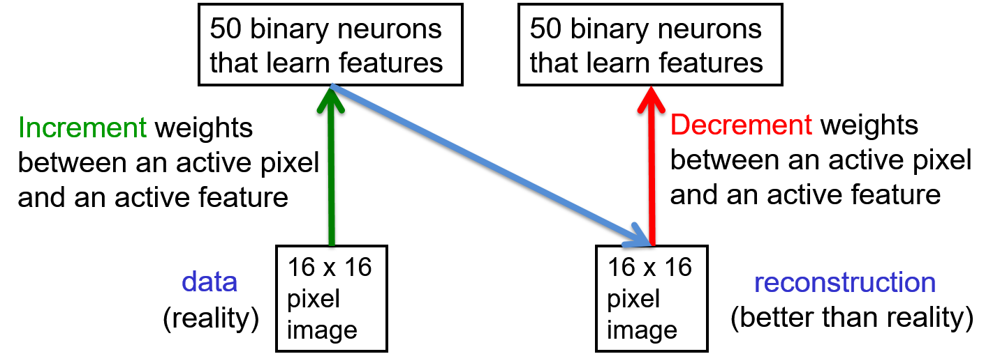
    </a>
    <a href="http://www.cs.toronto.edu/~hinton/coursera/lecture12/lec12.pptx" ismap target="_blank">
      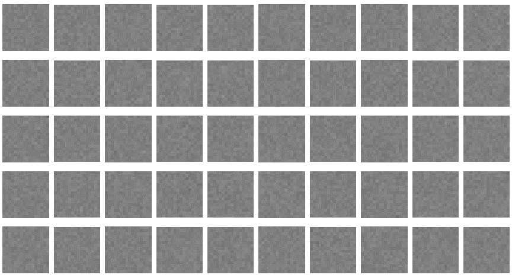
      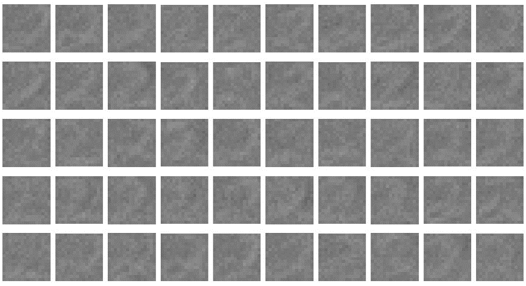
      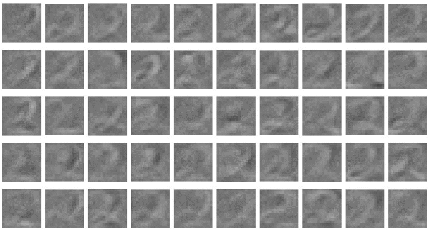
    </a>
    <a href="http://www.cs.toronto.edu/~hinton/coursera/lecture12/lec12.pptx" ismap target="_blank">
      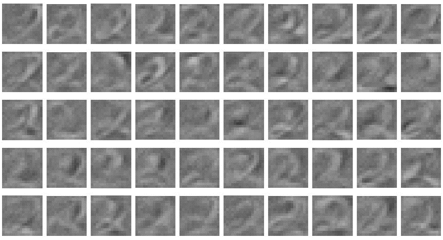
      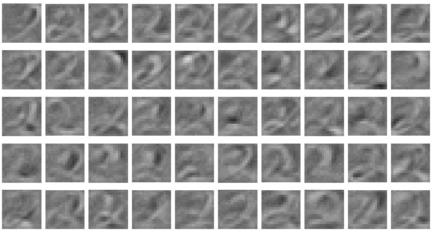
      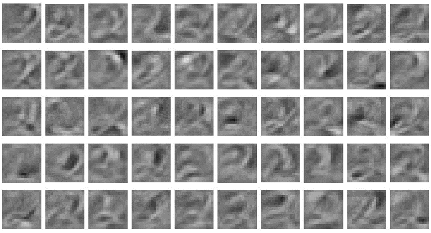
    </a>
    <a href="http://www.cs.toronto.edu/~hinton/coursera/lecture12/lec12.pptx" ismap target="_blank">
      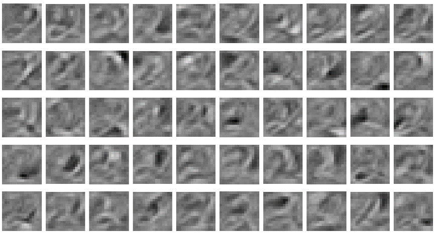
      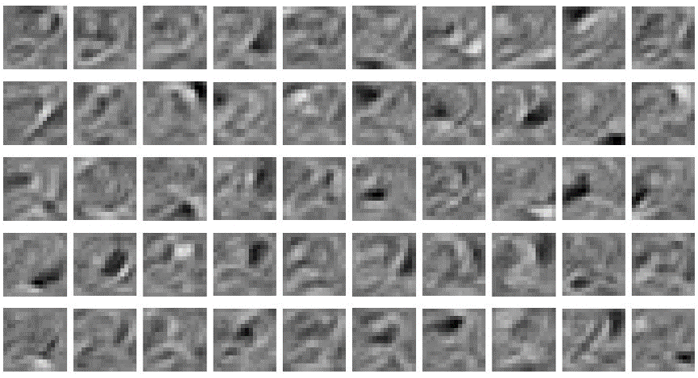
      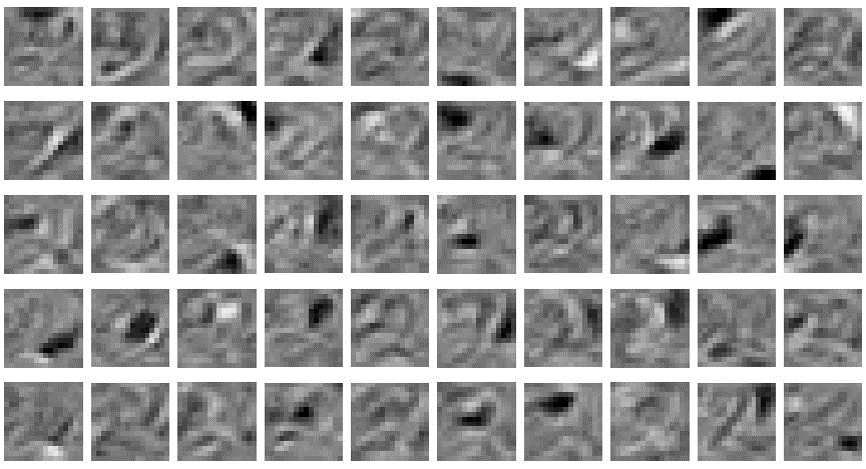
    </a>
    <a href="http://www.cs.toronto.edu/~hinton/coursera/lecture12/lec12.pptx" ismap target="_blank">
      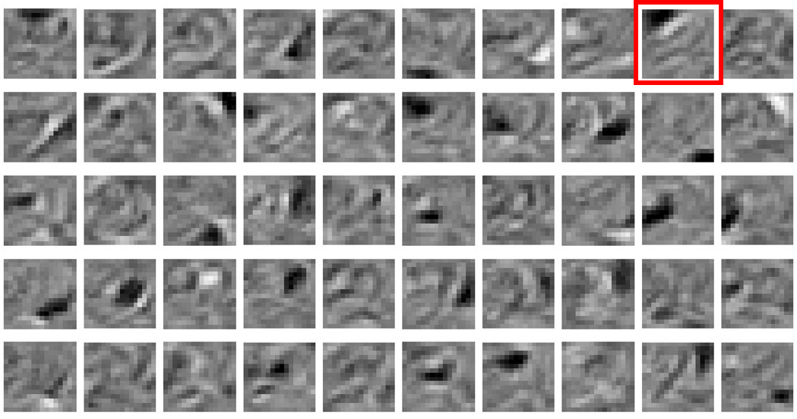
    </a>
  

+ Measurement for the reconstructing digit images
  + left diagram
    + test w/ an example of the 2
    + reconstruct w/ a pretty faithful to the test example but slightly blurry
    + a hook on the top of the test example but blur out in the reconstruction
  + middle diagram
    + test w/ an example of 3
    + reconstructs actually looks more like 2 than 3
    + all feature detectors learned are good for representing 2 but no feature dectors for things like presenting that cusp in the middle of 3
    + end up reconstructing something that obeys the regularities of a 2 than 3
  + right diagram
    + using 500 hidden units to model all 10 digit classes
    + the feature detectors learned in the first hidden layer
    + train for a long time w/ contrastive divergence
    + a big variety of feature detectors
      + blue box: useful for detecting 8s
      + red box: curious kind of feature; 
        + pixels on very near bottom $\to$ data was normalized
        + digits unable to have a height of greater than 20 pixels
        + impossible to have a pixel on where those big positive weights are
        + picking up on a long-range regularity introduced by normalizating the data
      + green box:
        + detect where the bottom of a vertical stroke comes
        + detect it in a number of different positions
        + refuse to detect it in the intermediate positions
        + very like one of the least significant digits in a binary number as you increase the magnitude of the number goes on and off repeatedly
        + it shows this is developing quite complex ways of representing where things are

  

    <a href="http://www.cs.toronto.edu/~hinton/coursera/lecture12/lec12.pptx" ismap target="_blank">
      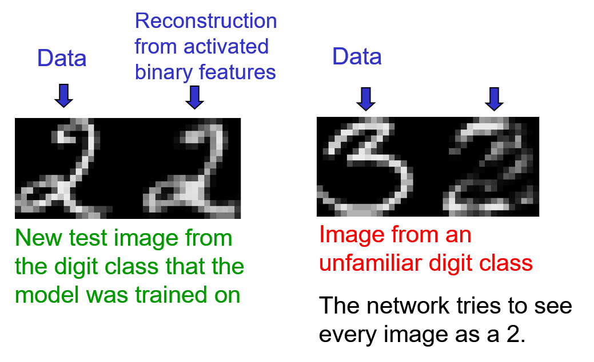
      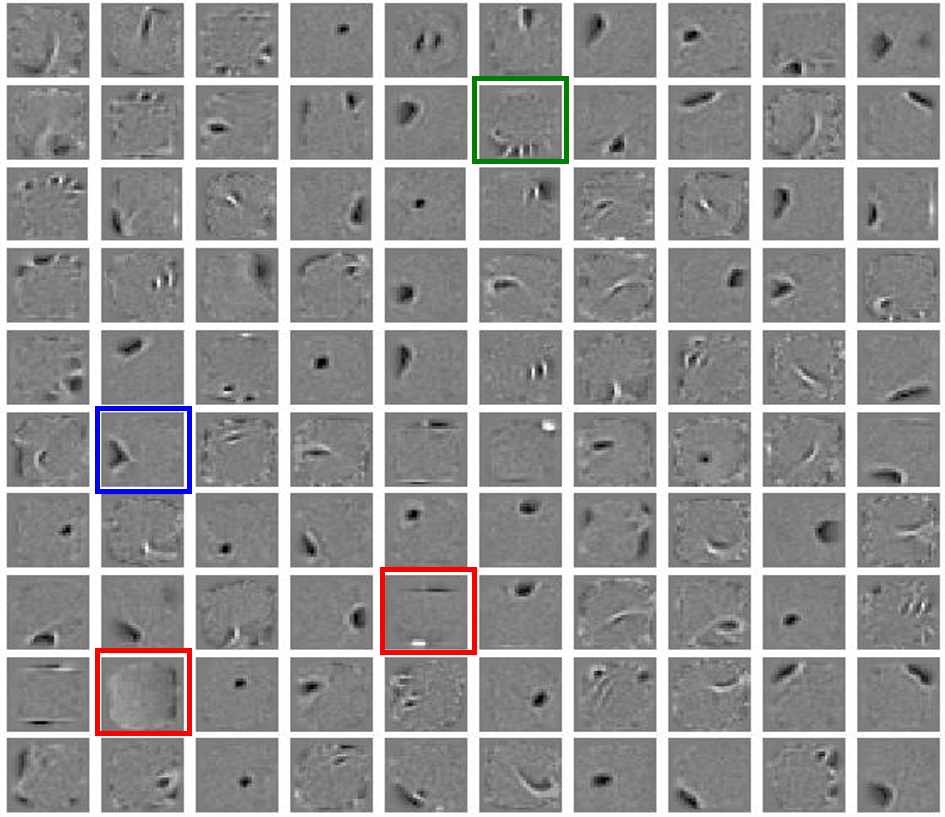
    </a>
  

### Lecture Video

<!--
<video src="https://youtu.be/2gWEP6IewgM?list=PLoRl3Ht4JOcdU872GhiYWf6jwrk_SNhz9" preload="none" loop="loop" controls="controls" style="margin-left: 2em;" muted="" poster="http://www.multipelife.com/wp-content/uploads/2016/08/video-converter-software.png" width=180>
  <track src="subtitle" kind="captions" srclang="en" label="English" default>
  Your browser does not support the HTML5 video element.
</video> 
-->

 

## 12.5 RBMs for collaborative filtering

### Lecture Notes

+ Collaborative filtering: trying to figure out how much the user would like one product based on
  + how much the user liked other products
  + how many other users like the product

+ The Netflix competition w/ collaborative filtering
  + given most of the ratings
    + half a million users gave to 18,000 movies on a scale from 1 to 5
    + nearly all the ratings of old movies missing
    + each user only rates a small fraction of the movies
    + about 100 million ratings $\to$ big data set
  + goal & prize:
    + predict the ratings that users gave to the held out movies
    + winner: get $1,000,000
  + matrix of ratings
    + columns: movies
    + users: rows
    + prodict the rating for user 4 on movie 3

  

    <a href="http://www.cs.toronto.edu/~hinton/coursera/lecture12/lec12.pptx" ismap target="_blank">
      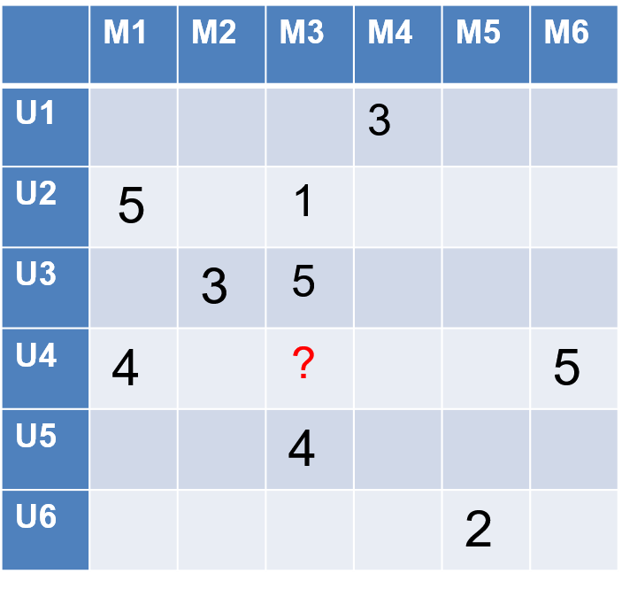
    </a>
  

+ Language model
  + data: strings of triples, like family trees
  + string form: User, Movie, rating; e.g.,
    > U2 M1 5  
    > U2 M3 1  
    > U4 M1 4  
    > U4 M3 ?
  + architecture
    + convert each user into a learned feature vector for that user
    + convert each movie into a learned feature vector for that movie
    + these two feature vectors $\to$ predict the rating
    + put a big hidden layer btw feature vectors and rating
    + simply take the scalar product of the feature vector for the user and feature vector for the movie
    + just multiply them together pointwise and sum together
    + the output as rating
    + not even softmax, actually output whatever real number from the scalar product
    + exactly equivalent to a matrix factorization model
  + matrix factorization model
    + modeling
      + user features down the rows
      + movie features above the columns
      + multiply matrix of users times features by the matrix of features times the movie $\to$ predictions for the ratings
      + exactly equivalent to the language model beside
    + the most commonly used for collaborative filtering

    

      <a href="http://www.cs.toronto.edu/~hinton/coursera/lecture12/lec12.pptx" ismap target="_blank">
        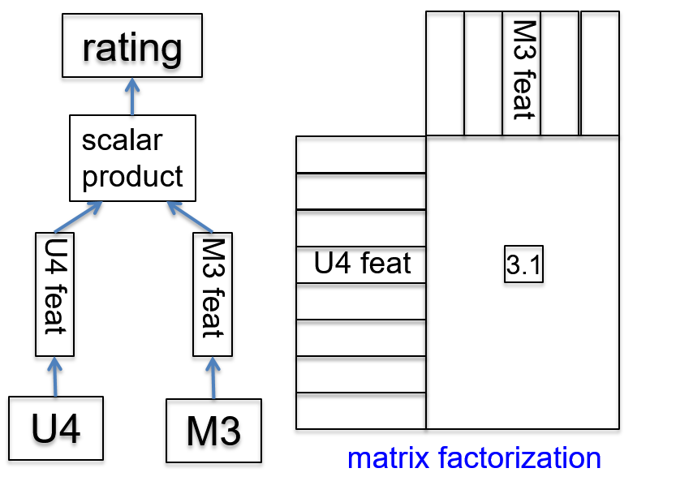
      </a>
    

+ RBM for matrix factorization
  + treat each user as a training case
    + user: a vector movie ratings
    + one visible unit per movie w/ 5-way softmax (see diagram)
      + RBM architecture shown in the diagram
      + each visible units as a five-way softmax
      + one visible unit per movie
      + each hidden unit connected to all five values of softmax w/ bias $\to$ large number of parameters
    + CD learning rule for a softmax same as for a binary unit
    + ~100 hidden units
  + issue: one of the visible values unknown
  + goal: fill in the value by the model

  

    <a href="http://www.cs.toronto.edu/~hinton/coursera/lecture12/lec12.pptx" ismap target="_blank">
      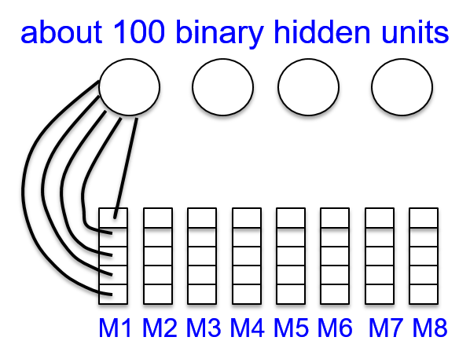
    </a>
  

+ Avoid dealing all missing ratings
  + instead of one RBM for all users where only a few of them have known ratings $\to$ huge number of missing values to deal w/
  + for each user, using an RBM that only has visible units for the movies the user rated
  + a different RBM for every user w/ different subset of the visible units
    + all these RBMs sharing the same weight
    + knowing which movie is which; e.g.,
      + 2 users saw and rated the same movie
      + the weights from that movie to the hidden units will be the same for those 2 users
    + the weights from each hidden unit to each movie are shared by all the users who rated that movie
  + each user-specific RBM only gets one training case $\impliedby$ weight-sharing
    + make the specific RBm  for each user w/ the right architecture
    + the right number of visible units for the movies is that the users rated
    + only one training case w/ that rating vector
    + all of the half million training cases share weights to hidden units
  + trained w/ CD1 then CD3, CD5 & CD9 to collect the statistics for the negative phase

+ Measurements for RBM
  + R. Salakhutdinov, A. Mnih, and G. Hinton, [Restricted Boltzmann Machines for Collaborative Filtering](https://www.cs.toronto.edu/~rsalakhu/papers/rbmcf.pdf), ICML '07: Proceedings of the 24th international conference on Machine learning, June 2007
  + RBM and matrix factorization methods
    + equivalent but giving very different errors
    + averaging the predictions of RBM w/ the predictions of matrix-factorization $\implies$ a big win
  + winning group
    + using multiple different RBM models in their average and multiple different matrix factorization models
    + might be w/ other models
    + main models: matrix factorization and RBMs

### Lecture Video

<!--
<video src="https://youtu.be/6xbPLDAoZ-U?list=PLoRl3Ht4JOcdU872GhiYWf6jwrk_SNhz9" preload="none" loop="loop" controls="controls" style="margin-left: 2em;" muted="" poster="http://www.multipelife.com/wp-content/uploads/2016/08/video-converter-software.png" width=180>
  <track src="subtitle" kind="captions" srclang="en" label="English" default>
  Your browser does not support the HTML5 video element.
</video> 
-->

 

