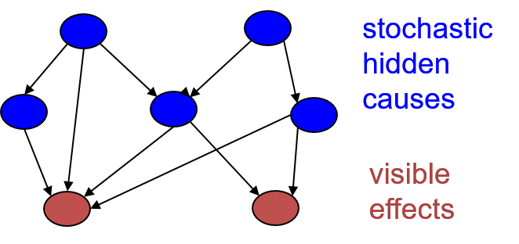
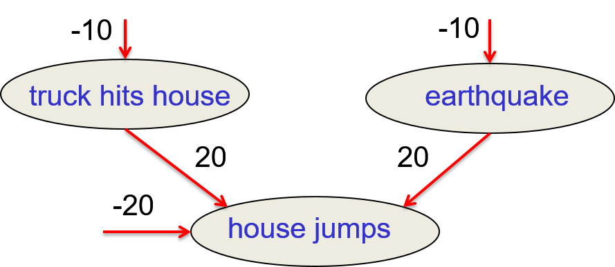
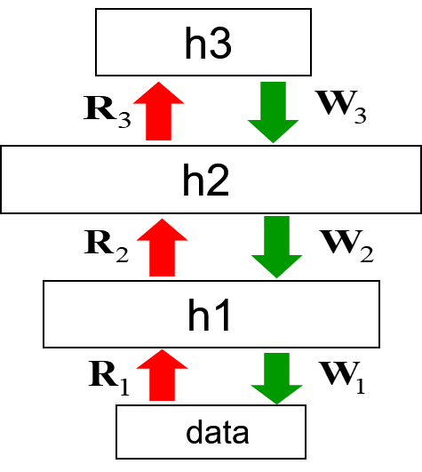
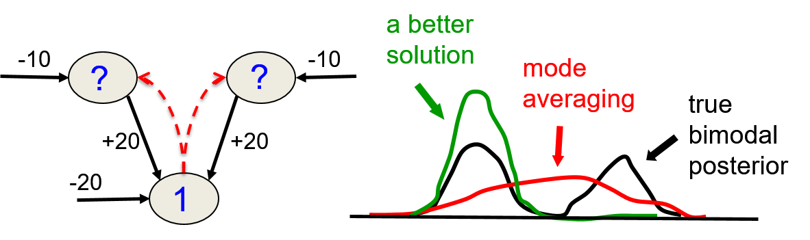

# 13. Deep Belief Nets

## 13.1 The ups and downs of backpropagation

### Lecture Notes

+ A brief history of backpropagation
  + the backprogapation algorithm for learning multiple layers of features
    + Bryson A E, Jr. & Ho Y C. "Applied optimal control: optimization, estimation, and control",  Waltham, MA: Blaisdell, 1969. 481 p.
    + A. Bryson, Y.-C. Ho, and G. Siouris, [Applied Optimal Control: Optimization, Estimation, and Control](https://www.researchgate.net/profile/Y-C_Ho/publication/3116618_Applied_Optimal_Control_Optimization_Estimation_and_Control/links/5b7abdeaa6fdcc5f8b56a7df/Applied-Optimal-Control-Optimization-Estimation-and-Control.pdf), IEEE Transactions on Systems Man and Cybernetics 9(6):366 - 367 · July 1979  $\to$ linear version of backpropagation
    + P. Webos, [Beyond regression : new tools for prediction and analysis in the behavioral sciences](https://www.researchgate.net/profile/Paul_Werbos/publication/35657389_Beyond_regression_new_tools_for_prediction_and_analysis_in_the_behavioral_sciences/links/576ac78508aef2a864d20964/Beyond-regression-new-tools-for-prediction-and-analysis-in-the-behavioral-sciences.pdf), Thesis, 1974 $\to$ non-linear version and 1st version of backpropagation
    + McClelland, J. L., & Rumelhart, D. E. (1981). [An interactive activation model of context effects in letter perception: I. An account of basic findings.](https://psycnet.apa.org/doi/10.1037/0033-295X.88.5.375) Psychological Review, 88(5), 375–407. $\to$ not knowing P. Webos work and abandon due to bad performance by Hinton
    + D. Parker, “Learning-logic," Invention Report 581-64, File 1, Office of Technology Licensing, Stanford University, Stanford, CA, Oct. 1982.
    + Y. LeCun, [A Theoretical Framework for Back-Propagation](http://yann.lecun.com/exdb/publis/pdf/lecun-88.pdf), proceedings of the 1988 Connectionist Models Summer School
    + D. Rumelhart, G. Hinton, R. Williams, [Learning Internal Representations by Error Propagation](https://apps.dtic.mil/dtic/tr/fulltext/u2/a164453.pdf), Technical rept. Mar-Sep 1985
  + backpropagation algorithm: clearly having great promise for learning multiple layers for non-linear feature detector
  + Give up at the late 1990's by most serious researchers
  + still widely used in psychological models and in practical applications suc as credit card fraud detection

+ Why failed
  + popular reasons for giving up in the late 1990's
    + not good use of multiple hidden layers of non-linear features
      + except in convolutional nets
      + except for toy examples
    + not work well in recurrent networks or deep auto-encoders
    + Support Vector Machine (SVM)
      + working better
      + required less expertise
      + produced repeatable results
      + much better and fancier theory
  + actual reasons
    + computers: thousands of times too slow
    + labeled datasets: hundreds of times too small for the regime in which backpropagation would really shine
    + deep networks:
      + too small and not initialized sensibly
      + gradient die too fast because of small initialized weights
  + these issues preenting from being successful for tasks, including vision and speech, where it would eventual be a big win

+ A spectrum of machine learning tasks
  + Typical Statistics $\longleftrightarrow$ Artificial Intelligence
  + typical statistics
    + low-dimensional data; e.g., less than 100 dimensions
    + lots of noise in the data
    + not much structure in the data; structure able to captured by a fairly simple model
    + main problem: separating true structure from noise, not thinking noise is a structure
    + solution: good for Bayesian nets but not ideal for non-Bayesian neural nets $\implies$ trying SVM or Gaussian Process (GP - regression)
  + artificial intelligence
    + high-dimensional data; e.g., more than 100 dimensions, such images and coefficients representing speech
    + noise: not the main problem
    + huge amount structure in the data, but too complicated to be represented by a simple model
    + main problem: figuring out a way to represent the complicated structure so that it can be learned
      + try to hand design appropriate representations
      + earier to resolve by letting backpropagation figure out what representations to use by given a multiple layers
      + using computation power to decide what the representation should be
    + solution: using backpropagation to figure it out

+ Support Vector Machines (SVM)
  + never a good bet for Artificial Intelligence tasks that need good representations
  + SVM: just a clever reincarnation of Perceptrons with kernel function
  + viewpoint 1:
    + expanding the input to a (very large) layer of non-linear non-adaptive features; like perceptrons w/ big layers of features
    + only one layer of adaptive weights, the weights from the features to the decision unit
    + a very efficient way of fitting the weights that controls overfitting by maximum margin hyperplane in a high dimensional space
  + viewpoint 2:
    + using each input vector in the training set to define a non-adaptive "pheature"
    + global match btw a test input and that training input, i.e., how similar the test input is to a particular training case 
    + a clever way of simultaneously doing feature selection and finding weights on the remaining features
  + Limitation: 
    + only for non-adaptive features and one layer of adaptive weights
    + unable to learn multiple layers of representation

+ Historical document from AT&T Adaptive Systems Research Dept, 1995
  + Larry Jackel, Head of AT&T Adaptive Systems Research Dept.
    + people would understand why big neural networks trained w/ backpropagation worked well on datasets
    + people would understand theoretically in terms of conditions and bounds
  + Vladimir Vapnik: by 2005 nobody will be using big neural nets to train w/ backpropagation
  + both wrong: limitations of using backpropagation
    + not because of no good theory and essentially hopeless
    + no big enough computers or big enough datasets

### Lecture Video

 

## 13.2 Belief Networks

### Lecture Notes

+ Limitations of backpropagation
  + labeled training data: almost all data unlabeled
  + learning time
    + not scale well
    + very slow in networks w/ multiple hidden layers
    + why?
      + not initialize the weight in a sensible way as one of the reasons
      + local optima
  + poor local optima
    + usually quite good but far from optimal for deep nets (small initialized random weights)
    + should we retreat to models that allow convex optimization?
      + mathematically good
      + in practice, running away from the complexity of real data

+ Unsupervised learning
  + overcoming the limtations of back propagation
  + gradient method and stochastic mini-batch descent
    + efficient and simple
    + used for modeling the structure of the sensory input, not for modeling the relation btw input and output
    + adjusting the weights to maximize the probability
    + a generative model would have generated the sensory input
    + e.g., leaning Boltzmann machines 
    + computer vision $\implies$ learning computer graphics first
  + learning objective for a generative model as w/ Boltzmann Machines: maximize $p(x)$ (probability of observed data)  not $p(y|x)$ (probability of labels w/ given inputs)
  + what generative model to use?
    + an energy-based model like a Boltzmann machine
    + a causal mode made of idealized neurons
    + a hybrid of the two

+ Artificial Intelligence and Anti-Probability in 1970s
  + "Many ancient Greeks supported Socrates opinion that deep, inexplicable thoughts came from the gods. Today's equivalent to those gods is the erratic, even probabilistic neuron.  It is more likely that increased randomness of neural behavior is the problem of the epileptic and the drunk, not the advantage of the brilliant."   P. H. Winston, "Artificial Intelligence", 1977 (The first AI textbook)
  + All of this will lead to theories of computation which are much less rigidly of an all-or-none nature than past and present formal logic ... There are numerous indications to make us believe that this new system of formal logic will move closer to another discipline which has been little linked in the past with logic.  This is thermodynamics primarily in the form it was received from Boltzmann."   John von Neumann, "the Computer and the Brian", 1958 (unfinished manuscript)

+ Incorporating probability into AI
  + combination of graph theory and probability theory
  + AI works in the 1980's
    + using bags of rules for tasks such as medical diagnosis and exploration for minerals
    + dealing w/ uncertainty for practical problems
    + made up ways of doing uncertainty that did not involve probabilities $\to$ bad bet
  + Graphical models
    + Pearl, Heckeman, Lauritzen, and others shown that probabilities worked better than the ad-hoc methods of expert systems
    + discrete graph good for representing what depended on what other variables
    + computing for nodes of the graph, given the states of other nodes
      + dealing w/ real valued computations
      + respected the rules of probability
        + compute the expected values of some nodes in the graph given the observed states of other nodes
  + Belief nets:
    + named that people in graphical models give to a particular subset of graph
    + sparsely connected, directly acyclic graphs
    + clever inference algorithms to compute the probabilities of unobserved node efficiently for sparesely connected graph
    + working exponentially in the number of nodes that influence each node $\implies$ not for densely connected networks

+ Belief Networks
  + a directed acyclic graph composed of stochastic variables (see diagram)
    + observe any of the variable in general
    + unobserved hidden causes, may be layered (blue nodes)
    + eventually give rise to some observed effect (red nodes)
  + observe some of the variables
  + Problems to solve:
    + __the inference problem__: infer the states of the unobserved variables
      + unable to infer them w/ certainty $\implies$ probability distribution over unobserved variables
      + dependent unobserved variable: probability distribution likely to be big cumbersome things w/ an exponential number of terms
    + __the learning problem__: adjust the interactions btw variables to make the network more likely to generate the training data
      + given a training set composed of observed vectors of states of all the leaf nodes
      + how to adjust the interactions btw variables to make the network more likely to generate that training data
      + adjusting interactions will involve both 
        + deciding which node affected by which other node
        + deciding the strength of that effect

  

    
  

+ Graphical models vs. Neural networks
  + early graphical models
    + using experts to define the graph structure and the conditional probabilities; example: medical experts
      + asking how likely a cause for a syndrome
      + making a graph where the nodes had meanings
      + typically having a conditional probability tables
      + table to describe a set of values for the parents of the nodes would determine the distribution of values for the node
    + sparsely connected
    + initially focused on doing correct inference, not on learning
  + Neural networks
    + main task: learning
    + hand-wiring knowledge $\to$ not cool
      + wiring in some basic properties as in convolutional nets was a very sensible thing to do
    + knowledge from learning the training data not from experts
  + Not for inference
    + NN not aiming for interpretability or sparse connectivity
    + neural network versions of belief nets

+ Types of generative neural network composed of Stochastic binary neurons
  + Energy-based
    + connected binary stochastic neurons using symmetric connections to get a Boltzmann Machine
    + ways to learn a Boltzmann machine but difficult $\implies$ restrict the connectivity in a special way (RBM)
    + RBM only w/ one hidden layer
  + Causal:
    + connecting binary stochastic neurons in a directed acyclic graph
    + Sigmoid Belief Networks (Neal 1992) $\to$ easier to learn than BM (see the previous diagram)
      + all variables: binary stochastic neurons
      + take top layer neurons to determine whether states 1 or 0 according to biases
      + given the states of the neurons in the top layer, making stochastic decisions about what the states of the neurons in the middel layer
      + w/ the decision in the middle layer, determining what the visible effect should be
    + causal sequence from layer to layer to get unbiased sample of the kinds of vectors iof visible values that the NN believes in
  + causal model easier to generate data than Boltzmann machine

### Lecture Video

 

## 13.3 Learning Sigmoid Belief Nets

### Lecture Notes

+ Sigmoid Belief Networks
  + only one positive phase required
  + locally normalized models, no partition function or derivatives required
  + easy to generate an unbiased example at the leaf nodes
    + sampling from the posterior distribution over the hidden units given a data vector
    + once learning down; the weights decided in the network
    + easily see what the network believes in by generating samples from the model
    + a causal model: follow top down sequentially one layer at a time
  + then follow the gradient specified by maximum likelihood learning in a mini-batch stochastic kind of a way
  + understanding what kinds of data the network believes in
  + hard to infer the posterior distribution over all possible configurations of hidden causes when observe the visible effects
    + the number of possible patterns of hidden causes is exponential in the number of hidden nodes
  + hard to even get a sample from the posterior
    + stochastic gradient descent required
  + how to learn sigmoid belief networks that have millions of parameters?
    + very different regime from the normally used graphical models
    + graphical models: interpretable models and trying to learn dozens or hundreds of parameters

  

    
  

+ Learning rule
  + learning is easy $\impliedby$ getting an unbiased sample from the posterior distribution over hidden states given the observed data
    + suppose that every node has a binary value, node $j$ w/ value $s_j$
    + a vector of binary values = a global configuration for the network
    + a vector = a sample from the posterior distribution

    

      
    

  
  + maximizing the log probability for each unit: the binary state in the sample from the posterior would be generated by the sampled binary states of its parents
    + learning rule: local and simple
    + $p_i$: the probability to turn on node $i$ involves the binary states of the parents
      + making the probability similar to the actual observed binary value of $i$
    + $\Delta w_{ij}$:
      + the maximum likelihood learning rule
      + proportion to the state of node $j$ times the difference btw the binary state of node $i$ and the probability of the binary states w/ node $i$'s parents on

    \[\begin{align*} 
      p_i \equiv p(s_i = 1) &= \frac{1}{1 + \exp \left( -b_i - \sum_j s_j w_{ij} \right)} \\
      \Delta w_{ij} &= \varepsilon \, s_j (s_i - p_i)
    \end{align*}\]

  + given an assignment of binary states to all the hidden nodes #\implies$ easily to do maximum likelihood learning in typical stochastic way
    + sampling from the posterior
    + update the weights based on the sample
    + average the update over a mini-batch od samples

+ Explaining away
  + Judea Pearl, [Belief networks revisited](https://ftp.cs.ucla.edu/pub/stat_ser/R175.pdf), Artificial Intelligence, 1993
  + two independent hidden causes in the prior
  + becoming dependent when observing an effect that they can both influence
  + example: earthquake and truck (see diagram)
    + two hidden causes and one observed effect
    + observed effect: a house jumps
      + very unlikely to happen unless one of the causes is true
    + one of the causes happened, the 20 cancels the -20 $\implies$ house jumps w/ a probability 0.5
    + each of the causes is itself rather than unlikely but not nearly as unlikely as a house spontaneously jumping
    + house jumping observed, plausible explanantions
      + a truck hits the house
      + an earthquake
    + both explanations w/ a probability about $e^{-1)}$ and happening spontaneously about $e^{-20}$
    + assume that an earthquake reduces the probability that house jump because of a truck hits it
    + anti-correlation btw the two hidden causes when house jumping observed
    + two hidden causes quite independent in the prior for the model
    + even chance caused by truck or an earthquake when house jumping
    + posterior over hiddens: $p(1, 1) = .0001, p(1, 0) = .4999, p(0, 1) = .4999, p(0, 0) = .0001$
      + two extremely unlikely cases: hit by a truck and an earthquake spontaneously and neither
      + two other combination are equally probable
      + all exclusively
      + two likely causes are in opposite of each other $\to$ explaining away

    

      
    

+ Issue for learning
  + multiple layers of hidden variables to give rise to some data in the causal model (see diagram)
  + hard to learn sigmoid belief nets one layer at a time
  + learning $W$: reqiring sample from the posterio distribution in the first hidden layer
  + problem 1: the posterior not factorial because of "explaining away"
    + the posterior distribution of the first layer of hidden variables not factorial
    + not independent in the posterior $\implies$ explaning away
    + even if only having the layer of hidden variables, the data not independent
  + problem 2: posterior depending on the prior as well as the likelihood
    + required to know the weights iin higher layers, even w/ approximated posterior
    + all the weights interact
    + those hidden variables in the layers above create a prior
    + the prior causes correlations btw hidden variables in the first layer
    + two learn $W$, require to know the posterior in the first hidden layer or at least an approximation to it
    + even only approximation, require to know all the weights in higher layers to compute the prior term
  + problem 3: required to integrate over all possible configurations in the higher layers to get the prior for first hidden layer $\to$ hopeless
    + to computer teh prior term, require to consider all possible patterns of activity in these higher layers
    + combine them all to computer the prior that the higher layers create for the first hidden layer
    + computing that prior is a very complicated thing

  

    
  

+ Learning methods
  + Monte Carlo methods
    + R. Neal, [Connectionist learning of belief networks](https://files.eric.ed.gov/fulltext/ED294889.pdf), Artificial intelligence, 1992
    + used to sample from the posterior
    + painfully slow for large, deep belief nets
  + Variational mehods
    + A. Mnih and K. Gregor, [Neural Variational Inference and Learning in Belief Networks](https://arxiv.org/pdf/1402.0030.pdf), Proceedings of the 31st International Conference on Machine Learning (ICML), JMLR: W&CP volume 32, 2014 pgs 1791-1799
    + only get approximated samples from the posterior
  + Learning from wrong distribution: maximum likelihood learning requiring unbiased samples from the posterior
  + sampling from wrong distribution + using the maximum likelihood learning rule: 
    + learning still working?
    + no gaurante on improvement; the log probability that the model will generate the data
    + gauranteed to improve: 
      + the log probability related to the generation of data
      + provide a lower bound on that mode probability
      + pushing lower bound to push up log probability

### Lecture Video

 

## 13.4 The wake-sleep algorithm

### Lecture Notes

+ Crazy idea
  + hard to learn complicated models like Sigmod Belief Nets
  + problem: hard to infer to the posterior distribution over hidden configurations when given a data vector
    + hard even to get a sample from the posterior
    + hard to get unbiased sample
  + Crazy idea: do the inference wrong
    + use samples from some other distribution and hope that learning still works
    + apply the learning rule that would be correct if we've got samples from the posterior
    + reasonably expect the learning to be a diaster but actually the learning comes to your rescue
    + observe what's driving the weights during the learning when using an approximate posterior
    + two terms driving the weights
      + driving them to get a better a model of the data that makes the sigmoid belief net more likely to generate the observed data in the training set
      + driving weights towards sets of weights for which the proximate posterior using is a good fit to the real posterior by manipulating the real posterior to mak eit fir the approximate posterior
    + turn out to be true for Sigmoid Belief Nets (SBNs)
  + each hidden layer
    + using distribution that ignores explaining away
    + assumption (__wrongly__): the posterior over hidden configurations factorizes into a product of distributions for each separate hidden unit
    + equivalent assumption: given the data the units in each hidden layer are independent of one another as in RBM
    + RBM: unit independent of another units in the same hiddent layer

+ Factorial distributions
  + factorial distributions
    + the probability of a whole vector is just the product of the probabilities of its individual terms
    + individual probabilities of three hidden units in a layer: 0.3, 0.6. 0.8
    + probability that the hidden units have state $1, 0, 1$ if the distribution is factorial: $p(1, 0, 1) = 0.3 \times (1 -0.6) \times 0.8$
  + degrees of freedom
    + a general distribution over binary vectors of length $N$: $2^N - 1$ degrees of freedom
    + factorial distribution: only $N$ degrees of freedom

+ The wake-sleep algorithm
  + G. Hinton, P. Dayan, B. Frey, and R. Neal, [The wake-sleep algorithm for unsupervised neural networks](https://www.cs.toronto.edu/~hinton/csc2535/readings/ws.pdf), Science, Vol. 268, Issue 5214, pp. 1158-1161, 1995
  + lead new area of machine learning $\to$ variational learning in the late 1990s for learing complicated graphical models
  + used for directly graphical models like sigmoid belief nets
  + make uses of the idea of using the wrong distribution
  + architecture: (see diagram)
    + a neural network w/ two different sets of weights
    + a generative model
      + generative weights
        + weights in green as the weights of the model
        + weight defining the probability distribution over data vectors
      + recognition weights
        + weights in red  used for approximately getting the posterior distribution
        + using the weight to get factorial distribution in each hidden layer
        + the approximations of the posterior not working very well
  + Wake phase
    + use recognition weights to perform a bottom-up pass
    + train the generative weights to reconstruct activities in each layer from the layer above
    + putting data in of the visible layer at the bottom
    + using forward pass through the network w/ the recognition weights
    + making stochastic binary decision at each hidden layer
    + each hidden units independently about whether on or off
    + forward pass: stochastic binary states for all of the hidden units
    + treating the stochastic binary states as a sample from the true posterior distribution given the data
    + applying maximum likelihood learning
      + not for recognition weights which just used to get the approximate sample
      + the generative weights to define the model
    + driving the system in the forward pass w/ the recognition weights to learn the generative weights
  + Sleep phase
    + use generative weights to generate samples from the model
    + train the recognition weights to reconstruct activities in each layer from the layer below
    + driving the system w/ the generative weights
    + starting w/ a random vector at the top hidden layer to generate the binary states of those hidden units from their independent prior
    + moving down the system to generate states for each layer one at a time
    + using the generative model correctly to generate unbiased sample
    + to recover the hidden states of h1 from the data or hiddent states at layer h2 from the hiddent states at h1
    + training the recognition weight to recover the hidden states actually generated the states in the layer below

  

    
  

+ Limitations of the wake-sleep algorithm
  + the recognition weights
    + initial phase: not big deal
      + trained to invert the generative model in parts of the space where there is no data $\to$ wasteful
      + at the beginning of learing, generate stuff very different from the real data
      + weights not very good at this moment $\to$ waste not not big issue
    + progressive phase: serious issue
      + not follow the gradient of the log probability of the data
      + only approximately follow the gradient of the variational bound on the probability
      + lead to incorrect mode-averaging
  + explaning away effects $\implies$ the posterior over the top hidden layer is very far from independent
    + forced approximation w/ a distribution independently
    + independence might not be so bad for intermediate hidden layers
    + explaining away effects from the below could be partially canceled out by prior effects from the above
  + Karl Friston: how the brian works

+ Mode averaging
  + learning recognition weights (left diagram)
    + running the sleep phase to generate data from the model
    + most of time those top two units off $\impliedby$ very unlikely to tun on under their prior
    + visible unit firmly off due to the states off on the top layer units w/ bias of -20
    + occasionally one time w/ probability of $e^{-10}$, one of the two top units on
    + half the instances of a $1$ at the data layer will be caused by a $(1, 0)$ and half caused by a $(0, 1)$
      + none of those occasion having neither or both unit on
    + learning to produce $(0.5, 0.5)$ for the recognition units
    + representing a distribution that put half its mass on $(1, 1)$ or $(0, 0)$: very improbabe hidden configurations
  + much better picking one mode (right diagram)
    + assume that the posterior over hidden states factorizes
    + the best recognition model to get if foreced to have factorial model
    + the true posterior is bimodal that focuses on $(0, 1)$ or $(1, 0)$ (black curve)
    + the papproximation w/ the wake-sleep algorithm given all four states of the hidden units equal probability (red curve)
    + the best solution to pick one of its states to give it all the probability mass (green curve)
    + variational learning manipulating the true posterior to make it fit the approximation
    + normal learing manipulating an approximation to fit the true thing

  

    
  

### Lecture Video

 

