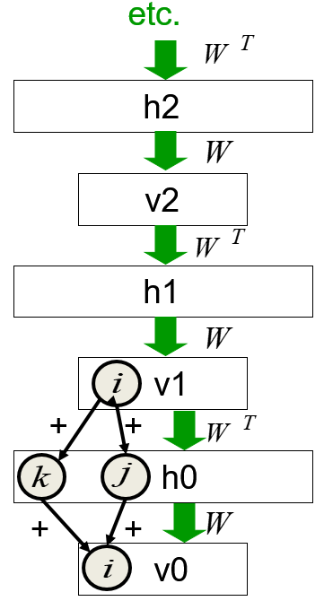

# 14. Deep Belief Networks and Restricted Boltzmann Machine
  
## 14.1 Learning layers of features by stacking RBMs

### Lecture Notes

+ Stacking RBMs as deep belief net
  + procedure
    + training a layer of features w/ input directly from the pixels
    + treating the activations of the trained features as if they were pixels and learn features from features
    + repeat the steps
  + each new layer of features by modeling the correlated activity in the feature in the layer below
  + adding another layer of features
    + improving a variatonal lower bound on the log probability of generating the training data
    + complicated proof and only applied to unreal cases
    + proof based on a neat equivalence btw an RBM and an infinitely deep belief net
  + example: combining two RBMs to make a DBN
    + left diagram
      + stacked RBMs $\to$ deep belief net
      + learning RBM ($v \stackrel{w_1}{\longleftrightarrow} h_1$) w/ its own weight
      + once trained, hidden activity patterns as data for the 2nd RBM ($h_1 \stackrel{w_2}{\longleftrightarrow} h_2$)
      + starting the 2nd RBM off w/ $w_2$ being transpose of $w_1$ and same number of hidden units as $v$
      + the 2nd RBM as good model of $h_1 \to$ the 1st RBM upside down $\implies$ bipartite graph (no need to distinguish layers for visible and hidden units)
    + compose both RBMs (left diagram) to form a single model (right diagram)
    + right diagram
      + top two layers = 2nd RBM $\implies$ undirected model w/ symmetric actions
      + bottom two layers = directed model as a sigmoid belief net $\implies$ remove symmetry connection btw $v$ and $h_1 \to$ remove upgoing part
      + not a RBM $\to$ deep belief net
      + lower layers as a sigmoid belief nets while the top two layers forming a RBM $\to$ a hybrid model

    

      
    

+ Generative model w/ 3 layers
  + stacked up 3 RBMs (diagram)
    + $h_2 \stackrel{w_2}{\longleftrightarrow} h_3$ as a RBM
    + $data$ and $h_1$ forming directed layers as in a sigmoid belief nets
  + procedure to generate data
    + get an equilibrium sample from the top-level RBM by performing alternating Gibbs sampling for a long time
      + back and forth btw $h_2$ and $h_3$ to reach equilibrium w/ top-level RBM
      + involving alternating Gibbs sampling
      + update all units in $h_3$ in parallel then update all units in $h_2$ in parallel then ...
    + perform a top-down pass to get states for all the other layers
      + top-level RBM = the prior distribution over $h_2$
      + $h_2 \xrightarrow[\text{generativ connecction}]{w_2} h_1 \xrightarrow{w_1} data \implies$ performing as a belief net
  + the lower bottom-up connections (transposes of corresponding weights) not part of the generative model $\to$ used for inference
  + Gibbs sampling
    + generating posterior samples by sweeping through each variables (or block of variables) to sample from its conditional distribution w/ the remaining variables fixed to their current values
    + a MCMC algorithm for obtaining a sequence of observations, approximately from a specified multivariate probability distribution

  

    
  

+ Averaging factorial distributions
  + average some factorial distributions
    + not a factorial distribution
    + in an RBM, the posterior over 4 hidden units is factorial for each visible vector
  + example
    + 4 units w/ the probabilities to turn on each unit
    + posterior for v1: (0.9, 0.9, 0.1, 0.1)
    + posterior for v2: (0.1, 0.1, 0.9, 0.9)
    + averaged $\neq$ (0.5, 0.5, 0.5, 0.5)
  + consider the binary vector (1, 1, 0, 0)
    + posterior for v1: $p(1, 1, 0, 0) = 0.9 \times 0.9 \times (1-0.1) \times (1-0.1) = 0.9^4 = 0.43$
    + posterior for v2: $p(1, 1, 0, 0) = 0.1^4 = 0.0001$
    + aggregated posterior: $p(1, 1, 0, 0) = 0.215$
  + aggregated posterior: factorial w/ $p=0.5^4 \implies$ aggregated posterior not factorial distribution

+ Mechanism in greedy learning
  + weights, $w$, in the bottom level RBM define many different distribution
    + $p(v|h)$: the probability of visible  units given the hidden units
    + $p(h|v)$: the probability of hidden units given the visible units
    + $p(h)$: the probability of hidden units
    + $p(v)$$: the probability of visible units
  + process and restriction
    + $p(v|h)$ and $p(h|v)$ used for running alternative Markov Chain updates
    + a long sequence of updates $\to$ a sample from the joint distribution of $v$ and $h$
    + the weights also clearly defined the joint distribution
    + the weights also define the joint distribution more directly in terms of $e^{-E}$
    + not for nets w/ a large number of units
    + w/ the joint distribution of $v$ and $h$
      + ignoring $v \to$ distribution for $h$ = the prior distribution defined by this RBM
      + ignoring $h \to$ the prior distribution over $v$ defined by the RBM
  + the RBM models: $p(v) = \sum_h p(h) p(v|h)$
  + $p(v|h)$ fixed, improve $p(h) \implies p(v)$ improved
    + learn new parameters giving a better model of $p(h)$
    + substitute $p(h)$ in stead of the old model out of $p(h) \to$ improve model over  $v$
  + to improve $p(h)$, a better model than $p(h; w)$ of the aggregated posterior distribution over hidden vectors produced by applying $W$ transpose to the data
    + better model $p(h)$: fitting the aggregated posterior better
    + the aggregated posterior: the average over all vectors in the training set of the posterior distribution over $h$
    + using the 1st RBM to get aggregated posterior
    + using the 2nd RBM to build a better model of this aggregated posterior $\to$ 1st RBM reaching a better model
    + start w/ 2nd RBM as the previous but upside down
    + start w/ the same model of the aggregated posterior as the 1st RBM has
    + changing the weights $\implies$ better fit 

+ Contrastive version of the wake-sleep algorithm   after learning many layers of features, fine-tune the features to improve generation
  1. do a stochastic bottom-up pass
    + adjust the top-bottom generative weights of lower layer to be good at reconstructing the feature activities in the layer below
    + a standard wake-sleep algorithm
  2. do a few iterations of sampling in the top level RBM
    + adjust the weights in the top-level RBM using contrasted divergence (CD)
    + working as a regular algorithm for RBM
    + update the weight of the RBM using the difference btw 
      + the correlations when activity first got to that RBM
      + the correlations after a few iterations in that RBM
  3. do a stochastic top-down pass
    + adjust the bottom-up weights to be good at reconstructing the feature activities in the layer above
    + using the directed lower connections to generate some data from that sigmoid belief net
    + the sleep phase of the wake-sleep algorithm
  + differences
    + top-level RBM acts as a much better prior over the top layers than just a layer of units assumed to be independent
    + rather than generating data by sampling from the prior, looking at a training case going up to the top-level RBM and just running a few iterations before generating data

+ Example: Modeling with the DBN on MNIST digits
  + G. Hinton, S. Osindero,, and Y.-W. Teh, [A Fast Learning Algorithm for Deep Belief Nets](https://bit.ly/2wQSqCk), Neural Computation, July 2006
  + first two hidden layers learned w/o labels
    + bottom two layers involved
    + task: modeling all 10 digit classes in images of 28 by 28 pixels (right bottom input box)
    + learning RBM w/o knowing labels $\to$ unsupervised learning
    + taking the patterns of activities in the hidden units
    + treating the patterns of activity as data
    + learn another RBM (2nd hidden layer - 500 units) w/o knowing the labels
  + top layer learned as an RBM for modeling the labels concatenated w/ the features in the second hidden layer
    + adding a big top layer w/ 2000 hidden units (top layer)
    + providing 10 labels (left 2nd top boxes)
    + concatenating those 10 labels w/ the 500 units representing features $\to$ really w/ one softmax unit
    + training top-level RBM to model the concatenation of the softmax unit for the 10 labels w/ the 500 feature activities reproduced by the two layers below
  + fine-tuning weights as a better generative model using contrastive wake-sleep
    + once top layer trained, find-tune the whole system by using a trusty wake-sleep algorithm
    + retain a good generative model

  

    
  

### Lecture Video

 

## 14.2 Discriminative fine-tuning for DBNs

### Lecture Notes

+ Fine-tuning for discrimination
  + learn on layer at a time by staking RBMs
  + treating this as "pre-training"
    + finding a good initial set of weights in a deep neural networks
    + fine-tuning the weights using some local search procedure
    + contrastive wake-sleep: a way of fine-tuning the model to be better at generating the inputs
  + backpropagation used to find-tune the model
    + better than discrimination
    + overcome many of the limitations of standard backpropagation
    + easier to learn deep nets
    + generalizing the nets better

+ Backpropagation better than greedy pre-training
  + the optimization view
    + greedily learning one layer at a time scales well to really big networks, especially locality in each layer
      + example: vision
        + local receptive fields in each layer
        + not much interaction btw widely separate locations
        + very easy to learn a big layer more or less in parallel
    + not starting backpropagation until sensible feature detectors very helpful for the discrimination task
      + initial gradients more sensible than random white noise
      + backpropagation only performing a local search from a sensible starting point
  + the overfitting view
    + pre-trained notes exhibiting much less overfitting
    + most of the information in the final weights from modeling the distribution of input vectors
      + input vectors generally containing a lot more information than the labels
        + labels only containing a few bits of information to constraint the mapping from input to output
        + an image containing a lot of information which will constraint any generative model of a set of images
      + precious information in the labels only used for the fine-tuning
        + at this stage feature detectors decided
        + not squandering precious information designing feature detectors from scratch
    + fine-tuning only modifying the features slightly to get the category boundaries right $\to$ backpropagation not required to discover new features
    + unlabeled training data
      + backpropagation works well
      + still very useful for discovering good features
      + the generative pre-training using a lot of information
    + objection: learning many of the features
      + useless for any particular discriminative task
        + example: net to discriminate btw shape and btw different poses of one shape $\to$ very different features required
        + not knowing task in advance $\implies$ inevitably learning features never used
        + serious objection w/ small computer
      + more useful than the raw inputs

+ Modeling MNIST digits w/ a DBM
  + learning w/ 3 hidden layers of features entirely unsupervised (see diagram)
  + top two layers forming a RBM whose energy landscape should model the low dimensional manifolds of the digits
  + the network learns a density model for unlabeled digit images
  + generating from the model $\to$ get things that look like real digits of all classes
  + hidden features really help w/ digit discrimination?
  + adding a 10-way softmax at the top and the doing backpropagation

  

    
  

  + results on the permutation-invariant MNIST task
    + permutation-invariant: applying a fixed permutation to all the pixels, the same permutation to every test in training case
    + the results w/ the same algorithm but different net structure due to convolutional nets

    | Models | Error Rate |
    |--------|------------|
    | Backpropagation net w/ one or two hidden layers ([Platt](https://bit.ly/39y0kOi); [Hinton](https://bit.ly/2wQSqCk)) | 1.6% |
    | Backpropagaton w/ L2 constraints on incoming weights | 1.5% |
    | Support Vector Machines ([Decoste & Schoelkopf, 2002](https://bit.ly/3aA3IJO)) | 1.4% |
    | Generative model of joint density of images and labels (+ generative fine-tuning) | 1.25% |
    | Generative model of unlabelled digits followed by gentle backpropagation ([Hinton & Salakhutdinov, 2006](https://bit.ly/344vKuE)) | 1.155 $\to$ 1.0% |

+ Unsupervised "pre-training"
  + help for models w/ more data and better priors
  + M. Ranzato, C.S. Poultney, S. Chopra and Y. LeCun. "[Efficient Learning of Sparse Overcomplete Representations with an Energy-Based Model](https://bit.ly/2UN6hSf)". Advances in Neural Information Processing Systems 19 (NIPS 2006)
    + used an additional 600,000 distorted digits
    + used convolutional multilayer neural networks
  + Performance
    + Backpropagation alone: 0.49%
    + Unsupervised layer-by-layer pre-trained followed by backpropagation: 0.39%

+ Phone recognition on the TIMIT benchmark
  + A. Mohamed, G. Dahl, and G. Hinton, [Deep Belief Networks for phone recognition](http://www.cs.utoronto.ca/~gdahl/papers/dbnPhoneRec.pdf), 2009
  + Geoffrey E. Hinton, et al., [Deep Neural Networks for Acoustic Modeling in Speech Recognition: The Shared Views of Four Research Groups](https://bit.ly/3avie5J), IEEE Signal Processing Magazine, 29, November 2012
  + after standard post-processing using a bi-phone model, a deep net w/ 8 layers: 20.7%
  + the best previous speaker-independent result on TIMIT w/ averaging several model: 24.4%
  + Li Deng: the result could change the way speech recognition was done

  

    
  

### Lecture Video

 

## 14.3 What happens during discriminative fine-tuning?

### Lecture Notes

+ Learning dyanmic of deep nets
  + Dumitru Erhan, Yoshua Bengio, Aaron Courville, Pierre-Antoine Manzagol, Pascal Vincent, Samy Bengio, [Why Does Unsupervised Pre-training Help Deep Learning?](https://bit.ly/2yg8A8z), Journal of Machine Learning Research, 2010
  + Receptive fields of the first hidden layer of feature detectors
    + after generative pre-training but before fine-tune (left diagram)
    + after fine-tuning (right diagram)
    + no significant changes with and w/o pre-training
    + changes helping discrimination
  + effect of unsupervised pre-training: pre-training reducing the test errors for network
    + task: discriminating btw digits in a very large set of distorted digits
    + after backpropagation of fine-tuning (left - 1 hidden layer: w/o pre-training, right - 4 hidden layers: w/ pre-training)
      + the network w/ pre-training almost always did better than the networks w/o pre-training
      + the improvement even bigger w/ deeper network $\to$ no overlap btw two distributions
  + effect of depth
    + depicted classification error and variation classification error
    + changing the number of layers
      + w/o pre-training: 2 layers as the best (left diagram)
      + w/ pre-training:
        + layers (4 < 3 < 2 < 5 < 1): 4 layers the best
        + much less variation w/ lower errors
  + trajectories of the learning in function space
    + 2D visualization w/ t-SNE
    + point = a model in function space
      + comparing weight vectors $\to$ useless
      + two nets might differ by having two of the hidden units work around
      + behaving the same way w/ very different weights
      + comparing the function implemented rather than the weight vectors
      + procedure
        + having a suite test cases and observing their output
        + concatenate outputs into a great long vector
      + two networks producing very similar points on all test cases
      + plotting the concatenated output vectors w/ t-SNE
    + color = epoch
      + the stages of the training
      + initial stages in dark blue
      + all cases moving toward roughly the same direction
    + top portion: trajectories w/o pre-training $\to$ each trajectories converges to a different local min
    + bottom portion: trajectories w/ pre-training $\to$ different region of function space but more similar
    + no overlap!

  

    
  

  

    
  

+ Mechanism of unsupervised pre-training
  + sequential image-label pairs (left diagram)
    + generating an image and then attaching a label to it $\to$ independent of the stuff
    + contingent on the image itself irrelevant w/ the stuff
    + the label depending on the pixels in the image
    + trying and leaning a mapping to go straight from images to labels
    + e.g., do the pixels have even parity?
  + parallel image-label pairs (right diagram)
    + generating image and label in pair
    + the label depending on the stuff in the world rather than the pixels of the image
    + high bandwidth required from stuff to image ( more bits) while low bandwidth required from stuff to label
    + to recover the label:
      + inverting the high bandwidth pathway to get back to the stuff producing the image
      + recovered stuff generating the image to decide what label it would be given
    + much more plausible model of how to assign names to things in images
    + justifying the procedure:
      + having pre-training phase to discover the underlying causes of the images
      + followed by a descriptive phase to get the underlying label where slightly fine-tune the mapping from the image to the underlying causes

  

    
  

### Lecture Video

 

## 14.4 Modeling real-valued data with an RBM

### Lecture Notes

+ Modeling real-valued data
  + intermediate intensities of digit images
    + represented as probabilities by using 'mean-field' logistic units
      + probability btw 0 and 1 $\to$ probability of a logistic unit off and on
    + treating intermediate values as the probability of the inked pixel
      + partial inked pixels $\to$ probability of being inked (incorrect) but working well
  + not working for real images
    + real-image: intensity of a pixel almost always and almost exactly the average of the neighboring pixels
      + high probability of being very close to average
      + little probability of being a little further away
    + mean-field logistic units unable to represent precise intermediate values
      + e.g., intensity = 0.69 but very unlikely to be 0.71 & 0.67
      + other unit required

+ A standard type of real-valued visible unit
  + modeling pixels as Gaussian variables
  + Gibbs sampling: still easy but slow learning
    + running Markov chain required for contrastive learning
    + much smaller learning rate used, otherwise blowing up
  + energy function

    \[ E(\mathbb{v}, \mathbb{h}) = \underbrace{\sum_{i \in vis} \frac{(v_i - b_i)^2}{2\sigma^2}}_{\text{parabolic containment}\\ \text{function}} - \quad\sum_{j \in hid} b_j h_j\quad - \underbrace{\sum_{i, j} \frac{v_i}{\sigma_i} h_j w_{ij}}_{\text{energy-gradient produced by}\\ \text{the total input to a visible unit}} \]

    + parabolic containment function:
      + stop things blowing up
      + parabolic shape (see diagram): a parabola w/ its minimum of the bias of the $i$-th unit, $b_i$
      + adding energy quadratically as $i$-th unit departing from the bias $to$ keeping the $i$-th visible unit close to $b_i$
    + energy-gradient term
      + an interactive term btw visible and hidden units
      + differentiated w.r.t $v_i \to$ constant gradient (blue line)
    + adding the top-down contribution w/ linear and parabolic function $\to$ mean shifted away from $b_i$
      + the shift amount depending on the slope of the blue line
      + pushing the mean to one side

  

    
  

+ Gaussian-binary RBM architecture
  + extremely hard to learn tight variances for the visible units (see diagram)
    + the visible unit $v_i$ onto the hidden unit $h_j$
    + measuring the activity of $v_i$ in units of its standard deviation
    + $v_i$ w/ small standard deviation $\sigma_i$:
      + exaggerating the bottom up weights: multiply the weight by a lot
      + attenuating the top down weights: small standard deviation of $v_i$
    + $\sigma \ll 1$: the bottom-up effects too big while top-down effect too small
    + conflict: hidden units firmly on and off all the time
  + Solution:
    + small $\sigma \to$ many more hidden units required than visible units
    + allowing small weights to produce big top-down effects

  

    
  

+ Stepped sigmoid units
  + resolving the issue on many more hidden units than visible units
  + a neat way to implement integer values
  + making many copies of a stochastic binary unit
  + all copies w/ the same weights and the same adaptive bias, $b$, but different fixed offsets to the bias: $b - 0.5, b-1.5, b-2.5, b-3.5, \dots$
  + the response curve (see diagram)
    + small input $x \to$ none turned on
    + increasing the number $\to$ increasing turn on linearly
    + getting more top-bottom effect to drive the visible unit w/ small standard deviations
  + issue
    + expensive to use a big population of binary stochastic units w/ offset biases
    + each on required the total input through the logistic function

  

    
  

+ Fast approximations
  + Rectified Linear unit (ReLU): approximation of multiple sigmoid functions (see diagram)

    \[ \langle y \rangle = \sum_{n=1}^{\infty} \sigma(x+0.5-n) \approx \log(1+e^x) \approx \max(0, x+noise) \]

  + contrastice divergence learning working well for the sum of stochastic logistic units w/ offset biases
  + $\sigma(y)$: the noise variance
  + applying ReLU
    + working well on contrastive divergence learning
    + much faster than the sum of many logistic units w/ different biases

  

    
  

+ Property of Rectified linear unit
  + ReUL w/ bias of zero $\implies$ exhibiting __scale equivariance__
    + a nice property for image
    + multiplying all the pixel intensities by a scalar $a$
    + the representation of $a\mathbb{x}$ in ReLU = $a$ times of the representation of $\mathbb{x}$
    + scaling up all intensities in the image = scaling up the activities of all hidden units but maintaining the same ratios
    + ReLU not fully linear: adding two ReUL $\neq$ the sum of the representations of each image separately

    \[ R(a\mathbb{x}) = aR(\mathbb{x}) \qquad \text{but} \qquad R(a + b) \neq R(a) + R(b) \]

  + similar to the property of translational equivariance exhibited in convolutional nets
    + ignoring pooling in the convolutional net
    + the representation of a shifted image = shifted version of the representation of the unshifted image
    + convolutional net w/o pooling = translations of the input flowing through the layers of the net w/o effecting anything
    + tanslating the representation of every layer

    \[ R(shift(\mathbb{x})) = shift(R(\mathbb{x})) \]

### Lecture Video

 

## 14.5 RBMs are infinite sigmoid belief nets

### Lecture Notes

+ Mechanism of layer-by-layer learning
  + unexpected equivalence btw RBMs and directed networks
    + many layers sharing the same weight matrix
    + equivalence giving insight into why contrastive divergence learning works
  + RBM = finitely deep sigmoid belief net
    + sharing a lot of weight
    + running Markov chain to get sample from the equilibrium distribution of an RBM
    + viewing the RBM as a sigmoid belief net

+ An infinite sigmoid belief net equivalent to an RBM
  + infinite sigmod belief net w/ same weights at every layer (see diagram)
    + all visible layers ($v_x$) w/ same size
    + all hidden layer ($h_x$) w/ the same size
    + might be different sizes btw visible layers and hidden layers
  + distribution generated by this infinite directed net w/ replicated weights
    + same as the equilibrium distribution for a compatible pair of conditional distribution
    + $p(v|h)$ and $p(h|v)$ both defined by the same weight matrix $W$
    + obtaining equilibrium distribution by alternatively processing $p(v|h)$ and $p(h|v)$
    + same procedure as running Markov chain on a RBM to get sample from the equilibrium distribution
  + top-down pass of the directed net exactly equivalent to letting a RBM settle to equilibrium
  + infinite directed net defining the same distribution as an RBM
  + sample from $v_0$ in the infinite directed net = the equilibrium sample of the equivalent RBM

  

    
  

+ Inference in an infinite belief sigmoid belief net
  + procedure
    + starting at $v_0$ to infer the state of $h_0$ $\to$ difficult due to explaining away
    + example: explaining away
      + hidden units $h_{0k}, h_{0j}$ both w/ big positive weight to visible unit $v_{0i}$
      + $v_{0i}$ on $\to$ $h_{0j}$ and $h_{0k}$ anti-correlated in the posterior distribution
  + variables in $h_0$
    + conditionally independent given $v_0$
    + trivial inference: $v_0 \times W^T$
      + $h_{0k}$ and $h_{0j}$: completely independent
      + inference given $v_0$ = $v_0 \times W^T$
      + passed to the logistic sigmoid function and then sample $\to$ binary states of $h_0$
    + model above $h_0$ implementing a complementary prior
    + $v_0 \times W^T$: the product of the likelihood term and the prior term
      + implementing a prior distribution of $h_0$
      + the implementation exactly canceling out the correlation in explaining away
      + example
        + the prior implementing positive correlation btw $h_{0k}$ and $h_{0j}$
        + explaining away causing negative correlation to cancel out the correlation
        + multiplying $v_0$ by the transpose of the weights $\to$ not only computing the likelihood
        + computing the product of a likelihood term and a prior term $\to$ the posterior
    + complementary prior canceling the explaining away
      + the complementary prior implemented by all the stuff above $h_0$ exactly canceling out explaining away
      + making the inference very simple
  + inference in the directed net exactly equivalent to letting an RBM settle to equilibrium starting at the data
    + the cancellation applied to every layer of the net
    + multiplying $v_0$ by $W$ transpose: inference for every layer $\to$ an unbiased sample at each layer
    + the binary state of $h_0$ multiplied by $W$ and passed through the logistic logistic sigmoid
    + the binary state of $v_1$ obtained
    + repeating the process up
    + the generative model = running alternative Markov chain of a RBM to equilibrium
    + performing inference in this mode = same process in the opposite direction
    + a very special kind of sigmoid belief net: inference as easy as generative

  

    <a href="https://bit.ly/2JpLNti" ismap target="_blank">
      
    </a
  

+ Learning a deep directed network
  + the model moving from top to bottom as learning process  (left diagram)
    + obtaining a sample from the posterior
    + $s_i$ and $s_j$: samples from the posterior distribution
  + learning rule for a sigmoid belief net

    \[ \Delta w_{ij} \propto s_j(s_i - p_i) \]

    + $s_i^1$: an unbiased sample from $p_i^0$
    + the change of generative weight in proportion to the product of
      + the activities of $s_j$
      + the difference btw the post-synaptic activity $s_i$ and the probability of turning on unit $i$ given all the binary states of the layer $s_j$ is in
    + computing $p_i$
      + infer a binary state for $h_0$
      + once binary states chosen in $ h_0$
      + inferring a binary state $v_1$: multiplying $h_0$ by $W$ and putting into the logistic to get sample
      + $s_i^1$ as a sample $impliedby$ putting $h_0$ through the matrix weight $W$ and logistic function
      + taking the binary activities in $h_0$ and moving downwards through the green weights $W$
      + computing the probability of turning on unit $i$ given the binary states of its parents
      + the process going through $h_0 \to v_1$ identical to the process $h_0 \to v_0$
      + $s_i^1$ = an unbiased sample of $p_i^0$
  + w/ replicated weights

    \[\begin{array}{lllll}
      s_j^0(s_i^0 & - s_i^1) + & & & &  (s_j^0 \xrightarrow{W} s_i^0) \\
       & s_i^1 (s_j^0 & - s_j^1) + & & &  (s_i^1 \xrightarrow{W^T} s_j^0) \\
       & & s_j^1(s_i^1 & - s_i^2) & +  \dots &  \\
       & & & & - s_j^\infty s_i^\infty & 
    \end{array}\]

    + each line of the learning rule as the green weight matrices
    + first green weight matrix at bottom: the learning rule of the pre-synaptic state $s_j^0$ times the difference btw the post-synaptic state $s_i^0$ and the probability, $p_i^0$, that the binary states in $h_0$ will turn on $s_i$
    + a sample w/ that probability = $s_i^1$, an unbiased estimate of the derivative
    + plugging in $s_i^1$ on the first line of the learning rule
    + repeating the process to substitute $p_i$
    + becoming a RBM learning rule

  + learning w/ all the weights tied together (middle left diagram = middle diagram)
    + exactly equivalent to learning an RBM
    + thinking of the symmetric connections as a shorthand notation for an infinite directed net w/ tied weights
  + using CD1 as a shortcut instead
    + ought to use maximum likelihood learning
  + freezing the first layer of weights in both directions and learning the remaining weights (still tie together)
    + freeze the bottom level weights = freeze the generative weights
    + freeze the weights used for inference to be the transpose of the those generative weights
    + tie all the other weights together
    + allowing them to be different from the weights in the bottom layer
    + learning the remaining tied weights = learning another RBM
    + the new RBM w/ $h_0$ as its visible units and $v_1$ as its hidden units
    + the data for the new RBM: the aggregated posterior across $h_0$
    + to sample a data vector to train the network
      + putting a real data vector of $v_0$ = inference through those frozen weights
      + a binary vector obtained at $h_0$ = data for training the next RBM
    + repeating the procedure $\to$ a RBM at the top 
      + equivalent to all the weights in the infinite directed net above still tied together
      + weights below different

  

    <a href="https://bit.ly/2JpLNti" ismap target="_blank">
      
      
      
      
      
    </a
  

+ Weights in higher layers
  + assumption: differ from the weights in the first layer
    + fix the weights of the bottom layer
    + change the weights above the bottom layer
  + higher layer no longer implemented a complementary prior
    + performing using the frozen weights in the first layer $\to$ incorrect
    + still pretty good as very close to the correct one
    + incorrect inference procedure $\to$ a variational lower bound on the log probability of the data
  + learned from a prior closer to the aggregated posterior distribution of the first hidden layer
    + improving the network's model of the data
    + improvement always bigger than the loss in the variational bound caused by using less accurate inference - Hinton, Osindero and Teh (2006)

+ Contrastive divergence learning
  + infinite sigmoid belief net (left diagram) equivalent to the RBM (right diagram)
  + maximum likelihood learning for the RBM = maximum likelihood learning for the infinite sigmoid belief net
  + equivalent to ignoring the small derivatives contributed by the tied wights in higher layers

    \[\begin{array}{lll}
      s_j^0(s_i^0 & - s_i^1) + & \\
       & s_i^1 (s_j^0 & - s_j^1) = s_j^0s_i^0 - s_i^1s_j^1
    \end{array}\]

    + 1st line for the weights for the bottom layer
    + 2nd line for the next layer of weights
    + computing the activities in $h_1$ to compute the $s_j^1$ in 2nd line
    + not computing derivatives for the 3rd layer of weights
    + combining the first two terms = exactly the learning rule for one step contrasted divergence
    + combining weight derivatives for the lower layers and ignoring weights derivatives in the higher layers

  

    <a href="https://bit.ly/2JpLNti" ismap target="_blank">
      
      
    </a
  

+ Impact on ignoring the derivatives in higher layers
  + small weights $\to$ Markov chain mixing fast
    + higher layer closed to the equilibrium distribution; i.e., "forgotten" the data vector
      + current weights = a perfect model of the equilibrium distribution
      + weights $\approx 0 \tp$ miex in one step
      + Markov chain mix fast $\to$ higher layers close to the equilibrium distribution $\to$ forgotten the inputs at the bottom layer
    + at equilibrium the average of derivatives $\to 0$
      + higher layers are sample from the equilibrium distribution $\to$ the derivatives of the log probability of the data w.r.t. the weights averaging out to 0
      + current model perfect to model of the equilibrium distribution
      + the equilibrium distribution generated by using those weights
      + best possible weights to generate sample from the equilibrium distribution
      + the root = 0
  + weight $\nearrow \to$ running more iteration of CD
    + allowing CD to continue $\to$ a good approximation to maximum likelihood
      + considering more layers of that infinite sigmoid belief net
      + learning the density model: weight $\nearrow \to$ running CD for more  and more steps
      + asymptotic convergence result to provide reasonable answer
    + using CD to build a stack of RBMs to learn multiple features
      + not required a good approximation to have maximum likelihood
      + CD1 providing a feasible solution and probably better than maximum likelihood

+ Reference:
  + G. Hinton, S. Osindero, and Y. Teh, [A Fast Learning Algorithm for Deep Belief Nets - Communication w/ LeCun](http://www.cs.toronto.edu/~fritz/absps/ncfast.pdf), Neural Computation 18, 1527–1554 (2006)
  + + G. Hinton, S. Osindero, and Y. Teh, [A Fast Learning Algorithm for Deep Belief Nets](https://www.cs.toronto.edu/~hinton/absps/fastnc.pdf), Neural Computation 18, 1527–1554 (2006)
  + Geoffrey E. Hinton's [Publications](https://www.cs.utoronto.ca/~hinton/papers.html)

### Lecture Video

 

