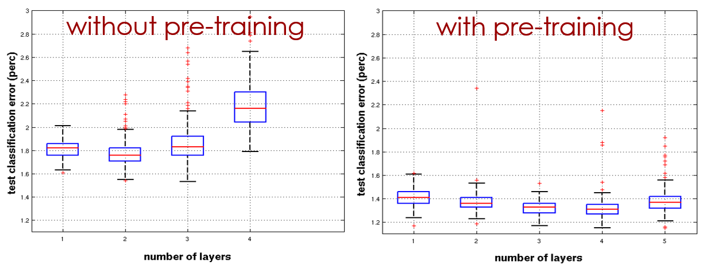
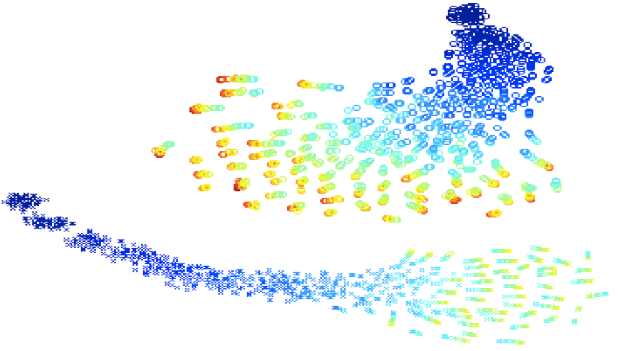
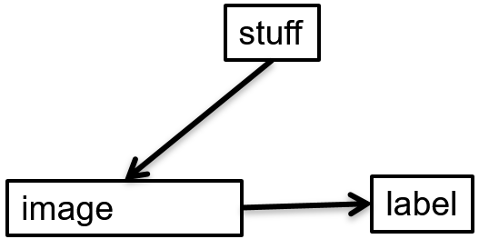
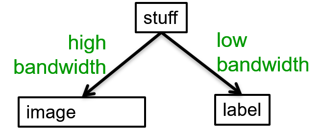

# 14. Generative Adversarial Networks (GANs)
  
## 14.1 Learning layers of features by stacking RBMs

### Lecture Notes

+ Stacking RBMs as deep belief net
  + procedure
    + training a layer of features w/ input directly from the pixels
    + treating the activations of the trained features as if they were pixels and learn features from features
    + repeat the steps
  + each new layer of features by modeling the correlated activity in the feature in the layer below
  + adding another layer of features
    + improving a variatonal lower bound on the log probability of generating the training data
    + complicated proof and only applied to unreal cases
    + proof based on a neat equivalence btw an RBM and an infinitely deep belief net
  + example: combining two RBMs to make a DBN
    + left diagram
      + stacked RBMs $\to$ deep belief net
      + learning RBM ($v \stackrel{w_1}{\longleftrightarrow} h_1$) w/ its own weight
      + once trained, hidden activity patterns as data for the 2nd RBM ($h_1 \stackrel{w_2}{\longleftrightarrow} h_2$)
      + starting the 2nd RBM off w/ $w_2$ being transpose of $w_1$ and same number of hidden units as $v$
      + the 2nd RBM as good model of $h_1 \to$ the 1st RBM upside down $\implies$ bipartite graph (no need to distinguish layers for visible and hidden units)
    + compose both RBMs (left diagram) to form a single model (right diagram)
    + right diagram
      + top two layers = 2nd RBM $\implies$ undirected model w/ symmetric actions
      + bottom two layers = directed model as a sigmoid belief net $\implies$ remove symmetry connection btw $v$ and $h_1 \to$ remove upgoing part
      + not a RBM $\to$ deep belief net
      + lower layers as a sigmoid belief nets while the top two layers forming a RBM $\to$ a hybrid model

    

      
    

+ Generative model w/ 3 layers
  + stacked up 3 RBMs (diagram)
    + $h_2 \stackrel{w_2}{\longleftrightarrow} h_3$ as a RBM
    + $data$ and $h_1$ forming directed layers as in a sigmoid belief nets
  + procedure to generate data
    + get an equilibrium sample from the top-level RBM by performing alternating Gibbs sampling for a long time
      + back and forth btw $h_2$ and $h_3$ to reach equilibrium w/ top-level RBM
      + involving alternating Gibbs sampling
      + update all units in $h_3$ in parallel then update all units in $h_2$ in parallel then ...
    + perform a top-down pass to get states for all the other layers
      + top-level RBM = the prior distribution over $h_2$
      + $h_2 \xrightarrow[\text{generativ connecction}]{w_2} h_1 \xrightarrow{w_1} data \implies$ performing as a belief net
  + the lower bottom-up connections (transposes of corresponding weights) not part of the generative model $\to$ used for inference
  + Gibbs sampling
    + generating posterior samples by sweeping through each variables (or block of variables) to sample from its conditional distribution w/ the remaining variables fixed to their current values
    + a MCMC algorithm for obtaining a sequence of observations, approximately from a specified multivariate probability distribution

  

    
  

+ Averaging factorial distributions
  + average some factorial distributions
    + not a factorial distribution
    + in an RBM, the posterior over 4 hidden units is factorial for each visible vector
  + example
    + 4 units w/ the probabilities to turn on each unit
    + posterior for v1: (0.9, 0.9, 0.1, 0.1)
    + posterior for v2: (0.1, 0.1, 0.9, 0.9)
    + averaged $\neq$ (0.5, 0.5, 0.5, 0.5)
  + consider the binary vector (1, 1, 0, 0)
    + posterior for v1: $p(1, 1, 0, 0) = 0.9 \times 0.9 \times (1-0.1) \times (1-0.1) = 0.9^4 = 0.43$
    + posterior for v2: $p(1, 1, 0, 0) = 0.1^4 = 0.0001$
    + aggregated posterior: $p(1, 1, 0, 0) = 0.215$
  + aggregated posterior: factorial w/ $p=0.5^4 \implies$ aggregated posterior not factorial distribution

+ Mechanism in greedy learning
  + weights, $w$, in the bottom level RBM define many different distribution
    + $p(v|h)$: the probability of visible  units given the hidden units
    + $p(h|v)$: the probability of hidden units given the visible units
    + $p(h)$: the probability of hidden units
    + $p(v)$$: the probability of visible units
  + process and restriction
    + $p(v|h)$ and $p(h|v)$ used for running alternative Markov Chain updates
    + a long sequence of updates $\to$ a sample from the joint distribution of $v$ and $h$
    + the weights also clearly defined the joint distribution
    + the weights also define the joint distribution more directly in terms of $e^{-E}$
    + not for nets w/ a large number of units
    + w/ the joint distribution of $v$ and $h$
      + ignoring $v \to$ distribution for $h$ = the prior distribution defined by this RBM
      + ignoring $h \to$ the prior distribution over $v$ defined by the RBM
  + the RBM models: $p(v) = \sum_h p(h) p(v|h)$
  + $p(v|h)$ fixed, improve $p(h) \implies p(v)$ improved
    + learn new parameters giving a better model of $p(h)$
    + substitute $p(h)$ in stead of the old model out of $p(h) \to$ improve model over  $v$
  + to improve $p(h)$, a better model than $p(h; w)$ of the aggregated posterior distribution over hidden vectors produced by applying $W$ transpose to the data
    + better model $p(h)$: fitting the aggregated posterior better
    + the aggregated posterior: the average over all vectors in the training set of the posterior distribution over $h$
    + using the 1st RBM to get aggregated posterior
    + using the 2nd RBM to build a better model of this aggregated posterior $\to$ 1st RBM reaching a better model
    + start w/ 2nd RBM as the previous but upside down
    + start w/ the same model of the aggregated posterior as the 1st RBM has
    + changing the weights $\implies$ better fit 

+ Contrastive version of the wake-sleep algorithm   after learning many layers of features, fine-tune the features to improve generation
  1. do a stochastic bottom-up pass
    + adjust the top-bottom generative weights of lower layer to be good at reconstructing the feature activities in the layer below
    + a standard wake-sleep algorithm
  2. do a few iterations of sampling in the top level RBM
    + adjust the weights in the top-level RBM using contrasted divergence (CD)
    + working as a regular algorithm for RBM
    + update the weight of the RBM using the difference btw 
      + the correlations when activity first got to that RBM
      + the correlations after a few iterations in that RBM
  3. do a stochastic top-down pass
    + adjust the bottom-up weights to be good at reconstructing the feature activities in the layer above
    + using the directed lower connections to generate some data from that sigmoid belief net
    + the sleep phase of the wake-sleep algorithm
  + differences
    + top-level RBM acts as a much better prior over the top layers than just a layer of units assumed to be independent
    + rather than generating data by sampling from the prior, looking at a training case going up to the top-level RBM and just running a few iterations before generating data

+ Example: Modeling with the DBN on MNIST digits
  + G. Hinton, S. Osindero,, and Y.-W. Teh, [A Fast Learning Algorithm for Deep Belief Nets](https://bit.ly/2wQSqCk), Neural Computation, July 2006
  + first two hidden layers learned w/o labels
    + bottom two layers involved
    + task: modeling all 10 digit classes in images of 28 by 28 pixels (right bottom input box)
    + learning RBM w/o knowing labels $\to$ unsupervised learning
    + taking the patterns of activities in the hidden units
    + treating the patterns of activity as data
    + learn another RBM (2nd hidden layer - 500 units) w/o knowing the labels
  + top layer learned as an RBM for modeling the labels concatenated w/ the features in the second hidden layer
    + adding a big top layer w/ 2000 hidden units (top layer)
    + providing 10 labels (left 2nd top boxes)
    + concatenating those 10 labels w/ the 500 units representing features $\to$ really w/ one softmax unit
    + training top-level RBM to model the concatenation of the softmax unit for the 10 labels w/ the 500 feature activities reproduced by the two layers below
  + fine-tuning weights as a better generative model using contrastive wake-sleep
    + once top layer trained, find-tune the whole system by using a trusty wake-sleep algorithm
    + retain a good generative model

  

    
  

### Lecture Video

 

## 14.2 Discriminative fine-tuning for DBNs

### Lecture Notes

+ Fine-tuning for discrimination
  + learn on layer at a time by staking RBMs
  + treating this as "pre-training"
    + finding a good initial set of weights in a deep neural networks
    + fine-tuning the weights using some local search procedure
    + contrastive wake-sleep: a way of fine-tuning the model to be better at generating the inputs
  + backpropagation used to find-tune the model
    + better than discrimination
    + overcome many of the limitations of standard backpropagation
    + easier to learn deep nets
    + generalizing the nets better

+ Backpropagation better than greedy pre-training
  + the optimization view
    + greedily learning one layer at a time scales well to really big networks, especially locality in each layer
      + example: vision
        + local receptive fields in each layer
        + not much interaction btw widely separate locations
        + very easy to learn a big layer more or less in parallel
    + not starting backpropagation until sensible feature detectors very helpful for the discrimination task
      + initial gradients more sensible than random white noise
      + backpropagation only performing a local search from a sensible starting point
  + the overfitting view
    + pre-trained notes exhibiting much less overfitting
    + most of the information in the final weights from modeling the distribution of input vectors
      + input vectors generally containing a lot more information than the labels
        + labels only containing a few bits of information to constraint the mapping from input to output
        + an image containing a lot of information which will constraint any generative model of a set of images
      + precious information in the labels only used for the fine-tuning
        + at this stage feature detectors decided
        + not squandering precious information designing feature detectors from scratch
    + fine-tuning only modifying the features slightly to get the category boundaries right $\to$ backpropagation not required to discover new features
    + unlabeled training data
      + backpropagation works well
      + still very useful for discovering good features
      + the generative pre-training using a lot of information
    + objection: learning many of the features
      + useless for any particular discriminative task
        + example: net to discriminate btw shape and btw different poses of one shape $\to$ very different features required
        + not knowing task in advance $\implies$ inevitably learning features never used
        + serious objection w/ small computer
      + more useful than the raw inputs

+ Modeling MNIST digits w/ a DBM
  + learning w/ 3 hidden layers of features entirely unsupervised (see diagram)
  + top two layers forming a RBM whose energy landscape should model the low dimensional manifolds of the digits
  + the network learns a density model for unlabeled digit images
  + generating from the model $\to$ get things that look like real digits of all classes
  + hidden features really help w/ digit discrimination?
  + adding a 10-way softmax at the top and the doing backpropagation

  

    
  

  + results on the permutation-invariant MNIST task
    + permutation-invariant: applying a fixed permutation to all the pixels, the same permutation to every test in training case
    + the results w/ the same algorithm but different net structure due to convolutional nets

    | Models | Error Rate |
    |--------|------------|
    | Backpropagation net w/ one or two hidden layers ([Platt](https://bit.ly/39y0kOi); [Hinton](https://bit.ly/2wQSqCk)) | 1.6% |
    | Backpropagaton w/ L2 constraints on incoming weights | 1.5% |
    | Support Vector Machines ([Decoste & Schoelkopf, 2002](https://bit.ly/3aA3IJO)) | 1.4% |
    | Generative model of joint density of images and labels (+ generative fine-tuning) | 1.25% |
    | Generative model of unlabelled digits followed by gentle backpropagation ([Hinton & Salakhutdinov, 2006](https://bit.ly/344vKuE)) | 1.155 $\to$ 1.0% |

+ Unsupervised "pre-training"
  + help for models w/ more data and better priors
  + M. Ranzato, C.S. Poultney, S. Chopra and Y. LeCun. "[Efficient Learning of Sparse Overcomplete Representations with an Energy-Based Model](https://bit.ly/2UN6hSf)". Advances in Neural Information Processing Systems 19 (NIPS 2006)
    + used an additional 600,000 distorted digits
    + used convolutional multilayer neural networks
  + Performance
    + Backpropagation alone: 0.49%
    + Unsupervised layer-by-layer pre-trained followed by backpropagation: 0.39%

+ Phone recognition on the TIMIT benchmark
  + A. Mohamed, G. Dahl, and G. Hinton, [Deep Belief Networks for phone recognition](http://www.cs.utoronto.ca/~gdahl/papers/dbnPhoneRec.pdf), 2009
  + Geoffrey E. Hinton, et al., [Deep Neural Networks for Acoustic Modeling in Speech Recognition: The Shared Views of Four Research Groups](https://bit.ly/3avie5J), IEEE Signal Processing Magazine, 29, November 2012
  + after standard post-processing using a bi-phone model, a deep net w/ 8 layers: 20.7%
  + the best previous speaker-independent result on TIMIT w/ averaging several model: 24.4%
  + Li Deng: the result could change the way speech recognition was done

  

    
  

### Lecture Video

 

## 14.3 What happens during discriminative fine-tuning?

### Lecture Notes

+ Learning dyanmic of deep nets
  + Dumitru Erhan, Yoshua Bengio, Aaron Courville, Pierre-Antoine Manzagol, Pascal Vincent, Samy Bengio, [Why Does Unsupervised Pre-training Help Deep Learning?](https://bit.ly/2yg8A8z), Journal of Machine Learning Research, 2010
  + Receptive fields of the first hidden layer of feature detectors
    + after generative pre-training but before fine-tune (left diagram)
    + after fine-tuning (right diagram)
    + no significant changes with and w/o pre-training
    + changes helping discrimination
  + effect of unsupervised pre-training: pre-training reducing the test errors for network
    + task: discriminating btw digits in a very large set of distorted digits
    + after backpropagation of fine-tuning (left - 1 hidden layer: w/o pre-training, right - 4 hidden layers: w/ pre-training)
      + the network w/ pre-training almost always did better than the networks w/o pre-training
      + the improvement even bigger w/ deeper network $\to$ no overlap btw two distributions
  + effect of depth
    + depicted classification error and variation classification error
    + changing the number of layers
      + w/o pre-training: 2 layers as the best (left diagram)
      + w/ pre-training:
        + layers (4 < 3 < 2 < 5 < 1): 4 layers the best
        + much less variation w/ lower errors
  + trajectories of the learning in function space
    + 2D visualization w/ t-SNE
    + point = a model in function space
      + comparing weight vectors $\to$ useless
      + two nets might differ by having two of the hidden units work around
      + behaving the same way w/ very different weights
      + comparing the function implemented rather than the weight vectors
      + procedure
        + having a suite test cases and observing their output
        + concatenate outputs into a great long vector
      + two networks producing very similar points on all test cases
      + plotting the concatenated output vectors w/ t-SNE
    + color = epoch
      + the stages of the training
      + initial stages in dark blue
      + all cases moving toward roughly the same direction
    + top portion: trajectories w/o pre-training $\to$ each trajectories converges to a different local min
    + bottom portion: trajectories w/ pre-training $\to$ different region of function space but more similar
    + no overlap!

  

    
  

    

+ Mechanism of unsupervised pre-training
  + sequential image-label pairs (left diagram)
    + generating an image and then attaching a label to it $\to$ independent of the stuff
    + contingent on the image itself irrelevant w/ the stuff
    + the label depending on the pixels in the image
    + trying and leaning a mapping to go straight from images to labels
    + e.g., do the pixels have even parity?
  + parallel image-label pairs (right diagram)
    + generating image and label in pair
    + the label depending on the stuff in the world rather than the pixels of the image
    + high bandwidth required from stuff to image ( more bits) while low bandwidth required from stuff to label
    + to recover the label:
      + inverting the high bandwidth pathway to get back to the stuff producing the image
      + recovered stuff generating the image to decide what label it would be given
    + much more plausible model of how to assign names to things in images
    + justifying the procedure:
      + having pre-training phase to discover the underlying causes of the images
      + followed by a descriptive phase to get the underlying label where slightly fine-tune the mapping from the image to the underlying causes

  

    

### Lecture Video

 

## 14.4 Modeling real-valued data with an RBM

### Lecture Notes

### Lecture Video

 

## 14.5 RBMs are infinite sigmoid belief nets

### Lecture Notes

### Lecture Video

 

