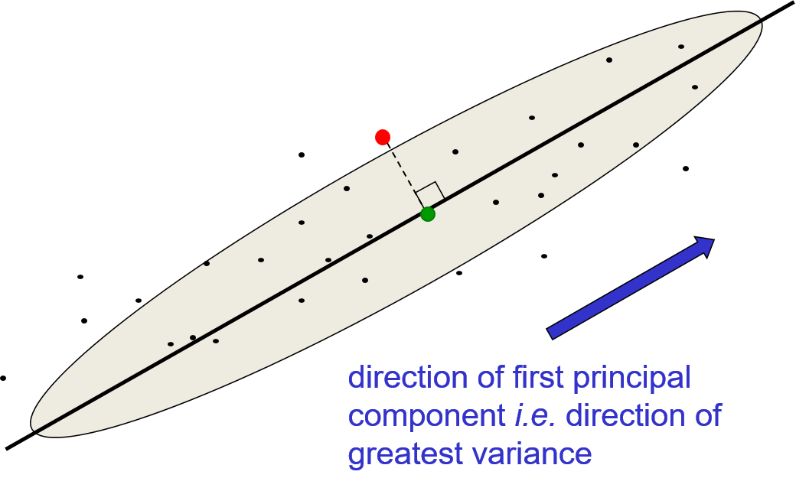
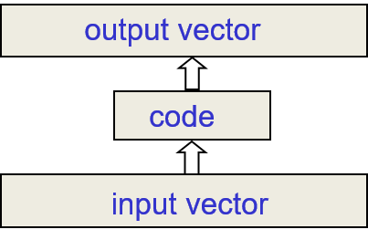
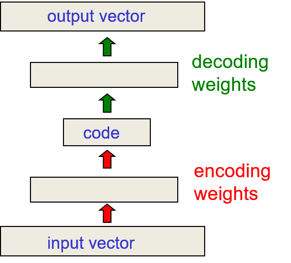
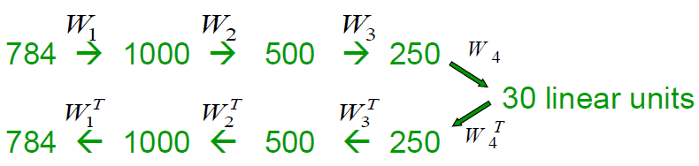
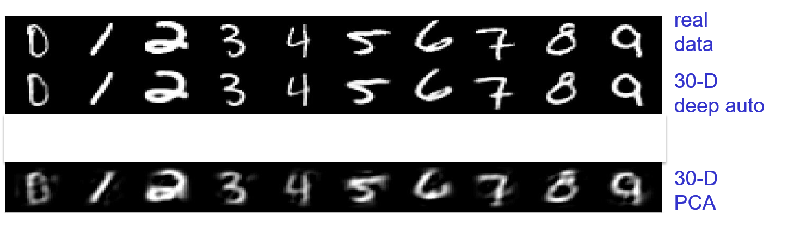
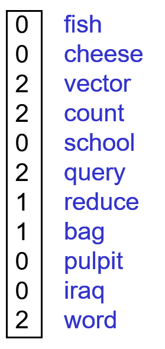
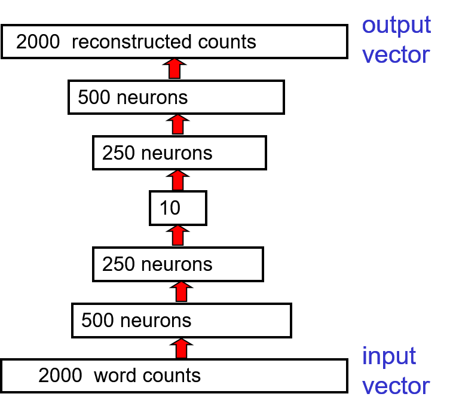
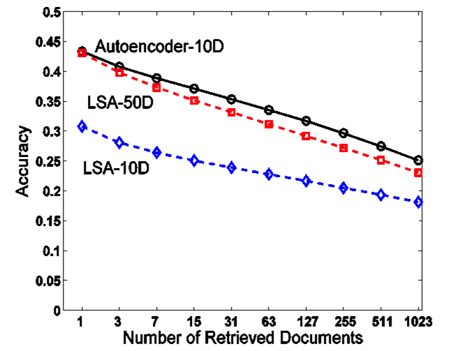
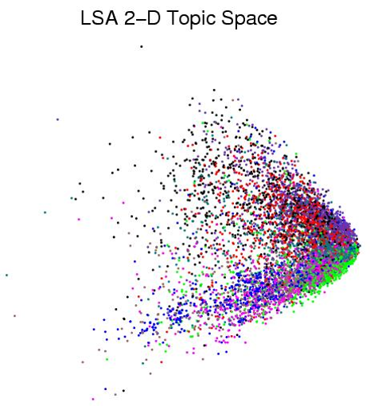
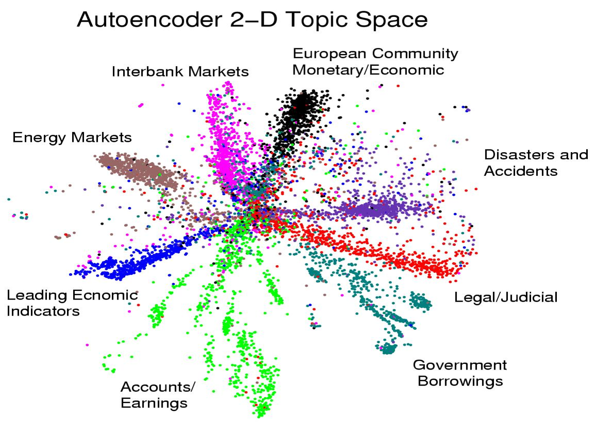

# 15. Hierarchical Structure with Neural Networks

## 15.1 From principal components analysis to autoencoders

### Lecture Notes

+ Principal Components Analysis (PCA) -Intro
  + widely used technique in signal processing
  + higher dimensional data represented by a much lower dimensional code
  + situation: a data lying a linear manifold in the high dimensional space
  + task: finding a data manifold and projecting the data onto the manifold = representation on the manifold $\to$ orthogonal directions not variation much in the data $\implies$ not losing much information
  + operation:
    + standard principal components methods: efficient
    + neural network w/ one linear hidden layer and linear output layer: inefficient
  + advantage of using neural networks:
    + generalizing the technique by using deep neural networks where the code is a nonlinear function of the input
    + reconstructing the data from the code as a nonlinear function of the input vector
    + able to deal w/ curved manifold in the input space

+ Principal Components Analysis
  + finding the $M$ orthogonal directions
    + $\exists\; N$-dimensional data, representing the data w/ less than $N$ numbers, said $M$
    + the direction where data w/ the most variance
    + ignoring the directions where the data not varying much
    + $M$ principal directions forming a lower-dimensional subspace
    + representing an $N$-dimensional datapoint by its projections onto the $M$ principal directions
    + losing all information about where the datapoint located in the remaining orthogonal directions but not much
  + reconstructing by using the mean value (over all the data)
    + the mean value w/ $N-M$ directions not represented w/ $M$ orthogonal directions
    + reconstruction error = sum over all these unrepresented directions of the squared differences of the datapoint from the mean
  + example: PCA w/ $N=2$ and $M=1$ (see diagram)
    + 2-dimensional data distributed according to an elongated Gaussian
    + the ellipse: a kind of one standard deviation contour of the Gaussian
    + the green point on PC directions representing the data on the red point
      + using PCA w/ a single component
      + the component as the direction in the data w/ greatest variance
      + representing the red point = representing how far along that direction
      + $\therefore$ representing the projection of the red point onto that line; i.e., the green point
    + reconstruction of the red point: an error equal to the squared difference btw red and green points
      + using all the mean values of the data points ignored
      + representing a point on the black line
      + the loss on the construction = the squared difference btw the red point and the green point
      + the loss = the difference btw the data point and the mean values of all the data in the direction ignored
      + minimizing the loss = choosing to ignore the directions w/ less variance

  

    
  

+ Implementing PCA w/ backpropagation
  + inefficient implementation
  + task: making output = the input in a network w/ a central bottleneck
    + making a network in which the output of the network as the reconstruction of input
    + trying to minimize the squared error in the reconstruction
    + the network w/ a central bottleneck
    + $\exists\; M$ hidden units corresponding to the principal components
    + input vector projected to the code vector
    + from code vector to construct the output vector
    + goal: making the output vector as similar as the input vector

    

      
    

  + efficient code = the activities of the hidden units $\to$ the bottleneck
    + the activities of the hidden unit forming a bottleneck
    + the code vector = a compressed representation of the input vector
  + linear hidden and output layers $\implies$ autoencoder
    + autoencoder
      + learning hidden units w/ a linear function of the data
      + minimizing the squared reconstruction error
    + exactly what PCA does
      + exact the same reconstruction error as PCA does
      + not necessary w/ hiddent units corresponding exactly to the principal components
  + $M$ hidden units
    + spanning the same space at the first $M$ components found by PCA
    + weight vectors probably not orthogonal
    + tending to have equal variances
    + probably rotating and skewing of those axes
    + the incoming vectors of code units $\neq$ the directions of the components $\implies$ orthogonal
    + the space spanned by the incoming weight vectors of those code units = the space spanned by the $M$ principal components
    + $\therefore\;$ the networks $\equiv$ principal components
    + performance: the stochastic gradient descent learning for the network < PCA algorithm

+ Generalizing PCA w/ backpropagation
  + purpose: generalizing PCA
    + able to represent data w/ a curved manifold rather than a linear manifold in a high dimensional space
  + adding nonlinear layers before and after the code: encoding and decoding weights
    + encoder: converting coordinates in the input space to coordinates on the manifold
    + decoder: inverting the mapping of encoder
    + nonlinear layers: possibly efficiently representing data that lies on or near a nonlinear manifold
  + learned $\to$ mapping on both directions  
  + network architecture (see diagram)
    + adding one ore more layers of nonlinear hidden units, typically using logistic units
    + the code layer: linear units
    + following a one or more layers of nonlinear units
    + output layer trained as similar as possible to the input vector
    + using supervisor learning algorithm to do unsupervised learning

  

    
  

### Lecture Video

 

## 15.2 Deep Autoencoders

### Lecture Notes

+ Prior works
  + developed in 1980s
  + unable to train them significantly better than PCA
  + various publications w/o good demonstrations of impressive performance
  + applying pre-training deep networks layer-by-layer to pre-training deep autoencoders

+ Deep autoencoders
  + always looking like a nice way to do nonlinear dimensional reduction
    + providing flexible mapping both ways
    + mapping able to be nonlinear
    + linear (or better) learning time in the number of training cases
    + final encoding model: fairly compact and fast $\impliedby$ multiplication of matrices for each layer
  + difficulties
    + very difficult to optimize deep autoencoders using backpropagation
    + small initial weights $\to$ backpropagation gradient vanished
  + Solutions
    + unspervised layer-by-layer pre-training
    + initializing the weights carefully as in Echo-state nets

+ Deep autoencoders on MNIST digits
  + G. E. Hinton*, R. R. Salakhutdinov, [Reducing the Dimensionality of Data with Neural Networks](https://bit.ly/2xbMHXZ), Science, 28 Jul 2006
  + network architecture: (see diagram)
    + starting w/ images w/ 784 pixels
    + encoding the pixels via 3 hidden layers into 30 real-value activities in a central code layer
    + decoding those 30 real-valued activities back to 784 reconstructed pixels
    + using a stack of RBMs to initialize the weights used for encoding ($W_1, W_2, W_3, W_4$)
    + taking the transpose over those weights to initialize the decoding network ($W_4^T, W_3^T, W_2^T, W_1^T$)
    + training a stack of 4 RBM's and then unrolling them
    + fine-tuning w/ gentle backpropagation to minimize the reconstruction error
    + using cross-entropy error due to logistic units
  + comparisons of methods for compressing digit images to 30 real numbers
    + real data
    + 30-D deep autoencoder
    + 30D PCA

  

    
  

### Lecture Video

 

## 15.3 Deep autoencoders for document retrieval and visualization

### Lecture Notes

+ Introduction
  + applying deep autoencoders to document retrieval
  + method: latent semantic analysis (LSA)
  + applying PCA to vector of word counts extracted from the documents
  + the codes
    + produced by latent semantic analysis
    + used for judging similarity btw documents
  + $\therefore\;$ used for document retrival
  + expecting much better codes using a deep autoencorder than using latent semantic analysis
  + results:
    + 10 components extracted w/ a deep autoencoders > 50 documents extracted w/ linear method like latent semantic analysis
    + 2 components to visualize documents as a point in a 2D map > the first two principal components

+ Modeling similarity of documents
  + converting each documents into a "bag of words"
    + a vector of word counts ignoring order
      + throwing away a lot of information
      + retaining a lot of information about the topic of the document
    + ignoring stop words (like "the" or "over")
      + not containing much information about the topic
    + example: counting for various words (see diagram)
      + the counts for the document on the bottom
      + nonzero counts for the words telling the information about the document
  + comparison the word counts of the query document and millions of other documents
    + issue: too slow $\impliedby$ involving big vectors
    + solution: reducing each query vector to a much smaller vector
    + the vector still containing most of the information about the content of the document

  

    
  

+ Mechanism to compress the count vector
  + deep autoencoder architecture
    + compressing 2000 word counts $\to$ 10 real numbers
    + reconstructing the 10 numbers back to the 2000 words
  + training the neural network to reproduce its input vector as its output
  + forcing the net to compress as much information as possible into the 10 numbers in the central bottleneck
  + comparing documents w/ these 10 numbers

  

    
  

+ reconstructing bag of words w/ non-linearity
  + word counts not the same as pixels or real values
  + word frequency in the document
    + dividing the counts in a bag of words vector by $N$
    + $N$ = the total number of non-stop words in the document
    + result: probability vector = the probability of getting a particular word if picking a non-stop word at random from the document
  + using softmax at the output of the autoencoder
    + probability vector $:=$ the desired outputs of the softmax
  + training the first RBM in the stack by using the same trick
    + $N$ observations from the probability distribution
    + treating the word counts as probabilities
    + making the visible to hidden weights $N$ times bigger than the hidden to visible
    + input = probabilities $\implies$ very small activities fir the first hidden layer

+ Performance of the autoencoder at document retrieval
  + autoencoder settings:
    + bags of words: 2000
    + training cases: 400,000
    + type: business documents
    + label: $\sim$ 100 categories
    + output: softmax w/ 2000 ways
  + training procedure
    + first train a stack of RBMs
    + fine-tune w/ backpropagation
  + testing on a separate 400,000 documents
    + picking a document as query
    + ranking order all the other test documents by using the cosine of the angle btw codes
    + repeating the process for the 400,000 documents $\to$ requiring 0.16 trillion comparisons
  + plotting the number of retrieved documents against the proportion
    + the proportion in the same hand-labeled class as the query document
    + comparing w/ LSA (a version of PCA)
      + not a very good measure of the quality of the retrieval
  + Performance plottings
    + left diagram: Retrieval performance on 400,000 Reuter new stories - The fraction of retrieved documents in the same class as the query when a query document from the test set is used to retrieve other test set documents, averaged over all 402,207 possible queries.
    + middle diagram: First compress all documents to 2 numbers using PCA on $\log(1+count)$. Then use different colors for different categories.
    + right diagram: First compress all documents to 2 numbers using deep auto. Then use different colors for different document categories

  

    
  

### Lecture Video

 

## 15.4 Semantic hashing

### Lecture Notes

### Lecture Video

 

## 15.5 Learning binary codes for image retrieval

### Lecture Notes

### Lecture Video

 

## 15.6 Shallow autoencoders for pre-training

### Lecture Notes

### Lecture Video

 

