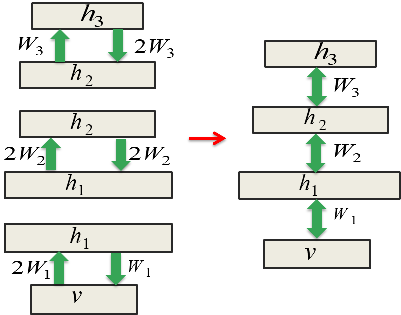
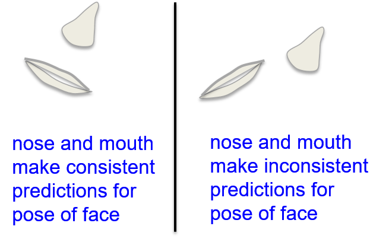
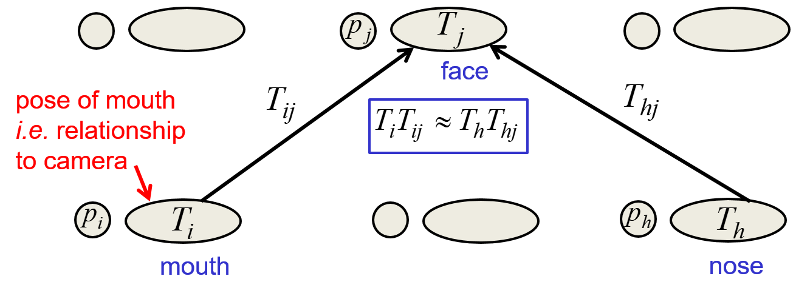

# 16. Deep Neural Networks
  
## 16.1 Learning a joint model of images and captions

### Lecture Notes

+ Modeling the joint density of images and captions
  + N. Srivastava and R. Salakhutdinov, [Multimodal Learning with Deep Boltzmann Machines](https://tinyurl.com/wzsknt8), NIPS 2012
  + goal: to build a joint density model of captions and standard computer vision feature vectors extracted from real photographs
  + issue: requiring more computation than building a joint density model of labels and digit images
  + procedure:
    + training a multilayer model of images
      + a multilayer model of the features extracted from images
      + using standard computer vision features
    + training a separated multilayer model of word-count vectors from the captions
    + adding a new top layer connected to the top layers of both individual models
      + using further joint training of the whole system
      + allowing each modality to improve the earlier layers of other modality
  + using a deep Boltzmann machine (DBM)
    + instead of using a deep belief net
    + symmetric connection btw all pairs of layers
    + further joint training of the whole DBM allows each modality to improve the earlier layers of the other modality $\to$ using a DBM
    + able to use a DBM and done generative fine-tuning w/ contrastive wake-sleep
    + fine-tuning algorithm probably working better for DBM
  + effect of pre-training on the hidden layers of the DBM
    + standard pre-training on a composite model w/ RBM $\to$ not DBM
    + combining a stack of RBM $\to$ a deep belief network

+ Combining 3 RBMs to make a DBM
  + combining a stack of pre-trained RBMs $\to$ DBM
  + network architecture (see diagram)
    + the top and bottom RBMs pre-trained w/ the weights in one direction twice as big as in the other direction
      + named scale symmetric
      + the bottom RBM trained w/ bottom-up weights being twice as big as the top-down weights
      + the top RBM trained the bottom-up weights w/ half of the top-down weights
    + the middle layers: geometric model averaging
      + trained w/ symmetric weights
    + combining these RBMs to a composite model
      + RBMs in the middle simply halved its weights
      + bottom RBM weights:  halved the up-going weights = the down-poing weights
      + top RBM weights: halved the down-going weights = the top-going weights
  + rough explanation for scale symmetric
    + separated RBMs
      + $h_1$ w/ two different ways to infer the states of the units in $h_1$ in the stack of RBM on the left
      + inferring the states of $h_1$ either bottom-up from $v$ or top-down from $h-2$
      + combining middle and bottom RBMs by taking average of these two weights of inferring $h_1$
      + taking geometric average by halving the weights
      + using half of the bottom-up model, %2W_1/2$
      + same applied to middle and top RBMs
    + combined model
      + given states of $h_2$ or $v$ $\implies$ states of $h_1$
      + halving weights to prevent the double counts
      + the state of $H_2$ depending on $v$
      + using the bottom-up input from the 1st RBM and the top-dowm input from 2nd RBM $\to$ counting evidence twice
      + inferring $h_1$ from $v$ and inferring it from $h_2$, depending on $v$

  

    
  

### Lecture Video

 

## 16.2 Hierarchical coordinate frames

### Lecture Notes

+ Approaches to recognizing objects
  + deep convolutional neural network
  + parts based approach
  + existing features used for computer vision to
    + extract from images
    + make histograms
    + use a lot of hand enginerring

+ Disadvantages of convolutional neural networks
  + pooling the activities of a bunch of replicated feature detectors $\to$ losing the position of the feature detector
  + pooling
    + losing the precise spatial relationship btw higher-level parts such as a nose and a mouth
    + precise spatial relationships required for identity recognition
    + partial solution: overlapping the pools
      + feature occurring in several pools
      + retaining more information about its position
  + only translations to replicated features detectors
    + unable to extrapolate their understanding of geometric relationships to radically new viewpoints, such as different orientations or scales
    + human good at extrapolation
    + seeing new shape $\to$ recognizing it from a different viewpoint
  + approach w/ convolutional neural networks
    + training viewpoints on transformed data
    + huge training sets w/ orientations, scales and lighting $\to$ coping w/ the variations
    + clumsy way to dealing w/ variantions

+ The hierarchical coordinate frame approach
  + a group of neurons to represent the conjunction of
    + the shape of a feature: neurons telling features of objects, such as nose and mouth
    + the pose relative to the retina
      + the relationship btw the coordinate frame of the retina
      + the intrinsic coordinate frame of the feature
      + should embed a coordinate frame within it
  + recognizing larger features by using the consistency of the poses of their parts
    + representation of the pose of parts of objects relative to retina
    + easier to use relationships btw parts and recognize larger objects
    + using the poses of the parts as a cue for recognizing a larger shape
  + example: nose and mouth
    + left diagram:
      + nose and mouth w/ the right spatial relationship to one another
      + using mouth or nose to predict the pose of whole face $\to$ similar prediction
    + right diagram:
      + nose and mouth w/ wrong spatial relationship
      + making prediction separately about the pose of the whole face $\to$ not agreed

  

    
  

+ Two layers in a hierarchy of parts
  + a higher level visual entity
    + several level visual entities agreeing on their predictions for its pose
    + inverse computer graphics
  + network model
    + larger parts recognized by consistent predictions from smaller parts
    + $T_j$: a collection of neurons $\to$ recognizing the pose of the whole face
    + $p_j$: a single logistic neuron to representing whether or not a face there
    + similar neurons to represent the mouth, $T_i$, and nose, $T_h$
    + recognizing the face by noticing that those two representations make consistent predictions
      + taking a vector of activities to represent the pose of the mouth
      + multiplying by a matrix $T_{ij}$ to represent the spatial relationship btw a mouth and a face
      + obtaining the prediction $T_i T_{ij}$ for the pose of the face
    + same procedure for nose to get $T_h T_{hj}$
    + $T_iT_{ij} \approx T_hT_{hj} \implies$ the nose and the mouth w/ righ spatial relationship
  + inverse computer graphics
    + knowing the pose of the face $\implies$ computed by using inverse of $T_{ij}$; same as nose
    + computer graphics: from poses of larger things to poses of their parts
    + computer vision: from the poses of the parts to the poses of the larger things
    + verifying the consistency btw them

  

    
  

+ A crucial property of the pose vectors
  + able to get neural network to represent these pose vectors, vectors of neural activities $\to$ property
  + property: modeling spatial transformation w/ linear operations
    + easier to learn a hierarchy of visual entities
    + easier to generalize across viewpoints
  + issue: small changes in viewpoint $\to$ the pose vectors of neural activities changed
  + invariant geometric properties of a shape
    + invariant in the weights, not in the activities
      + weights representing the relationship btw a part and a whole
      + e.g., $T_{ij}$ not depending on viewpoint
      + to get the invariant properties of a shape into a weights
      + changing viewpoint  $\to$ all those pose vectors in the activities changed
      + getting neural activities invariant to viewpoint = the pooling in a convolution neural network behaved
    + equivariant activities
      + varying the pose of the object $\implies$ varying activities
      + goal: getting neural activities equivariant = the pose of the object varying the activities of the neurons vary = the percept of an object not its label but its appearance
    + changing the viewpoint $\implies$ changing the percept of an object

+ Imposing coordinate frames in order to represent shapes
  + proposed by Irvin Rock, The Logic of Perception ([Wikipedia](https://tinyurl.com/w8ktgqr))
  + evidence of visual systems to represent shapes
  + What country is this? Hint: Sarah Palin (left diagram)
  + the square and the diamond: very different percepts $\to$ different properties
    + perceiving as a tilted square $\to$ acutely  sensitive to whether the angles are right angles
    + perceiving as an upright diamond $\to$ not sensitive to the angle
      + the angles probably 5 degrees off and not noticed
      + sensitive to whether the corners on the left and on the right w/ the same height
  + representing shapes $\to$ imposing coordinate frames on them
    + square or diamond: the same thing in appearance but the percepts totally different
    + depending on what coordinate frame imposing

  

    
  

### Lecture Video

 

## 16.3 Bayesian optimization of neural network hyperparameters

### Lecture Notes

### Lecture Video

 

## 16.4 The fog of progress

### Lecture Notes

### Lecture Video

 

