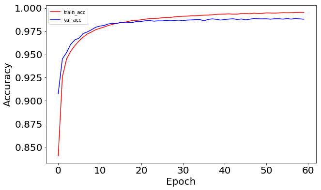
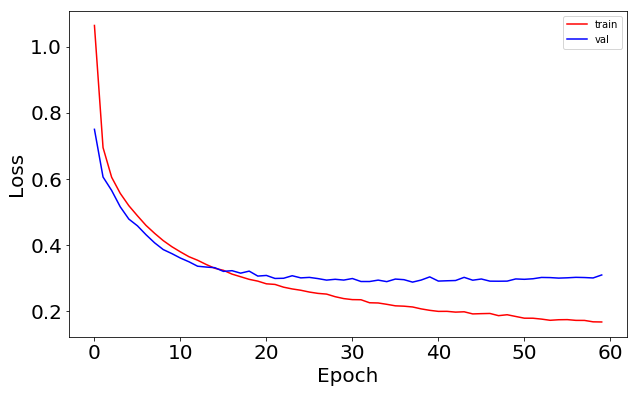

# Simple Guide to Hyperparameter Tuning in Neural Networks

Matthew Stewart

URL: https://towardsdatascience.com/simple-guide-to-hyperparameter-tuning-in-neural-networks-3fe03dad8594


## Beale's Function

+ [Beale's function](https://en.wikipedia.org/wiki/Test_functions_for_optimization)
  + one of many test functions commonly used for studying the effectiveness of various optimization techniques
  + a test function accesses how well the optimization algorithms perform when in flat regions with very well shallow gradients

  <div style="margin: 0.5em; display: flex; justify-content: center; align-items: center; flex-flow: row wrap;">
    <a href="https://towardsdatascience.com/simple-guide-to-hyperparameter-tuning-in-neural-networks-3fe03dad8594" ismap target="_blank">
      
    </a>
  </div>

  + Optimizing a function $f: A \rightarrow R$, from some set A to the real numbers is finding an element $x_0 \in A$ such that $f(x_0) \leq f(x)$ for all $x \in A$ (finding the minimum) or such that $f(x_0) \geq f(x)$ fro all $x \in A$ (finding the maximum).
  + Formula:

    $$f(x,, y) = (1.5 -x +xy)^2 + (2.25 -x + xy^2)^2 + (2.625 - x +xy^3)^2$$

    Answer: $(x, y) = (3, 0.5)$

+ Artificial landscape
  + find a way of comparing the performance of various algorithms
    + Convergence (how fast they reach the answer)
    + Precision (how close do they approximate the exact answer)
    + Robustness (so they perform well for all functions or just a small subset)
    + General performance (e.g., computational complexity)
  + analogous to the loss surface of a neural network
  + goal of NN training: find the global minimum on the loss surface by performing some form of optimization - typically stochastic gradient

+ Code for Beale's function

  ```python
  # define Beale's function which we want to minimize
  def objective(X):
      x = X[0]; y = X[1]
      return (1.5 - x + x*y)**2 + (2.25 - x + x*y**2)**2 + (2.625 - x + x*y**3)**2

  # function boundaries
  xmin, xmax, xstep = -4.5, 4.5, .9
  ymin, ymax, ystep = -4.5, 4.5, .9

  # Let's create some points
  x1, y1 = np.meshgrid(np.arange(xmin, xmax + xstep, xstep), np.arange(ymin, ymax + ystep, ystep))

  # initial guess
  x0 = [4., 4.]  
  f0 = objective(x0)
  print (f0)
  # 68891.203125

  bnds = ((xmin, xmax), (ymin, ymax))
  minimum = minimize(objective, x0, bounds=bnds)

  print(minimum)
  #      fun: 2.0680256388656271e-12
  # hess_inv: <2x2 LbfgsInvHessProduct with dtype=float64>
  #      jac: array([ -1.55969780e-06,   9.89837957e-06])
  #  message: b'CONVERGENCE: NORM_OF_PROJECTED_GRADIENT_<=_PGTOL'
  #     nfev: 60
  #      nit: 14
  #   status: 0
  #  success: True
  #        x: array([ 3.00000257,  0.50000085])

  real_min = [3.0, 0.5]
  print (f'The answer, {minimum.x}, is very close to the optimum as we know it, which is {real_min}') 
  print (f'The value of the objective for {real_min} is {objective(real_min)}')
  # The answer, [ 3.00000257  0.50000085], is very close to the optimum as we know it, which is [3.0, 0.5]
  # The value of the objective for [3.0, 0.5] is 0.0
  ```


## Optimization in Neural Networks

+ Neural network: a framework combines inputs and tries to guess the outputs

+ Optimization procedure: the network guesses, calculates some error function, guesses again, trying to minimize the error, guesses again, until the error does not go down any more

+ Object function: used in gradient descent is the loss function to minimize


### A Keras Refresher

+ Keras
  + a Python library for deep learning that can run on top of both Theano or TensorFlow, tow powerful Python libraries for fast numerical computing created and released by Facebook and Google, respective
  + developed to make developing deep learning models as fast and easy and easy as possible for research and practical applications
  + built on the idea of a model
  + Sequential model: a sequence of layers, a linear stack of layers

+ Summarize the construction of deep learning models in Keras using the Sequential model
  1. Define model: create a Sequential model and add layers
  2. Compile model: specify loss function and optimizers and call the `.compile()` function
  3. Fit model: train the model on data by calling the `.fit()` function
  4. Make prediction: use the model to generate predictions on new data by calling functionbs such as `.evaluate()` or `.predict()`


### Callbacks: taking a peek into our model while it's training

+ Callbacks
  + how to examine the performance of the model
  + what happening in various stages of the model
  + a set of functions to be applied at given stages of the training procedure
  + get a view on internal states and statistics of the model during training
  + pass a list of callbacks (as the keyword arguments callbacks) to the `.fit()` method of th eSequential or Model classes

+ Relevant methods of the callbacks at each stage of the training
  + `keras.callbacks.History()`: a callback function automatically included in `.fit()`
  + `keras.callbacks.ModelCheckPoint` saves the model with its weights at a certain point in the training; e.g., a good practice to save the model weights only when an improvement is observed as measured by the `acc`
  + `keras.callbacks.EarlySStopping`: stop the training when a monitored quantity has stopped improving
  + `keras.callbacks.LearningRateScheduler`: change the learning rate during training

+ Keras documentation: [Usage of Callbacks](https://keras.io/callbacks/)

+ Example Code

  ```python
  import tensorflow as tf
  import keras
  from keras import layers
  from keras import models
  from keras import utils
  from keras.layers import Dense
  from keras.models import Sequential
  from keras.layers import Flatten
  from keras.layers import Dropout
  from keras.layers import Activation
  from keras.regularizers import l2
  from keras.optimizers import SGD
  from keras.optimizers import RMSprop
  from keras import datasets

  from keras.callbacks import LearningRateScheduler
  from keras.callbacks import History

  from keras import losses
  from sklearn.utils import shuffle

  print(tf.VERSION)
  print(tf.keras.__version__)

  # fix random seed for reproducibility
  np.random.seed(5)
  ```


### Step 1 - Deciding on the network topology

+ The MNIST dataset
  + consist of grayscale images of handwritten digits (0-9) whose dimension is 28x28 pixels
  + each pixel is 8 b its si its value ranges from 0~255

+ Sample Code

```python
#mnist = tf.keras.datasets.mnist
mnist = keras.datasets.mnist
(x_train, y_train),(x_test, y_test) = mnist.load_data()
x_train.shape, y_train.shape
# (60000, 28, 28)
# (60000, 1)

plt.figure(figsize=(10,10))
for i in range(10):
    plt.subplot(5,5,i+1)
    plt.xticks([])
    plt.yticks([])
    plt.grid(False)
    plt.imshow(x_train[i], cmap=plt.cm.binary)
    plt.xlabel(y_train[i])

x_train[45].shape
x_train[45, 15:20, 15:20]

print(f'We have {x_train.shape[0]} train samples')
print(f'We have {x_test.shape[0]} test samples')
```


#### Preprocessing the data

+ Preprocess the data
  + make the 2D image arrays into 1D (flatten them); using array reshaping with `numpy.reshape()`; the `keras.layers.Flatten` transforms the format of the images from a 2d-array (of 28 by 28 pixels), to a 1D-array of 28*28 = 784 pixels.
  + normalize the pixel values (give them values between 0 and 1) using 

    $$x := \frac{x - x_{min}}{x_{max} - x_{min}}$$

+ Sample code

```python
# normalize the data
x_train, x_test = x_train / 255.0, x_test / 255.0

# reshape the data into 1D vectors
x_train = x_train.reshape(60000, 784)
x_test = x_test.reshape(10000, 784)

num_classes = 10

x_train.shape[1]

# Convert class vectors to binary class matrices
y_train = keras.utils.to_categorical(y_train, num_classes)
y_test = keras.utils.to_categorical(y_test, num_classes)

y_train[0]
```


### Step 2 - Adjusting the `learning rate`

+ Stochastic Gradient Descent (SGD)
  + one of the most common optimization algorithms
  + hyperparameters obtained: learning rate, momentum, decay, and nesterov
    + learning rate: control the weight at the end of each batch
    + momentum: control how much to let the previous update influence the current weight update
    + delay: indicate the learning rate decay over each update
    + nesterov: take the value "True" or "False" depending on whether Nesterov momentum applied

  + Typical values for hyperparameter: $lr = 0.01$, $decay = 1e^{-6}$, $momentum = 0.9$, and nesterov = True

+ Learning rate hyperparameter
  + default learning rate scheduler of Keras in the SGD optimizer that decreases the learning rate during the stochastic gradient descent optimization algorithm
  + formula:

    $$lr = lr \times 1/(1 + decay * epoch)$$

  <div style="margin: 0.5em; display: flex; justify-content: center; align-items: center; flex-flow: row wrap;">
    <a href="http://cs231n.github.io/neural-networks-3/" ismap target="_blank">
      
    </a>
  </div>

  + Implement a learning rate adaption schedule in Keras
    + a learning rate value = 0.1
    + train the model for 60 epochs
    + decay = 0.0016 (0.1/60)
    + momentum = 0.8

+ Sample code

  ```python
  epochs=60
  learning_rate = 0.1
  decay_rate = learning_rate / epochs
  momentum = 0.8

  sgd = SGD(lr=learning_rate, momentum=momentum, decay=decay_rate, nesterov=False)

  # build the model
  input_dim = x_train.shape[1]

  lr_model = Sequential()
  lr_model.add(Dense(64, activation=tf.nn.relu, kernel_initializer='uniform', 
                  input_dim = input_dim)) 
  lr_model.add(Dropout(0.1))
  lr_model.add(Dense(64, kernel_initializer='uniform', activation=tf.nn.relu))
  lr_model.add(Dense(num_classes, kernel_initializer='uniform', activation=tf.nn.softmax))

  # compile the model
  lr_model.compile(loss='categorical_crossentropy', optimizer=sgd, metrics=['acc'])

  %%time
  # Fit the model
  batch_size = int(input_dim/100)

  lr_model_history = lr_model.fit(x_train, y_train, batch_size=batch_size, epochs=epochs,
                      verbose=1, validation_data=(x_test, y_test))

  # plot the loss function
  fig, ax = plt.subplots(1, 1, figsize=(10,6))
  ax.plot(np.sqrt(lr_model_history.history['loss']), 'r', label='train')
  ax.plot(np.sqrt(lr_model_history.history['val_loss']), 'b' ,label='val')
  ax.set_xlabel(r'Epoch', fontsize=20)
  ax.set_ylabel(r'Loss', fontsize=20)
  ax.legend()
  ax.tick_params(labelsize=20)

  # plot the accuracy
  fig, ax = plt.subplots(1, 1, figsize=(10,6))
  ax.plot(np.sqrt(lr_model_history.history['acc']), 'r', label='train')
  ax.plot(np.sqrt(lr_model_history.history['val_acc']), 'b' ,label='val')
  ax.set_xlabel(r'Epoch', fontsize=20)
  ax.set_ylabel(r'Accuracy', fontsize=20)
  ax.legend()
  ax.tick_params(labelsize=20)
  ```

  <div style="margin: 0.5em; display: flex; justify-content: center; align-items: center; flex-flow: row wrap;">
    <a href="https://towardsdatascience.com/simple-guide-to-hyperparameter-tuning-in-neural-networks-3fe03dad8594" ismap target="_blank">
      
      
    </a>
  </div>


#### Apply a custom learning rate change using `LearningRateScheduler`

+ A function performs the exponential learning rate decay as indicated by the formula:

  $$lr = lr0 \times e^{(-kr)}$$

  ```python
  input_dim = x_train.shape[1]
  num_classes = 10
  batch_size = 196

  # build the model
  exponential_decay_model = Sequential()
  exponential_decay_model.add(Dense(64, activation=tf.nn.relu, kernel_initializer='uniform',
    input_dim = input_dim))
  exponential_decay_model.add(Dropout(0.1))
  exponential_decay_model.add(Dense(64, kernel_initializer='uniform', activation=tf.nn.relu))
  exponential_decay_model.add(Dense(num_classes, kernel_initializer='uniform', activation=tf.nn.softmax))

  # compile the model
  exponential_decay_model.compile(loss='categorical_crossentropy',  optimizer=sgd,  metrics=['acc'])

  # define the learning rate change
  def exp_decay(epoch):
      lrate = learning_rate * np.exp(-decay_rate*epoch)
      return lrate

  # learning schedule callback
  loss_history = History()
  lr_rate = LearningRateScheduler(exp_decay)
  callbacks_list = [loss_history, lr_rate]

  # you invoke the LearningRateScheduler during the .fit() phase
  exponential_decay_model_history = exponential_decay_model.fit(x_train, y_train, batch_size=batch_size,
          epochs=epochs, callbacks=callbacks_list, verbose=1, validation_data=(x_test, y_test))

  # check on the variables that can show me the learning rate decay
  exponential_decay_model_history.history.keys()
  # dict_keys(['val_loss', 'val_acc', 'loss', 'acc', 'lr'])

  fig, ax = plt.subplots(1, 1, figsize=(10,6))
  ax.plot(exponential_decay_model_history.history['lr'] ,'r') #, label='learn rate')
  ax.set_xlabel(r'Epoch', fontsize=20)
  ax.set_ylabel(r'Learning Rate', fontsize=20)
  #ax.legend()
  ax.tick_params(labelsize=20)
  ```

  <div style="margin: 0.5em; display: flex; justify-content: center; align-items: center; flex-flow: row wrap;">
    <a href="https://towardsdatascience.com/simple-guide-to-hyperparameter-tuning-in-neural-networks-3fe03dad8594" ismap target="_blank">
      
    
    </a>
  </div>


### Step 3 - Choosing an optimizer and a loss function

+ goal of optimization: efficiently calculate the parameters/weights that minimize the loss fucntion

+ [types of loss functions in keras](https://github.com/keras-team/keras/blob/master/keras/losses.py)
  + MSE = mean_squared_error
  + MAE = mean_absolute_error
  + MAPE = mean_absolute_percentage_error
  + MSLE = mean_squared_logarithmic_error
  + KLD = kullback_leibler_divergence
  + cosine = cosine_proximity

+ Distance
  + sometimes the 'loss' function measures the 'distance'
  + types of distance
    + Euclidean
    + Manhattan
    + Hamming distance: distances between strings, e.g., H('carolin', 'cathrin') = 3
  + types of loss fucntions
    + MSE (for regression)
    + categorical cross-entropy (for classification)
    + binary cross entropy (for classification)

+ Sample code

  ```python
  # build the model
  input_dim = x_train.shape[1]

  model = Sequential()
  model.add(Dense(64, activation=tf.nn.relu, kernel_initializer='uniform', 
                  input_dim = input_dim)) # fully-connected layer with 64 hidden units
  model.add(Dropout(0.1))
  model.add(Dense(64, kernel_initializer='uniform', activation=tf.nn.relu))
  model.add(Dense(num_classes, kernel_initializer='uniform', activation=tf.nn.softmax))

  # defining the parameters for RMSprop (I used the keras defaults here)
  rms = RMSprop(lr=0.001, rho=0.9, epsilon=None, decay=0.0)

  model.compile(loss='categorical_crossentropy', optimizer=rms, metrics=['acc'])
  ```


### Step 4 - Deciding on the batch szie and number of epochs

+ batch size: the number of samples propagated through the network

+ Example:
  + batch size = 100
  + take the first 100 samples (1st~100th) from the training dataset and trains the network
  + take the second 100 samples (101st~200th) and trains the network again

+ advantages od using a batch size < number of all samples
  + less memory: using fewer samples, the overall training procedure requires less memory
  + train faster with mini-batches: update the weights after each propagation

+ Disadvantages of using a batch size < number of all samples
  + the smaller the batch the less accurate the estimate of the gradient will be

+ epoch
  + number of epochs: a hyperparameter defines the number times that the learning algorithm will work through the entire training dataset
  + one epoch: each sample in the training dataseet has had an opportunity to update the internal model parameters

+ Sample code

  ```python
  %%time
  batch_size = input_dim
  epochs = 60

  model_history = model.fit(x_train, y_train, batch_size=batch_size, epochs=epochs, verbose=1,
      validation_data=(x_test, y_test))

  score = model.evaluate(x_test, y_test, verbose=0)
  print('Test loss:', score[0])
  print('Test accuracy:', score[1])
  # Test loss: 0.09620895183624088
  # Test accuracy: 0.9761

  fig, ax = plt.subplots(1, 1, figsize=(10,6))
  ax.plot(np.sqrt(model_history.history['acc']), 'r', label='train_acc')
  ax.plot(np.sqrt(model_history.history['val_acc']), 'b' ,label='val_acc')
  ax.set_xlabel(r'Epoch', fontsize=20)
  ax.set_ylabel(r'Accuracy', fontsize=20)
  ax.legend()
  ax.tick_params(labelsize=20)

  fig, ax = plt.subplots(1, 1, figsize=(10,6))
  ax.plot(np.sqrt(model_history.history['loss']), 'r', label='train')
  ax.plot(np.sqrt(model_history.history['val_loss']), 'b' ,label='val')
  ax.set_xlabel(r'Epoch', fontsize=20)
  ax.set_ylabel(r'Loss', fontsize=20)
  ax.legend()
  ax.tick_params(labelsize=20)
  ```

  <div style="margin: 0.5em; display: flex; justify-content: center; align-items: center; flex-flow: row wrap;">
    <a href="url" ismap target="_blank">
      
      
    </a>
  </div>


### Step 5 - Random restarts

+ Not implemented in Keras

+ Easily done by altering `keras.callbacks.LearningRateScheduler`

+ Resetting the learning rate after a specified number of epoch for a finite number of times


## Tuning Hyperparameters using Cross-Validation

+ Use `GridSearchCV` from Scikit-Learn to try out several values for hyperparameters and compare the results

+ Cross-validation with `keras`
  + use the wrappers for the Scikit-Learn API
  + Provide a way to use Sequential Keras models (single-input only) as part of Sckikit-Learn workflow
  + wrappers
    + Scikit-Learn classifier interface: `keras.wrappers.scikit_learn.KerasClassifier(build_fn=None, **sk_params)`
    + Scikit-Learn regressor interface: `keras.wrappers.scikit_learn.KerasRegressor(build_fn=None, **sk_params)`

+ Sample code

  ```python
  import numpy
  from sklearn.model_selection import GridSearchCV
  from keras.wrappers.scikit_learn import KerasClassifier
  ```


### Trying Different Weight Initializations

+ the first hyperparameter to optimize via cross-validation is different weight initializations

+ Sample code

  ```python
  # let's create a function that creates the model (required for KerasClassifier) 
  # while accepting the hyperparameters we want to tune 
  # we also pass some default values such as optimizer='rmsprop'
  def create_model(init_mode='uniform'):
      # define model
      model = Sequential()
      model.add(Dense(64, kernel_initializer=init_mode, activation=tf.nn.relu, input_dim=784))
      model.add(Dropout(0.1))
      model.add(Dense(64, kernel_initializer=init_mode, activation=tf.nn.relu))
      model.add(Dense(10, kernel_initializer=init_mode, activation=tf.nn.softmax))
      # compile model
      model.compile(loss='categorical_crossentropy', optimizer=RMSprop(), metrics=['accuracy'])
      return model

  %%time
  seed = 7
  numpy.random.seed(seed)
  batch_size = 128
  epochs = 10

  model_CV = KerasClassifier(build_fn=create_model, epochs=epochs,
                            batch_size=batch_size, verbose=1)
  # define the grid search parameters
  init_mode = ['uniform', 'lecun_uniform', 'normal', 'zero', 
              'glorot_normal', 'glorot_uniform', 'he_normal', 'he_uniform']

  param_grid = dict(init_mode=init_mode)
  grid = GridSearchCV(estimator=model_CV, param_grid=param_grid, n_jobs=-1, cv=3)
  grid_result = grid.fit(x_train, y_train)

  # print results
  print(f'Best Accuracy for {grid_result.best_score_} using {grid_result.best_params_}')
  means = grid_result.cv_results_['mean_test_score']
  stds = grid_result.cv_results_['std_test_score']
  params = grid_result.cv_results_['params']
  for mean, stdev, param in zip(means, stds, params):
      print(f' mean={mean:.4}, std={stdev:.4} using {param}')

  # Best Accuracy for 0.9689333333333333 using {'init_mode': 'lecun_uniform'}
  #  mean=0.9647, std=0.001438 using {'init_mode': 'uniform'}
  #  mean=0.9689, std=0.001044 using {'init_mode': 'lecun_uniform'}
  #  mean=0.9651, std=0.001515 using {'init_mode': 'normal'}
  #  mean=0.1124, std=0.002416 using {'init_mode': 'zero'}
  #  mean=0.9657, std=0.0005104 using {'init_mode': 'glorot_normal'}
  #  mean=0.9687, std=0.0008436 using {'init_mode': 'glorot_uniform'}
  #  mean=0.9681, std=0.002145 using {'init_mode': 'he_normal'}
  #  mean=0.9685, std=0.001952 using {'init_mode': 'he_uniform'}
  ```


### Save Neural Network Model to JSON


### Cross-Validation with more than one hyperparameters


