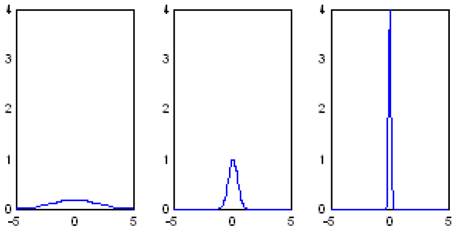
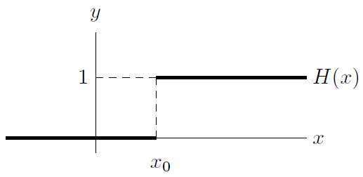

# Delta Functions

Author: Drew Rollins

[URL](http://www.cchem.berkeley.edu/chem120a/extra/delta_functions.pdf)

Date: Aug, 27, 2006

## Introduction

+ Delta function
  + used to "select" the value of a function interested
  + $f(x)$ at some specific location in the respective function's domain
  + i.e., to evaluate $f9x)$ at some pint $x = x_0$
  + two kinds: by placing $f9x)$ next to appropriate delta function inside of 
    + Dirac Delta (1): an integral
    + Kronecker Delta (2): within a summation

    \[f(x_0) = \int_{-\infty}^{\infty} dx \,\delta(x - x_0)f(x) \tag*{(1)}\]

    \[a_n = \sum_i \delta_{in} a_i \tag*{(2)}\]

## Kronecker Delta

+ Definition of Kronecker Delta function

  \[\delta_{ij} = \begin{cases} 1 & i = j \\ 0 & i \neq j \end{cases} \tag*{(3)}\]

+ Typical usage: often appear inside a summation next to a vector, e.g, $\vec{a} = (4, 5, 6)$.

  \[\sum_{i=1}^3 a_i = a_1 + a_2 + a_3 = 4 + 5 + 6 = 15\]

  Let $j=2$ and $i$ as a "dummy variable" for indexing or $i=2$ and $j$ as a dummy variable

  \[
    \begin{align*}
      \sum_{i=1}^3 a_i \delta_{i2} &= a_1\delta_{12} + a_2 \delta_{22} + a_3 \delta_{32} = 4 \times 0 + 5 \times 1 + 6 \times 0 = 5 \\
      \sum_{j=1}^3 a_i \delta_{2j} &= a_1\delta_{12} + a_2 \delta_{22} + a_3 \delta_{32} = 4 \times 0 + 5 \times 1 + 6 \times 0 = 5 
    \end{align*}
  \]

+ __property__. Simplify

  \[\sum_k \delta_{ik}\delta{kj} = \delta_{ij}\]

+ Application: vector inner product

  Let vectors $\vec{a} = (a_1, a_2, a_3)$ and $\vec{b} = (b_1, b_2, b_3)$, Their inner product

  \[\vec{a} \cdot \vec{b} = \sum_{i=1}^{3} a_ib_j = \sum_{i=1}^3 \sum_{j=1}^3 a_i b_j \delta_{ij}\]

## Dirac Delta

+ Definition of Dirac Delta Function

  \[\delta(x) = \begin{cases} \infty & x = 0 \\ 0 & \text{otherwise}\end{cases} \tag*{(4)}\]

  The value at which the delta function become infinite can be controlled by substituting $x - x_0$ for $x$

  \[\delta(x - x_0) = \begin{cases} \infty & x=x_0 \\ 0 & \text{otherwise} \end{cases} \tag*{(5)}\]

+ Example: The Dirac Delta function as the limit of a normalize Gaussian as the width fores to zero

  \[\delta(x) = \lim_{\sigma \rightarrow\ 0} \frac{1}{\sigma \sqrt{2\pi}} e^{-\frac{x^2}{2\sigma^2}} \tag*{(6)}\]

  + Squeezing down a normalized gaussian

    

      
    

    + squeezed in the width the height has to increase
    + $x \rightarrow 0 \implies y \rightarrow \infty$, but the totally area is always 1

+ Alternative definition

  \[ \int_{-\infty}^{\infty} f(x) \delta(x - x_0) dx = f(x_0) \tag*{(7)}\]

  + continuous around $x=x_0$
  + most common way used for the dirac delta function

+ __Exercise__: Using the definition of a Dirac Delta function given in Eq.(9), prove that the Dirac Delta function as to be normalized, i.e., prove

  \[\int_{-\infty}^{\infty} \delta(x) dx = 1\]

+ Representation: the Dirac Delta function = the derivative of the step (Heaviside) function

  

    
  

  + $\text{slope} = \begin{cases} \infty & x=x_0 \\ 0 & \text{otherwise} \end{cases}$

+ __Property__.

  \[\int_{-\infty}^{\infty} f(x) \delta(x - x_0)dx = f(x_0) \\ \delta(ax) = \frac{1}{|a|} \delta(x)\]

