# Fast Learning Algorithms

P. Rojas, [Chapter 8](http://page.mi.fu-berlin.de/rojas/neural/chapter/K8.pdf) in [Neural Networks - A Systematic Introduction](http://page.mi.fu-berlin.de/rojas/neural/), 1996

  <a href="http://page.mi.fu-berlin.de/rojas/neural/chapter/K8.pdf" ismap target="_blank">
    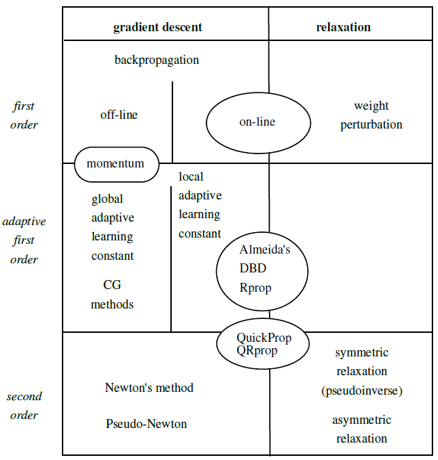
  </a>

## 8.1 Introduction - Classical backpropagation

+ The reasons to explore the combinations of new algorithm in learning algorithms
  + backpropagation algorithms
  + artificial neural networks

+ Backpropagation algorithm
  + a rather slow learning algorithm
  + malicious selection of parameters made even slower
  + non-linear optimization: accelerate the training method with practically no effort

+ Artificial neural networks
  + NP-complete in the worst cases
  + network parameters grow exponentially w/ the number of unknown

+ Standard online backpropagation performs better than many fast learning algorithms when
  + a realistic level of complexity in the learning task
  + the size of the training set beyond a critical threshold

### 8.1.1 Backpropagation with momentum

+ Momentum method
  + minimizing the error function: wide oscillation of the search process w/ the gradient descent
  + traditional gradient descent: computed for each new combination of weights
  + momentum approach: compute the negative gradient direction a weighted average of the current gradient and the previous correction direction for each step
  + Example: a network w/ two weights $w_1$ and $w_2$

  

    <a href="http://page.mi.fu-berlin.de/rojas/neural/chapter/K8.pdf" ismap target="_blank">
      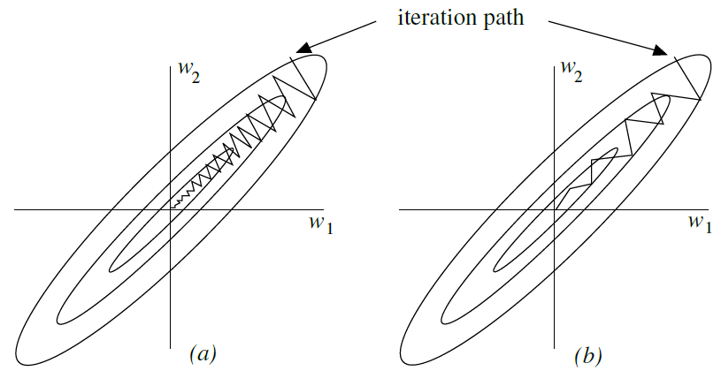
    </a>
  

  + accelerating convergence: increasing the learning rate up to an optimal value
  + purpose: allowing the attenuation of oscillations in the iteration process

+ Mathematical representation
  + A network with $n$ different weights $w_1, w_2, \dots, w_n$
  + Assumption and Notations
    + $E$: the error function
    + $\gamma$: the learning rate
    + $\alpha$: the momentum rate
    + 
  + The $i$-th correction for weight $w_k$

    \[\Delta w_k(i) = -\gamma \, \frac{\partial E}{\partial w_k} + \alpha \, \Delta w_k (i-1)\]

+ Optimization
  + optimal parameters highly depends on the learning task
  + no general strategy to deal with the problem
  + tradeoffs: choosing the a specific learning and momentum rates
  + observing the oscillating behavior on backpropagation feedback rule and large momentum rates

#### The linear associator

+ Linear associator
  + a single computing element with associated weights $w_1, w_2, \dots, w_n$
  + input: $x_1, x_2, \dots, x_n$
  + output: $w_1x_1 + w_2x_2 + \cdots + w_n x_n$

  

    <a href="http://page.mi.fu-berlin.de/rojas/neural/chapter/K8.pdf" ismap target="_blank">
      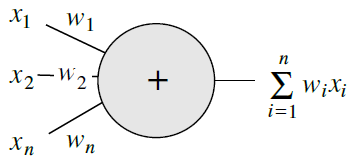
    </a>
  

+ Mathematical Representation
  + Assumptions & Notations
    + $(\mathbf{x_1}, y_1), (\mathbf{x_2}, y_2), \dots, (\mathbf{x_p}, y_p)$: the input-output $p$ ordered pairs
    + $\mathbf{x}$: vector of input patterns w/ $n$-dimensional rows
    + $\mathbf{w}$: vector of the weights of the linear associator w/ $n$-dimensional columns
    + $\mathbf{X}$: a $p \times m$ matrix w/ $\mathbf{x_1}, \mathbf{x_2}, \dots \mathbf{x_p}$ as rows
    + $\mathbf{y}$: a column vector of the scalars $y_1, y_2, \dots, y_p$
  + the learning task objective: minimize the quadratic error

    \[\begin{align*}
    E &= \sum_{i=1}^{n} \| \mathbf{x_i} \cdot \mathbf{w} - y_i \|^2 \\
      &= \| \mathbf{X}\mathbf{w} - \mathbf{y} \|^2 = (\mathbf{X}\mathbf{w} - \mathbf{y})^T(\mathbf{X}\mathbf{w} - \mathbf{y}) \\
      &= \mathbf{w}(\mathbf{X}^T \mathbf{X})\mathbf{w} -2 \: \mathbf{y}^T\mathbf{X}\mathbf{w} + \mathbf{y}^T\mathbf{y}
    \end{align*}\]

  + the lengths of the principal axes: determined by the magnitude of the eigenvalues of the correlation of matrix $\math{X}^T\mathbf{X}
  + gradient descent: most effective w/ the same length when the principal axes of the quadratic form

+ Example: quadratic function $ax^2 + b y^2$
  + iteration rule of the gradient descent w/ the $x$ and $y$ direction, respectively
  
    \[\begin{align*}
      \Delta x(i) &= -2 \, \gamma \, a x + \alpha \, \alpha x(i-1) \\
      \Delta y(i) &= -2 \, \gamma \, b x + \alpha \, \alpha y(i-1)
    \end{align*}\]

  + an optimal parameter combination
    + in the $x$ direction: $\gamma = 1/2a$ and $\alpha = 0$
    + in the $y$ direction: $\gamma = 1/2b$ and $\alpha = 0$
  + Example
    + The number of iterations needed to find the minimum of the error function to a given precision as a function of $\gamma$, when $a = 0.9$ nd $b = 0.5$.
    + optimal value: $\gamma = 0.7$ at the intersection of the two curves.
    + oscillations in $y$ direction $\rightarrow$ slow convergence in $x$ direction

    

      <a href="http://page.mi.fu-berlin.de/rojas/neural/chapter/K8.pdf" ismap target="_blank">
        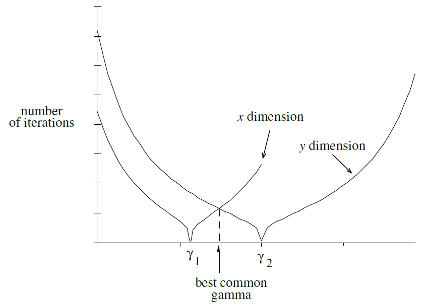
      </a>
    

#### Minimizing oscillations

+ Eigenvlaues in the correlation matrix $\mathbf{X}^T\mathbf{X}$
  + the eigenvalues $\rightarrow$ the lengths of the principal axes of the error function
  + the range of possible values of $\gamma$ reduces as one of these eigenvalues much larger than the others

+ Example: $kx^2$
  + optimal learning rate: $\gamma = 1/2k$
  + the rate $\gamma = 1/k \rightarrow$ oscillation btw the initial point $x_0$ and $-x_0$
  + $\gamma > 2/k \rightarrow$ "explosion" of iteration process

+ Convergence and Divergence zones
  + parameters combinations in the boundary btw regions: stable oscillations
  + $\gamma > 4 \cdot 2/k$: not balanced with any value of $\alpha$
  + $\gamma > 1$: a geometric explosion of the iteration process
  + $1/k < \gamma < 2/k$: stable oscillation; the boundaries between regions
  + $\gamma < 1/2k$: optimal convergence speed w/ a unique $\alpha$
  + jagged line: the optimal combinations of $\gamma$ and $\alpha$
  + issue: With certain direction in weight space, the principle axis of the error function is much smaller compared to another axes.
  + solution: a compromise by adjusting the momentum rate such that the direction w/ less oscillating and improving convergence speed
  + the compromise could be dominated by a single direction w/ $n$ axes in weight space

  

    <a href="http://page.mi.fu-berlin.de/rojas/neural/chapter/K8.pdf" ismap target="_blank">
      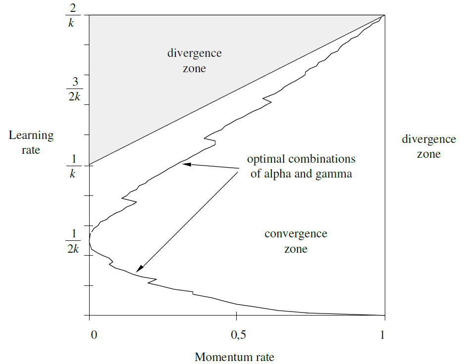
    </a>
  

#### Critical parameter combinations

+ Backpropagation: choosing a learn rate $\gamma$ w/o any previous knowledge of the correlation matrix of the input

+ Conservative approach: choosing a very small learning rate

+ In case of a correlation matrix $\mathbf{X}^T\mathbf{X}$ with some very large eigenvalues, a given choice of $\gamma$ could led to divergence in the associated direction in weight space.

+ Error function in weight space
  + Paths for backpropagation learning w/ linear associator (left figure)
    + the minimum of the error function located at the origin
    + some paths in a 2-dim weight space for several associated trained with momentum rates to one and different $\gamma$ values
    + a momentum rate equal to one precludes convergence of the iteration process
    + difficult to adjust the learning and momentum rate in the nonlinear case
    + the divergence regions of the quadratic case: oscillatory regions
  + Bounded nonlinear error function and the result of several iterations (right figure)
    + the possible shape of the error function for a linear associator w/ sigmoid output and oscillation process for this kind of error function in the one-dim case
    + jagged curve w/ nonlinear neural networks
    + oscillation: 
      + large momentum rates
      + excessively large $\gamma$ w/o momentum

  

    <a href="http://page.mi.fu-berlin.de/rojas/neural/chapter/K8.pdf" ismap target="_blank">
      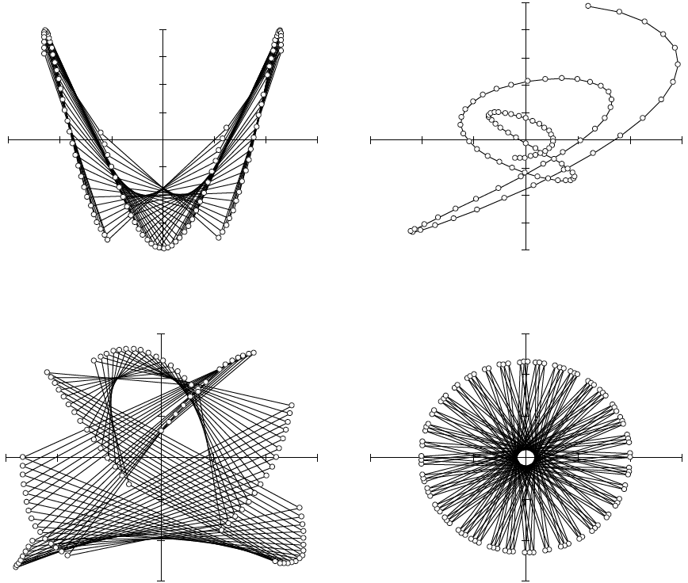
      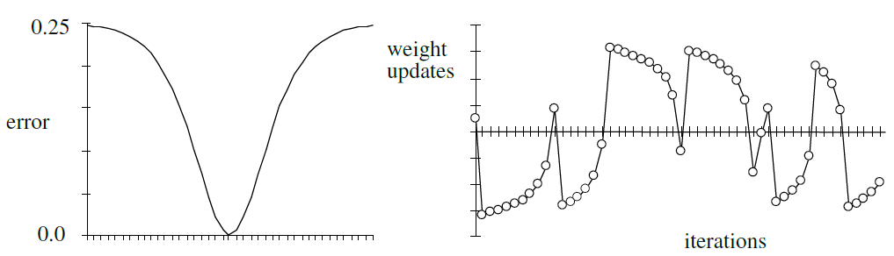
    </a>
  

+ learning rate considerations
  + too small: possible to get stuck in local minima
  + too big: possible oscillatory traps

+ Remedy
  + adaptive learning rates
  + statistical preprocessing of the learning set w/ decorrelation; ie. no excessively large eigenvalues of the correlation matrix

### 8.1.2 The fractal geometry of backpropagation

+ standard backpropagation
  + very sensitive to the initial learning rate
  + path: fractal in weight space
    + the form based on the learning rate
    + a threshold value for which the attractor of the iteration path is dense in a region of weight space around a local minimum of the error function

#### The Gauss-Jacobi and Gauss-Seidel methods and backpropagation

+ online backpropagation
  + not converge to a single point in weight space
  + oscillation around the minimum of the error function
  + expected value of the derivation based on the learning step size used
  + linear associator = Iterated Function System [Barnsley, M. (1988), Fractals Everywhere, Academic Press, London.]

+ Visualization online & offline backpropagation approach
  + three input-output patterns

    \[\begin{align*}
      x_1^1 w_1 + x_2^1 w_2 & = y_1 \tag{1}\\
      x_1^2 w_1 + x_2^2 w_2 & = y_2 \tag{2}\\
      x_1^3 w_1 + x_2^3 w_2 & = y_3 \tag{3}
    \end{align*}\]

  + intersect at the same point: using Gaussian elimination
  + not intersect the same point: no exact solution but ask for the combination of $w_1$ and $w_2$ to minimize the quadratic error
  + minimal cumulative quadratic distance to the three sides of the triangle (left figure)
  + the Gauss-Jacobi and Gauss-Seidel methods (middle figures)
  + Gauss-Jacobi method
    + starting at some point in search space
    + projecting the point in the directions of the axes on the two lines considered
    + next iteration point: the $x$-coordinate of the horizontal projection & $y$-coordinate of the vertical projection
  + Gauss-Seidel method
    + dealing with each line equation individually
    + 1st projection in the $x$ direction
    + 2nd projection in the $y$ direction
    + usually converge faster than the Gauss-Jacobi method
  + Online backpropagation (middle figures)
    + the error function

      \[\frac{1}{2}(x_1^1w_1 + x_2^1 w_2 - y_1)^2\]

    + the gradient (w.r.t. $w_1$ and $w_2$) is $(x_1, x_2)$
    + the Gauss-Siedel method w/ a learning constant
  + Offline backpropagation (middle figure)
    + iterating by adding the corrections for each pattern
    + the corrections in the direction normal to each linear constraint
    + the new iteration point obtained by combining them
    + similar to the Gauss-Jacobi method of linear algebra
  + the size of learning constant determining whether the iteration stops short of reaching the linear constant or goes beyond it

  

    <a href="http://page.mi.fu-berlin.de/rojas/neural/chapter/K8.pdf" ismap target="_blank">
      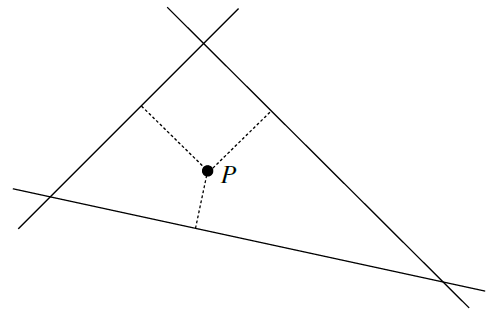
      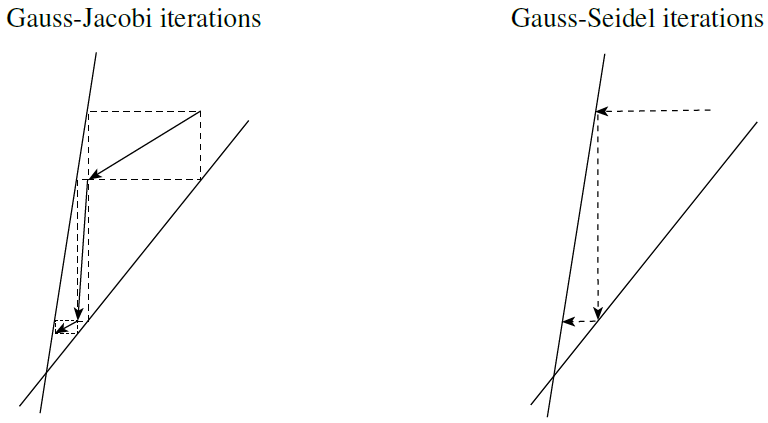
      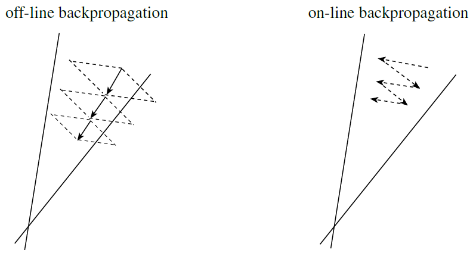
    </a>
  

+ Nonlinear activation function: sigmoid
  + online propagation always moves in the direction normal to the constraints
  + the length of the search step is multiplied by the derivative of the sigmoid

  

    <a href="http://page.mi.fu-berlin.de/rojas/neural/chapter/K8.pdf" ismap target="_blank">
      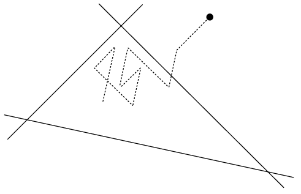
    </a>
  

#### Iterated Function Systems (IFS)

+ a set of affine transformations in a metric space producing fractal structures when applied repetitively to a compact subset of points and its subsequenct images

+ Iterated Function Systems
  + Assumptions & Notations
    + $\mathbf{X}$: a space of points
    + $\mathbf{x} = (x_1, x_2, \dots, x_n)$: a point $\in \mathbf{X}$
    + $d$: a metric in the space
    + $h_i \; : \; X \rightarrow X, i = 1, 2, \dots, N$: a set of affine contraction mappings
    + $\mathbf{M}$: a matrix for transformation
    + $\mathbf{t}$: a vector for transformation
    + given a nonvoid compact subset $A_0$ of points of $X$
    + $a_0$: any point belonging to the attractor
    + $h_k$: affine transformation selected randomly from the IFS
    + $\{a_n\}$: a dense subset of the attractor
  + recursive formula for new image subsets

    \[A_{n+1} = \bigcup_{j=1}^N h_j(A_n), \text{ for } n = 1, 2, \dots\]

  + attractor of the IFS: the sequence $\{A_n\}$ converging to a fixed point
  + Collage Theorem: given any nonvoid compact subset $X$, always find an IFS whose associated attractor can arbitrarily approximate the given subset under a suitable metric
  + The transformation

    \[\mathbf{x} \rightarrow \mathbf{M}\mathbf{x} + \mathbf{t}\]

    + contractive if the determinant of $\mathbf{M} < 1$

  + The sequence $a_n$

    \[a_{n+1} = h_k(a_n)\]

    therefore, able to produce a good graphical approximation of the attractor oof the IFS w/ simple randomized method

+ fractal: online backpropagation on linear associator $\rightarrow$ a set of affine transformations applied in the course of the learning process either randomly or in a fixed sequence

#### Online Backpropagation and IFS

+ Assumptions & Notations
  + a linear associator
  + $\mathbf{x^1}, \mathbf{x^2}, \dots, \mathbf{x^p}$: the $p \; n$-dim patterns
  + $y^1, y^2, \dots, y^p$: the targets of training set
  + $w_1, w_2, \dots, w_n$: the weights of the linear associator
  + $\gamma$: the learning constant
  + $\mathbf{M_j}$: the matrix w/ elements $m_{ik} = x_i^j x_k^j$ for $i, k = 1, \dots, n$
  + $\mathbf{t_j}$: the column vector w/ components $x^j, y^j$ for $i = 1, \dots, n$
  + \mathbf{I}$: the identity matrix
  + $l$: the distance to the hyperplane w/ a given point $(w_1^{\prime}, w_2^{\prime}, \cdots, w_n^{\prime})$ in weight space

+ The error function for pattern $j$

  \[E_j = \frac{1}{2} \left(w_1 x_1^j + w_2 x_2^j + \cdots + w_n x_n^j - y^j \right)^2 \]

+ The correction for each weight $w_i, i = 1, \dots, n$

  \[\begin{align*}
    w_i & \rightarrow w_i - \gamma \, x_i^j (w_1 x_1^j + w_2 x_2^j + \cdots + w_n x_n^j - y^j) \\
      & \rightarrow w_i - \gamma \left(w_1 x_i^j x_1^j + w_2 x_i^j x_2^j + \cdots + w_n x_i^j x_n^j \right) - \gamma \, x_i^j y^j \tag{4}
  \end{align*}\]

+ Weight Vectorization

  \[\begin{align*}
    \mathbf{w} & \rightarrow \mathbf{I}\mathbf{w} - \gamma \mathbf{M_j} \mathbf{w} - \mathbf{t_j} \\
      & \rightarrow (\mathbf{I} - \gamma \mathbf{M_j})\mathbf{w} - \mathbf{t_j}
  \end{align*}\]

+ Affine transformation
  + mapping the current point in weight space into a new one
  + each pattern in the training set: a different affine transformation of the current point $(w_1, w_2, \dots, w_n)$

+ Online backpropagation w/ a randomly selected input patterns
  + the initial point in weight space transformed by a randomized IFS algorithm
  + the sequence of updated weights approximates the attractor of th IFS defined by the input patterns
  + the iteration path in the weight space is a fractal

+ The square of the distance $l$ of a given point $(w_1^{\prime}, w_2^{\prime}, \cdots, w_n^{\prime})$ to the hyperplane $w_1 x_1^j + w_2 x_2^j + \cdots + w_n x_n^j = y^j$

  \[l^2 = \frac{(w_1^\prime x_1^j + w_1^\prime x_2^j + \cdots + w_1^\prime x_n^j - y^j)^2}{(x_1^j)^2 + (x_2^j)^2 + \cdots + (x_n^j)^2}\]

+ Learning rate
  + Each propagation step amounts to displacing the current point in weight space in the direction normal to the hyperplane defined by the input and target patterns.
  + learning rate $\gamma$ for $j$-th pattern

    \[\gamma = \frac{1}{(x_1^j)^2 + (x_2^j)^2 + \cdots + (x_n^j)^2} \tag{5}\]

  + any value of $\gamma$ below this threshold displaces the iteration path just a fraction of the distance to the hyperplane.
  + the iteration path thus remains trapped in a certain region of weight space near to the optimum.

## 8.2 Some simple improvements to backpropagation

### 8.2.1 Initial weight selection

### 8.2.2 Clipped derivatives and offset term

### 8.2.3 Reducing the number of floating-point operations

### 8.2.4 Data decorrelation

## 8.3 Adaptive step algorithms

### 8.3.1 Silva and Almeida´s algorithm

### 8.3.2 Delta-bar-delta

### 8.3.3 RPROP

### 8.3.4 The Dynamic Adaption Algorithm

## 8.4 Second-order algorithms

### 8.4.1 Quickprop

### 8.4.2 Second-order backpropagation

## 8.5 Relaxation methods

### 8.5.1 Weight and node perturbation

### 8.5.2 Symmetric and asymmetric relaxation

### 8.5.3 A final thought on taxonomy

### 8.6 Historical and bibliographical remarks

