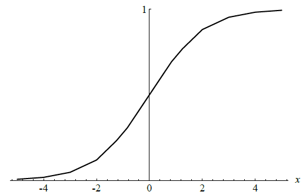
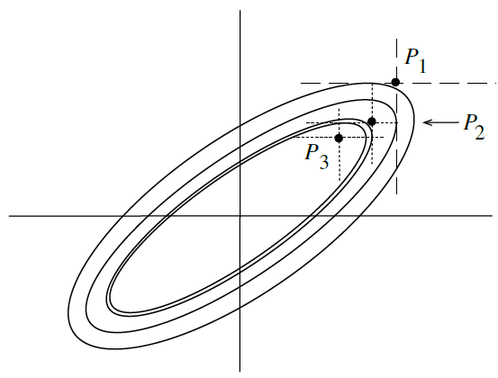

# Fast Learning Algorithms

P. Rojas, [Chapter 8](http://page.mi.fu-berlin.de/rojas/neural/chapter/K8.pdf) in [Neural Networks - A Systematic Introduction](http://page.mi.fu-berlin.de/rojas/neural/), 1996

  

## 8.1 Introduction - Classical backpropagation

+ The reasons to explore the combinations of new algorithm in learning algorithms
  + backpropagation algorithms
  + artificial neural networks

+ Backpropagation algorithm
  + a rather slow learning algorithm
  + malicious selection of parameters made even slower
  + non-linear optimization: accelerate the training method with practically no effort

+ Artificial neural networks
  + NP-complete in the worst cases
  + network parameters grow exponentially w/ the number of unknown

+ Standard online backpropagation performs better than many fast learning algorithms when
  + a realistic level of complexity in the learning task
  + the size of the training set beyond a critical threshold

### 8.1.1 Backpropagation with momentum

+ Momentum method
  + minimizing the error function: wide oscillation of the search process w/ the gradient descent
  + traditional gradient descent: computed for each new combination of weights
  + momentum approach: compute the negative gradient direction a weighted average of the current gradient and the previous correction direction for each step
  + Example: a network w/ two weights $w_1$ and $w_2$

  

    
  

  + accelerating convergence: increasing the learning rate up to an optimal value
  + purpose: allowing the attenuation of oscillations in the iteration process

+ Mathematical representation
  + A network with $n$ different weights $w_1, w_2, \dots, w_n$
  + Assumption and Notations
    + $E$: the error function
    + $\gamma$: the learning rate
    + $\alpha$: the momentum rate
    + 
  + The $i$-th correction for weight $w_k$

    \[\Delta w_k(i) = -\gamma \, \frac{\partial E}{\partial w_k} + \alpha \, \Delta w_k (i-1)\]

+ Optimization
  + optimal parameters highly depends on the learning task
  + no general strategy to deal with the problem
  + tradeoffs: choosing the a specific learning and momentum rates
  + observing the oscillating behavior on backpropagation feedback rule and large momentum rates

#### The linear associator

+ Linear associator
  + a single computing element with associated weights $w_1, w_2, \dots, w_n$
  + input: $x_1, x_2, \dots, x_n$
  + output: $w_1x_1 + w_2x_2 + \cdots + w_n x_n$

  

    
  

+ Mathematical Representation
  + Assumptions & Notations
    + $(\mathbf{x_1}, y_1), (\mathbf{x_2}, y_2), \dots, (\mathbf{x_p}, y_p)$: the input-output $p$ ordered pairs
    + $\mathbf{x}$: vector of input patterns w/ $n$-dimensional rows
    + $\mathbf{w}$: vector of the weights of the linear associator w/ $n$-dimensional columns
    + $\mathbf{X}$: a $p \times m$ matrix w/ $\mathbf{x_1}, \mathbf{x_2}, \dots \mathbf{x_p}$ as rows
    + $\mathbf{y}$: a column vector of the scalars $y_1, y_2, \dots, y_p$
  + the learning task objective: minimize the quadratic error

    \[\begin{align*}
    E &= \sum_{i=1}^{n} \| \mathbf{x_i} \cdot \mathbf{w} - y_i \|^2 \\
      &= \| \mathbf{X}\mathbf{w} - \mathbf{y} \|^2 = (\mathbf{X}\mathbf{w} - \mathbf{y})^T(\mathbf{X}\mathbf{w} - \mathbf{y}) \\
      &= \mathbf{w}(\mathbf{X}^T \mathbf{X})\mathbf{w} -2 \: \mathbf{y}^T\mathbf{X}\mathbf{w} + \mathbf{y}^T\mathbf{y}
    \end{align*}\]

  + the lengths of the principal axes: determined by the magnitude of the eigenvalues of the correlation of matrix $\math{X}^T\mathbf{X}
  + gradient descent: most effective w/ the same length when the principal axes of the quadratic form

+ Example: quadratic function $ax^2 + b y^2$
  + iteration rule of the gradient descent w/ the $x$ and $y$ direction, respectively
  
    \[\begin{align*}
      \Delta x(i) &= -2 \, \gamma \, a x + \alpha \, \alpha x(i-1) \\
      \Delta y(i) &= -2 \, \gamma \, b x + \alpha \, \alpha y(i-1)
    \end{align*}\]

  + an optimal parameter combination
    + in the $x$ direction: $\gamma = 1/2a$ and $\alpha = 0$
    + in the $y$ direction: $\gamma = 1/2b$ and $\alpha = 0$
  + Example
    + The number of iterations needed to find the minimum of the error function to a given precision as a function of $\gamma$, when $a = 0.9$ nd $b = 0.5$.
    + optimal value: $\gamma = 0.7$ at the intersection of the two curves.
    + oscillations in $y$ direction $\rightarrow$ slow convergence in $x$ direction

    

      
    

#### Minimizing oscillations

+ Eigenvlaues in the correlation matrix $\mathbf{X}^T\mathbf{X}$
  + the eigenvalues $\rightarrow$ the lengths of the principal axes of the error function
  + the range of possible values of $\gamma$ reduces as one of these eigenvalues much larger than the others

+ Example: $kx^2$
  + optimal learning rate: $\gamma = 1/2k$
  + the rate $\gamma = 1/k \rightarrow$ oscillation btw the initial point $x_0$ and $-x_0$
  + $\gamma > 2/k \rightarrow$ "explosion" of iteration process

+ Convergence and Divergence zones
  + parameters combinations in the boundary btw regions: stable oscillations
  + $\gamma > 4 \cdot 2/k$: not balanced with any value of $\alpha$
  + $\gamma > 1$: a geometric explosion of the iteration process
  + $1/k < \gamma < 2/k$: stable oscillation; the boundaries between regions
  + $\gamma < 1/2k$: optimal convergence speed w/ a unique $\alpha$
  + jagged line: the optimal combinations of $\gamma$ and $\alpha$
  + issue: With certain direction in weight space, the principle axis of the error function is much smaller compared to another axes.
  + solution: a compromise by adjusting the momentum rate such that the direction w/ less oscillating and improving convergence speed
  + the compromise could be dominated by a single direction w/ $n$ axes in weight space

  

    
  

#### Critical parameter combinations

+ Backpropagation: choosing a learn rate $\gamma$ w/o any previous knowledge of the correlation matrix of the input

+ Conservative approach: choosing a very small learning rate

+ In case of a correlation matrix $\mathbf{X}^T\mathbf{X}$ with some very large eigenvalues, a given choice of $\gamma$ could led to divergence in the associated direction in weight space.

+ Error function in weight space
  + Paths for backpropagation learning w/ linear associator (left figure)
    + the minimum of the error function located at the origin
    + some paths in a 2-dim weight space for several associated trained with momentum rates to one and different $\gamma$ values
    + a momentum rate equal to one precludes convergence of the iteration process
    + difficult to adjust the learning and momentum rate in the nonlinear case
    + the divergence regions of the quadratic case: oscillatory regions
  + Bounded nonlinear error function and the result of several iterations (right figure)
    + the possible shape of the error function for a linear associator w/ sigmoid output and oscillation process for this kind of error function in the one-dim case
    + jagged curve w/ nonlinear neural networks
    + oscillation: 
      + large momentum rates
      + excessively large $\gamma$ w/o momentum

  

    
  

+ learning rate considerations
  + too small: possible to get stuck in local minima
  + too big: possible oscillatory traps

+ Remedy
  + adaptive learning rates
  + statistical preprocessing of the learning set w/ decorrelation; ie. no excessively large eigenvalues of the correlation matrix

### 8.1.2 The fractal geometry of backpropagation

+ standard backpropagation
  + very sensitive to the initial learning rate
  + path: fractal in weight space
    + the form based on the learning rate
    + a threshold value for which the attractor of the iteration path is dense in a region of weight space around a local minimum of the error function

#### The Gauss-Jacobi and Gauss-Seidel methods and backpropagation

+ online backpropagation
  + not converge to a single point in weight space
  + oscillation around the minimum of the error function
  + expected value of the derivation based on the learning step size used
  + linear associator = Iterated Function System [Barnsley, M. (1988), Fractals Everywhere, Academic Press, London.]

+ Visualization online & offline backpropagation approach
  + three input-output patterns

    \[\begin{align*}
      x_1^1 w_1 + x_2^1 w_2 & = y_1 \tag{1}\\
      x_1^2 w_1 + x_2^2 w_2 & = y_2 \tag{2}\\
      x_1^3 w_1 + x_2^3 w_2 & = y_3 \tag{3}
    \end{align*}\]

  + intersect at the same point: using Gaussian elimination
  + not intersect the same point: no exact solution but ask for the combination of $w_1$ and $w_2$ to minimize the quadratic error
  + minimal cumulative quadratic distance to the three sides of the triangle (left figure)
  + the Gauss-Jacobi and Gauss-Seidel methods (middle figures)
  + Gauss-Jacobi method
    + starting at some point in search space
    + projecting the point in the directions of the axes on the two lines considered
    + next iteration point: the $x$-coordinate of the horizontal projection & $y$-coordinate of the vertical projection
  + Gauss-Seidel method
    + dealing with each line equation individually
    + 1st projection in the $x$ direction
    + 2nd projection in the $y$ direction
    + usually converge faster than the Gauss-Jacobi method
  + Online backpropagation (middle figures)
    + the error function

      \[\frac{1}{2}(x_1^1w_1 + x_2^1 w_2 - y_1)^2\]

    + the gradient (w.r.t. $w_1$ and $w_2$) is $(x_1, x_2)$
    + the Gauss-Siedel method w/ a learning constant
  + Offline backpropagation (middle figure)
    + iterating by adding the corrections for each pattern
    + the corrections in the direction normal to each linear constraint
    + the new iteration point obtained by combining them
    + similar to the Gauss-Jacobi method of linear algebra
  + the size of learning constant determining whether the iteration stops short of reaching the linear constant or goes beyond it

  

    
  

+ Nonlinear activation function: sigmoid
  + online propagation always moves in the direction normal to the constraints
  + the length of the search step is multiplied by the derivative of the sigmoid

  

    
  

#### Iterated Function Systems (IFS)

+ a set of affine transformations in a metric space producing fractal structures when applied repetitively to a compact subset of points and its subsequenct images

+ Iterated Function Systems
  + Assumptions & Notations
    + $\mathbf{X}$: a space of points
    + $\mathbf{x} = (x_1, x_2, \dots, x_n)$: a point $\in \mathbf{X}$
    + $d$: a metric in the space
    + $h_i \; : \; X \rightarrow X, i = 1, 2, \dots, N$: a set of affine contraction mappings
    + $\mathbf{M}$: a matrix for transformation
    + $\mathbf{t}$: a vector for transformation
    + given a nonvoid compact subset $A_0$ of points of $X$
    + $a_0$: any point belonging to the attractor
    + $h_k$: affine transformation selected randomly from the IFS
    + $\{a_n\}$: a dense subset of the attractor
  + recursive formula for new image subsets

    \[A_{n+1} = \bigcup_{j=1}^N h_j(A_n), \text{ for } n = 1, 2, \dots\]

  + attractor of the IFS: the sequence $\{A_n\}$ converging to a fixed point
  + Collage Theorem: given any nonvoid compact subset $X$, always find an IFS whose associated attractor can arbitrarily approximate the given subset under a suitable metric
  + The transformation

    \[\mathbf{x} \rightarrow \mathbf{M}\mathbf{x} + \mathbf{t}\]

    + contractive if the determinant of $\mathbf{M} < 1$

  + The sequence $a_n$

    \[a_{n+1} = h_k(a_n)\]

    therefore, able to produce a good graphical approximation of the attractor oof the IFS w/ simple randomized method

+ fractal: online backpropagation on linear associator $\rightarrow$ a set of affine transformations applied in the course of the learning process either randomly or in a fixed sequence

#### Online Backpropagation and IFS

+ Assumptions & Notations
  + a linear associator
  + $\mathbf{x^1}, \mathbf{x^2}, \dots, \mathbf{x^p}$: the $p \; n$-dim patterns
  + $y^1, y^2, \dots, y^p$: the targets of training set
  + $w_1, w_2, \dots, w_n$: the weights of the linear associator
  + $\gamma$: the learning constant
  + $\mathbf{M_j}$: the matrix w/ elements $m_{ik} = x_i^j x_k^j$ for $i, k = 1, \dots, n$
  + $\mathbf{t_j}$: the column vector w/ components $x^j, y^j$ for $i = 1, \dots, n$
  + \mathbf{I}$: the identity matrix
  + $l$: the distance to the hyperplane w/ a given point $(w_1^{\prime}, w_2^{\prime}, \cdots, w_n^{\prime})$ in weight space

+ The error function for pattern $j$

  \[E_j = \frac{1}{2} \left(w_1 x_1^j + w_2 x_2^j + \cdots + w_n x_n^j - y^j \right)^2 \]

+ The correction for each weight $w_i, i = 1, \dots, n$

  \[\begin{align*}
    w_i & \rightarrow w_i - \gamma \, x_i^j (w_1 x_1^j + w_2 x_2^j + \cdots + w_n x_n^j - y^j) \\
      & \rightarrow w_i - \gamma \left(w_1 x_i^j x_1^j + w_2 x_i^j x_2^j + \cdots + w_n x_i^j x_n^j \right) - \gamma \, x_i^j y^j \tag{4}
  \end{align*}\]

+ Weight Vectorization

  \[\begin{align*}
    \mathbf{w} & \rightarrow \mathbf{I}\mathbf{w} - \gamma \mathbf{M_j} \mathbf{w} - \mathbf{t_j} \\
      & \rightarrow (\mathbf{I} - \gamma \mathbf{M_j})\mathbf{w} - \mathbf{t_j}
  \end{align*}\]

+ Affine transformation
  + mapping the current point in weight space into a new one
  + each pattern in the training set: a different affine transformation of the current point $(w_1, w_2, \dots, w_n)$

+ Online backpropagation w/ a randomly selected input patterns
  + the initial point in weight space transformed by a randomized IFS algorithm
  + the sequence of updated weights approximates the attractor of th IFS defined by the input patterns
  + the iteration path in the weight space is a fractal

+ The square of the distance $l$ of a given point $(w_1^{\prime}, w_2^{\prime}, \cdots, w_n^{\prime})$ to the hyperplane $w_1 x_1^j + w_2 x_2^j + \cdots + w_n x_n^j = y^j$

  \[l^2 = \frac{(w_1^\prime x_1^j + w_1^\prime x_2^j + \cdots + w_1^\prime x_n^j - y^j)^2}{(x_1^j)^2 + (x_2^j)^2 + \cdots + (x_n^j)^2}\]

+ Learning rate
  + Each propagation step amounts to displacing the current point in weight space in the direction normal to the hyperplane defined by the input and target patterns.
  + learning rate $\gamma$ for $j$-th pattern

    \[\gamma = \frac{1}{(x_1^j)^2 + (x_2^j)^2 + \cdots + (x_n^j)^2} \tag{5}\]

  + any value of $\gamma$ below this threshold displaces the iteration path just a fraction of the distance to the hyperplane.
  + the iteration path thus remains trapped in a certain region of weight space near to the optimum.

#### Summary of Classical Backpropagation

+ Online backpropagation w/ random selection of the input patterns yields iterations dynamics equivalent to those of IFS.

+ The learning constant: the affine transformations overlap, the iteration path densely covers a certain region of weight space around the local minimum of the error function.

+ linear associator &  online backpropagation: fractal iteration path

+ Sigmoid units: 
  + error correction step: no longer equivalent to an affine transformation
  + similar updating step
  + able to approximate a quadratic function for suitable parameter combinations
  + nonlinear updating steps: fractal iteration paths

## 8.2 Some simple improvements to backpropagation

+ Issues on learning in neural networks
  + an NP complete complete problem
  + traditional gradient descent methods are slow

### 8.2.1 Initial weight selection

+ Heuristic initialization
  + feed-forward network with sigmoid units: selecting its weights with uniform probability in $[-\alpha, \alpha]$
  + expected zero value of the total input to each node in the network
  + the maximum value for sigmoid: 1/4
  + small weights (or all zero):
    + small (or zero) values of the output w/ the backpropagation error
    + no weight adjustment between input and hidden layer
  + momentum rate $\alpha$
    + very small: slow learning and suboptimal local minimum
    + large: saturation of the nodes in the network and flat zones of the error function

+ Related research
  + issue: not considering the relation between step and weight initialization
  + a very broad range of values with basically the same convergence efficiency

#### Maximizing the derivatives at the nodes

+ Output layer
  + Assumptions & Notations
    + $n$ different edges
    + associated weights $w_1, w_2, \dots, \w_n$ point to this node
    + selecting weights with uniform probability from $[-\alpha, \alpha]$
    + $x_1, x_2, \dots, \x_n$: the input values transported through each edge
    + assumption: $x_i$ and initial weights uncorrelated
    + $\sigma$: standard variation

  + the expected total input to the node

    \[\langle \sum_{i=1}^n w_ix_i\rangle\]

  + By the law of large numbers
    + $\sigma = 0$, the expected value: 0.25
    + $\sigma = 4$, the expected value: 0.12
    + the variance of the total input

      \[\sigma^2 = E\left[\left(\sum_{i=1}^n w_i x_i \right)^2\right] - E\left[ \left( \sum_{i=1}^n w_i x_i \right) \right]^2 = \sum_{i=1}^n E[w_i^2] E[x_i^2] \tag{5}\]

  + for binary vectors, $E(x_i^2) = 1/3$, Eq.(5) simplifies to

    \[\sigma = \frac{1}{3} \sqrt{n} \alpha\]

#### Maximizing the backpropagation error

+ Assumptions & Notations
  + neural network w/ $n$ nodes in the hidden layer and $k$ nodes in output layer
  + $\delta_h$: a backpropagated input of hidden node $h$ from the $k$ output nodes
  + $w_{h_i}, i = 1, 2, \dots, k$: the weights associated with the edges from hidden node $h$ to output node $i$
  + $s_i^\prime$: the sigmoid's derivative at the output node $i$
  + $\delta_i^0$: the difference between output and target at output node  $i$

+ The backpropagated input from the $k$ output nodes

  \[\delta_h = \sum_{i=1}^k w_{h_i} s_i^\prime \delta_i^0\]

+ Breaking the symmetry of the hidden node
  + expected weight of $\delta_h = 0$
  + making the initialization level $[-\alpha, \alpha]$ wider
  + the variance bigger but the expected value of the derivative $s_i^\prime$ lower
  + target: making $\delta_h$ as large as possible, but without making $\delta_i^\prime$ too low

+ Expected values of the backpropagated error and the sigmoid's derivative (figure)
  + the backpropagation error: sensitive to small values of $\alpha$
  + $\alpha \in [0.5, 1.5]$: virtually the same performance
  + best $\alpha$: depending on the exact number of input, hidden, and output units
  + constraint: learning algorithm not too sensitive to the exact $\alpha$ chosen from a certain range of values

  

    
  

### 8.2.2 Clipped derivatives and offset term

+ Clipping the derivative of the sigmoid
  + the derivatives of the sigmoid stored at the computing units can easily approach values near to zero
  + after several layers multiply in the backpropagation, the length of the gradient becomes too small
  + Solution. clipping the derivatives; e.g., $s^\prime \geq 0.01$

+ Offset
  + adding a small constant $\varepsilon$ to the derivative
  + using $s^\prime + \varepsilon$ for the backpropagation step
  + net effect of an offset value of the sigmoid's derivative: pull the iteration process out of flat regions of the error function
  + backpropagation continues iterating with the exact gradient direction
  + implemented with reading values form table than computation

+ Implementation: combining the table of derivative, clipping of the sigmoid values, and adding an offset term

### 8.2.3 Reducing the number of floating-point operations

+ Backpropagation algorithm
  + straightforward implementation based on floating-point operations
  + problems of precision and stability normally avoided by using 32-bit or 64-bit floating point arithmetic

#### Avoiding the computation of the squashing function

+ nonlinear function
  + sigmoid or hyperbolic tangent used
  + requirements: computing exponential function and sequence of float-point operations
  + tables stored at each unit to avoid the computation
  + an interval $[x_1, x_{i+1}] \in \mathcal{R}$ stored 

+ Sigmoid example
  + the output of the unit: $y = a_i + a_{i+1}(x - x_i)$ at $x_i \leq x \leq x_{i+1}$ and where $a_1 = s(x_i)$$a_{i+1} = s(x_{i+1})$
  + interpolation used with a table
  + another table stored for sigmoid's derivative to compute the backpropagation step

  

    
  

#### Avoiding the nonlinear function at the output

+ Output vectors
  + $m$-dim vectors
  + $(t_1, t_2, \dots, t_m)$ with $0 < t_i < 1$ for $i = 1, 2, \dots, m$
  + a new training set resulting in the output form $s^{-1}(y_1), \dots, s^{-1}(y_m))$, where $s^{-1}$ as the inverse of the sigmoid
  + the sigmoid eliminates from the output units
  + the network trained with standard backpropagation
  + the sigmoid equivalent to a kind of weighting of the output error
  + e.g., 100 and 1000 almost with the same sigmoid output
  + only more knowledge about the specific application to decide the elimination of nonlinearity

#### Fixed-point arithmetic

+ Reason
  + integer operations faster than floating-point operations in general
  + output values in the interval $(0, 1)$ or $(-1, 1)$
  + adopting a fixed-point representation and executing operations with integers

+ 12-bit operation
  + a sign bit to represent number s in the interval %(-8, 8)$ with the precision of $2^{-12} \approx 0.00025$
  + define the tables for the sigmoid and its derivatives to implement the correct arithmetic (avoid overflow by a shift multiplications and tests)

+ Research on arithmetic
  + Holt & Baker: 16-bit doe the weights and 8-bit for the coding of the outputs w/o effecting the convergence of the learning algorithm
  + Reyneri & Filippi: the necessary word length of the representation depends on the learning constant and the learning algorithm used
  + standard backpropagation can diverge in some cases when the fixed-point representation includes less than 6 bits.

### 8.2.4 Data decorrelation

+ Issue: the principal axes of the quadratic approximation of the error function are too dissimilar, gradient descent can be slowed down arbitrarily

+ Solution: decorrelation the data set

+ solution regions defined by bipolar data fro perceptrons: symmetrically distributed than the binary vectors used

+ If the input data consists of $N$ real vectors $\mathbf{x_1}, \mathbf{x_2}, \dots, \mathbf{x_N}$ , it is usually helpful to center the data around the origin by subtracting the centroid $\mathbf{\hat{x}}$ of the distribution, in such a way that the new input data consists of the vector $\mathbf{x_i} - \mathbf{\hat{x}}$

#### PCA and adaptive decorrelation

+ using PCA to reduce the number of vector components and to order the remaining ones according to their importance

+ Data distribution
  + Any elliptic shape of points as a future input vector
  + two randomly selected vectors w/ large probability not orthogonal
  + preprocessing: rotating axes and scaling the data (see figure)

  

    
  

  + transformation: one-to-one mapping & invertible
  + performing PCA on the available data
  + scaling factor: the reciprocal of the variances of each component
  + speeding backpropagation in most cases

+ Adaptive Data Decorrelation
  + Silva, F., and L. Almeida (1991), “Speeding-up Backpropagation by Data Orthonormalization”, in: [Kohonen et al. 1991], pp. 1503–1506
  + linear layer used
    + to transform input vectors
    + to transform the outputs of the hidden units
  + Assumptions & Notations
    + $\mathbf{x} = (x_1, x_2, \dots, x_n)$: an $n$-dim input vector
    + ($y_1, y_2, \dots, y_n)$: the output of the linear layer
    + $\mathbf{w_m^p}$: the weight vector of the $m$-the unit at the $p$-th iteration
    + $\beta$: a constant
    + 
  + objective: making the expected value of the correction coefficient $r_{ij}$ of the $i$-th and %j%-th output units equal to Kronecker's delta $\delta_{ij}$

    \[r_{ij} = <y_iy_j> = \delta_{ij}\]
  + expected value computed over all vectors in the data set
  + pulling the weight vector of the $i$-th unit away from the weight vector $j$-th unit, whenever $r_{ij} > 0$ and in the direction of $w_i$ when $r_{ij} < 0$
  + the precision formula

    \[\begin{align*}
      \mathbf{w}_i^{k=1} &= \mathbf{w_i^k} - \beta \, \sum_{j \neq i}^n r_{ij} \mathbf{w_j^k} \\
        &= (1 + \beta) \mathbf{w_i^k} - \beta \, \sum_{j=1}^n\, r_{ij} \mathbf{w_j^k}
    \end{align*}\]

  + accelerating the convergence of backpropagation as well as PCA
  + sensitive top the choice of the constant $\beta$ and the data selection process

#### Active data selection

+ online backpropagation performing under these conditions if the training pairs selected randomly

+ off-line backpropagation: a strong motivation to explore methods of reducing the size of the effective training set

## 8.3 Adaptive step algorithms

+ Basic strategy
  + increasing step size: the algorithm proceeds down the error function over several iterations
  + decreasing step size: the algorithm jumps over a valley of the error function

+ Learning rates
  + global learning rate
    + used to update all weights in the network
    + made bigger or smaller according to the iterations made so far
  + local learning rate
    + different local rate on each weight
    + $\gamma$ used to compute the weight corrections

+ Model for algorithms
  + each weight $w_i$ w/ an associated learning constant $\gamma_i$

    \[\Delta w_i = -\gamma_i \frac{\partial E}{\partial w_i}\]

  + motivation: use of different learning constants for each weight to correct the direction of the negative gradient to make it point directly to the minimum of the error function
  + with degenerate function, the gradient direction leads to many oscillations
  + adequate scaling of the gradient components: reaching the minimum in fewer steps
  + how the optimization of the error function proceeds when only 1-dim optimization steps are used (diagram)
    + the lengths of the principal axes of the quadratic approximation very different
    + the algorithm slowed by an arbitrary factor

  

    
  

### 8.3.1 Silva and Almeida´s algorithm

+ Proposal: different learning rates for each weight in a network

+ Assumptions & Notations
  + a network consists of $n$ weights $w_1, w_2, \dots, w_n$
  + $\gamma_1, \gamma_2, \dots, \gamma_n$: individual learning rates associated to the weights
  + $c_1, c_2, \dots, c_n$, $d_{ij}$ & $C$: constants
  + $k_1$ & $k_2$: constants depending on the values of the "frozen" variables at the current iteration point
  + $u > 1$: a constant for up manually
  + $d < 1$: a constant for down manually
  
+ Example
  + One-dimensional cuts: family of parabolas (diagram)
    + left: the level curves of a quadratic approximation to the error function
    + right: minimizing quadratic functions as parabolas
      + the first parabola considered
      + the negative gradient direction followed 

  

    
  

+ Algorithm
  + performing several optimization steps in the horizontal direction
  + horizontal cuts to a quadratic function: quadratic
  + minimizing at each step: parabola
  + general form of a quadratic function w/ $n$ variable weights

    \[c_1^2 w_1^2 + c_2^2 w_2^2 + \cdots + c_n^2 w_n^2 + \sum_{i \neq j{ \, d_{ij}w_iw_j + C\]

  + Minimize the form of the $i$-th direction for a 1-dim minimization step

    \[c_i^2 w_i^2 + k_1 w_i + k_2\]

  + the learning rate for each weight at $k$-th iteration for the next step

    \[\gamma_i^{(k+1) = 
    \begin{cases}
      \gamma_i^{(k)} \, u & \text{if } \Delta_i E^{(k-1)} \geq 0 \\
      \gamma_i^{(k)} \, d & \text{if } \Delta_i E^{(k-1)} < 0
    \end{cases}\]
  
  + Weight update

    \[\Delta^{(k)} w_i = -\gamma_i^{(k)} \Delta_i E^{(k)}\]

  + With constants $u$ and $d$, the learning rate grow and decease exponentially.
  + not follow the gradient direction directly
  + With perfect circles for the level curves of the quadratic approximation, successive 1-dim optimizations reached after $n$ steps.

+ Slow convergency
  + if the quadratic approximation w/ semi-axes of very different lengths, the iteration process can be arbitrary slowed.
  + Solution: adding momentum $\alpha$
  + Contradictory: 
    + the individual learning rates optimized if updates are strictly 1-dimensional
    + tuning the constant $\alpha$ quite problem-specific
  + Solution: preprocessing the original data to achieve a more regular error function
  + dramatically effecting the convergence speed of algorithms

### 8.3.2 Delta-bar-delta

+ Jacob's proposal: acceleration of the learning rate made more caution than deceleration

+ Modeling algorithm
  + Algorithms & Notations
    + $U$ & $d$: constants
    + $\delta_i^{(k)}$: an exponential average partial derivative in the direction of weight $w_i$
    + $\phi$: a constant determining what weight given to the last averaged term
  + starting w/ individual learning rates $\gamma_1, \dots, \gamma_n$ set all to a small value
  + the learning rate ar the $k$-th iteration

    \[\gamma_i^{(k+1)} = \begin{cases}
      \gamma_i^{(k)} + u & \text{if } \Delta_i E^{(k)} \cdot \delta_i^{(k-1)} > 0 \\
      \gamma_i^{(k)} \cdot d & \text{if } \Delta_i E^{(k)} \cdot \delta_i^{(k-1)} < 0 \\
      \gamma_i^{(k)} & \text{otherwise}
    \end{cases}\]

  + exponential averaged partial derivative w.r.t. $w_i$

    \[\delta_i^{(k)} = (1 - \phi) \Delta_i^{(k)} + \phi \delta_i^{(k-1)}\]

  + the weight updates performed w/o momentum 

    \[\Delta^{(k)} w_i = - \gamma_i^{(k)} \Delta_i E^{(k)}\]

+ Motivation
  + avoid excessive oscillations of the basic algorithm
  + Issue: set a new constant and its value
  + error function: regions allowing a good quadratic approximation optimized at $\phi = 0 \rightarrow$ Silva and Almeida's algorithm

### 8.3.3 RPROP

+ Riedmiller and Braun proposal
  + main idea: update the network weight using just the learning rate and the sign of the partial derivative of the error function w.r.t. each weight
  + accelerating learning mainly in the flat regions of the error function and approaching a local minimum
  + set $\gamma_{min}$ and $\gamma_{max}$ to avoid accelerating and decelerating too much

+ Modeling algorithm
  + covering the weight space between $\gamma_{min}$ and $\gamma_{max}$
  + $\gamma_{min}$, $\gamma_{max}$: $n$-dim grid of side length
  + individual 1-dim optimization steps: moving all possible intermediate grids
  + the learning rates updated at $k$-th iteration

    \[\gamma_i^{(k+1)} = \begin{cases}
      \min(\gamma_i^{(k)} \, u, \gamma_{max}) & \text{if } \Delta_i E^{(k-1)} \cdot \Delta_i^{(k-1)} > 0 \\
      \max(\gamma_i^{(k)} \, d, \gamma_{min}) & \text{if } \Delta_i E^{(k-1)} \cdot \Delta_i^{(k-1)} < 0 \\
      \gamma_i^{(k)} & \text{otherwise}
    \end{cases}\]

    + $u > 1$ and $d < 1$
  + the weight updated

    \[\Delta^{(k)} w_i = \begin{cases} -\gamma_i^{(k)} sgn(\Delta_i E^{(k)}) & \text{if } \Delta_i E^{(k-1)} \cdot \Delta_i^{(k-1)} \geq 0 \\ 0 & \text{otherwise} \end{cases}\]

+ One-dimensional approximation of the error function

  

    
  

+ Comparison of Rprop and batch backpropagation

  <table style="font-family: arial,helvetica,sans-serif;" table-layout="auto" cellspacing="0" cellpadding="5" border="1" align="center" width=50%>
    <thead>
    <tr>
      <th rowspan="2" style="text-align: center; background-color: #3d64ff; color: #ffffff; width:30%;">Benchmark</th>
      <th colspan="2" style="text-align: center; background-color: #3d64ff; color: #ffffff; width:20%;">Generations</th>
      <th colspan="2" style="text-align: center; background-color: #3d64ff; color: #ffffff; width:20%;">Time</th>
    </tr>
    <tr>
      <th style="text-align: center; background-color: #3d64ff; color: #ffffff; width:10%;">BP</th>
      <th style="text-align: center; background-color: #3d64ff; color: #ffffff; width:10%;">Rprop</th>
      <th style="text-align: center; background-color: #3d64ff; color: #ffffff; width:10%;">BP</th>
      <th style="text-align: center; background-color: #3d64ff; color: #ffffff; width:10%;">Rprop</th>
    </tr>
    </thead>
    <tbody>
    <tr> <td>sonar signal</td> <td style="text-align: right;">109.7</td> <td style="text-align: right;">82.0</td> <td style="text-align: right;">8.6 s</td> <td style="text-align: right;">6.9 s</td>
    </tr>
    <tr> <td>vowels</td> <td style="text-align: right;">---</td> <td style="text-align: right;">1532.9</td> <td style="text-align: right;">---</td> <td style="text-align: right;">593.6 s</td>
    </tr>
    <tr> <td>vowels (decorrelated)</td> <td style="text-align: right;">331.4</td> <td style="text-align: right;">319.1</td> <td style="text-align: right;">127.8 s</td> <td style="text-align: right;">123.6 s</td>
    </tr>
    <tr> <td>NETtalk (200 words)</td> <td style="text-align: right;">268.9</td> <td style="text-align: right;">108.7</td> <td style="text-align: right;">961.5 s</td> <td style="text-align: right;">389.6 s</td>
    </tr>
    <tr> <td>protein structure</td> <td style="text-align: right;">347.5</td> <td style="text-align: right;">139.2</td> <td style="text-align: right;">670.1 s</td> <td style="text-align: right;">269.1 s</td>
    </tr>
    <tr> <td>digits</td> <td style="text-align: right;">---</td> <td style="text-align: right;">159.5</td> <td style="text-align: right;">---</td> <td style="text-align: right;">344.7</td>
    </tr>
    </tbody>
  </table>

  + backpropagation: failed to converge in two cases
  + Rprop: converge almsot all cases and faster up to about 2.5 factor w.r.t. BP

### 8.3.4 The Dynamic Adaption Algorithm

+ Salomon's Proposal
  +  Salomon, R. (1992), Verbesserung konnektionistischer Lernverfahren, die nachder Gradientenmethode arbeiten, PhD Thesis, Technical University of Berlin
  + Idea: using the negative gradient direction to generate tow new points instead of one, the one w/ lowest error used for the next iteration

+ Modeling the algorithm
  + Assumptions & Notations
    + $\eta$: a small constant; e.g., $\xi = 1.7$
  + the $k$-th iteration

    \[\begin{align*}
      \mathbf{w}^{(k_1)} &= \mathbf{w}^{(k)} - \Delta E(\mathbf{w}^{(k)}) \gamma^{(k-1)} \cdot \xi \\
      \mathbf{w}^{(k_2)} &= \mathbf{w}^{(k)} - \Delta E(\mathbf{w}^{(k)}) \gamma^{(k-1)} / \xi
    \end{align*}\]

  + Update e learning rate

    \[\gamma = \begin{cases} \gamma^{(k-1)} \cdot \xi & \text{if } E(\mathbf{w}^{(k_1)}) \leq E(\mathbf{w}^{(k_2)}) \\ \gamma^{(k-1)} / \xi & \text{otherwise} \end{cases}\]

  + Update the weight

    \[\mathbf{w}^{(k+1)} = \begin{cases} \mathbf{w}^{(k_1)} & \text{if } E(\mathbf{w}^{(k_1)}) \leq E(\mathbf{w}^{(k_2)}) \\ \mathbf{w}^{(k_2)} & \text{otherwise}\end{cases}\]

+ The algorithm is not as good as the adaptive step methods w/ a local learning constant but easy to implement.

## 8.4 Second-order algorithms

+ Idea:
  + considering more information about the shape of the error function than the mere value of the gradient
  + considering the curvature of the error function at each step for better performance

+ Quadratic approximation of the error function
  + Assumptions & Notations
    + Quadratic error function
    + $\mathbf{w}$: the vector denoting all weights of a network
    + $E(\mathbf{w})$: the error function
    + $\Delta^2 E(\mathbf{w})$: the $n \times n$ Hessian matrix of second order partial derivatives
    + $\mathbf{w}^{(k)}$: the wright vector at the $k$-th iteration
  + Truncated Taylor series to approximate the error function $E$

    \[E(\mathbf{w} + \mathbf{h}) \approx E(\mathbf{w)} + \Delta E(\mathbf{w})^T \mathbf{h} + \frac{1}{2} \mathbf{h}^T \Delta^2 E(\mathbf{w}) \mathbf{h} \tag{6}\]
  
  + the $n \times n$ Hessian matrix of second order partial derivatives, $\Delta^2 E(\mathbf{w})$

    \[\Delta^2 E(\mathbf{w}) = \begin{bmatrix}
      \frac{\partial^2 E(\mathbf{w})}{\partial w_1^2} & \frac{\partial^2 E(\mathbf{w})}{\partial w_1 w_2} & \cdots & \frac{\partial^2 E(\mathbf{w})}{\partial w_1 w_n} \\
      \frac{\partial^2 E(\mathbf{w})}{\partial w_2 w_1} & \frac{\partial^2 E(\mathbf{w})}{\partial w_2^2} & \cdots & \frac{\partial^2 E(\mathbf{w})}{\partial w_2 w_n} \\
      \vdots & \vdots & \ddots & \vdots \\
      \frac{\partial^2 E(\mathbf{w})}{\partial w_n w_1} & \frac{\partial^2 E(\mathbf{w})}{\partial w_n w_2} & \cdots & \frac{\partial^2 E(\mathbf{w})}{\partial w_n^2}
    \end{bmatrix}\]

  + The gradient of the error function

    \[\Delta E(\mathbf{w} + \mathbf{h})^T \approx \Delta E(\mathbf{w}^T + \mathbf{h}^2 \Delta^2 E(\mathbf{w})\]

  + Solving Eq.(6) = 0

    \[\mathbf{h} = -(\Delta^2 E(\mathbf{w}))^{-1} \Delta E(\mathbf{w}) \tag{7}\]
  
  + The solution can be done in a single step if the Hessian matrix and the gradient have computed
  + Applying Newton's method to get the $(k+1)$-th iteration

    \[\mathbf{w}^{(k+1)} = \mathbf{w}^{(k)} - (\Delta^2 E(\mathbf{w}))^{-1} \Delta E(\mathbf{w}) \tag{8}\]

  + Eq. (8) as a position where the gradient w/ reduced magnitude
  + Retain the minimum of the error function with several iterations

+ Computing Hessian matrix, $\Delta^2 E(\mathbf{w})$
  + Becker, S., and Y. le Cun (1989), “Improving the Convergence of BackPropagation Learning with Second Order Methods”, in: [Touretzky et al. 1989], pp. 29–37.
  + a difficult task
  + requiring the inverse of the Hessian matrix
  + many proposals to approximate the second-order information using certain heuristic
  + Pseudo-Newton's methods
    + variants of Newton's method working w/ a simplified form of the Hessian matrix
    + non-diagonal elements set all zeros and only diagonal elements computed
    + therefor, only computing $\partial^2 E(\mathbf{w})/\partial w_i^2$
    + Simplifying Eq. (8) to 

      \[w_i^{(k+1)} = w_i^{(k)} - \frac{\Delta_i E(\mathbf{w})}{\partial^2 E(\mathbf{w})/\partial w_i^2} \tag{9}\]

    + No inverse of the Hessian matrix required
    + limited effort in finding the second order partial derivatives
    + working well w/ nice quadratic error function
    + extremely large corrections required if a small second-order partial derivatives

### 8.4.1 Quickprop

+ Idea
  + considering the 1-dim minimization steps
  + obtaining the current and the last partial derivative of the error function in the update directions about the curvature of the error function
  + based on the independent optimization step for each weight

+ Modeling algorithm
  + Quadratic one-dimensional approximation of th error function
  + Assumption & Notations
    + $\Delta^{(k-1)} w_i$: the weight difference w/ the computed error functions at $(k-1)$-th and $k$-th steps
  + the update term for each weight at the $k$-th step obtained from a previous Quickprop or a standard gradient descent step

    \[\begin{align*}
      \Delta^{(k)} w_i &= \Delta^{(k-1)} w_i \left( \frac{\Delta_i E^{(k)}}{\Delta_i E^{(k=1)} - \Delta_i E^{(k)}} \right) \tag{10} \\
       &= - \frac{\Delta_i E^{(k-1)}}{(\Delta_i E^{(k)} - \Delta_i E^{(k)}) / \Delta^{(k-1)} w_i} \tag{11}
    \end{align*}\]

  + Eq. (11) same as the weight update in Eq. (9)
  + secant steps:
    + the denominator: a discrete approximation to the second-order derivative $\partial^2 E(\mathbf{w}) / \partial w_i^2$
    + a discrete pseudo-Newton method

+ Problematic situations
  + update issue
    + updates may become very large
    + solution: limiting $\Delat^{(k)} w_i$ to a constant times $\Delta^{(k-1)}$
  + Convergence issue
    + assumption used based on a far-fetched than the assumptions used by Rprop
    + Solution: careful handling of the weight updates w/ the problematic tasks

### 8.4.2 QRProp

+ Pfister and Rojas proposal
  + Pfister, M., and R. Rojas (1993), “Speeding-up Backpropagation – A Comparison of Orthogonal Techniques”, International Joint Conference on Neural Networks, Nagoya, Japan, pp. 517–523.
  + Pfister, M. (1995), Hybrid Learning Algorithms for Neural Networks, PhD Thesis, Free University Berlin
  + Idea: adaptively switches between the Manhattan method used by Rprop and local 1-dim secant steps as used by Quickprop
  
+ Qprop brief description
  + using the individual learning rate strategy of Rprop if two consecutive error function gradient components, $\Delta_i E^{(k)}$ and $\Delta_i E{(k-1)}$ w/ the same sign or one of them equals zero
  + a fast approach to a region of minimum error
  + if sign changed, overshoot a local minimum in the specific weight direction, take a second-order step (Quickprop)
  + assume that the direction of the error function independent from all other weights, a step based on a quadratic approximation far more accurate than just stepping back half way as done by Rprop
  + constraining the size of the secant step to avoid large oscillations of the weights by
    + the error function depends on all weights
    + the quadratic approximation will be better the closer the two investigated points lie together

+ Algorithm
  1. $\Delta_i E^{(k)} \cdot \Delta_i E^{(k-1)} > 0$: perform Rprop steps (assume that a local minimum lies ahead)
  2. $\Delta_i E^{(k)} \cdot \Delta_i E^{(k-1)} < 0$:
    + indicate that a local minimum has been overshot
    + neither the individual learning rate $\gamma_i$ nor the weight $w_i$ are changed
    + a marker defined by setting $\Delta_i E^{(k)} := 0$
    + the secant step is performed in the subsequent iteration
  3. $\Delta_i E^{(k)} \cdot \Delta_i E^{(k-1)} = 0$:
    + either a marker was set in the previous step or one of the gradient components is zero (a local minimum has been directly hit))
    + near a local minimum
    + perform a second-order step
    + the secant approximation: using the gradient information provided by $\Delta_i E{(k)}$ and $\Delta_i E^{(k-2)} > 0$
    + the second-order approximation is still a better choice than just stepping halfway back when near a local minimum (and very likely overshot in the previous step)
  4. the quadratic approximation in the secant step

    \[q_i := |\Delta_i E^{(k)} / (\Delta_i E^{(k)} - \Delta_i E^{(k-2)})|\]

    is constrained to a certain interval to avoid very large or very small updates

+ The $k$-th iteration of Qprop
  + set constants: $d, u, \gamma_{min}$ and $\gamma_{max}$
  + Step 1: update the individual learning rates

    if $(\Delta_i E^{(k)} \cdot \Delta_i E^{(k-1)} = 0)$ then  
    if $(\Delta_i E^{(k)} \neq \Delta_i E^{(k-1)})$ then 
    $q_i = \max \left(d, \min \left(1/u, \left|\frac{\Delta_i E^{(k)}}{\Delta_i E^{(k)} - \Delta_i E^{(k-2)}} \right|\right)\right)$ 
    else 
    $q_i = 1/u$ 
    endif 
    endif

     

    \[\gamma_i^{(k)} = \begin{cases}
      \min(u \cdot \gamma_i^{(k-1)}, \gamma_{max}) & \text{if } \Delta_i E^{(k)} \cdot \Delta_i E^{(k-1)} > 0 \\
      \gamma_i^{(k-1)} & \text{if } \Delta_i E^{(k)} \cdot \Delta_i E^{(k-1)} < 0 \\
      \max(q_i \cdot \gamma_i^{(k-1)}, \gamma_{min}) & \text{if } \Delta_i E^{(k)} \cdot \Delta_i E^{(k-1)} = 0
    \end{cases}\]

  + Step 2: update the weight

    \[w_i^{(k+1)} = \begin{cases}
      w_i^{(k)} - \gamma^{(k)} \cdot \text{sgn}(\Delta_i E^{(k)}) & \text{if } \Delta_i E^{(k)} \cdot \Delta_i E^{(k-1)} \geq 0 \\
      w_i^{(k)} & \text{otherwise}
    \end{cases}\]

    If $(\Delta_i E^{(k)} \cdot \Delta_i E^{(k-1)} < 0)$ set $\Delta_i E^{(k)} := 0$

### 8.4.3 Second-order backpropagation

+ second-order backpropagation
  + a method to efficiently compute the Hessian of a linear network of 1-dim functions
  + used to get explicit symbolic expressions or numerical approximations of the Hessian
  + able to use in parallel computers to improve second-order learning algorithms for neural networks

+ Methods for the determination of the Hessian matrix
  + Bishop, C. (1992), “Exact Calculation of the Hessian Matrix for the Multilayer Perceptron”, Neural Computation, Vol. 4, pp. 494–501.
  + using a graphical approach
  + reducing the whole problem to a computation by inspection
  + able to handle arbitrary topologies
  + restriction: no cycles on the network

#### Second-order derivatives

+ Second-order derivatives
  + investigating the expressions of the form $\partial^2 F / \partial w_i \partial w_j$
  + Assumptions & Notations
    + $F$: network function
    + $w_i$ & $w_j$: network's weights

+ Second-order computation
  + Assumptions & Notations (left diagram)
    + $x$: the input to the network, 1-dim value
    + $F$: the network function computed at the output node with label $q$ for the given input value
    + $F_{l_1q}, F_{l_2q}, \dots, F_{l_mq}$: the network functions computed by subnetworks of the original network
    + $q$: the 1-dim function at the output node
  + the network function

    \[F(x) = g\left(F_{l_1q}(x) + F_{l_2q}(x) + \cdots + F_{l_mq}(x)\right)\]

  + objective: computing $\partial^2 F(x)/\partial w_i \partial w_j$ for two given network weights $w_i$ and $w_j$

    \[\frac{\partial^2F(x)}{\partial w_i \partial w_j} = g^{\prime\prime}(s) \frac{\partial s}{\partial w_i} \frac{\partial s}{\partial w_j} + g^{\prime}(s) \left(\frac{\partial^2 F_{l_1q}(x)}{\partial w_i \partial w_j} + \cdots + \frac{\partial^2 F_{l_mq}(x)}{\partial w_i \partial w_j}\right)\]

    + $s = F_{l_1q}(x) + F_{l_2q}(x) + \cdots + F_{l_mq}(x)$
    + the desired second-order partial derivative w/ two terms
      + the second derivative of $q$ evaluated at its input multiplied by the partial derivatives of the sum of the $m$ subnetwork functions $F_{l_1q}, \dots, F_{l_mq}$ w.r.t. $w_i$ and $w_j$
      + the second-order correction: the second derivative of $q$ multiplied the sum of the of the second-order partial derivatives of each subnetwork function w.r.t. $w_i$ and $w_j$
    + compute the first partial derivatives of any network function w.r.t. a weight

+ The feed-forward labeling phase of the backpropagation algorithm
  + computing a 1-dim function $f$ at each node
  + store 3 values at each node: $f(x)$, $f^{\prime}(x)$, and $f^{\prime\prime}(x)$ where $x$ represents the input to this node
  + Idea: (middle diagram)
    + performing the feed-forward labeling step in the usual manner, but storing additionally at each node the second derivative of the node's function evaluated at the input
    + selecting $w_1$ and $w_2$ and deriving network function of an output node
      + the second-order partial derivative of the stored network function w.r.t. those weights: the product of the stored $g^{\prime\prime}$ value with the backpropagation path values from the output node up to weight $w_i$ and $w_j$
      + intersection of the backpropagation paths of $w_i$ and $w_j$: requiring a second-order correction
      + the second-order correction: the stored value of $g^{\prime}$ multiplied by the sum of the second-order derivative w.r.t $w_i$ and $w_j$ of all subnetwork function inputs to the node which belong to intersecting paths

  

    
  

+ Multilayer perceptron
  + Assumption and Notations
    + model sees the left diagram
    + $w_{ih}$: a weight in the first layer of weights
    + $w_{jm}$: a weight in the second layer
    + $w_{ih}$ and $w_{jm}$: only intersect at node $m$
  + The second derivative of $F_m$ w.r.t. $w_{ih}$ and $w_{jm}$: the stored value of $f^{\prime\prime}$ multiplied by the stored output of the hidden unit $j$ and the backpropagation path up to $w_{ih}$, i.e., $w_{hm} h^{\prime} x_i$

+ Adjustment for one weight lying in the backpropagation path of another
  + Assumptions & Notations
    + $w_{ik}$: a weight lies in the backpropagation path of weight $w_j$
  + performing the second-order backpropagation algorithm as usual
  + the backward computation proceeds up to the point where $w_{ik}$ transports an input to a node $k$ for which a second-order correction required
  + the information transported through the edge with weight $w_{ik}$ is the subnetwork function $F_{ik}$
  + the second-order correction for the node w/ primitive function $g$

    \[g^{\prime} \frac{\partial^2 F_{ik}}{\partial w_{ik} \partial{w_j}} = g^{\prime} \frac{\partial^2 w_{ik} F_i}{\partial w_{ik} \partial w_j}\]
  
  + simplified the previous equation as

    \[g^{\prime} \frac{\partial F_i}{\partial w_j}\]
  
  + The subnetwork function $F_i$ does not depend on $w_{ik}$, thus, the second-order backpropagation method complemented by the following rule
    + the second-order correction to a node $k$ with activation function $q$ involves a weight $w_{ik}$ and a node $w_j$
    + the second-order correction is just $g^{\prime}$ multiplied by the backpropagation path value of the subnetwork function $F_i$ w.r.t. $w_j$

  

    
  

#### Explicit calculation of the Hessian

+ considering the case of a single input pattern into the network

+ Algorithm: second-order backpropagation
  1. extend the neural network
    + adding node which compute the squared difference of each component of the output and the expected target values
    + collecting all these differences at a single node whose output is the error function of the network
    + activation function of the node: the identity
  2. label all nodes in the feed-forward phase with the result of computing $f(x)$, $f^{\prime}(x)$, and $f^{\prime\prime}(x)$
    + $x$: the global input to each node
    + $f$: the associated activation function of the node
  3. starting from the error function node in the extended network, compute the second-order function $g$, compute the second-order derivative of $E$ w.r.t. two weights $w_i$ and $w_j$, by proceeding recursively in the following way
    1. the second-order derivative of the output of a node $G$ w/ activation function $g$ w.r.t. two weights $w_i$ and $w_j$
      + the product of the stored $g^{\prime\prime}$ value w/ the backpropagation path values between $w_i$ and the node $G$ and between $w_j$ and the node $G$
      + a second-order correction require if both propagation paths intersect
    2. the second-order correction equals to the product of
      + the stored $g^{\prime}$ value w/ the sum of the second-order derivative (w.r.t. $w_i$ & $w_j$) of each node whose output goes directly to $G$
      + which belongs to the intersection of the backpropagation path of $w_i$ and $w_j$
    3. special case: one of the weights connected to node $h$ directly to node $G$, the second-order corrections is just $g^{\prime}$ multiplied by the backpropagation path value of the subnetwork function $F_h$ w.r.t. $w_j$

  

    
  

#### Example of second-order backpropagation

+ XOR function
  + Assumptions & Notations
    + a two unit network (see diagram)
    + $x$: the input value, fixed
    + $y$: the input value, fixed
    + $F_2(x, y)$: the second-order partial derivative of the network function w.r.t #w_i$ and $w_j$
    + $(w_4 f^{\prime}(w_1 x+ w_2y)x)$: the backpropagation path value from the output of the node which computes the function $f$, including multiplication by the weight $w_4$, up to the weight $w_1$
    + $(w_4 f^{\prime}(w_1 x + w_2 y) y)$: the result of backpropagation for $w_4F_1$ up to $w_1$
  + using the recursive method
  + the first term of $\partial^2 F_2/\partial w_1 \partial w_2$

    \[g^{\prime\prime}(w_3 x + w_5 y + w_4f(w_1x + w_2y))(w_4 f^{\prime}(w_1 x+ w_2y)x)(w_4 f^{\prime}(w_1 x + w_2 y) y)\]

  + the second-order correction for computing of $\partial F_2/\partial w_1 \partial w_2$

    \[g^{\prime}(w_3 x + w_5 y + w_4 f(w_1x + w_2y))\frac{\partial^2 w_4F_1}{\partial w_1 \partial w_2}\]

    where

    \[\frac{\partial^2 w_4 F_1}{\partial w_1 \partial w_2} = w_4 \frac{\partial^2 F_1}{\partial w_1 \partial w_2} = w_4 f^{\prime\prime}(w_1x + w_2y)xy\]

  + the second-order derivative w/ $w_1$ and $w_2$ intersected

    \[\begin{align*}
      \frac{\partial^2 F_2}{\partial w_1 \partial w_2} &= g^{\prime\prime}(w_3x + w_5y + w_4f(w_1x + w_2y)) \times (w_4 f^{\prime}(w_1x + w_2y)x)(w_4f^{\prime}(w_1x + w_2y)y) \\
      &\quad + g^{\prime}(w_3x + w_5y + w_4f(w_1x + w_2y))w_4f^{\prime\prime}(w_1x + w_2y)xy
    \end{align*}\]

  + the second-order derivatives w/ $w_1$ & $w_5$ not intersected

    \[\frac{\partial^2 F_2}{\partial w_1 \partial w_5} = g^{\prime\prime}(w_3x + w_5y + w_4f(w_1x + w_2y))(w_4 f^{\prime}(w_1x + w_2y)x)y\]

  

    
  

+ Example
  + objective: the calculation of the whole Hessian matrix for the network w/ the above diagram
  + omitting the error function expression and computing the Hessian of the network function $F_2$ w.r.t. the network's five weights
  + labeling the nodes: 
    + $f$,  $f^{\prime}$, and $f^{\prime\prime}$ computed over the input $w_1x + w_2y$
    + $g$, $g^{\prime}$ and $g^{\prime\prime}$ computed over the input $w_4f(w_1x + w_2y) + w_3x + w_5y$
  + assumptions: the components of the triangular part of the Hessian

    \[\begin{align*}
      H_{11} &= g^{\prime\prime} w_4^2 f^{\prime 2} x^2 + g^{\prime} w_4 f^{\prime\prime} x^2 \\
      H_{22} &= g^{\prime\prime} w_4^2 f^{\prime 2} y^2 + g^{\prime} w_4 f^{\prime\prime} y^2 \\
      H_{33} &= g^{\prime\prime} x^2 \\ H_{44} &= g^{\prime\prime} f^2 \\ H_{55} &= g^{\prime\prime} y^2 \\
      H_{12} &= g^{\prime\prime} w_4^2 f^{\prime 2} xy + g^{\prime} w_4 f^{\prime\prime} xy \\
      H_{14} &= g^{\prime\prime} w_4 f^{\prime} xf + g^{\prime} f^{\prime} x \\
      H_{15} &= g^{\prime\prime} w_4 f^{\prime} xy \\ H_{23} &= g^{\prime\prime} w_4 f^{\prime} yx \\
      H_{24} &= g^{\prime\prime} w_4 f^{\prime} xf + g^{\prime} f^{\prime} y \\
      H_{25} &= g^{\prime\prime} w_4 f^{\prime} y^2 \\
      H_{34} &= g^{\prime\prime} xf \\ H_{35} &= g^{\prime\prime} xy \\ H_{45} &= g^{\prime\prime} yf
    \end{align*}\]

  + the method is totally general in the sense that each node can compute a different activation function

#### Some conclusions

+ the Hessian matrix
  + easily computing the matrix even for convoluted feed-forward topologies
  + done either symbolically or numerically
  + once the recursive strategy has been defined, it is easy to implement in a computer
  + backpropagation tries to organize the data in such a way that redundant computations are avoided
  + calculation of the Hessian matrix involves repeated computation of the same terms
  + the network providing a data structure where to store partial results  and organizing the computation
  + explaining why the standard and second-order backpropagation are also of interest for computer algebra systems
  + minimizing the number of arithmetic operations required
  + the backpropagation path values stored to be used repetitively
  + the node w/ the backpropagation paths of different weights intersect need to be calculated only once
  + possibly using graph traversing algorithms to optimize computation of the Hessian

+ Diagonal of the Hessian matrix
  + only involving a local communication in a neural network
  + the backpropagation path to a weight intersects itself in its whole length
  + computation of the second-order derivative of the associated network function of an output unit w.r.t. a given weight organized as a recursive backward computation over this path
  + able to apply Pseudo-Newton methods

## 8.5 Relaxation methods

### 8.5.1 Weight and node perturbation

### 8.5.2 Symmetric and asymmetric relaxation

### 8.5.3 A final thought on taxonomy

### 8.6 Historical and bibliographical remarks

