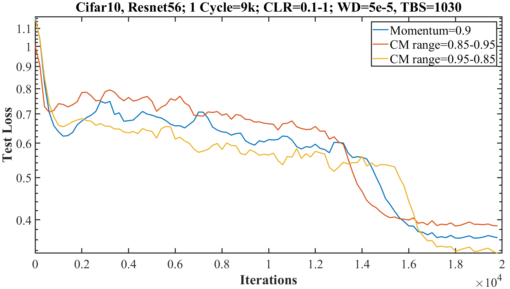

# A Disciplined Approach to Neural Network Hyper-Parameters: Part-I - Learning Rate, Batch Size, Momentum, and Weight Decay

Author: Leslie N. Smith

[Original Article](https://arxiv.org/pdf/1803.09820)

[Original Article HTML Version](https://www.arxiv-vanity.com/papers/1803.09820/)


## Abstract

+ how to examine the training validation/test loss function for subtle clues of underfitting and overfitting

+ suggesting guidelines for moving toward the optimal balancing point

+ experiments show that it is crucial to balance every manner of regularization for each dataset and architecture

+ weight decay used as a sample regularizer to show how its optimal value is tightly coupled with the learning rate and momentum

+ Files to replicate the [results](https://github.com/lnsmith54/hyperParam1)


## 1. Introduction

+ the process of setting the hyper-parameters
  + including the designing the network architecture
  + requiring expertise and extensive trial and error and time consuming

+ no simple and easy ways to set hyper-parameters
  + learning rate, batch size, momentum and weight decay
  + grid search or random search: computationally expensive and time consuming
  + James Bergstra and Yoshua Bengio. [Random search for hyper-parameter optimization](http://www.jmlr.org/papers/volume13/bergstra12a/bergstra12a.pdf). Journal of Machine Learning Research, 13(Feb):281–305, 2012.
  + training time and final performance: highly dependent on good choice
  + choosing the standard architecture and the hyper-parameter files freely available in model zoo or from gitgub.com

+ proposed methodologies for finding optimal settings for several hyper-parameters
  
+ goal: providing practical advice that saves time and effort, yet improves performance

+ basis of the approach
  + well-known concept of the balance between underfitting and overfitting
  + examining the training's test-/validation loss for clues of underfitting and overfitting to strive for optimal set of hyper-parameters
  + paying close attention while using cyclical learning rates and cyclical momentum
  + Leslie N Smith. [Cyclical learning rates for training neural networks](https://arxiv.org/abs/1506.01186). In Applications of Computer Vision (WACV), 2017 IEEE Winter Conference on, pp. 464–472. IEEE, 2017.


## 2. Related Work

+ Deep learning 
  + Ian Goodfellow, Yoshua Bengio, Aaron Courville, and Yoshua Bengio. [Deep learning, volume 1](http://www.deeplearningbook.org/). MIT press Cambridge, 2016.
  + Yoshua Bengio. [Practical recommendations for gradient-based training of deep architectures](https://arxiv.org/abs/1206.5533). In Neural networks: Tricks of the trade, pp. 437–478. Springer, 2012.
  + Klaus-Robert Müller, Grégoire Montavon, Geneviève B. Orr, Klaus-Robert Mülle. [Neural networks: tricks of the trade](http://93.174.95.29/main/950000/6b8768e619756f4e867282cfcec63f2e/%28Lecture%20Notes%20in%20Computer%20Science%207700%29%20Klaus-Robert%20M%C3%BCller%20%28auth.%29%2C%20Gr%C3%A9goire%20Montavon%2C%20Genevi%C3%A8ve%20B.%20Orr%2C%20Klaus-Robert%20M%C3%BCller%20%28eds.%29%20-%20Neural%20Networks_%20Tricks%20of%20the%20Trade_%20Second%20Edition-Springer-Ve.pdf). Springer, 2012.

+ early works of Leslie N. Smith
  + Leslie N Smith. No more pesky learning rate guessing games. arXiv preprint arXiv:1506.01186, 2015.
  + Leslie N Smith. [Cyclical learning rates for training neural networks](https://www.arxiv-vanity.com/papers/1506.01186/). In Applications of Computer Vision (WACV), 2017 IEEE Winter Conference on, pp. 464–472. IEEE, 2017.
  + Samuel L Smith, Pieter-Jan Kindermans, and Quoc V Le. [Don’t decay the learning rate, increase the batch size](https://www.arxiv-vanity.com/papers/1711.00489/). arXiv preprint arXiv:1711.00489, 2017.

+ use of large learning rate and small batch size
  + Stanisław Jastrzebski, Devansh Arpit, Nicolas Ballas, Vikas Verma, Tong Che, and Yoshua Bengio. [Residual connections encourage iterative inference](https://www.arxiv-vanity.com/papers/1710.04773/). arXiv preprint arXiv:1710.04773, 2017a.
  + Stanisław Jastrzebski, Zachary Kenton, Devansh Arpit, Nicolas Ballas, Asja Fischer, Yoshua Bengio, and Amos Storkey. [Three factors influencing minima in sgd](https://www.arxiv-vanity.com/papers/1711.04623/). arXiv preprint arXiv:1711.04623, 2017b.
  + Chen Xing, Devansh Arpit, Christos Tsirigotis, and Yoshua Bengio. [A walk with sgd](https://www.arxiv-vanity.com/papers/1802.08770/). arXiv preprint arXiv:1802.08770, 2018.
  + different optimal setting of learning rates and batch sizes in this report

+ exploring batch sizes and correlating the optimal batch size to the learning rate, size of the dataset, and momentum
  + Samuel L Smith and Quoc V Le. [Understanding generalization and stochastic gradient descent](https://www.arxiv-vanity.com/papers/1710.06451/). arXiv preprint arXiv:1710.06451, 2017.
  + more comprehensive and more practical in Sec. 4.2

+ use of regularization by weight decay and dropout
  + Alex Hernández-García and Peter König. [Do deep nets really need weight decay and dropout?](https://www.arxiv-vanity.com/papers/1802.07042/) arXiv preprint arXiv:1802.07042, 2018.
  + this report: the total regularization needs to be in balance for a given dataset and architecture
  + experiments suggestion: only add regularization by data augmentation to replace the regularization by weight decay and dropout w/o a full study of regularization

+ approaches to learn optimal hyper-parameters by differentiating the gradient w.r.t the hyper-parameters
  + Jonathan Lorraine and David Duvenaud. [Stochastic hyperparameter optimization through hypernetworks](https://www.arxiv-vanity.com/papers/1802.09419/). arXiv preprint arXiv:1802.09419, 2018.
  + this report: simpler to perform


## 3. The Unreasonable Effectiveness of Validation/Test Loss

+ a good detective observes subtle clues that the less observant miss.

+ purpose
  + draw attention to the clues in the training process
  + provide guidance as to their meaning

+ architecture & hyper-parameters
  + observing and understanding the clues available early during training
  + tuning w/ short runs of a few epochs
  + epoch defined as once through the entire training data
  + eliminating the necessary of running complete grid or random searches

+ comparison of training loss, validation accuracy, validation loss, and generalization error (Fig. 1)
  + These runs are a learning rate range test with the resnet-56 architecture and Cifar-10 dataset.
  + Characteristic plot of training loss, validation accuracy, and validation loss (left diagram)
    + plots of the training loss, validation accuracy, and validation loss for a learning rate range test of a residual network on the Cifar dataset to find reasonable learning rates for training
    + the test loss within the black box: signs of overfitting at learning rates of $0.01 - 0.04$
    + example where the test loss provide valuable information

  <div style="margin: 0.5em; display: flex; justify-content: center; align-items: center; flex-flow: row wrap;">
    <a href="https://www.arxiv-vanity.com/papers/1803.09820/" ismap target="_blank">
      
      
    </a>
  </div>

+ __REMARK 1.__ the test/validation loss is a good indicator of the network's convergence.
  + the test/validation loss used to provide insights on the training process
  + the final test accuracy used for comparing performance


### 3.1 A Review of the Underfitting and Overfitting Trade-off

+ Underfitting
  + unable to reduce the error for either the test or training set
  + cause: an under capacity of the machine learning model
  + not powerful enough to fit the underlying complexities of the data distribution

+ Overfitting: model so powerful as to fit the training set too well and the generalization error increases

+ Pictorial explanation of the tradeoff between underfitting and overfitting (Fig. 2)
  + model complexity (the x axis) refers to the capacity or powerfulness of the machine learning model
  + the optimal capacity falls between underfitting and overfitting
  + achieving a horizontal test loss during the training of a network can also point to the optimal balance of the hyper-parameter

  <div style="margin: 0.5em; display: flex; justify-content: center; align-items: center; flex-flow: row wrap;">
    <a href="https://www.arxiv-vanity.com/papers/1803.09820/" ismap target="_blank">
      
    </a>
  </div>

+ __REMARK 2.__ achieving the horizontal part of the test loss is the goal of hyper-parameter tuning
  + difficult with deep neural network
  + with networks becoming more powerful with greater depth (i.e., more layers), width (i.e., more neurons or filters per layer), and the addition of skip connections to its architecture
  + various forms of regularization, such as weight decay or dropout
  + Nitish Srivastava, Geoffrey Hinton, Alex Krizhevsky, Ilya Sutskever, and Ruslan Salakhutdinov. Dropout: A simple way to prevent neural networks from overfitting. The Journal of Machine Learning Research, 15(1):1929–1958, 2014.
  + important hyper-parameters
  + using a variety of optimization methods
  + Diederik Kingma and Jimmy Ba. Adam: A method for stochastic optimization. arXiv preprint arXiv:1412.6980, 2014.

+ Insight of underfitting and overfitting
  + signs of the underfitting and overfitting of the test or validation loss early in the training process useful for tuning the hyper-parameters
  + Fig. 1a: some overfitting within the black square indicates a suboptimal choice of hyper-parameters
  + well set initial values for hyper-parameters results in performing well through the entire training process
  + the test loss during the training process used to find the optimal network architecture and hyper-parameters w/o performing a full training to compare the final performance results


### 3.2 Underfitting

+ Underfitting visible during the training (Fig. 3)
  + Underfitting is characterized by a continuously decreasing test loss, rather than a horizontal plateau.
  + Fig. 3(a) Test loss for the Cifar-10 dataset with a shallow 3 layer network
    + red curve
      + decreasing test loss w/ a learning rate ($LR = 0.001$)
      + Underfitting: continue to decrease
    + blue curve
      + decreasing more rapidly during the initial iterations and then is horizontal
      + __a positive clue__: the configuration producing a better final accuracy than other configuration
  + Fig. 3(b) Test loss for Imagenet with two networks; resnet-50 and inception-resnet-v2
    + underfitting: underlying complexities of the data distributions
    + the test loss continues decreasing over the 100,000 iterations (about 3 epochs)
    + the inception-resnet-v2 decreasing more and becoming more horizontal
    + the inception-resnet-v2 less underfitting

  <div style="margin: 0.5em; display: flex; justify-content: center; align-items: center; flex-flow: row wrap;">
    <a href="https://www.arxiv-vanity.com/papers/1803.09820/" ismap target="_blank">
      
      
    </a>
  </div>


### 3.3 Overfitting

+ Previous examples
  + Overfitting more complicated than underfitting but clues are visible in the test loss
  + Fig. 2: the test loss from underfitting (deceasing) to overfitting (increasing), but overfitting in neural network is often not so simple
  + Fig. 1 the test loss (blue curve)
    + signs of overfitting at small learning rate $(0.01 \sim 0.04)$
    + decreasing at higher rates as though it is underfitting
    + too small learning rate exhibits overfitting behavior

+ Examples of overfitting (Fig. 4)
  + increasing validation/test loss indicates overfitting
  + Fig. 4(a): Cifar-10 dataset with a shallow 3 layer network
    + $WD = 10^{-4}$ (blue curve): minimizing near at $LR = 0.002$, then increasing (overfitting)
    + $WD = 4 \times 10^{-3}$: (red curve)
      + stable at a larger LR range
      + attain a lower loss value
      + better than the previous one
      + diverging at $LR = 0.008$
    + $WD = 10^{-2}$ (yellow curve): sharp increasing at $LR = 0.005$
      + not a sign of overfitting
      + caused by instabilities in the training due to the large learning rate
  + Fig. 4(b): Imagenet dataset with resnet-50 architecture
    + blue curve: underfitting w/ $LR = 0.1$ and $WD = 10^{-4}$
    + red curve: overfittign w/ a ver small $WD = 10^{-7}$

  <div style="margin: 0.5em; display: flex; justify-content: center; align-items: center; flex-flow: row wrap;">
    <a href="https://www.arxiv-vanity.com/papers/1803.09820/" ismap target="_blank">
      
      
    </a>
  </div>

+ Additional examples of overfitting
  + Fig. 7(a): Cyclical momentum tests for the Cifar-10 dataset with a shallow 3 layer network
    + the value of momentum matters
    + yellow curve:


## 4. Cyclical Learning Rates, Batch Sizes, Cyclical Momentum, and Weight Decay

+ The conventional method: perform a grid or a random search, which can be computationally expensive and time consuming


### 4.1 Cyclical Learning Rates and Super-convergence Revisited

+ Learning Rate (LR)
  + too small: overfitting
  + too large: diverge
  + large: regularize the training

+ Cyclical learning rates (CLR)
  + Leslie N Smith. [No more pesky learning rate guessing games](https://www.arxiv-vanity.com/papers/1506.01186/). arXiv preprint arXiv:1506.01186, 2015.
  + Leslie N Smith. [Cyclical learning rates for training neural networks](https://arxiv.org/abs/1506.01186). In Applications of Computer Vision (WACV), 2017 IEEE Winter Conference on, pp. 464–472. IEEE, 2017.
  + Hyper-parameters required: minimum and maximum learning rate boundaries and a stepsize
  + stepsize: the number of of iterations (or epochs) used for each step
  + a cycle consisting of two such steps
    + the learning rate linearly increasing from the minimum to the maximum
    + the learning rate linearly decreasing from the maximum to the minimum

+ Learning rate range test (LR range test)
  + starting with a small learning rate which is slowly increased linearly throughout a pre-training run
  + this single run providing valuable information on how well the network can be trained over a range of learning rates abd what is the maximum learning rate
  + the increasing of the learning rate will cause the test/validation loss to increase and the accuracy to decrease
  + the learning rate at the extrema as the largest value used as the maximum bound
  + ways to choice the minimum bound
    + a factor of 3 or 4 less than the maximum bound
    + a factor of 10 or 20 less than the maximum bound if only one cycle used
    + by a short test of hundreds of iterations with a few initial learning rates and pick the largest one that allows convergence to begin w/o signs of overfitting
  + there is a maximum speed the learning rate can increase w/o the training becoming unstable, which effects the choices for the minimum and maximum learning rates

+ Super-convergence
  + Leslie N Smith and Nicholay Topin. [Super-convergence: Very fast training of residual networks using large learning rates](https://www.arxiv-vanity.com/papers/1708.07120/). arXiv preprint arXiv:1708.07120, 2017.
  + happen when using deep resnets on cifar-10 or cifat-100 data
  + the test loss and accuracy remain nearly constant for this LR range test, even up to very large learning rates
  + the network trained quickly with one learning rate cycle by using an unusually large learning rate
  + very large learning rates used providing the twin benefits of regularization that prevented overfitting and faster training of the networks
  + Faster training is possible by allowing the learning rates to become large.
  + other regularization methods must be reduced to compensate for the regularization effects of large learning rates
  + super-convergence is universal and provides additional guidance on why, when, and where this is possible
  + Fig. 5(a): An example of super-convergence
    + thee training was completed in 10,000 iterations by using learning rates up to 3.0 instead of needing 80,000 iterations w/ a constant initial learning rate of 0.1
    + modification of cyclical learning rate policy for super-convergence
  + Fig. 5(b): The effect of weight decay
    + $WD \leq 10^{-4}$: allowing the use of large learning rates (i.e., up to 3)
    + $WD = 10^{-3}$: eliminating the ability to train the networks with such a large learning rate
    + the regularization needs to be balanced
    + required to reduce other forms of regularization to utilize the regularization from large learning rates ad gain the other benefit  - faster training

  <div style="margin: 0.5em; display: flex; justify-content: center; align-items: center; flex-flow: row wrap;">
    <a href="https://www.arxiv-vanity.com/papers/1803.09820/" ismap target="_blank">
      
      
    </a>
  </div>

+ "1cycle" learning rate policy
  + always using one cycle that is smaller than the total number of iterations/epochs and allow the learning rate to decrease several orders of magnitude less than the initial learning rate for the remaining iterations
  + experiments shows the accuracy to plateau before the training ends
  + a combination of curriculum learning and simulated annealing
  + Yoshua Bengio, Jerome Louradour, Ronan Collobert, and Jason Weston. [Curriculum learning. In Proceedings of the 26th annual international conference on machine learning](https://dx.doi.org/10.1145/1553374.1553380), pp. 41–48. ACM, 2009.
  + Emile Aarts and Jan Korst. Simulated annealing and boltzmann machines. 1988.

+ Regularization
  + forms of regularization
    + large learning rates
    + small batch sizes
    + weight decay
    + dropout
  + Nitish Srivastava, Geoffrey Hinton, Alex Krizhevsky, Ilya Sutskever, and Ruslan Salakhutdinov. [Dropout: A simple way to prevent neural networks from overfitting](https://www.cs.toronto.edu/~hinton/absps/JMLRdropout.pdf). The Journal of Machine Learning Research, 15(1):1929–1958, 2014.
  + balancing the various forms of regularization for each dataset and architecture in order to obtain good performance

+ __REMARK 3.__ the amount of regularization must be balanced for each dataset and architecture
  + permit general use of super-convergence
  + reducing other forms of regularization
  + regularized w/ very large learning rates makes training significantly and efficient

+ More experiments
  + datasets: MNIST, Cifar10, Cifar-100, imagenet
  + architectures: shallow nets, resnets, wide resnets, densenets, inception-resnet
  + trained more quickly w/ large learning rates
  + provided other forms of regularization reduced to an optimal balanced point


### 4.2 Batch Size

+ small batch sizes
  + recommended for regularization effects
  + D Randall Wilson and Tony R Martinez. [The general inefficiency of batch training for gradient descent learning](http://axon.cs.byu.edu/papers/Wilson.nn03.batch.pdf). Neural Networks, 16(10):1429–1451, 2003.
  + optimal batch size on the order of 80 for Cifar-10
  + Samuel L Smith and Quoc V Le. [Understanding generalization and stochastic gradient descent](https://www.arxiv-vanity.com/papers/1710.06451/). arXiv preprint arXiv:1710.06451, 2017.
  + using a large batch size when using the 1cycle learning rate schedule

+ comparing batch sizes
  + issue: conflicting results if one maintains a constant number of epochs vs. a constant number of iterations
  + neither appropriate for comparing different batch sizes
    + constant epochs: not account for the significant computational efficient of large batch size so it penalizes larger batch sizes
    + constant iterations: favor of larger batch sizes too much
  + larger batch sizes $\to$ the use of larger learning rate in the 1cycle learning rate schedule
  + best practice: maintaining a near constant execution time
  + people interested in minimizing training time while maintaining high performance

+ __REMARK 4.__ the practitioner's goal is obtaining the highest performance while minimizing the needed computational time
  + examined in conjunction with the execution time of the training
  + choosing the number of epochs/iterations for training should be large enough to maximize the final test performance but no larger

+ The effects of total batch size (TBS)
  + The effects of total batch size (TBS) on validation loss for the Cifar-10 with resnet-56 and a 1cycle learning rate schedule.
  + For a fixed computational budget, larger TBS yields higher test accuracy but smaller TBS has lower test loss.
  + Fig 6(a): The effect of batch size on test accuracy
    + 4 curves for TBS = 128, 256, 512, and 1024
    + nearly fixed number of iterations/epochs about 26 mins on an IBM Power8
    + found by a grid search on the minimum number of epochs on the minimum number of epochs needed for the TBS=128 case to obtain an optimal accuracy
    + larger batch size ran  in fewer iterations
    + larger batch sizes had more epochs (TBS/epochs = 128/48, 256/70, 512/95, 1024/116)
    + larger learning rates used with the larger batch sizes
    + TBS = 512: a good choice for this dataset, architecture, and computer architecture
  + Fig. 6(b): the validation loss for the same runs
    + the larger batch sizes w/ lower loss values early in the training
    + the final loss values are lower as the batch sizes decrease, opposite performance as accuracy results

  <div style="margin: 0.5em; display: flex; justify-content: center; align-items: center; flex-flow: row wrap;">
    <a href="https://www.arxiv-vanity.com/papers/1803.09820/" ismap target="_blank">
      
      
    </a>
  </div>

+ Other recommendations
  + modifying the batch size, rather than the learning rates
    + Samuel L Smith, Pieter-Jan Kindermans, and Quoc V Le. [Don’t decay the learning rate, increase the batch size](https://www.arxiv-vanity.com/papers/1711.00489/). arXiv preprint arXiv:1711.00489, 2017.
    + Stanisław Jastrzebski, Zachary Kenton, Devansh Arpit, Nicolas Ballas, Asja Fischer, Yoshua Bengio, and Amos Storkey. [Three factors influencing minima in sgd](https://www.arxiv-vanity.com/papers/1711.04623/). arXiv preprint arXiv:1711.04623, 2017b.
  + the batch size limited by the hardware's memory, while the learning rate not
  + using a batch size that fits in the hardware's memory and enable using larger learning rates


### 4.3 Cyclical Momentum

+ Momentum and learning rate
  + closely related
  + optimal learning rate dependent on the momentum; momentum dependent on the learning rate
  + learning rate: the most important hyper-parameter to tune
  + Yoshua Bengio. [Practical recommendations for gradient-based training of deep architectures](https://www.arxiv-vanity.com/papers/1206.5533/). In Neural networks: Tricks of the trade, pp. 437–478. Springer, 2012.
  + momentum also important
  + setting momentum as large as possible w/o causing instabilities during training

+ Mathematical Representation of Momentum
  + momentum: designed to accelerate network training but its effect on updating the weights is of the sam magnitude as the learning rate
  + Assumptions & Notations
    + $\theta$: all the network parameter
    + $\epsilon$: the learning rate
    + $\delta F(x, \theta)$: the gradient
    + $\v$: velocity
    + $\alpha$: the momentum coefficient
  + Stochastic gradient descent (SGD): updating the weight using the negative gradient

    \[\theta_{iter + 1} = \theta_{iter} - \epsilon \delta L(F(x, \theta), \theta) \tag{1}\]

  + update weight with momenum

    \[v_{iter + 1} = \alpha \, v_{iter} - \epsilon \delta F(x, \theta), \theta) \tag{2}\]

    \[\theta_{iter + 1} = \theta_{iter} + v \tag{3}\]

  + momentum: similar impact on the weight updates as the learning rate
  + velocity: a moving average of the gradient

+ Cyclic Momentum
  + cyclic learning rate, in particular, the learning rate range test: useful methods to find an optimal learning rate
  + experiment: moment range test NOT useful for finding an optimal momentum (Fig. 7(b))
  + using a decreasing cyclical momentum when the learning rate increases provides an equivalent result to the best constant momentum value but stabilizes the training to allow larger learning rates
  + useful for starting with a large momentum and decreasing momentum while the learning rate is increasing
  + the learning rate improves the test accuracy and makes the training more robust to large learning rates
  + implementation is straightforward
  + example code in Appendix

+ __REMARK 5.__ optimal momentum value(s) will improve network training
  + the optimal training procedure: a combination of
    + an increasing cyclical learning rate w/ an initial small learning rate permits convergence to begin
    + a decreasing cyclical momentum w/ allowing the learning rate to become larger in the early to middle parts of training
  + a constant learning rate and a decreasing cyclical momentum (0.9 ~ 0.99):
    + acting like a pseudo increasing rate
    + speeding up the training
  + too large momentum value
    + poor training results
    + visible early in the training
    + quickly tested

+ Cyclical momentum tests for the Cifar-10 dataset with a shallow 3 layer network
  + Fig. 7(a): the importance of the momentum with a 3-layer network on the Cifar-10 dataset
    + best momentum: 0.9
    + optimal choice for learning rate clearly depends on the momentum
    + Momentum = 0.99 (yellow curve): signs of overfitting (the upward slant after the minimum loss) before diverging (near the learning rate of 0.01)
    + Momentum = 0.9 (blue curve): no sign of overfitting
  + Fig. 7(b): increasing the momentum not found an optimal value
    + the momentum increases from 0.7 to 1 w/o
      + test loss continues decreasing
      + accuracy continues increasing
    + no optimal momentum
  + Fig. 7(c): a LR range test for a shallow, 3-layer architecture on Cifar-10
    + learning rate: $0.002 \sim 0.02$
    + blue curve: constant momentum 
    + red curve: a increasing learning rate w/ a linearly increasing momentum (0.8 - 1.0)
    + trade-offs
      + the increasing momentum stabilizes the convergence to a larger learning rate
      + the minimum test loss is higher than the minimum test loss for the constant momentum case
    + benefits for decreasing the momentum while increasing the learning rate
      + a lower minimum test loss (yellow & purple curves)
      + faster initial convergence (yellow & purple curves)
      + greater convergence stability over a larger range of learning rates (yellow curve)
  + Fig. 7(d): Comparisons of a constant momentum and cyclical momentum
    + each curve is the average of four runs
    + each run has a slightly different TBS
    + average TBS = 536
    + the learning rate drops by a factor or 0.316 at iterations 10k, 15k, 17.5k, and 19k
    + the test accuracy for the constant momentum w/o plateau
    + some degree of underfitting while the cyclical case plateau before iterations 10,000 and 20,000


  <div style="margin: 0.5em; display: flex; justify-content: center; align-items: center; flex-flow: row wrap;">
    <a href="https://www.arxiv-vanity.com/papers/1803.09820/" ismap target="_blank">
      
      
    </a>
  </div>
  <div style="margin: 0.5em; display: flex; justify-content: center; align-items: center; flex-flow: row wrap;">
    <a href="https://www.arxiv-vanity.com/papers/1803.09820/" ismap target="_blank">
      
      
    </a>
  </div>

+ Momentum effect
  + a larger value of momentum
    + speeding up the training
    + threaten the stability
    + causing divergence
  + a large momentum helping escape saddle points but can hurt the final convergence
  + Tianyi Liu, Zhehui Chen, Enlu Zhou, and Tuo Zhao. [Toward deeper understanding of nonconvex stochastic optimization with momentum using diffusion approximations](https://www.arxiv-vanity.com/papers/1802.05155/). arXiv preprint arXiv:1802.05155, 2018.
  + cyclical momentum not better than a constant value
  + better proceure: test momentum in the range $[0.9, 0.99]$ and choose a value that performs best

+ Cyclical momentum tests
  + a cyclical momentum of $0.95-0.85$ provides an equivalent result as to the optimal choice of $0.95$
  + For deep architectures, such as resnet-56, combining cyclical learning and cyclical momentum is best, while for shallow architectures optimal constant values work as well as cyclical ones.
  + SS = stepsize, where two steps in a cycle in epochs, WD = weight decay.

  <table style="font-family: arial,helvetica,sans-serif;" table-layout="auto" cellspacing="0" cellpadding="5" border="1" align="center" width=90%>
    <caption style="font-size: 1.5em; margin: 0.2em;"><a href="https://www.arxiv-vanity.com/papers/1803.09820/">Cyclical momentum tests: final accuracy and standard deviation for the Cifar-10 dataset with various architectures</a></caption>
    <thead>
    <tr>
      <th style="text-align: center; background-color: #3d64ff; color: #ffffff; width:10%;">Architecture</th>
      <th style="text-align: center; background-color: #3d64ff; color: #ffffff; width:10%;">LR/SS</th>
      <th style="text-align: center; background-color: #3d64ff; color: #ffffff; width:10%;">momentum/SS</th>
      <th style="text-align: center; background-color: #3d64ff; color: #ffffff; width:10%;">WD</th>
      <th style="text-align: center; background-color: #3d64ff; color: #ffffff; width:10%;">TBS/Epochs</th>
      <th style="text-align: center; background-color: #3d64ff; color: #ffffff; width:10%;">Accuracy (%)</th>
    </tr>
    </thead>
    <tbody>
    <tr style="text-align: center;">
      <td rowspan="10">3-layer</td><td rowspan="5">0.0005-0.005/11</td><td>0.95-0.85/11</td><td>$3 \times 10^{-3}$</td><td>128/25</td><td>$81.3 \pm 0.1$</td>
    </tr>
    <tr  style="text-align: center;">
      <td>0.90-1.00/11</td><td>$3 \times 10^{-3}$</td><td>128/25</td><td>$80.2 \pm 0.1$</td>
    </tr>
    <tr  style="text-align: center;">
      <td>0.85</td><td>$3 \times 10^{-3}$</td><td>128/25</td><td>$79.5 \pm 0.1$</td>
    </tr>
    <tr  style="text-align: center;">
      <td>0.90</td><td>$3 \times 10^{-3}$</td><td>128/25</td><td>$80.2 \pm 0.4$</td>
    </tr>
    <tr  style="text-align: center;">
      <td>0.95</td><td>$3 \times 10^{-3}$</td><td>128/25</td><td>$81.2 \pm 0.2$</td>
    </tr>
    <tr  style="text-align: center;">
      <td rowspan="5">0.0005</td><td>0.95-0.85/11</td><td>$3 \times 10^{-3}$</td><td>128/25</td><td>$80.8 \pm 0.3$</td>
    </tr>
    <tr  style="text-align: center;">
      <td>0.90-1.00/11</td><td>$3 \times 10^{-3}$</td><td>128/25</td><td>$80.9 \pm 0.3$</td>
    </tr>
    <tr  style="text-align: center;">
      <td>0.85</td><td>$3 \times 10^{-3}$</td><td>128/25</td><td>$80.2 \pm 0.3$</td>
    </tr>
    <tr  style="text-align: center;">
      <td>0.90</td><td>$3 \times 10^{-3}$</td><td>128/25</td><td>$81.0 \pm 0.2$</td>
    </tr>
    <tr  style="text-align: center;">
      <td>0.95</td><td>$3 \times 10^{-3}$</td><td>128/25</td><td>$81.0 \pm 0.1$</td>
    </tr>
    <tr  style="text-align: center;">
      <td rowspan="10">resnet-56</td><td rowspan="5">0.08-0.80/41</td><td>0.95-0.8/41</td><td>$10^{-4}$</td><td>512/95</td><td>$92.0 \pm 0.2$</td>
    </tr>
    <tr  style="text-align: center;">
      <td>0.90-1.00/41</td><td>$10^{-4}$</td><td>512/95</td><td>$91.4 \pm 0.1$</td>
    </tr>
    <tr  style="text-align: center;">
      <td>0.85</td><td>$10^{-4}$</td><td>512/95</td><td>$90.8 \pm 0.3$</td>
    </tr>
    <tr  style="text-align: center;">
      <td>0.90</td><td>$10^{-4}$</td><td>512/95</td><td>$91.4 \pm 0.3$</td>
    </tr>
    <tr  style="text-align: center;">
      <td>0.95</td><td>$10^{-4}$</td><td>512/95</td><td>$92.1 \pm 0.1$</td>
    </tr>
    <tr  style="text-align: center;">
      <td rowspan="5">0.1</td><td>0.95-0.85/41</td><td>$10^{-4}$</td><td>512/95</td><td>$89.1 \pm 0.3$</td>
    </tr>
    <tr  style="text-align: center;">
      <td>0.90-1.00/41</td><td>$10^{-4}$</td><td>512/95</td><td>$88.1 \pm 0.5$</td>
    </tr>
    <tr  style="text-align: center;">
      <td>0.85</td><td>$10^{-4}$</td><td>512/95</td><td>$87.8 \pm 0.3$</td>
    </tr>
    <tr  style="text-align: center;">
      <td>0.90</td><td>$10^{-4}$</td><td>512/95</td><td>$88.1 \pm 0.1$</td>
    </tr>
    <tr  style="text-align: center;">
      <td>0.95</td><td>$10^{-4}$</td><td>512/95</td><td>$88.8 \pm 0.3$</td>
    </tr>
    </tbody>
  </table>

+ Examples of the cyclical momentum with the Cifar-10 dataset and resnet-56
  + Fig. 8(a): Constant momentum versus two forms for cyclical momentum
    + a test of cyclical momentum on resnet-56
    + fast convergence at large learning rates by cycling up from 0.1 to 1.0 in 9,000 iterations, then down to 0.001 at iteration 18,000
    + decreasing the momentum while increasing the learning rate produces a better performance than a constant momentum or increasing the momentum with the learning rate
  + Fig. 8(b): same experiment as Fig. 6(a) but with cyclical momentum
    + all the general lession learned from the shallow network carried over to the deep networks

  <div style="margin: 0.5em; display: flex; justify-content: center; align-items: center; flex-flow: row wrap;">
    <a href="https://www.arxiv-vanity.com/papers/1803.09820/" ismap target="_blank">
      
      
    </a>
  </div>


### 4.4 Weight Decay

+ Weight decay
  + a form of regularization
  + balancing the various forms of regularization to obtain good performance
  + review of regularization methods: Jan Kukačka, Vladimir Golkov, and Daniel Cremers. [Regularization for deep learning: A taxonomy](https://www.arxiv-vanity.com/papers/1710.10686/). arXiv preprint arXiv:1710.10686, 2017.
  + best practice: remaining constant through the training
  + generally applied for regularization
  + network performance: proper weight decay value
  + the validation loss early in the training: sufficient for determining a good value
  + reasonable procedure: combined CLR and CM runs at a few values of the weight decay to simultaneously determine the best learning rates, momentum and weight decay

+ Weight decay values
  + reasonable values: $10^{-3}, 10^{-4}, 10^{-5}$ and $0$
  + smaller datasets and architectures: larger values for weight decay
  + larger datasets and deeper architectures: maller values
  + hypothesis: complex data provides its own regularization and other regularization should be reduced
  + experince: $10^{-4}$ about right w/ initial runs at $3 \times 10^{-5}, 10^{-4}, 3 \times 10^{-4}$
  + bisection of the expoonent rather than bisecting the value ($10^{-3.5} = 3.16 \times 10^{-4}$)
  + make a follow up run that bisects the exponent of the best two of these if none seem best, extrapolate toward an improved value

+ __REMARK 6.__ the amount of regularization must be balanced for each dataset and architecture
  + the value of weight decay: key knob to tune regularization against the regualrization from an increasing learning rate
  + other regularization generally fixed
  + weight decay changed easily when experitmenting with maximum learning rate and stepsize values

+ Examples of weight decay search using a 3-layer network on the Cifar-10 dataset
  + Training used a constant learning rate (0.005) and constant momentum (0.95).
  + The best value for weight decay is easier to interpret from the loss than from the accuracy.
  + Fig. 9(a): the validation loss of a grid search for a 3-layer network on Cifar-10 data
    + LR = 0.005 and Momentum = 0.95
    + $WD = 1 \times 10^{-2}$ (yellow curve): too large
    + $WD = 10^{-3)} (blue curve): too small; overfitting
    + $WD = 3.2 \times 10^{-3}$ (red curve): a goof choice
    + $WD = 10^{-2.75} = 1.8 \times 10^{-3}$ (purple curve)
  + Fig. 9(b): the accuracy results from tainings
    + the validation loss: predictive of the best final accuracy

  <div style="margin: 0.5em; display: flex; justify-content: center; align-items: center; flex-flow: row wrap;">
    <a href="https://www.arxiv-vanity.com/papers/1803.09820/" ismap target="_blank">
      
      
    </a>
  </div>

+ More examples of weight decay search using a 3-layer network on the Cifar-10 dataset
  + Training used cyclical learning rates (0.001 - 0.01) and cyclical momentum (0.98 - 0.9).
  + The best value of weight decay is smaller when using CLR because the larger learning rates help with regularization.
  + the runs of a learning rate range test w/ a decreaseing momentum
    + learning rate range: $LR=0.001 - 0.01$
    + momentum: $0.98 - 0.8$
    + $weight decay: $WD = 10^{-2}, 3.2 \times 10^{-3}, 10^{-3}$
  + Fig. 10(a): test loss
    + $WD = 3.2 \times 10^{-3}$: seem the best result
    + $WD = 1.8 \times 10^{-3}$: better due to remaining stable for larger learning rates w/ a slightly lower validation loss
  + Fig. 10(b): the accuracy
    + a slightly improved accuracy at learning rates above 0.005

  <div style="margin: 0.5em; display: flex; justify-content: center; align-items: center; flex-flow: row wrap;">
    <a href="https://www.arxiv-vanity.com/papers/1803.09820/" ismap target="_blank">
      
      
    </a>
  </div>

+ Grid search for weight decay (WD) on Cifar-10 with resnet-56 and a constant momentum=0.95 and TBS = 1,030
  + The optimal weight decay is different if you search with a constant learning rate (left) versus using a learning rate range (right) due to the regularization by large learning rates.
  + different optimal weight decay: a constat learning rate vs. a learning rate range
  + the larger learning rates provide regularizatoin so a smaller weight decay value is optimal
  + Fig. 11(a): the results of a weight decay search with a constant learning rate of 0.1
    + $WD = 10^{-4}$: overfitting
    + $WD = 10^{-3}$: better
    + $WD = 3.2 \times 10^{-4}$ and $WD = 5.6 \times 10^{-4}$: similar
  + Fig. 11(b): the results of a weight decay search using a learning rate range test from 0.1 to 1.0
    + $WD = 10^{-4}$: the best
    + $LR \in [0.5, 0.8]$: recommended

  <div style="margin: 0.5em; display: flex; justify-content: center; align-items: center; flex-flow: row wrap;">
    <a href="https://www.arxiv-vanity.com/papers/1803.09820/" ismap target="_blank">
      
      
    </a>
  </div>

+ Grid search for the optimal WD restarting from a snapshot
  + dataset: Cifar-10
  + a grid search for aweight decay to make a single run at a middle value for weight decay and save a snapshot after the loss plateau
  + using the snapshot to restart runs w/ different WD values
  + Fig. 12(a): 3-layer network
    + the initial run w/ a sun-optimal $WD = 10^{-3}$
    + continuation runs: $WD = 10^{-3}, 3 \times 10^{-3}$ and $10^{-2}$
    + best perfromance $WD = 3 \times 10^{-3}$
  + Fig. 12(b): a weight-decay grid search from a snaoshot for resnet-56
    + the first half of the range test w/ $WD = 10^{-4}$
    + $WD = 10^{-4}$: best result

  <div style="margin: 0.5em; display: flex; justify-content: center; align-items: center; flex-flow: row wrap;">
    <a href="https://www.arxiv-vanity.com/papers/1803.09820/" ismap target="_blank">
      
      
    </a>
  </div>


## 5. Experiments with Other Architectures and Datasets

+ recommendations for finding a good set of hyper-parameters w/ a given dataset and architecture
  1. Learning rate (LR)
    + perform a learning rate range test to a "large" learning rate
    + max LR depends onm architecture
      + shallow 3-layer architecture: 0.01
      + resnet: 3.0
    + 1cycle LR policy
      + max LR: from an LR range test
      + min LR: $LR_{max} / 10$ but othger facts relevant, such as the rate of learning rate increase
  2. Total batch size (TBS):
    + larget batch size working well
    + constrainted by the GPU memory
    + TBS = batch size on a GPU x the number of GPUs
    + able to comapre different performance w/ batch sizes if archecture small or hardware permitted very large batch size
    + small batch sizes add regularizaton wjile large batch sizes add less $\to$ balacing the proepr amount of regularization
    + better to use  a large batch size  $\implies$ able to use larger learning rate
  3. Momentum
    + short runs w/ momentum values: 0.99, 0.97, 0.95, and 0.9 to attain the best value for momentum
    + 1cycle learning rate schedule: using cyclical momentum (CM)
    + CM procedure: starting at the maximum momentum and decreasing with increasing learning rate (0.8 or 0.85)
    + performance almosy indepent of the minimum momentum value
    + cyclical momentum + LR range test: stablizeing the convergence when using large learning rate values more than a constant momentum does
  4. Weight decsy (WD)
    + a grid search to determine the proper magnitude
    + usually not requiring more than one significant figure accuracy
    + value setting: knowledge of the dataset and architecture used
    + more complex dataset requiring less regularization: test smaller WD, such as $10^{-4}, 10^{-5}, 10^{-6}$ and 0
    + shallow architecture requireing more regularization: test larger WD values, such as $10^{-2}, 10^{-3}, 10^{4}$

+ Hyper-parameter optimization: reasonably quicl if searching for clues in the test loss early in the training

+ [Files](https://github.com/lnsmith54/hyperParam1) to replicate the results

+ Final accuracy and standard deviation for various datasets and architectures
  + The total batch size (TBS) for all of the reported runs was 512. 
  + PL = learning rate policy, SS = stepsize in epochs, where two steps are in a cycle, WD = weight decay, CM = cyclical momentum. 
  + Either SS or PL is provide in the Table and SS implies the cycle learning rate policy.

  <table style="font-family: arial,helvetica,sans-serif;" table-layout="auto" cellspacing="0" cellpadding="5" border="1" align="center" width=90%>
    <caption style="font-size: 1.5em; margin: 0.2em;"><a href="https://www.arxiv-vanity.com/papers/1803.09820/">Final accuracy and standard deviation for various datasets and architectures</a></caption>
    <thead>
    <tr>
      <th style="text-align: center; background-color: #3d64ff; color: #ffffff; width:10%;">Dataset</th>
      <th style="text-align: center; background-color: #3d64ff; color: #ffffff; width:10%;">Architecture</th>
      <th style="text-align: center; background-color: #3d64ff; color: #ffffff; width:10%;">CLR/SS/PL</th>
      <th style="text-align: center; background-color: #3d64ff; color: #ffffff; width:10%;">CM/SS</th>
      <th style="text-align: center; background-color: #3d64ff; color: #ffffff; width:10%;">WD</th>
      <th style="text-align: center; background-color: #3d64ff; color: #ffffff; width:10%;">Epochs</th>
      <th style="text-align: center; background-color: #3d64ff; color: #ffffff; width:10%;">Accuracy (%)</th>
    </tr>
    </thead>
    <tbody>
    <tr style="text-align: center;">
      <td rowspan="14">Cifar-10</td> <td rowspan="7">wide resnet</td> <td rowspan="4">0.1/Step</td> <td rowspan="4">0.9</td> <td rowspan="4">$10^{-4}$</td> <td>100</td> <td>$86.7 \pm 0.6</td>
    </tr>
    <tr style="text-align: center;">
      <td>200</td> <td>$88.7 \pm 0.6$</td>
    </tr>
    <tr style="text-align: center;">
      <td>400</td> <td>$98.8 \pm 0.4$</td>
    </tr>
    <tr style="text-align: center;">
      <td>800</td> <td>$90.3 \pm 1.0$</td>
    </tr>
    <tr style="text-align: center;">
      <td>0.1-0.5/12</td> <td>0.95-0.85/12</td> <td>$10^{-4}$</td> <td>25</td> <td>$87.3 \pm 0.8$</td>
    </tr>
    <tr style="text-align: center;">
      <td>0.1-1.0/23</td> <td>0.95-0.85/23</td> <td>$10^{-4}$</td> <td>50</td> <td>$91.3 \pm 0.1$</td>
    </tr>
    <tr style="text-align: center;">
      <td>0.1-1.0/45</td> <td>0.95-0.85/45</td> <td>$10^{-4}$</td> <td>100</td> <td>$91.9 \pm 0.2$</td>
    </tr>
    <tr style="text-align: center;">
      <td rowspan="7">densenet</td> <td rowspan="3">0.1/Step</td> <td rowspan="3">0.9</td> <td>$10^{-4}$</td> <td>100</td> <td>$91.3 \pm 0.2$</td>
    </tr>
    <tr style="text-align: center;">
      <td>$10^{-4}$</td> <td>200</td> <td>$92.1 \pm 0.2$</td>
    </tr>
    <tr style="text-align: center;">
      <td>$10^{-4}$</td> <td>400</td> <td>$92.7 \pm 0.2$</td>
    </tr>
    <tr style="text-align: center;">
      <td>0.1-4/22</td> <td>0.90-0.85/22</td> <td>$10^{-6}$</td> <td>50</td> <td>$91.7 \pm 0.3$</td>
    </tr>
    <tr style="text-align: center;">
      <td>0.1-4.0/34</td> <td>0.9-0.85/34</td> <td>$10^{-6}$</td> <td>75</td> <td>$92.1 \pm 0.2$</td>
    </tr>
    <tr style="text-align: center;">
      <td>0.1-4.0/45</td> <td>0.90-0.85/45</td> <td>$10^{-6}$</td> <td>100</td> <td>$92.2 \pm 0.2$</td>
    </tr>
    <tr style="text-align: center;">
      <td>0.1-4.0/70</td> <td>0.90-0.85/70</td> <td>$10^{-6}$</td> <td>150</td> <td>$92.8 \pm 0.1$</td>
    </tr>
    <tr style="text-align: center;">
      <td rowspan="6">MNIST</td> <td rowspan="6">LeNet</td> <td>0.01/inv</td> <td>0.9</td> <td>$5 \times 10^{-4}$</td> <td>85</td> <td>$99.03 \pm 0.04$</td>
    </tr>
    <tr style="text-align: center;">
      <td>0.01/step</td> <td>0.9</td> <td>$5 \times 10^{-4}$</td> <td>85</td> <td>$99.00 \pm 0.04$</td>
    </tr>
    <tr style="text-align: center;">
      <td>0.01-0.10/5</td> <td>0.95-0.8/5</td> <td>$5 \times 10^{-4}$</td> <td>12</td> <td>$99.25 \pm 0.03$</td>
    </tr>
    <tr style="text-align: center;">
      <td>0.01-0.10/12</td> <td>0.95-0.80/12</td> <td>$5 \times 10^{-4}$</td> <td>25</td> <td>$99.28 \pm 0.06$</td>
    </tr>
    <tr style="text-align: center;">
      <td>0.01-0.10/23</td> <td>0.95-0.80/23</td> <td>$5 \times 10^{-4}$</td> <td>50</td> <td>$99.27 \pm 0.07$</td>
    </tr>
    <tr style="text-align: center;">
      <td>0.02-0.20/40</td> <td>0.95-0.80/40</td> <td>$5 \times 10^{-4}$</td> <td>85</td> <td>$99.35 \pm 0.03$</td>
    </tr>
    <tr style="text-align: center;">
      <td rowspan="6">Cifar-100</td> <td rowspan="6">resnet-56</td> <td rowspan="3">0.005/step</td> <td rowspan="3">0.9</td> <td>$10^{-4}$</td> <td>100</td> <td>$60.8 \pm 0.4$</td>
    </tr>
    <tr style="text-align: center;">
      <td>$10^{-4}$</td> <td>200</td> <td>$61.6 \pm 0.9$</td>
    </tr>
    <tr style="text-align: center;">
      <td>$10^{-4}$</td> <td>400</td> <td>$61.0 \pm 0.2$</td>
    </tr>
    <tr style="text-align: center;">
      <td>0.10-0.50/12</td> <td>0.95-0.85/12</td> <td>$10^{-4}$</td> <td>25</td> <td>$65.4 \pm 0.2$</td>
    </tr>
    <tr style="text-align: center;">
      <td>0.10-0.50/23</td> <td>0.95-0.85/23</td> <td>$10^{-4}$</td> <td>50</td> <td>$66.4 \pm 0.6$</td>
    </tr>
    <tr style="text-align: center;">
      <td>0.09-0.90/45</td> <td>0.95-0.85/45</td> <td>$10^{-4}$</td> <td>100</td> <td>$69.0 \pm 0.4$</td>
    </tr>
    </tbody>
  </table>


### 5.1 Wide Resents on Cifar-10

+ Wide resnet: created from a resnet w/ 32 layers by increasing the number of channels by a factor of 4 instead of the factor of 2 used by resnet

+ Assumptions
  + TBS = 512
  + learning rate range: 0.1 to 1.0
  + momentum range: 0.95 to 0.85

+ Illustration of hyper-parameter search for wide resnet and densenet on Cifar-10
  + Training follows the learning rate range test of (LR=0.1 – 1) for widenet and (LR=0.1 – 4) for densenet, and cycling momentum (=0.95 – 0.85).
  + For the densenet architecture, the test accuracy is easier to interpret for the best weight decay (WD) than the test loss.
  + Fig 13(a): a grid search on weight decay w/ three runs
    + $WD = 10^{-3}$: poor performance
    + $10^{-4}$ a little bit better tahn $10^{-5}$
    + $3 \times 10^{-5}$: similar to both $10^{-4} and $10^{-5}$, indicating any value in this range is good

  <div style="margin: 0.5em; display: flex; justify-content: center; align-items: center; flex-flow: row wrap;">
    <a href="https://www.arxiv-vanity.com/papers/1803.09820/" ismap target="_blank">
      
      
    </a>
  </div>
  <div style="margin: 0.5em; display: flex; justify-content: center; align-items: center; flex-flow: row wrap;">
    <a href="https://www.arxiv-vanity.com/papers/1803.09820/" ismap target="_blank">
      
      
    </a>
  </div>

+ Wide resnet in Table 2
  + using the 1cycle learning rate shcedule w/ learning rate bounds from 0.1 to 1.0
  + wide32 network w/ 100 epochs:
    + converged
    + test accuracy: $91.9 \% \pm 0.2$
  + wide32 network w/ 800 epochs
    + test accuracy: $90.3 \pm 1.0$


### 5.2 Densenets on Cifar-10

+ Densenet
  + 40 layer densenet architectire created fron the [code](https://github.com/liuzhuang13/DenseNetCaffe)
  + Default hyper-parameters: LR = 0.1, momentum = 0.9, WD = 0.0001
  + finding the hyper-parameters more challenging than width wide resnets


+ Illustration of hyper-parameter search for wide resnet and densenet on Cifar-10
  + fir steps for testing hyparametres: running a LR range test with a few maximum values for momentum
  + Fig. 13(b): Comparison of momentum with a 40 layer densenet
    + momentum = 0.99: diverge
    + viaible test loss easier to interpret to find the best hyper-parameters values than the test loss
    + smaller momentum performing better
    + using momentum values from 0.9 to 0.85 for subsequent tests
  + Fig. 13(c): Comparison of WD with 40 layer densesnet
    + the densenet architecture stable even with a learning rate range from 0.1 to 4.0
    + initial guess for TBS = 256
    + momentum range: 0.95 ~ 0.85
    + weight decay: $10^{-3}, 10^{-4}$, and $10^{-5}$
    + $WD = 10^{-3}$: poor performance
    + $WD = 10^{-5}$: best performance
    + stochasticity of the ciurve: architecture complexity adding regularization to reduce the weigh decay makes intuitive sense
  + Fig. 13(d): Comparison of TBS with 40 layer densenet
    + TBS: 256 & 512 (1024 not fit to author's hardware)
    + TBS = 256 performs better
    + larger batch size reducing the regularization (refklectedd in the slightly noisy curve)

+ Final accuracy results of Densenet in Table 2
  + 1cycle learn rate schedule with LR range: $[0.1, 4.0]$
  + cyclical momentum range: 0.90 - 0.95
  + improvement on accuracy w/ Longer traininng length 
    + 50 epochs (4,882 iterations): $91.7 \%$
    + 150 epochs (14,648 iteraions): $92.9 \%$
  + step learning rate policy requiring longer training length (400 epochs) to retain equivalent accuracy of $92.7 \%$


### 5.3 MNIST

+ The MNIST ddatabase
  + handwritten digits from 0 to 9
  + 60,000 examples
  + test set: 10,000 examples
  
+ Framework
  + architecture: shallow, 3-layer LeNet
  + [Caffe framework](https://github.com/BVLC/caffe):
    + architecture & its associated hyper-parameters
    + LR = 0.01
    + momentum = 0.9
    + WD = 0.0005

+ hyper-parameter search for MNIST dataset with a shallow, 3-layer network
  + learning rate range: 0.001 ~ 0.04
  + Fig. 14(a): Comparison of momentum
    + default momentum value = 0.9
    + visible inferio to a cyclical momentum decreasing from 0.95 to 0.8
  + Fig. 14(b): a search for the optimal weight decay value
    + default weigh decay: 0.0005
    + using WD = 0.001 to define the optimal weight decay range
    + default value providing better performance with similar result as WD = 0.001
    + both larger (WD = 0.003) and smaller (WD = 0.0001) increasing the loss

  <div style="margin: 0.5em; display: flex; justify-content: center; align-items: center; flex-flow: row wrap;">
    <a href="https://www.arxiv-vanity.com/papers/1803.09820/" ismap target="_blank">
      
      
    </a>
  </div>

+ Final accuracy results of LeNet in Table 2
  + inv LR policy: $99.03 \%$ in 85 epochs
  + step policy ~ inv learning rate policy
  + 1cycle poliicy: $99.3 \%$ in only 12 epochs


### 5.4 Cifar-100

+ Cifar-100 dataset
  + similar to Cifar-10 but 100 classes
  + 500 training images and 100 testing images per class
  + expect the sam optimal hyper-parameter as Cifar-10

+ Hyper-parameter search for the Cifar-100 dataset with the resnet-56 architecture
  + resnet-56 architecture as used in Cifar-10
  + Cifar-10 optimal: $LR = 0.1 - 1.0, batch size = 512, cyclical momentum = 095 - 0.85, WD = 10^{-4}$
  + Fig 15 (a): the valiadton loss for weight decay at values of $3 \times 10^{-3}, 10^{-4}$ and $10^{-5}%
    + $WD = 10^{-4}$: best result
    + both two others w/ higher loss
  + Fig 15 (b): accuracies training curves for $WD = 256, 512, 1024$
    + epochs/iterations asjusted to provide similar execution time
    + all within standard deviation of each other

  <div style="margin: 0.5em; display: flex; justify-content: center; align-items: center; flex-flow: row wrap;">
    <a href="https://www.arxiv-vanity.com/papers/1803.09820/" ismap target="_blank">
      
      
    </a>
  </div>

+ Final accuracy result of Cifar-100 on resnet-56 in Table 2
  + 1cycle training rate policy significantly better than the step learning rate policy
  + the learing length (epochs): 1 cycle LR policy reducing by an order of magnitude


### 5.5 Imagnet

+ Imagnet dataset
  + a large image database w/ 1.24 million training images
  + 1000 classes
  + downloadable from the [site](http://image-net.org/download-images)
  
+ Network architectures
  + Archiecture: resnet-50 & inception-resnet-v2
  + downloadable fro the [site](https://github.com/soeaver/caffe-model)
  + With high dimensaional data, reducing or eliminating regularization in the form of weight decay allows the use of larger learning rates and produces much faster convergence and higher final accuracy

+ Training resnet and inception architectures on the imagenet dataset
  + the standard learning rate policy (blue curve) versus a 1cycle policy that displays super-convergence
  + deep neural networks can be trained much faster (20 versus 100 epochs) than by using the standard training methods
  + Fig. 16 (a): the comparison of training a resnet-50 architecture on Imagenetw/ the current traininng methodology vs the super-convergence method
    + hyper-paramaters for original training (blue curve):
      + recommended values in "Christian Szegedy, Sergey Ioffe, Vincent Vanhoucke, and Alexander A Alemi. Inception-v4, inception-resnet and the impact of residual connections on learning. In AAAI, volume 4, pp.  12, 2017."
      + momentum = 0.9, LR = 0.045 decaying every 2 epochs using an exponential rate of 0.94, WD = $10^{-4}$
    + runs not executed to completion of the training (time constrainted)
    + accuracy: $63.7 \%$ after 130 epochs
    + extrapolated accuracy: $\sim 65 \%$
    + 1 cycle learning arte schedule for 20 epochs (red and yellow curves)
      + LR = 0.05 - 1.0
      + reducing the vlaue of weight decay due to large LR
      + $WD = 3 \times 10^{-6} \sim 10^{-5}$: best accuracy at $67.6 \%$
      + smaller WD: aigns of underfitting 
      + displaying small amount of overfitting (in particular $WD = 3 \times 10^{-6}$)
      + overfitting: a good indicator of the best value and helping to search for the optimal WD early in the training
  + Fig. 16 (b): the training a inception-resnet-v2 architecture on Imagenet
    + standard way: blue curve
    + 1 cycle learing rate policy: red & yellow curves
    + siliar results as shown in resnet architecture
    + accuracy: $67.6 \%$ after 100 epochs
    + extrapolated accuracy: $69-70 \%$
    + reducing the WD permitted to use 1cycle LR policy w/ LR on $[0.05, 1.0]$
    + $WD = 3 \times 10^{-6} - 10^{-6}$ works well
    + $WD = 3 \times 10^{-6}$: best accuracy at $74.0 \%$

  <div style="margin: 0.5em; display: flex; justify-content: center; align-items: center; flex-flow: row wrap;">
    <a href="https://www.arxiv-vanity.com/papers/1803.09820/" ismap target="_blank">
      
      
    </a>
  </div>


## 6. References

+ Emile Aarts and Jan Korst. Simulated annealing and boltzmann machines. 1988.
+ Yoshua Bengio. [Practical recommendations for gradient-based training of deep architectures](https://www.arxiv-vanity.com/papers/1206.5533/). In Neural networks: Tricks of the trade, pp. 437–478. Springer, 2012.
+ Yoshua Bengio, Jerome Louradour, Ronan Collobert, and Jason Weston. [Curriculum learning](https://dx.doi.org/10.1145/1553374.1553380). In Proceedings of the 26th annual international conference on machine learning, pp. 41–48. ACM, 2009.
+ James Bergstra and Yoshua Bengio. Random search for hyper-parameter optimization. Journal of Machine Learning Research, 13(Feb):281–305, 2012.
+ Ian Goodfellow, Yoshua Bengio, Aaron Courville, and Yoshua Bengio. Deep learning, volume 1. MIT press Cambridge, 2016.
+ Kaiming He, Xiangyu Zhang, Shaoqing Ren, and Jian Sun. [Deep residual learning for image recognition](https://www.arxiv-vanity.com/papers/1512.03385/). In Proceedings of the IEEE conference on computer vision and pattern recognition, pp. 770–778, 2016.
+ Alex Hernández-García and Peter König. [Do deep nets really need weight decay and dropout?](https://www.arxiv-vanity.com/papers/1802.07042/) arXiv preprint arXiv:1802.07042, 2018.
+ Stanisław Jastrzebski, Devansh Arpit, Nicolas Ballas, Vikas Verma, Tong Che, and Yoshua Bengio. [Residual connections encourage iterative inference](https://www.arxiv-vanity.com/papers/1710.04773/). arXiv preprint arXiv:1710.04773, 2017a.
+ Stanisław Jastrzebski, Zachary Kenton, Devansh Arpit, Nicolas Ballas, Asja Fischer, Yoshua Bengio, and Amos Storkey. [Three factors influencing minima in sgd](https://www.arxiv-vanity.com/papers/1711.04623/). arXiv preprint arXiv:1711.04623, 2017b.
+ Diederik Kingma and Jimmy Ba. [Adam: A method for stochastic optimization](https://www.arxiv-vanity.com/papers/1412.6980/). arXiv preprint arXiv:1412.6980, 2014.
+ Jan Kukačka, Vladimir Golkov, and Daniel Cremers. [Regularization for deep learning: A taxonomy](https://www.arxiv-vanity.com/papers/1710.10686/). arXiv preprint arXiv:1710.10686, 2017.
+ Tianyi Liu, Zhehui Chen, Enlu Zhou, and Tuo Zhao. [Toward deeper understanding of nonconvex stochastic optimization with momentum using diffusion approximations](https://www.arxiv-vanity.com/papers/1802.05155/). arXiv preprint arXiv:1802.05155, 2018.
+ Jonathan Lorraine and David Duvenaud. [Stochastic hyperparameter optimization through hypernetworks](https://www.arxiv-vanity.com/papers/1802.09419/). arXiv preprint arXiv:1802.09419, 2018.
+ Genevieve B Orr and Klaus-Robert Müller. Neural networks: tricks of the trade. Springer, 2003.
+ Leslie N Smith. [No more pesky learning rate guessing games](https://www.arxiv-vanity.com/papers/1506.01186/). arXiv preprint arXiv:1506.01186, 2015.
+ Leslie N Smith. Cyclical learning rates for training neural networks. In Applications of Computer Vision (WACV), 2017 IEEE Winter Conference on, pp. 464–472. IEEE, 2017.
+ Leslie N Smith and Nicholay Topin. [Super-convergence: Very fast training of residual networks using large learning rates](https://www.arxiv-vanity.com/papers/1708.07120/). arXiv preprint arXiv:1708.07120, 2017.
+ Samuel L Smith and Quoc V Le. Understanding generalization and stochastic gradient descent. arXiv preprint arXiv:1710.06451, 2017.
+ Samuel L Smith, Pieter-Jan Kindermans, and Quoc V Le. Don’t decay the learning rate, increase the batch size. arXiv preprint arXiv:1711.00489, 2017.
+ Nitish Srivastava, Geoffrey Hinton, Alex Krizhevsky, Ilya Sutskever, and Ruslan Salakhutdinov. Dropout: A simple way to prevent neural networks from overfitting. The Journal of Machine Learning Research, 15(1):1929–1958, 2014.
+ Christian Szegedy, Sergey Ioffe, Vincent Vanhoucke, and Alexander A Alemi. Inception-v4, inception-resnet and the impact of residual connections on learning. In AAAI, volume 4, pp.  12, 2017.
+ D Randall Wilson and Tony R Martinez. [The general inefficiency of batch training for gradient descent learning. Neural Networks](http://axon.cs.byu.edu/papers/Wilson.nn03.batch.pdf), 16(10):1429–1451, 2003.
+ Chen Xing, Devansh Arpit, Christos Tsirigotis, and Yoshua Bengio. [A walk with sgd](https://www.arxiv-vanity.com/papers/1802.08770/). arXiv preprint arXiv:1802.08770, 2018.


## A. Appendix

### A.1 Experimental Methods: Detailed Information about the Experiments to Enable Replication

+ Hardware:
  + IBM Power8, 32 compute nodes, 20 cores/node, 4 Tesla P100 GPUs/node with 255 GB available memory/node
  + additional server: a 64 node cluster with 8 Nvidia Titan Black GPUs, 128 GB memory, and dual Intel Xenon E5-2620 v2 CPUs per node

+ Improvement opf genality
  + each curve in the plots is an average of four runs
  + each run with slightly different batch sizes and different initialization schemes
  + marginalizing the batch size and initialization to help insure that the results are independent of precise choices.
  + Two even and two odd batch sizes used within in a range from a minimum batch size to that size plus 12
  + Total batch size: an average batch size of the four runs
  + two initialization schemes
    + msra and xavier
    + the runs alternated between these two


### A.2 Implementation of Cyclical Momentum in Caffe

+ Repalcing the following line in ComputeUpdateValue function of SGDSolver (near line 314)

  > Dtype momentum = this->param_.momentum();

  with the following lines

  ```c
  Dtype momentum = this->param_.momentum();

  if (this->param_.cyclical_momentum_size() == 2) {
    int cycle = this->iter_  /
      (2*this->param_.cyclical_momentum(1));
    float x = (float) (this->iter_ -
      (2*cycle+1)*this->param_.cyclical_momentum(1));
    x = x / this->param_.cyclical_momentum(1);
    momentum  = this->param_.momentum() +
      (this->param_.cyclical_momentum(0)- this->param_.momentum()) *
      std::min(double(1), std::max(double(0),
      (1.0 - fabs(x))/pow(2.0,double(cycle))));
  }
  ```

  + Add the following line in SolverParameter add near line 174 of caffe.proto

  ```c
  repeated float cyclical_momentum = 44;
  ```


