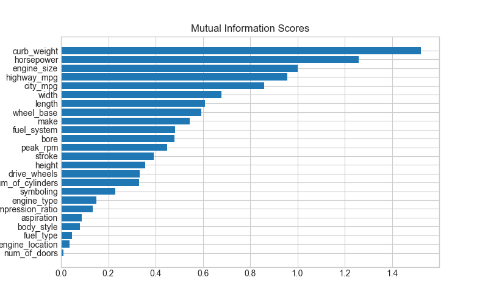
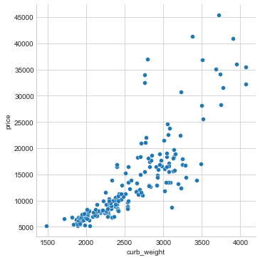
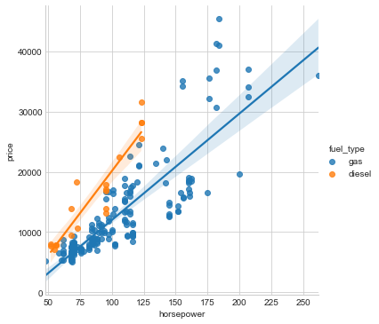
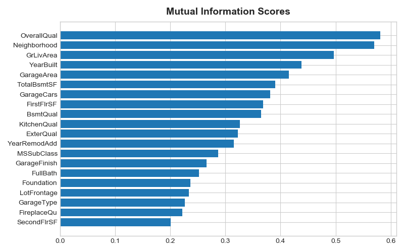
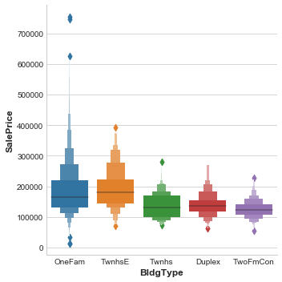
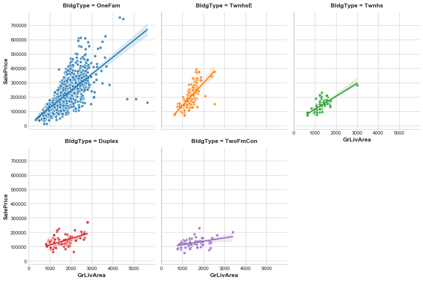
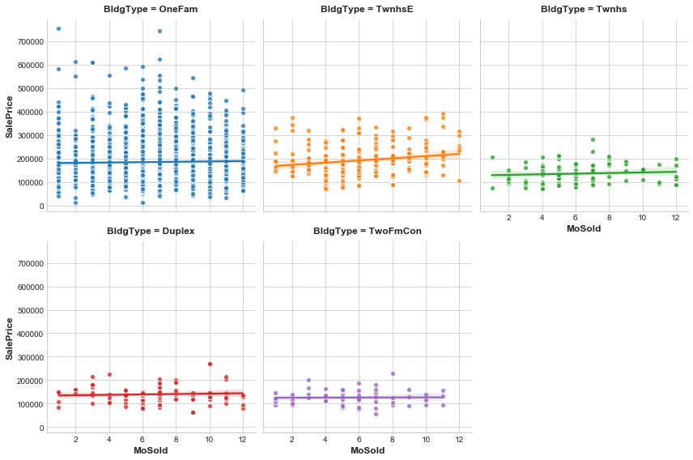

# Mutual Information

Author: R. Holbrook

Organization: Kaggle

[Original](https://www.kaggle.com/ryanholbrook/mutual-information)

[Local notebook](src/a18b-mutual-information.ipynb)


## Introduction

+ Handling features
  + issue: hundreds and thousands of features w/o description
  + procedure to resolve
    + constructing a ranking w/ a __feature utility metric__, a function measuring associatiions btw a feature and a target
    + choosing a smaller set of the most useful features to develop initially and having more confidence to spend time on them

+ Mutual information
  + metric used to measure associations btw a feature and a target
  + a lot like correlation to measure a relationship btw two quantities
  + MI detecting any kind of relationship while correlation only detecting linear relationship
  + a great general-purpose metric and specially useful at the start of feature development
  + advantages
    + easy to use and interpret
    + computationally efficient
    + theoretically well-founded
    + resistant to overfitting
    + able to detect any kind of relationship

## Mutual Information and What it Measures

+ Mutual information and measurement
  + MI describing relationships in terms of _uncertainty_
  + __mutual information (MI)__ btw two quantities: a measure of the extent to which knowledge of one quantity reduces uncertainty about the other
  + scikit-learn algorithm for MI
    + two mutual information metrics in `feature_selection` module
    + continuous features
      + `float` dtype
      + real value targets: `mutual_info_regression`
    + categorical features
      + `object` or `categorical` dtype
      + treated as discrete by giving them a label encoding
      + categorical targets: `mutual_info_classif`
  + data visualization: a great toolbox for feature ranking, e.g., bar chart
  + example: Ames Housing data
    + the relationship btw the exterior quality of a house and the price it sold for
    + diagram
      + knowing the value of `ExterQual` to make more certain about the corresponding `SalePrice`
      + MI (`ExterQual` w/ `SalePrice`): the average reduction of uncertainty in `SalePrice` taken over the four values of `ExterQual`
    + entropy: uncertainty measured using a quantity from information theory
    + the entropy of a variable (rough): how many yes-or-no questions required to describe an occurrence of that variable, on average

    <figure style="margin: 0.5em; text-align: center;">
      
    </figure>

## Interpreting Mutual Information Scores

+ Mutual information scores
  + MI = 0.0
    + least possible value
    + independent: unable to tell anything about the other
  + MI maximum value
    + theory: no upper bound
    + practice: MI > 2.0 uncommon
    + MI: a logarithm quantity

    <figure style="margin: 0.5em; text-align: center;">
      
    </figure>

+ Considerations when using mutual information
  + relative potential:
    + MI helping to understand the relative potential of a feature
    + the potential as a predictor of the target
  + univariate metric
    + possible for a feature very informative when interacting w/ other features
    + not so informative for the feature itself
    + MI unable to detect interaction btw features
  + feature and model
    + the usefulness of feature depending on the model it used w/
    + feature probably only useful to the extent related to the target
    + a feature w/ high MI score $\nRightarrow$ model able to do anything w/ that information


## Example - 1985 Automobiles

+ Example: mutual information  w/ 1985 automobiles
  + dataset: [Automobile dataset](https://www.kaggle.com/toramky/automobile-dataset)
  + goal: predicting a car's `price` (the target) from 23 pf the car's features
  + task: ranking the features w/ mutual information and investigating the results by data visualization
  + python snippet to import libraries and read the CSV data

    ```python
    import matplotlib.pyplot as plt
    import numpy as np
    import pandas as pd
    import seaborn as sns

    plt.style.use("seaborn-whitegrid")

    df = pd.read_csv("data/a18/autos.csv")
    df.head()
    ```

  + python snippet to process categorical encoding

    ```python
    X = df.copy()
    y = X.pop("price")

    # Label encoding for categoricals
    for colname in X.select_dtypes("object"):
        X[colname], _ = X[colname].factorize()

    # All discrete features should now have integer dtypes (double-check this before using MI!)
    discrete_features = X.dtypes == int
    ```

  + python snippet for mutual information scores

    ```python
    from sklearn.feature_selection import mutual_info_regression

    def make_mi_scores(X, y, discrete_features):
        mi_scores = mutual_info_regression(X, y, discrete_features=discrete_features)
        mi_scores = pd.Series(mi_scores, name="MI Scores", index=X.columns)
        mi_scores = mi_scores.sort_values(ascending=False)
        return mi_scores

    mi_scores = make_mi_scores(X, y, discrete_features)
    mi_scores[::3]  # show a few features with their MI scores

    # curb_weight          1.526026     highway_mpg          0.958583
    # length               0.615287     bore                 0.496247
    # stroke               0.375345     num_of_cylinders     0.330281
    # compression_ratio    0.133210     fuel_type            0.047279
    ```

  + python snippet to plot bar chart for comparison

    ```python
    def plot_mi_scores(scores):
        scores = scores.sort_values(ascending=True)
        width = np.arange(len(scores))
        ticks = list(scores.index)
        plt.barh(width, scores)
        plt.yticks(width, ticks)
        plt.title("Mutual Information Scores")

    plt.figure(dpi=100, figsize=(8, 5))
    plot_mi_scores(mi_scores)
    
    # plot for high score 'curb_weight'
    sns.relplot(x="curb_weight", y="price", data=df);
    ```

    <div style="margin: 0.5em; display: flex; justify-content: center; align-items: center; flex-flow: row wrap;">
      <a href="https://www.kaggle.com/ryanholbrook/mutual-information" ismap target="_blank">
        
        
      </a>
    </div>

  + `fuel_type` feature (see diagram)
    + w/ a fair low MI score
    + two price populations within the `horsepower` feature
    + probably not unimportant according to MI score
    + good to further investigate any possible effects
    + python snippet: `sns.lmplot(x="horsepower", y="price", hue="fuel_type", data=df);`

    <figure style="margin: 0.5em; text-align: center;">
      
    </figure>


## Exercise: Mutual Information

+ Exercise: mutual information
  + [original exercise](https://www.kaggle.com/hmchen47/exercise-mutual-information/edit)
  + dataset: [Ames data set](https://www.kaggle.com/c/house-prices-advanced-regression-techniques/data)
  + task: identify initial set of features w/
    + mutual information
    + interaction plots
  + python snippet: system setup and utilities

    ```python
    import matplotlib.pyplot as plt
    import numpy as np
    import pandas as pd
    import seaborn as sns
    from sklearn.feature_selection import mutual_info_regression

    # Set Matplotlib defaults
    plt.style.use("seaborn-whitegrid")
    plt.rc("figure", autolayout=True)
    plt.rc(
        "axes",
        labelweight="bold",
        labelsize="large",
        titleweight="bold",
        titlesize=14,
        titlepad=10,
    )

    # Load data
    df = pd.read_csv("data/a18/ames.csv")

    # Utility functions from Tutorial
    def make_mi_scores(X, y):
        X = X.copy()
        for colname in X.select_dtypes(["object", "category"]):
            X[colname], _ = X[colname].factorize()
        # All discrete features should now have integer dtypes
        discrete_features = [pd.api.types.is_integer_dtype(t) for t in X.dtypes]
        mi_scores = mutual_info_regression(X, y, discrete_features=discrete_features, random_state=0)
        mi_scores = pd.Series(mi_scores, name="MI Scores", index=X.columns)
        mi_scores = mi_scores.sort_values(ascending=False)
        return mi_scores

    def plot_mi_scores(scores):
        scores = scores.sort_values(ascending=True)
        width = np.arange(len(scores))
        ticks = list(scores.index)
        plt.barh(width, scores)
        plt.yticks(width, ticks)
        plt.title("Mutual Information Scores")
    ```

  + python snippet: visualizing features vs. price
    + `YearBuilt`: knowing the year tends to constrain `SalePrice` to a smaller range of possible values $\to$ the highest MI score
    + `MoSold`: variety of `SalePrice`
    + `ScreenPorch`: many data w/ value = 0, on average it won't tell much about `SalePrice` (though more than `MoSold`)

    ```python
    features = ["YearBuilt", "MoSold", "ScreenPorch"]
    sns_plot = sns.relplot(
        x="value", y="SalePrice", col="variable", \
            data=df.melt(id_vars="SalePrice", value_vars=features),\
            facet_kws=dict(sharex=False),
    );
    ```

    <figure style="margin: 0.5em; text-align: center;">
      
    </figure>

  + understanding mutual information

    ```python
    X = df.copy()
    y = X.pop('SalePrice')

    mi_scores = make_mi_scores(X, y)

    print(mi_scores.head(20))
    # print(mi_scores.tail(20))  # uncomment to see bottom 20

    plt.figure(dpi=100, figsize=(8, 5))
    plot_mi_scores(mi_scores.head(20))
    # plot_mi_scores(mi_scores.tail(20))  # uncomment to see bottom 20

    # OverallQual     0.581262          # Neighborhood    0.569813
    # GrLivArea       0.496909          # YearBuilt       0.437939
    # GarageArea      0.415014          # TotalBsmtSF     0.390280
    # GarageCars      0.381467          # FirstFlrSF      0.368825
    # BsmtQual        0.364779          # KitchenQual     0.326194
    # ExterQual       0.322390          # YearRemodAdd    0.315402
    # MSSubClass      0.287131          # GarageFinish    0.265440
    # FullBath        0.251693          # Foundation      0.236115
    # LotFrontage     0.233334          # GarageType      0.226117
    # FireplaceQu     0.221955          # SecondFlrSF     0.200658
    ```

    + common themes among most of these features are:
      + Location: `Neighborhood`
      + Size: all of the `Area` and `SF` features, and counts like `FullBath` and `GarageCars`
      + Quality: all of the `Qual` features
      + Year: `YearBuilt` and `YearRemodAdd`
      + Types: descriptions of features and styles like `Foundation` and `GarageType`
    + interaction features
      + kinds of features commonly used in real-estate listings (like on Zillow)
      + mutual information metric scored them highly
      + the lowest ranked features mostly representing things rare or exceptional in some way
      + example: not be relevant to the average home buyer

    <figure style="margin: 0.5em; text-align: center;">
      
    </figure>

  + examining MI scores
    + investigating possible interaction effects w/ `BldgType`
    + `BldgType` (Nominal): Type of dwelling
      + `1Fam`: Single-family Detached
      + `2FmCon`: Two-family Conversion; originally built as one-family dwelling
      + `Duplx`: Duplex
      + `TwnhsE`: Townhouse End Unit
    + `BldgType` not w/ high MI score
    + python snippet: `sns.catplot(x="BldgType", y="SalePrice", data=df, kind="boxen");`

      <figure style="margin: 0.5em; text-align: center;">
        
      </figure>

    + whether `BldgType` producing a significant interaction w/ 
      + `GrLivArea`: above ground living area
      + `MoSold`: Month sold
      + python snippet:

      ```python
      feature = "GrLivArea"
      sns_plot = sns.lmplot(
          x=feature, y="SalePrice", hue="BldgType", col="BldgType",
          data=df, scatter_kws={"edgecolor": 'w'}, col_wrap=3, height=4,
      );

      feature = "MoSold"
      sns_plot = sns.lmplot(
          x=feature, y="SalePrice", hue="BldgType", col="BldgType",
          data=df, scatter_kws={"edgecolor": 'w'}, col_wrap=3, height=4,
      );
      ```

      <div style="margin: 0.5em; display: flex; justify-content: center; align-items: center; flex-flow: row wrap;">
        <a href="src/data/a18b-ex-MI.ipynb" ismap target="_blank">
          
          
        </a>
      </div>

    + MI btw `BldgType` and `GrLivArea` & `SalePrice`
      + very different trend lines within each category of `BldgType`
      + the trends indicating an interaction between these features
      + `BldgType` revealing more about how `GrLivArea` relates to `SalePrice`
      + trend lines for `MoSold` almost all the same
      + `MoSold` not very informative for knowing `BldgType`
  + discovering interactions
    + list the 10 most informative features
    + python snippet: 

      ```python
      mi_scores.head(10)
      # OverallQual     0.581262        # Neighborhood    0.569813
      # GrLivArea       0.496909        # YearBuilt       0.437939
      # GarageArea      0.415014        # TotalBsmtSF     0.390280
      # GarageCars      0.381467        # FirstFlrSF      0.368825
      # BsmtQual        0.364779        # KitchenQual     0.326194
      ```


+ [`panads.factorize` method](https://pandas.pydata.org/docs/reference/api/pandas.factorize.html)
  + syntax: `pandas.factorize(values, sort=False, na_sentinel=-1, size_hint=None)`
  + docstring: encode the object as an enumerated type or categorical variable
  + parameters
    + `values`: sequence <br>A 1-D sequence. Sequences that aren’t pandas objects are coerced to ndarrays before factorization.
    + `sort`: bool, default `False`<br>Sort uniques and shuffle codes to maintain the relationship.
    + `na_sentinel`: int or `None`, default -1<br>Value to mark “not found”. If `None`, will not drop the `NaN` from the uniques of the values.
    + `size_hint`: int, optional<br>Hint to the hashtable sizer.
  + returns
    + `codes`: ndarray<br>An integer ndarray that’s an indexer into uniques. uniques.take(codes) will have the same values as values.
    + `uniques`: ndarray, Index, or Categorical<br>The unique valid values. When values is Categorical, uniques is a Categorical. When values is some other pandas object, an Index is returned. Otherwise, a 1-D ndarray is returned.
  + example

    ```python
    codes, uniques = pd.factorize(['b', None, 'a', 'c', 'b'])
    codes     # array([ 0, -1,  1,  2,  0]...)
    uniques   # array(['a', 'b', 'c'], dtype=object)
    ```

