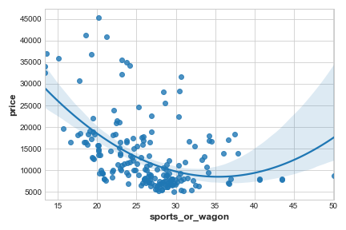
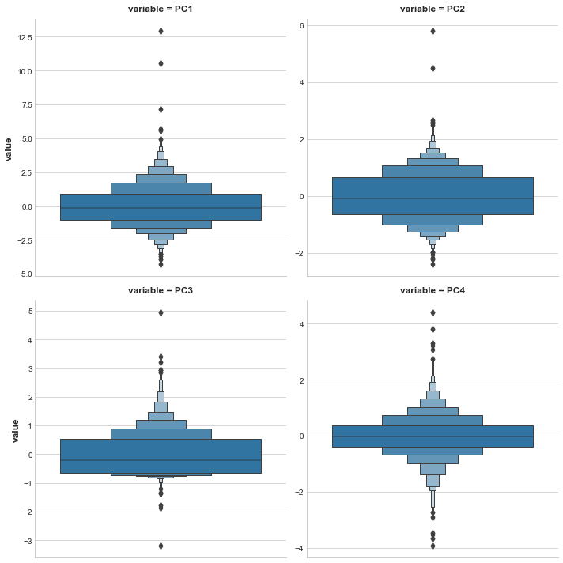

# Principal Components Analysis


Author: R. Holbrook

Organization: Kaggle

[Original](https://www.kaggle.com/ryanholbrook/principal-component-analysis)

[Local notebook](src/a18e-principal-component-analysis.ipynb)


## Introduction

+ Principal Component Analysis and feature engineering
  + a partitioning of the variation in the data
  + a great tool to help to discover important relationship in the data
  + used to create more informative features
  + typically applied to [standardized](https://bit.ly/2S9yMM2) data
  + variation meaning
    + standardized data: correlation
    + non-standardized data: covariance


## Principal Component Analysis

+ Visualization for Principal Component Analysis
  + axes of variation
    + describing the ways the abalone tend to different from one another
    + axes: perpendicular lines along the natural dimensions of the data
    + each axis for one original feature
  + idea of PCA: instead of describing the data w/ the original features, describing it w/ axes of variation
  + dataset: [Abalone data set](https://www.kaggle.com/rodolfomendes/abalone-dataset)
    + physical measurements taken from several thousand Tasmanian abalone
    + only focusing on `Height` and `Diameter` of their shells
  + axes of variation for abalone
    + Size component
      + the longer axis
      + small height and small diameter (lower left) contrasted w/ large height and large diameter (upper right)
    + Shape component
      + the shorter axis
      + small height and large diameter (flat shape) contrasted w/ large height and small diameter (round shape)

    <div style="margin: 0.5em; display: flex; justify-content: center; align-items: center; flex-flow: row wrap;">
      <a href="https://www.kaggle.com/ryanholbrook/principal-component-analysis" ismap target="_blank">
        
        
      </a>
    </div>

+ PCA as new features
  + new features PCA: liner combinations (weighted sums) of the original features

    <code> df["Size"] = 0.707 * X["Height"] + 0.707 * X["Diameter"]</code><br>
    <code> df["Shape"] = 0.707 * X["Height"] - 0.707 * X["Diameter"] </code>

    + principal components of the data: `Size`, `Shape`
    + loadings: weights, 0.707
  + number of principal components = features in the original dataset
  + component's loadings expressed through signs and magnitudes
    + table of loadings

      <table>
        <thead>
          <tr><th>Features \ Components</th><th>Size (PC1)</th><th>Shape (PC2)</th></tr>
        </thead>
        <tbody>
          <tr style="text-align: right;"><td>Height</td><td>0.707</td><td>0.707</td></tr>
          <tr style="text-align: right;"><td>Diameter</td><td>0.707</td><td>-0.707</td></tr>
        </tbody>
      </table>

    + `Size` component: `Height` and `Diameter` varying in the same direction (same sign)
    + `Shape` component: `Height` and `Diameter` varying in opposite direction (opposite sign)
    + all loadings w/ the same magnitude $\to$ features contributing equally

+ Percent of explained variance
  + PCA represents the amount of variation in each component
  + more variation in the data along the `Size` component than along the `Shape` component
  + making the precise comparison though each component's percent of explained variation

    <figure style="margin: 0.5em; text-align: center;">
      
    </figure>

  + `Size` component: the majority of variation btw `Height` and `Diameter`
  + the amount of variance in a component
    + not necessarily correspond to how good it is as a predictor
    + depending on what to predict


## PCA for Feature Engineering

+ Ways to use PCA for feature engineering
  + use as a __descriptive technique__
    + computing the MI scores for the components
    + what kind of variation most predictive of the target
    + ideas for kinds of features to create
      + `Size`: product of `Height` and `Diameter`
      + `Shape`: ratio of `Height` and `Diameter`
    + try clustering on one or more of the high scoring components
  + use __components__ themselves as features
    + the components exposing the variational structure of the data directly
    + often more informative than the original features
    + use cases
      + __dimensionality reduction__
        + highly redundant features, in particular, multicolinear
        + partitioning out the redundancy into one or more near-zero variance components
      + __anomaly detection__
        + unusual variation often w/ the low-variance components
        + unusual variation: not apparent from the original features
        + components highly informative in an anomaly or outlier detection task
      + __noise reduction__
        + sensor reading often w/ common background noise
        + able to collect the (informative) signal into a smaller number of features while leaving out the noise
        + boosting the signal-to-noise ratio
      + __decorrelation__
        + ML sometimes struggling w/ highly-correlated features
        + transforming correlated features into uncorrelated components

+ PCA best practices
  + only working w/ numeric features, including continuous quantities or counts
  + sensitive to scale: standardizing data before applying PCA
  + removing or constraining outliers for undue influence on the results


## Example - 1985 Automobiles

+ Example: 1985 automobiles
  + dataset: [Automobile](https://www.kaggle.com/toramky/automobile-dataset)
  + task: descriptive technique to discover features
  + load data and prepare utility functions

    ```python
    import matplotlib.pyplot as plt
    import numpy as np
    import pandas as pd
    import seaborn as sns
    from IPython.display import display
    from sklearn.feature_selection import mutual_info_regression

    plt.style.use("seaborn-whitegrid")
    plt.rc("figure", autolayout=True)
    plt.rc(
        "axes",
        labelweight="bold",
        labelsize="large",
        titleweight="bold",
        titlesize=14,
        titlepad=10,
    )

    def plot_variance(pca, width=8, dpi=100):
        # Create figure
        fig, axs = plt.subplots(1, 2)
        n = pca.n_components_
        grid = np.arange(1, n + 1)
        # Explained variance
        evr = pca.explained_variance_ratio_
        axs[0].bar(grid, evr)
        axs[0].set(
            xlabel="Component", title="% Explained Variance", ylim=(0.0, 1.0)
        )
        # Cumulative Variance
        cv = np.cumsum(evr)
        axs[1].plot(np.r_[0, grid], np.r_[0, cv], "o-")
        axs[1].set(
            xlabel="Component", title="% Cumulative Variance", ylim=(0.0, 1.0)
        )
        # Set up figure
        fig.set(figwidth=8, dpi=100)
        return axs

    def make_mi_scores(X, y, discrete_features):
        mi_scores = mutual_info_regression(X, y, discrete_features=discrete_features)
        mi_scores = pd.Series(mi_scores, name="MI Scores", index=X.columns)
        mi_scores = mi_scores.sort_values(ascending=False)
        return mi_scores

    df = pd.read_csv("data/a18/autos.csv")
    ```

  + selecting features
    + features w/ high MI score on the target, `price`: `highway_mpg`, `engine_size`, `horsepower`, `curb_weight`
    + standardizing the data $\gets$ features naturally not on the same scale

    ```python
    features = ["highway_mpg", "engine_size", "horsepower", "curb_weight"]

    X = df.copy()
    y = X.pop('price')
    X = X.loc[:, features]

    # Standardize
    X_scaled = (X - X.mean(axis=0)) / X.std(axis=0)
    ```

  + fit PCA and create the principal components

    ```python
    from sklearn.decomposition import PCA

    # Create principal components
    pca = PCA()
    X_pca = pca.fit_transform(X_scaled)

    # Convert to dataframe
    component_names = [f"PC{i+1}" for i in range(X_pca.shape[1])]
    X_pca = pd.DataFrame(X_pca, columns=component_names)

    X_pca.head()
    #   PC1       PC2         PC3         PC4
    # 0 0.382486  -0.400222   0.124122    0.169539
    #   ...
    ```

  + observe loadings and plot variation
    + loadings containing in `components_` attribute
    + characteristics of variation depending on the signs and magnitudes of loadings
    + `PC1`, the 1st component: a contrast btw
      + large, powerful vehicles w/ poor gas millage
      + smaller, more economical vehicles w/ good gas milage
      + named as "Luxury/Economy" axis

    ```python
    loadings = pd.DataFrame(
        pca.components_.T,        # transpose the matrix of loadings
        columns=component_names,  # so the columns are the principal components
        index=X.columns,          # and the rows are the original features
    )

    loadings
    #                 PC1          PC2          PC3          PC4
    # highway_mpg   -0.492347    0.770892     0.070142    -0.397996
    # engine_size    0.503859    0.626709     0.019960     0.594107
    # horsepower     0.500448    0.013788     0.731093    -0.463534
    # curb_weight    0.503262    0.113008    -0.678369    -0.523232

    plot_variance(pca);
    ```

    <figure style="margin: 0.5em; text-align: center;">
      
    </figure>

  + MI scores of the components
    + `PC1` highly informative 
    + other components w/ small variation but still playing a significant relationship w/ `price`
    + examining these components to find relationships not captured by the main Luxury/Economy axis

    ```python
    mi_scores = make_mi_scores(X_pca, y, discrete_features=False)
    # PC1 = 1.013666, PC2 = 0.378819, PC3 = 0.306635, PC4 = 0.204069
    ```

  + contrast component and creating a new ratio feature
    + 3rd component: a contrast btw `horsepower` and `curb_weight` - sports cars vs. wagons

    ```python
    dx = X_pca["PC3"].sort_values(ascending=False).index
    cols = ["make", "body_style", "horsepower", "curb_weight"]
    df.loc[idx, cols]
    #       make      body_style  horsepower  curb_weight
    # 117   porsche   hardtop     207         2756
    #       ...

    df["sports_or_wagon"] = X.curb_weight / X.horsepower
    sns.regplot(x="sports_or_wagon", y='price', data=df, order=2);
    ```

    <figure style="margin: 0.5em; text-align: center;">
      
    </figure>


## Exercise

+ Exercise: PCA for feature engineering
  + [original](https://www.kaggle.com/hmchen47/exercise-principal-component-analysis/edit)
  + dataset: [Ames](https://www.kaggle.com/c/house-prices-advanced-regression-techniques/data)
  + task:
    + using PCA results to discover one or more new features
    + new features to improve the performance of the model
      + inspired by the loadings
      + using the components themselves as features
  + load data and prepare utility functions

    ```python
    import matplotlib.pyplot as plt
    import numpy as np
    import pandas as pd
    import seaborn as sns
    from sklearn.decomposition import PCA
    from sklearn.feature_selection import mutual_info_regression
    from sklearn.model_selection import cross_val_score
    from xgboost import XGBRegressor

    # Set Matplotlib defaults
    plt.style.use("seaborn-whitegrid")
    plt.rc("figure", autolayout=True)
    plt.rc(
        "axes",
        labelweight="bold",
        labelsize="large",
        titleweight="bold",
        titlesize=14,
        titlepad=10,
    )

    def apply_pca(X, standardize=True):
        # Standardize
        if standardize:
            X = (X - X.mean(axis=0)) / X.std(axis=0)
        # Create principal components
        pca = PCA()
        X_pca = pca.fit_transform(X)
        # Convert to dataframe
        component_names = [f"PC{i+1}" for i in range(X_pca.shape[1])]
        X_pca = pd.DataFrame(X_pca, columns=component_names)
        # Create loadings
        loadings = pd.DataFrame(
            pca.components_.T,  # transpose the matrix of loadings
            columns=component_names,  # so the columns are the principal components
            index=X.columns,  # and the rows are the original features
        )
        return pca, X_pca, loadings

    def plot_variance(pca, width=8, dpi=100):
        # Create figure
        fig, axs = plt.subplots(1, 2)
        n = pca.n_components_
        grid = np.arange(1, n + 1)
        # Explained variance
        evr = pca.explained_variance_ratio_
        axs[0].bar(grid, evr)
        axs[0].set(
            xlabel="Component", title="% Explained Variance", ylim=(0.0, 1.0)
        )
        # Cumulative Variance
        cv = np.cumsum(evr)
        axs[1].plot(np.r_[0, grid], np.r_[0, cv], "o-")
        axs[1].set(
            xlabel="Component", title="% Cumulative Variance", ylim=(0.0, 1.0)
        )
        # Set up figure
        fig.set(figwidth=8, dpi=100)
        return axs

    def make_mi_scores(X, y):
        X = X.copy()
        for colname in X.select_dtypes(["object", "category"]):
            X[colname], _ = X[colname].factorize()
        # All discrete features should now have integer dtypes
        discrete_features = [pd.api.types.is_integer_dtype(t) for t in X.dtypes]
        mi_scores = mutual_info_regression(X, y, discrete_features=discrete_features, random_state=0)
        mi_scores = pd.Series(mi_scores, name="MI Scores", index=X.columns)
        mi_scores = mi_scores.sort_values(ascending=False)
        return mi_scores

    def score_dataset(X, y, model=XGBRegressor()):
        # Label encoding for categoricals
        for colname in X.select_dtypes(["category", "object"]):
            X[colname], _ = X[colname].factorize()
        # Metric for Housing competition is RMSLE (Root Mean Squared Log Error)
        score = cross_val_score(
            model, X, y, cv=5, scoring="neg_mean_squared_log_error",
        )
        score = -1 * score.mean()
        score = np.sqrt(score)
        return score

    df = pd.read_csv("data/a18/ames.csv")
    ```

  + calculate correlation of selected features w/ `SalePrice`

    ```python
    features = [
        "GarageArea",
        "YearRemodAdd",
        "TotalBsmtSF",
        "GrLivArea",
    ]

    print("Correlation with SalePrice:\n")
    print(df[features].corrwith(df.SalePrice))
    # GarageArea = 0.640138, YearRemodAdd = 0.532974, TotalBsmtSF = 0.632529, GrLivArea = 0.706780
    ```

  + applying PCA and extracting the loadings

    ```python
    X = df.copy()
    y = X.pop("SalePrice")
    X = X.loc[:, features]

    # `apply_pca`, defined above, reproduces the code from the tutorial
    pca, X_pca, loadings = apply_pca(X)
    print(loadings)

    #                    PC1       PC2       PC3       PC4
    # GarageArea    0.541229  0.102375 -0.038470  0.833733
    # YearRemodAdd  0.427077 -0.886612 -0.049062 -0.170639
    # TotalBsmtSF   0.510076  0.360778 -0.666836 -0.406192
    # GrLivArea     0.514294  0.270700  0.742592 -0.332837
    ```

  + interpreting component loadings
    + the first component, `PC1`
      + a kind of `Size` component
      + all of the features have the same sign (positive)
      + describing a contrast btw houses w/ large values and houses w/ small values for these features
    + the third component `PC3`
      + features `GarageArea` and `YearRemodAdd` both w/ near-zero loadings
      + mostly about `TotalBsmtSF` and `GrLivArea`
      + a contrast btw
        + houses w/ a lot of living area but small (or non-existent) basements
        + the opposite: small houses with large basements
  + creating and evaluating new features
    + adding one ore more columns of `X_pca` to `X`
    + get a validation score below 0.140 RMSLE
    + possible solution
      + using the `make_mi_scores` function on `X_pca` to find out which components might have the most potential
      + observing the loadings to see what kinds of relationships among the features might be important
    + alternative solution:
      + using the components themselves
      + joining the highest scoring components from `X_pca` to `X`, or just join all of `X_pca` to `X`.

    ```python
    # Solution 1: Inspired by loadings
    X = df.copy()
    y = X.pop("SalePrice")

    X["Feature1"] = X.GrLivArea + X.TotalBsmtSF
    X["Feature2"] = X.YearRemodAdd * X.TotalBsmtSF

    score = score_dataset(X, y)
    print(f"Your score: {score:.5f} RMSLE")
    # Your score: 0.13361 RMSLE

    # Solution 2: Uses components
    X = df.copy()
    y = X.pop("SalePrice")

    X = X.join(X_pca)
    score = score_dataset(X, y)
    print(f"Your score: {score:.5f} RMSLE")
    # Your score: 0.13738 RMSLE
    ```

  + detecting outliers
    + outliers: a detrimental effect on model performance
    + aware to take corrective action if necessary
    + PCA showing anomalous variation
      + neither small houses nor houses unusual w/ large basements
      + unusual for small houses to have large basement
    + box-plot to examine outliers

      ```python
      sns_plot = sns.catplot(
          y="value",  col="variable",
          data=X_pca.melt(),  kind='boxen',
          sharey=False, col_wrap=2,
      );
      ```

      <figure style="margin: 0.5em; text-align: center;">
        
      </figure>

    + observing outliers based on sorted principal components
      + several dwellings stand out as `Partial` sales in the `Edwards` neighbor
      + partial sale: multiple owners of a property and one or more of them sell their "partial" ownership of the property
      + probably removing from list to predict the value of the houses $\to$ outliers

      ```python
      component = "PC1"

      idx = X_pca[component].sort_values(ascending=False).index
      df.loc[idx, ["SalePrice", "Neighborhood", "SaleCondition"] + features]
      #       SalePrice Neighborhood  SaleCondition GarageArea  YearRemodAdd  TotalBsmtSF GrLivArea
      # 1498  160000    Edwards       Partial       1418.0      2008          6110.0      5642.0
      # 2180  183850    Edwards       Partial       1154.0      2009          5095.0      5095.0
      # 2181  184750    Edwards       Partial        884.0      2008          3138.0      4676.0
      # 1760  745000    Northridge    Abnorml        813.0      1996          2396.0      4476.0
      #       ...       ...           ...           ...         ...           ...         ...
      ```

