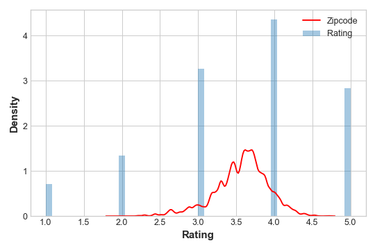

# Target Encoding


Author: R. Holbrook

Organization: Kaggle

[Original](https://www.kaggle.com/ryanholbrook/target-encoding)

[Local notebook](src/a18f-target-encoding.ipynb)


## Target Encoding

+ Supervised feature encoding engineering
  + a method of encoding categories as integer number
  + example: one-hot or label encoding

+ Target encoding
  + any kind of encoding replacing a feature's categories w/ some number derived from the target
  + simple and effect version: applying a group aggregation, like the mean
  + Automobiles: average price of each vehicle's make

    ```python
    autos["make_encoded"] = autos.groupby("make")["price"].transform("mean")
    ```

  + mean encoding: applying a group aggregation w/ mean
  + other encodings: likelihood encoding, impact encoding, and leave-one-out encoding


## Smoothing

+ Issues of encoding
  + unknown categories
    + creating a special risk of overfitting
    + required to be trained on an independent "encoding" split
    + imputation: filling in missing values for any categories
  + rare categories
    + any statistics on this group unlikely very accurate
    + example: Automobiles
      + Mercurcy make only occurred once
      + mean price not very representative of any Mercurcies
      + making overfitting more likely
    + solution: smoothing

+ Smoothing technique
  + blending the in-category average w/ the overall average
  + rare categories: less weight on their category average
  + missing categories: the overall average
  + pseudocode

    <code>encoding = weight * in_category + (1 - weight) * overall </code>

  + weight
    + a value btw 0 and 1 calculated from the catgory frequency
    + determining weight by computing __m-estimate__: $\text{weight } = n / (n + m)$
      + $n$: the total number of times the category occurred in the data
      + $m$: hyperparameter to determine the "smoothing factor"
    + value for $m \to$ how noisy expecting the categories to be
      + target values varying a great deal $\implies$ choosing a larger value for $m$
      + target values relatively stable $\implies$ choosing a smaller value
  + larger values of $m$ $\to$ more weight on the overall estimate

    <figure style="margin: 0.5em; text-align: center;">
      
    </figure>

  + example: Automobiles
    + 3 cars w/ the make Chevrolet, $n = 3$
    + $m = 0.2$: $\text{chevrolet } = 0.6 \ast 6000.00 + 0.4 \ast 13285.03$

+ Use cases for target encoding
  + high-cardinality features:
    + a feature w/ large number of categories: troublesome to encode
    + one-hot encoding:
      + generating too many features and alternative
      + not appropriate for that feature
    + target encoding: deriving numbers for the categories w/ the relationship w/ the target
  + domain-motivated feature
    + prior experience: categorical feature probably not so important even if scored poorly w/ a feature metric
    + target encoding revealing a feature's true information

## Example - MovieLens1M

+ Example: MovieLens1M
  + dataset: [MovieLens1M](https://www.kaggle.com/grouplens/movielens-20m-dataset)
    + 1 million movie rating by users of the MovieLens website
    + features describing each user and movie
  + loading data and preparing plotting

    ```python
    import matplotlib.pyplot as plt
    import numpy as np
    import pandas as pd
    import seaborn as sns
    import warnings

    plt.style.use("seaborn-whitegrid")
    plt.rc("figure", autolayout=True)
    plt.rc(
        "axes",
        labelweight="bold",
        labelsize="large",
        titleweight="bold",
        titlesize=14,
        titlepad=10,
    )
    warnings.filterwarnings('ignore')

    df = pd.read_csv("data/a18/movielens1m.csv")
    df = df.astype(np.uint8, errors='ignore') # reduce memory footprint
    print("Number of Unique Zipcodes: {}".format(df["Zipcode"].nunique()))
    # Number of Unique Zipcodes: 3439
    ```

  + preparing the training dataset
    + a good candidate for target encoding: > 3000 categories
    + size of the dataset: over one-million rows
    + creating a 25\% split to train the target encoder

    ```python
    X = df.copy()
    y = X.pop('Rating')

    X_encode = X.sample(frac=0.25)
    y_encode = y[X_encode.index]
    X_pretrain = X.drop(X_encode.index)
    y_train = y[X_pretrain.index]
    ```

  + encoding w/ MEstimate encoder
    + utilizing m-estimate encoder w/ `category_encoder` lib
    + encoding `Zipcode` feature

    ```python
    from category_encoders import MEstimateEncoder

    # Create the encoder instance. Choose m to control noise.
    encoder = MEstimateEncoder(cols=["Zipcode"], m=5.0)

    # Fit the encoder on the encoding split.
    encoder.fit(X_encode, y_encode)

    # Encode the Zipcode column to create the final training data
    X_train = encoder.transform(X_pretrain)
    ```

  + evaluating the encoded values
    + comparing the encoded values to the target
    + observing how informative the encoding
    + distribution of the encoded `Zipcode` feature
      + roughly following the distribution of the actual ratings
      + movie-watchers differed in the ratings from zipcode to zipcode
    + target encoding able to capture useful information

    ```python
    plt.figure(dpi=90)
    ax = sns.distplot(y, kde=False, norm_hist=True)
    ax = sns.kdeplot(X_train.Zipcode, color='r', ax=ax)
    ax.set_xlabel("Rating")
    ax.legend(labels=['Zipcode', 'Rating']);
    ```

    <figure style="margin: 0.5em; text-align: center;">
      
    </figure>

## Exercise

+ Exercise: target encoding w/ Ames
  + [Original notebook](https://www.kaggle.com/hmchen47/exercise-target-encoding/edit)
  + dataset: [Ames](https://www.kaggle.com/c/house-prices-advanced-regression-techniques/data)
  + loading data and preparing utilities

    ```python
    import matplotlib.pyplot as plt
    import numpy as np
    import pandas as pd
    import seaborn as sns
    import warnings
    from category_encoders import MEstimateEncoder
    from sklearn.model_selection import cross_val_score
    from xgboost import XGBRegressor

    # Set Matplotlib defaults
    plt.style.use("seaborn-whitegrid")
    plt.rc("figure", autolayout=True)
    plt.rc(
        "axes",
        labelweight="bold",
        labelsize="large",
        titleweight="bold",
        titlesize=14,
        titlepad=10,
    )
    warnings.filterwarnings('ignore')

    def score_dataset(X, y, model=XGBRegressor()):
        # Label encoding for categoricals
        for colname in X.select_dtypes(["category", "object"]):
            X[colname], _ = X[colname].factorize()
        # Metric for Housing competition is RMSLE (Root Mean Squared Log Error)
        score = cross_val_score(
            model, X, y, cv=5, scoring="neg_mean_squared_log_error",
        )
        score = -1 * score.mean()
        score = np.sqrt(score)
        return score

    df = pd.read_csv("data/a18/ames.csv")
    ```

  + identifying features for encoding
    + candidate: feature w/ large number of categories
    + number of categories for each categorical feature

      ```python
      df.select_dtypes(["object"]).nunique()

      # MSSubClass       16    MSZoning          7    Street            2    Alley             3
      # LotShape          4    LandContour       4    Utilities         3    LotConfig         5
      # LandSlope         3    Neighborhood     28    Condition1        9    Condition2        8
      # BldgType          5    HouseStyle        8    OverallQual      10    OverallCond       9
      # RoofStyle         6    RoofMatl          8    Exterior1st      16    Exterior2nd      17
      # MasVnrType        5    ExterQual         4    ExterCond         5    Foundation        6
      # BsmtQual          6    BsmtCond          6    BsmtExposure      5    BsmtFinType1      7
      # BsmtFinType2      7    Heating           6    HeatingQC         5    CentralAir        2
      # Electrical        6    KitchenQual       5    Functional        8    FireplaceQu       6
      # GarageType        7    GarageFinish      4    GarageQual        6    GarageCond        6
      # PavedDrive        3    PoolQC            5    Fence             5    MiscFeature       6
      # SaleType         10    SaleCondition     6
      ```

  + choosing features for encoding
    + M-estimate encoding using smoothing to improve estimates for rare categories
    + using `value_counts` to observe how many times a category in the dataset
    + only showing the counts for `SaleType` here, but other considered as well
    + `Neighborhood` feature w/ most categories and some rare categories, like `Green_Hiils` and `Landmark`
    + other features `SaleType`, `MSSubClass`, `Exterior1st`, `Exterior2nd` worth considering
    + almost any of the nominal features worth trying due to the prevalence of rare categories

    ```python
    df["SaleType"].value_counts()
    # WD       2536     New       239    COD        87     ConLD      26
    # CWD        12     ConLI       9    ConLw       8     Oth         7
    # Con         5     VWD         1

    df["Neighborhood"].value_counts()
    # North_Ames            443    College_Creek                              267
    # Old_Town              239    Edwards                                    194
    # Somerset              182    Northridge_Heights                         166
    # Gilbert               165    Sawyer                                     151
    # Northwest_Ames        131    Sawyer_West                                125
    # Mitchell              114    Brookside                                  108
    # Crawford              103    Iowa_DOT_and_Rail_Road                      93
    # Timberland             72    Northridge                                  71
    # Stone_Brook            51    South_and_West_of_Iowa_State_University     48
    # Clear_Creek            44    Meadow_Village                              37
    # Briardale              30    Bloomington_Heights                         28
    # Veenker                24    Northpark_Villa                             23
    # Blueste                10    Greens                                       8
    # Green_Hills             2    Landmark                                     1
    ```

  + applying M-estimate encoding
    + avoiding overfitting by fit the encoder on data heldout from the training data
    + creating the encoding and training splits
    + applying a target encoding to the selected categorical features
    + hyperparameter, smoothing: $m = 1.0$
    + comparing the encoded values to the target to see how informative encoding might be
    + evaluating target encoding
      + features probably ended up w/ a score significantly worse than the baseline
      + extra information gained by the encoding not making up for the loss of data used for the encoding

    ```python
    # Encoding split
    X_encode = df.sample(frac=0.20, random_state=0)
    y_encode = X_encode.pop("SalePrice")

    # Training split
    X_pretrain = df.drop(X_encode.index)
    y_train = X_pretrain.pop("SalePrice")

    # Choose a set of features to encode and a value for m
    encoder = MEstimateEncoder(cols=["Neighborhood"], m=0.6)        # left diagram
    encoder = MEstimateEncoder(cols=["Neighborhood", "SaleType", \
      "MSSubClass", "Exterior1st", "Exterior2nd"], m=0.6)           # right diagram

    # Fit the encoder on the encoding split
    encoder.fit(X_encode, y_encode)

    # Encode the training split
    X_train = encoder.transform(X_pretrain, y_train)

    # plot distribution
    feature = encoder.cols

    plt.figure(dpi=90)
    ax = sns.distplot(y_train, kde=True, hist=False)
    ax = sns.distplot(X_train[feature], color='r', ax=ax, hist=True, kde=False, norm_hist=True)
    ax.set_xlabel("SalePrice");
    ```

    <div style="margin: 0.5em; display: flex; justify-content: center; align-items: center; flex-flow: row wrap;">
      <a href="https://www.kaggle.com/ryanholbrook/target-encoding" ismap target="_blank">
        
        
      </a>
    </div>

  + exploring overfitting issue
    + illustrating importance of training fitting target encoders on data held-out from the training set
    + fitting the encoder and the model w/ the same model
    + mean-encoding a feature w/o relationship w/ `SalePrice`, a count: 0, 1, 2, ...
    + observing how dramatic the overfitting can be
    + `Count`: never w/ any duplicate values
    + mean-encoded `Count`:
      + essentially an exact copy of the target
      + mean-encoding turned a completely meaningless feature into a perfect feature
    + training `XGBoost` on the same set to train the encoder
    + using a hold-out set instead, none of this "fake" encoding transferred to the training data
      + using a target encoder, important to use separate data sets for training the encoder and training the model
      + otherwise the results able to be very disappointing

    ```python
    X = df.copy()
    y = X.pop("SalePrice")
    score_base = score_dataset(X, y)
    score_new = score_dataset(X_train, y_train)

    print(f"Baseline Score: {score_base:.4f} RMSLE")
    print(f"Score with Encoding: {score_new:.4f} RMSLE")
    # Baseline Score: 0.1428 RMSLE
    # Score with Encoding: 0.1445 RMSLE

    # Try experimenting with the smoothing parameter m
    # Try 0, 1, 5, 50
    m = 0

    X = df.copy()
    y = X.pop('SalePrice')

    # Create an uninformative feature
    X["Count"] = range(len(X))
    X["Count"][1] = 0  
    # actually need one duplicate value to circumvent error-checking in MEstimateEncoder

    # fit and transform on the same dataset
    encoder = MEstimateEncoder(cols="Count", m=m)
    X = encoder.fit_transform(X, y)

    # Results
    score =  score_dataset(X, y)
    print(f"Score: {score:.4f} RMSLE")
    # m =  0: Score: 0.0293 RMSLE
    # m =  1: Score: 0.1428 RMSLE
    # m =  5: Score: 0.0294 RMSLE
    # m = 50: Score: 0.0311 RMSLE

    plt.figure(dpi=90)
    ax = sns.distplot(y, kde=True, hist=False)
    ax = sns.distplot(X["Count"], color='r', ax=ax, hist=True, kde=False, norm_hist=True)
    ax.set_xlabel("SalePrice");
    ```

    <div style="margin: 0.5em; display: flex; justify-content: center; align-items: center; flex-flow: row wrap;">
      <a href="https://www.kaggle.com/ryanholbrook/target-encoding" ismap target="_blank">
        
        
      </a>
    </div>

    <div style="margin: 0.5em; display: flex; justify-content: center; align-items: center; flex-flow: row wrap;">
      <a href="https://www.kaggle.com/ryanholbrook/target-encoding" ismap target="_blank">
        
        
      </a>
    </div>
  

## References

+ Pablo Duboue, [The Art of Feature Engineering](https://ca1lib.org/book/5545855/37603d?id=5545855&secret=37603d&signAll=1&ts=0130)
+ Jeff Heaton, [An Empirical Analysis of Feature Engineering for Predictive Modeling](https://arxiv.org/pdf/1701.07852.pdf)
+ Alice Zheng and Amanda Casari, [Feature Engineering for Machine Learning](https://www.repath.in/gallery/feature_engineering_for_machine_learning.pdf). The tutorial on clustering was inspired by this excellent book.
+ Max Kuhn and Kjell Johnson, [Feature Engineering and Selection](https://ca1lib.org/book/5404773/19ff1c?id=5404773&secret=19ff1c&signAll=1&ts=0136)


