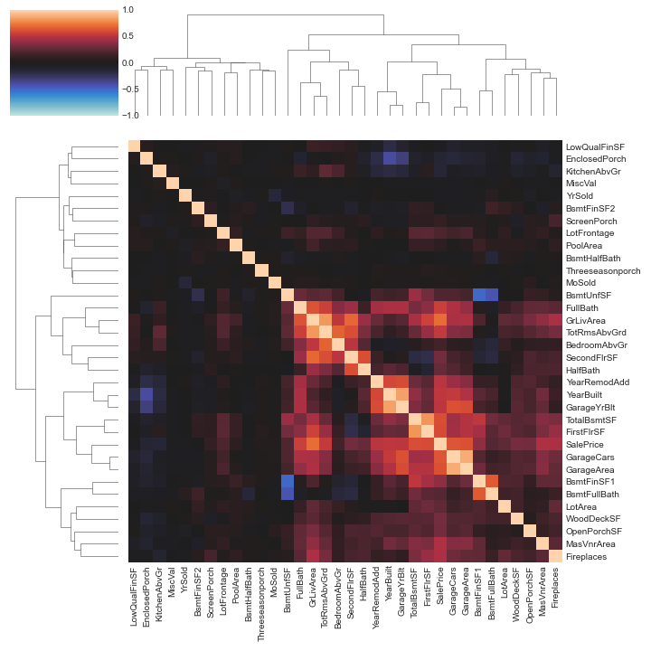

# Example: House Prices


Author: R. Holbrook

Organization: Kaggle

[Original](https://www.kaggle.com/ryanholbrook/feature-engineering-for-house-prices)

[Local notebook](src/a18g-feature-engineering-for-house-prices.ipynb)


## Introduction

+ Project
  + [House Prices - Advanced Regression Techniques](https://www.kaggle.com/c/house-prices-advanced-regression-techniques)
  + [Ames](https://www.kaggle.com/c/house-prices-advanced-regression-techniques/data)


## Step 1 - Preliminaries

+ Setting up environment

  ```python
  import os
  import warnings
  from pathlib import Path

  import matplotlib.pyplot as plt
  import numpy as np
  import pandas as pd
  import seaborn as sns
  from IPython.display import display
  from pandas.api.types import CategoricalDtype

  from category_encoders import MEstimateEncoder
  from sklearn.cluster import KMeans
  from sklearn.decomposition import PCA
  from sklearn.feature_selection import mutual_info_regression
  from sklearn.model_selection import KFold, cross_val_score
  from xgboost import XGBRegressor

  # Set Matplotlib defaults
  plt.style.use("seaborn-whitegrid")
  plt.rc("figure", autolayout=True)
  plt.rc(
      "axes",
      labelweight="bold",
      labelsize="large",
      titleweight="bold",
      titlesize=14,
      titlepad=10,
  )

  # Mute warnings
  warnings.filterwarnings('ignore')
  ```

+ Data preprocessing
  + pre-processing the data to get it in a form suitable for analysis
  + typical actions to process data
    + __load__ the data from CSV files
    + __clean__ the data to fix any errors or inconsistencies
    + __encode__ the statistical data type (numeric, categories)
    + __impute__ any missing values
  + 3 preprocessing steps after reaing the CSV file: `clean`, `encode` and `impute`
  + creating the data splits:
    + one (`df_train`) for training the model
    + one (`df_test`) for making the predictions 

+ Loading data

  ```python
  def load_data():
      # Read data
      data_dir = Path("../input/house-prices-advanced-regression-techniques/")
      df_train = pd.read_csv(data_dir / "train.csv", index_col="Id")
      df_test = pd.read_csv(data_dir / "test.csv", index_col="Id")
      # Merge the splits so we can process them together
      df = pd.concat([df_train, df_test])
      # Preprocessing
      df = clean(df)
      df = encode(df)
      df = impute(df)
      # Reform splits
      df_train = df.loc[df_train.index, :]
      df_test = df.loc[df_test.index, :]
      return df_train, df_test
  ```

+ Cleaning data
  
  ```python
  data_dir = Path("data/a18g/")
  df = pd.read_csv(data_dir / "train.csv", index_col="Id")

  df.Exterior2nd.unique()
  # array(['VinylSd', 'MetalSd', 'Wd Shng', 'HdBoard', 'Plywood', 'Wd Sdng',
  #        'CmentBd', 'BrkFace', 'Stucco', 'AsbShng', 'Brk Cmn', 'ImStucc',
  #        'AsphShn', 'Stone', 'Other', 'CBlock'], dtype=object)

  def clean(df):
      df["Exterior2nd"] = df["Exterior2nd"].replace({"Brk Cmn": "BrkComm"})
      # Some values of GarageYrBlt are corrupt, so we'll replace them
      # with the year the house was built
      df["GarageYrBlt"] = df["GarageYrBlt"].where(df.GarageYrBlt <= 2010, df.YearBuilt)
      # Names beginning with numbers are awkward to work with
      df.rename(columns={
          "1stFlrSF": "FirstFlrSF",
          "2ndFlrSF": "SecondFlrSF",
          "3SsnPorch": "Threeseasonporch",
      }, inplace=True,
      )
      return df
  ```

+ Encoding the statistical data type
  + Pandas w/ Python types corresponding to the standard statistical types (numeric, categories)
  + encoding correct type for each feature $\to$ treating each feature w/ appropriate fucntion
  + applying transformation consistently

  ```python
  # The numeric features are already encoded correctly (`float` for
  # continuous, `int` for discrete), but the categoricals we'll need to
  # do ourselves. Note in particular, that the `MSSubClass` feature is
  # read as an `int` type, but is actually a (nominative) categorical.

  # The nominative (unordered) categorical features
  features_nom = ["MSSubClass", "MSZoning", "Street", "Alley", "LandContour", "LotConfig", "Neighborhood", 
      "Condition1", "Condition2", "BldgType", "HouseStyle", "RoofStyle", "RoofMatl", "Exterior1st", 
      "Exterior2nd", "MasVnrType", "Foundation", "Heating", "CentralAir", "GarageType", "MiscFeature", 
      "SaleType", "SaleCondition"]

  # The ordinal (ordered) categorical features 

  # Pandas calls the categories "levels"
  five_levels = ["Po", "Fa", "TA", "Gd", "Ex"]
  ten_levels = list(range(10))

  ordered_levels = {
      "OverallQual": ten_levels,
      "OverallCond": ten_levels,
      "ExterQual": five_levels,
      "ExterCond": five_levels,
      "BsmtQual": five_levels,
      "BsmtCond": five_levels,
      "HeatingQC": five_levels,
      "KitchenQual": five_levels,
      "FireplaceQu": five_levels,
      "GarageQual": five_levels,
      "GarageCond": five_levels,
      "PoolQC": five_levels,
      "LotShape": ["Reg", "IR1", "IR2", "IR3"],
      "LandSlope": ["Sev", "Mod", "Gtl"],
      "BsmtExposure": ["No", "Mn", "Av", "Gd"],
      "BsmtFinType1": ["Unf", "LwQ", "Rec", "BLQ", "ALQ", "GLQ"],
      "BsmtFinType2": ["Unf", "LwQ", "Rec", "BLQ", "ALQ", "GLQ"],
      "Functional": ["Sal", "Sev", "Maj1", "Maj2", "Mod", "Min2", "Min1", "Typ"],
      "GarageFinish": ["Unf", "RFn", "Fin"],
      "PavedDrive": ["N", "P", "Y"],
      "Utilities": ["NoSeWa", "NoSewr", "AllPub"],
      "CentralAir": ["N", "Y"],
      "Electrical": ["Mix", "FuseP", "FuseF", "FuseA", "SBrkr"],
      "Fence": ["MnWw", "GdWo", "MnPrv", "GdPrv"],
  }

  # Add a None level for missing values
  ordered_levels = {key: ["None"] + value for key, value in
                    ordered_levels.items()}

  def encode(df):
      # Nominal categories
      for name in features_nom:
          df[name] = df[name].astype("category")
          # Add a None category for missing values
          if "None" not in df[name].cat.categories:
              df[name].cat.add_categories("None", inplace=True)
      # Ordinal categories
      for name, levels in ordered_levels.items():
          df[name] = df[name].astype(CategoricalDtype(levels,
                                                      ordered=True))
      return df
  ```

+ Handling missing values
  + imputing 0 for missing numeric values and `None` for missing categories value
  + probably experimenting w/ other imputation strategies
  + try creating "missing value" indicators as 1 whatever a value was imputed and 0 otherwise

  ```python
  def impute(df):
      for name in df.select_dtypes("number"):
          df[name] = df[name].fillna(0)
      for name in df.select_dtypes("category"):
          df[name] = df[name].fillna("None")
      return df
  ```

+ Loading and processing data splits

  ```python
  Handling missing values

  # Peek at the values
  # display(df_train)
  # display(df_test)

  # Display information about dtypes and missing values
  display(df_train.info())
  # <class 'pandas.core.frame.DataFrame'>
  # Int64Index: 1460 entries, 1 to 1460
  # Data columns (total 80 columns):
  #  #   Column            Non-Null Count  Dtype        #   Column            Non-Null Count  Dtype 
  # ---  ------            --------------  -----        ---  ------            --------------  -----
  #  0   MSSubClass        1460 non-null   category     1   MSZoning          1460 non-null   category
  #  2   LotFrontage       1460 non-null   float64      3   LotArea           1460 non-null   int64   
  #  4   Street            1460 non-null   category     5   Alley             1460 non-null   category
  #  6   LotShape          1460 non-null   category     7   LandContour       1460 non-null   category
  #  8   Utilities         1460 non-null   category     9   LotConfig         1460 non-null   category
  #  10  LandSlope         1460 non-null   category     11  Neighborhood      1460 non-null   category
  #  12  Condition1        1460 non-null   category     13  Condition2        1460 non-null   category
  #  14  BldgType          1460 non-null   category     15  HouseStyle        1460 non-null   category
  #  16  OverallQual       1460 non-null   category     17  OverallCond       1460 non-null   category
  #  18  YearBuilt         1460 non-null   int64        19  YearRemodAdd      1460 non-null   int64   
  #  20  RoofStyle         1460 non-null   category     21  RoofMatl          1460 non-null   category
  #  22  Exterior1st       1460 non-null   category     23  Exterior2nd       1460 non-null   category
  #  24  MasVnrType        1460 non-null   category     25  MasVnrArea        1460 non-null   float64 
  #  26  ExterQual         1460 non-null   category     27  ExterCond         1460 non-null   category
  #  28  Foundation        1460 non-null   category     29  BsmtQual          1460 non-null   category
  #  30  BsmtCond          1460 non-null   category     31  BsmtExposure      1460 non-null   category
  #  32  BsmtFinType1      1460 non-null   category     33  BsmtFinSF1        1460 non-null   float64 
  #  34  BsmtFinType2      1460 non-null   category     35  BsmtFinSF2        1460 non-null   float64 
  #  36  BsmtUnfSF         1460 non-null   float64      37  TotalBsmtSF       1460 non-null   float64 
  #  38  Heating           1460 non-null   category     39  HeatingQC         1460 non-null   category
  #  40  CentralAir        1460 non-null   category     41  Electrical        1460 non-null   category
  #  42  FirstFlrSF        1460 non-null   int64        43  SecondFlrSF       1460 non-null   int64   
  #  44  LowQualFinSF      1460 non-null   int64        45  GrLivArea         1460 non-null   int64   
  #  46  BsmtFullBath      1460 non-null   float64      47  BsmtHalfBath      1460 non-null   float64 
  #  48  FullBath          1460 non-null   int64        49  HalfBath          1460 non-null   int64   
  #  50  BedroomAbvGr      1460 non-null   int64        51  KitchenAbvGr      1460 non-null   int64   
  #  52  KitchenQual       1460 non-null   category     53  TotRmsAbvGrd      1460 non-null   int64   
  #  54  Functional        1460 non-null   category     55  Fireplaces        1460 non-null   int64   
  #  56  FireplaceQu       1460 non-null   category     57  GarageType        1460 non-null   category
  #  58  GarageYrBlt       1460 non-null   float64      59  GarageFinish      1460 non-null   category
  #  60  GarageCars        1460 non-null   float64      61  GarageArea        1460 non-null   float64 
  #  62  GarageQual        1460 non-null   category     63  GarageCond        1460 non-null   category
  #  64  PavedDrive        1460 non-null   category     65  WoodDeckSF        1460 non-null   int64   
  #  66  OpenPorchSF       1460 non-null   int64        67  EnclosedPorch     1460 non-null   int64   
  #  68  Threeseasonporch  1460 non-null   int64        69  ScreenPorch       1460 non-null   int64   
  #  70  PoolArea          1460 non-null   int64        71  PoolQC            1460 non-null   category
  #  72  Fence             1460 non-null   category     73  MiscFeature       1460 non-null   category
  #  74  MiscVal           1460 non-null   int64        75  MoSold            1460 non-null   int64   
  #  76  YrSold            1460 non-null   int64        77  SaleType          1460 non-null   category
  #  78  SaleCondition     1460 non-null   category     79  SalePrice         1460 non-null   float64 
  # dtypes: category(46), float64(12), int64(22)

  display(df_test.info())

  ```

+ Establishing baseline
  + establishing a baseline score to judge feature engineering
  + computing the cross-validated RMSLE score for a feature set
  + using `XGBoost` model
  + probably experimenting other parameters

  ```python
  def score_dataset(X, y, model=XGBRegressor()):
      # Label encoding for categoricals
      #
      # Label encoding is good for XGBoost and RandomForest, but one-hot
      # would be better for models like Lasso or Ridge. The `cat.codes`
      # attribute holds the category levels.
      for colname in X.select_dtypes(["category"]):
          X[colname] = X[colname].cat.codes
      # Metric for Housing competition is RMSLE (Root Mean Squared Log Error)
      log_y = np.log(y)
      score = cross_val_score(
          model, X, log_y, cv=5, scoring="neg_mean_squared_error",
      )
      score = -1 * score.mean()
      score = np.sqrt(score)
      return score

  X = df_train.copy()
  y = X.pop("SalePrice")

  baseline_score = score_dataset(X, y)
  print(f"Baseline score: {baseline_score:.5f} RMSLE")
  # Baseline score: 0.14351 RMSLE
  ```


## Step 2 - Feature  Utility Scores

+ Computing mutual information
  + using MI to computer a utility for a feature
  + utility functions: `make_mi_scores` and `plot_mi_scores`
  + some features highly informative while some not informative at all


  ```python
  def make_mi_scores(X, y):
      X = X.copy()
      for colname in X.select_dtypes(["object", "category"]):
          X[colname], _ = X[colname].factorize()
      # All discrete features should now have integer dtypes
      discrete_features = [pd.api.types.is_integer_dtype(t) for t in X.dtypes]
      mi_scores = mutual_info_regression(X, y, discrete_features=discrete_features, random_state=0)
      mi_scores = pd.Series(mi_scores, name="MI Scores", index=X.columns)
      mi_scores = mi_scores.sort_values(ascending=False)
      return mi_scores

  def plot_mi_scores(scores):
      scores = scores.sort_values(ascending=True)
      width = np.arange(len(scores))
      ticks = list(scores.index)
      plt.barh(width, scores)
      plt.yticks(width, ticks)
      plt.title("Mutual Information Scores")

  X = df_train.copy()
  y = X.pop("SalePrice")

  mi_scores = make_mi_scores(X, y)
  mi_scores
  # OverallQual     0.571457  Neighborhood    0.526220
  # GrLivArea       0.430395  YearBuilt       0.407974
  # LotArea         0.394468
  #                   ...   
  # MiscVal         0.000000  MiscFeature     0.000000
  # PoolQC          0.000000  MoSold          0.000000
  # YrSold          0.000000
  ```

+ Computing baseline scores
  + removing the uninformative features
  + computing the mutual information score

  ```python
  def drop_uninformative(df, mi_scores):
      return df.loc[:, mi_scores > 0.0]

  X = df_train.copy()
  y = X.pop("SalePrice")
  X = drop_uninformative(X, mi_scores)

  score_dataset(X, y)
    # 0.14338026718687277
  ```


## Step 3 - Create Features

+ Creating features
  + making feature engineering workflow more modular
  + defining a function to take a prepared dataframe and pass through a pipeline of transformations to get the final feature set
  + [label encoding](https://www.kaggle.com/alexisbcook/categorical-variables) for the categorical features
  + pseudocode

    ```python
    def create_features(df):
        X = df.copy()<br>
        y = X.pop("SalePrice")<br>
        X = X.join(create_features_1(X))<br>
        X = X.join(create_features_2(X))<br>
        X = X.join(create_features_3(X))<br>
        # ...<br>
        return X
    ```

+ Creating features w/ Pandas
  + label encoding applied to any kind of categorical feature
  + ideas for other transformations to explore
    + interactions btw the quality `Qual` and condition `Cond` features
      + `OverallQual`: a high-scoring feature
      + possibly combining w/ `OverallCond` by converting both to integer and taking a product
    + square roots of area feature: converting units of square feet to feet
    + interactions btw numeric and categorical features that describe the same thing
    + other group statistics in `Neighborhood`
      + possible statistics: `mean`, `median`, `std`, `count`
      + possibly combining w/ other features

  ```python
  def mathematical_transforms(df):
    X = pd.DataFrame()  # dataframe to hold new features
    X["LivLotRatio"] = df.GrLivArea / df.LotArea
    X["Spaciousness"] = (df.FirstFlrSF + df.SecondFlrSF) / df.TotRmsAbvGrd
    # This feature ended up not helping performance
    # X["TotalOutsideSF"] = \
    #     df.WoodDeckSF + df.OpenPorchSF + df.EnclosedPorch + \
    #     df.Threeseasonporch + df.ScreenPorch
    return X

  def interactions(df):
      X = pd.get_dummies(df.BldgType, prefix="Bldg")
      X = X.mul(df.GrLivArea, axis=0)
      return X

  def counts(df):
      X = pd.DataFrame()
      X["PorchTypes"] = df[[
          "WoodDeckSF",
          "OpenPorchSF",
          "EnclosedPorch",
          "Threeseasonporch",
          "ScreenPorch",
      ]].gt(0.0).sum(axis=1)
      return X

  def break_down(df):
      X = pd.DataFrame()
      X["MSClass"] = df.MSSubClass.str.split("_", n=1, expand=True)[0]
      return X

  def group_transforms(df):
      X = pd.DataFrame()
      X["MedNhbdArea"] = df.groupby("Neighborhood")["GrLivArea"].transform("median")
      return X
  ```

+ K-mean clustering
  + creating features w/ k-means clustering
  + using the cluster labels as a feature (a column w/ 0, 1, 2, ...)
  + or using the distance of the observations to each cluster
  + effective at untangling complicated spatial relationship

  ```python
  cluster_features = [
      "LotArea", "TotalBsmtSF", "FirstFlrSF", "SecondFlrSF", "GrLivArea",
  ]

  def cluster_labels(df, features, n_clusters=20):
      X = df.copy()
      X_scaled = X.loc[:, features]
      X_scaled = (X_scaled - X_scaled.mean(axis=0)) / X_scaled.std(axis=0)
      kmeans = KMeans(n_clusters=n_clusters, n_init=50, random_state=0)
      X_new = pd.DataFrame()
      X_new["Cluster"] = kmeans.fit_predict(X_scaled)
      return X_new

  def cluster_distance(df, features, n_clusters=20):
      X = df.copy()
      X_scaled = X.loc[:, features]
      X_scaled = (X_scaled - X_scaled.mean(axis=0)) / X_scaled.std(axis=0)
      kmeans = KMeans(n_clusters=20, n_init=50, random_state=0)
      X_cd = kmeans.fit_transform(X_scaled)
      # Label features and join to dataset
      X_cd = pd.DataFrame(
          X_cd, columns=[f"Centroid_{i}" for i in range(X_cd.shape[1])]
      )
      return X_cd
  ```

+ Principal component analysis
  + unsupervised model for feature creation
  + used to decompose the variational structure in the data
  + providing loadings to describe component of variaton
  + providing the components used as features directly
  + loadings: suggested features to create and components used directly
  + 

  ```python
  def apply_pca(X, standardize=True):
      # Standardize
      if standardize:
          X = (X - X.mean(axis=0)) / X.std(axis=0)
      # Create principal components
      pca = PCA()
      X_pca = pca.fit_transform(X)
      # Convert to dataframe
      component_names = [f"PC{i+1}" for i in range(X_pca.shape[1])]
      X_pca = pd.DataFrame(X_pca, columns=component_names)
      # Create loadings
      loadings = pd.DataFrame(
          pca.components_.T,  # transpose the matrix of loadings
          columns=component_names,  # so the columns are the principal components
          index=X.columns,  # and the rows are the original features
      )
      return pca, X_pca, loadings

  def plot_variance(pca, width=8, dpi=100):
      # Create figure
      fig, axs = plt.subplots(1, 2)
      n = pca.n_components_
      grid = np.arange(1, n + 1)
      # Explained variance
      evr = pca.explained_variance_ratio_
      axs[0].bar(grid, evr)
      axs[0].set(
          xlabel="Component", title="% Explained Variance", ylim=(0.0, 1.0)
      )
      # Cumulative Variance
      cv = np.cumsum(evr)
      axs[1].plot(np.r_[0, grid], np.r_[0, cv], "o-")
      axs[1].set(
          xlabel="Component", title="% Cumulative Variance", ylim=(0.0, 1.0)
      )
      # Set up figure
      fig.set(figwidth=8, dpi=100)
      return axs

  def pca_inspired(df):
      X = pd.DataFrame()
      X["Feature1"] = df.GrLivArea + df.TotalBsmtSF
      X["Feature2"] = df.YearRemodAdd * df.TotalBsmtSF
      return X

  def pca_components(df, features):
      X = df.loc[:, features]
      _, X_pca, _ = apply_pca(X)
      return X_pca

  pca_features = [
      "GarageArea",
      "YearRemodAdd",
      "TotalBsmtSF",
      "GrLivArea",
  ]

  def corrplot(df, method="pearson", annot=True, **kwargs):
      sns.clustermap(
          df.corr(method),
          vmin=-1.0,
          vmax=1.0,
          cmap="icefire",
          method="complete",
          annot=annot,
          **kwargs,
      )

  corrplot(df_train, annot=None)
  ```

  <figure style="margin: 0.5em; text-align: center;">
    
  </figure>

+ Outliers w/ PCA
  + determining outliers w PCA
  + outliers: houses not well prepresented in the rest of the data
  + a group of houses in the `Edwards` neighborhood w/ a `SaleCondition of Partial` $\to$ extreme values
  + methods
    + robust scaler from scikit-learn's [`sklearn.processing`](https://scikit-learn.org/stable/auto_examples/preprocessing/plot_all_scaling.html) module
    + creating a feature of "outlier scores" using scikit-learn's [`outlier detectors`](https://scikit-learn.org/stable/modules/outlier_detection.html) module

  ```python
  def indicate_outliers(df):
      X_new = pd.DataFrame()
      X_new["Outlier"] = (df.Neighborhood == "Edwards") & (df.SaleCondition == "Partial")
      return X_new
  ```

+ Target encoding
  + typical usage: 25\% of dataset to encode a single feature, `Zipcode`
  + the data from the other features in that 25\% not used at all
  + using target encoding w/o using held-out encoding data, same trick used in cross-validation
    + split the data into folds, each fold having two splits of the dataset
    + train the encoder on one split but transform the values of the other
    + repeat for all the splits
  + training and transformation: always happened on independent sets of data
  + using the class like

    ```
    encoder = CrossFoldEncoder(MEstimateEncoder, m=1)
    X_encoded = encoder.fit_transform(X, y, cols=["MSSubClass"]))
    ```

  + turning any of the encoders from the [category_encoders](http://contrib.scikit-learn.org/category_encoders/) lib into a cross-fold encoder
  + [`CatBoostEncoder`](http://contrib.scikit-learn.org/category_encoders/catboost.html)
    + similar to `MEstimateEncoder` but using some tricks to better prevent overfitting
    + smoothing parameter `a` instead of `m`

  ```python
  class CrossFoldEncoder:
      def __init__(self, encoder, **kwargs):
          self.encoder_ = encoder
          self.kwargs_ = kwargs  # keyword arguments for the encoder
          self.cv_ = KFold(n_splits=5)

      # Fit an encoder on one split and transform the feature on the
      # other. Iterating over the splits in all folds gives a complete
      # transformation. We also now have one trained encoder on each
      # fold.
      def fit_transform(self, X, y, cols):
          self.fitted_encoders_ = []
          self.cols_ = cols
          X_encoded = []
          for idx_encode, idx_train in self.cv_.split(X):
              fitted_encoder = self.encoder_(cols=cols, **self.kwargs_)
              fitted_encoder.fit(
                  X.iloc[idx_encode, :], y.iloc[idx_encode],
              )
              X_encoded.append(fitted_encoder.transform(X.iloc[idx_train, :])[cols])
              self.fitted_encoders_.append(fitted_encoder)
          X_encoded = pd.concat(X_encoded)
          X_encoded.columns = [name + "_encoded" for name in X_encoded.columns]
          return X_encoded

      # To transform the test data, average the encodings learned from
      # each fold.
      def transform(self, X):
          from functools import reduce

          X_encoded_list = []
          for fitted_encoder in self.fitted_encoders_:
              X_encoded = fitted_encoder.transform(X)
              X_encoded_list.append(X_encoded[self.cols_])
          X_encoded = reduce(
              lambda x, y: x.add(y, fill_value=0), X_encoded_list
          ) / len(X_encoded_list)
          X_encoded.columns = [name + "_encoded" for name in X_encoded.columns]
          return X_encoded
  ```

+ Creating final feature set
  + putting the transformations into separate  functions
  + easier to experiment w/ various combinations

  ```python
  def create_features(df, df_test=None):
      X = df.copy()
      y = X.pop("SalePrice")
      mi_scores = make_mi_scores(X, y)

      # Combine splits if test data is given
      #
      # If we're creating features for test set predictions, we should
      # use all the data we have available. After creating our features,
      # we'll recreate the splits.
      if df_test is not None:
          X_test = df_test.copy()
          X_test.pop("SalePrice")
          X = pd.concat([X, X_test])

      # Lesson 2 - Mutual Information
      X = drop_uninformative(X, mi_scores)

      # Lesson 3 - Transformations
      X = X.join(mathematical_transforms(X))
      X = X.join(interactions(X))
      X = X.join(counts(X))
      # X = X.join(break_down(X))
      X = X.join(group_transforms(X))

      # Lesson 4 - Clustering
      # X = X.join(cluster_labels(X, cluster_features, n_clusters=20))
      # X = X.join(cluster_distance(X, cluster_features, n_clusters=20))

      # Lesson 5 - PCA
      X = X.join(pca_inspired(X))
      # X = X.join(pca_components(X, pca_features))
      # X = X.join(indicate_outliers(X))

      X = label_encode(X)

      # Reform splits
      if df_test is not None:
          X_test = X.loc[df_test.index, :]
          X.drop(df_test.index, inplace=True)

      # Lesson 6 - Target Encoder
      encoder = CrossFoldEncoder(MEstimateEncoder, m=1)
      X = X.join(encoder.fit_transform(X, y, cols=["MSSubClass"]))
      if df_test is not None:
          X_test = X_test.join(encoder.transform(X_test))

      if df_test is not None:
          return X, X_test
      else:
          return X

  df_train, df_test = load_data()
  X_train = create_features(df_train)
  y_train = df_train.loc[:, "SalePrice"]

  score_dataset(X_train, y_train)
  # 0.1381925629969659
  ```


## Step 4 - Hyperparameter Tuning

+ 


## Step 5 - Train Model and Create Submissions


