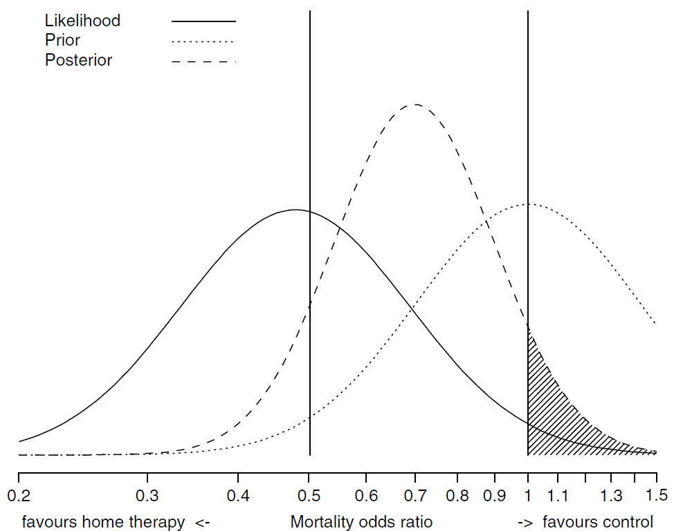
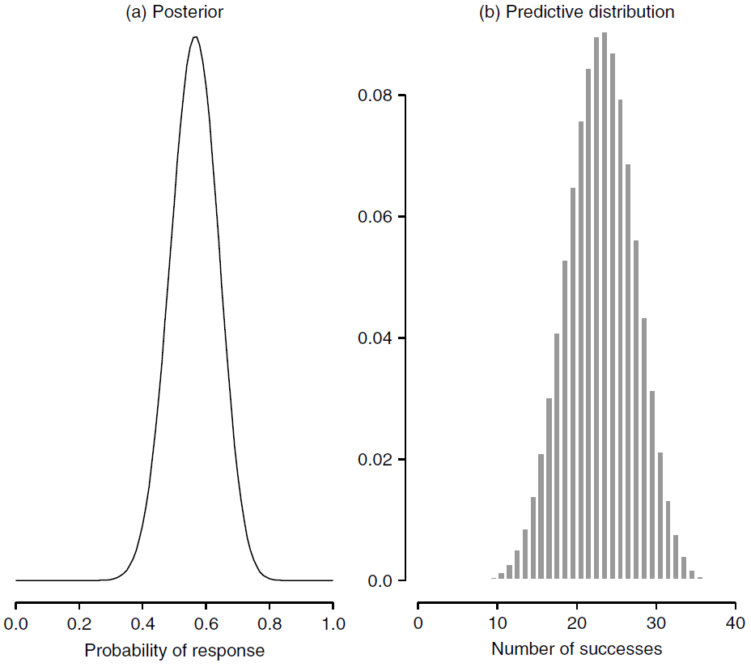

# An Overview of the Bayesian Approach

Book title: [Bayesian Approaches to Clinical Trials and Health-Care Evaluation](http://93.174.95.29/main/791000/1c3cccffb374be94e8940aa087c433c0/%28Statistic%20in%20practice%29%20David%20J.%20Spiegelhalter%2C%20Keith%20R.%20Abrams%2C%20Jonathan%20P.%20Myles%20-%20Bayesian%20Approaches%20to%20Clinical%20Trials%20and%20Health-Care%20Evaluation-Wiley%20%282004%29.pdf)

Author: David J. Spiegelhalter, Keith R. Abrams, Jonathan P. Myles

Series: Statistic in practice

Publisher: Wiley

Year: 2004

[Chapter 3](http://www.medicine.mcgill.ca/epidemiology/hanley/bios602/Bayes/an%20overview%20of%20the%20Bayesian%20approach.pdf)

## 3.1 Subjectivity and Context

+ [The prior distribution](https://en.wikipedia.org/wiki/Prior_probability)
  + in Bayesian statistical inference, the probability distribution that would express one's beliefs about the quantity before some evidence is taken into account
  + the prior probability of a random event or an uncertain proposition: the unconditional probability assigned before any relevant evidence is taken into account
  + the unknown quantity may be a parameter of the model or a latent variable rather than an observable variable
  + methods to create prior
    + determined from past information, such as previous experiments
    + elicited from the purely subjective assessment of an experienced expert
    + (uninformative) created to reflect a balance among outcomes when no information is available
    + chosen according to some principle, such as symmetry or maximizing entropy given constraints
    + (conjugate) chosen a prior from a family simplifies calculation of the posterior distribution

+ [Likelihood function / likelihood](https://en.wikipedia.org/wiki/Likelihood_function)
  + measuring the goodness of fit of a statistical model to a sample of data for given values of the unknown parameters
  + formed from the joint probability of the sample but viewed and used as function of the parameters only
  + describing a hypersurface whose peak represents the combination of model parameter values that maximize the probability of drawing the sample obtained
  + maximum likelihood estimation: a procedure for obtaining the arguments of the maximum of the likelihood function
  + the shape and curvature of the likelihood surface represent information about the stability of the estimates
  + Definition of a parameterized model
    + $x \to f(x | \theta)$: a parameterized family of probability density function (pdf) or probability mass function (discrete distribution), $\theta$ is the parameter
    + the likelihood function

      \[ \theta \to f(x | \theta) \implies \mathcal{L}(\theta | x) = f(x | \theta) \tag{Likelihood} \]

      + $x$: observed outcome of an experiment
    + $f(x | \theta)$:
      + probability density function: a function of $x$ w/ $\theta$ fixed
      + a likelihood function: a function of $\theta$ w/ $x$ fixed
    + an equivalence class of functions
    + likelihood function: $x$ as a constant and imaging $\theta$ to be a varying over the whole range of possible parameter values
  + Definition for continuous distribution:
    + given an observation $x_j$
    + $\mathcal{L}(\theta | x \in [x_j, x_j+h])$: the likelihood for the interval $[x_j, x_j + h]$, where $h > 0$ is a constant

      \[\begin{align*}
        \text{argmax}_\theta \, \mathcal{L}(\theta | x \in [x_j, x_j + h]) & = \text{argmax}_\theta \, \frac{1}{h} \mathcal{L}(\theta | x \in [x_j, x_j + h]) \\
        & \downarrow \\
        \text{argmax}_\theta \mathcal{L}(\theta, x_j) &= \text{argmax}_\theta f(x_j | \theta)
      \end{align*}\]

  + a key part of Bayesian inference
  + using likelihoods to generate estimators $\to$ the maximum likelihood estimator

+ Likelihoods
  + statistical inference:
    + learning about the assumed underlying distribution of quantities observed
    + generally carried out by assuming that the probability distributions follow a particular _parametric_ form $p(y | \theta)$
    + the distribution of $Y$ depends on some currently unknown parameter $\theta$
  + Bayesian inference: considered as random variables but the usual convention of capital and lower-case letters is ignore, to no apparent detriment
  + likelihood $p(Y | \theta)$:
    + once data $y$ observed, a function of $\theta \to$ extend to which different values $\theta$ are supported by the data
    + summarizing all the information that the data $y$ able to provide about the parameter $\theta$
  + any function of $\theta$ proportional to $p(y|\theta)$ can be considered as the likelihood
  + likelihood function: the relative plausibility of different values of $\theta$
  + maximum likelihood estimate: with the value of $\theta$ for which the likelihood is a maximum
  + using a range of values which are _best_ supported by the data as an interval estimate for $\theta$
  + a reasonable range defined by values of the likelihood above $\exp(-1.96^2/2) = 14.7\%$ of the maximum value
  + in practice, constructing intervals in such a manner is laborious, and in general approximate likelihood functions by the normal distribution
  + example: Bernoulli
    + $n$ individuals and measured the $i$-th individual responds to treatment, $Y_i = 1$, or not, $Y_i = 0$
    + assume a set of independent Bernoulli trials such that the probability of response is $\theta$
    + joint distribution for all $n$ individuals

      \[\begin{align*}
        p(y_1, \dots, y_n|\theta) &= \prod_{i=1}^n p(y_i|\theta) =  \prod_{i=1}^n \theta^{y_i}(1 - \theta)^{1 - y_i} \\
          &= \underbrace{\theta^{y_1+\dots+y_n} (1 - \theta)^{(1-y_1)+\dots+(1-y_n)} = \theta^r (1-\theta)^{n - r}}_{y_1, \dots, y_n \text{ independent}}
      \end{align*}\]

      + $r = \sum_i y_i$: the number of responders
    + likelihood maximized at $\hat{\theta} = r/n$
    + the maximum likelihood estimate proportional to responders

+ [The posterior distribution](https://www.statisticshowto.datasciencecentral.com/posterior-distribution-probability/)
  + Wikipedia: the probability distribution of an unknown quantity, treated as a random variable, conditional on the evidence obtained from an experiment or survey
  + a way to summarize what we know about uncertain quantities in Bayesian analysis
  + a combination of the prior distribution and the likelihood function
  + summarizing what you know after the data has been observed

    \[ \text{Posterior Distribution} = \text{Prior Distribution} + \text{Likelihood Function (“new evidence”)} \]

  + Posterior probability: the probability that an event will happen after all evidence or background information has been taken into account

+ Terminology
  + standard deviation ($sd$): a measure of the amount of variation or dispersion of a set of values ($var = sd^2$) $\implies$ true population mean
  + standard error ($se$)
    + the standard deviation ($sd$) of its sampling distribution or an estimate of that standard deviation
    + not enough samples & different trials $\to$ different population means
  + sampling distribution: the probability distribution of a given random-sample-based statistic
  + likelihood principle: the proposition that, given a statistical model, all the evidence in a sample relevant to model parameters is contained in the likelihood function
  + joint probability distribution
    + joint probability: the probability of two events occurring simultaneously
    + a probability distribution giving the probability that each $X, Y, \dots$ falls in any particular range or discrete set of values specified for that variable
    + the joint probability density function of random variable $X$ and $Y$ is $f_{X, Y}(x, y)$, the marginal probability density function of $X$ and $Y$

      \[ f_X(x) = \int f_{XY} (x, y) dy, \qquad f_Y(y) = \int f_{XY} (x, y) dx \]

  + marginal distribution
    + marginal probability: the probability of an event irrespective of the outcome of another variable
    + the marginal distribution of a subset of a collection of random variables is the probability distribution of the variables contained in the subset
    + two random variables independent $\iff$ their joint distribution function equal to the product of their marginal distribution functions
    + marginal probability density function: two continuous random variables $X$ and $Y$ w/ $x \in [a, b]$ and $b \in [c, d]$

      \[ f_Y(x) = \int_c^d f(x, y) dy, \qquad f_Y(y) = \int_a^b f(x, y) dx \]

  + frequency interpretation of probability: long-run properties of repeated random events
  + frequentist:
    + standard statistical methods
    + $p(x)$ is the proportion of times $x$ will occur in an infinitely long series of repeated identical situations
  + odds ($O$):
    + the probability ($p$) that the event will occur divided by the probability ($1 - p$) that the event will not occur
    + used to describe the chance of an event occurring

    \[ O = \frac{p}{1 - p} \tag{Odds} \]
  
  + logit: the natural logarithm of the odds

  \[ \text{logit}(p) = \ln(\frac{p}{1 - p}) \tag{Odds.log} \]

  + Bayes theorem

    \[ p(b|a) = \frac{p(a|b)}{p(a)} \times p(b) \tag{Bayes} \]

  + The odds form of Bayes theorem

    \[ \frac{p(b|a)}{p(b|a)} = \frac{p(a|b)}{p(a| \overline{b})} \times \frac{p(b)}{p(\overline{b})} \tag{Bayes.odds} \]

  + [statistically significance](https://www.investopedia.com/terms/s/statistically_significant.asp)
    + a determination by an analyst that the results in the data are not explainable by chance alone
    + the likelihood that a relationship btw two or more variables caused by something other than chance
    + used to provide evidence concerning the plausibility of the null hypothesis, which hypothesizes that there is nothing more than random chance at work in the data
    + a p-value of 5% or lower often considered to be statistically significant
  + [statistical hypothesis testing](https://www.investopedia.com/terms/h/hypothesistesting.asp)
    + the method by which the analyst makes this determination
    + an act in statistics whereby an analyst tests an assumption regarding a population parameter
    + used to assess the plausibility of a hypothesis by using sample data
  + [p-value](https://www.investopedia.com/terms/p/p-value.asp)
    + the probability of observing results as extreme as those in the data, assuming the results are truly due to chance alone
    + the probability of obtaining results as extreme as the observed results of a statistical hypothesis test, assuming that the null hypothesis is correct
    + used as an alternative to rejection points to provide the smallest level of significance at which the null hypothesis would be rejected
    + smaller p-value $\implies$ stronger evidence in favor of the alternative hypothesis
  + [meta-analysis](https://en.wikipedia.org/wiki/Meta-analysis)
    + a statistical analysis that combines the results of multiple scientific studies
    + performed when multiple scientific studies address the same question w/ each study reporting measurements expected some degree of error
    + derived a pooled estimate closest to the unknown common true based on how this error is perceived
  + [prospective analysis](https://www.longwoods.com/content/20972/healthcare-quarterly/looking-ahead-the-use-of-prospective-analysis-to-improve-the-quality-and-safety-of-care)
    + used as an analytical tool to assess and mitigate the occurrence of loss by analyzing a situation or process that carries with it some inherent risk
    + to identify the way in which a process might potentially fail, w/ the goal to eliminate or reduce the likelihood or outcome severity of such a failure
    + applied to process or equipment and systems
    + FEMA used proactively when designing a new system or process for a high-risk or complex process or during an inter-professional process w/ hands-off and interdependent steps
    + w/ its roots in the engineering industry

+ Binomial and Bernoulli distributions
  + $Y$: a discrete binomial variable w/ the sampling distribution of the total number of 'successes' in $n$ independent Bernoulli trials
  + $\theta$: the probability of success in each Bernoulli trial
  + $\theta^y (1 - \theta)^{n-y}$: the likelihood, the probability for a specific sequence of $n-y$ 'failure' and '$y$ 'successes', $\begin{pmatrix} n \\ y \end{pmatrix}$ sequences
  + $Y \sim Bin[n, \theta]$: a binomial distribution w/ properties

    \[\begin{align*}
      p(y | n, \theta) & = \begin{pmatrix} n \\ y \end{pmatrix} \theta^y (1-\theta)^{n-y}, \qquad y = 0, 1, \dots, n \tag{Bin.prob} \\
      E(Y | n, \theta) &  = n \theta \tag{Bin.mean} \\
      Var(Y | n, \theta) &= n \theta (1-\theta) \tag{Bin.var}
    \end{align*}\]

  + $Y \sim Bern[\theta]$: a Bernoulli distribution, a binomial w/ $n=1$

+ Beta distribution
  + a flexible and mathematically convenient class for quantities contained to lie btw 0 and 1
  + form: $Y \sim Beta(a, b)$
  + properties

    \[\begin{align*}
      p(y | a, b) &= \frac{\Gamma (a, b)}{\Gamma (a) \Gamma (b)} y^{a-1} (1-y)^{b-1}, \quad y \in (0, 1) \tag{Beta.prob}\\
      E(Y|a, b) &= \frac{a}{a+b} \tag{Beta.mean}\\
      Var(Y|a, b) &= \frac{ab}{(a+b)^2(a+b+1)} \tag{Beta.var}
    \end{align*}\]

    where $\Gamma(a) = (a-1)!$

+ [the Beta-Binomial distribution](https://en.wikipedia.org/wiki/Beta-binomial_distribution)
  + the Beta distribution as a conjugate distribution of the binomial distribution
  + an analytically tractable compound distribution
  + $p$ parameter in the binomial distribution as being randomly draw from a beta distribution
  
    \[ X \sim Bin(n, \theta) \implies p(X=k | p, n) = L(p | k) = \begin{pmatrix} n \\ k \end{pmatrix} \theta^k (1-\theta)^{n-k} \]

  + $\theta$: a random variable w/ a beta distribution

    \[ p(\theta | a, b) = Beta(a, b) = \frac{\theta^{a-1} (1-\theta)^{b-1}}{B(a, b)} \qquad \text{ for } 0 \leq \theta \leq 1 \]

    + $B(a, b) = \Gamma(a) \Gamma(b) / \Gamma(a+b)$

  + the compound distribution

    \[\begin{align*}
      p(k | n, a, b) 
        &= \int_0^1 \underbrace{L(\theta | k)}_{\text{binomial}} \cdot \underbrace{p(\theta | a, b)}_{\text{beta}} d\theta \\
        &= \begin{pmatrix} n \\ k \end{pmatrix} \frac{1}{B(a, b)} \int_0^1 \theta^{k+a-1} (1-\theta)^{n-k+b-1} d\theta
        = \begin{pmatrix} n \\ k \end{pmatrix} \frac{B(k+a, n-k+b)}{B(a, b)} \\\\
        &= \frac{\Gamma(n+1)}{\Gamma(k+1)\Gamma(n-k+1)} \frac{\Gamma(k+a)\Gamma(n-k+b)}{\Gamma(n+a+b)} \frac{\Gamma(a+b)}{\Gamma(a)\Gamma(b)}
    \end{align*}\]

+ The Bayesian approach
  + resting on an essentially _subjective_ interpretation of probability
  + allowed to express generic _uncertainty_ or _degree of belief_ about any unknown but potentially observable quantity
  + rules of probability
    + Lindley, D. V. (2000) [The philosophy of statistics (with discussion)](https://www.phil.vt.edu/dmayo/personal_website/Lindley_Philosophy_of_Statistics.pdf). The Statistician, 49, 293–337.
    + not assumed as self-evident
    + able to derived from 'deeper' axioms of reasonable behavior of an individual
  + probabilities _for_ events rather than probabilities _of_ events
  + the probability is a reflection of personal uncertainty rather than necessarily being based on future unknown events illustrated by a gambling game

+ Bayesian statistics
  + Berger, J. and Berry, D. A. (1988) [Statistical analysis and the illusion of objectivity](http://ifmlab.for.unb.ca/people/kershaw/Courses/Research_Methods/Readings/BergerJO1988a.pdf). American Scientist, 76, 159–65.
  + treating subjectivity with respect by placing it in the open and under the control of the consumer of data

+ [Neyman-Pearson lemma](https://en.wikipedia.org/wiki/Neyman%E2%80%93Pearson_lemma)
  + performing a hyposis test btw two simple hypotheses, $H_0 \theta = 0$ and  $H_1: \theta = \theta_1$ w/
  + using the likelihood ratio test  w/ threshold $\eta$
  + rejecting $H_0$ in favor of $H_1$ at a significance level of 

    \[ \alpha = P(\Lambda(x) \leq \eta | H_0) \]

    + $\Lambda(x) = \frac{\mathcal{L}(\theta_0 | x)}{\mathcal{L}(\theta_1 | x)}$
    + $\mathcal{L}(\theta | \theta)$: th elikelihood function
  + the Neyman-Pearson lemma: the likelihood ratio, $\Lambda(x)$, is the __most powerful test__ at signifiance level $\alpha$
  + Properties
    + the test is most powerful for $\theta_1 \in \Theta_1 \implies$ test as uniformly most powerful (UMP) for alternatives in the set $\Theta_1$
    + the likelihood ratio: used directly to construct tests
  + Example:
    + $X_1, X_2, \dots, X_n$: a random sample from $N(\mu, \sigma^2)$
    + test: $H_0: \sigma^2 = \sigma_0^2$ against $H_1: \sigma^2 = \sigma_1^2$
    + the likelihood for this set of normal distributed data

      \[ \mathcal{L}(\sigma^2 | x) \propto (\sigma^2)^{-n/2} \exp \left( - \frac{\sum_{i=1}^n (x_i - \mu)^2}{2\sigma^2} \right) \]

    + the likelihood ratio

      \[ \Lambda(x) = \frac{\sigma_0^2 | x}{\mathcal{L}(\sigma_1^2 | x)} = \left( \frac{\sigma_0}{\sigma_1} \right)^{-n/2} \exp \left( -\frac{1}{2}(\sigma_0^2 - \sigma_1^2) \right) \sum_{i=1}^n (x_i - \mu)^2 \]

    + the ratio only depends on the data through $\sum_{i=1}^n (x_i - \mu)^2$
    + by Heyman-Peearson lemma, the most powerful test for this data only depends on $\sum_{i=1}^n (x_i - \mu)^2$
    + $\sigma_1^2 > \sigma_0^2 \implies \Lambda(x)$ is a decreasing function of $\sum_{i=1}^n (x_i - \mu)^2$
    + reject $H_0$ if $\sum_{i=1}^n (x_i - \mu)^2$ is sufficient large
    + the rejection threshold depending on the size of the test
    + $\therefore$ test statistic w/ a scaled $\chi^2$ distributed random variable $\implies$ obtaining an exact critical value $\eta$

## 3.2 Bayes theorem for two hypotheses

+ Prior to posterior analysis
  + hypotheses $H_0$ and $H_1$: mutually exhaustive and exclusive
  + the prior probability for each of two hypotheses: $p(H_0)$ and $p(H_1)$
  + $y$: the result of a test
  + $p(y | H_0)$ and $p(y | H_1)$
    + the probability of observing $y$ under each of the two hypotheses
    + the _likelihoods_
  + posterior probabilities:

    \[ p(H_0 | y) = \frac{p(y | H_0)}{p(y)} \times p(H_0)  \tag{1} \]

  + the overall probability of $y$ occurring:
  
    \[p(y) = p(y | H_0) p(H_0) + p(y | H_1) p(H_1) \]

  + the odds form of Bayes theorem

    \[\begin{align*}

      \frac{p(H_0 | y)}{p(H_1 | y)} &= \frac{p(y | H_0)}{p(y | H_1)} \times \frac{p(H_0)}{p(H_1)} \tag{2} \\
    \end{align*}\]

    + the prior odds: $p(H_0)/p(H_1)$
    + the posterior odds: $p(H_0 | y) / p(H_1 | y)$
    + the ratio of the likelihood: $p(y | H_0) / p(y | H_1)$

    \[\begin{align*}
      \text{posterior odds} &= \text{likelihood ratio} \times \text{prior odds} \\ \\
      \log(\text{posterior odds}) &= \log(\text{likelihood ratio}) + \log(\text{prior odds})
    \end{align*}\]

    + the weight of evidence: $\log(\text{likelihood ratio})$

+ Example 1 -- Diagnosis: Bayes theorem in diagnostic testing
  + Notations & Assumptions:
    + a new home HIV test
    + $95\%$ sensitivity
    + $98\%$ specificity
    + used in a population w/ an HIV prevalence of $1/1000$
  + Table 1 -- Expected status of 100,000 tested individuals in a population w/ an HIV prevalence of $1/1000$

    |     | HIV- | HIV+ |   |
    |-----|-----:|-----:|--:|
    | Test - | 87,902 | 5 | 97,907 |
    | Test + | 1, 998 | 95 | 2,093 |
    |Total   | 99,900 | 100 | 100,000 |

  + $H_0$: individual truly HIV positive
  + $H_1$: truly HIV negative
  + $y$: the observation tested positive
  + the prior probability of the disease prevalence: $p(H_0) = 0.001$
  + the posterior probability $p(H_0 | y)$: the chance that someone who tests positive is truly HIV positive
  + Analysis
    + $95\%$ sensitivity: $p(y | H_0) = 0.95$
    + $98\%$ specificity: $p(y | H_1) = 0.02$
    + the prior odds: $p(H_0)/p(H_1) = 1/999$
    + the likelihood ratio: $p(y | H_0) / p(y | H_1) = 0.95/0.02 = 95/2$
    + the posterior odds: $p(H_0 | y) / p(H_1 | y) = (95/2) \times (1/999) = 95/1998$
    + the posterior probability: $p(H_0 | y) = 95/(95 + 1998) = 0.045$
  + Bayes theorem (Eq. (1))

    \[\begin{align*}
      p(y ) & = p(y | H_0) p(H_0) | p(y | H_1) p(H_1) = 0.95 \cdot 0.001 + 0.02 \cdot 0.999 = 0.02093 \\
      p(H_o | y) &= 0.95 \cdot 0.001 / 0.02093 = 0.045
    \end{align*}\]

  + Ans: over $95\%$ of those testing positive will not have HIV
  + Bayes theorem for two hypotheses $H_0$ and $H_1$
    + by specifying the prior probability or odds, and likelihood ratio $p(y|H_0)/p(y|H_1)$, the posterior probability or odds can be read off the graphs
    + using the logarithmic scaling, under which Bayes theorem gives a linear relationship (fig.(b))

    

      
    

## 3.3 Comparing simple hypotheses: likelihood ratios and Bayes factors

+ the likelihood principle
  + the likelihoods contains all the relevant that can be extracted from the data
  + all the information that the data provide about the parameter is contained in the likelihood
  + Berger, J. and Wolpert, R. (1988) [The Likelihood Principle (2nd edition)](https://b-ok.org/dl/505521/68882f), Institute of Mathematical Statistics, Hayward, CA, 1998

+ Bayes factor (BF)
  + measure of the relative likelihood of two hypotheses
  + the 'relative betting odds' btw two hypotheses
  + value in $[0, \infty)$
  + small values being considered as both evidence _against_ $H_0$ and evidence _for_ $H_1$
  + transforming prior to posterior odds
  + Example 1: a positive test of $BF = 47.5$ in favor of being HIV positive ($H_0$)
  + obtained for composite hypotheses that include unknown parameters

+ Table 2 -- Calibration of Bayes factor (likelihood ratio)

  <table style="font-family: arial,helvetica,sans-serif;" table-layout="auto" cellspacing="0" cellpadding="5" border="0" align="center" width=50%>
    <caption style="font-size: 1.5em; margin: 0.2em;"><a href="http://www.medicine.mcgill.ca/epidemiology/hanley/bios602/Bayes/an%20overview%20of%20the%20Bayesian%20approach.pdf">Calibration of Bayes factor (likelihood ratio)</a></caption>
    <thead>
    <tr>
      <th style="text-align: center; background-color: #3d64ff; color: #ffffff; width:20%;">Bayes factor range</th>
      <th style="text-align: center; background-color: #3d64ff; color: #ffffff; width:40%;">Strength of evidence in favour of $H_0$ and against $H_1$</th>
    </tr>
    </thead>
    <tbody>
    <tr style="text-align: center;"> <td> > 100 / < 1/100</td>       <td>Decisive</td> </tr>
    <tr style="text-align: center;"> <td>32 to 100 / 1/32 to 1/100</td>    <td>Very strong</td> </tr>
    <tr style="text-align: center;"> <td>10 to 32 / 1/10 to 1/3.2</td>     <td>Strong</td> </tr>
    <tr style="text-align: center;"> <td>3.2 to 10 1/3.2 to 1/10</td>     <td>Substantial</td> </tr>
    <tr style="text-align: center;"> <td>1 to 3.2 / 1 to 1/3.2</td>      <td>'Not worth more than a bare mention'</td> </tr>
    </tbody>
  </table>

+ Use of Bayes theorem
  + diagnostic testing: an established part of formal clinical reasoning
  + general statistical analysis
    + a parameter $\theta$ is an unknown quantity such as the mean benefit of a treatment on a specified patient
    + the prior distribution $p(\theta)$ needs to be specified
    + concern: a natural extension of the subjective interpretation of probability

## 3.4 Exchangeability and parametric modeling

+ Exchangeability
  + the rules of probability able to be derived from more basic ideas of relational behavior
  + deriving the idea of i.i.d. variables and prior distributions of parameters from the more basic subjective judgement
  + a formal expression of the idea that no systematic reason to distinguish the individual variables $Y_1, \dots, Y_n$ (similar but not identical)
  + exchangeable: the probability of $Y_1, \dots, Y_n$ assigned to any set of potential outcomes, $p(y_1, \dots, y_n)$, unaffected by permutations of the labels attached to the variables
  + example:
    + $Y_1, Y_2, Y_3$: the first 3 tosses of a (possible biased) coin
    + $Y_1 = 0$ indicates a tail and $Y_1 = 1$ indicates a head
    + $p(Y_1 = 1, Y_2 = 0, Y_3 = 1) = p(Y_2 = 1, Y_1 = 0, Y_3 = 1) = p(Y_1 = 1, Y_3 = 0, Y_2 = 1)$: the probability of getting two head and one tail is unaffected by the particular toss on which the tail comes
    + $Y_1, \dots, Y_3$ might not independent

+ Judgment of exchangeability
  + Bernardo, J. M. and Smith, A. F. M. (1994) [Bayesian Theory](http://abelo.zlibcdn.com/dtoken/f1ddfe4ba4a2b3c9eebeb81935e28f80/Bayesian_Theory_by_Jos%C3%A9_M._Bernardo,_Adrian_F._M.__703263_(z-lib.org).pdf). John Wiley & Sons, Ltd, Chichester.
  + a set of binary variables $Y_1, \dots, Y_n$ exchangeable $\implies$ the marginal distribution

    \[ p(y_1, \dots, y_n) = \int \, \prod_{i=1}^{n} p(y_i | \theta) p(\theta) d\theta \tag{3} \]

  + $Y_1, \dots, Y_n$ are i.i.d., each with distribution $p(y_i, \theta)$, the joint distribution (conditional $\theta$) is

    \[ p(y_1, \dots, y_n | \theta) = \prod_{i=1}^n p(y_i | \theta) \]

  + exchangeable random quantities can be though of being i.i.d. variables drawn from some common distribution depending on an unknown parameter $\theta$ w/ a prior distribution $p(\theta)$
  + from a subjective judgment about observable quantities, one derives that whole apparatus of i.i.d. variables, conditional independence, parameters and prior distributions

## 3.5 Bayes theorem for general quantities

+ Notations & Assumptions
  + $\theta$: unknown quantity
  + $p(\theta | H)$: the prior distribution of $\theta$; judgment about $\theta$ conditional on a context $H$
  + $y$: some observed evidence

+ Bayesian approach
  + $p(y | \theta)$: the (conditional) probability of $y$ for each possible value of $\theta$
  + $p(\theta | y)$: likelihood; to obtain the new, posterior, probability for different $\theta$, taking account of the evidence $y$
  + applying Bayesian theorem to a general quantity $\theta$

    \[ p(\theta | y) = \frac{p(y | \theta)}{p(y)} \times p(\theta)  \tag{4}\]

    + $p(y)$: a normalizing factor to ensure that $\int p(\theta|y)d\theta = 1$ and value not interested
  + the essence of Bayes theorem only concerns the terms involving $\theta$

    \[ p(\theta | y) \propto p(y | \theta) \times p(\theta) \tag{5} \]

  + the posterior distribution proportional to (i.e. has the same shape as) the product of the likelihood and the prior

## 3.6 Bayesian analysis with binary data

+ Bayesian approach to make inference: combining the likelihood w/ initial evidence or opinion regarding $\theta$, as expressed in a prior distribution $p(\theta)$

### 3.6.1 Binary data with a discrete prior distribution

+ only a limited set of hypotheses concerning the true proportional $\theta$, corresponding to a finite list denoted $\theta_1, \dots, \theta_J$

+ Bernoulli distribution
  + for a single Bernoulli trial w/ outcome 0 or 1, the likelihood for each possible value for $\theta$

    \[ p(y | \theta_j) = \theta_j^y (1 - \theta_j)^{1-y}  \qquad \text{ where } \quad
      p(y | \theta_j) = \begin{cases} \theta_j & \text{ if } y = 1 \\ 1 - \theta_j & \text{ if } y = 0 \end{cases} \tag{6} 
    \]

  + the posterior probabilities for the $\theta_j$

    \[ p(\theta_j | y) \propto \theta_j^y (1 - \theta_j)^{1-y} \times p(\theta_j)  \tag{7} \]

    where the normalizing factor that ensures the posterior probabilities add to 1

    \[ p(y) = \sum_j \theta_j^y (1 - \theta_j)^{1-y} \times p(\theta_j) \]

  + the result w/ $r$ 'successes' out of $n$ trials, the relevant posterior

    \[ p(\theta_j | r) \propto \theta_j^r (1 - \theta_j)^{1-y} \times p(\theta_j) \tag{8} \]

+ Example 2 -- Drug: Binary data and a discrete prior
  + Notations & Assumptions
    + a drug w/ an unknown true response rate $\theta$
    + only one of the values $\theta_1 = 0.2, \theta_2 = 0.4, \theta_3 = 0.6, \text{ or } \theta_4 = 0.8$
    + 'neutral' position: equally likely value for $\theta_j$, i.e. $p(\theta_j) = 0.25$ for $j=1, 2, 3,4$
  + likelihood for one response: $p(y|\theta_j) = \theta_j^y (1 - \theta_j)^{1-y} = \theta_j$
  + Table 3: results after observing a single positive response, $y=1$, for a drug given an initial uniform distribution over four possible response rate $\theta_j$

    <table style="font-family: arial,helvetica,sans-serif;" table-layout="auto" cellspacing="0" cellpadding="5" border="1" align="center" width=80%>
      <caption style="font-size: 1.5em; margin: 0.2em;"><a href="http://www.medicine.mcgill.ca/epidemiology/hanley/bios602/Bayes/an%20overview%20of%20the%20Bayesian%20approach.pdf">Results after observing a single response</a></caption>
      <thead>
      <tr>
        <th style="text-align: center; background-color: #3d64ff; color: #ffffff; width:5%;">$j$</th>
        <th style="text-align: center; background-color: #3d64ff; color: #ffffff; width:5%;">$\theta_j$</th>
        <th style="text-align: center; background-color: #3d64ff; color: #ffffff; width:5%;">Prior  $p(\theta_j)$</th>
        <th style="text-align: center; background-color: #3d64ff; color: #ffffff; width:10%;">Likelihood  $p(y|\theta_j)$</th>
        <th style="text-align: center; background-color: #3d64ff; color: #ffffff; width:10%;">Likelihood x prior  $p(y|\theta_j) p(\theta_j)$</th>
        <th style="text-align: center; background-color: #3d64ff; color: #ffffff; width:10%;">Posterior  $p(\theta_j|y)$</th>
      </tr>
      </thead>
      <tbody>
        <tr style="text-align: center;"> <td>1</td> <td>0.2</td> <td>0.25</td> <td>0.2</td> <td>0.05</td> <td>0.10</td> </tr>
        <tr style="text-align: center;"> <td>2</td> <td>0.4</td> <td>0.25</td> <td>0.4</td> <td>0.10</td> <td>0.20</td> </tr>
        <tr style="text-align: center;"> <td>3</td> <td>0.6</td> <td>0.25</td> <td>0.6</td> <td>0.15</td> <td>0.30</td> </tr>
        <tr style="text-align: center;"> <td>4</td> <td>0.8</td> <td>0.25</td> <td>0.8</td> <td>0.20</td> <td>0.40</td> </tr>
        <tr style="text-align: center;"> <td></td> <td>$\sum_j$</td> <td>1.0</td> <td></td> <td>0.50</td> <td>1.00</td> </tr>
      </tbody>
    </table>

  + Table 4: Results after observing 15 positive responses, $y=15$, for a drug out of 20 cases, given an initial uniform distribution over four possible response rates $\theta_j$

    <table style="font-family: arial,helvetica,sans-serif;" table-layout="auto" cellspacing="0" cellpadding="5" border="1" align="center" width=80%>
      <caption style="font-size: 1.5em; margin: 0.2em;"><a href="http://www.medicine.mcgill.ca/epidemiology/hanley/bios602/Bayes/an%20overview%20of%20the%20Bayesian%20approach.pdf">Results after observing 15 positive responses</a></caption>
      <thead>
      <tr>
        <th style="text-align: center; background-color: #3d64ff; color: #ffffff; width:5%;">$j$</th>
        <th style="text-align: center; background-color: #3d64ff; color: #ffffff; width:5%;">$\theta_j$</th>
        <th style="text-align: center; background-color: #3d64ff; color: #ffffff; width:5%;">Prior  $p(\theta_j)$</th>
        <th style="text-align: center; background-color: #3d64ff; color: #ffffff; width:10%;">Likelihood  $\theta_j^{15}(1-\theta_j)^5$ $(\times 10^{-7})$</th>
        <th style="text-align: center; background-color: #3d64ff; color: #ffffff; width:10%;">Likelihood x prior  $\theta_j^{15}(1-\theta_j)^5p(\theta_j)$ $(\times 10^{-7})$</th>
        <th style="text-align: center; background-color: #3d64ff; color: #ffffff; width:10%;">Posterior  $p(\theta_j|X=1)$</th>
      </tr>
      </thead>
      <tbody>
        <tr style="text-align: center;"> <td>1</td> <td>0.2</td> <td>0.25</td> <td>0.0</td> <td>0.0</td> <td>0.000</td> </tr>
        <tr style="text-align: center;"> <td>2</td> <td>0.4</td> <td>0.25</td> <td>0.8</td> <td>0.2</td> <td>0.005</td> </tr>
        <tr style="text-align: center;"> <td>3</td> <td>0.6</td> <td>0.25</td> <td>48.1</td> <td>12.0</td> <td>0.298</td> </tr>
        <tr style="text-align: center;"> <td>4</td> <td>0.8</td> <td>0.25</td> <td>112.6</td> <td>28.1</td> <td>0.697</td> </tr>
        <tr style="text-align: center;"> <td></td> <td>$\sum_j$</td> <td>1.0</td> <td></td> <td>40.3</td> <td>1.0</td> </tr>
      </tbody>
    </table>

### 3.6.2 Conjugate analysis for binary data

+ Uniform distribution
  + assumption for prior distribution:
    + all possible values of $\theta$ equally likely
    + uniform distribution, $p(\theta) = 1 \, \text{ for } \,0 \leq \theta \leq 1$
  + applying Bayes theorem

    \[ p(\theta | y) \propto \theta^r (1-\theta)^{n-r} \times 1  \tag{9} \]

    + $r$: the number of events
    + $n$: the total number of individuals
  + the functional form of the posterior distribution proportional to a beta distribution: $Beta(r+1, n-r+1)$

+ Beta distribution: $Beta(a, b)$ for prior distribution
  
  \[\begin{align*}
    \text{Prior} &\propto \theta^{a-1} (1 - \theta)^{b-1} \\
    \text{Likelihood} &\propto \theta^r (1 - \theta)^{n-r} \\
    \text{Posterior} &\propto \theta^{a-1}(1 - \theta)^{b-1} \theta^r (1-\theta)^{n-r} \tag{10} \\
      &\propto \theta^{a+r-1}(1-\theta)^{b+n-r-1} = Beta(a+r, b+n-r)
  \end{align*}\]

+ Example 3 -- Drug(continued): Binary data and a continuous prior
  + experience: response rates btw 0.2 and 0.6 w/ expectation around 0.4 $\implies Beta(a, b)$
  + estimate the mean and variance of the prior distribution
    + normal distribution: $m \pm 2s$ including over 95% of the probability; e.g. $m = 0.4, s = 0.1$
    + beta distribution w/ reasonably high $a$ and $b$ as an approximately normal shape
  + a beta distribution to a normal distribution

    \[\begin{align*}
      m &= a/(a+b) \tag{11} \\
      s^2 &= m(1-m)/(a+b+1) \tag{12}
    \end{align*}\]
  
  + $m = 0.4, b = 0.1 \implies a = 9.2, b = 13.8$
  + Figure for prior distribution ($Beta(0, 0)$) to posterior distribution ($Beta(9.2, 13.8)$) w/ likelihood function
    + Fig. (a)
      + representing the prior assumption w/ a 'non-informative' prior $Beta(0, 0)$
      + observing that $a=9.2$ successes in $a+b = 23$ patients
      + only heuristic argument as no agreed 'non-informative' beta prior, w/ $Beta(0,0), Beta(0.5, 0.5), Beta(1, 1)$ all having been suggested
    + observed $r=15$ successes out of 20 trials
    + updated to $Beta(a+15, B+20-5) = Beta(24.2, 18.8)$
    + Fig. (c): posterior distribution w/ mean $24.2/(24.2 + 18.8) = 0.56$

    

      
      
    

## 3.7 Bayesian analysis with normal distributions

+ Normal distribution
  + notations and assumptions
    + considering the likelihood w/ a normal distribution
    + might involve working on somewhat unintuitive scales such as the logarithm of the hazard ratio
  + the prior distribution $p(\theta)$

    \[ p(\theta) = N \left(\theta \left\vert \mu, \frac{\sigma^2}{n_0}\right.\right) \tag{13} \]

    + $\mu$: the prior mean
    + $\sigma$: the standard deviation for the prior and the likelihood
    + $n_0$: 'implicit' sample size that the prior based on
  + advantages of Eq.13 for prior-to-posterior analysis
    + $n_0 \to 0 \implies \sigma^2 \uparrow$ and the distribution becoming 'flatter'
    + the distribution $\to$ uniform over $(-\infty, \infty)$
    + normal prior w/ a very large variance used to represent a 'non-informative' distribution
  + posterior distribution
    + normal prior distribution: $\theta \sim N(\mu, \sigma^2/n_0)$
    + likelihood: $y_m \sim N(\theta, \sigma^2/m)$
    + posterior distribution obeys

      \[\begin{align*}
        p(\theta|y_m) &\propto p(y_m | \theta) p(\theta) \\
         &\propto \exp \left(-\frac{(y_m - \theta)^2 m}{2\sigma^2} \right) \times \exp \left(-\frac{(\theta - \mu)^2 n_o}{2\sigma^2} \right)
      \end{align*}\]

    + the term involving $\theta$ exactly that arising from a posterior distribution

      \[ p(\theta|y_m) = N \left(\theta \left\vert \frac{n_0\mu + my_m}{n_o + m}, \frac{\sigma^2}{n_0 + m}\right.\right) \tag{14}\]

      by matching terms in $p(\theta | y_m)$ w/ $\theta$

      \[ (y_m - \theta)^2 m +(\theta - \mu)^2 n_o = \left(\theta - \frac{n_0 \mu + m y_m}{m+n_0} \right)^2 (n_0 + m) + (y_m - \mu)^2 \left(\frac{1}{m} + \frac{1}{n_0}\right) \]

    + posterior mean $(n_o \mu + m y_m)/(n_o + m)$
      + a weighted average of the prior mean $\mu$ and parameter estimate $y_m$, 
      + $y_m$ weighted by their precision
      + a compromised btw the two
    + posterior variance (1/precision)
      + based on an implicit sample size equivalent to the sum of the prior 'sample size' $n_0$ and the sample size of the data $m$
      + when combining sources of evidence from the prior and the likelihood, _adding precisions_ to decrease the uncertainty
  + Senn, S. (1997a) Statistical basis of public policy – present remembrance of priors past is not the same as a true prior. British Medical Journal:

    > A bayesian is one who, vaguely expecting a horse and catching a glimpse of a donkey, strongly concludes he has seen a  mule.

  + $n_0 \to 0 \implies$ prior $\sim$ uniform distribution and posterior $\sim$ the same shape of the likelihood

+ General form of normal distribution
  + prior variance: $\sigma^2/n_0$
  + sampling variance: $\sigma^2/m$
  + general notations:
    + prior distribution: $\theta \sim N(\mu, \tau^2)$
    + likelihood: $y_m \sim N(\theta, \sigma_m^2)$
  + posterior distribution

    \[ p(\theta | y_m) = N \left( \theta \left\vert \frac{\frac{\mu}{\tau^2} + \frac{y_m}{\sigma_m^2}}{\frac{1}{\tau^2}+\frac{1}{\sigma_m^2}}, \frac{1}{\frac{1}{\tau^2}+\frac{1}{\sigma_m^2}} \right.\right) \tag{15} \]

+ Example 4 -- SBP: Bayesian analysis for normal data
  + Interest: the long-term systolic blood pressure (SBP) in Hgmm of a particular 60-year-old female
  + Observations: two independent readings 6 weeks apart w/ mean $ = 130$ and $sd = \sigma = 5$
  + Problem: estimate SBP
  + Notations & Assumptions (likelihood):
    + $\theta$: the long-term SBP
    + estimate: standard analysis w/ $y_m = 130$ and $se = \sigma/\sqrt{m} = 5/\sqrt{2} = 3.5$
    + 95% confidence interval: $y_m \pm 1.96 \times \sigma/\sqrt{m} \to (123.1, 136.9)$
  + Survey (prior distribution): the long-term SBP of female aged 60 w/ $\mu = 120, se = 10$
    + additional information about SBPs able to express a prior distribution
    + the population distribution as a prior distribution for the specific individual: $sd = \sigma/\sqrt{n_0} \implies var = \sigma^2/n_0$
    + Estimating the true long-term underlying systolic blood pressure of a 60-year-old woman
  + Estimating the true long-term underlying systolic blood pressure of a 60-year-old woman
    + Fig. 3(a): population distribution as prior distribution w/ standard deviation as $sd = \sigma/\sqrt{n_0} \implies n_0 = (\sigma/10)^2 = 0.25$
    + Fig. 3(b): the likelihood arising from the two observations on the women
    + Fig. 3(c):
      + posterior distribution of $\theta$: normal distribution w/ $\mu = (0.25 \times 120 + 2 \times 130)/(0.25 + 2) = 128.9$ and $se = \sigma / \sqrt{n_0 + m} = 5/\sqrt{2.25} = 3.3 \implies$ a 95% interval of $128.9 \pm 1.96 \times 3.3 = (122.4, 135.4)$
      + the posterior distribution revealing some 'shrinkage' towards the population mean and a small increase in precision from not using the data alone
  + Conclusion:
    + the woman somewhat higher measurements than expected at her age
    + slightly adjust estimate to allow for the possibility that her two measures happened by chance to be on the high side
    + additional measures $\implies$ possibility becomes less plausible and the prior knowledge will be systematically downgraded

    

      
      
    

## 3.8 Point estimation, interval estimation and interval hypotheses

+ __Point estimates__
  + traditional measures of location of distribution: mean, median, and mode
  + given a theoretical justification as a point estimate derived from a posterior distribution, by imposing a particular penalty on error in estimation
  + posterior distribution: symmetric and unimodal $\implies$ mean, median, and mode all coincide in a single value and no difficulty in making a choice
  + posterior distribution considerably skewed in some circumstances $\implies$ marked difference btw mean and median
  + the median: less sensitive to the tails of the distribution

+ __Interval estimates__
  + credible interval: any interval containing probability different from a 'Neyman-Pearson' confidence interval
  + types of intervals: assume a continuous parameter $\theta$ w/ range on $(-\infty, \infty)$ and posterior conditional on generic data $y$
    + _one-side intervals_: typical  $x = .90, .95, .99$
      + one-side upper $x \cdot 100\%$ w/ $(\theta_L, \infty)$ where $p(\theta < \theta_L| y) = x$
      + one side lower $x \cdot 100\%$ w/ $(-\infty, \theta_U)$ where $p(\theta > \theta_U | y) = x$
    + _two-sided 'equi-tail-area' intervals_: a two-sided $x \cdot 100\%$ (typical 90%, 95%, 99%) interval w/ equal probability in each tail area w/ $(\theta_L, \theta_U)$ where $p(\theta < \theta_L | y) = x/2$ and $p(\theta > \theta_U | y) = 1.0 - x/2$
    + _Highest Posterior Density (HPD) intervals_
      + typical property: skewed posterior distribution $\implies$ a two-sided interval w/ equal tail areas generally containing some parameter values having lower posterior probability than values outside the interval
      + HPD w/o such property
      + adjusting: the probability ordinates at each end of the interval are identical $\implies$ the narrowest possible interval containing the required possibility
      + posterior distribution w/ more than one mode $\implies$ HPD may be a set of disjoint intervals
  + HPD interval (Fig. 4)
    + preferable but generally difficult to compute
    + normal distributions: using tables or programs giving tail areas
    + more complicated situation: generally simulating value of $\theta$ and one and two-sided intervals constructed using the empirical distribution of simulated values

    

      
      
    

  + traditional confidence intervals vs. Bayesian credible intervals
    1. _interpretation_ - most important
      + a 95% probability that the true $\theta$ lies in a 95% credible interval $\implies$ certainly _not_ the interpretation of a 95% confidence interval
      + a long series of 95% confidence intervals: 95% of events containing the true parameter value
      + the Bayesian interpretation: giving a probability of whether a _particular_ confidence interval contains the true value
      + the direct Bayesian interpretation often wrongly ascribed to confidence interval
    2. _credible interval_
      + generally narrower due to the additional information provided by the prior
      + width of posterior distribution w/ normal distribution: $U_D - L_D = 2 \times 1.96 \times \sigma/\sqrt{n_o + m}$
      + confidence interval of normal distribution: $2 \times 1.96 \times \sigma/\sqrt{m}$
    3. _care required in terminology_:
      + the width of classical confidence intervals: the standard error of the estimator
      + the width of Bayesian credible intervals: dedicated by the posterior standard deviation

+ __Interval hypotheses__
  + a hypothesis of interest comprises an interval $H_0: \theta_L < \theta < \theta_U$
  + posterior distribution: $p(H_0 | y) = p(\theta_L < \theta < \theta_U | y)$
  + computed w/ standard formulae or simulation methods

+ Example 5 -- SBP (continued): interval estimation
  + hypothesis: the woman w/ a long-term SBP greater than 135 and the provision of 95% intervals
  + likelihood (individual): $m = 2, y_m = 130, sd = \sigma = 5, se = \sigma/\sqrt{m} = 3.5$
  + prior distribution (population): $\mu_0 = 120, se_0 = 10 = \sigma_m/\sqrt{n_0} \implies n_0 = 3.3$
  + posterior distribution: $\mu_D = (\mu_D \times n_0 + m \times y_m)/(n_0 + m) = 128.9, se_D = \sigma / \sqrt{n_0 + m} = 3.3$
  + the probability of the hypothesis $H_0: \theta_L < \theta$, $\theta_L = 135$

    \[ p(H_0 | y) = p(\theta > \theta_L | y) = 1 - \Phi\left( \frac{\theta_i - \frac{n_0 \mu + my_m}{n_0+m}}{\sigma / \sqrt{n_0 + m}} \right) \]

    + $\Phi(z) = P(Z \leq z)$: the probability that $Z$ is less than or equal to $z$  
  + Inference from the posterior distribution of the true underlying systolic blood pressure of a 60-year-old woman
    + Fig. 5(a): the probability of the hypothesis
    + Fig. 5(b): a 95% posterior interval comprising the posterior $mean \pm 1.96 \times \sigma/\sqrt{n_0 + m}$

    

      <a href="http://www.medicine.mcgill.ca/epidemiology/hanley/bios602/Bayes/an%20overview%20of%20the%20Bayesian%20approach.pdf" ismap target="_blank">
         135" title="Fig. 5(a) shaded area is the probability 0.033 that theta > 135" height=110>
        
      </a>
    

  + the Bayesian analysis w/ the classical conclusions drawn from the likelihood alone
  + comprising a 95% confidence interval $y_m \pm 1.96 \times \sigma/\sqrt{m}$ and a one-sided $p$-value

    \[ p(Y < y_m | H_0) = \Phi\left( \frac{y_m - \theta_L}{\sigma/\sqrt{m}} \right) \]

  + numerical identical to the tail area of the posterior w/ a uniform prior obtained by setting $n_0 = 0$
  + hypothesis $H_0: \theta > 135$ w/ a traditional one-sided $p$-value = 0.08, while $p$-value = 0.03 for the Bayesian analysis
  + Table 5: Bayesian and traditional intervals and tests of hypothesis $H_0: y > 135$

    <table style="font-family: arial,helvetica,sans-serif;" table-layout="auto" cellspacing="0" cellpadding="5" border="1" align="center" width=80vw>
      <thead>
      <tr>
        <th style="text-align: center; background-color: #3d64ff; color: #ffffff; width:15%;"> </th>
        <th style="text-align: center; background-color: #3d64ff; color: #ffffff; width:10%;">Mean</th>
        <th style="text-align: center; background-color: #3d64ff; color: #ffffff; width:10%;">SE</th>
        <th style="text-align: center; background-color: #3d64ff; color: #ffffff; width:10%;">95% credible interval</th>
        <th style="text-align: center; background-color: #3d64ff; color: #ffffff; width:10%;">$p(H_0|y_m)$</th>
      </tr>
      </thead>
      <tbody>
        <tr style="text-align: center;">  <td>Prior</td> <td>120.0</td> <td>10.0</td> <td>100.4 to 139.6</td> <td>0.067</td></tr>
        <tr style="text-align: center;">  <td>Posterior</td> <td>128.9</td> <td>3.3</td> <td>122.4 to 135.4</td> <td>0.033</td></tr>
      <thead>
      <tr>
        <th style="text-align: center; background-color: #3d64ff; color: #ffffff; width:15%;"> </th>
        <th style="text-align: center; background-color: #3d64ff; color: #ffffff; width:10%;">Estimate</th>
        <th style="text-align: center; background-color: #3d64ff; color: #ffffff; width:10%;">SE</th>
        <th style="text-align: center; background-color: #3d64ff; color: #ffffff; width:10%;">95% CI</th>
        <th style="text-align: center; background-color: #3d64ff; color: #ffffff; width:10%;">$p(Y < y_m | H_0)$</th>
      </tr>
      </thead>
      <tbody>
        <tr style="text-align: center;"> <td>Classical</td> <td>130.0</td> <td>3.5</td> <td>123.1 to 136.9</td> <td>0.078</td></tr>
      </tbody>
    </table>

+ Confidence interval of prior distribution and posterior distribution
  + the (rather odd) prior belief that all values of $\theta$ were equally likely $\implies p(\theta)$ constant
  + Eq. (5): the resulting posterior distribution simply proportional to the likelihood
  + Eq. (14): equivalent to assuming $n_0 = 0$ in an analysis w/ normal distribution
  + traditional confidence interval: essentially equivalent to a credible interval based on the likelihood alone
  + Bayesian and classical equivalent results w/ a uniform or 'flat' prior
  + 'it is already common practice in medical statistics to interpret a frequentist confidence interval as if it did represent a Bayesian posterior probability arising from a calculation invoking a prior density that is uniform on the fundamental scale of analysis' -- P. Burton, 'Helping doctors to draw appropriate inferences from the analysis of medical studies'

+ Example 6 -- GREAT (continue): Bayesian analysis of a trial of early thrombolytic therapy
  + the GREAT trial of early treatment for myocardial infarction (a.k.a. heart attack)

    <table style="font-family: arial,helvetica,sans-serif;" table-layout="auto" cellspacing="0" cellpadding="5" border="0" align="center" width=80%>
      <thead>
      <tr> 
        <th style="text-align: center; background-color: #3d64ff; color: #ffffff;"></th>
        <th style="text-align: center; background-color: #3d64ff; color: #ffffff;"></th> 
        <th colspan="2" style="text-align: center; background-color: #3d64ff; color: #ffffff;">Treatment</th>
        <th style="text-align: center; background-color: #3d64ff; color: #ffffff;"></th>
      </tr>
      <tr> 
        <th style="text-align: center; background-color: #3d64ff; color: #ffffff; width: 10%"></th> 
        <th style="text-align: center; background-color: #3d64ff; color: #ffffff; width: 10%"></th>
        <th style="text-align: center; background-color: #3d64ff; color: #ffffff; width: 10%">New</th>
        <th style="text-align: center; background-color: #3d64ff; color: #ffffff; width: 10%">Control</th>
        <th style="text-align: center; background-color: #3d64ff; color: #ffffff; width: 10%"></th> </tr>
      </thead>
      <tbody>
      <tr> <td rowspan="2"style="text-align: center;">Event</td> <td style="text-align: center;">Death</td> <td style="text-align: right;">13 (a)</td> <td style="text-align: right;">23 (b)</td> <td style="text-align: right;">36</td> </tr>
      <tr> <td style="text-align: center;">No death</td> <td style="text-align: right;">150 (c)</td> <td style="text-align: right;">125 (d)</td> <td style="text-align: right;">275</td> </tr>
      <tr> <td style="text-align: center;"></td> <td style="text-align: center;"></td> <td style="text-align: right;">163 (a + c)</td> <td style="text-align: right;">148 (b + d)</td> <td style="text-align: right;">311 (a + b + c + d)</td> </tr>
      </tbody>
    </table>

  + normal approximations for binary data
    + two events w/ probabilities $p_1$ and $p_2$, the odds ratio (OR)

      \[ OR = \frac{p_1}{1 - p_1} / \frac{p_2}{1 - p_2} \]

    + for convenience, the natural logarithm of the odds ratio so that it takes values on the whole range btw $(-\infty, +\infty)$

      \[ \log(OR) = \theta = \log(\frac{p_1}{1 - p_1}) - \log(\frac{p_2}{1 - p_2}) \]

    + for small values of $\theta = \log(OR)$, the approximation

      \[ \theta \approx \log(1 + \theta) \]

    + estimate of $\theta$: mean and variance
  
      \[\hat{\theta} = \log \left[ \frac{(a + 1/2)(d + 1/2)}{(b + 1/2)(c + 1/2)} \right]  \qquad Var(\hat{\theta}) = \frac{1}{a + 1/2} + \frac{1}{b + 1/2} + \frac{1}{c + 1/2} + \frac{1}{d + 1/2} \]

  + _Intervention_: thrombolytic therapy after myocardial infarction, given at home by general practitioners
  + _Aim of study_: to compare anistreplase (a new treatment) and placebo (conventional treatment)
  + _Study design_: randomized controlled trial
  + _Outcome measure_:
    + 30-day mortality rate under each treatment, w/ the benefit of the new treatment measured by the odds ratio (OR)
      + $p_1$: 30-day mortality rate w/ new treatment
      + $p_2$: 30-day mortality rate w/ conventional treatment
    + the ratio of the odds of death following the new treatment to the odds of death on the conventional: $OR  < 1$ therefore favours the new treatment
      + $OR < 1 \implies p_1 < p_2$: favor the new treatment
  + _Statistical model_: approximate normal likelihood for the logarithm of the odds ratio
  + _Prospective Bayesian analysis?_: No, it was carried out after the trial reported its results
  + _Prior distribution_:
    + based on the subjective judgment of a senior cardiologist
    + empirical evidence derived from one unpublished and two published trials
    + belief: an expectation of 15-20% reduction in mortality is highly plausible, while the extremes of no benefit and a 40% relative reduction are both unlikely
    + translated to a normal distribution on the $\log(OR)$ scale, w/ a prior mean of $\mu_0 = -0.26 (OR_0 = 0.78)$ and symmetric 95% interval of $(l_0, u_0) = (-0.15, 0.00)$ w/ $(L_0, U_0) = (0.60, 1.00)$, giving $sd_0 = 0.13$
    + statistics: $\mu_0 = -0.26, se = 0.13 = \sigma/\sqrt{n_0} \implies n_0 = 236.7$
  + _Loss function or demands_: none specified
  + _Evidence from study_: 30-day mortality
    + normal approximations for binary data (Likelihood)
      + the estimate of $\log(OR)$: $y_m = -0.736$, $se_m = 0.131 \implies sd_m = \sqrt{se_m} = 0.362$, and $m = 4/0.131 =30.5$ w/ $\sigma = 2$
      + normal sampling distribution $y_m \sim N(\theta, \sigma^2/m) \implies$ the likelihood $\sim N(-0.736, 30.5)$
      + likelihood statistics: $y_m = -0.736, \sigma = 2, m = 30.5$
    + exact values (likelihood):
      + control: $p_2 = 23/148 = 0.1554$
      + new treatment: $p_1 = 13/163 = 0.0798$
      + $OR_m = (p_1/(1 - p_1)) / (p_2/(1 - p_2)) = 0.741, \log(OR_m) = -0.7529$
    + the estimate $\log(OR)$ (likelihood): $y_m = -0.74 \implies OR_m = 0.48$, w/ estimated $se_m = 0.36$, given a 95% classical CI for $\log(OR_m), (l_m, u_m) = y_m \pm 1.06 \times se_m = (-1.45, -0.03) \implies$ 95% CI for OR, $(L_m, U_m) = (0.24, 0.97)$
    + traditional test statistic: $-0.74/0.36 = -2.03$ and the null hypothesis of no effect is rejected w/ a two-sided $p$-value of $2\Phi(-2.03) = 0.04$
    + the likelihood: reasonable support for values of $\theta$ representing a 40-60% reduction in odds of death (Fig. 6(b))
  + Prior, likelihood and posterior distributions arising from GREAT trial of home thrombolysis. These are all normal on the $\theta = \log(OR)$ scale. (Fig. 6)

    

      
      
    

  + _Bayesian interpretation_:
    + the posterior distribution, obtained by multiplying the prior and likelihood and then making the total area under the curve equal to one ('certainty') (Fig. 6(c))
    + prior distribution:
      + $se = \sigma/\sqrt{n_0} = 0.13 \to n_0 = 236.7$
      + the prior having around $n_o/m = 236.7/30.5 \approx 8$ times of information as the likelihood $\implies$ the strength of subjective judgement
    + posterior distribution:
      + sample size = $n_0 + m = 236.7 + 30.5 = 267.2$, mean = weighted average = $\mu_D = (n_0 \mu + m y_m)/(n_0 + m) = -0.31, se_D = \sigma/\sqrt{n_0 + m} = 0.12$
      + estimated odds ratio $OR_D \approx e^{-0.31} = 0.73$ or 27% risk reduction
      + 95% credible interval $\mu_D \pm 1.96 \times se_D = (-0.55, -0.07)$ on the $\log(OR)$ scale w/ corresponding odds ratio $(L_D, U_D) = (0.58, 0.93)$
      + a 95% probability that true risk reduction = (7%, 42%)
      + the posterior probability that the reduction is at least 50% (equivalent to $\log(OR_D) = -0.69$): $\Phi((-0.69 + 0.13)/.12) = \Phi(-3.11) = 0.001$
      + the posterior probability that there is any treatment effect: $p(\theta < 0 |y_m) = \Phi((0+0.31)/0.12) = \Phi(2.54) = 0.995$
      + adopting the prior provided by 'expert', 95% certain the new treatment  is of benefit
      + the evidence in the likelihood pulled back towards the prior distribution - a formal representation of the belief that the result were 'too good to be true"
  + _Sensitivity analysis_:
    + Prior: consider an observer w/o prior bias one way or another, but more skeptical about large treatment effects than the current expert:
      + represented by a normal prior centered on $\log(OR_0) = 0 (OR_0 = 1)$ (based on OR)
        + a 50% reduction in odds of death ($OR_D = 0.5$): $\log(OR_D) = -0.69$
        + a 100% increase in odds of death ($OR_D = 2.0$): $\log(OR_D) = 0.69$
      + On a $log(OR_0)$ scale, the prior w/ a 95% interval: $(L_0, U_0) = (-0.69, 0.69)$
      + $se_0 = 0.69/1.96 = 0.35$ and $n_0 = 4/0.35^2 = 32.3$, approximately the same weight of evidence as the likelihood
    + prior: providing equivalent evidence to that arising from the imaginary balanced trial, in which around 16 deaths were observed on each arm
    + prior, likelihood and posterior distributions:
      + Fig. 7: A prior distribution that expresses skepticism about large treatment effects would be centred on 0 and have, for example, a 95% interval for OR between 0.5 and 2.0. This is equivalent to a previous study in which 32.3 events occurred, divided equally between the two arms. Adopting this prior and updating it with the GREAT data leads to a posterior distribution as shown, with the shaded area representing a probability of 8% that the treatment is harmful.
      + prior: $\mu_0 = 0.0, n_0 = 32.3, se_0 = 0.35$
      + posterior: $\mu_D = -0.36 \; (OR_D = 0.70)$, equivalent size = $n_0 + m = 62.8$, and $se_D = 0.25$
      + the probability w/o benefit from the new treatment: $\Phi(-0.36/0.25) = \Phi(-1.42) = 0.08$
    + a reasonably skeptical person may therefore not find the GREAT results convincing that there is a benefit (Fig.6)

    

      
    

  
  + _Comments_:
    + "meta-analysis of early thrombolytic therapy and estimated OR = 0.83 (95% interval (0.70, 0.98)), far less impressive than the GREAT results and reasonably in line w/ the posterior distribution in Fig. 6" -- J. Morrison, et al., 'Mortality and prehospital thrombolysis for acute myocardial infarction – a meta-analysis', 2000
    + not over-interpreted and two points should keep in mind
      + including some trials that contributed to the prior used by the expert  and good reason why the posterior (interpreted as a type of subjective meta-analysis) and the formal meta-analysis should correspond
      + primary outcome measure is in-hospital mortality, for which GREAT showed a non-significant (but still substantial) benefit of 11/163 vs. 17/148, with an estimated OR of 0.57

## 3.9 The prior distribution

+ prior distributions
  + fundamental of the Bayesian analysis
  + sources:
    + elicitation from experts
    + deviation from historical data
    + the use of 'default' priors to reprsent archetypal positions of ignorance, skepticism and enthusiasm
    + multiple related studied simultaneously analyzed

+ characteristics of prior
  + not necessarily specified beforehand
    + feasible for a prior distribution to be decided after seeing the results of the study
    + simply intended to summarize reasonable uncertainty given evidence external to the study in question
    + 'Period does not refer to time, but to a situation, hypothetical when we have data, where we assess what our evidence would have been if we had had no data.' - D. Cox, Discussion of ‘Some statistical heresies’ (Lindsey), The Statistician, 1999
    + unambiguously specified when making predictions or decisions
  + not necessarily unique
    + suggested using a 'community' of prior distributions expressing a range of reasonable opinions
    + Bayesian analysis of evidence: best seen as providing a mapping from specified prior beliefs to appropriate posterior beliefs
  + not necessarily completely specified
    + analyzing multiple related studies simultaneously
    + possible to have unknown parameters in the prior which then 'estimated'
    + related to the use of hierarchical models
  + not necessarily important
    + amount of data increases
      + overwhelmed by the likelihood
      + exerting negligible influence on the conclusions
    + conclusions strongly based on beliefs that cannot be supported by concrete evidence are unlikely to be widely regarded as convincing
    + finding consensus on reasonable sources of external evidence
    + the prior distribution should be under the control of the consumer of the evidence

## 3.10 How to use Bayes theorem to interpret trial results

+ Connections btw Bayes theorem and clinical trials
  + known: the prior distribution on $\theta$ should supplement the usual information ($p$-value and CI) which summarizes the likelihood
  + consideration: huge number of clinical trials carried out and finding the few clearly beneficial interventions
  + a Bayesian approach providing 'a yardstick against which a surprising finding may be measured' - A. Grieve, Bayesian analyses of two-treatment crossover studies, Statistical Methods in Medical Research, 1994

+ Example 7 -- False positive: 'the epidemiology of clinical trials'
  + Notations & Assumptions
    + 200 trials & 10% truly effective treatments
    + Type I error ($\alpha$): false positive - the chance of claiming an ineffective treatment is effective; 5%
    + Type II error ($\beta$): false negative - the chance of claiming an effective treatment is ineffective; 20%
  + expected outcomes
    + expected to give a 'significant' result w/ truly ineffective treatment: 9 (5%) of 180 trials
    + expected to be negative w/ effective treatment: 4 (20%) of 20 trials
  + Table 6. The expected results when carrying out 200 clinical trials w/ $\alpha = 5\%, \beta = 20\%$, and and of which only 10% of treatments are truly effective

    <table style="font-family: arial,helvetica,sans-serif;" table-layout="auto" cellspacing="0" cellpadding="5" border="0" align="center" width=80%>
      <thead>
      <tr> 
        <th style="text-align: center; background-color: #3d64ff; color: #ffffff;"></th>
        <th style="text-align: center; background-color: #3d64ff; color: #ffffff;"></th> 
        <th colspan="2" style="text-align: center; background-color: #3d64ff; color: #ffffff;">Treatment</th>
        <th style="text-align: center; background-color: #3d64ff; color: #ffffff;"></th>
      </tr>
      <tr> 
        <th style="text-align: center; background-color: #3d64ff; color: #ffffff; width: 10%"></th> 
        <th style="text-align: center; background-color: #3d64ff; color: #ffffff; width: 10%"></th>
        <th style="text-align: center; background-color: #3d64ff; color: #ffffff; width: 10%">Truly ineffective</th>
        <th style="text-align: center; background-color: #3d64ff; color: #ffffff; width: 10%">Truly effective</th>
        <th style="text-align: center; background-color: #3d64ff; color: #ffffff; width: 10%"></th> </tr>
      </thead>
      <tbody>
      <tr> <td rowspan="2"style="text-align: center;">Trial conclusion</td> <td style="text-align: center;">Not significant</td> <td style="text-align: right;">171</td> <td style="text-align: right;">4</td> <td style="text-align: right;">175</td> </tr>
      <tr> <td style="text-align: center;">Significant</td> <td style="text-align: right;">9</td> <td style="text-align: right;">16</td> <td style="text-align: right;">25</td> </tr>
      <tr> <td style="text-align: center;"></td> <td style="text-align: center;"></td> <td style="text-align: right;">180</td> <td style="text-align: right;">20</td> <td style="text-align: right;">200</td> </tr>
      </tbody>
    </table>

  + $9/25 = 36\%$ trials w/ significant results are in fact of totally ineffective treatments
  + the 'predictive value positive' in diagnostic testing term: 64% (100% - 36%)
  + the odds of formulation of Bayes theorem, when a 'significant result' observed

    \[\begin{align*}
      \frac{p(H_0 | \text{significant result})}{p(H_1 | \text{significant result})} &= \frac{p(\text{significant result} | H_0)}{p(\text{significant result} | H_1)} \times \frac{p(H_0)}{p(H_1)} \\\\
        &= \frac{p(\text{Type I error})}{1 - p(\text{Type II error})} \times \frac{p(H_0)}{p(H_1)}
    \end{align*}\]

    + $H_0$: ineffective treatment
    + prior odds: $OR = 0.90/0.10$
    + likelihood ratio / Bayes factor (BF) for $H_0$: $\alpha / (1 - \beta) = 0.05/0.80 = 1/16 \implies$ strong evidence against $H_0$
    + posterior odds: prior odds x likelihood ratio = 9/16
    + posterior probability: 9/25
  + truly effective treatment relative rare $\implies$ a 'statistical significant' result stands a good chance of being a false positive
  + the precise $p$-value / 'significant' and $\alpha$
    + Lee & Zelen (2000): suggested selecting $\alpha$ that the posterior probability of an effective treatment, having observed a significant result, is sufficient high, say above 0.9
    + Simon (2000) and Bryant & Day (2000): criticized solely based on the trail is 'significant', rather than the actual observed data

## 3.11 The ‘credibility’ of significant trial results

+ Credibility in clinical trials
  + R. Matthews, [Methods for assessing the credibility of clinical trial outcomes](http://robertmatthews.org/wp-content/uploads/2016/03/DIApaper.pdf), Drug Information Journal, 2001
  + credibility
    + the believability of new findings in the light of current knowledge
    + a key issue in the assessment of clinical trial outcomes
  + Bayesian methods: probability not as idealized long-run frequencies, but as degrees of belief based on all the available evidence
  + Example 6: how a 'skeptical' prior centered on 'no treatment difference' ($\theta = 0$) to represent doubts large treatment effects
  + extending to ask how skeptical not to find an apparently positive treatment effective convincing
  + observed data $y$: 'significant' in the conventional sense $\iff$ the classical 95% interval for $\theta$ based on a normal likelihood lies wholly above or below 0
  + prior mean $y_m = 0$, reflecting initial skepticism about treatment difference, w/ the variance of the prior expressing the degree of skepticism with which we view extreme treatment effects, either positive or negative

+ Bayesian credibility test
  + critical prior distribution $\implies$ the corresponding posterior 95% interval including 0
  + observing $y_m >0$, a normal likelihood and prior w/ $\mu = 0$

    \[ \theta \sim N \left( \frac{m y_m}{n_0 + m}, \frac{\sigma^2}{n_0 + m} \right) \]

  + the upper point $u_m$ of the 95% posterior interval

    \[ u_m = \frac{m y_m}{n_0 + m} + 1.96 \frac{\sigma}{\sqrt{n_0 + m}} \]

    $\implies$ the 95% interval will overlap 0 if $u_m > 0$
  + the effective number of events in the skeptical prior leading to a 95% posterior interval including 0 (to simplify w/ equality)

    \[ n_0 > \left( \frac{m y_m}{1.96 \sigma} \right) -m = \frac{m^2}{1.96^2 \sigma^2} \left(y_m^2 - \frac{1.96^2 \sigma^2}{m} \right) \tag{16} \]

  + $l_D$, $u_D$: the lower and upper points of a 95% interval  based on the data alone, respectively

    \[\begin{align*}
      (l_D, u_D) = y_m &\pm 1.96 \sigma / \sqrt{m} \\\\
      (u_d - l_d)^2 = 4 \times 1.96^2 \sigma^2 /m \quad & \quad u_d l_D = y_m^2 - 1.96^2 \sigma^2/m
    \end{align*}\]
  
  + the critical value of $l_0$ occurs when the lower point of the 95% prior interval

    \[ l_0 = \frac{-19.6 \sigma}{\sqrt{n_0}} = - \frac{(u_D - l_D)^2}{4 \sqrt{u_D l_D}} \]

  + $l_D, u_D$ on a $\log(OR)$ scale $\to l_0 = \log(L_0), l_D = \log(L_D), u_D = \log(U_D)$

    \[ L_0 = \exp\left( \frac{-\log^2(U_D/L_D)}{4 \sqrt{\log(U_D) \log(L_D)}} \right) \tag{17} \]

  + $L_0$ and CI
    + the critical value ($L_0$) for the lower end of 95% skeptical interval $\to$ the resulting posterior distribution w/ a 95% interval including 1
    + prior belief in $(L_0, 1/L_0) \implies$ not convinced by the evidence
    + a significant trial _credible_ $\implies$ prior experience indicates that OR lying outside the critical prior interval are plausible
  
+ Assessment of ‘credibility’ of ORs (Fig. 8)
  + observing a classical 95% interval $(L_D, U_D)$ for an OR
  + $L_0$:
    + the lower end of a 95% prior interval centered on 1 expressing skepticism about large differences
    + the critical value such that the resulting posterior distribution has a 95% interval that just includes 1
    + not producing 'convincing' evidence
  + $OR >> L_0 \implies$ judged plausible based on evidence external to the study
  + the significant conclusions $\nRightarrow$ convincing

  

    
  

+ Applying assessment to GREAT study
  + 95% classical CI for $\log(OR) = (-1.45, -0.03) \to OR = (0.24, 0.97) \implies L_D = 0.24, U_D = 0.97, L_0 = 0.10$
  + $OR >> 0.1$ as plausible $\to$ the results of the GREAT study w/ caution
  + $L_D, U_D$ and $L_0$ not plausible $\implies$ not finding GREAT result 'credible'
  + characteristic of any 'just significant' results such as those observed in the GREAT trial: just a minimal amount of prior skepticism is necessary to make the Bayesian analysis 'non-significant'

+ Example 8 -- Credibility: Sumartriptan trial results
  + interest: the results of an early study of subcutaneous sumatriptan for migraine - Matthews, 2001
  + improvement: 79% w/ sumatriptan vs. 25% w/ placebo
  + estimated odds ratio of likelihood: $y_m = 11.4$, 95% CI $(L_m, U_m) = (6.0, 21.5)$
  + sumtriptan example (Fig. 9)
    + dotted curve: the critical skeptical prior distribution centered on OR = 1
    + dashed curve: the resulting posterior distribution w/ a 95% interval including 1, i.e. the shaded area 0.025
    + the degree of prior skepticism unreasonably extreme $\implies$ the clinical trial findings 'credible'
  + $OR > 1 \implies$  favor the new treatment since positive events
  + reasonable to ask whether such extreme results really 'too good to be true'
    + estimate OR by inverting ORs $\implies$ in favor of placebo, i.e. $OR < 1$
      + $\mu_D = 0.088, (L_D, U_D) = (0.05, 0.17)$
      + approximate $L_0 = 0.8$ from Fig. 8
      + exact $L_0 = 0.84$ from Eq. (17)
    + transforming back to original OR $\implies$ a critical prior interval $(L_0, 1/L_0) = (0.84, 1/0.84) = (0.84, 1.19)$
    + the critical prior and the resulting posterior distribution: 95% interval including OR = 1
  + 95% of the prior belief within critical interval $\implies$ posterior 95% interval not exclude OR = 1 $\implies$ the data not 'convincing'
  + unreasonable to rule out on prior grounds advantages of greater than 19%, and hence reject the critical prior interval as being unreasonably skeptical, and accept the results as 'credible'

    

      
    

## 3.12 Sequential use of Bayes theorem

+ Modeling for sequential data sets
  + $\exists$ two or more segmented observed data, $y_m$ followed by $y_n$
  + the posterior distribution of $y_m$ w/ Bayes theorem (Eq. 5)

    \[ p(\theta | y_m) \propto p(y_m | \theta) \times p(\theta) \tag{18} \]

  + using the posterior distribution as the prior distribution after observing the following data segment, $y_n$
  + the posterior conditioning on all the data

    \[\begin{align*}
      p(\theta | y_n, y_m) & \propto p(y_n | \theta, y_m) p(\theta | y_m)  \tag{19} \\
        & \propto p(y_n | \theta, y_m) p(y_m | \theta) p(\theta)
    \end{align*}\]

  + factorizing the joint likelihood

    \[ p(y_m, y_n | \theta) = p(y_n | \theta, y_m) p(y_m | \theta) \]

  + most situations, $p(y_n | \theta, y_m)$ not depending on $y_m$; i.e. $Y_n$ simply conditionally independent of $Y_m$ given $\theta$
  + $\therefore p(\theta | y_m)$ simply as the prior for a standard Bayesian update using the likelihood $p(y_n | \theta)$

+ Example 9 -- GREAT (cont.): Sequential use of Bayes theorem
  + the estimated $\log(OR)$ w/ $\sigma = 2$
  + Table 7. possible results were the GREAT trial to have been analyzed midway
    + sequential Bayesian approach
      + (a) the prior statistics calculated in Example 6 (the prior distribution of the first part)
      + (b) a first half way through the likelihood calculated in Example 6 (the likelihood of the first part)
      + (c) the interim posterior $n_0 + m_1 = 236.7 + 18.1 = 254.8$, $\mu_D = ((236.7 \times -0.255) + (18.1 \times -0.654)) / 254.8 = -0.283$, $se_D = \sigma/\sqrt{254.8} = 0.125$ (as the prior distribution of the second part)
      + (d) the second half of the study (the likelihood of the second part)
      + (e) using result of (c) as the prior distribution to calculate the posterior distribution
    + analysis in two stages
      + (f) combining the first (b) and second (d) part of data: $m = (2/0.362)^2 = 30.5$
      + (g) the combined posterior obtained from the prior distribution (a) and the likelihood (f): $n_0 + m = 267.2$, $\mu_D = ((236.7 * -0.255) + (30.5 * -0.736)) / 267.2 = -0.309$, $se_D = \sigma/\sqrt{n_0 + m} = 2/\sqrt{267.2} = 0.122$
    + the 'final' posterior based on using the posterior from the 1st part of trial as the prior as the 2nd part
    + the 'comnined' posterior based on pooling all the data into the likelihood

    <table style="font-family: arial,helvetica,sans-serif;" table-layout="auto" cellspacing="0" cellpadding="5" border="1" align="center" width=80%>
      <thead>
      <tr>
        <th style="text-align: left; background-color: #3d64ff; color: #ffffff; width:20%;">Stage</th>
        <th style="text-align: center; background-color: #3d64ff; color: #ffffff; width:5%;">Control deaths/cases</th>
        <th style="text-align: center; background-color: #3d64ff; color: #ffffff; width:5%;">New treatment deaths/cases</th>
        <th style="text-align: center; background-color: #3d64ff; color: #ffffff; width:5%;">Estimated log(OR)</th>
        <th style="text-align: center; background-color: #3d64ff; color: #ffffff; width:5%;">Effective no. events</th>
        <th style="text-align: center; background-color: #3d64ff; color: #ffffff; width:5%;">Estimated SE</th>
      </tr>
      </thead>
      <tbody>
      <tr>
        <td style="text-align: left;">(a) Prior</td> <td style="text-align: center;"></td> <td style="text-align: center;"></td> <td style="text-align: center;">-0.255</td> <td style="text-align: center;">236.7</td> <td style="text-align: center;">0.130</td>
      </tr>
      <tr>
        <td style="text-align: left;">(b) Data - first half</td> <td style="text-align: center;">13/74</td> <td style="text-align: center;">8/82</td> <td style="text-align: center;">-0.654</td> <td style="text-align: center;">18.1</td> <td style="text-align: center;">0.471</td>
      </tr>
      <tr>
        <td style="text-align: left;">(c) Interim Posterior</td> <td style="text-align: center;"></td> <td style="text-align: center;"></td> <td style="text-align: center;">-0.283</td> <td style="text-align: center;">254.8</td> <td style="text-align: center;">0.125</td>
      </tr>
      <tr>
        <td style="text-align: left;">(d) Data - second half</td> <td style="text-align: center;">10/74</td> <td style="text-align: center;">5/81</td> <td style="text-align: center;">-0.817</td> <td style="text-align: center;">13.1</td> <td style="text-align: center;">0.552</td>
      </tr>
      <tr>
        <td style="text-align: left;">(e) 'Final' posterior</td> <td style="text-align: center;"></td> <td style="text-align: center;"></td> <td style="text-align: center;">-0.309</td> <td style="text-align: center;">267.9</td> <td style="text-align: center;">0.122</td>
      </tr>
      <tr>
        <td style="text-align: left;">(f) Combined data</td> <td style="text-align: center;">23/144</td> <td style="text-align: center;">13/163</td> <td style="text-align: center;">-0.736</td> <td style="text-align: center;">30.5</td> <td style="text-align: center;">0.362</td>
      </tr>
      <tr>
        <td style="text-align: left;">(g) 'Combined' posterior</td> <td style="text-align: center;"></td> <td style="text-align: center;"></td> <td style="text-align: center;">-0.309</td> <td style="text-align: center;">267.2</td> <td style="text-align: center;">0.122</td>
      </tr>
      </tbody>
    </table>

## 3.13 Predictions

### 3.13.1 Predictions in the Bayesian framework

+ Prediction w/ Bayes theorem
  + task: predict some future observations $x$ on the basis of currently observed data $y$
  + the distribution $p(x|y)$ ex tended w/ unknown parameters $\theta$ by

    \[ p(x | y) = \int p(x | y, \theta) p(\theta | y) d\theta \]

  + the posterior distribution $p(y | \theta)$
  + $x$ and $y$ conditionally independent given $\theta \implies p(x | y, \theta) = p(x | \theta)$
  + the predictive distribution: the sampling distribution of $x$ averaged over the current beliefs regarding the unknown $\theta$

    \[ p(x | y) = \int p(x|\theta) p(\theta | y) d\theta \]

+ Application of predictive distributions
  + design and power calculations, model checking, and deciding whether to conduct a future trial - Berry and Stangle, Bayesian methods in health-related research, In Bayesian Biostatistics, 1996
  + examples in bioequivlence, trial monitoring, and toxicology -- A. Grieve, A Bayesian analysis of the two-period crossover design for clinical trials, in Biometrics, 1985
  + power calculations, sequential analysis, health policy-making and payback from research -- D. Spiegelhalter, et.al., Bayesian Approaches to Clinical Trials and Health-Care Evaluation, 2004

### 3.13.2 Predictions for binary data

+ Predictive distribution w/ binary data
  + $\theta$ as the true response rate for a set of Bernoulli trials
  + current posterior distribution of $\theta$ with mean $\mu$
  + observing the next $n$ trials to predict $Y_n$, the number of successes

    \[ E(Y_n) = E_\theta[E(Y_n | \theta)] = E_\theta[n\theta] = n\mu \tag{20} \]

  + the probability that the next observation (n=1) is success equal to $\mu$, the posterior mean of $\theta$
  + e.g. Example 2
    + $\theta_j = 0.2, 0.4, 0.6, 0.8\,$ and $\,p(\theta | y) = 0.1, 0.2, 0.3, 0.4$
    + the probability that the next case shows a response is the current posterior mean of $\theta$

    \[\begin{align*}
      p(Y_1 = 1) &= E(Y_1) = \sum_j \theta_j \cdot p(\theta_j | data)\\
        &= (0.2 \times 0.1)+(0.4 \times 0.2) + (0.6 \times 0.3) + (0.8 \times 0.4) = 0.6
    \end{align*}\]

+ Beta-Binomial distribution
  + $\theta$ as a conjugate $Beta(a, b)$
  + the exact predictive distribution for $Y_n$, known as the beta-binomial distribution

    \[ p(y_n) = \frac{\Gamma (a+b)}{\Gamma(a)\Gamma(b)} \begin{pmatrix} n \\ y_n \end{pmatrix} \frac{\Gamma(a+y_n) \Gamma(b+n-y_n)}{\Gamma(a+b+n)} \tag{21} \]

  + w/ $E(\theta) = a/(a+b)$, the mean and variance of the distribution

    \[ E(Y_n) = n \frac{a}{a+b} \]
    \[ Var(Y_n) = \frac{nab}{(a+b)^2} \frac{a+b+n}{(a+b+1)} \tag{22} \]

  + Special cases
    + $a = b = 1$:
      + the current posterior distribution $\sim$ uniform
      + the predictive distribution for the number of successes in the next $n$ trials $\sim$ unifrom $\forall \; n = 0, 1, 2, \dots$
    + predicting the next single observation ($n = 1$), Eq. 21 simplified to a Bernoulli distribution w/ $\mu = a/(a+b)$

+ [Beta-Binomial distribution w/ Bayesian considerations](https://en.wikipedia.org/wiki/Beta-binomial_distribution#Further_Bayesian_considerations)
  + prior distribution: let $\mu = a/(a+b), M = a+b$

    \[\begin{align*}
      p(\theta | \mu, M) = Beta(M\mu, M(1-\mu)) &= \frac{\Gamma(M)}{\Gamma(M\mu) \Gamma(M(1-\mu))} \theta^{M\mu-1}(1-\theta)^{M(1-\mu)-1} \\\\
      E(\theta | \mu, M) = \mu \qquad & \qquad Var(\theta | \mu, M) = \frac{\mu(1-\mu)}{M-1}
    \end{align*}\]

  + posterior distribution

    \[\begin{align*}
      p(\theta | k) &\propto \underbrace{p(k | \theta)}_{\text{binomial}} \underbrace{p(\theta | \mu, M)}_{\text{beta}} = Beta(k+M\mu, n-k+M(1-\mu)) \\
        &= \frac{\Gamma(M)}{\Gamma(M\mu) \Gamma(M(1-\mu))} \begin{pmatrix} n \\ k \end{pmatrix} \theta^{k+M\mu-1} (1-\theta)^{n-k+M(1-\mu)-1} \\\\
      E(\theta | k) &= \frac{k+M\mu}{n+M}
    \end{align*}\]

  + marginal distribution

    \[\begin{align*}
      p(k | \mu, M) &= \int_0^1 p(k | \theta) p(\theta | \mu, M) d\theta \\\\
        &= \frac{\Gamma(M)}{\Gamma(M\mu)\Gamma(M(1-\mu))} \begin{pmatrix} n \\ k \end{pmatrix} \int_0^1 \theta^{k+M\mu-1}(1-\theta)^{n-k+M(1-\mu)-1} d\theta \\\\
        &= \frac{\Gamma(M)}{\Gamma(M\mu)\Gamma(M(1-\mu))} \begin{pmatrix} n \\ k \end{pmatrix} \frac{\Gamma(k+M\mu)\Gamma(n-k+M(1-\mu))}{\Gamma(n+M)} \\\\
      p(k | a, b) &= \frac{\Gamma(n+1)}{\Gamma(k+1)\Gamma(n-k+1)}\frac{\Gamma(k+a)\Gamma(n-k+b)}{\Gamma(n+a+b)}\frac{\Gamma(a+b)}{\Gamma(a)\Gamma(b)}
    \end{align*}\]

+ Uniform distribution
  + a prior for $\theta$ as uniform
  + observing $m$ trials w/ positive, the posterior distribution $\sim$ Beta(m+1, 1)
  + Lapace's law of success: the probability that the event will occur at the next trial is $m/(m+1)$
  + even if an event has happened in every case so far, never completely certain that it will happen at the next opportunity

+ Example 10 -- Drug (cont.): Making predictions for binary data
  + initial prior distribution for a drug's response rate approximated by a Beta(9.2, 13.8)
  + the likelihood: observed 15/20 successes
  + the posterior distribution $\sim$ Beta(24.2, 18.8), w/ $\mu = 0.56$
  + the predictive probability that the next case responds successfully expressed in Eq. 20
  + treating 40 additional cases, the predictive probability of the total number of successes out of 40: a beta-binomial distribution (Eq. 21, Fig. 10(b)) w/ $\mu = 22.5, se = 4.3$
  + considering a development program if the drug managed to achieve at least a further 25 successes of 40 future trials
  + exact solution: the chance of achieving this number by summing the probabilities in the right-hand tail of Fig. 10(b) as 0.329

  

    
  

### 3.13.3 Predictions for normal data

+ Normal predictive distribution
  + likelihood: a normal sampling distribution $Y_n \sim N(\theta, \sigma^2/n)$
  + prior distribution: $\theta \sim N(\mu, \sigma^2/n_0)$
  + predictions on future values of $Y_n$, taking into account the uncertainty about its mean $\theta$
  + consider $Y_n$ as being the sum of two independent quantities: $(Y - \theta) \sim N(0, \sigma^2/n)$ and $\theta \sim N(\mu, \sigma^2, n_0)$ w/ $Y_n = (Y_n - \theta) + \theta$
  + the sum of two independent normal quantities as normal w/ the sum of the mean and variance, the predictive distribution

    \[ Y_n \sim N \left( \mu, \sigma^2 \left(\frac{1}{n} + \frac{1}{n_0}\right) \right) \tag{23} \]

  + predictions: adding variances $\implies$ increasing uncertainty
  + combining sources of evidence using Bayes theorem $\implies$ increasing precision and decreasing uncertainty
  + observed data $y_m$ and the current posterior distribution $\theta \sim N((n_0\mu+my_m)/(n_o+m), \sigma^2/(n_o+m))$, the predictive distribution

    \[ Y_n|y_m \sim N \left( \frac{n_0\mu+my_m}{n_0+m}, \sigma^2 \left( \frac{1}{n_0+m} + \frac{1}{n} \right) \right) \tag{24} \]

+ Example 11 -- GREAT (cont.): Predictions of continuing the trial
  + extending the GREAT trial to include a further 100 patients on each arm (see Example 3)
  + task: predict the observed OR in those future patients to be
  + the precision of estimated OR not depending on the actual number randomized (100 in each arm), but on the number of events (deaths) observed
  + the observed $\log(OR)$ in those future patients: $Y_n \sim N(\theta, \sigma^2/n)$, where $n$ as the future number of events and $\sigma = 2$
  + w/ 100 patients in each arm , expect $n \approx 20$ given the current mortality rate of around 20%
  + the predictive distribution w/ the pre-trial prior distribution (Fig. 11 - w/ prior)
    + the current posterior distribution: $\theta \sim N(-0.31, \sigma^2/(n_0+m))$ w/ $n_0+m = 267.2$
    + the predictive distribution of $\log(OR)$: $\mu_p = -0.31$ and $\sigma^2_p = \sigma^2 (1/267.2 + 1/20.0) = \sigma^2/18.6 = 0.21 = 0.46^2$ (Eq. 24)
  + the predictive distribution w/o the pre-trial prior distribution (Fig. 11 - w/o prior)
    + using the data from the trial alone equivalent to setting $n_0 = 0$ and using 'flat' prior
    + the current posterior distribution based on the likelihood: $\theta \sim N(-0.74, \sigma^2/m)$, where $m=30.5$
    + ignoring the pre-trial prior based on the expert opinion, the predictive distribution of $\log(OR)$ w/ $\mu = -0.74$ and $\sigma_p^2 = \sigma^2(1/30.5 + 1/20.0) = \sigma^2/12.1=0.33=0.58^2$ (Fig. 11 - w/o pre-trial)
    + using the predictive distribution to calculate the chance of any outcome of interest: observing $OR < 0.5$ in the future component of the trial
  + using the fairly skeptical prior infomation
    + w/ pre-trial prior: $p(Y_n < \log(0.50) | y_m) = \Phi((-0.69 + 0.31)/0.46) = \Phi(-0.83) = 0.21$
    + w/o pre-trial prior: $p(Y_n < \log(0.50) | y_m) = \Phi((-0.69 + 0.74)/0.58) = \Phi(0.08) = 0.53$
  + Fig. 11: Predictive distributions for observed OR in a future 100 patients randomized to each arm in the GREAT trial, assuming around 20 events will be observed: with and without pre-trial prior information.

  

    
  

## 3.14 Decision-making

+ Modeling of health-care w/ decision-making
  + the appropriate role for formal decision theory in health-care evaluation -- a subject of a long and continuing debate
  + __utility__ $u(d, \theta)$: the consequences of taking each decision $d$ when $\theta$ is true unknown 'state of nature'
  + $p(\theta | y)$: the probability distribution for $\theta$ w/ observed some data $y$
  + $d$: expected utility of taking decision

    \[ E(d) = \int u(d, \theta) p(\theta | y) d\theta \]
  
  + $d^{opt}$: the optimal decision to maximize $E(d, \theta)$

+ Hyptheses and decision-making
  + $H_0$ & $H_1$: two hypotheses w/ the unknown 'state of nature'
  + $p(H_0|y)$ & $p(H_1 | y)$: current posterior probabilities w/ $H_0$ and $H_1$ respectively
  + $d_0$ & $d_1$: possible decisions for $H_0$ & $H_1$ respectively, $d_0$ believing $H_0$ true while $d_1$ believing $H_1$
  + $u(d_0, H_0)$ & $u(d_1, H_1)$: the utility of taking decision $d_0$ / $d_1$ where $H_0$ / $H_1$ is true
  + maximizing expected utility by taking decision $d_0$ if $E(d_0) > E(d_1)$

    \[\begin{align*}
      u(d_0, H_0) p(H_0|y) + u(d_0, H_1) p(H_1|y) &> u(d_1, H_0) p(H_0|y) + u(d_1, H_1) p(H_1 | y) \\\\
      \frac{p(H_0|y)}{p(H_1|y)} &> \frac{u(d_1, H_1) - u(d_0, H_1)}{u(d_0, H_0) - u(d_1, H_0)} \tag{25}
    \end{align*}\]
  
  + intuitive explanation:
    + $u(d_1, H_1) - u(d_0, H_1)$:
      + the potential _regret_ : the potential loss in utility when erroneously deciding on $H_0$ instead of $H_1$
      + the additional utility involved in taking the correct decision when $H_1$ turns out to be the correct hypothesis
    + $u(d_0, H_0) - u(d_1, H_0)$: the potential _regret_ when $H_0$ is true
    + should only take decision $d_0$ if the posterior odds in favor of $H_0$ are sufficient to outweight any extra potential rgret associated w/ incorrectly rejecting $H_1$

+ Decision based on future events
  + using the principle of maximizing expected utility based on future events
  + choice of action changing the probability of the events occurring
  + $c_i$: the cost taken at the decision $d_i$
  + $p_i$: the probability of taking decision $d_i$ w/ an adverse event Y = 0 or 1 occuring w/ utility $U_Y$
  + the expected utility of taking decision $i$

    \[ E(d_i) = p_i U_1 + (1-p_i) U_0 - c_i \]

  + $d_0$ preferred to $d_1$ if

    \[\begin{align*}
      p_0 U_1 + (1-p_0) U_0 -c_0 &> p_1U_1 + (1-p_1)U_0 - c_1 \\\\
      p_1 - p_0 &> \frac{c_0 - c_1}{U_0 - U_1} \tag{26}
    \end{align*}\]

    + $U_0 - U_1 > 0 \impliedby$ undesirable event
  + $(c_0 - c_1)/(U_0 - U_1) < 0$ and $p_1 - p_0 > 0 \implies$ both costs less ($c_0 < c_1$) and reducing the risk of $Y$ occurring ($p_0 < p_1$)
  + $d_0 > d_1 \implies (c_0 - c_1)/(U_0 - U_1) > 0 \implies$ prefer $d_0$ if reducing the risk by a sufficient quantity
  + the decision depends on the risk difference $p_1 - p_0$, rather than a relative measure such as the odds ratio
  + D. Ashby and A. Smith, [Evidence-based medicine as Bayesian decision-making](http://citeseerx.ist.psu.edu/viewdoc/download?doi=10.1.1.468.6719&rep=rep1&type=pdf), Statistics in Medicine, 2000
    + NNT: the 'number needed to treat' to prevent one adverse event
    + $N(p_1 - p_0)$: the expected number of events prevented when treating $N$ individuals according to $d_0$ instead of $d_1$
    + preventing one event when treating $N = 1/(p_1 - p_0)$

    \[ NNT = \frac{1}{p_1 - p_0} < \frac{U_0 - U_1}{c_0 - c_1} \tag{27} \]

+ Example 12 -- Neural tube defects: Making personal decisions about preventative treatment
  + D. Ashby and A. Smith, [Evidence-based medicine as Bayesian decision-making](http://citeseerx.ist.psu.edu/viewdoc/download?doi=10.1.1.468.6719&rep=rep1&type=pdf), Statistics in Medicine, 2000
  + illustrating the power (and the difficulties) of carrying out a formal decision analysis w/ utilities
  + task: a couple wishing to try and become pregnant but faced w/ the decision whether to take folic acid supplements to reduce the risk of a neural tube defect (NTD), such as spina bifida or anencephaly
  + Notations & Assumptions:
    + $d_0$ / $d_1$: the decisions not to take or to take supplementation, respectively
    + $c_0$ / $c_1$: the costs of the two decisions
    + $p_0$ / $p_1$: the probabilities of a fetus having an NTD following each of the two decisions
    + $U_0$ / $U_1$: the utilities of having a child w/o or w/ taking an NTD, respectively
    + $\rho \cdot c = c_1 - c_0$: the cost for a couple deciding whether to take the supplementation; may be in money to pay for a course of tablets
  + the couples choosing supplementation ($d_1$) if (Eq. 26)

    \[ U_0 - U_1 > \frac{c_0 - c_1}{p_1 - p_0} \tag{28} \]

  + issue: assigning reasonable values to these quantities
  + estimates of $p_0$ and $p_1$ obtained from randomized trial and epidemiological evidence
  + providing the results of the sole available clinical trial of folic acid supplementation: randomized to placebo had pregnancy
    + 21/602 w/ an NTD
    + 6/539 w/o NTD
  + $p_0 = 0.010, p_1 = 0.035, NNT = 1/(p_1 - p_0) = 40.4$ and $OR = 0.30$
  + the 'disutility' $U_0 - U_1$ of an NTD by taking supplementation: $40c, \rho = 40$
  + problem: expressing the 'disutility' in $c$
  + importance: identifying the appropriate decision-maker whose utilities are to be taken into account
  + making public policy decisions regarding supplementation $\implies$ prevention of an NDT worth more than around $40c$, even if the couple decide to terminate the pregnancy
  + from the couple's point of view, the utility $U_0$ of a 'healthy baby'
  + $S = c/U_0$: the cost of supplementation in terms of 'healthy baby' equivalents
  + decision threshold

    \[ \frac{U_1}{U_0} < 1 - (S \times NNT) \]
  
  + previous analysis: $S \approx 0.00001, NNT \approx 40$, so supplementation preferred if $NNT < 0.9996$ of a healthy baby
  + consider a couple w/o previous history of an NTD
    + cite an incidence rate of 3.3/1000 pregnancies in a non-supplemented population
    + $p = 0.001$ and the trial odds ratio applied to this group $\implies$ an estimate of $p_1 = 0.0033, p_0 - p_1 = 0.0023, NNT = 435$
    + prefer supplmentation if $U_1/U_0 < 1 - 0.00001 \times 435 \approx 0.996$
  
+ Decision-making and Bayesian methods
  + focused on the utility of consequences than the use of Bayesian methods to revise opinions
  + this activity blends naturally into cost-effectiveness analysis, but nevertheless the subjective interpretation of probability is essential
  + the expressions of uncertainty required for a decision analysis can rarely be based on empirical data

+ Discussion of using Bayesian methods on decision-making
  + debate on the use of loss functions, the negative of utility, in parallel to that concerning prior distributions
  + arguing the design, monitoring and analysis of a study using the consequences of eventual decision-making w/ loss functions
  + frequentist theory of decision-making using loss functions
    + not averaging w.r.t. prior or posterior distributions
    + strategy: generally 'minimax'
    + minimizing the loss whatever the true value of the parameter might be
    + thought of as assuming the most pessimistic prior distribution
    + ideological approaches employing all combinations of the use of prior distributions and/or loss  functions
  + Optimal decision-making
    + depending solely on the expected benefit
    + irrelevance: measures of uncertainty such as intervals or $p$-values

## 3.15 Design

+ Experiment design
  + a natural combination of prediction and decision-making
  + investigator seeking to choose a design to achieve the desired goals
  + technically and computational challenging
  + backwards induction
    + sequential designs to work backward from the end of the study
    + examining all the possible decision points
    + optimize the decision allowing for all the possible circumstances
  + computationally demanding
    + all possible future eventualities
    + approximations

## 3.16 Use of historical data

+ usage of historical data
  + helping the design of experiments and pooling data in a meta-analysis
  + Bayesian reasoning gives a formal role in many aspects of evaluation
  + a brief taxonomy of ways
    + the deviation of prior distributions
    + the use of historical controls in clinical trials
    + the adjustment of observational studies for potential biases
    + the synthesis of multiple sources

+ Relationships btw historical data and current observations
  + _irrelevance_: no relevant information
  + _exchangable_
    + current and past studies similar
    + parametres considered exchangable - typical situation in a meta-analysis
    + adopted as standard hierarchical modelling techniques
  + _potential bias_
    + past studies
      + lack of quality (internal bias)
      + setting not precisely measured (external bias)
    + appropriately adjusting historical results
  + _equal but discounted_: precision decreased to 'discount' past data
  + _functional dependence_: current parameter of intrest = a logical function of parameters estimated in historical studies
  + _equal_: measuring precisely the parameters of interest and data able to directly pool

## 3.17 Multiplicity, exchangeability and hierarchical models

+ Multiplicity
  + clinical trial examples - R. Simon, Problems of multiplicity in clinical trials, Journal of Statistical Planning and Inference, 1994
    + multiple analyses of accumulating data
    + analyses of multiple endpoints
    + multiple subsets of patients
    + multiple treatment group contrasts
    + interpreting the results of multiple clinical trials
  + observational features for multiple institutions
  + meta-analysis for synthesis of multiple studies
  
+ Assumptions for multiplicity
  + making inference on many parameters $\theta_1, \dots, \theta_K$ measured on '$K$ units'
  + different assumptions
    + _identical parameters_: all the $\theta$s identical $\implies$ pooled data w/o individual units
    + _independent parameters_: all the $\theta$s entirely unrelated $\implies$ independent analysis
    + _exchangeable parameters_
      + $\theta$s 'similar': labeling $\theta$ w/ $A, B, \dots$ w/o knowing which is which
      + prior opinion about a set of $\theta$s affected by only knowing the labels rather than the actual identities
      + $Y_1, \dots, Y_n$ random variables w/ 'exchangeable' equivalent
      + independent variables drawn from some parametric distribution w/ a prior distribution on the parameter
      + exchangeable parameters $\theta_1, \dots, \theta_K \implies$ exchangeable units mathematically equivalent to assuming the $\theta$s drawn at random from some population distribution, as a traditional random-effects model
      + considering a common prior for all units, but one unknown parameter
      + no need for any actual sampling $\impliedby$ the probability structure is a consequence of the belief in exchangability rather than a physical randomization mechanism
      + not normal distribution:
        + heavy-tailed or skewed distributions
        + partiton - cluster similar or equal units into groups

+ Hierarchical / multi-level model
  + reasonable assumption: prior distribution w/ exchangeability
  + Bayesian approach to multiplicity $\implies$ integrating all the units into a single model
  + assumptions:
    + $\theta_1, \dots, \theta_K$ drawn from some common distribution w/ unknown parameters
    + normal distribution
  + a response $Y_k$ w/ a normal likelihood

    \[ Y_k \sim N(\theta, s_k^2) \tag{29} \]

+ Situations of assumptions for hierarchical model
  + identical parameters (pooled effect)
    + all the $\theta_k$ identical w/ a common treatment effect $\mu$

      \[ Y_k \sim N(\mu, s_k^2) \]

    + assuming $\mu \sim N(0, \sigma^2/n_0)$ and sequential application of Bayes theorem w/ $s_k^2 = \sigma^2/n_k$, Eq. (14) giving a 'pooled' posterior distribution for $\mu$

      \[ \mu \sim N \left(\frac{\sum_k n_k y_k}{n_0 + \sum_k n_k}, \frac{\sigma^2}{n_0 + \sum_k n_k} \right) \tag{30}\]

      + $\mu$: the posterior mean, an overall sample mean
      + $n_0$: the 'imaginary' observations of $0$, contributed by the prior
      + $n_0 \to 0 \implies$ the prior distribution on $\mu \to$ uniform
    + w/ $n_0 \to 0$ and $s_k^2 = \sigma^2/n_k$

      \[\begin{align*}
        \mu &\sim N \left( \frac{\sum_k n_k y_k}{\sum_k n_k}, \frac{\sigma^2}{\sum_k n_k} \right) \tag{31} \\\\
        \mu &\sim N \left( \frac{\sum_k y_k / s_k^2}{\sum_k 1/s_k^2}, \frac{1}{\sum_k 1/s_k^2} \right) \tag{32}
      \end{align*}\]

      + the posterior mean = the classical pooled estimate $\hat{\mu}$ = the average of the individual estimates w/ inverse variance
    + all the trials measuring the same quantity

      \[Q = \sum_k \frac{n_k}{\sigma^2} (y_k - \hat{\mu})^2 \tag{33} \]

    + equivalently, $Q = \sum_k \frac{(y_k - \hat{\mu})^2}{s_k^2}\;$ w/ a $\chi_{k-1}^2$ distribution under $H_0$ of homogeneity
    + absence of a significant $Q \nRightarrow$ homogenous trials
  + independent parameters (fixed effects)
    + $\theta_k$ estimated totally w/o regard for the others
    + uniform prior for each $\theta_k$ and likelihood $Y_k \sim N(\theta, s_k^2) \implies$ the posterior distribution = the normalized likelihood

      \[ \theta_k \sim N(y_k, s_k^2) \tag{34} \]

  + exchangable parameters (random effects)
    + $\theta_k$ assumed to be exchangeable w/ a normal distribution: 'hyperparameters', $\mu$ and $\tau^2$, for moment assumed known

      \[ \theta_k \sim N(\mu, \tau^2) \tag{35} \]

    + observing $y_k$, Bayes theorem w/ $B_k = s_k^2/(s_k^2 + \tau^2)$ (the weight given to the prior mean)

      \[ \theta_k | y_k \sim N \left(B_k \mu + (1 - B_k) y_k, (1 - B_k) s_k^2 \right) \tag{36} \]

    + $\tau^2$ value and Eq. (36)
      + $\tau^2 = 0$: a special case of the pooled result, Eq. (32)
      + $\tau^2 = \infty$: a special case of the independent result, Eq. (34)
    + exchangeable model $\implies$ inferences for each unit having narrower intervals than independent ones
    + shrunk towards the prior mean response
      + shrunk $\impliedby$ a degree of pooling depending on the variability btw studies and the precision of the individual study
      + $B_k$ controlling the 'shrinkage' of the estimate towards $\mu$
      + the reduction in the width of the interval for $\theta_k$
      + $B_k = n_0 / ((n_0 + n_k)$ as $s_k^2 = \sigma^2/n_k, \tau^2 = \sigma^2/n_0 \implies$ how the degree shrinkage increasing w/ the relative information in the prior distribution compared to the likelihood
    + empirical Bayes approach
      + unknown hyperparameters $\mu$ and $\tau$ estimated directly from the data
      + avoid specification of prior distribution for $\mu$ and $\tau$
      + not detailing the variety of techniques available as they form part of classical random-effects meta-analysis
    + the 'method-of-moments' estimator

      \[ \hat{\tau}^2 = \frac{Q - (K - 1)}{N - \sum_k n_k^2 / N} \tag{37} \]

      + $Q$: the test for heterogeneity given in Eq. (33)
      + $N = \sum_k n_k$
      + $Q < (K-1) \implies \hat{\tau}^2 = 0$ and complete homogeneity assumed
    + full Bayes approach
      + prior distribution w/ $\mu$ and $\tau^2$
      + taking particular care in the choice of a prior distribution for the between-unit variation $\tau$
    + the results from either an empirical or full Bayes analysis will often be similar provided each unit is not small and there are a reasonable number of units

+ Example 13 -- Magnesium: Meta-analysis using a skeptical prior
  + J. Higgins and D. Spiegelhalter, [Being skeptical about meta-analysis: a Bayesian perspective on magnesium trials in myocardial infarction](https://watermark.silverchair.com/310096.pdf?token=AQECAHi208BE49Ooan9kkhW_Ercy7Dm3ZL_9Cf3qfKAc485ysgAAAlIwggJOBgkqhkiG9w0BBwagggI_MIICOwIBADCCAjQGCSqGSIb3DQEHATAeBglghkgBZQMEAS4wEQQMIt3O_WltP_R4HzDvAgEQgIICBRVzuMdm0clizSh4LIBdVxk4BPfNlTZRM4pQ2PBV0WfGJOH7eAgBuLWSikpgb00TycOpVeFAoUKlyC2zhyeYruD33sTcyxiBnDtK3LjYvSTn87fLmSHEUlkxC1A9uqYzlK9abN9YdGVOB0r-Dp_Zq9UpC-kyaJ5rpZobrAKgd9Vf-tH0-8ViOlWZS_bax2vMCi47s81KxykOEkFwBmz2WJa_BtmisbFSwYMnUY1tNaRkIFAm6Vd8G2nSgeC-7uwddkz4le0Qnu6wyRwWRlK67JEv14N7NJAyhlPklsY2s3rX8MlHhcR48ZvEu9YH8OMep034gBDgCnLZMlRBHV-m3zFOVLc5Hk-ZKLXH50f0oyHA044m01Jlf-oVnxdq8TN1Wb0bbj7ik8IkaNowoz8yJy5ypv4D5ZNt04bRbpcnTXJOzGLDd0TSTDDGCykJxmKdwno9nbtPVd8qTnW8cfZu6aFwyiIOdYWrv_SG1awmQSFGEQsKgQ-jVAvC9izhbWo6A6sZVqjBsyNEwrrm4ovYGtifAljrZtZwTAmcuxVLKmX01jDxejrXLvjUaZbaoKiVzQfrQ96ViFBhFhaMGuGmkwW5lL2K13-ecbdTwvAeGI_KE7hWWS6R_OQbyL3KmC3bZaQCHI7aPJZhDtQl9U3aNyMjRwDIMVLxOGE4-7-tP_w9JxIB1Lo), International Journal of Epidemiology, 2002
  + _intervention_:
    + epidemiology, animal models and biochemical studies suggested intravenous magnesium sulphate may have a protective effect after acute myocardial infaction (AMI), particularly through preventing serious arrhythmias
    + K. Teo, et al, Effects of intravenous magnesium in suspected acute myocardial infarction: overview of randomized trials, British Medical Journal, 1991
      + a series of small randomized trials accumulated in a meta-analysis
      + a highly significant ($p< 0.001$) 50% reduction in odds of death
    + L. Woods, et al., Intravenous magnesium sulphate in suspected acute myocardial infarction: results of the Second Leicester Intravenous Magnesium Intervention Trial (LIMIT-2). Lancet, 1992
      + further large scale trials to confirm (or refute) these findings are desirable
      + a 24% reduction in mortality in over 2000 patients
    + S. Yusuf, K. Teo, and K. Woods, Intravenous magnesium in acute myocardial infarction: an effective, safe, simple and inexpensive treatment, Circulation, 1993
      + an effective, safe, simple and inexpensive treatment
      + further trials to obtain a more precise estimate of the mortality benefit
    + R. Collins, R. Peto, M. Flather, and ISIS-4 Collaborative Group, ISIS-4 – a randomized factorial trial assessing early oral captopril, oral monoitrate, and intravenous magnesium sulphate in 58,050 patients with suspected acute myocardial infarction, Lance, 1995
      + a lack of any benefit
      + trials on over 58000 patients w/ a non-significant adverse mortality effect of magnesium
      + no effect in any subgroups
      + conclusion: overall, there does not now seem to be any good clinical trial evidence for the routine use of magnesium in suspected acute MI
  + _aim of study_
    + to investigate how a Bayesian perspective might have influenced the interpretation of the published evidence on magnesium sulphate in AMI available in 1993
    + what degree of 'skepticism' would have been necessary in 1993 not to be convinced by the meta-analysis reported by Yusuf, et al (1993)?
  + _study design_: meta-analysis of randomized trials, allowing for prior distributions that express skepticism about large effects
  + _outcome measure_: odds ratio for in-hospital mortality, w/ odds ratios less than 1 favoring magnesium
  + _statistical model_:
    + investigating all three approaches to modeling the multiple trials
      + a 'pooled' analysis assuming identical underlying effects
      + a fixed-effects analysis assuming independent, unrelated effects
      + a random-effects analysis assuming exchangeable treatment effects
    + assume a normal hierarchical model on the $\log(OR)$ scale
    + adopting an empirical Bayes analysis using estimates of the overall mean $\mu$ and the between-study standard deviation $\tau$
  + _prospective analysis?_: No
  + _prior distribution_:
    + pooled- and fixed-effects analysis: a uniform prior for the unknown effects on the $\log(OR)$ scale
    + empirical Bayes analysis: not using any prior distributions on the parameters $\mu$ and $\tau$
    + sensitivity analysis: skeptical priors for $\mu$ centered on 'no effect'
  + _loss function or demands_: none
  + _computation/software_: conjugate normal analysis
  + _evidence from study_:
    + Table 8: raw data and estimates
      + $s_k$: the estimated log-odds ratios $y_k$ and their deviations
      + $y_k$: estimated odds ratios, log(odds ratios)
      + $s_k$: standard deviations for log(odds ratios)
      + $n_k$: the effective number of events assuming $\sigma = 2$
      + shrinkage coefficients $B_k = s_k^2/(s_k^2 + \hat{\tau}^2)$, w/ $\hat{\tau} = 0.29$
    + the classical test for heterogeneity, Q, Eq. (33): not significant (9.35 on 7 degrees of freedom)
    + the method-of-moments estimate, Eq. (37): $\tau = 0.29$
    + Fig. 13: Profile log(likelihood) of $\tau$
      + superimposed on this plot: the changing parameter estimates for different values of $\tau$
      + reasonable support for values of $\tau \in (0, 1)$
      + individual and overall estimates of treatment effects for different values of $\tau$
      + $\tau = 0$: the maximum likelihood estimate
      + plausible values of $\tau$ w/ substantial impact on the estimated treatment effects
      + values for $\tau$ w/ a profile log(likelihood) above $-1.96^2 \approx 2$: reasonably supported by the data
      + $\hat{\tau} = 0$ not a robust choice as an estimate since non-zero values of $\tau$ supported by the data
      + the method-of-moments estimator: $\hat{\tau} = 0.29$
    + Fig. 14: Fixed- (solid lines) and random-effects (dashed lines) meta-analysis of magnesium data assuming $t = 0.29$, leading to considerable shrinkage of the estimates towards a common value
      + the standard pooled-effect analysis estimates an odds ratio $OR = 0.67$ w/ $95\% CI = (0.52, 0.86)
      + random-effect analysis:
        + the estimates of individual trials 'shrunk' towards the overall mean by a factor given by $B_k$
        + individual trials w/ narrower intervals
      + the estimate of the 'average' effect
        + less precise but still 'significantly' less than 1
        + $OR = 0.58$ w/ $95\% CI = (0.38, 0.89)$

<table style="font-family: arial,helvetica,sans-serif;" table-layout="auto" cellspacing="0" cellpadding="5" border="1" align="center" width=80%>
  <caption style="font-size: 1.5em; margin: 0.2em;">Table 8. Summary data for magnesium meta-analysis</caption>
  <thead>
  <tr>
    <th rowspan="2" style="text-align: center; background-color: #3d64ff; color: #ffffff; width:10%;">Trial</th>
    <th colspan="2" style="text-align: center; background-color: #3d64ff; color: #ffffff; width:10%;">Magnesium group</th>
    <th colspan="2" style="text-align: center; background-color: #3d64ff; color: #ffffff; width:10%;">Control group</th>
    <th rowspan="2" style="text-align: center; background-color: #3d64ff; color: #ffffff; width:10%;">Estimated log(odds ratio) $y_k$</th>
    <th rowspan="2" style="text-align: center; background-color: #3d64ff; color: #ffffff; width:10%;">Estimated SD $s_k$</th>
    <th rowspan="2" style="text-align: center; background-color: #3d64ff; color: #ffffff; width:10%;">Effective no. events $n_k$</th>
    <th rowspan="2" style="text-align: center; background-color: #3d64ff; color: #ffffff; width:10%;">Shrinkage $B_k$</th>
  </tr>
  <tr>
    <th style="text-align: center; background-color: #3d64ff; color: #ffffff; width:10%;">Deaths</th>
    <th style="text-align: center; background-color: #3d64ff; color: #ffffff; width:10%;">Patients</th>
    <th style="text-align: center; background-color: #3d64ff; color: #ffffff; width:10%;">Deaths</th>
    <th style="text-align: center; background-color: #3d64ff; color: #ffffff; width:10%;">Patients</th>
  </tr>
  </thead>
  <tbody>
  <tr>
    <td>Morton</td> <td style="text-align: center;">1</td> <td style="text-align: center;">40</td> <td style="text-align: center;">2</td> <td style="text-align: center;">36</td> <td style="text-align: center;">-0.65</td> <td style="text-align: center;">1.06</td> <td style="text-align: center;">3.6</td> <td style="text-align: center;">0.93</td>
  </tr>
  <tr>
    <td>Rasmussen</td> <td style="text-align: center;">9</td> <td style="text-align: center;">135</td> <td style="text-align: center;">23</td> <td style="text-align: center;">135</td> <td style="text-align: center;">-1.02</td> <td style="text-align: center;">0.41</td> <td style="text-align: center;">24.3</td> <td style="text-align: center;">0.65</td>
  </tr>
  <tr>
    <td>Smith</td> <td style="text-align: center;">2</td> <td style="text-align: center;">200</td> <td style="text-align: center;">7</td> <td style="text-align: center;">200</td> <td style="text-align: center;">-1.12</td> <td style="text-align: center;">0.74</td> <td style="text-align: center;">7.4</td> <td style="text-align: center;">0.86</td>
  </tr>
  <tr>
    <td>Abraham</td> <td style="text-align: center;">1</td> <td style="text-align: center;">48</td> <td style="text-align: center;">1</td> <td style="text-align: center;">46</td> <td style="text-align: center;">-0.04</td> <td style="text-align: center;">1.17</td> <td style="text-align: center;">2.9</td> <td style="text-align: center;">0.94</td>
  </tr>
  <tr>
    <td>Feldstedt</td> <td style="text-align: center;">10</td> <td style="text-align: center;">150</td> <td style="text-align: center;">8</td> <td style="text-align: center;">148</td> <td style="text-align: center;">0.21</td> <td style="text-align: center;">0.48</td> <td style="text-align: center;">17.6</td> <td style="text-align: center;">0.72</td>
  </tr>
  <tr>
    <td>Shechter</td> <td style="text-align: center;">1</td> <td style="text-align: center;">59</td> <td style="text-align: center;">9</td> <td style="text-align: center;">56</td> <td style="text-align: center;">-2.05</td> <td style="text-align: center;">0.90</td> <td style="text-align: center;">4.9</td> <td style="text-align: center;">0.90</td>
  </tr>
  <tr>
    <td>Ceremuzynski</td> <td style="text-align: center;">1</td> <td style="text-align: center;">25</td> <td style="text-align: center;">3</td> <td style="text-align: center;">23</td> <td style="text-align: center;">-1.03</td> <td style="text-align: center;">1.02</td> <td style="text-align: center;">3.8</td> <td style="text-align: center;">0.92</td>
  </tr>
  <tr>
    <td>LIMIT-2</td><td style="text-align: center;">90</td><td style="text-align: center;">1159</td><td style="text-align: center;">118</td><td style="text-align: center;">1157</td><td style="text-align: center;">-0.30</td><td style="text-align: center;">0.15</td><td style="text-align: center;">187.0</td><td style="text-align: center;">0.19</td>
  </tr>
  </tbody>
</table>

  

    
  

  + _Bayesian interpretation_
    + random-effects analysis
      + not really a Bayesian technique
      + no prior distributions for parameters
      + conclusion: reported in the traditional way
    + as an approximate Bayesian analysis w/ exchangeability btw treatments and uniform prior on unknown parameters
  + _Sensitivity analysis_
    + finding: meta-analysis w/ uniform prior distributions, whether a pooled- or random-effects analysis $\implies$ a significant benefit from magnesium
    + dispute about the conflict btw the finding and the results of the ISIS-4 mega-trial
    + the robustness of the meta-analysis $\implies$ the choice of prior distribution
    + using the credibility analysis to check whether the findings robust to a reasonable expression of prior skepticism concerning large benefits
    + the pooled analysis to find unconvincing the pooled analysis ($95\% = (0.52, 0.86)$) $\impliedby$ a skeptical prior w/ a lower 95% point at around 0.80
    + Fig. 15: Critical skeptical prior for the _pooled_ analysis, just sufficient to make posterior 95% interval include 1
      + this degree of skepticism seems unreasonably severe, as it equivalent to having already observed 421 events – 210.5 on each treatment
      + the pooled likelihood and the 'critical' skeptical prior distribution $implies$ a posterior tail area of 0.025 above OR = 1
      + the prior $\sim N(0, 262/421)$: a trial w/ 421 events observed, exactly the same number in each arm
      + a particular extreme form of skepticism in that it essentially rules out all effects greater than around 20% on prior grounds
    + Fig. 16: Critical skeptical prior for _random-effects_ analysis, just sufficient to make posterior 95% interval include 1
      + this degree of skepticism appears quite reasonable, corresponding to 58 events (29 in each arm) in a previous ‘imaginary trial’.
      + random-effects analysis w/ $95\% CI = (0.38, 0.89)$
      + the lower end of the skeptical interval: 0.6
      + finding $OR < 0.6$ extremely surprising
      + a reasonably skeptical prior $\implies$ the meta-analysis unconvincing
      + 'if one assumed that only moderate sized effects were possible, the apparent large effects observed in the meta-analysis of small trials w/ magnesium .. should perhaps have been tempered by this general judgment. If a result appears too good to be true, it probably is.' - S. Yusuf, Meta-analysis of randomized trials: Looking back and looking again, Controlled Clinical Trials, 1997

    

      
    

## 3.18 Dealing with nuisance parameters

### 3.18.1 Alternative methods for eliminating nuisance parameters

+ Nuisance parameter
  + a major issue in statistical modeling
  + additional unknown quantities which influence the observed data but which are not of primary interest
  + eg. the variance of continuous quantities, conflicients measuring the influence of background risk factors, baseline event rates in control groups, etc.

+ Eliminating nuisance parameters from the likelihood
  + restricting attention to an estimator of $\theta$ whose likelihood (at least approximately) does not depend on the nuisance parameters
    + eg. the form of approximate normal likelihoods for unknown odds ratios, hazard ratios, and rate ratios
  + estimating the nuisance parameters and 'plugging in' their maximum likelihood estimates into the likelihood for $\theta$
    + ignoring the uncertainty concerning the nuisance parameters
    + inappropriate if the number of nuisance is large
    + hierarchical model: using this technique for the hyperparameters of the population distribution
    + the empirical Bayes approach
  + by conditioning on some aspect of the data that is taken to be uniformative about $\theta$, forming a 'conditional likelihood' which depends only on $\theta$
  + forming a 'profile likelihood' for $\theta$, obtained by maximizing over the nuisance parameters for each value of $\theta$

+ a more 'pure' Bayesian approach
  + place prior distributions over the nuisance parameters
  + form a joint posterior distribution over all the unknown quantities in the model
  + integrate out the nuisance parameters to obtain the marginal posterior distribution over $\theta$
  + examples
    + not assuming normal approximations to likelihoods
      + control group risks for binomial data
      + control group rates for Poisson data
    + full Bayesian modeling of sample variances for normal data
    + adopting an approximation at the the sampling level for hierarchical models
    + full Bayesian analysis of the remaining nuisance parameters: the between-group standard deviation $\tau$

+ Sensitivity analysis
  + importance: nuisance parameters of prior distributions
  + innocuous choices may exert unintended influence
  + hybrid strategy
    + using traditional methods to eliminate nuisance parameters before carrying out a Bayesian analysis on $\theta$ alone
    + good approximation to the full Bayesian approach

### 3.18.2 Profile likelihood in a hierarchical model

+ Profile likelihood for hierarchical model
  + the hierarchical model: likelihood and prior distribution

    \[ Y_k \sim N(\theta_k, s_k^2) \qquad\qquad \theta_k \sim N(\mu, \tau^2) \]

  + the hyperparameters $\mu$ and $\tau^2$: generally unknown
  + the predictive distribution of $Y_k$, having integrated out $\theta_k$

    \[ Y_k \sim N(\mu, s_k^2 + \tau^2) \]

  + the precision $w_k = 1/(s_k^2 + \tau^2)$: the 'weight' associated w/ the $k$th study
  + the joint log(likelihood) for $\mu$ and $\tau$: an arbitrary constant plus

    \[ L(\mu, \tau) = -\frac{1}{2} \sum_k \left( (y_k - \mu)^2 w_k - \log w_k \right) \tag{38} \]

  + w/ fixed $\tau$, the conditional maximum likelihood estimator of $\mu$ and variance

    \[\begin{align*}
      \hat{\mu}(\tau) &= \sum_k y_k w_k/\sum_k w_k \tag{39} \\\\
      \hat{\sigma} &= \frac{1}{\sum_k w_k}
    \end{align*}\]

    + applied for the posterior mean and variance of $\mu$ w/ a uniform prior distribution
  + the profile log(likelihood) for $\tau$

    \[ L(\tau) = -\frac{1}{2} \sum_k \left( \left( y_k - \hat{\mu}(\tau) \right)^2 w_k - \log w_k \right) \tag{40} \]

  + plotting log(likelihood) $\implies$ maximizing numerically to obtain the maximum likelihood estimate $\hat{\tau}}$
  + the maximum likelihood estimate $\hat{\tau}$ used to obtain the maximum likelihood estimate of $\mu$ instead of Eq. (39)

## 3.19 Computational issues

+ Computation and Bayesian approach
  + full probability modeling
    + a.k.a. the Bayesian approach
    + applying probability theory to a model derived from substantive knowledge
    + able to deal w/ realistically complex situations
  + computational difficulties:  w/ the specific problem being to carry out the integrations necessary to obtain the posterior distributions of quantities of interest in situations
    + non-standard prior distributions used
    + additional nuisance parameters in the model
  + solution: Markov Chain Monte Carlo (MCMC) methods

### 3.19.1 Monte Carlo methods

+ Monte Carlo methods
  + a toolkit of techniques aiming on evaluating integrals or sums by simulation rather than exact or approximate algebraic analysis
  + a.k.a. probabilistic sensitivity analysis
  + the simulated quantities passed into a standard spreadsheet and the resulting distributions of the outputs of the spreadsheet reflecting the uncertainty about the inputs
  + used for Bayesian analysis provided the prior/current posterior distribution of concern is a member of a known family
  + conjugate Bayesian analysis: possible to derive such a posterior distribution algebraically
  + used to find tail areas or more usefully to find the distribution of complex functions of one or more unknown quantities as in the probabilistic sensitivity analysis

+ Example 14 -- Coins: A Monte Carlo approach to estimating tail areas of distributions
  + task: the probability of getting 8 or more heads when tossing a fair coin 10 times
  + algebraic approach
    + using the formula for the binomial distribution to provide the probability of 8, 9, and 10 heads

    \[\begin{align*}
      p(\text{8 or more heads}) &= \begin{pmatrix} 10 \\ 8 \end{pmatrix} \left(\frac{1}{2}\right)^8 \left(\frac{1}{2}\right)^2 + \begin{pmatrix} 10 \\ 9 \end{pmatrix} \left(\frac{1}{2}\right)^9 \left(\frac{1}{2}\right)^1 + \begin{pmatrix} 10 \\ 10 \end{pmatrix} \left(\frac{1}{2}\right)^{10} \left(\frac{1}{2}\right)^0 \\
       &= \frac{1}{2^{10}} (45 + 10 + 1) = \frac{56}{1024} = 0.0547
    \end{align*}\]

  + physical approach:
    + repeatedly throw a set of 10 coins and count the proportion of throws where 8 or more heads
    + basic probability theory: after sufficient throws, this portion will tend to the correct result of 0.0547
  + simulation approach
    + generating the throws according to reliable random mechanism
    + generating a random number $U \in \{0, 1\}$ and declaring a 'head' if $U > 0.5$
    + Fig. 17: empirical distribution w/ occurrences of heads for (8, 9, 10) and true distribution 
      + (a): 102 throws, occurrences = (4, 1, 0) $\implies$ overall proportion of 5/102 = 0.0490
      + (b): 10240 throws, occurrences = (428, 87, 7) $\implies$ overall proportion of 522/10240 = 0.0510
      + (c): true probability = 0.0547

    

      
    

### 3.19.2 Markov chain Monte Carlo methods

+ Non-standard distributions and Bayesian approach
  + non-conjugate distribution or nuisance parameters
    + more complex Bayesian analysis
    + not possible to derive the posterior distribution in an algebraic form
  + Markov chain Monte Carlo methods: developed as a remarkably effective means of sampling from the posterior distribution of interest w/o knowing its algebraic form
  + References:
    + S. Brooks, [Markov chain Monte Carlo method and its application](http://www2.stat.duke.edu/~scs/Courses/Stat376/Papers/Basic/Brooks1998.pdf), The Statistician, 1998
    + G. Casella and E. George, [Explaining the Gibbs sampler](http://biostat.jhsph.edu/~mmccall/articles/casella_1992.pdf), American Statistician, 1992
    + W. Gilks, S. Richardson, and D. Spiegelhalter, [Markov Chain Monte Carlo in Practice](https://www.researchgate.net/profile/Sylvia_Richardson2/publication/243777736_Introducing_Markov_Chain_Monte_Carlo/links/544f848c0cf2bca5ce923da7/Introducing-Markov-Chain-Monte-Carlo.pdf?_sg%5B0%5D=QpJLdLrHwFZzy7fEca6ULLb4gvhi3KAwqGtRvAzGPFTTmUgUwrOIwa4xkabGiXJq9xZedfHg3N-lwbFIQj7CLQ.lflQiLId65nAVimw1GhPsVMMgEKr8i0GAV9n7oYVOkVrOftaQZuAp5NlmS_oddDpXQwIizEs_CrI9nIdBdPRkA&_sg%5B1%5D=_gvt-j_yCZ99aOsQ-hffHlxrvq489Zk6IcKyQPdviL6jXutJsV7jXYccKNFH67xkLJ_mwDQi4JSG6SvcvD0ikaidabt_WAd8lZNeEx3vY_wi.lflQiLId65nAVimw1GhPsVMMgEKr8i0GAV9n7oYVOkVrOftaQZuAp5NlmS_oddDpXQwIizEs_CrI9nIdBdPRkA&_iepl=), Chapman & Hall, London, 1996

+ Essential components of MCMC methods
  + _replacing analytic methods by simulation_
    + observing some data $y$ to make inference about a parameter $\theta$ of interest
    + the likelihood $p(y | \theta, \psi)$ featuring a set of nuisance parameters $\psi$
    + eg. $\theta$ = the average treatment effect in a meta-analysis, $\psi$ = the control and treatment group response rates in the individual trials
    + Bayesian approach
      + a joint prior distribution $p(\theta, \psi)$
      + the joint posterior posterior $p(\theta, \psi | y) \propto p(y|\theta, \psi) p(\theta, \psi)$ 
      + integrating out the nuisance parameters to give the marginal posterior of interest

      \[ p(\theta | y) = \int p(\theta, \psi | y) d\psi \]

    + realistic situations: not a standard form but approximation
    + sampling from the joint posterior $p(\theta, \psi | y)$
    + sample values: $(\theta^{(1)}, \psi^{(1)}), (\theta^{(2)}, \psi^{(2)}), \dots, (\theta^{(j)}, \psi^{(j)}), \dots$
    + eg. using the sample mean of the $\theta^{(j)}$ as an estimate of the posterior mean $E(\theta|y)$
    + creating a smoothed histogram of all the sampled $\theta^{(j)}$ to estimate the shape of the posterior distribution $p(\theta|y)$
    + replacing analytic integration by empirical summaries of sample values
  + _sampling from the posterior distribution_
    + a wealth of theoretical work on ways of sampling from a joint posterior distribution
    + a joint posterior distribution proportional to likelihood $\times$ prior, $p(y|\theta, \psi) p(\theta, \psi)$
    + methods focusing on producing a _Markov chain_
    + Markov chain: the distribution for the next simulated value $(\theta^{(j+1)}, \psi^{(j+1)})$ depends only on the current $(\theta^{(j)}, \psi^{(j)})$
    + the theory of Markov chain: the samples eventually converging into an 'equilibrium distribution'
    + algorithms using $p(y|\theta, \psi) p(\theta, \psi)$ to ensure the equilibrium distribution exactly same as the posterior of interest, including Gibbs sampling and the Metropolis algorithm
  + _starting the simulation_
    + selecting initial values for unknown parameters
    + the choice of initial values: no influence on the eventual samples from the Markov chain
    + reasonable initial values
      + improving convergence
      + avoiding numerical problems
  + _checking convergence_
    + checking convergence of a Markov chain to its equilibrium distribution not straightforward
    + diagnosing lack of convergence simply by observing erratic behavior of the sample values
    + fact: a chain w/ a steady trajectory $\neq$ sampling from the correct posterior distribution
    + stuck in a particular area due to the choice of initial values
    + solution:
      + best to run multiple chains from a adverse set of initial values
      + formal diagnostics to check whether these chains end up
      + to expected chance variability, coming from the same equilibrium distribution which is assumed to be the posterior of interest

### 3.19.3 WinBUGS

+ WinBUGs package
  + a piece of software designed to make MCMC analyses fairly straightforward
  + advantages:
    + a very flexible language for model specification
    + the capacity to automatically work out appropriate sampling methods
    + built-in graphics and convergence diagnostics
    + a large range of examples and web presence that covers many different subject areas
  + disadvantages
    + a stand-alone program not integrated w/ any traditional statistical package for data manipulation, exploratory analyses and so on
    + skilled users on Bayesian analysis, including
      + accessing the impact of the chosen prior and likelihood
      + adepuately checking the fit of the model
      + checking convergence
  + WinBUGS reference
    + [Windows](https://www.mrc-bsu.cam.ac.uk/software/bugs/the-bugs-project-winbugs/)
    + [Python 2 module - PyMC](https://www.ncbi.nlm.nih.gov/pmc/articles/PMC3097064/)
    + [Python 3 module - PyMC](https://github.com/pymc-devs/pymc)

+ Example 15 -- Drug (cont.): Using WinBUGS to implement Markov chain Monte Carlo methods
  + using the exact form in Example 10 of the beta-binomial distribution to obtain the predictive distribution of the number of successes in future Bernoulli trials
  + the current uncertainty about the probability of success expressed as a beta distribution
  + basic components of the model

    \[\begin{array}{lcll}
      \theta &\sim & Beta(a, b) & \text{prior distribution} \\
      y &\sim & Bin(\theta, m) & \text{sampling distribution} \\
      y_{pred} &\sim & Bin(0, n) & \text{predictive distribution} \\
      P_{crit} &= & P(y_{pred} \geq n_{crit}) & \text{probability of exceeding critical threshold}
    \end{array}\]

  + Fig. 18: Doodle for drug example
    + the graphical model representing each quantity as a node in directed acyclic graph
      + rectangle: constant
      + oval: random quantity
      + single arrow: stochastic dependence
      + double arrow: a logical function
    + resulting structure: like a spreadsheet but allowing uncertainty on the dependencies
  + relevant values for the model
    + prior distribution: $a = 9.2, b = 13.8$
    + number of trials: $m = 20$
    + number of success: $y = 15$
    + future number of trial: $n = 40$
    + critical value of future successes: $n_{crit} = 25$
  + best way: checking convergence by carrying out multiple runs from widely dispersed starting point
  + initial values: $\theta = 0.1, 0.5, 0.9$
  + Fig. 19: Some results based on 30 000 iterations
    + convergence rapidly achieved in such a simple model
    + the burn-in of 1000 iterations hardly necessary.

  

    
  

## 3.20 Schools of Bayesians

+ Four broad levels of increasing 'purity' of Bayesians
  + the __empirical__ Bayes approach
    + a prior distribution estimated from multiple experiments
    + analysis and reporting in traditional terms
    + justification through improved sampling properties of procedures
  + the __reference__ Bayes approach
    + interpreting conclusions as posterior distributions
    + attempting to use 'objective' or 'reference' prior distributions
    + Bayesian methods w/ uniform priors $\implies$ gaining the intuitive Bayesian interpretation while having essentially the classical results
    + using 'confidence levels' of the posterior distribution calculated from a normalized likelihood and a uniform prior
  + the __proper__ Bayes approach
    + informative prior distribution based on available evidence
    + conclusion: summarized by posterior distributions w/o explicit incorporation of utility functions
    + focusing on hypothesis testing using Bayes factor
    + Bayes factor analysis:
      + entertaining the possibility of the precise truth of the null hypothesis
      + either $\theta$ extremely close to 0 or almost no idea of regarding $\theta$
    + particular circumstances: dichotomies might be feasible
      + considered more reasonable to express a 'smooth' skeptical prior
      + estimation more appropriate than testing in most RCTs
  + the __decision-theoretic__ or 'full' Bayes approach
    + explicit utility functions used to make decisions based on maximizing expected utility
    + debate:
      + incorporating an explicit loss function or not
      + a health-care evaluation $\stackrel{?}{\implies}$ an inference about a treatment effect or decision as to future policy
    + important objections
      + the lack of a coherent theory for decision-making on behave of multiple audiences w/ different utility functions
      + the difficulty of obtaining agree utility values
      + a strict decision-theoretic view $\implies$ future treatments being recommended on the basis of even marginal expected gains
      + w/o any concern as to the level of confidence w/ which such a recommendation is made
    + [coherency principle](https://en.wikipedia.org/wiki/Coherence_(statistics)#In_Bayesian_decision_theory): the assumption that personal probabilities follow the ordinary rules for probability calculations and thus that consistent decisions obtained from these probabilities
    + [utility theory](https://www.sciencedirect.com/topics/psychology/utility-theory):
      + quantitative representations of qualitative relations
      + $\succsim$:
        + a binary preference relation on an arbitrary nonempty set
        + a weak ordering relation

+ fundamental importance of concepts to distinguish Bayesian and conventional models
  + coherence of probability statements
  + exchangeability
  + the likelihood principle

## 3.21 A Bayesian checklist

+ Guideline for reporting Bayesian analyses
  + Rudinebtary guidance: 
    + T. Lang and M. Secic, Considering ‘prior probabilities’: reporting Bayesian statistical analyses, In 'How to Report Statistics in Medicine' (T. Lang and M. Secic), pp.231–5. American College of Physicians, Philadelphia, 1997
    + instructions
      + report the pre-trial probabilities and specify how they were determined
      + report the post-trial probabilities and their probability intervals
      + interpret the post-trial probabilities
  + instructions of 'the Annuals of Internal Medicine'
  + The BaSiS (Bayesian Standards in Science)
  + CONSORT guidelines
    + D. Moher, F. Schulz and D. Altman, [The CONSORT statement: revised recommendations for improving the quality of reports of parallel-group randomized trials](https://www.equator-network.org/wp-content/uploads/2013/09/CONSORT-2010-Checklist-MS-Word.doc), Lancet, 2001

+ Checklist of Bayesian assessments of health-care intervention
  + __Background__
    + _the intervention_: evaluated w.r.t. the population of interest and so on
    + _amin of study_
      + a clear distinguish made btw prior distribution and explicit or implicit consideration of a loss or utility function
      + prior distribution: desired inferences on any quantity or quantities of interest, representing the parameters to be estimated
      + explicit or implicit considertion of a loss or utility function: any decisions or recommendations for action to be made subsequent to the inferences
  + __Methods__
    + _study design_
      + a standard requirement
      + particular attention on synthesising evidence to the similarity of studies in order to justify any assumptions of exchangeability
    + _outcome measure_: the true underlying parameters of interest
    + _statistical model_
      + the probabilistic relationship btw the parameter(s) of interest and the observed data
      + relationship on mathematics or in such a way to allow its mathematic form to be unambiguously obtained by a competent reader
      + any model selection procedure, whether Bayesian or not
    + _prospective Bayesian analysis?_
      + whether the prior and any loss function were constructed preceding the data collection
      + whether analysis carried out during the study
    + _prior distribution_
      + giving explicit prior distributions for the parameters of interest
      + informative: detailing the deviation of the prior from an elicitation process or empirical evidence
      + non-informative:
        + justifying the effect of using different priors on the conclusion of the study
        + stating the prior and alternative priors explicitly
    + _loss function or demand_
      + an explicit method of deducting scientific consequences selected in advanced
      + methods
        + a range of equivalence: a range of values $\ni$ the parameter of interest lies within it $\implies$ two different technologies regarded as being of equal effectiveness
        + a loss function: minimizing the expected values w.r.t. the posterior distribution of the parameter of interest
      + describing any elicitation process from experts
    + _computation/software_
      + repeating all the calculations to obtain the required results
      + justifying the assumption of convergence w/ MCMC methods
  + __Results__
    + _evidence from study_
      + giving the observed data, sampling sizes, measurements, etc., compatible w/ brevity and data confidentiality
      + reconstructing likelihood for the subsequent users
  + __Interpretation__
    + _Bayesian interpretation_
      + clearly summarizing the posterior distribution
        + a presentation of posterior credible intervals
        + a graphical presentation of the posterior distribution
      + describing the formal or informal loss function and the results
      + current summary for immediate action
        + a synthesis of all relevant sources of evidence
        + a contributor of information to a future evidence synthesis
    + _sensitivity analysis_: the results of any alternative prior and/or expressions of the consequences of decisions
    + _comments_:  including an honest appraisal of the strengths and possible weaknesses of the analysis

## 3.22 Further reading

+ Historical Bayesian methods
  + Bayes, T. (1763). An essay towards solving a problem in the doctrine of chances. Philosophical Transactions of the Royal Society
  + Fienberg, S. (1992). [A brief history of statistics in three and one-half chapters: a review essay](https://projecteuclid.org/download/pdf_1/euclid.ss/1177011360). Statistical Science
  + Dempster, A. (1998). Bayesian methods. In [Encyclopedia of Biostatistics](http://93.174.95.29/main/197000/8598d404442a1611852ea189297c3cc8/Peter%20%20Armitage%2C%20Theodore%20Colton%20-%20Encyclopedia%20of%20Biostatistics.%208-Volume%20Set-John%20Wiley%20%282005%29.pdf) (P. Armitage and T. Colton, eds), pp. 263–71. John Wiley & Sons, Ltd, Chichester.

+ General introduction
  + Berry, D. A. and Stangl, D. K. (eds) (1996) [Bayesian Biostatistics](http://93.174.95.29/main/995000/f91dfeab477e3f4359a9a9c06dcc9dac/Emmanuel%20Lesaffre%2C%20Andrew%20B.%20Lawson%28auth.%29%20-%20Bayesian%20Biostatistics%20%282012%29.pdf). Marcel Dekker,NewYork.
  + covering a whole range of modelling issues: elicitation, model choice, computation, prediction and decision-making

+ Non-technical tutorial
  + Lewis, R. J. and Wears, R. L. (1993) An introduction to the Bayesian analysis of clinical trials. Annals of Emergency Medicine
  + Bland, J. M. and Altman, D. G. (1998) [Statistics notes: Bayesians and frequentists](https://www.ncbi.nlm.nih.gov/pmc/articles/PMC1114120/). British Medical Journal
  + Lilford, R. J. and Braunholtz, D. (1996). [The statistical basis of public policy: a paradigm shift is overdue](https://europepmc.org/articles/PMC2352073/pdf/bmj00558-0039.pdf). British Medical Journal
  + O’Hagan, A. and Luce, B. R. (2003) [A Primer on Bayesian Statistics in Health Economics and Outcomes Research](http://gemini-grp.com/Bayes/OHaganPrimer.pdf). Centre for Bayesian Statistics in Health Economics, Sheffield.

+ Merits of Bayesian approaches in health-care evaluation
  + concentrating on the ability to deal w/ varieties of outcomes, designs and sources of bias
    + Eddy, D. M., Hasselblad, V. and Shachter, R. (1990) A Bayesian method for synthesizing evidence: The confidence profile method. International Journal of Technology Assessment in Health Care
  + stress the flexibility w/ which multiple similar studies can be handled
    + Breslow, N. (1990) [Biostatistics and Bayes](https://projecteuclid.org/download/pdf_1/euclid.ss/1177012092). Statistical Science
  + general applications in the health sciences w/ an emphasis on decision-making
    + Etzioni, R. and Kadane, J. B. (1995) [Bayesian statistical methods in public health and medicine](https://www.researchgate.net/profile/Ruth_Etzioni/publication/15559026_Bayesian_Statistical_Methods_in_Public_Health_and_Medicine/links/547f282c0cf2de80e7cc7742/Bayesian-Statistical-Methods-in-Public-Health-and-Medicine.pdf?_sg%5B0%5D=8gj6VEp17dpngWJcYeONLvnK7ftPaZdlbEOc1rJiuxMik1FEluhRs7eh6RNuapl4gx8Q1eUj-20zHg0lTqHVaA.ibNGxgBqQDeAqowNKPOaKz0bQ03MSKiyS_P2kpcdK3W5ya54Gei0_dpAEpSvGNWBUC9PZ7PArEZrmlHDrU_zQw&_sg%5B1%5D=IyNdxLApOqqbJDB_hb5fE_X4Q90R3VhSF3Bp0eVLYIrGOnJ3Q_za-WvbZGWqgZyZ5SPYCqUAqbpXn758acbdPVytLqhnjxNauBpIxmjN_p0x.ibNGxgBqQDeAqowNKPOaKz0bQ03MSKiyS_P2kpcdK3W5ya54Gei0_dpAEpSvGNWBUC9PZ7PArEZrmlHDrU_zQw&_sg%5B2%5D=b0W9nwmPddcD5C5WMDX4ShlEZe-P3DqLkGL32W5D5J1JSKLn1z9mzXErHRZtnD5nSk8Syc9Uq8PkSn4.UFK6xSzgWlxMf-OaAENZ_HC-AA0ccKQhl-HIzrYl5jHAzyxjiXbJMWEYMoSo-ssG2vCyQlctqY68VWosNTVfJA&_iepl=). Annual Review of Public Health
  + concentrating on the ability to combine 'objective' evidence w/ clinical judgement
    + Freedman, L. (1996) [Bayesian statistical methods – a natural way to assess clinical evidence](https://go.gale.com/ps/i.do?id=GALE%7CA18742215&sid=googleScholar&v=2.1&it=r&linkaccess=fulltext&issn=17592151&p=AONE&sw=w). British Medical Journal
    + Lilford, R. J. and Braunholtz, D. (1996). [The statistical basis of public policy: a paradigm shift is overdue]((https://europepmc.org/articles/PMC2352073/pdf/bmj00558-0039.pdf)). British Medical Journal
  + providing a recent review of biomedical applications
    + Stangl, D. K. and Berry, D. A. (1998) [Bayesian statistics in medicine: where we are and where we should be going](https://www.researchgate.net/profile/Dalene_Stangl/publication/2468864_Bayesian_Statistics_in_Medicine_Where_Are_We_and_Where_Should_We_Be_Going/links/0deec5283b35bc368c000000/Bayesian-Statistics-in-Medicine-Where-Are-We-and-Where-Should-We-Be-Going.pdf?_sg%5B0%5D=u1bikiZu4vJkf5gaE-RmW0HeC8U29JausVjxzMjoFuJxosJXDslgmpQpgH0LRIHPlE1T4unWDRylNb2Ofwl2CA.xKugHZSrMMtzz6dOS-td7FQIV408fwnjqowX7GD0V-yjU3FOaeDMsuquuVgPxuAz_NZPWucjh6pCL8LdFV5g0A&_sg%5B1%5D=REgx3lRGZVtru-fhnTp9xUhQ4YeKTGocDAMHKGuqjyg9BSN9FYYw3ngdVIAZjwNO2f-jFArxxvYyTNYVYE73hEa8sFHMwB5pNzlj2Uyc_GRp.xKugHZSrMMtzz6dOS-td7FQIV408fwnjqowX7GD0V-yjU3FOaeDMsuquuVgPxuAz_NZPWucjh6pCL8LdFV5g0A&_iepl=). Sankhya, Series B

+ General Bayesian methods
  + a theoretical justification of the Bayesian approaches, in terms of ideas such as coherence
    + Cornfield, J. (1969) The Bayesian outlook and its applications. Biometrics
  + one of the best technical introductions to the Bayesian philosophy
    + Edwards, W., Lindman, H. and Savage, L. (1963) Bayesian statistical inference for psychological research. Psychological Review

+ Tutorial introductions
  + Lindley, D. V. (1991) [Making Decisions (2nd edition)](http://93.174.95.29/main/694000/dcee93121458749ef6faf913f4e7b761/Dennis%20V.%20Lindley%20-%20Making%20Decisions%2C%202nd%20Edition-Wiley%20%281991%29.epub) John Wiley & Sons, Ltd, London
  + Barnett, V. (1999). [Comparative Statistical Inference (3rd edition)](http://93.174.95.29/main/997000/369ea9ce6bff2c12b20f03c0db4fba45/%28Wiley%20Series%20in%20Probability%20and%20Statistics%29%20Vic%20Barnett%28auth.%29%20-%20Comparative%20Statistical%20Inference%2C%20Third%20Edition%20%281999%29.pdf). John Wiley & Sons, Ltd, Chichester
  + Berry, D. A. (1995) [Statistics: A Bayesian Perspective](http://93.174.95.29/main/635000/fe3960851c39c6f4af26d8196bd05bbe/Donald%20A.%28Donald%20A.%20Berry%29%20Berry%20-%20Statistics_%20A%20Bayesian%20Perspective-Duxbury%20Press%20%281995%29.pdf). Duxbury Press, Belmont, CA.
  + Lee, P. M. (1997) [Bayesian Statistics: An Introduction (2nd edition)](https://b-ok.org/book/2361200/ce3a2c). Edward Arnold, London.
  + O’Hagan, A. (1994) [Kendall’s Advanced Theory of Statistics Vol 2B: Bayesian Inference](https://b-ok.org/dl/2446063/b7ee99). Arnold, London
  + Gelman, A., Carlin, J., Stern, H. and Rubin, D. B. (1995) [Bayesian Data Analysis](https://b-ok.org/dl/2494866/2ad658). Chapman & Hall, London
  + Carlin, B. P. and Louis, T. A. (2000) [Bayes and Empirical Bayes Methods for Data Analysis (2nd edition)](http://93.174.95.29/main/788000/94c5fe05b9f2dd72cb4f6513f311f15e/Bradley%20P.%20Carlin%2C%20Thomas%20A.%20Louis%2C%20Bradley%20Carlin%20-%20Bayes%20and%20Empirical%20Bayes%20Methods%20for%20Data%20Analysis%2C%20Second%20Edition%20%20%20%20-Chapman%20and%20Hall_CRC%20%282000%29.pdf) Chapman & Hall/CRC, Boca Raton, FL 
  + Berger, J. (1985) [Statistical Decision Theory and Bayesian Inference](https://b-ok.org/book/638094/eecfb4). Springer-Verlag, Berlin
  + Bernardo, J. M. and Smith, A. F. M. (1994) [Bayesian Theory](https://b-ok.org/book/703263/bfd7b3). John Wiley & Sons, Ltd, Chichester.

+ Special issues
  + decision theory, aximatic approaches and backwards induction
    + DeGroot, M. H. (1970). [Optimal Statistical Decisions](https://b-ok.org/book/3613671/8d13e8). McGraw-Hill, New York
  + exchangeability
    + Bernardo, J. M. and Smith, A. F. M. (1994) [Bayesian Theory](https://b-ok.org/book/703263/bfd7b3). John Wiley & Sons, Ltd, Chichester.
  + Bayes factors
    + Kass, R. E. and Raftery, A. (1995) [Bayes factors and model uncertainty](https://www.stat.washington.edu/sites/default/files/files/reports/1993/tr254.pdf). Journal of the American Statistical Association

+ Computational issues
  + a range of methods used, normal approximations, Laplace approximations and numerical methods including MCMC
    + Carlin, B. P. and Louis, T. A. (2000) [Bayes and Empirical Bayes Methods for Data Analysis (2nd edition)](http://93.174.95.29/main/788000/94c5fe05b9f2dd72cb4f6513f311f15e/Bradley%20P.%20Carlin%2C%20Thomas%20A.%20Louis%2C%20Bradley%20Carlin%20-%20Bayes%20and%20Empirical%20Bayes%20Methods%20for%20Data%20Analysis%2C%20Second%20Edition%20%20%20%20-Chapman%20and%20Hall_CRC%20%282000%29.pdf) Chapman & Hall/CRC, Boca Raton, FL 
    + Etzioni, R. and Kadane, J. B. (1995) [Bayesian statistical methods in public health and medicine](https://www.researchgate.net/profile/Ruth_Etzioni/publication/15559026_Bayesian_Statistical_Methods_in_Public_Health_and_Medicine/links/547f282c0cf2de80e7cc7742/Bayesian-Statistical-Methods-in-Public-Health-and-Medicine.pdf?_sg%5B0%5D=t3JjA1Qs2DZ41uaXXTMa57E2QJdNSVLZmB2brqucZUjUVumIXXBPhAN8k1dQj0w14WIjtX_qY1DOQRjrmAoInQ.MbXBavqXrL_mA9wzA9umheaQUK7dbbSVdgLdg9fgK8RBwf8WrRjfIJ8GLlKeDbaeJBa_1HVbsWIc7fEKa8b5_g&_sg%5B1%5D=LaNljfKY2b4GKa164SySufpKU0FpMb-5gYGF3qsJMi7ZMJfbWWGPB0ZUCn-5JZdr0-FfI-kyGmMeIo6p5-sDSgjPlVkzPU2pclDunmfSSoLd.MbXBavqXrL_mA9wzA9umheaQUK7dbbSVdgLdg9fgK8RBwf8WrRjfIJ8GLlKeDbaeJBa_1HVbsWIc7fEKa8b5_g&_sg%5B2%5D=M6lbh2R9uqHJleJwKApDgbxK0nFQNLAhy14-9yzYTjYchpPCHCGIf0av2Ck4MZJdYjFdVEvSStwgP34.P8Mtes1EFE0BX1ngeM5DX4DUMAoVW6TXfk_2K1pw5SEswGadBRWLeojoDs83SbA61SVrD3ZQI7qbDafZfjWr0g&_iepl=). Annual Review of Public Health
  + MCMC methods in biostatistics
    + Gelman, A. and Rubin, D. B. (1996) [Markov chain Monte Carlo methods in biostatistics](http://www.stat.columbia.edu/~gelman/research/published/med4.pdf). Statistical Methods in Medical Research
  + a commentary on the importance of computational methods in the future of biostatistics
    + van Houwelingen, H. C. (1997) [The future of biostatistics: expecting the unexpected](https://www.ime.usp.br/~abe/lista/pdfrqWHp1OSOU.pdf). Statistics in Medicine

+ Hierarchical models
  + an early proponent of the Bayesian approach yo multiplicity
    + Cornfield, J. (1969) The Bayesian outlook and its applications. Biometrics, 25, 617–57.
    + Cornfield, J. (1976) [Recent methodological contributions to clinical trials](https://pdfs.semanticscholar.org/ec22/6ec1500c920f306cada080197a51c3f1bf3c.pdf). American Journal of Epidemiology
  + many examples of problems of multiplicity and reviews the use of empirical Bayes methods for longitudinal data, small-area mapping, estimation of a large number of relative risks in a case-control study, and multiple tumour sites in a taxicology experiment
    + Breslow, N. (1990) [Biostatistics and Bayes]((https://projecteuclid.org/download/pdf_1/euclid.ss/1177012092)). Statistical Science
  + reviewing the area and providing a detailed case study
    + Louis, T. A. (1991). Using empirical Bayes methods in biopharmaceutical research. Statistics in Medicine
  + justification
    + Greenland, S. (2000) [Principles of multilevel modelling](https://watermark.silverchair.com/290158.pdf?token=AQECAHi208BE49Ooan9kkhW_Ercy7Dm3ZL_9Cf3qfKAc485ysgAAAlQwggJQBgkqhkiG9w0BBwagggJBMIICPQIBADCCAjYGCSqGSIb3DQEHATAeBglghkgBZQMEAS4wEQQMGscchAjT8PcG_58BAgEQgIICB96Iu8G7V0Ic4O-mSiR_TFyn_6kwozWjpIbP8mHgGc-cD1ib5qqT180HFlWEvrwVLfOnxS9Mp1VwMIwblPJ50A_2NwTW1MhywJ1n1yzHc9_2C3U38mjaHGOn-ZIc1fXQlgZL3BCC0n9s7T41W-ciLANq3rh49CmkjIQ9e9iDeqYHLXv9SjoK5NiOJZ-yIl9Rn-SJwE687IcIKaTQvpjw8sdGS5szarA-g2Rqby6KiuLFJtmPre6VAvnycW8LlLMzI-L05r4M8IKHj5k_ygcFhxB9GpWGMlMxeTfM_QfwK19fpeCuHu7xD8jIblnsru9AEe_FT0GVNXa5IlNVQ8WYNHYcrFwdxYIcoQ8D7axgUxkog6F4-sAzY7x96i4lyKrZLoSmgHKCmTiItTLqSH2qlpfRXJACMkj9oujNrvmFfQQOowUBh1Hsuymsw5UwcYfvzO2vQhnKwAYWtD6Km4fPDZJXdoLSY79UDcr_7VFSD0wM0MECL0kziaPHXtwODWGr4NwRBCHD3Ihg6b-fN5mi00S50todP7MFFxorOWWMMAV4b2ty_mzHUY6CbxCNln1eqzldHULDcfXiMB7jVMbRmNk7Cl7B0g0cFc0JwjvVv0pFE-8GdU_mpt8Ad8129Nn1fPKcvk0nx0NVPvEFGUct4TlK4vzTTo7pTeiKj012SaS1CqYc4e3IzA). International Journal of Epidemiology

## 3.23 Key points

+ Bayesian methods
  + found on the explicit use of judgement, formally expressed as prior belief and possibly loss functions
  + reasonably dependng on the context and the audience
  + aiming to convince a wide range of opinion $\implies$ subjective inputs strongly argued and subject to sensitivity analysis

+ Bayes theorem and Bayes factor
  + Bayes theorem: providing a natural means of revising opinions in the light of new evidence
  + Bayes factor / likelihood ratio: providing a scale on which to access the weight of evidence for or against specific hypotheses

+ Bayesian methods as transformer
  + a transformation from initial to final opinion
  + not providing a single 'correct' inference

+ Exchangeability
  + a vital judgement
  + exchangeable observations justify the use of parametric models and prior distribution
  + exchangeable parameters $\implies$ use of hierarchical models

+ Preditions
  + Bayesian methods providing a flexible means of making predictions
  + helped by MCMC methods

+ Hierarchical models: providing a flexible and widely applicable structure when wanting to simultaneously analyze multiple sources of evidence

+ Decision-theoretic approach: appropriate where the consequences of a study considered reasonably predictable

+ Normal approximation
  + used in many context, particularly when deriving likelihood from standard analyses
  + generally entail transformation btw different scales of measurement

+ Stnadard for Bayesian reporting:  the most important aspect is to provide details of
  + each of the prior distribution
  + its justification
  + its influence assessed through sensitivity analysis

