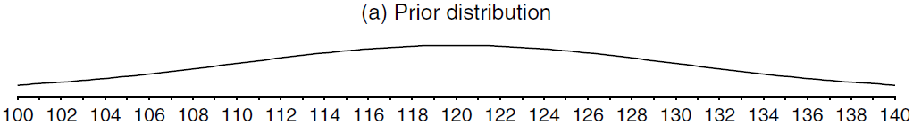
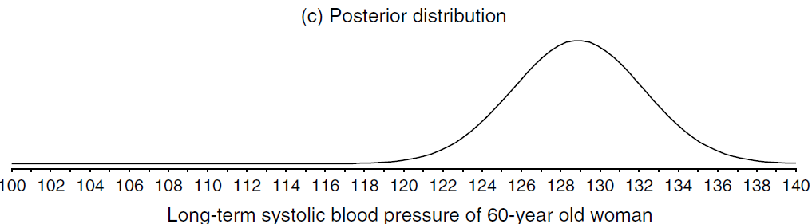
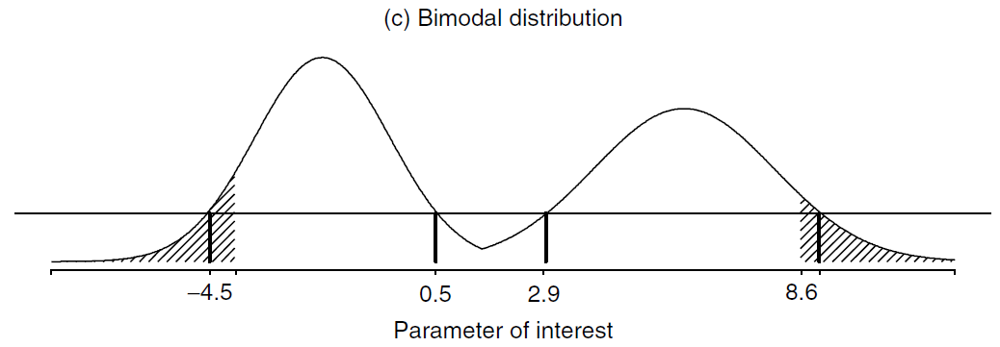
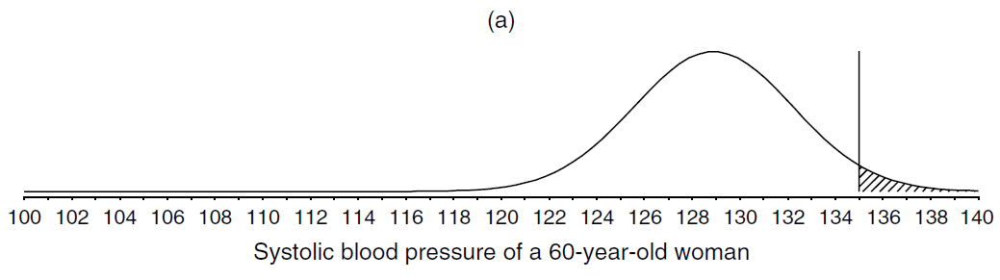

# An Overview of the Bayesian Approach

Book title: [Bayesian Approaches to Clinical Trials and Health-Care Evaluation](http://93.174.95.29/main/791000/1c3cccffb374be94e8940aa087c433c0/%28Statistic%20in%20practice%29%20David%20J.%20Spiegelhalter%2C%20Keith%20R.%20Abrams%2C%20Jonathan%20P.%20Myles%20-%20Bayesian%20Approaches%20to%20Clinical%20Trials%20and%20Health-Care%20Evaluation-Wiley%20%282004%29.pdf)

Author: David J. Spiegelhalter, Keith R. Abrams, Jonathan P. Myles

Series: Statistic in practice

Publisher: Wiley

Year: 2004

[Chapter 3](http://www.medicine.mcgill.ca/epidemiology/hanley/bios602/Bayes/an%20overview%20of%20the%20Bayesian%20approach.pdf)

## 3.1 Subjectivity and Context

+ [The prior distribution](https://en.wikipedia.org/wiki/Prior_probability)
  + in Bayesian statistical inference, the probability distribution that would express one's beliefs about the quantity before some evidence is taken into account
  + the prior probability of a random event or an uncertain proposition: the unconditional probability assigned before any relevant evidence is taken into account
  + the unknown quantity may be a parameter of the model or a latent variable rather than an observable variable
  + methods to create prior
    + determined from past information, such as previous experiments
    + elicited from the purely subjective assessment of an experienced expert
    + (uninformative) created to reflect a balance among outcomes when no information is available
    + chosen according to some principle, such as symmetry or maximizing entropy given constraints
    + (conjugate) chosen a prior from a family simplifies calculation of the posterior distribution

+ [Likelihood function / likelihood](https://en.wikipedia.org/wiki/Likelihood_function)
  + measuring the goodness of fit of a statistical model to a sample of data for given values of the unknown parameters
  + formed from the joint probability of the sample but viewed and used as function of the parameters only
  + describing a hypersurface whose peak represents the combination of model parameter values that maximize the probability of drawing the sample obtained
  + maximum likelihood estimation: a procedure for obtaining the arguments of the maximum of the likelihood function
  + the shape and curvature of the likelihood surface represent information about the stability of the estimates
  + Definition of a parameterized model
    + $x \to f(x | \theta)$: a parameterized family of probability density function (pdf) or probability mass function (discrete distribution), $\theta$ is the parameter
    + the likelihood function

      \[ \theta \to f(x | \theta) \implies \mathcal{L}(\theta | x) = f(x | \theta) \tag{Likelihood} \]

      + $x$: observed outcome of an experiment
    + $f(x | \theta)$:
      + probability density function: a function of $x$ w/ $\theta$ fixed
      + a likelihood function: a function of $\theta$ w/ $x$ fixed
    + an equivalence class of functions
    + likelihood function: $x$ as a constant and imaging $\theta$ to be a varying over the whole range of possible parameter values
  + Definition for continuous distribution:
    + given an observation $x_j$, 
    + $\mathcal{L}(\theta | x \in [x_j, x_j+h])$: the likelihood for the interval $[x_j, x_j + h]$, where $h > 0$ is a constant

      \[\begin{align*}
        \text{argmax}_\theta \, \mathcal{L}(\theta | x \in [x_j, x_j + h]) & = \text{argmax}_\theta \, \frac{1}{h} \mathcal{L}(\theta | x \in [x_j, x_j + h]) \\
        & \downarrow \\
        \text{argmax}_\theta \mathcal{L}(\theta, x_j) &= \text{argmax}_\theta f(x_j | \theta)
      \end{align*}\]

  + a key part of Bayesian inference
  + using likelihoods to generate estimators $\to$ the maximum likelihood estimator

+ Likelihoods
  + statistical inference:
    + learning about the assumed underlying distribution of quantities observed
    + generally carried out by assuming that the probability distributions follow a particular _parametric_ form $p(y | \theta)$
    + the distribution of $Y$ depends on some currently unknown parameter $\theta$
  + Bayesian inference: considered as random variables but the usual convention of capital and lower-case letters is ignore, to no apparent detriment
  + likelihood $p(Y | \theta)$:
    + once data $y$ observed, a function of $\theta \to$ extend to which different values $\theta$ are supported by the data
    + summarizing all the information that the data $y$ able to provide about the parameter $\theta$
  + any function of $\theta$ proportional to $p(y|\theta)$ can be considered as the likelihood
  + likelihood function: the relative plausibility of different values of $\theta$
  + maximum likelihood estimate: with the value of $\theta$ for which the likelihood is a maximum
  + using a range of values which are _best_ supported by the data as an interval estimate for $\theta$
  + a reasonable range defined by values of the likelihood above $\exp(-1.96^2/2) = 14.7\%$ of the maximum value
  + in practice, constructing intervals in such a manner is laborious, and in general approximate likelihood functions by the normal distribution
  + example: Bernoulli
    + $n$ individuals and measured the $i$-th individual responds to treatment, $Y_i = 1$, or not, $Y_i = 0$
    + assume a set of independent Bernoulli trials such that the probability of response is $\theta$
    + joint distribution for all $n$ individuals

      \[\begin{align*}
        p(y_1, \ots, y_n|\theta) &= \prod_{i=1}^n p(y_i|\theta) =  \prod_{i=1}^n \theta^{y_i}(1 - \theta)^{1 - y_i} \tag{Bernoulli}\\
          &= \theta^{y_1+\dots+y_n} (1 - \theta)^{(1-y_1)+\dots+(1-y_n)} = \theta^r (1-\theta)^{n - r} \tag{Bernoulli.indep}
      \end{align*}\]

      + $r = \sum_i y_i$: the number of responders
    + likelihood maximized at $\hat{\theta} = r/n$
    + the maximum likelihood estimate proportional to responders

+ [The posterior distribution](https://www.statisticshowto.datasciencecentral.com/posterior-distribution-probability/)
  + Wikipedia: the probability distribution of an unknown quantity, treated as a random variable, conditional on the evidence obtained from an experiment or survey
  + a way to summarize what we know about uncertain quantities in Bayesian analysis
  + a combination of the prior distribution and the likelihood function
  + summarizing what you know after the data has been observed

    \[ \text{Posterior Distribution} = \text{Prior Distribution} + \text{Likelihood Function (“new evidence”)} \]

  + Posterior probability: the probability that an event will happen after all evidence or background information has been taken into account

+ Terminology
  + likelihood principle: the proposition that, given a statistical model, all the evidence in a sample relevant to model parameters is contained in the likelihood function
  + joint probability distribution
    + joint probability: the probability of two events occurring simultaneously
    + a probability distribution giving the probability that each $X, Y, \dots$ falls in any particular range or discrete set of values specified for that variable
    + the joint probability density function of random variable $X$ and $Y$ is $f_{X, Y}(x, y)$, the marginal probability density function of $X$ and $Y$

      \[ f_X(x) = \int f_{XY} (x, y) dy, \qquad f_Y(y) = \int f_{XY} (x, y) dx \]

  + marginal distribution
    + marginal probability: the probability of an event irrespective of the outcome of another variable
    + the marginal distribution of a subset of a collection iof random variables is the probability distribution of the variables contained in the subset
    + two random variables independent $\iff$ their joint distribution function equal to the product of their marginal distribution functions
    + marginal probability density function: two continuous random variables $X$ and $Y$ w/ $x \in [a, b]$ and $b \in [c, d]$

      \[ f_Y(x) = \int_c^d f(x, y) dy, \qquad f_Y(y) = \int_a^b f(x, y) dx \]

  + frequency interpretation of probability: long-run properties of repeated random events
  + frequentist:
    + standard statistical methods
    + $p(x)$ is the proportion of times $x$ will occur in an infintitely long series of repeated identical situations
  + odds ($O$):
    + the probability ($p$) that the event will occur divided by the probability ($1 - p$) that the event will not occur
    + used to describe the chance of an event occurring

    \[ O = \frac{p}{1 - p} \tag{Odds} \]
  
  + logit: the natural logarithm of the odds

  \[ \text{logit}(p) = \ln(\frac{p}{1 - p}) \tag{Odds.log} \]

  + Bayes theorem

    \[ p(b|a) = \frac{p(a|b)}{p(a)} \times p(b) \tag{Bayes} \]

  + The odds form of Bayes theorem

    \[ \frac{p(b|a)}{p(b|a)} = \frac{p(a|b)}{p(a| \overline{b})} \times \frac{p(b)}{p(\overline{b})} \tag{Bayes.odds} \]

+ beta distribution
  + a flexible abd mathematically convenient class for quantities contained to lie btw 0 and 1
  + form: $Y \sim Beta(a, b)$
  + properties

    \[\begin{align*}
      p(y | a, b) &= \frac{\Gamma (a, b)}{\Gamma (a) \Gamma (b)} y^{a-1} (1-y)^{b-1}, \quad y \in (0, 1) \tag{Beta.prob}\\
      E(Y|a, b) &= \frac{a}{a+b} \tag{Beta.mean}\\
      V(Y|a, b) &= \frac{ab}{(a+b)^2(a+b+1)} \tag{Beta.var}
    \end{align*}\]

    where $\Gamma(a) = (a-1)!$

+ The Bayesian approach
  + resting on an essentially _subjective_ interpretation of probability
  + allowed to express generic _uncertainty_ or _degree of belief_ about any unknown but potentially observable quantity
  + rules of probability
    + Lindley, D. V. (2000) [The philosophy of statistics (with discussion)](https://www.phil.vt.edu/dmayo/personal_website/Lindley_Philosophy_of_Statistics.pdf). The Statistician, 49, 293–337.
    + not assumed as self-evident
    + able to derived from 'deeper' axioms of reasonable behavior of an individual
  + probabilities _for_ events rather than probabilities _of_ events
  + the probability is a reflection of personal uncertainty ranther than necessarily being based on future unknown events illustrated by a gambling game

+ Bayesian statistics
  + Berger, J. and Berry, D. A. (1988) [Statistical analysis and the illusion of objectivity](http://ifmlab.for.unb.ca/people/kershaw/Courses/Research_Methods/Readings/BergerJO1988a.pdf). American Scientist, 76, 159–65.
  + treating subjectivity with respect by placing it in the open and under the control of the consumer of data

## 3.2 Bayes theorem for two hypotheses

+ Prior to posterior analysis
  + hypotheses $H_0$ and $H_1$: mutually exhaustive and exclusive
  + the prior probability for each of two hypotheses: $p(H_0)$ and $p(H_1)$
  + $y$: the result of a test
  + $p(y | H_0)$ and $p(y | H_1)$
    + the probability of observing $y$ under each of the two hypotheses
    + the _likelihoods_
  + posterior probabilities:

    \[ p(H_0 | y) = \frac{p(y | H_0)}{p(y)} \times p(H_0)  \tag{1} \]

  + the overall probability of $y$ occuring: 
  
    \[p(y) = p(y | H_0) p(H_0) + p(y | H_1) p(H_1) \]

  + the odds form of Bayes theorem

    \[\begin{align*}

      \frac{p(H_0 | y)}{p(H_1 | y)} &= \frac{p(y | H_0)}{p(y | H_1)} \times \frac{p(H_0)}{p(H_1)} \tag{2} \\
    \end{align*}\]

    + the prior odds: $p(H_0)/p(H_1)$
    + the posterior odds: $p(H_0 | y) / p(H_1 | y)$
    + the ratio of the likelihood: $p(y | H_0) / p(y | H_1)$

    \[\begin{align*}
      \text{posterior odds} &= \text{likelihood ratio} \times \text{prior odds} \\ \\
      \log(\text{posterior odds}) &= \log(\text{likelihood ratio}) + \log(\text{prior odds})
    \end{align*}\]

    + the weight of evidence: $\log(\text{likelihood ratio})$

+ Example 1 -- Diagnosis: Bayes theorem in diagnostic testing
  + Notations & Assumptions:
    + a new home HIV test
    + $95\%$ sensitivity
    + $98\%$ specificity
    + used in a population w/ an HIV prevalence of $1/1000$
  + Table 1 -- Expected status of 100,000 tested individuals in a population w/ an HIV prevalence of $1/1000$

    |     | HIV- | HIV+ |   |
    |-----|-----:|-----:|--:|
    | Test - | 87,902 | 5 | 97,907 |
    | Test + | 1, 998 | 95 | 2,093 |
    |Total   | 99,900 | 100 | 100,000 |

  + $H_0$: individual truly HIV positive
  + $H_1$: truly HIV negative
  + $y$: the observation tested positive
  + the prior probability of the disease prevalence: $p(H_0) = 0.001$
  + the posterior probability $p(H_0 | y)$: the chance that someone who tests positive is truly HIV positive
  + Analysis
    + $95\%$ sensitivity: $p(y | H_0) = 0.95$
    + $98\%$ specificity: $p(y | H_1) = 0.02$
    + the prior odds: $p(H_0)/p(H_1) = 1/999$
    + the likelihood ratio: $p(y | H_0) / p(y | H_1) = 0.95/0.02 = 95/2$
    + the posterior odds: $p(H_0 | y) / p(H_1 | y) = (95/2) \times (1/999) = 95/1998$
    + the posterior probability: $p(H_0 | y) = 95/(95 + 1998) = 0.045$
  + Bayes theorem (Eq. (1))

    \[\begin{align*}
      p(y ) & = p(y | H_0) p(H_0) | p(y | H_1) p(H_1) = 0.95 \cdot 0.001 + 0.02 \cdot 0.999 = 0.02093 \\
      p(H_o | y) &= 0.95 \cdot 0.001 / 0.02093 = 0.045
    \end{align*}\]

  + Ans: over $95\%$ of those testing positive will not have HIV
  + Bayes theorem for two hypotheses $H_0$ and $H_1$
    + by specifying the prior probability or odds, and likelihood ratio $p(y|H_0)/p(y|H_1)$, the posterior probability or odds can be read off the graphs
    + using the logarithmic scaling, under which Bayes theorem gives a linear relationship (fig.(b))

    

      
    

## 3.3 Comparing simple hypotheses: likelihood ratios and Bayes factors

+ the likelihood principle
  + the likelihoods contains all the rellevant that can be extracted from the data
  + all the information that the data provide about the parameter is contained in the likelihood
  + Berger, J. and Wolpert, R. (1988) [The Likelihood Principle (2nd edition)](https://b-ok.org/dl/505521/68882f), Institute of Mathematical Statistics, Hayward, CA, 1998

+ Bayes factor (BF)
  + measure of the relative likelihood of two hypotheses
  + the 'relative betting odds' btw two hypotheses
  + value in $[0, \infty)$
  + small values being considered as both evidence _against_ $H_0$ and evidence _for_ $H_1$
  + transforming prior to posterior odds
  + Example 1: a positive test of $BF = 47.5$ in favor of being HIV positive ($H_0$)
  + obtained for composite hypotheses that include unknown parameters

+ Table 2 -- Calibration of Bayes factor (likelihood ratio)

  <table style="font-family: arial,helvetica,sans-serif;" table-layout="auto" cellspacing="0" cellpadding="5" border="0" align="center" width=50%>
    <caption style="font-size: 1.5em; margin: 0.2em;"><a href="http://www.medicine.mcgill.ca/epidemiology/hanley/bios602/Bayes/an%20overview%20of%20the%20Bayesian%20approach.pdf">Calibration of Bayes factor (likelihood ratio)</a></caption>
    <thead>
    <tr>
      <th style="text-align: center; background-color: #3d64ff; color: #ffffff; width:20%;">Bayes factor range</th>
      <th style="text-align: center; background-color: #3d64ff; color: #ffffff; width:40%;">Strength of evidence in favour of $H_0$ and against $H_1$</th>
    </tr>
    </thead>
    <tbody>
    <tr style="text-align: center;"> <td> > 100 / < 1/100</td>       <td>Decisive</td> </tr>
    <tr style="text-align: center;"> <td>32 to 100 / 1/32 to 1/100</td>    <td>Very strong</td> </tr>
    <tr style="text-align: center;"> <td>10 to 32 / 1/10 to 1/3.2</td>     <td>Strong</td> </tr>
    <tr style="text-align: center;"> <td>3.2 to 10 1/3.2 to 1/10</td>     <td>Substantial</td> </tr>
    <tr style="text-align: center;"> <td>1 to 3.2 / 1 to 1/3.2</td>      <td>'Not worth more than a bare mention'</td> </tr>
    </tbody>
  </table>

+ Use of Bayes theorem
  + diagnostic testing: an established part of formal clincial reasoning
  + general statistical analysis
    + a parameter $\theta$ is an unknown quantity such as the mean benefit of a treatment on a specified patient
    + the prior distribution $p(\theta)$ needs to be specified
    + concern: a natural extension of the subjective interpretation of probability

## 3.4 Exchangeability and parametric modelling

+ Exchangeability
  + the rules of probability able to be derived from more basic ideas of relational behavior
  + deriving the idea of i.i.d. variables and prior distributions of parameters from the more basic subjective judgement
  + a formal expression of the idea that no systematic reason to distinguish the individual variables $Y_1, \dots, Y_n$ (similar but not identical)
  + exchangeable: the probability of $Y_1, \dots, Y_n$ assigned to any set of potential outcomes, $p(y_1, \dots, y_n)$, unaffected by permutations of the labels attached to the variables
  + example:
    + $Y_1, Y_2, Y_3$: the first 3 tosses of a (possible biased) coin
    + $Y_1 = 0$ indicates a tail and $Y_1 = 1$ indicates a head
    + $p(Y_1 = 1, Y_2 = 0, Y_3 = 1) = p(Y_2 = 1, Y_1 = 0, Y_3 = 1) = p(Y_1 = 1, Y_3 = 0, Y_2 = 1)$: the probability of getting two head and one tail is unaffected by the particular toss on which the tail comes
    + $Y_1, \dots, Y_3$ might not independent

+ Judgement of exchangeability
  + Bernardo, J. M. and Smith, A. F. M. (1994) [Bayesian Theory](http://abelo.zlibcdn.com/dtoken/f1ddfe4ba4a2b3c9eebeb81935e28f80/Bayesian_Theory_by_Jos%C3%A9_M._Bernardo,_Adrian_F._M.__703263_(z-lib.org).pdf). John Wiley & Sons, Ltd, Chichester.
  + a set of binary variables $Y_1, \dots, Y_n$ exchangeable $\implies$ the marginal distribution

    \[ p(y_1, \dots, y_n) = \int \, \prod_{i=1}^{n} p(y_i | \theta) p(\theta) d\theta \tag{3} \]

  + $Y_1, \dots, Y_n$ are i.i.d., each with distribution $p(y_i, \theta)$, the joint distribution (conditional $\theta$) is

    \[ p(y_1, \dots, y_n | \theta) = \prod_{i=1}^n p(y_i | \theta) \]

  + exchangable random quantities can be though of being i.i.d. variables drawn from some common distribution depending on an unknown parameter $\theta$ w/ a prior distribution $p(\theta)$
  + from a subjective judgement about observable quantities, one derives that whole apparatus of i.i.d. variables, conditional independence, parameters and prior distributions

## 3.5 Bayes theorem for general quantities

+ Notations & Assumptions
  + $\theta$: unknown quantity
  + $p(\theta | H)$: the prior distribution of $\theta$; judgement about $\theta$ conditional on a context $H$
  + $y$: some observed evidence

+ Bayesian approach
  + $p(y | \theta)$: the (conditional) probability of $y$ for each possible value of $\theta$
  + $p(\theta | y)$: likelihood; to obtain the new, posterior, probability for different $\theta$, taking account of the evidence $y$
  + applying Bayesian theorem to a general quantity $\theta$

    \[ p(\theta | y) = \frac{p(y | \theta)}{p(y)} \times p(\theta)  \tag{4}\]

    + $p(y)$: a normalizing factor to ensure that $\int p(\theta|y)d\theta = 1$ and value not interested
  + the essence of Bayes theorem only concerns the terms involving $\theta$

    \[ p(\theta | y) \propto p(y | \theta) \times p(\theta) \tag{5} \]

  + the posterior distribution proportional to (i.e. has the same shape as) the product of the likelihood and the prior

## 3.6 Bayesian analysis with binary data

+ Bayesian approach to make inference: combining the likelihood w/ initial evidence or opinion regarding $\theta$, as expressed in a prior distribution $p(\theta)$

### 3.6.1 Binary data with a discrete prior distribution

+ only a limited set of hypotheses concerning the true proportional $\theta$, corresponding to a finite list denoted $\theta_1, \dots, \theta_J$

+ Bernoulli distribution
  + for a single Bernoulli trial w/ outcome 0 or 1, the likelihood for each possible value for $\theta$

    \[ p(y | \theta_j) = \theta_j^y (1 - \theta_j)^{1-y}  \qquad \text{ where } \quad
      p(y | \theta_j) = \begin{cases} \theta_j & \text{ if } y = 1 \\ 1 - \theta_j & \text{ if } y = 0 \end{cases} \tag{6} 
    \]

  + the posterior probabilities for the $\theta_j$

    \[ p(\theta_j | y) \propto \theta_j^y (1 - \theta_j)^{1-y} \times p(\theta_j)  \tag{7} \]

    where the normalizing factor that ensures the posterior probabilities add to 1

    \[ p(y) = \sum_j \theta_j^y (1 - \theta_j)^{1-y} \times p(\theta_j) \]

  + the result w/ $r$ 'successes' out of $n$ trials, the relevant posterior

    \[ p(\theta_j | r) \propto \theta_j^r (1 - \theta_j)^{1-y} \times p(\theta_j) \tag{8} \]

+ Example 2 -- Drug: Binary data and a discrete prior
  + Notations & Assumptions
    + a drug w/ an unknown true response rate $\theta$
    + only one of the values $\theta_1 = 0.2, \theta_2 = 0.4, \theta_3 = 0.6, \text{ or } \theta_4 = 0.8$
    + 'neutral' position: equally likely value for $\theta_j$, i.e. $p(\theta_j) = 0.25$ for $j=1, 2, 3,4$
  + likelihood for one response: $p(y|\theta_j) = \theta_j^y (1 - \theta_j)^{1-y} = \theta_j$
  + Table 3: results after observing a single positive response, $y=1$, for a drug given an initial uniform distribution over four possible response rate $\theta_j$

    <table style="font-family: arial,helvetica,sans-serif;" table-layout="auto" cellspacing="0" cellpadding="5" border="1" align="center" width=80%>
      <caption style="font-size: 1.5em; margin: 0.2em;"><a href="http://www.medicine.mcgill.ca/epidemiology/hanley/bios602/Bayes/an%20overview%20of%20the%20Bayesian%20approach.pdf">Results after observing a single response</a></caption>
      <thead>
      <tr>
        <th style="text-align: center; background-color: #3d64ff; color: #ffffff; width:5%;">$j$</th>
        <th style="text-align: center; background-color: #3d64ff; color: #ffffff; width:5%;">$\theta_j$</th>
        <th style="text-align: center; background-color: #3d64ff; color: #ffffff; width:5%;">Prior  $p(\theta_j)$</th>
        <th style="text-align: center; background-color: #3d64ff; color: #ffffff; width:10%;">Likelihood  $p(y|\theta_j)$</th>
        <th style="text-align: center; background-color: #3d64ff; color: #ffffff; width:10%;">Likelihood x prior  $p(y|\theta_j) p(\theta_j)$</th>
        <th style="text-align: center; background-color: #3d64ff; color: #ffffff; width:10%;">Posterior  $p(\theta_j|y)$</th>
      </tr>
      </thead>
      <tbody>
        <tr style="text-align: center;"> <td>1</td> <td>0.2</td> <td>0.25</td> <td>0.2</td> <td>0.05</td> <td>0.10</td> </tr>
        <tr style="text-align: center;"> <td>2</td> <td>0.4</td> <td>0.25</td> <td>0.4</td> <td>0.10</td> <td>0.20</td> </tr>
        <tr style="text-align: center;"> <td>3</td> <td>0.6</td> <td>0.25</td> <td>0.6</td> <td>0.15</td> <td>0.30</td> </tr>
        <tr style="text-align: center;"> <td>4</td> <td>0.8</td> <td>0.25</td> <td>0.8</td> <td>0.20</td> <td>0.40</td> </tr>
        <tr style="text-align: center;"> <td></td> <td>$\sum_j$</td> <td>1.0</td> <td></td> <td>0.50</td> <td>1.00</td> </tr>
      </tbody>
    </table>

  + Table 4: Results after observing 15 positive responses, $y=15$, for a drug out of 20 cases, given an initial uniform distribution over four possible response rates $\theta_j$

    <table style="font-family: arial,helvetica,sans-serif;" table-layout="auto" cellspacing="0" cellpadding="5" border="1" align="center" width=80%>
      <caption style="font-size: 1.5em; margin: 0.2em;"><a href="http://www.medicine.mcgill.ca/epidemiology/hanley/bios602/Bayes/an%20overview%20of%20the%20Bayesian%20approach.pdf">Results after observing 15 positive responses</a></caption>
      <thead>
      <tr>
        <th style="text-align: center; background-color: #3d64ff; color: #ffffff; width:5%;">$j$</th>
        <th style="text-align: center; background-color: #3d64ff; color: #ffffff; width:5%;">$\theta_j$</th>
        <th style="text-align: center; background-color: #3d64ff; color: #ffffff; width:5%;">Prior  $p(\theta_j)$</th>
        <th style="text-align: center; background-color: #3d64ff; color: #ffffff; width:10%;">Likelihood  $\theta_j^{15}(1-\theta_j)^5$ $(\times 10^{-7})$</th>
        <th style="text-align: center; background-color: #3d64ff; color: #ffffff; width:10%;">Likelihood x prior  $\theta_j^{15}(1-\theta_j)^5p(\theta_j)$ $(\times 10^{-7})$</th>
        <th style="text-align: center; background-color: #3d64ff; color: #ffffff; width:10%;">Posterior  $p(\theta_j|X=1)$</th>
      </tr>
      </thead>
      <tbody>
        <tr style="text-align: center;"> <td>1</td> <td>0.2</td> <td>0.25</td> <td>0.0</td> <td>0.0</td> <td>0.000</td> </tr>
        <tr style="text-align: center;"> <td>2</td> <td>0.4</td> <td>0.25</td> <td>0.8</td> <td>0.2</td> <td>0.005</td> </tr>
        <tr style="text-align: center;"> <td>3</td> <td>0.6</td> <td>0.25</td> <td>48.1</td> <td>12.0</td> <td>0.298</td> </tr>
        <tr style="text-align: center;"> <td>4</td> <td>0.8</td> <td>0.25</td> <td>112.6</td> <td>28.1</td> <td>0.697</td> </tr>
        <tr style="text-align: center;"> <td></td> <td>$\sum_j$</td> <td>1.0</td> <td></td> <td>40.3</td> <td>1.0</td> </tr>
      </tbody>
    </table>

### 3.6.2 Conjugate analysis for binary data

+ Uniform distribution
  + assumption for prior distribution:
    + all possible values of $\theta$ equally likely
    + uniform distribution, $p(\theta) = 1 \, \text{ for } \,0 \leq \theta \leq 1$
  + applying Bayes theorem

    \[ p(\theta | y) \propto \theta^r (1-\theta)^{n-r} \times 1  \tag{9} \]

    + $r$: the number of events
    + $n$: the total number of individuals
  + the functional form of the posterior distribution proportional to a beta distribution: $Beta(r+1, n-r+1)$

+ Beta distribution: $Beta(a, b)$ for prior distribution
  
  \[\begin{align*}
    \text{Prior} &\propto \theta^{a-1} (1 - \theta)^{b-1} \\
    \text{Likelihood} &\propto \theta^r (1 - \theta)^{n-r} \\
    \text{Posterior} &\propto \theta^{a-1}(1 - \theta)^{b-1} \theta^r (1-\theta)^{n-r} \tag{10} \\
      &\propto \theta^{a+r-1}(1-\theta)^{b+n-r-1} = Beta(a+r, b+n-r)
  \end{align*}\]

+ Example 3 -- Drug(continued): Binary data and a continuous prior
  + experience: response rates btw 0.2 and 0.6 w/ expectation around 0.4 $\implies Beta(a, b)$
  + estimate the mean and variance of the prior distribution
    + normal distribution: $m \pm 2s$ including over 95% of the probability; e.g. $m = 0.4, s = 0.1$
    + beta distribution w/ reasonably high $a$ and $b$ as an approximately normal shape
  + a beta distribution to a normal distribution

    \[\begin{align*}
      m &= a/(a+b) \tag{11} \\
      s^2 &= m(1-m)/(a+b+1) \tag{12}
    \end{align*}\]
  
  + $m = 0.4, b = 0.1 \implies a = 9.2, b = 13.8$
  + Figure for prior distribution ($Beta(0, 0)$) to posterior distribution ($Beta(9.2, 13.8)$) w/ likelihood function
    + Fig. (a)
      + representing the prior assumption w/ a 'non-informative' prior $Beta(0, 0)$
      + observing that $a=9.2$ successes in $a+b = 23$ patients
      + only heuristic argument as no agreed 'non-informative' beta prior, w/ $Beta(0,0), Beta(0.5, 0.5), Beta(1, 1)$ all having been suggested
    + observed $r=15$ successes out of 20 trials
    + updated to $Beta(a+15, B+20-5) = Beta(24.2, 18.8)$
    + Fig. (c): posterior distribution w/ mean $24.2/(24.2 + 18.8) = 0.56$

    

      
      
    

## 3.7 Bayesian analysis with normal distributions

+ Normal distribution
  + notations and assumptions
    + considering the likelihood w/ a normal distribution
    + might involve working on somewhat uninituitive scales such as the logarithm of the hazard ratio
  + the prior distribution $p(\theta)$

    \[ p(\theta) = N \left(\theta \left\vert \mu, \frac{\sigma^2}{n_0}\right.\right) \tag{13} \]

    + $\mu$: the prior mean
    + $\sigma$: the standard deviation for the prior and the likelihood
    + $n_0$: 'implicit' sample size that the prior based on
  + advantages of Eq.13 for prior-to-posterior analysis
    + $n_0 \to 0 \implies \sigma^2 \uparrow$ and the distribution becoming 'flatter'
    + the distribution $\to$ uniform over $(-\infty, \infty)$
    + normal prior w/ a very large variance used to represent a 'non-informative' distribution
  + posterior distribution
    + normal prior distribution: $\theta \sim N(\mu, \sigma^2/n_0)$
    + likelihood: $y_m \sim N(\theta, \sigma^2/m)$
    + posterior distribution obeys

      \[\begin{align*}
        p(\theta|y_m) &\propto p(y_m | \theta) p(\theta) \\
         &\propto \exp \left(-\frac{(y_m - \theta)^2 m}{2\sigma^2} \right) \times \exp \left(-\frac{(\theta - \mu)^2 n_o}{2\sigma^2} \right)
      \end{align*}\]

    + the term involving $\theta$ exactly that arising from a posterior distribution

      \[ p(\theta|y_m) = N \left(\theta \left\vert \frac{n_0\mu + my_m}{n_o + m}, \frac{\sigma^2}{n_0 + m}\right.\right) \tag{14}\]

      by matching terms in $p(\theta | y_m)$ w/ $\theta$

      \[ (y_m - \theta)^2 m +(\theta - \mu)^2 n_o = \left(\theta - \frac{n_0 \mu + m y_m}{m+n_0} \right)^2 (n_0 + m) + (y_m - \mu)^2 \left(\frac{1}{m} + \frac{1}{n_0}\right) \]

    + posterior mean $(n_o \mu + m y_m)/(n_o + m)$
      + a weighted average of the prior mean $\mu$ and parameter estimate $y_m$, 
      + $y_m$ weighted by their precisions
      + a compromised btw the two
    + posterior variance (1/precision)
      + based on an implicit sample size equivalent to the sum of the prior 'sample size' $n_0$ and the sample size of the data $m$
      + when combining sources of evidence from the prior and the likelihood, _adding precisions_ to decrease the uncertainty
  + Senn, S. (1997a) Statistical basis of public policy – present remembrance of priors past is not the same as a true prior. British Medical Journal:

    > A bayesian is one who, vaguely expecting a horse and catching a glimpse of a donkey, strongly concludes he has seen a  mule.

  + $n_0 \to 0 \implies$ prior $\sim$ uniform distribution and posterior $\sim$ the same shape of the likelihood

+ General form of normal distribution
  + prior variance: $\sigma^2/n_0$
  + sampling variance: $\sigma^2/m$
  + general notations:
    + prior distribution: $\theta \sim N(\mu, \tau^2)$
    + likelihood: $y_m \sim N(\theta, \sigma_m^2)$
  + posterior distribution

    \[ p(\theta | y_m) = N \left( \theta \left\vert \frac{\frac{\mu}{\tau^2} + \frac{y_m}{\sigma_m^2}}{\frac{1}{\tau^2}+\frac{1}{\sigma_m^2}}, \frac{1}{\frac{1}{\tau^2}+\frac{1}{\sigma_m^2}} \right.\right) \tag{15} \]

+ Example 4 -- SBP: Bayesian analysis for normal data
  + Interest: the long-term systolic blood pressure (SBP) in Hgmm of a particular 60-year-old female
  + Observations: two independent readings 6 weeks apart w/ mean $ = 130$ and $sd = \sigma = 5$
  + Problem: estimate SBP
  + Notations & Assumptions (likelihood):
    + $\theta$: the long-term SBP
    + estimate: standard analysis w/ $y_m = 130$ and $se = \sigma/\sqrt{m} = 5/\sqrt{2} = 3.5$
    + 95% confidence interval: $y_m \pm 1.96 \times \sigma/\sqrt{m} \to (123.1, 136.9)$
  + Survey (prior distribution): the long-term SBP of female aged 60 w/ $\mu = 120, se = 10$
    + additional information about SBPs able to express a prior distribution
    + the population distribution as a prior distribution for the specific individual: $sd = \sigma/\sqrt{n_0} \implies var = \sigma^2/n_0$
    + Estimating the true long-term underlying systolic blood pressure of a 60-year-old woman
  + Estimating the true long-term underlying systolic blood pressure of a 60-year-old woman
    + Fig. 3(a): population distribution as prior distbution w/ standard deviation as $sd = \sigma/\sqrt{n_0} \implies n_0 = (\sigma/10)^2 = 0.25$
    + Fig. 3(b): the likelihood arising from the two observations on the women
    + Fig. 3(c):
      + posterior distribution of $\theta$: normal distribution w/ $\mu = (0.25 \times 120 + 2 \times 130)/(0.25 + 2) = 128.9$ and $se = \sigma / \sqrt{n_0 + m} = 5/\sqrt{2.25} = 3.3 \implies$ a 95% interval of $128.9 \pm 1.96 \times 3.3 = (122.4, 135.4)$
      + the posterior distribution revealing some 'shrinkage' towards the population mean and a small increase in precision from not using the data alone
  + Conclusion:
    + the woman somewhat higher measurements than expected at her age
    + slightly adjust estimate to allow for the possibility that her two measures happened by chance to be on the high side
    + additional measures $\implies$ possibility becomes less plausible and the prior knowledge will be systematically downgraded

    

      
      
    

## 3.8 Point estimation, interval estimation and interval hypotheses

+ __Point estimates__
  + traditional measures of location of distribution: mean, median, and mode
  + given a theoretical justification as a point estimate derived from a posterior distribution, by imposing a particular penalty on error in estimation
  + posterior disteribution: symmetric and unimodal $\implies$ mean, median, and mode all coincide in a single value and no difficulty in making a choice
  + posterior distribution considerably skewed in some circumstances $\implies$ marked difference btw mean and median
  + the median: less sensitive to the tails of the distribution

+ __Interval estimates__
  + credible interval: any interval conaining probability different from a 'Neyman-Pearson' confidence interval
  + types of intervals: assume a continuous parameter $\theta$ w/ range on $(-\infty, \infty)$ and posterior conditional on generic data $y$
    + _one-side intervals_: typical  $x = .90, .95, .99$
      + one-side upper $x \cdot 100\%$ w/ $(\theta_L, \infty)$ where $p(\theta < \theta_L| y) = x$
      + one side lower $x \cdot 100\%$ w/ $(-\infty, \theta_U)$ where $p(\theta > \theta_U | y) = x$
    + _two-sided 'equi-tail-area' intervals_: a two-sided $x \cdot 100\%$ (typical 90%, 95%, 99%) interval w/ equal probability in each tail area w/ $(\theta_L, \theta_U)$ where $p(\theta < \theta_L | y) = x/2$ and $p(\theta > \theta_U | y) = 1.0 - x/2$
    + _Highest Posterior Density (HPD) intervals_
      + typical property: skewed posterior distribution $\implies$ a two-sided interval w/ equal tail areas generally containing some parameter values having lower posterior probability than values outside the interval
      + HPD w/o such property
      + adjusting: the probability ordinates at each end of the interval are identical $\implies$ the narrowest possible interval containing the required possibility
      + posterior distribution w/ more than one mode $\implies$ HPD may be a set of disjoint intervals
  + HPD interval (Fig. 4)
    + preferable but generally difficult to compute
    + normal distributions: using tables or programs giving tail areas
    + more complicated situation: generally simulating value of $\theta$ and one and two-sided intervals constructed using the empirical distribution of simulated values

    

      
      
    

  + traditional confidence intervals vs. Bayesian credible intervals
    1. _interpretation_ - most important
      + a 95% probability that the true $\theta$ lies in a 95% credible interval $\implies$ certainly _not_ the interpretation of a 95% confidence interval
      + a long series of 95% confidence intervals: 95% of events containing the true parameter value
      + the Bayesian interpretation: giving a probability of whether a _particular_ confidence interval contains the true value
      + the direct Bayesian interpretation often wrongly ascribed to confidence interval
    2. _credible interval_
      + generally narrower due to the additional information provided by the prior
      + width of posterior distribution w/ normal distribution: $2 \times 1.96 \times \sigma/\sqrt{n_o + m}$
      + confidence interval of normal distribution: $2 \times 1.96 \times \sigma/\sqrt{m}$
    3. _care required in terminology_:
      + the width of classical confidence intervals: the standard error of the estimator
      + the width of Bayesian credible intervals: dedicated by the posterior standard deviation

+ __Interval hypotheses__
  + a hypothesis of intertest comprises an interval $H_0: \theta_L < \theta < \theta_U$
  + posterior distribution: $p(H_0 | y) = p(\theta_L < \theta < \theta_U | y)$
  + computed w/ standard formulae or simulation methods

+ Example 5 -- SBP (continued): interval estimation
  + hypothesis: the woman w/ a long-term SBP greater than 135 and the provision of 95% intervals
  + likelihood (individual): $m = 2, y_m = 130, sd = \sigma = 5, se = \sigma/\sqrt{m} = 3.5$
  + prior distribution (population): $\mu = 120, se = 10 = \sigma_m/\sqrt{n_0} \implies n_0 = 3.3$
  + posterior distribution: $\mu_p = (\mu \times n_0 + m \times y_m)/(n_0 + m) = 128.9, se = \sigma / \sqrt{n_0 + m} = 3.3$
  + the probability of the hypothesis $H_0: \theta_L < \theta$, $\theta_L = 135$

    \[ p(H_0 | y) = p(\theta > \theta_L | y) = 1 - \Phi\left( \frac{\theta_i - \frac{n_0 \mu + my_m}{n_0+m}}{\sigma / \sqrt{n_0 + m}} \right) \]

    + $\Phi(z) = P(Z \leq z)$: the probability that $Z$ is less than or equal to $z$  
  + Inference from the posterior distribution of the true underlying systolic blood pressure of a 60-year-old woman
    + Fig. 5(a): the probability of the hypothesis
    + Fig. 5(b): a 95% posterior interval comprising the posterior $mean \pm 1.96 \times \sigma/\sqrt{n_0 + m}$

    

      <a href="http://www.medicine.mcgill.ca/epidemiology/hanley/bios602/Bayes/an%20overview%20of%20the%20Bayesian%20approach.pdf" ismap target="_blank">
         135" title="Fig. 5(a) shaded area is the probability 0.033 that theta > 135" height=110>
        
      </a>
    

  + the Bayesian analysis w/ the classical conclusions drawn from the likelihood alone
  + comprising a 95% confidence interval $y_m \pm 1.96 \times \sigma/\sqrt{m}$ and a one-sided $p$-value

    \[ p(Y < y_m | H_0) = \Phi\left( \frac{y_m - \theta_L}{\sigma/\sqrt{m}} \right) \]

  + numerical identical to the tail area of the posterior w/ a uniform prior obtained by setting $n_0 = 0$
  + hypothesis $H_0: \theta > 135$ w/ a traditional one-sided $p$-value = 0.08, while $p$-value = 0.03 for the Bayesian analysis
  + Table 5: Bayesian and traditional intervals and tests of hypothesis $H_0: y > 135$

    <table style="font-family: arial,helvetica,sans-serif;" table-layout="auto" cellspacing="0" cellpadding="5" border="1" align="center" width=80vw>
      <thead>
      <tr>
        <th style="text-align: center; background-color: #3d64ff; color: #ffffff; width:15%;"> </th>
        <th style="text-align: center; background-color: #3d64ff; color: #ffffff; width:10%;">Mean</th>
        <th style="text-align: center; background-color: #3d64ff; color: #ffffff; width:10%;">SE</th>
        <th style="text-align: center; background-color: #3d64ff; color: #ffffff; width:10%;">95% credible interval</th>
        <th style="text-align: center; background-color: #3d64ff; color: #ffffff; width:10%;">$p(H_0|y_m)$</th>
      </tr>
      </thead>
      <tbody>
        <tr style="text-align: center;">  <td>Prior</td> <td>120.0</td> <td>10.0</td> <td>100.4 to 139.6</td> <td>0.067</td></tr>
        <tr style="text-align: center;">  <td>Posterior</td> <td>128.9</td> <td>3.3</td> <td>122.4 to 135.4</td> <td>0.033</td></tr>
      <thead>
      <tr>
        <th style="text-align: center; background-color: #3d64ff; color: #ffffff; width:15%;"> </th>
        <th style="text-align: center; background-color: #3d64ff; color: #ffffff; width:10%;">Estimate</th>
        <th style="text-align: center; background-color: #3d64ff; color: #ffffff; width:10%;">SE</th>
        <th style="text-align: center; background-color: #3d64ff; color: #ffffff; width:10%;">95% CI</th>
        <th style="text-align: center; background-color: #3d64ff; color: #ffffff; width:10%;">$p(Y < y_m | H_0)$</th>
      </tr>
      </thead>
      <tbody>
        <tr style="text-align: center;"> <td>Classical</td> <td>130.0</td> <td>3.5</td> <td>123.1 to 136.9</td> <td>0.078</td></tr>
      </tbody>
    </table>

+ Confidence interval and prior distribution
  + the (rather odd) prior belief that all values of $\theta$ were equally likely $\implies p(\theta)$ constant
  + Eq. (5): the resulting posterior distribution simply proportional to the likelihood
  + Eq. (14): equivalent to assuming $n_0 = 0$ in an analysis w/ normal distribution
  + traditional confidence interval: essentially equivalent to a credible interval based on the likelihood alone
  + Bayesian and classical equivalent results w/ a uniform or 'flat' prior
  + 'it is already common practice in medical statistics to interpret a frequentist confidence interval as if it did represent a Bayesian posterior probability arising from a calculation invoking a prior density that is uniform on the fundamental scale of analysis' -- P. Burton, 'Helping doctors to draw appropriate inferences from the analysis of medical studies'

+ Example 6 -- GREAT (continue): Bayesian analysis of a trial of early thrombolytic therapy
  + the GREAT trial of early treatment for myocardial infarction

    <table style="font-family: arial,helvetica,sans-serif;" table-layout="auto" cellspacing="0" cellpadding="5" border="0" align="center" width=80%>
      <thead>
      <tr> 
        <th style="text-align: center; background-color: #3d64ff; color: #ffffff;"></th>
        <th style="text-align: center; background-color: #3d64ff; color: #ffffff;"></th> 
        <th colspan="2" style="text-align: center; background-color: #3d64ff; color: #ffffff;">Treatment</th>
        <th style="text-align: center; background-color: #3d64ff; color: #ffffff;"></th>
      </tr>
      <tr> 
        <th style="text-align: center; background-color: #3d64ff; color: #ffffff; width: 10%"></th> 
        <th style="text-align: center; background-color: #3d64ff; color: #ffffff; width: 10%"></th>
        <th style="text-align: center; background-color: #3d64ff; color: #ffffff; width: 10%">New</th>
        <th style="text-align: center; background-color: #3d64ff; color: #ffffff; width: 10%">Control</th>
        <th style="text-align: center; background-color: #3d64ff; color: #ffffff; width: 10%"></th> </tr>
      </thead>
      <tbody>
      <tr> <td rowspan="2"style="text-align: center;">Event</td> <td style="text-align: center;">Death</td> <td style="text-align: right;">13</td> <td style="text-align: right;">23</td> <td style="text-align: right;">36</td> </tr>
      <tr> <td style="text-align: center;">No death</td> <td style="text-align: right;">150</td> <td style="text-align: right;">125</td> <td style="text-align: right;">275</td> </tr>
      <tr> <td style="text-align: center;"></td> <td style="text-align: center;"></td> <td style="text-align: right;">163</td> <td style="text-align: right;">148</td> <td style="text-align: right;">311</td> </tr>
      </tbody>
    </table>

  + distribution: $N(2, 30.5)$
  + _Intervention_: thrombolytic therapy after myocardial infarction, given at home by general practitioners
  + _Ami of study_: to compare anistreplase (a new treatment) and placebo (contentional treatment)
  + _Studey design_: randomized controlled trial
  + _Outcome measure_:
    + 30-day mortality rate under each treatment, w/ the benefit of the new treatment measured by the odds ratio (OR)
    + the ratio of the odds of death following the new treatment to the odds of death on the conventional: $OR  < 1$ therefore favours the new treatment
  + _Statistical model_: approximate normal likelihood for the logarithm of the odds ratio
  + _Prospective Bayesian analysis?_: No, it was carried out after the trial reported its results
  + _Prior distribution_:
    + based on the subjective judgement of a senior cardiologist
    + informed by empirical evidence derived from one unpublished and two published trials
    + belief: an expectation of 15-20% reduction in mortality is highly plausible, while the extremes of no benefit and a 40% relative reduction are both unlikely
    + translated to a normal distribution on the $\log(OR)$ scale, w/ a prior mean of $\mu = -0.26$ (OR = 0.78) and symmetric 95% interval of -0.15 to 0.00 (OR 0.60 to 1.00), giving a standard deviation of 0.13
  + _Loss function or demands_: none specified
  + _Evidence from study_: 30-day mortality
    + control: 23/148
    + new treatment: 13/163
    + the estimate $\log(OR)$: $y_m = -0.74$ (OR = 0.48), w/ estimated standard error 0.36, given a 95% classical confidence interval for $\log(OR)$ from 1.45 to -0.03 (OR from 0.24 to 0.97)
    + traditional test statictic is -0.74/0.36 = 2.03 and yjr null hypothesis of no effect is rejected w/ a two-sided $p$-value of $2\Phi(-2.03) = 0.04$
    + the likelihood: reasonable support for values of $\theta$ representing a 40-60% reduction in odds of death (Fig. 6(b))
  + Prior, likelihood and posterior distributions arising from GREAT trial of home thrombolysis. These are all normal on the y ¼ log (OR) scale.

    

      
      
    

  + _Bayesian interpretation_:
    + the posterior distribution, obtained by multiplying the prior and likelihood and then making the total area under the curve equal to one ('certainty') (Fig. 6(c))
    + prior distribution: $sd = \sigma/\sqrt{n_0} = 0.13 \to n_o = 236.7$
    + the prior having around $236.7/30.5 \approx 8$ times of information as the likelihood $\implies$ the strength of subjective judgement
    + posterior distribution:
      + sample size = n_0 + m = 236.7 + 30.5 = 267.2, mean = weighted average $(n_0 \mu + m y_m)/(n_o + m) = -0.31$, standard deviation = $\sigma/\sqrt{n_0 + m} = 0.12$
      + estimated odds ratio $\approx e^{-0.31} = 0.73$ or 27% risk reduction
      + 95% credible interval = (-0.55, -0.07) on the $\log(OR)$ scale w/ corresponding odds ratio = (0.55, 0.93)
      + a 95% probability that true risk reduction = (7%, 42%)
      + the posterior probability that the reduction is at least 50%: $\Phi((-0.69 + 0.13)/.12) = \Phi(-3.11) = 0.001$ 23h34 $\log(OR) = -0.69$
      + the posterior probability that there is nay treatment effect: $p(\theta < 0 |y_m) = \Phi((0+0.31)/0.12) = \Phi(2.54) = 0.995
      + adopting the prior provided by 'expert', 95% certain the newtreatment  is of benefit
      + the evidence in the likelihood pulled back towards the prior distribution - a formal representation of the belief that the result were 'too good to be true"
  + _Sensitivity analysis_:
    + consider an observer who has no prior bias one way or another, but more skeptical about large treatment effects than the current expert: 
      + represented by a normal prior centered on $\log(OR) = 0 (OR = 1)$
      + a 50% reduction in odds of death (OR = 0.5): $\log(OR) = -0.69$ w/ a 95% interval
      + a 100% increase in odds of death (OR = 2.0): $\log(OR) = 0.69$ w/ a 95% interval
      + On a $log(OR)$ scale, the prior w/ a 95% interval: $(-0.69, 0.69)$
      + standard deviation = 0.69/1.96 = 0.35 and $m = 4/0.35^2 = 32.3$, approximately the same weight of evidence as the likelihood
    + prior: providing equivalent evidence to that arising from the imaginary balanced trial, in which around 16 deaths were observed on each arm
    + prior, likelihood and posterior distributions:
      + Fig. 7: A prior distribution that expresses scepticism about large treatment effects would be centred on 0 and have, for example, a 95% interval for OR between 0.5 and 2.0. This is equivalent to a previous study in which 32.3 events occurred, divided equally between the two arms. Adopting this prior and updating it with the GREAT data leads to a posterior distribution as shown, with the shaded area representing a probability of 8% that the treatment is harmful.
      + mean = 0.36, (OR = 0.70), equivalent size = $n_0 + m = 62.8$, and standard deviation of 0.25
      + the probability w/o benefit from the new treatment: $\Phi(-0.36/0.25) = \Phi(-1.42) = 0.08$
    + a reasonably skeptical person may therefore not find the GREAT results convincing that there is a benefit

    

      
    

  
  + _Comments_:
    + "meta-analysis of early thrombolytic therapy and estimated OR = -0.83 (95% interval (0.70, 0.98)), far less impressive than the GREAT results and reasonably in line w/ the posterior distribution in Fig. 6" -- J. Morrison, et.al., 'Mortality and prehospital thrombolysis for acute myocardial infarction – a metaanalysis', 2000
    + not over-interpreted and two points should keep in mind
      + including some trials that contributed tot he prior used by the expert  and good reason why the posterior (interpreted as a type of subjective meta-analysis) and the formal meta-analysis should correspond
      + primary outcome measure is in-hospital mortality, for which GREAT showed a non-significant (but still substantial) benefit of 11/163 vs. 17/148, with an estimated OR of 0.57

## 3.9 The prior distribution 73

## 3.10 How to use Bayes theorem to interpret trial results 74

## 3.11 The ‘credibility’ of significant trial results* 75

## 3.12 Sequential use of Bayes theorem* 79

## 3.13 Predictions 80

### 3.13.1 Predictions in the Bayesian framework 80

### 3.13.2 Predictions for binary data* 81

### 3.13.3 Predictions for normal data 83

## 3.14 Decision-making 85

## 3.15 Design 90

## 3.16 Use of historical data 90

## 3.17 Multiplicity, exchangeability and hierarchical models 91

## 3.18 Dealing with nuisance parameters* 100

### 3.18.1 Alternative methods for eliminating nuisance parameters* 100

### 3.18.2 Profile likelihood in a hierarchical model* 102

## 3.19 Computational issues 102

### 3.19.1 Monte Carlo methods 103

### 3.19.2 Markov chain Monte Carlo methods 105

### 3.19.3 WinBUGS 107

## 3.20 Schools of Bayesians 112

## 3.21 A Bayesian checklist 113

## 3.22 Further reading 115

## 3.23 Key points 116

## Exercises

