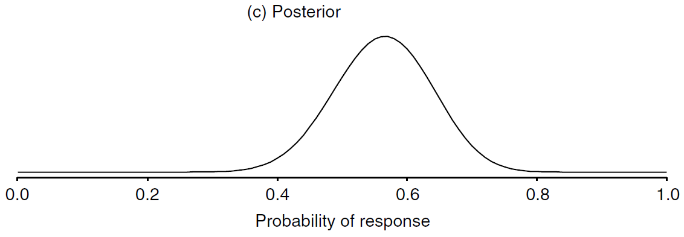

# An Overview of the Bayesian Approach

Book title: [Bayesian Approaches to Clinical Trials and Health-Care Evaluation](http://93.174.95.29/main/791000/1c3cccffb374be94e8940aa087c433c0/%28Statistic%20in%20practice%29%20David%20J.%20Spiegelhalter%2C%20Keith%20R.%20Abrams%2C%20Jonathan%20P.%20Myles%20-%20Bayesian%20Approaches%20to%20Clinical%20Trials%20and%20Health-Care%20Evaluation-Wiley%20%282004%29.pdf)

Author: David J. Spiegelhalter, Keith R. Abrams, Jonathan P. Myles

Series: Statistic in practice

Publisher: Wiley

Year: 2004

[Chapter 3](http://www.medicine.mcgill.ca/epidemiology/hanley/bios602/Bayes/an%20overview%20of%20the%20Bayesian%20approach.pdf)

## 3.1 Subjectivity and Context

+ [The prior distribution](https://en.wikipedia.org/wiki/Prior_probability)
  + in Bayesian statistical inference, the probability distribution that would express one's beliefs about the quantity before some evidence is taken into account
  + the prior probability of a random event or an uncertain proposition: the unconditional probability assigned before any relevant evidence is taken into account
  + the unknown quantity may be a parameter of the model or a latent variable rather than an observable variable
  + methods to create prior
    + determined from past information, such as previous experiments
    + elicited from the purely subjective assessment of an experienced expert
    + (uninformative) created to reflect a balance among outcomes when no information is available
    + chosen according to some principle, such as symmetry or maximizing entropy given constraints
    + (conjugate) chosen a prior from a family simplifies calculation of the posterior distribution

+ [Likelihood function / likelihood](https://en.wikipedia.org/wiki/Likelihood_function)
  + measuring the goodness of fit of a statistical model to a sample of data for given values of the unknown parameters
  + formed from the joint probability of the sample but viewed and used as function of the parameters only
  + describing a hypersurface whose peak represents the combination of model parameter values that maximize the probability of drawing the sample obtained
  + maximum likelihood estimation: a procedure for obtaining the arguments of the maximum of the likelihood function
  + the shape and curvature of the likelihood surface represent information about the stability of the estimates
  + Definition of a parameterized model
    + $x \to f(x | \theta)$: a parameterized family of probability density function (pdf) or probability mass function (discrete distribution), $\theta$ is the parameter
    + the likelihood function

      \[ \theta \to f(x | \theta) \implies \mathcal{L}(\theta | x) = f(x | \theta) \tag{Likelihood} \]

      + $x$: observed outcome of an experiment
    + $f(x | \theta)$:
      + probability density function: a function of $x$ w/ $\theta$ fixed
      + a likelihood function: a function of $\theta$ w/ $x$ fixed
    + an equivalence class of functions
    + likelihood function: $x$ as a constant and imaging $\theta$ to be a varying over the whole range of possible parameter values
  + Definition for continuous distribution:
    + given an observation $x_j$, 
    + $\mathcal{L}(\theta | x \in [x_j, x_j+h])$: the likelihood for the interval $[x_j, x_j + h]$, where $h > 0$ is a constant

      \[\begin{align*}
        \text{argmax}_\theta \, \mathcal{L}(\theta | x \in [x_j, x_j + h]) & = \text{argmax}_\theta \, \frac{1}{h} \mathcal{L}(\theta | x \in [x_j, x_j + h]) \\
        & \downarrow \\
        \text{argmax}_\theta \mathcal{L}(\theta, x_j) &= \text{argmax}_\theta f(x_j | \theta)
      \end{align*}\]

  + a key part of Bayesian inference
  + using likelihoods to generate estimators $\to$ the maximum likelihood estimator

+ [The posterior distribution](https://www.statisticshowto.datasciencecentral.com/posterior-distribution-probability/)
  + Wikipedia: the probability distribution of an unknown quantity, treated as a random variable, conditional on the evidence obtained from an experiment or survey
  + a way to summarize what we know about uncertain quantities in Bayesian analysis
  + a combination of the prior distribution and the likelihood function
  + summarizing what you know after the data has been observed

    \[ \text{Posterior Distribution} = \text{Prior Distribution} + \text{Likelihood Function (“new evidence”)} \]

  + Posterior probability: the probability that an event will happen after all evidence or background information has been taken into account

+ Terminology
  + likelihood principle: the proposition that, given a statistical model, all the evidence in a sample relevant to model parameters is contained in the likelihood function
  + joint probability distribution
    + joint probability: the probability of two events occurring simultaneously
    + a probability distribution giving the probability that each $X, Y, \dots$ falls in any particular range or discrete set of values specified for that variable
    + the joint probability density function of random variable $X$ and $Y$ is $f_{X, Y}(x, y)$, the marginal probability density function of $X$ and $Y$

      \[ f_X(x) = \int f_{XY} (x, y) dy, \qquad f_Y(y) = \int f_{XY} (x, y) dx \]

  + marginal distribution
    + marginal probability: the probability of an event irrespective of the outcome of another variable
    + the marginal distribution of a subset of a collection iof random variables is the probability distribution of the variables contained in the subset
    + two random variables independent $\iff$ their joint distribution function equal to the product of their marginal distribution functions
    + marginal probability density function: two continuous random variables $X$ and $Y$ w/ $x \in [a, b]$ and $b \in [c, d]$

      \[ f_Y(x) = \int_c^d f(x, y) dy, \qquad f_Y(y) = \int_a^b f(x, y) dx \]

  + frequency interpretation of probability: long-run properties of repeated random events
  + frequentist:
    + standard statistical methods
    + $p(x)$ is the proportion of times $x$ will occur in an infintitely long series of repeated identical situations
  + odds ($O$):
    + the probability ($p$) that the event will occur divided by the probability ($1 - p$) that the event will not occur
    + used to describe the chance of an event occurring

    \[ O = \frac{p}{1 - p} \tag{Odds} \]
  
  + logit: the natural logarithm of the odds

  \[ \text{logit}(p) = \ln(\frac{p}{1 - p}) \tag{Odds.log} \]

  + Bayes theorem

    \[ p(b|a) = \frac{p(a|b)}{p(a)} \times p(b) \tag{Bayes} \]

  + The odds form of Bayes theorem

    \[ \frac{p(b|a)}{p(b|a)} = \frac{p(a|b)}{p(a| \overline{b})} \times \frac{p(b)}{p(\overline{b})} \tag{Bayes.odds} \]

+ beta distribution
  + a flexible abd mathematically convenient class for quantities contained to lie btw 0 and 1
  + form: $Y \sim Beta(a, b)$
  + properties

    \[\begin{align*}
      p(y | a, b) &= \frac{\Gamma (a, b)}{\Gamma (a) \Gamma (b)} y^{a-1} (1-y)^{a-1)}, \quad y \in (0, 1) \tag{Beta.prob}\\
      E(Y|a, b) &= \frac{a}{a+b} \tag{Beta.mean}\\
      V(Y|a, b) &= \frac{ab}{(a+b)^2(a+b+1)} \tag{Beta.var}
    \end{align*}\]

    where $\Gamma(a) = (a-1)!$

+ The Bayesian approach
  + resting on an essentially _subjective_ interpretation of probability
  + allowed to express generic _uncertainty_ or _degree of belief_ about any unknown but potentially observable quantity
  + rules of probability
    + Lindley, D. V. (2000) [The philosophy of statistics (with discussion)](https://www.phil.vt.edu/dmayo/personal_website/Lindley_Philosophy_of_Statistics.pdf). The Statistician, 49, 293–337.
    + not assumed as self-evident
    + able to derived from 'deeper' axioms of reasonable behavior of an individual
  + probabilities _for_ events rather than probabilities _of_ events
  + the probability is a reflection of personal uncertainty ranther than necessarily being based on future unknown events illustrated by a gambling game

+ Bayesian statistics
  + Berger, J. and Berry, D. A. (1988) [Statistical analysis and the illusion of objectivity](http://ifmlab.for.unb.ca/people/kershaw/Courses/Research_Methods/Readings/BergerJO1988a.pdf). American Scientist, 76, 159–65.
  + treating subjectivity with respect by placing it in the open and under the control of the consumer of data

## 3.2 Bayes theorem for two hypotheses

+ Prior to posterior analysis
  + hypotheses $H_0$ and $H_1$: mutually exhaustive and exclusive
  + the prior probability for each of two hypotheses: $p(H_0)$ and $p(H_1)$
  + $y$: the result of a test
  + $p(y | H_0)$ and $p(y | H_1)$
    + the probability of observing $y$ under each of the two hypotheses
    + the _likelihoods_
  + posterior probabilities:

    \[ p(H_0 | y) = \frac{p(y | H_0)}{p(y)} \times p(H_0)  \tag{1} \]

  + the overall probability of $y$ occuring: 
  
    \[p(y) = p(y | H_0) p(H_0) + p(y | H_1) p(H_1) \]

  + the odds form of Bayes theorem

    \[\begin{align*}

      \frac{p(H_0 | y)}{p(H_1 | y)} &= \frac{p(y | H_0)}{p(y | H_1)} \times \frac{p(H_0)}{p(H_1)} \tag{2} \\
    \end{align*}\]

    + the prior odds: $p(H_0)/p(H_1)$
    + the posterior odds: $p(H_0 | y) / p(H_1 | y)$
    + the ratio of the likelihood: $p(y | H_0) / p(y | H_1)$

    \[\begin{align*}
      \text{posterior odds} &= \text{likelihood ratio} \times \text{prior odds} \\ \\
      \log(\text{posterior odds}) &= \log(\text{likelihood ratio}) + \log(\text{prior odds})
    \end{align*}\]

    + the weight of evidence: $\log(\text{likelihood ratio})$

+ Example 1 -- Diagnosis: Bayes theorem in diagnostic testing
  + Assumption:
    + a new home HIV test
    + $95\%$ sensitivity
    + $98\%$ specificity
    + used in a population w/ an HIV prevalence of $1/1000$
  + Table 1 -- Expected status of 100,000 tested individuals in a population w/ an HIV prevalence of $1/1000$

    |     | HIV- | HIV+ |   |
    |-----|-----:|-----:|--:|
    | Test - | 87,902 | 5 | 97,907 |
    | Test + | 1, 998 | 95 | 2,093 |
    |Total   | 99,900 | 100 | 100,000 |

  + $H_0$: individual truly HIV positive
  + $H_1$: truly HIV negative
  + $y$: the observation tested positive
  + the prior probability of the disease prevalence: $p(H_0) = 0.001$
  + the posterior probability $p(H_0 | y)$: the chance that someone who tests positive is truly HIV positive
  + Analysis
    + $95\%$ sensitivity: $p(y | H_0) = 0.95$
    + $98\%$ specificity: $p(y | H_1) = 0.02$
    + the prior odds: $p(H_0)/p(H_1) = 1/999$
    + the likelihood ratio: $p(y | H_0) / p(y | H_1) = 0.95/0.02 = 95/2$
    + the posterior odds: $p(H_0 | y) / p(H_1 | y) = (95/2) \times (1/999) = 95/1998$
    + the posterior probability: $p(H_0 | y) = 95/(95 + 1998) = 0.045$
  + Bayes theorem (Eq. (1))

    \[\begin{align*}
      p(y ) & = p(y | H_0) p(H_0) | p(y | H_1) p(H_1) = 0.95 \cdot 0.001 + 0.02 \cdot 0.999 = 0.02093 \\
      p(H_o | y) &= 0.95 \cdot 0.001 / 0.02093 = 0.045
    \end{align*}\]

  + Ans: over $95\%$ of those testing positive will not have HIV
  + Bayes theorem for two hypotheses $H_0$ and $H_1$
    + by specifying the prior probability or odds, and likelihood ratio $p(y|H_0)/p(y|H_1)$, the posterior probability or odds can be read off the graphs
    + using the logarithmic scaling, under which Bayes theorem gives a linear relationship (fig.(b))

    

      
    

## 3.3 Comparing simple hypotheses: likelihood ratios and Bayes factors

+ the likelihood principle
  + the likelihoods contains all the rellevant that can be extracted from the data
  + all the information that the data provide about the parameter is contained in the likelihood
  + Berger, J. and Wolpert, R. (1988) [The Likelihood Principle (2nd edition)](https://b-ok.org/dl/505521/68882f), Institute of Mathematical Statistics, Hayward, CA, 1998

+ Bayes factor (BF)
  + measure of the relative likelihood of two hypotheses
  + the 'relative betting odds' btw two hypotheses
  + value in $[0, \infty)$
  + small values being considered as both evidence _against_ $H_0$ and evidence _for_ $H_1$
  + transforming prior to posterior odds
  + Example 1: a positive test of $BF = 47.5$ in favor of being HIV positive ($H_0$)
  + obtained for composite hypotheses that include unknown parameters

+ Table 2 -- Calibration of Bayes factor (likelihood ratio)

  <table style="font-family: arial,helvetica,sans-serif;" table-layout="auto" cellspacing="0" cellpadding="5" border="0" align="center" width=50%>
    <caption style="font-size: 1.5em; margin: 0.2em;"><a href="http://www.medicine.mcgill.ca/epidemiology/hanley/bios602/Bayes/an%20overview%20of%20the%20Bayesian%20approach.pdf">Calibration of Bayes factor (likelihood ratio)</a></caption>
    <thead>
    <tr>
      <th style="text-align: center; background-color: #3d64ff; color: #ffffff; width:20%;">Bayes factor range</th>
      <th style="text-align: center; background-color: #3d64ff; color: #ffffff; width:40%;">Strength of evidence in favour of $H_0$ and against $H_1$</th>
    </tr>
    </thead>
    <tbody>
    <tr style="text-align: center;"> <td> > 100 / < 1/100</td>       <td>Decisive</td> </tr>
    <tr style="text-align: center;"> <td>32 to 100 / 1/32 to 1/100</td>    <td>Very strong</td> </tr>
    <tr style="text-align: center;"> <td>10 to 32 / 1/10 to 1/3.2</td>     <td>Strong</td> </tr>
    <tr style="text-align: center;"> <td>3.2 to 10 1/3.2 to 1/10</td>     <td>Substantial</td> </tr>
    <tr style="text-align: center;"> <td>1 to 3.2 / 1 to 1/3.2</td>      <td>'Not worth more than a bare mention'</td> </tr>
    </tbody>
  </table>

+ Use of Bayes theorem
  + diagnostic testing: an established part of formal clincial reasoning
  + general statistical analysis
    + a parameter $\theta$ is an unknown quantity such as the mean benefit of a treatment on a specified patient
    + the prior distribution $p(\theta)$ needs to be specified
    + concern: a natural extension of the subjective interpretation of probability

## 3.4 Exchangeability and parametric modelling

+ Exchangeability
  + the rules of probability able to be derived from more basic ideas of relational behavior
  + deriving the idea of i.i.d. variables and prior distributions of parameters from the more basic subjective judgement
  + a formal expression of the idea that no systematic reason to distinguish the individual variables $Y_1, \dots, Y_n$ (similar but not identical)
  + exchangeable: the probability of $Y_1, \dots, Y_n$ assigned to any set of potential outcomes, $p(y_1, \dots, y_n)$, unaffected by permutations of the labels attached to the variables
  + example:
    + $Y_1, Y_2, Y_3$: the first 3 tosses of a (possible biased) coin
    + $Y_1 = 0$ indicates a tail and $Y_1 = 1$ indicates a head
    + $p(Y_1 = 1, Y_2 = 0, Y_3 = 1) = p(Y_2 = 1, Y_1 = 0, Y_3 = 1) = p(Y_1 = 1, Y_3 = 0, Y_2 = 1)$: the probability of getting two head and one tail is unaffected by the particular toss on which the tail comes
    + $Y_1, \dots, Y_3$ might not independent

+ Judgement of exchangeability
  + Bernardo, J. M. and Smith, A. F. M. (1994) [Bayesian Theory](http://abelo.zlibcdn.com/dtoken/f1ddfe4ba4a2b3c9eebeb81935e28f80/Bayesian_Theory_by_Jos%C3%A9_M._Bernardo,_Adrian_F._M.__703263_(z-lib.org).pdf). John Wiley & Sons, Ltd, Chichester.
  + a set of binary variables $Y_1, \dots, Y_n$ exchangeable $\implies$ the marginal distribution

    \[ p(y_1, \dots, y_n) = \int \, \prod_{i=1}^{n} p(y_i | \theta) p(\theta) d\theta \tag{3} \]

  + $Y_1, \dots, Y_n$ are i.i.d., each with distribution $p(y_i, \theta)$, the joint distribution (conditional $\theta$) is

    \[ p(y_1, \dots, y_n | \theta) = \prod_{i=1}^n p(y_i | \theta) \]

  + exchangable random quantities can be though of being i.i.d. variables drawn from some common distribution depending on an unknown parameter $\theta$ w/ a prior distribution $p(\theta)$
  + from a subjective judgement about observable quantities, one derives that whole apparatus of i.i.d. variables, conditional independence, parameters and prior distributions

## 3.5 Bayes theorem for general quantities

+ Assumptions
  + $\theta$: unknown quantity
  + $p(\theta | H)$: the prior distribution of $\theta$; judgement about $\theta$ conditional on a context $H$
  + $y$: some observed evidence

+ Bayesian approach
  + $p(y | \theta)$: the (conditional) probability of $y$ for each possible value of $\theta$
  + $p(\theta | y)$: likelihood; to obtain the new, posterior, probability for different $\theta$, taking account of the evidence $y$
  + applying Bayesian theorem to a general quantity $\theta$

    \[ p(\theta | y) = \frac{p(y | \theta)}{p(y)} \times p(\theta)  \tag{4}\]

    + $p(y)$: a normalizing factor to ensure that $\int p(\theta|y)d\theta = 1$ and value not interested
  + the essence of Bayes theorem only concerns the terms involving $\theta$

    \[ p(\theta | y) \propto p(y | \theta) \times p(\theta) \tag{5} \]

  + the posterior distribution proportional to (i.e. has the same shape as) the product of the likelihood and the prior

## 3.6 Bayesian analysis with binary data

+ Bayesian approach to make inference: combining the likelihood w/ initial evidence or opinion regarding $\theta$, as expressed in a prior distribution $p(\theta)$

### 3.6.1 Binary data with a discrete prior distribution

+ only a limited set of hypotheses concerning the true proportional $\theta$, corresponding to a finite list denoted $\theta_1, \dots, \theta_J$

+ Bernoulli distribution
  + for a single Bernoulli trial w/ outcome 0 or 1, the likelihood for each possible value for $\theta$

    \[ p(y | \theta_j) = \theta_j^y (1 - \theta_j)^{1-y}  \qquad \text{ where } \quad
      p(y | \theta_j) = \begin{cases} \theta_j & \text{ if } y = 1 \\ 1 - \theta_j & \text{ if } y = 0 \end{cases} \tag{6} 
    \]

  + the posterior probabilities for the $\theta_j$

    \[ p(\theta_j | y) \propto \theta_j^y (1 - \theta_j)^{1-y} \times p(\theta_j)  \tag{7} \]

    where the normalizing factor that ensures the posterior probabilities add to 1

    \[ p(y) = \sum_j \theta_j^y (1 - \theta_j)^{1-y} \times p(\theta_j) \]

  + the result w/ $r$ 'successes' out of $n$ trials, the relevant posterior

    \[ p(\theta_j | r) \propto \theta_j^r (1 - \theta_j)^{1-y} \times p(\theta_j) \tag{8} \]

+ Example 2 -- Drug: Binary data and a discrete prior
  + Assumptions
    + a drug w/ an unknown true response rate $\theta$
    + only one of the values $\theta_1 = 0.2, \theta_2 = 0.4, \theta_3 = 0.6, \text{ or } \theta_4 = 0.8$
    + 'neutral' position: equally likely value for $\theta_j$, i.e. $p(\theta_j) = 0.25$ for $j=1, 2, 3,4$
  + likelihood for one response: $p(y|\theta_j) = \theta_j^y (1 - \theta_j)^{1-y} = \theta_j$
  + Table 3: results after observing a single positive response, $y=1$, for a drug given an initial uniform distribution over four possible response rate $\theta_j$

    <table style="font-family: arial,helvetica,sans-serif;" table-layout="auto" cellspacing="0" cellpadding="5" border="1" align="center" width=80%>
      <caption style="font-size: 1.5em; margin: 0.2em;"><a href="http://www.medicine.mcgill.ca/epidemiology/hanley/bios602/Bayes/an%20overview%20of%20the%20Bayesian%20approach.pdf">Results after observing a single response</a></caption>
      <thead>
      <tr>
        <th style="text-align: center; background-color: #3d64ff; color: #ffffff; width:5%;">$j$</th>
        <th style="text-align: center; background-color: #3d64ff; color: #ffffff; width:5%;">$\theta_j$</th>
        <th style="text-align: center; background-color: #3d64ff; color: #ffffff; width:5%;">Prior  $p(\theta_j)$</th>
        <th style="text-align: center; background-color: #3d64ff; color: #ffffff; width:10%;">Likelihood  $p(y|\theta_j)$</th>
        <th style="text-align: center; background-color: #3d64ff; color: #ffffff; width:10%;">Likelihood x prior  $p(y|\theta_j) p(\theta_j)$</th>
        <th style="text-align: center; background-color: #3d64ff; color: #ffffff; width:10%;">Posterior  $p(\theta_j|y)$</th>
      </tr>
      </thead>
      <tbody>
        <tr style="text-align: center;"> <td>1</td> <td>0.2</td> <td>0.25</td> <td>0.2</td> <td>0.05</td> <td>0.10</td> </tr>
        <tr style="text-align: center;"> <td>2</td> <td>0.4</td> <td>0.25</td> <td>0.4</td> <td>0.10</td> <td>0.20</td> </tr>
        <tr style="text-align: center;"> <td>3</td> <td>0.6</td> <td>0.25</td> <td>0.6</td> <td>0.15</td> <td>0.30</td> </tr>
        <tr style="text-align: center;"> <td>4</td> <td>0.8</td> <td>0.25</td> <td>0.8</td> <td>0.20</td> <td>0.40</td> </tr>
        <tr style="text-align: center;"> <td></td> <td>$\sum_j$</td> <td>1.0</td> <td></td> <td>0.50</td> <td>1.00</td> </tr>
      </tbody>
    </table>

  + Table 4: Results after observing 15 positive responses, $y=15$, for a drug out of 20 cases, given an initial uniform distribution over four possible response rates $\theta_j$

    <table style="font-family: arial,helvetica,sans-serif;" table-layout="auto" cellspacing="0" cellpadding="5" border="1" align="center" width=80%>
      <caption style="font-size: 1.5em; margin: 0.2em;"><a href="http://www.medicine.mcgill.ca/epidemiology/hanley/bios602/Bayes/an%20overview%20of%20the%20Bayesian%20approach.pdf">Results after observing 15 positive responses</a></caption>
      <thead>
      <tr>
        <th style="text-align: center; background-color: #3d64ff; color: #ffffff; width:5%;">$j$</th>
        <th style="text-align: center; background-color: #3d64ff; color: #ffffff; width:5%;">$\theta_j$</th>
        <th style="text-align: center; background-color: #3d64ff; color: #ffffff; width:5%;">Prior  $p(\theta_j)$</th>
        <th style="text-align: center; background-color: #3d64ff; color: #ffffff; width:10%;">Likelihood  $\theta_j^{15}(1-\theta_j)^5$ $(\times 10^{-7})$</th>
        <th style="text-align: center; background-color: #3d64ff; color: #ffffff; width:10%;">Likelihood x prior  $\theta_j^{15}(1-\theta_j)^5p(\theta_j)$ $(\times 10^{-7})$</th>
        <th style="text-align: center; background-color: #3d64ff; color: #ffffff; width:10%;">Posterior  $p(\theta_j|X=1)$</th>
      </tr>
      </thead>
      <tbody>
        <tr style="text-align: center;"> <td>1</td> <td>0.2</td> <td>0.25</td> <td>0.0</td> <td>0.0</td> <td>0.000</td> </tr>
        <tr style="text-align: center;"> <td>2</td> <td>0.4</td> <td>0.25</td> <td>0.8</td> <td>0.2</td> <td>0.005</td> </tr>
        <tr style="text-align: center;"> <td>3</td> <td>0.6</td> <td>0.25</td> <td>48.1</td> <td>12.0</td> <td>0.298</td> </tr>
        <tr style="text-align: center;"> <td>4</td> <td>0.8</td> <td>0.25</td> <td>112.6</td> <td>28.1</td> <td>0.697</td> </tr>
        <tr style="text-align: center;"> <td></td> <td>$\sum_j$</td> <td>1.0</td> <td></td> <td>40.3</td> <td>1.0</td> </tr>
      </tbody>
    </table>

### 3.6.2 Conjugate analysis for binary data

+ Uniform distribution
  + assumption for prior distribution:
    + all possible values of $\theta$ equally likely
    + uniform distribution, $p(\theta) = 1 \text{ for } 0 \leq \theta \leq 1$
  + applying Bayes theorem

    \[ p(\theta | y) \propto \theta^r (1-\theta)^{n-r} \times 1  \tag{9} \]

    + $r$: the number of events
    + $n$: the total number of individuals
  + the functional form of the posterior distribution proportional to a beta distribution: $Beta(r+1, n-r+1)$

+ Beta distribution
  + prior distribution: $Beta(a, b)$
  
  \[\begin{align*}
    \text{Prior} &\propto \theta^{a-1} (1 - \theta)^{b-1} \\
    \text{Likelihood} &\propto \theta^r (1 - \theta)^{n-r} \\
    \text{Posterior} &\propto \theta^{a-1}(1 - \theta)^{b-1} \theta^r (1-\theta)^{n-r} \tag{10} \\
      &\propto \theta^{a+r-1}(1-\theta)^{b+n-r-1} = Beta(a+r, b+n-r)
  \end{align*}\]

+ Example 3 -- Drug(continued): Binary data and a continuous prior
  + experience: response rates btw 0.2 and 0.6 w/ expectation around 0.4 $\implies Beta(a, b)$
  + estimate the mean and variance of the prior distribution
    + normal distribution: $m \pm 2s$ including over 95% of the probability; e.g. $m = 0.4, s = 0.1$
    + beta distribution w/ reasonably high $a$ and $b$ as an approximately normal shape
  + a beta distribution to a normal distribution

    \[\begin{align*}
      m &= a/(a+b) \tag{11} \\
      s^2 &= m(1-m)/(a+b+1) \tag{12}
    \end{align*}\]
  
  + $m = 0.4, b = 0.1 \implies a = 9.2, b = 13.8$
  + Figure for prior distribution ($Beta(0, 0)$ to posterior distribution ($Beta(9.2, 13.8)$) w/ likelihood function
    + Fig. (a)
      + representing the prior assumption w/ a 'non-informative' prior $Beta(0, 0)$
      + observeing that $a=9.2$ successes in $a+b = 23$ patients
      + only heuristic argument as no agreed 'non-informative' beta prior, w/ $Beta(0,0), Beta(0.5, 0.5), beta(1, 1)$ all having been suggested
    + observed $r=15$ successes out of 20 trials
    + updated to $Beta(a+15, B+20-5) = Beta(24.2, 18.8)$
    + Fig. (c): posterior distribution w/ mean $24.2/(24.2 + 18.8) == 0.56$

    

      
    

## 3.7 Bayesian analysis with normal distributions 62

## 3.8 Point estimation, interval estimation and interval hypotheses 64

## 3.9 The prior distribution 73

## 3.10 How to use Bayes theorem to interpret trial results 74

## 3.11 The ‘credibility’ of significant trial results* 75

## 3.12 Sequential use of Bayes theorem* 79

## 3.13 Predictions 80

### 3.13.1 Predictions in the Bayesian framework 80

### 3.13.2 Predictions for binary data* 81

### 3.13.3 Predictions for normal data 83

## 3.14 Decision-making 85

## 3.15 Design 90

## 3.16 Use of historical data 90

## 3.17 Multiplicity, exchangeability and hierarchical models 91

## 3.18 Dealing with nuisance parameters* 100

### 3.18.1 Alternative methods for eliminating nuisance parameters* 100

### 3.18.2 Profile likelihood in a hierarchical model* 102

## 3.19 Computational issues 102

### 3.19.1 Monte Carlo methods 103

### 3.19.2 Markov chain Monte Carlo methods 105

### 3.19.3 WinBUGS 107

## 3.20 Schools of Bayesians 112

## 3.21 A Bayesian checklist 113

## 3.22 Further reading 115

## 3.23 Key points 116

## Exercises

