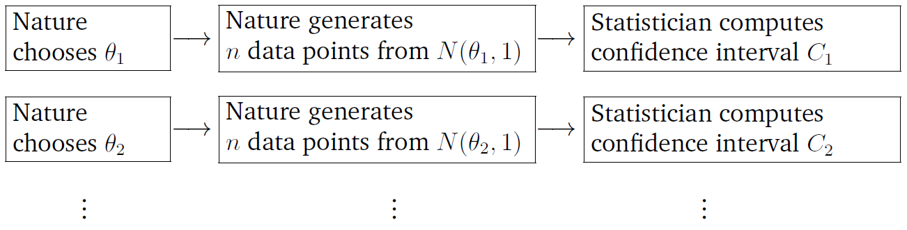
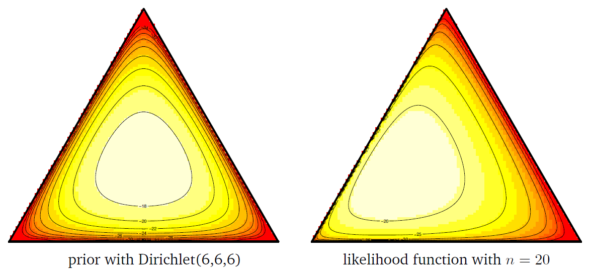
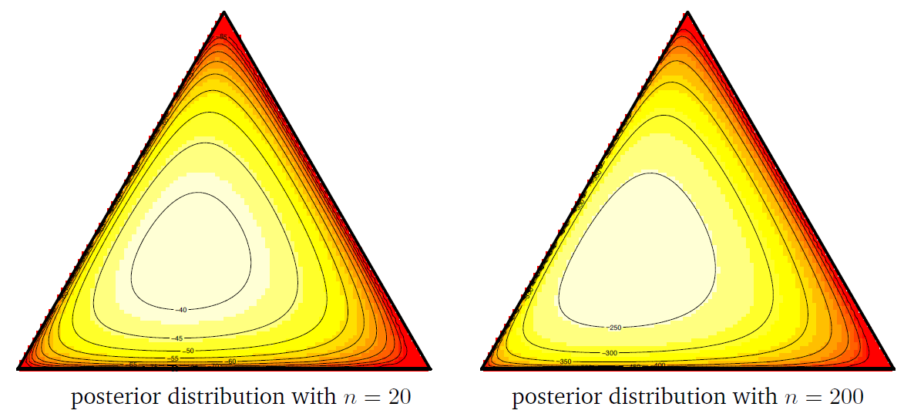

# Chapter 12 Bayesian Inference

Author: H. Liu and L. Wasserman

[Origin](http://www.stat.cmu.edu/~larry/=sml/Bayes.pdf)

Year: 2014

Related Course: [36-708 Statistical Methods for Machine Learning](http://www.stat.cmu.edu/~larry/=sml/)

## 12.0 Mathematical Tools

+ Basic concepts
  + the __mode__ of a set of data values is the value that happen most often.
  + __Definition__ (lower bound and infimum)
    + a _lower bound_ of a subset $S$ of a partially ordered set ($P,\leq$) is an element $a$ of $P \ni a < x \,\forall\, x \in S$
    + a lower bound $a$ of $S$ as an _infimum_ (or _greatest lower bound_, or _meet_) of $S$ if $\forall$ boundss $y$ of $S \in P, y \leq a$ (a is larger than or equal to any other lower bound)
  + __Definition__ (upper bound and supremum)
    + an _upper bound_  $b$ of a subset $S$ of a partially ordered set ($P, \leq$) is an element $b$ of $S \ni b \geq x\.\forall\, x \in S$
    + an upper bound $b$ of $S$ as a _supremum_ (or _least upper bound_, or _join_) of $S$ if $\forall$ upper bounds $z$ of $S \in P, z \geq b$ (b is less than any other upper bound)
  + the arguments of the maxima
    + __Definition__ (the arguments of the maxima)
      + $\exists$ an arbitrary set $X$, a totally ordered set $Y$ and a function $f: X \to Y$
      + the $\mathop{\arg\max}$ over some subset, $S$ of S define as

        \[ \mathop{\arg\max}_{x \in S \subseteq X} f(x) := \{ x \,|\, x \in S \cup \forall\, y \in S: f(y) \leq f(x) \} \]

    + $X = S$ or $S$ is clear from the context $\implies \mathop{\arg\max}_x f(x) := \{ x \,|\, \forall\, y: f(y) \leq f(x) \}$, i.e., $\mathop{\arg\max} is the set of points, $x$, for which $f(x) attains the function's largest value (if exists)
    + $\mathop{\arg\max}$ possibly the empty set, a singleton, or containing multiple elements
    + e.g., $f(x) = 1 - |x| \ni \mathop{\arg\max}_x (1 - |x|) = \{0\$
    + $M$ as the maximum of $f \implies \mathop{\arg\max}$ as the level set of the maximum

      \[ \mathop{\arg\max}_x f(x) = \{ x \,,|\, f(x) = M \} =: f^{-1}(M) \]

  + __Definition__. (argument of the minimum)

    \mathop{\arg\min}_{x \in S} := \{ x \,|\, \forall\, y \in S: f(y) \geq f(x) \}

+ [Beta function](https://www.statlect.com/mathematical-tools/beta-function)
  + __Definition__: The __Beta function__ is a function $B: \mathbb{R}^2_+ \to \mathbb{R}$

    \[ B(x, y) = \frac{\Gamma(x) \Gamma(y)}{\Gamma(x+y)} \]

    where $\Gamma(\;)$ is the Gamma function
  + Integral btw zero and infinity

    \[ B(x, y)  = \int_0^\infty t^{x-1} (1+t)^{-x-y} dt \]

  + Integral btw zero and one

    \[ B(x, y) = \int_0^1 t^{x-1} (1-t)^{y-1} dt \]

  + Incomplete Beta function: replacing upper bound of integration ($t = 1$) w/ a variable ($t = z \leq 1$)

    \[ B(z, x, y) = \int_0^z t^{x-1} (1 - t)^{y-1} dt \]

  + the mean of Beta distribution $Beta(a, b)$: $a / (a+b)$

+ [Dirichlet distribution](https://stephens999.github.io/fiveMinuteStats/dirichlet.html)
  + a generalization of the Beta distribution
    + 2-dim Dirichlet distribution = the Beta distribution
    + let $q = (q_1, q_2)$, and $q \sim \text{Dirichlet}(\alpha_1, \alpha_2) \implies$

      \[ q_1 \sim \text{Beta}(\alpha_1, \alpha_2)\quad\text{and}\quad q_2 = 1 - q_1 \]

  + more generally, the marginals of the Dirichlet distribution are also beta distribution.

    \[ q \sim \text{Dirichlet}(\alpha_1, \dots. \alpha_J) \;\implies\; q_i \sim \text{Beta}(\alpha_j,\; \sum_{i \neq j} \alpha_i) \]

  + the density of the Dirichlet distribution in the most convenient way

    \[ p(q\,|\,\alpha) = \frac{\Gamma(\alpha_1 + \cdots + \alpha_J)}{\Gamma(\alpha_1) \cdots \Gamma(\alpha_J)} \prod_{j=1}^J q_j^{\alpha_j - 1} \qquad (q_j \geq 0; \quad \sum_j q_j = 1) \]

    + performing standard (Lebesgue) integration of this density over the $J$-dim space $(q_q, \dots, q_J)$, the density integrates to 0, not 12 as a density should
    + cause: constraints that the $q$s must sum to 1 $\implies$ the Dirichlet distribution is effectively a $J-1$-dim distribution and not $J$-dim distribution
  + density function satisfying the constraint
    + let the $J$-dim Dirichlet distribution as a distribution on the $J-1$ numbers $(q_1, \dots, q_{J-1})$, satisfying $\sum_{j=1}^{J-1} q_j \leq 1$, and define $q_J := (1 - q_1 - q_2 - \cdots - q_{J-1})$
    + the density of the $J$-dim Dirichlet distribution

      \[ p(q_1, \dots, q_{J-1}\,|\,\alpha) = \frac{\Gamma(\alpha_1 + \cdots + \alpha_J)}{\Gamma(\alpha_1) \cdots \Gamma(\alpha_J)} \prod_{j=1}^{J-1} q_j^{\alpha_j - 1} (1 - q_1 - q_2 - \cdots - q_{J-1})^{\alpha_J} \\ \hspace{15em} \left(q_j \geq 0; \quad \sum_{j=1}^{J-1} q_j \leq 1\right) \]

+ The Dirichlet distribution for $K$ outcomes
  + the exponential family distribution on the $K-1$ dimensional probability simplex
  + the parameters of the model: $\pmb{\alpha} = (\alpha_1, \dots, \alpha_K)^T \in \mathbb{R}_+^K$, a non-negative vector of scaling coefficients
  + probability simplex defined as

    \[ \Delta_k = \left\{\pmb{\theta} = (\theta_1, \dots, \theta_K)^T \in \mathbb{R}^K \,|\, \theta_i \geq 0\; \forall i, \sum_{i=1}^K \theta_i = 1 \right\} \]

  + the probability density of Dirichlet distribution

    \[ \pi_{\pmb{\alpha}}(\pmb{\theta}) = \frac{\Gamma(\sum_{j=1}^K \alpha_j)}{\prod_{j=1}^K \Gamma(\alpha_j)} \prod_{j=1}^K \theta_j^{\alpha_j -1} \]

  + the mean of a Dirichlet distribution $\pi_\alpha (\pmb{\alpha})$

    \[ \mathbb{E}(\pmb{\theta}) = \left( \frac{\alpha_1}{\sum_{i=1}^K \alpha_i}, \dots, \frac{\alpha_K}{\sum_{i=1}^K \alpha_i} \right)^T \]

+ [Regularity conditions](https://stats.stackexchange.com/questions/101520/what-are-the-regularity-conditions-for-likelihood-ratio-test)
  + __Condition 1:__ the pdfs are distinguish = the parameter identifies the pdf, i.e., $\theta \neq \theta' \implies f(x_i, \theta) \neq f(x_i, \theta')$
  + __Condition 2:__ the pdfs are common support for all $\theta \implies$ the support does not depend on $\theta$
  + __Condition 3:__ the point $\theta_0 \in \mathbb{R}$ is an interior point in some set $\Omega$
    + the probability that $\theta$ appears in the endpoints of an interval
    + the likelihood is maximized at the true parameter $\theta_0$ and the MLE $\hat{\theta}$ solving the equation

      \[ \frac{\partial l(\theta)})\partial \theta} = 0 \]

      is consistent.
  + __Condition 4:__ the pdf $f(x, \theta)$ is twice differentiable as a function of $\theta$
  + __Condition 5:__ the integral $\int_{\infty}^{\infty} f(x, \theta) \,dx$ can be differentiated twice under the integral sign as a function $\theta$
    + the last two derive the Fisher information playing a certain role in the theory of convergence of the MLE
    + ensuring the asymptotic normality of the MLE
  + __Condition 5:__ the pdf $f(x, \theta)$ is 3 times differentiable as a function of $\theta$.  Further $\forall\, \theta \in \Omega, \exists \text{ a constant } c \text{ and a function } M(x) \ni$

    \[ \left| \frac{\partial^3 \log f(x, \theta)}{\partial \theta^3} \right| \leq M(x) \]

    w/ $E_{\theta_0}[M(X)] < \infty \; \forall |\theta - \theta_0| < c$ and all $x$ in the support of $X$
    + the remainder of a second order Taylor expansion about $\theta_0$ is bounded in probability and thus poses no problem asymptotically.

+ [Standard Regularity Conditions for Statistics](http://www.stat.rice.edu/~dobelman/courses/Regularity.pdf)

+ Probability, Statistics, and Measure Theory
  + $L^p$ spaces: functional spaces defined using a natural generalization of the $p$-norm for finite-dimensional vector spaces
  + a.k.a., Lebesgue spaces
  + $L^p$ metrics: measures of central tendency and statistical dispersion, such as mean, median, and standard deviation
  + penalized regression:
    + L1 penalty: the $L^1$ norm of a solution's vector of parameter values, i.e., the sum of its absolute values
    + L2 penalty: the $L^2$ norm of a solution's vector of parameter values, i.e., Euclidean length
  + $p$-norm in finite dimensions
    + the length of a vector $x = (x_1, x_2, \dots, x_n)$ in the n-dimensional real-vector space $\mathbb{R}^n$ usually given by the Euclidean norm

      \[ \|x\|_2 = (x_1^2 + x_2^2 + \cdots + x_n^2)^{1/2} \]

    + __Definition__.  for a real number $p \geq 1$, the __p$-norm or $L&p$-norm of $x$ defined as

      \[ \|x\|_p = (|x_1|^p + |x_2|^p + \cdots + |x_n|^p)^{1/p} \]

    + 1-norm: the norm corresponding to the rectilinear distance
    + 2-norm: Euclidean nor
  + __Definition__ (probability space) a probability space is a triple $(\Omega, \mathcal{F}, P)$ consisting of
    + the sample space $\Omega$: an arbitrary non-empty set
    + the $\sigma$-algebra $\mathcal{F} \subseteq 2^{\Omega}$ (also called \sigma$-field): a set of subsets of $\Omega$, called events $\ni$
      + $\mathcal{F}$ containing the sample space: $\Omega \in \mathcal{F}$
      + $\mathcal{F}$ closed under complements: $A \in \mathcal{F} \implies ((\Omega \\ A) \in \mathcal{F}$
      + $\mathcal{F}$ closed under countable unions: $A_i \in \mathcal{F}, \; i=1, 2, \dots \implies (\bigcup_{i=1}^\infty A-i) \in \mathcal{F}$
      + corollary (complement + countable unions + De Morgan's law): \mathcal{F} closed under countable intersections: $A_i \in \mathcal{F}, \, i=1, 2, \dots \implies (\bigcap_{i=1}^\infty A_i) \in \mathcal{F}$
    + the probability measure $P: \mathcal{F} \to [0, 1]$: a function on $\mathcal{F} \ni$
      + $P$ countably additive (also called $\sigma$-additive): $\{A_i\}_{i=1}^\infty \subseteq \mathcal{F}$ as a countable collection of pairwise disjoint sets $\implies p(\bigcup_{i=1}^\infty) = \sum_{i=1}^\infty P(A_i)$
      + the measure of entire sample space equal to one: $P(\Omega) = 1$
  + __Definition__ (measure)
    + $\exists\, \text{a set } X, \Sigma$ a $\sigma$-algebra over $X$
    + a function $\mu$ from $\Sigma$ to the extended real number line is called _measure_ if it satisfies the following properties
      + non-negative: $\forall\, E \in \Sigma, \, \mu(E) \geq 0$
      + null empty set \{\varnothing\} = 0$
      + countable additive (or $\sigma$-additive): for all countable collections $\{E\}_{i=1}^\infty$ of a pairwise disjoint sets in $\Sigma$

        \[ \mu\left( \bigcup_{k=1}^\infty E_k \right) = \sum_{k=1}^\infty \mu(E_k) \]
    + one may require that at least one set $E$ has finite measure
    + the empty set automatically has measure zero because of countable additivity, because

      \[ \mu(E) = \mu(E \cup \varnothing \cup \varnothing \cup \cdots) = \mu(E) + \mu(\varnothing) + \mu(\varnothing) + \cdots \implies \mu(\varnothing) = 0 \]

    + only 2nd & 3rd conditions of the definitions met and $\mu$ taking on at most one of the values $\pm \infty \implies \mu$ as a _signed measure_
    + the pair $(X, \Sigma)$called a _measurable space_ and the member of $\Sigma$ called _measurable sets_
    + $(X, \Sigma_X) \text{ and } (Y, \Sigma_Y)$ are two measurable spaces $\implies f: X \to Y$  called _measurable_ if $\forall \, Y$-measureable set $B \in \Sigma_Y$
    + the inverse image is $X$-measurable, i.e., $f^{(-1)}(B) \in \Sigma_X$
    + a triple $(X, \Sigma, \mu)$ as a _measure space_
    + _probability measure_: a measure w/ total measure one, i.e., $\mu(X) = 1$
    + _probability space_: a measure space w/ a probability measure
  + __Definition__ (outer measure) an _outer measure_ on a set $X$ is a function

    \[ \varphi: 2^{X} \to [0, \infty] \]

    defined on all subsets of $X$ ($2^X$ - power set) that satisfies the following conditions
    + null empty set: $\varphi(\varnothing) = 0$
    + monotonicity: $\exists\, A, B \in $X, A \subseteq B \implies \varphi(A) \leq \varphi(B)$
    + countable subadditivity: $\forall \{A_i\} \subseteq X \ni$

      \[ \varphi\left( \bigcup_{j=1}^\infty A_j \right) \leq \sum_{j=1}^\infty \varphi(A_j) \]

  + __Definition__ ($\varphi$-measurable) $\exists\, E \subset X$ is _$\varphi$-measurable_ (or  Carathéodory-measurable by $\varphi$) $\iff \forall\, A \subset X \ni$

    \[ \varphi(A) = \varphi(A \cup E) + \varphi(A \cup E^C) \]

  + __Definition__ (Lebsegue measure)
    + \exists\, E \subseteq \mathbb{R}$ w/ the length of interval $I = [a, b] (\text{or } I = (a, b))$ given by $l(I) - b - a$
    + $\lambda^*(E)$: the _Lebesgue outer measure_ defined as 

      \[ \lambda^*(E) = \inf \left\{ \sum_{k=1}^\infty l(I_k): (I_k)_{k \in \mathbb{N}} \text{ is a sequence of open intervals w/ } E \subseteq \bigcup_{k=1}^\infty I_k \right\} \]

    + _Lebesgue measure_: on the Lebesgue $\sigma$-algebra, the collection of all sets $E$ satisfying the "Carathéodory criterion", $\forall\, A \subseteq \mathbb{R} \ni$

      \[ \lambda^*(A) = \lambda^*(A \cap E) + \lambda^*(A \cap E^C) \]

    + for any set in the Lebesgue $\sigma$-algebra, its Lebesgue measure is given by its Lebesgue outer measure $\lambda(E) = \lambda^*(E)$

## 12.1 What is Bayesian Inference?

+ Approaches to statistical machine learning
  + _frequentist_ inference
    + probabilities interpreted as long run frequencies
    + goal: to create procedures w/ long run frequency guarantees
  + _Bayesian_ inference
    + probabilities interpreted as subjective degree of belief
    + goal: to state and analyze one's beliefs
  + differences

    <table style="font-family: arial,helvetica,sans-serif; width: 50vw;" table-layout="auto" cellspacing="0" cellpadding="5" border="1" align="center">
      <thead>
      <tr>
        <th style="text-align: left; background-color: #3d64ff; color: #ffffff; width:30%;"> </th>
        <th style="text-align: left; background-color: #3d64ff; color: #ffffff; width:20%;">Frequentist</th>
        <th style="text-align: left; background-color: #3d64ff; color: #ffffff; width:20%;">Bayesian</th>
      </tr>
      </thead>
      <tbody>
      <tr>  <td>Probability is:</td>  <td>limiting relative frequency</td>  <td>degree of belief</td></tr>
      <tr>  <td>Parameter $\theta$ is a:</td>  <td>fixed constant</td>  <td>random variable</td></tr>
      <tr>  <td>Probability statements are about:</td>  <td>procedures</td>  <td>parameters</td></tr>
      <tr>  <td>Frequency guarantees?</td>  <td>yes</td>  <td>no</td></tr>
      </tbody>
    </table>

+ Frequentist approach for interval estimate
  + $\exists\; X_1, \dots, X_n \sim N(\theta, 1)$
  + probability statement about the random interval $C$: confidence interval

    \[ C = \left[\overline{X}_n - \frac{1.96}{\sqrt{n}},\; \overline{X}_n + \frac{1.96}{\sqrt{n}}\right] \quad \implies \quad \mathbb{P}_\theta(\theta \in C) = 0.95 \quad \forall\;  \theta \in \mathbb{R} \]

  + interval: a function of the data $\to$ random
  + parameter $\theta$: fixed, unknown quantity
  + statement: $C$ will trap the true value w/ probability 0.95
  + repeating this experiment many times

    

      
    

  + finding the interval $C_j$ traps the parameters $\theta_j$, 95 percent of time
  + more precisely

    \[ \mathop{\lim\inf}_{n \to \infty} \frac{1}{n} \sum_{i=1}^n I(\theta_i \in C_i) \geq 0.95 \quad \forall\; \theta_1, \theta_2, \dots \tag{1} \]

+ Bayesian approach for interval estimate
  + unknown parameter $\theta \sim$ prior distribution $\pi(\theta)$ representing ones subjective beliefs about $\theta$
  + sampling distribution: observing the data $X_1, \dots, X_n$, the posterior distribution for $\theta$ given the data using Bayes theorem

    \[ \pi(\theta \,|\, X_1, \dots, X_n) \propto \mathcal{L}(\theta) \pi(\theta) \tag{2} \]

  + $\mathcal{L}(\theta)$: the likelihood function
  + finding an interval $C \to$

    \[ \int_C \pi(\theta \,|\, X_1, \dots, X_n) d\theta = 0.95 \]

  + the degree-of-belief probability statement about $\theta$ given the data

    \[ \mathbb{P}(\theta \in C \,|\, X_1, \dots, X_n) = 0.95 \]

  + repeating the experiment many times $\to$ the intervals not trapping the true value 95 percent of the time

+ Summary
  + frequentist inference
    + procedures w/ frequency probability guarantees
    + probability to random interval $C$: a frequentist confidence interval $C$ satisfies

      \[ \inf_{\theta} \mathbb{P}_\theta(\theta \in X) = 1 - \alpha \]

    + $\inf_\theta \mathbb{P}(\theta \in C)$: the coverage of the confidence interval $C$
  + Bayesian inference
    + a method for stating and updating beliefs
    + probability to $\theta$: Bayesian confidence interval $C$ satisfies

      \[ \mathbb{P}(\theta \in C \,|\, X_1, \dots, X_N) = 1 - \alpha \]

+ Favors of Bayesian inference
  + subjective Bayesian: probability strictly as personal degrees of belief
  + objective Bayesian: finding prior distributions that formally express ignorance w/ the hope that the resulting posterior is , in some sense, objective
  + empirical Bayesian: estimating the prior distribution from the data
  + frequentist Bayesian: using Bayesian methods only when the resulting posterior has good frequency behavior

## 12.2 Basic Concepts

+ Notations and Assumptions
  + $X_1, \dots, X_n$: $n$ observations sampled from a probability density $p(x, \theta)$
  + $p(x\,|\,\theta)$:
    + $\theta$ as a random variable
    + representing the conditional probability density of $X$ conditioned on $\theta$
  + $p_\theta (x)$: $theta$ as a deterministic value

### 12.2.1 The Mechanics of Bayesian Inference

+ Bayesian procedure
  + choose the prior distribution
    + a probability density $\pi(\theta)$
    + expressing out beliefs about a parameter $\theta$ before observing any data
  + choose a statistical mode $p(x\,|\,\theta)$ to reflect our beliefs about $x$ given $\theta$
  + observe data $\mathcal{D}_n = \{X_1, \dots, X_n\} \to$ update our beliefs and calculate the posterior distribution $p(\theta\,|\,\mathcal{D}_n)$

+ General Bayesian inference
  + the posterior distribution

    \[ p(\theta \,|\, X_1, \dots, X_n) = \frac{p(X_1, \dots, X_n\,|\, \theta) \pi(\theta)}{p(X_1, \dots, X_n)}  = \frac{\mathcal{L}_n(\theta)\pi(\theta)}{c_n} \propto \mathcal{L}(\theta) \pi(\theta) \tag{3} \]

    + $\mathcal{L}(\theta) = p(X_1, \dots, X_n\,|\, \theta)$: the likelihood function
    + the normalizing constant, a.k.a. the evidence

      \[ c_n = p(X_1, \dots, X_n) = \int p\left(X_1, \dots, X_n \,|\, \theta\right) \pi(\theta) d\theta = \int \mathcal{L}_n(\theta) \pi(\theta) d\theta \]

  + Bayesian point estimate
    + getting a Bayesian mean or mode by summing the center of the posterior $\gets$ typically using the mean or mode of the posterior distribution
    + the posterior mean

      \[ \overline{\theta} = \int \theta\, p(\theta \,|\, \mathcal{D}_n)\, d\theta = \frac{\int \theta\, \mathcal{L}_n(\theta)\, \pi(\theta) d\theta}{\int \mathcal{L}_n(\theta) \pi(\theta) d\theta} \]

  + Bayesian interval estimate
    + $\exists\; \alpha \in (0, 1)$, find $a$ and $b \ni$

      \[ \int_{-\infty}^a p(\theta \,|\, \mathcal{D}_n) d\theta = \int^{\infty}_b p(\theta \,|\, \mathcal{D}_n) d\theta = \alpha/2 \]

    + let $C = (a, b)$,

      \[ \mathbb{P}(\theta \in C \,|\, \mathcal{D}_n) = \int_b^a p(\theta \,|\, \mathcal{D}_n) d\theta = 1 - \alpha \]

    + $C$: viz. a ($1-\alpha$) Bayesian posterior interval or _credible interval_
    + _credible region_: $\theta$ w/ multi-dimensional

+ Uniform-Bernoulli likelihood model
  + sampling distribution: $\exists\; \mathcal{D}_n = \{X_1, \dots, X_n\}, \;\; X_1, \dots, X_n \sim Bernoulli(\theta)$
  + prior distribution: uniform distribution as $\pi(\theta) = 1$
  + $S_n = \sum_{i=1}^n X_i$: the number of success
  + the posterior distribution

    \[\begin{align*} 
      p(\theta\,|\,\mathcal{D}_n) & \propto \pi(\theta) \mathcal{L}_n(\theta) = \theta^{S_n} (1-\theta)^{n - S_n} = \theta^{S_n+1-1} (1-\theta)^{n - S_n +1 -1} \\\\
       &= \frac{\Gamma(n+2)}{\Gamma(S_n + 1) \Gamma(n-S_n+1)} \theta^{(S_n+1)-1} (1-\theta)^{(n-S_n+1)-1} \\\\
       \therefore\;\theta\,|\,\mathcal{D}_n &\sim \text{Beta}(S_n+1, n-S_n +1)
    \end{align*}\]

  + the Bayesian posterior point estimator

    \[ \overline{\theta} = \frac{S_n + 1}{n+2} = \lambda_n \hat{\theta} + (1 - \lambda_n) \tilde{\theta} \]

    + $\hat{\theta} = S_n / n$: the maximum likelihood estimate
    + $\tilde{\theta} = 1/2$: the prior mean
    + $\lambda_n = n/(n+2) \approx 1$
  + the Bayesian posterior credible interval: 95% posterior interval = $\int_a^b p(\theta\,|\,\mathcal{D}_n) d\theta = .95$

+ Beta-Bernoulli likelihood model
  + sampling distribution: $\exists\; \mathcal{D}_n = \{X_1, \dots, X_n\}, \;\; X_1, \dots, X_n \sim \text{Bernoulli}(\theta)$ w/ $\hat{\theta} = S_n/n$
  + the prior distribution: $\theta \sim \text{Beta}(\alpha, \beta)$ w/ prior mean $\theta_0 = \alpha/(\alpha+\beta)$
  + the posterior distribution: $\theta \,|\, \mathcal{D}_n \sim \text{Beta}(\alpha + S_n, \beta + n - S_n)$
  + the flat (uniform) prior: $\alpha = \beta = 1$
  + the posterior mean:

    \[ \overline{\theta} = \frac{\alpha + S_n}{\alpha + \beta + n} = \left(\frac{n}{\alpha+\beta+n}\right) \hat{\theta} + \left(\frac{\alpha+\beta}{\alpha+\beta+n} \right) \theta_0 \]

  + example
    + assumptions:
      + Bernoulli model: $n = 15, \theta = 0.4$
      + number of success: $s = 7$
    + maximum likelihood estimate: $\hat{\theta}(\theta) = 7/15 = 0.47$
    + left plot: prior w/ $Beta(4, 6) \to$ posterior mode = 0.43
    + right plot: prior w/ $Beta(4, 2) \to$ posterior mode = 0.67

    

      
    

+ Dirichlet-Multinomial likelihood Model
  + sampling distribution: $\exists\; \mathcal{D}_n = \{X_1, \dots, X_n\}, \;\; X_1, \dots, X_n \sim \text{Bernoulli}(\theta)$ w/ $\hat{\theta} = S_n/n$
  + prior distribution: Dirichlet prior
    + a multinomial distribution
    + a generalization of the Bernoulli model and Beta prior
    + $\exists\; \mathbf{X} \sim \text{Multinomial}(n, \pmb{\theta})$
    + $\pmb{\theta} = (\theta_1, \dots, \theta_K)^T, \; (K > 1)$: a $K$-dim parameter
  + the sample space of the multinomial w/ $K$ outcomes as the set of vertices of the $K$-dim hypercube $\mathbb{H}_K$, mad up of vectors w/ exactly only one 1 and the remaining elements 0

    \[ x = \underbrace{(0, 0, \dots, 0, 1, 0, \dots, 0)^T}_{K\text{ places}} \]

  + $\exists\; \mathbf{X}_i = (X_{i1}, \dots, X_{iK})^T \in \mathbb{H}_K$,
  
    \[ \underbrace{\theta \sim \text{Dirichlet}(\pmb{\alpha})}_{\text{Prior}} \;\text{ and }\; \underbrace{\mathbf{X}_i \,|\, \theta \sim \text{Multinomial}(\pmb{\theta})}_{\text{likeliehood}} \; \forall\; i=1, 2, \dots, n\]

    $\implies$ the posterior satisfies

    \[ p(\pmb{\theta} \,|\, \mathbf{X}_1, \dots, \mathbf{X}_n) \propto \mathcal{L}_n(\theta)\pi(\theta) \propto \prod_{i=1}^n \prod_{j=1}^K \theta_j^{X_{ij}} \prod_{j=1}^K \theta_j^{\alpha_j - 1} = \prod_{j=1}^K \theta_j^{\sum_{i=1}^n X_{ij}+\alpha_j-1} \]

  + the posterior distribution w/ $\overline{\mathbf{X}} = \sum_{i=1}^n \mathbf{X}_i / n \in \Delta_K$

    \[ \pmb{\theta} \,|\, \mathbf{X}_1, \dots, \mathbf{X}_n \sim \text{Dirichlet}(\alpha+ n \overline{\mathbf{X}})\]

  + the posterior mean

    \[ \mathbb{E}(\theta \,|\, \mathbf{X}_1, \dots, \mathbf{X}_n) = \left(\frac{\alpha_1 + \sum_{i=1}^n X_{i1}}{\sum_{i=1}^K \alpha_i + n}, \dots, \frac{\alpha_K + \sum_{i=1}^n X_{iK}}{\sum_{i=1}^K \alpha_i + n} \right)^T \]

  + the posterior mean viewed as smoothing out the maximum likelihood estimated by allocating some additional probability mass to low frequency observation
  + the parameters $\alpha_1, \dots, \alpha_K$ act as "virtual counts" that don't actually appear in the observed data
  + prior conjugate w.r.t. the mode: the prior as Dirichlet distribution $\to$ the posterior as Dirichlet distribution
  + example
    + prior distribution $\sim \text{Dirichlet}(6, 6, 6)$
    + observed data size: $n = 20 \text{ and } 200$
    + parameter: $\pmb{\theta} = (0.2, 0.3, 0.5)^T$
    + the contours of the prior, likelihood, and posteriors are plotted on a two-dimensional probability simplex (Starting from the bottom left vertex of each triangle, clock-wisely the three vertices correspond to $\theta_1, \theta_2, \theta_3$)
    + number of the observed data
      + small $\to$ the posterior affected by both the prior and the likelihood
      + large $\to$ the posterior mainly dominated by the likelihood

    

      
    

+ Conjugate prior
  + sampling distribution: $\exists\; X \sim N(\theta, \sigma^2),\; \mathcal{D}_n = \{X_1, \dots, X_n\}$ w/ known $\sigma$
  + point estimate: $\theta \in \mathbb{R}$
  + prior: $\theta \sim N(a, b^2)$
  + sample mean: $\overline{X} = \sum_{i=1}^n X_i/n$
  + the posterior for $\theta$

    \[\begin{align*}
      \theta \,|\, \mathcal{D}_n & \sim N(\overline{\theta}, \, \tau^2) \tag{4} \\\\
      \overline{\theta} = w\hat{\theta} + (1 - w)a, \quad \hat{\theta} = \overline{X}, &\quad w = \frac{\frac{1}{se^2}}{\frac{1}{se^2} + \frac{1}{b^2}}, \quad \frac{1}{\tau^2} = \frac{1}{se^2} + \frac{1}{b^2}
    \end{align*}\]

    + $se = \sigma/\sqrt{n}$: the standard error of the maximum likelihood estimate $\hat{\theta}$
    + $n \to \infty \implies w \to 1 \text{ and } \tau/se \to 1$
    + fixed $n, b \to \infty \implies$ flat prior
  + region estimate: find posterior interval = find $C = (c, d) \to \mathbb{P}(\theta \in C \,|\, \mathcal{D}_n) = 0.95$
  + $\exists\; c$ and $d \ni \mathbb{P}(\theta < c \,|\, \mathcal{D}_n) = 0.025$
  + find $ c \ni$

    \[ \mathbb{P}(\theta < c \,|\, \mathcal{D}_n) = \mathbb{P} \left( \frac{\theta - \overline{\theta}}{\tau} < \frac{c - \overline{\theta}}{\tau}\right) = \mathbb{P}\left( Z < \frac{c - \overline{\theta}}{\tau} \right) = 0.025 \]

    where $Z \sim N(0, 1)$: a standard Gaussian random variable

    \[ \mathbb{P}(Z < -1.96) = 0.025 \to \frac{c - \overline{\theta}}{\tau} = -1.96  \implies c = \overline{\theta} - 1.96\tau \]

  + similarly, $d = \overline{\theta} = 1.96 \tau$
  + 95% Bayesian credible interval $\overline{\theta} \pm 1.96 \tau$
  + $n \gg 1 \to \overline{\theta} \approx \hat{\theta}, \; \tau \approx se \implies$ the 95% Bayesian credible interval approximated by $\hat{\theta} \pm 1.96 se$

### 12.2.2 Bayesian Prediction

+ Bayesian predictive distribution
  + $\exists\; \mathcal{D}_n = \{X_1, \dots, X_n\}$
  + task: to predict the distribution of a future data point $X$ conditioned on $\mathcal{D}_n$
  + the predictive distribution

    \[\begin{align*}
      p(x \,|\, \mathcal{D}_n) &= \int p(x, \theta \,|\, \mathcal{D}_n) \,d\theta  = \int p(x \,|\, \theta, \mathcal{D}_n)\, p(\theta \,|\, \mathcal{D}_n) \,d\theta  \\\\
       &= \int p(x \,|\, \theta) \, p(\theta \,|\, \mathcal{D}_N) \,d\theta \hspace{3em} (\text{cond. indep.})
    \end{align*}\]

  + the predictive distribution w/ conditionally independent viewed as a weighted average of the model $p(x \,|\, \theta)$
  + the weights determined by the posterior distribution of $\theta$

### 12.2.3 Inference about Functions of Parameters

+ Bayesian inference about a function
  + $\exists\; \tau = g(\theta)$ a function
  + the posterior CDF for $\tau$ w/ a given $A = \{\theta: g(\theta) \leq t\}$

    \[ H(t \,|\, \mathcal{D}_n) = \mathbb{P}(g(\theta) \leq t \,|\, \mathcal{D}_n) = \int_A p(\theta \,|\, \mathcal{D}_n) \,d\theta \]

  + the posterior density $p(\tau \,|\, \mathcal{D}_n) = H'(\tau \,|\, \mathcal{D}_n)$

+ Uniform-Bernoulli likelihood model w/ logarithm of odds ratio
  + sampling distribution: $X \sim \text{Bernoulli}(\theta)$
  + prior distribution: $\pi(\theta) = 1$
  + posterior distribution: $\theta \,|\, \mathcal{D}_n \sim \text{Beta}(S_n+1, \,n - S_n + 1)\;\;$ w/ $S_n = \sum_{i=1}^n X_i$
  + let $\psi = \log(\theta/(1 - \theta))$, the posterior CDF for $\psi$

    \[\begin{align*}
      H(t \,|\, \mathcal{D}_n) &= \mathbb{P}(\psi \leq t \,|\, \mathcal{D}_n) = \mathbb{P}\left( \log(\frac{\theta}{1 - \theta}) \leq t \,|\, \mathcal{D}_n \right)  \\\\
      &= \int_0^{e^t/(1+e^t)} p(\theta \,|\, \mathcal{D}_n) \,d\theta =\frac{\Gamma(n+2)}{\Gamma(S_n+1)\Gamma(n-S_n+1)} \int_0^{e^t/(1-e^t)} \theta^{S_n} (1-\theta)^{n - S_n} \,d\theta
    \end{align*}\]
  
  + the poster density w/ $\psi \in \mathbb{R}$

    \[ p(\psi \,|\, \mathcal{D}_n) = H'(\psi \,|\, \mathcal{D}_n) = \frac{\Gamma(n+2)}{\Gamma(S_n+1)\Gamma(n-S_n+1)} \left(\frac{w^\psi}{1+e^\psi}\right)^{S_n+1} \left(\frac{1}{1+e^\psi}\right)^{n-S_n+1} \]

### 12.2.4 Multiparameter Problems

+ Extracting inferences about one single parameters
  + sampling distribution: $\mathcal{D}_n = \{X_1, \dots, X_n \}$
  + prior distribution: $\pi(\pmb{\theta}),\; \pmb{\theta} = (\theta_1, \dots, \theta_d)^T$
  + the marginal posterior for $\theta_1$

    \[ p(\pmb{\theta} \,|\, \mathcal{D}_n) = \int \cdots \int p(\theta_1, \dots, \theta_d \,|\, \mathcal{D}_n) \, d\theta_2 \cdots d\theta_d \]

  + probably not feasible to do the integral
  + Solution: simulation by drawing randomly from the posterior

    \[ \pmb{\theta}^1, \dots, \pmb{\theta}^B \sim p(\pmb{\theta} \,|\, \mathcal{D}_n) \]

    + the superscript index: different draw
    + $\pmb{\theta}^j = (\theta_1^j, \dots, \theta_d^j)^T$
  + the first component of each draw: $\theta_1^1, \dots, \theta_1^B$
  + a sample from $p(\theta_1 \,|\, \mathcal{D}_n) \to$ avoided doing any integrals
  + sampling $B$ data from a multivariate distribution $p(\pmb{\theta} \,|\, \mathcal{D}_n) \to$ challenging especially w/ large dimensionality $d$

+ Comparing two binomials
  + control patients = $n_1$, treatment patients = $n_2$
  + sampling distribution
    + $X_1$: the number of survived patients in the control group
    + $X_2$: the number of survived patients in the treatment group
  + Binomial model

    \[ X_1 \sim \text{Binomial}(n_1, \theta_1) \quad\text{ and }\quad X_2 \sim \text{Binomial}(n_2, \theta_2) \]

  + task: estimate $\tau = g(\theta_1, \theta_2) = \theta_2 - \theta_1$
  + $\pi(\theta_1, \theta_2) = 1 \implies$ the posterior

    \[ p(\theta_1, \theta_2 \,|\, X_1, X_2) \propto \theta_1^{X_1} (1-\theta_1)^{n_1 - X_1} \theta_2^{X_2} (1 - \theta_2)^{n_2 - X_2} \]

  + $(\theta_1, \theta_2)$ as rectangle $\implies$ $\theta_1$ and $\theta_2$ independent under the posterior

    \[\begin{align*}
      p(\theta_1, \theta_2 \,|\, X_1, X_2) &= p(\theta_1 \,|\, X_1) p(\theta_2 \,|\, X_2) \hspace{5em} \\\\
      p(\theta_1 \,|\, X_1) \propto \theta_1^{X_1} (1 - \theta_1)^{n_1 - X_1} \quad&\&\quad p(\theta_2 \,|\, X_2) \propto \theta_2^{X_2} (1 - \theta_2)^{n_2 - X_2} \\\\
      \theta_1 \,|\, X_1 \sim \text{Beta}(X_1+1, n_1 - X_1 +1) \quad&\&\quad \theta_2 \,|\, X_2 \sim \text{Beta}(X_2 + 1, n_2 - X_2 + 1)
    \end{align*}\]

  + $\theta_1^1, \dots, \theta_1^B \sim \text{Beta}(X_1 + 1,\, n_1 - X_1 + 1)$ and $\theta_2^1, \dots, \theta_2^B \sim \text{Beta}(X_2 + 1,\, n_2 - X_2 + 1)$ $\implies \tau_b = \theta_2^b - \theta_1^b, \forall\; b=1,\dots,B \to p(\tau \,|\, X_1, X_2)$, a sample form
  

### 12.2.5 Flat Priors, Improper Priors, and "Noninformative" Priors

+ Subjective debate
  + subjectivism: the prior should reflect our subjective opinion about $\theta$ (before data collected)
  + impractical in complicated problems, in particular, many parameters
  + injecting subjective opinion into the analysis contrary to the goal of making scientific inference as objective as possible

+ Noninformative priors
  + candidate noninformative prior: a flat prior \(\pi(\theta) \propto \text{ constant}\)
  + example: Uniform-Bernoulli likelihood model: $\pi(\theta) =1 \to Beta(S_n+1, n-S_n+1)$

+ Improper priors
  + sampling distribution: $X \sim N(\theta, \sigma^2)$ w/ known $\sigma$
  + observed data: $\mathcal{D}_n = \{X_1, \dots, X_n\}$
  + prior distribution: flat prior $\pi(\theta) \propto c, \; c > 0$
    + $\int \pi(\theta) \;d\theta = \infty \to$ not a valid probability density
    + _improper prior_
  + still able to carrying out Bayes' theorem
  + the posterior density

    \[ p(\theta \,|\, \mathcal{D}_n) \propto \mathcal{L}_n(\theta) \pi(\theta) \propto \mathcal{L}_n(\theta) \]

  + $\theta \,|\, \mathcal{D}_n \sim N(\overline{X}, \,\sigma^2/n)$ w/ $\overline{X} = \sum_{i=1}^n X_i/n$
  + the resulting point and interval estimators agree exactly w/ their their frequentist counterparts
  + Summary: improper priors not a problem as long as the resulting posterior as a well-defined probability distribution

+ Flat priors not invariant
  + sampling distribution: $X \sim \text{Bernoulli}(\theta)$
  + flat prior $\pi(\theta) = 1 \implies$ lack of information about $\theta$ before the experiment
  + $\psi = \log(\theta/1-\theta)$: a transformation of $\theta$
  + the resulting distribution for $\psi$, not flat

    \[ p(\psi) = \frac{e^{\psi}}{(1+e^\psi)^2} \]
  
  + ignorant about $\theta$ and $\psi \implies$ a flat prior for $\psi$
  + contradiction
    + the notation of a flat prior not well define
    + a flat prior on a parameter $\nRightarrow$ a flat prior on a transformed version of this parameter
  + flat priors not transformed _invariant_

+ Jefferys' prior
  + transformation invariant priors
  + Harold Jefferys' rule
    + taking the prior distribution on parameter space proportional to the square root of the determinant of the Fisher infromation
    + the Fisher infromation

      \[ \pi(\theta) \propto \sqrt{|I(\theta)|}, \quad I(\theta) = -\mathbb{E} \left[ \left.\frac{\partial^2 \log p(X \,|\, \theta)}{\partial\theta\, \partial \theta^T} \,\right|\, \theta \right] \]

  + __Theorem:__ The Jefferys' prior is transformed invariant.
  + _Proof._
    + likelihood function: $p(x \,|\, \theta)$
    + $\psi$: transformation of $\theta$
    + shown that $\pi(\psi) \propto \sqrt{|I(\psi)|}$
    + using the change of variable theorem and the fact that the product of determinants is the determinant of matrix product. $\tag*{$\Box$}$

  + Bernoulli ($\theta$) model
    + the Fisher information

      \[ I(\theta) = \frac{1}{\theta(1 - \theta)} \]

    + Jefferys' rule using the prior

      \[ \pi(\theta) \propto \sqrt{|I(\theta)|} = \theta^{-1/2} (1-\theta)^{-1/2} \implies \pi(\theta) \sim \text{Beta}(1/2, 1/2)\]

    + $\pi(\theta)$ closed to a uniform density
  + Jeffers' prior: transformation invariant $\neq$  non-informative

### 12.2.6 Conjugate Priors

+ Definition of conjugate priors
  + a prior distribution closed under sampling distribution
  + $\mathcal{P}$: a family of prior distribution
  + __Definition__. $\forall\; \theta, \, \exists\; p(\cdot \,|\, \theta) \in \mathcal{F}$ over a sample space $\mathcal{X}$. The posterior

    \[ p(\theta \,|\, \mathbf{x}) = \frac{p(\mathbf{x} \,|\, \theta)\; \pi(\theta)}{\int p(\mathbf{x} \,|\, \theta)\; \pi(\theta) \;d\theta} \]

    satisfies $p(\cdot \,|\,\mathbf{x}) \in \mathcal{P} \implies$ the family $\mathcal{P}$ is _conjugate_ to the family of sampling distribution $\mathcal{F}$
  + the family $\mathcal{P}$ should be sufficiently restricted, and is typically taken to be a specific parametric family.

+ General exponential family models
  + $p(\cdot \,|\, \theta)$: a standard exponential family model
  + the density w.r.t. a positive measure $\mu$

    \[ p(\mathbf{x} \,|\, \pmb{\theta}) = \exp\left(\pmb{\theta}^T\,\mathbf{x} - A(\pmb{\theta})\right) \tag{5} \]

    + $\pmb{\theta} \in \mathbb{R}^d$: a $d$-dimensional parameter
    + $\Theta \subset \mathbb{R}^d$: an open parameter space $\ni$

      \[ \int \exp\left(\pmb{\theta}^T\,\mathbf{x} - A(\pmb{\theta})\right)\,d\mu(\mathbf{x}) < \infty \]

    + $A(\pmb{\theta})$: the moment generation or log-normalizing constant

      \[A(\pmb{\theta}) = \log\left(\int \exp(\pmb{\theta} \mathbf{x} - A(\pmb{\theta}))\, d\mu(\mathbf{x}) \right)\]

  + the density of a conjugate prior for the exponential family

    \[\pi_{\mathbf{x}_0,n_0}(\theta) = \frac{\exp(n_0 \mathbf{x}_0^T \pmb{\theta} - n_0A(\pmb{\theta}))}{\int \exp(n_0 \mathbf{x}_0^T \pmb{\theta} - n_0A(\pmb{\theta}))\,d\pmb{\theta}} \]

    + $\mathbf{x}_0 \in \mathbb{R}^d$: a vector
    + $n_0 \in \mathbb{R}$: a scalar
  + the posterior

    \[\begin{align*}
      p(\mathbf{x} \,|\, \pmb{\theta}) \pi_{\mathbf{x}_0,n_0}(\pmb{\theta}) &= \exp(\pmb{\theta}^T \mathbf{x} - A(\pmb{\theta}))  \exp\left(n_0\mathbf{x}_0^T\pmb{\theta} - n_0 \,A(\pmb{\theta})\right) \\\\
      &= \exp\left((\mathbf{x} + \mathbf{x}_0)^T\pmb{\theta} - (1+n_0)A(\pmb{\theta})\right) \\\\
      &= \exp\left( (1+n_0) \left( \frac{\mathbf{x}}{1+n_0} + \frac{n_0\mathbf{x}_0}{1+n_0} \right)^T \pmb{\theta} - (1+n_0)A(\pmb{\theta}) \right) \\\\
      &\propto \pi_{\frac{\mathbf{x}}{1+n_0}+\frac{n_0\mathbf{x}_0}{1+n_0}, 1+n_0}(\pmb{\theta})
    \end{align*}\]
  
  + the prior incorporating $n_0$ "virtual" observations of $\mathbf{x}_0 \in \mathbb{R}^d$
  + after making one "real" observation x: the parameters of the posterior as a mixture of the virtual and actual observation

    \[ n_0^\prime = 1 + n_0 \quad \text{ and } \quad \mathbf{x}_0^\prime = \frac{\mathbf{x}}{1 + n_0} + \frac{n_0 \mathbf{x}}{1 + n_0} \]

+ Generalized exponential family model
  + $n$ observations $\mathbf{X}_1, \dots, \mathbf{X}_n \implies$ the posterior

    \[\begin{align*}
      p(\pmb{\theta} \,|\, \mathbf{X}_1, \dots, \mathbf{X}_n) &= \pi_{\frac{\mathbf{n \hat{\pmb{x}}}}{n+n_0} + \frac{n_0\mathbf{x}_0}{n+n_0}, n+n_0}(\pmb{\theta}) \\\\
      &\propto \exp \left( (n + n_0) \left( \frac{n\overline{\mathbf{X}}}{n + n_0} + \frac{n_0\mathbf{x}_0}{n+n_0} \right)^T \pmb{\theta} - (n + n_0)A(\pmb{\theta}) \right) \\ 
      &\hspace{15em} \text{where }\left(\overline{\mathbf{X}} = \sum_{i=1}^n \mathbf{X}_i/n \right)
    \end{align*}\]

  + the parameters of the posterior

    \[ n_0^\prime = n + n_0 \quad \text{ and } \quad \mathbf{x}_0^\prime = \frac{n \overline{\mathbf{X}}}{n+n_0} + \frac{n_0\mathbf{x}_0}{n+n_0} \]

  + define $\pi_{\mathbf{x}_0, n_0}$ as

    \[\begin{align*}
      \pi_{\mathbf{x}_0, n_0} &= \exp\left(n_0 \mathbf{x}_0^T \pmb{\theta}  -n_0 A(\pmb{\theta})\right) \\\\
      \nabla \pi_{\mathbf{x}_0, n_0}(\pmb{\theta}) &= n_0(\mathbf{x}_0 - \nabla A(\pmb{\theta})) \pi_{\mathbf{x}_0, n_0}(\pmb{\theta})
    \end{align*}\]

  + the expectation w.r.t. $\pi_{\mathbf{x}_0, n_0}$

    \[\begin{align*}
      \mathbb{E}[\nabla A(\pmb{\theta})] = \int \nabla A(\pmb{\theta}) \pi_{\mathbf{x}_0, n_0}(\pmb{\theta})\,d\pmb{\theta} &= \mathbf{x}_0 - \frac{1}{n_0} \int \nabla \pi_{\mathbf{x}_0, n_0} (\pmb{\theta})\,d\pmb{\theta} = \mathbf{x}_0 \\\\
      \text{with } \int\nabla \pi_{\mathbf{x}_0, n_0}(\pmb{\theta})\,d\pmb{\theta} &= \nabla \left( \int \pi_{\mathbf{x}_0, n_0}(\pmb{\theta})\,d\pmb{\theta} \right) = 0
    \end{align*}\]

  + more generally,

    \[ \mathbb{E}[\nabla A(\pmb{\theta}) \,|\, \mathbf{X}_1, \dots, \mathbf{X}_n] = \frac{n\overline{\mathbf{X}}}{n_0+n} + \frac{n_0 \mathbf{x}_0}{n_0+n} \]

  + under appropriate regularity conditions, the converse also holds, so that linearity of $\nabla A(\pmb{\theta}) \,|\, \mathbf{X}_1, \dots, \mathbf{X}_n$ is sufficient for conjugacy

+ __Theorem__
  + open space $\Theta \subset \mathbb{R}^d$
  + $\mathbf{X}$: a sample of size one from the exponential family $p(\cdot \,|\, \pmb{\theta})$
  + the support of $\mu$ containing an open interval
  + $\pi(\pmb{\theta})$: a prior density not concentrated at a single point
  + the posterior mean of $\nabla A(\pmb{\theta})$ given a single observation $\mathbf{X}$ is linear

    \[ \mathbb{E}[\nabla A(\theta) \,|\, X] = a\mathbf{X} + \mathbf{b} \quad\iff\quad \pi(\pmb{\theta}) \propto \exp\left( \frac{1}{a} \mathbf{b}^T \pmb{\theta} - \frac{1 -a}{a} A(\pmb{\theta}) \right)  \]

  + similar result holds w/ discrete measure $\mu$

+ Gamma-Poisson likelihood model
  + Poisson model w/ rate $\lambda \geq 0$ in the sample space $\mathcal{X} = \mathbb{Z}_+ \ni$

    \[ \mathbb{P}(X = x \,|\, \lambda) = \frac{\lambda^x}{x!} e^{-\lambda} \propto \exp(x\log\lambda - \lambda) \]

  + the natural parameter: $\theta = \log\lambda$
  + the conjugate prior

    \[ \pi_{x_0, n_0}(\lambda) \propto \exp(n_0x_0\log \lambda - n_0\lambda) \]
  
  + a better parameterization of the prior as the $\text{Gamma}(\alpha, \beta)$

    \[ \pi_{\alpha, \beta}(\lambda) \propto \lambda^{\alpha-1} (1-\lambda)^{-\beta\lambda} \]

  + sampling distribution: $\exists\; X_1, \dots, X_n$ observations from $\text{Poisson}(\lambda)$
  + the posterior

    \[ \lambda \,|\, X_1, \dots, X_n \sim \text{Gamma}(\alpha + n\overline{\mathbf{X}},\, \beta+n) \]

  + the prior acts as if $\beta$ virtual observations were made, with a total count of $\alpha -1$ among them

+ Gamma-Exponential likelihood model
  + exponential distribution w/ the sample space $\mathcal{X} \in \mathbb{R}_+ \ni$

    \[ p(x \,|\, \theta) = \theta e^{-x\theta} \]
  
  + exponential model widely used for survival times or waiting times btw events
  + the conjugate prior: Gamma distribution in the most convenient parameterization

    \[ \pi_{\alpha, \beta} \propto \theta^{\alpha - 1} e^{-\beta\theta} \]

  + sampling distribution: $\exists\; X_1, \dots, X_n$ observed data from $\text{Exponential}(\theta)$
  + the posterior

    \[ \theta \,|\, X_1, \dots, X_n \sim \text{Gamma}(\alpha + n,\, \beta + n\overline{X}) \]

  + the prior acts if $\alpha -1$ virtual example are used, w/ a total waiting time of $\beta$

+ Gamma-Geometric likelihood model
  + the geometric distribution
    + the discrete analogue of the exponential model
    + sample space $\mathcal{X} = \mathbb{Z}_{++}$, the strictly positive integers
    + the density
  
    \[ \mathbb{P}(X = x \,|\, \theta) = (1-\theta)^{x-1} \theta \]

  + the conjugate prior: $\text{Gamma}(\alpha, \beta)$
  + sampling distribution: $\exists\; X_1, \dots, X_n$ observed data from $\text{Geometric}(\theta)$
  + the posterior

    \[ \theta \,|\, X_1, \dots, X_n \sim \text{Gamma}(\alpha + n, \,\beta + n\overline{X}) \]

+ InvGamma-Gaussian likelihood model
  + sampling distribution: $N(\mu, \sigma^2)$
  + the likelihood function

    \[\begin{align*}
      p(X_1, \dots, X_n \,|\, \sigma^2) &\propto (\sigma^2)^{-n/2} \exp\left( -\frac{1}{2\sigma^2} \sum_{i=1}^n (X_i - \mu^2) \right) \\\\
        &= (\sigma^2)^{-n/2} \exp\left( -\frac{1}{2\sigma^2} n\, \overline{(X - \mu)^2} \right) \\
        & \hspace{10em} \text{with }\left(\overline{(X-\mu)^2} = \frac{1}{n} \sum_{i=1}^n (X_i - \mu)^2 \right)
    \end{align*}\]

  + the conjugate prior
    + inverse Gamma distribution: $1/\theta \sim \text{Gamma}(\alpha, \beta)$
    + the density

      \[ \pi_{\alpha, \beta}(\theta) \propto \theta^{-(\alpha+1)} e^{-\beta/\theta} \]

  + the posterior distribution of $\sigma^2$

    \[ \sigma^2 \,|\, X_1, \dots, X_n \propto \text{InvGamma}\left(\alpha + \frac{n}{2},\, \beta + \frac{n}{2}\, \overline{X - \mu)^2}\,\right) \]

+ ScaledInv-$\chi^2$-Gaussian likelihood model
  + the prior: scaled inverse $\chi^2$ distribution of $\sigma^2\nu_0Z\;$ w/ $Z \sim \chi_{\nu_0}^2$

    \[ \pi_{\nu_0, \sigma_0^2}(\theta) \propto \theta^{-(1+\nu_0/2)} \exp\left( -\frac{\nu_0 \sigma^2_0}{2\theta} \right) \]

  + the posterior

    \[ \sigma^2 \,|\, X_1, \dots, X_n \sim \text{ScaledInv-}\chi^2 \left( \nu_0 +n, \,\frac{\nu_0 \sigma_0^2}{\nu_0 + n} + \frac{n\, \overline{(X - \mu)^2}}{\nu_0 + n} \right) \]

+ InvWhishart-Gaussian likelihood Model
  + The Wishart distribution
    + a multidiemsional analogue of the Gamma distribution
    + a distribution over symmetric positive semi-definite $d \times d$ matrices $\mathbf{W}$
    + the density

      \[ \pi_{\nu_0, \mathbf{S}_0}(\mathbf{W}) \propto |\mathbf{W}|^{(\nu_0 + d + 1)/2} \exp\left( -\frac{1}{2} \text{tr}(\mathbf{S}_0^{-1} \mathbf{W}) \right) \]

      + $\nu_0$: the degrees of freedom
      + $\mathbf{S}_0$: the positive-definite matrix
  + $\mathbf{W}^{-1} \sim \text{Wishart}(\nu_0, \mathbf{S}_0) \implies \mathbf{W} \sim$ inverse Wishart distribution
  + the density of the inverse Wishart distribution

    \[ \pi_{\nu_0, \mathbf{S}_0}(\mathbf{W}) \propto |\mathbf{W}|^{-(\nu_0+d+1)/2} \exp \left( -\frac{1}{2} \text{tr}(\mathbf{S}_0 \mathbf{W}^{-1}) \right) \]

  + sampling distribution: $\exists\; X_1, \dots, X_n$ observed data from $N(\mathbf{0}, \pmb{\Sigma}), \;\pmb{\Sigma} \in \mathbb{R}^{n\times n}$ as covariance (positive semi-defined matrix)
  + the posterior: an inverse Wishart prior multiplies the likelihood

    \[\begin{align*}
      &p(\mathbf{X}_1, \dots, \mathbf{X}_n \,|\, \pmb{\Sigma})\pi_{\nu_0, \mathbf{S}_0} \\\\
      & \hspace{3em}\propto |\pmb{\Sigma}|^{-n/2} \exp \left( -\frac{n}{2} \text{tr}(\overline{\mathbf{S}}\pmb{\Sigma}^{-1}) \right) |\pmb{\Sigma}|^{-(\nu_0+d+1)/2} \exp \left( -\frac{1}{2}\text{tr}(\mathbf{S}_0 \pmb{\Sigma}^{-1}) \right) \\\\
      &\hspace{1em}= |\pmb{\Sigma}|^{-(n+\nu_0+d+1)/2} \exp \left( -\frac{1}{2} \text{tr}\left(\left(n \overline{\mathbf{S}} + \mathbf{S}_0\right) \pmb{\Sigma}^{-1}\right) \right)
    \end{align*}\]

    + the empirical covariance: $\overline{\mathbf{S}} = \frac{1}{n} \sum_{i=1}^n \mathbf{X}_i\mathbf{X}_i^T$
  + the posterior

    \[ \pmb{\Sigma} \,|\, \mathbf{X}_1, \dots, \mathbf{X}_n \sim \text{InvWishart}(\nu_0 + n,\, \mathbf{S}_0 + n\overline{\mathbf{S}}) \]

  + similarly, the conjugate prior for the inverse covariance $\pmb{\Sigma}^{-1}$ (precision matrix) is a Wishart

+ Pareto-Uniform likelihood model
  + uniform distribution: $\text{Uniform}(0, \theta),\, \theta \geq 0$
  + Pareto distribution
    + the standard power-law distribution
    + $\theta \sim \text{Pareto}(\nu_0,\, k)$, the survival function

      \[ \mathbb{P}(\theta \geq t) = \left( \frac{t}{\nu_0} \right)^{-k}, \quad t \geq \nu_0 \]

      + $k$: the rate of decay
      + $\nu_0$: the support of the distribution
    + the density

      \[ \pi_{k, \nu_0}(\theta) = \begin{cases}
        k \nu_0^k/\theta^{k+1} & \theta \geq \nu_0 \\
        0 & \text{otherwise}
      \end{cases}\]
  + sampling distribution: $\exists\; X_1, \dots, X_n$ observed data from $\text{Uniform}(0, \theta)$
  + the prior of $\theta$: $\text{Pareto}(k, \nu_0)$
  + let $X_{(n)} = \max_{1 \leq i \leq n} \{ X_i \}$
    + $\nu_0 > X_{(n)} \implies$

      \[ \mathcal{L}_n(\theta) \pi_{k, \nu_0}(\theta) = 0 \]

    + $\nu_o \leq X_{(n)} \implies$ the posterior ($\theta$ must be at least $X_{(n)}$)

      \[ \mathcal{L}_n(\theta) \pi_{k, \nu_0}(\theta) \propto \frac{1}{\theta^n} \frac{1}{\theta^{k+1}} \]
  + the posterior

    \[ \theta \,|\, X_1, \dots, X_n \sim \text{Pareto}\left(n + k, \max\{X_{(n)}, \,\nu_0\}\right) \]

  + $n \nearrow \;\to$ the decay of the posterior $\nearrow \implies$ a more peaked distribution around $X_{(n)}$
  + the parameter $K$ controls the sharpness of the decay for small $n$

+ Conjugate priors for discrete exponential family distributions

  <table style="font-family: arial,helvetica,sans-serif; width: 60vw;" table-layout="auto" cellspacing="0" cellpadding="5" border="1" align="center">
    <caption style="font-size: 1.2em; margin: 0.2em;"><a href="http://www.stat.cmu.edu/~larry/=sml/">Conjugate priors for discrete exponential family distributions</a></caption>
    <thead>
    <tr>
      <th style="text-align: center; background-color: #3d64ff; color: #ffffff; width:10%;">Sample Space</th>
      <th style="text-align: center; background-color: #3d64ff; color: #ffffff; width:10%;">Sampling Dist.</th>
      <th style="text-align: center; background-color: #3d64ff; color: #ffffff; width:10%;">Conjugate Prior</th>
      <th style="text-align: center; background-color: #3d64ff; color: #ffffff; width:20%;">Posterior</th>
    </tr>
    </thead>
    <tbody>
    <tr>
      <td style="text-align: center;">$X = \{0, 1\}$</td>
      <td style="text-align: center;">$\text{Bernoulli}(\theta)$</td>
      <td style="text-align: center;">$\text{Beta}(\alpha, \,\beta)$</td>
      <td style="text-align: center;">$\text{Beta}\left(\alpha + n\overline{X}, \,\beta + n\left(1-\overline{X}\right)\right)$</td>
    </tr>
    <tr>
      <td style="text-align: center;">$X = \mathbb{Z}_+$</td>
      <td style="text-align: center;">$\text{Poisson}(\lambda)$</td>
      <td style="text-align: center;">$\text{Gamma}(\alpha, \,\beta)$</td>
      <td style="text-align: center;">$\text{Gamma}\left(\alpha + n\overline{X}, \,\beta + n\right)$</td>
    </tr>
    <tr>
      <td style="text-align: center;">$X = \mathbb{Z}_{++}$</td>
      <td style="text-align: center;">$\text{Geometric}(\theta)$</td>
      <td style="text-align: center;">$\text{Gamma}\left(\alpha, \,\beta\right)$</td>
      <td style="text-align: center;">$\text{Gamma}\left(\alpha+n, \,\beta+n\overline{X}\right)$</td>
    </tr>
    <tr>
      <td style="text-align: center;">$X = \mathbb{H}_k$</td>
      <td style="text-align: center;">$\text{Multinomial}(\theta)$</td>
      <td style="text-align: center;">$\text{Dirichlet}\left(\alpha+n\overline{X}\right)$</td>
      <td style="text-align: center;">$\text{Dirichlet}\left(\alpha\right)$</td>
    </tr>
    </tbody>
  </table>

+ Conjugate priors for some continuous distributions

  <table style="font-family: arial,helvetica,sans-serif; width: 60vw;" table-layout="auto" cellspacing="0" cellpadding="5" border="1" align="center">
    <caption style="font-size: 1.2em; margin: 0.2em;"><a href="http://www.stat.cmu.edu/~larry/=sml/">Conjugate priors for some continuous distributions</a></caption>
    <thead>
    <tr>
      <th style="text-align: center; background-color: #3d64ff; color: #ffffff; width:20%;">Sampling Dist.</th>
      <th style="text-align: center; background-color: #3d64ff; color: #ffffff; width:10%;">Conjugate Prior</th>
      <th style="text-align: center; background-color: #3d64ff; color: #ffffff; width:25%;">Posterior</th>
    </tr>
    </thead>
    <tbody>
    <tr>
      <td style="text-align: center;">$\text{Uniform}(\theta)$</td>
      <td style="text-align: center;">$\text{Pareto}\left(\nu_0, \,k\right)$</td>
      <td style="text-align: center;">$\text{Pareto}\left(\max\{\nu_0, \,X_{(n)}\}, \,n+k\right)$</td>
    </tr>
    <tr>
      <td style="text-align: center;">$\text{Exponential}(\theta)$</td>
      <td style="text-align: center;">$\text{Gamma}\left(\alpha, \,\beta\right)$</td>
      <td style="text-align: center;">$\text{Gamma}\left(\alpha+n, \,\beta+n\overline{X}\right)$</td>
    </tr>
    <tr>
      <td style="text-align: center;">$N(\mu, \,\sigma^2)$, known $\sigma^2$</td>
      <td style="text-align: center;">$N(\mu_0, \,\sigma_0^2)$</td>
      <td style="text-align: center;">$N\left(\left(\frac{1}{\sigma_0^2} + \frac{n}{\sigma^2}\right)^{-1}\left(\frac{\mu_0}{\sigma_0^2} + \frac{n\overline{X}}{\sigma^2}\right), \,\left(\frac{1}{\sigma_0^2} + \frac{n}{\sigma^2}\right)^{-1}\right)$</td>
    </tr>
    <tr>
      <td style="text-align: center;">$N(\mu, \,\sigma^2)$, known $\mu$</td>
      <td style="text-align: center;">$\text{InvGamma}(\alpha, \,\beta)$</td>
      <td style="text-align: center;">$\text{InvGamma}\left(\alpha+\frac{n}{2}, \,\beta + \frac{n}{2} \, \overline{(X - \mu)^2}\right)$</td>
    </tr>
    <tr>
      <td style="text-align: center;">$N(\mu, \,\sigma^2)$, known $\mu$</td>
      <td style="text-align: center;">$\text{ScaledInv-}\chi^2(\nu_0, \,\sigma_0^2)$</td>
      <td style="text-align: center;">$\text{ScaledInv-}\chi^2\left(\nu_0+n, \,\beta + \frac{\nu_0+\sigma_0^2}{\nu_0 + n} + \frac{n\,\overline{(X-\mu)^{2}}}{\nu_0 + n} \right)$</td>
    </tr>
    <tr>
      <td style="text-align: center;">$N(\pmb{\mu}, \,\pmb{\Sigma})$, known $\pmb{\Sigma}$</td>
      <td style="text-align: center;">$N(\pmb{\mu}_0, \,\pmb{\Sigma}_0)$</td>
      <td style="text-align: center;">$N\left(\mathbf{K}\left(\Sigma_0^{-1} \mu_0 + n \Sigma^{-1} \overline{X}\right), \,\mathbf{K}\right), \\ \hspace{10em}\;\mathbf{K} = (\Sigma_0^{-1} + n\Sigma^{-1})^{-1}$</td>
    </tr>
    <tr>
      <td style="text-align: center;">$N(\pmb{\mu}, \,\pmb{\Sigma})$, known $\pmb{\mu}$</td>
      <td style="text-align: center;">$\text{InvWishart}(\nu_0, \,\mathbf{S}_0)$</td>
      <td style="text-align: center;">$\text{InvWishart}(\nu_0+n, \,\mathbf{S}_0+n \overline{\mathbf{S}}), \;\overline{\mathbf{S}}$ sample covariance</td>
    </tr>
    </tbody>
  </table>

### 12.2.7 Bayesian Hypothesis Testing

+ Bayesian hypothesis testing
  + hypothesis: $\exists\; \theta \in \mathbb{R} \ni$

    \[ H_0: \theta = \theta_0 \quad \text{ vs. } H_1: \theta \neq \theta_0 \]

  + the Bayesian approach to testing
    + putting a prior on $H_0$ and on the parameter $\theta$
    + then computing $\mathbb{P}(H_0 \,|\, \mathcal{D}_n)$
  + commonly using the prior $\mathbb{P}(H_0) = \mathbb{P}(H_1) = 1/2$
  + the prior distribution comprising a point mass 0.5 at $\theta_0$ mixed w/ a continuous density elsewhere
  + applying Bayes theorem

    \[\begin{align*}
      \mathbb{P}(H_0 \,|\, \mathcal{D}_n) &= \frac{p(\mathcal{D}_n \,|\, H_0) \mathbb{P}(H_0)}{p(\mathcal{D} \,|\, H_0) \mathbb{P}(H_0) + p(\mathcal{D}_n \,|\, H_1) \mathbb{P}(H_1)} \\\\
      &= \frac{p(\mathcal{D}_n \,|\, \theta_0)}{p(\mathcal{D}_n \,|\, \theta_0) + p(\mathcal{D}_n \,|\, H_1)} = \frac{p(\mathcal{D}_n \,|\, \theta_0)}{p(\mathcal{D}_n \,|\, \theta_0) + \int p(\mathcal{D}_n \,|\, \theta) \pi(\theta)\,d\theta} \\\\
      &= \frac{\mathcal{L}(\theta_0)}{\mathcal{L}(\theta_0) + \int \mathcal{L}(\theta)\pi(\theta)\,d\theta}
    \end{align*}\]
  
  + estimation problem:
    + the prior not very influential
    + the frequentist and Bayesian giving similar answers
  + using improper prior in testing hypothesis $\to$ undefined constant in the denominator
  + caution: choosing the prior $\pi(\theta)$ very carefully

### 12.2.8 Model Comparison and Bayesian Information Criterion

+ Bayes factor and model selection
  + sampling data: $\mathcal{D}_n = \{X_1, \dots, X_n\}$
  + parametric models: $\mathcal{M}_1, \dots, \mathcal{M}_K$
  + $\pi_j = \mathbb{P}(\mathcal{M}_j)$: a prior probability to model $\mathcal{M}_j$
  + $p_j(\pmb{\theta}_j \,|\, \mathcal{M}_j)$: a prior to the parameter $\pmb{\theta}_j$ under model $\mathcal{M}_j$
  + the posterior probability of model $\mathcal{M}_j$ conditional on data $\mathcal{D}_n$

    \[ \mathbb{P}(\mathcal{M}_j \,|\, \mathcal{D}_n) = \frac{p(\mathcal{D}_n \,|\, \mathcal{M}_j) \pi_j}{p(\mathcal{D}_n)} = \frac{p(\mathcal{D}_n \,|\, \mathcal{M}_j)\pi_j}{\sum_{k=1}^K p(\mathcal{D}_n \,|\, \mathcal{M}_k)\pi_k} \]

  + $\mathcal{L}_j(\theta_j)$: the likelihood function for model $j \ni$

    \[ p(\mathcal{D}_n \,|\, \mathcal{M}_j) = \int \mathcal{L}_j(\theta_j) p_j(\theta_j)\, d\theta_j \]

  + the comparison btw $\mathcal{M}_j$ and $\mathcal{M}_k$

    \[ \frac{\mathbb{P}(\mathcal{M}_j \,|\, \mathcal{D}_n)}{\mathbb{P}(\mathcal{M}_k \,|\, \mathcal{D}_n)} = \frac{p(\mathcal{D}_n \,|\, \mathcal{M}_j) \pi_j}{p(\mathcal{D}_n \,|\, \mathcal{M}_k) \pi_k} \tag{6} \]

  + __Definition__. (Bayes factor) The Bayes factor btw $\mathcal{M}_j$ and $\mathcal{M}_k$ defined as 

    \[ \text{BF}(\mathcal{D}_n) = \frac{\mathbb{P}(\mathcal{D}_n \,|\, \mathcal{M}_j)}{\mathbb{P}(\mathcal{D}_n \,|\, \mathcal{M}_k)} = \frac{\int \mathcal{L}_j(\theta_j)p_j(\theta_j)\,d\theta_j}{\int \mathcal{L}_j(\theta_j)p_j(\theta_k)\,d\theta_k} \]

    + $\mathbb{P}(\mathcal{D}_n \,|\, \mathcal{M}_j)$: the marginal likelihood for model $\mathcal{M}_j$

  + the use of Bayes factor viewed as a Bayesian alternative to classical hypothesis testing
  + Bayesian model comparison: a method of model selection based on Bayes factor

+ Marginal likelihood w/ uniform prior - prerequisite for Bayesian Information Criterion
  + adapting a uniform prior over the models: $\pi_1 = \pi_2 = \cdots = \pi_K = 1/K$
  + the marginal likelihood density for model $\mathcal{M}_j$

    \[ p(\mathcal{D}_n \,|\, \mathcal{M}_j) = \int p(\mathcal{D}_n \,|\, \mathcal{M}_j, \pmb{\theta}_j) p_j(\pmb{\theta}_j \,|\, \mathcal{M}_j) \,d\pmb{\theta}_j = \int \mathcal{L}_n(\pmb{\theta}_j) p_j\left(\pmb{\theta}_j\,|\, \mathcal{M}_j\right)\,d\pmb{\theta}_j \]

  + $I_n(\pmb{\theta}_j)$: empirical Fisher information matrix for the dataset $\mathcal{D}_n$

    \[ I_n(\pmb{\theta}_j) = \frac{\partial^2 \log p(\mathcal{D}_n \,|\, \mathcal{M}_j, \pmb{\theta}_j)}{\partial \pmb{\theta}_j\, \partial\pmb{\theta}_j^T} \]

  + $I_1(\pmb{\theta}_j)$: empirical Fisher information matrix for one data point

    \[ I_1(\pmb{\theta}_j) = \frac{\partial^2 \log p(\pmb{X}_1 \,|\, \mathcal{M}_j, \pmb{\theta}_j)}{\partial \pmb{\theta}_j\, \partial\pmb{\theta}_j^T} \]
  
  + under certain regularity conditions, $I_n(\theta_j) = n I_1(\theta_j)$
  + $\hat{\pmb{\theta}}_j$: the maximum a poster (MAP) estimator under model $\mathcal{M}_j$

    \[ \left.\frac{\partial \log p(\pmb{\theta}_j \,|\, \mathcal{M}_j, \mathcal{D}_n)}{\partial\pmb{\theta}_j} \right|_{\pmb{\theta}_j = \hat{\pmb{\theta}}_j}  = 0 \]

  + let $\mathcal{L}_n(\pmb{\theta}_j) = p(\mathcal{D}_n \,|\, \mathcal{M}_j, \pmb{\theta}_j)$ and a Taylor expansion at $\hat{\pmb{\theta}}_j$

    \[\begin{align*}
      \log \mathcal{L}_n(\pmb{\theta}_j) &\approx \log \mathcal{L}_n (\hat{\pmb{\theta}}_j) - \frac{1}{2} (\pmb{\theta}_j - \hat{\pmb{\theta}}_j)^T I_n(\hat{\pmb{\theta}}_j)(\pmb{\theta}_j - \hat{\pmb{\theta}}_j) \\\\
      \mathcal{L}_n(\pmb{\theta}_j) &\approx \mathcal{L}_n(\hat{\pmb{\theta}}_j) \exp\left( -\frac{1}{2}(\pmb{\theta}_j - \hat{\pmb{\theta}}_j)^T I_n(\hat{\pmb{\theta}}_j)(\pmb{\theta}_j - \hat{\pmb{\theta}}_j) \right)
    \end{align*}\]

  + $\exists\; \pmb{\theta}_j \in \mathbb{R}^d$, choosing a prior $p_j(\pmb{\theta}_j \,|\, \mathcal{M}_j)$ as a noninformative or "flat" over the neighborhood of $\pmb{\theta}_k$ w/ $\mathcal{L}_n(\pmb{\theta})$

    \[\begin{align*}
      p(\mathcal{D}_n \,|\, \mathcal{M}_j) &= \int \mathcal{L}_n(\pmb{\theta}_j) p(\pmb{\theta}_j \,|\, \mathcal{M}_j)\, d\pmb{\theta}_j = \mathcal{L}_n(\hat{\pmb{\theta}}_j) \int \frac{\mathcal{L}_n(\pmb{\theta}_j)}{\mathcal{L}_n(\hat{\pmb{\theta}}_j)} p_j(\pmb{\theta}_j \,|\, \mathcal{M}_j)\, d\pmb{\theta}_j \\\\
      &\approx \mathcal{L}_n\left(\hat{\pmb{\theta}}_j\right) p_j\left(\hat{\pmb{\theta}}_j \,|\, \mathcal{M}_j\right) \int \frac{\mathcal{L}_n\left(\pmb{\theta}_j\right)}{\mathcal{L}_n\left(\hat{\pmb{\theta}}_j\right)} \,d\pmb{\theta}_j \\\\
      &\approx \mathcal{L}\left(\hat{\pmb{\theta}}_j\right) p_j\left(\hat{\pmb{\theta}}_j \,|\, \mathcal{M}_j\right) \underbrace{\int \exp\left( -\frac{1}{2}\left(\pmb{\theta}_j - \hat{\pmb{\theta}}_j\right)^T\, I_n\left(\hat{\pmb{\theta}}_j\right)\left(\pmb{\theta}_j - \hat{\pmb{\theta}}_j\right) \right)\, d\pmb{\theta}_j}_{\text{integral = kernel of a Gaussian density}} \\\\
      &= \mathcal{L}_n\left(\hat{\pmb{\theta}}_j\right) p_j\left(\hat{\pmb{\theta}}_j \,|\, \mathcal{M}_j\right) \frac{(2\pi)^{d_j/2}}{\left|I_n(\hat{\pmb{\theta}}_j)\right|^{1/2}} \hspace{1em} = \mathcal{L}_n\left(\hat{\pmb{\theta}}_j\right) p_j\left(\hat{\pmb{\theta}}_j \,|\, \mathcal{M}_j\right) \frac{(2\pi)^{d_j/2}}{n^{d_j/2} \left|I_1(\hat{\pmb{\theta}}_j)\right|^{1/2}}
    \end{align*}\]

  + approximation of $\log p(\mathcal{D}_n \,|\, \mathcal{M}_j)$

    \[ -2\log p(\mathcal{D}_n \,|\, \mathcal{M}_j) \approx \underbrace{-2\log \mathcal{L}_n\left(\hat{\pmb{\theta}}_j\right) + d_j \log n}_{\text{term I}} + \;\underbrace{\log \left|I_1\left(\hat{\pmb{\theta}}_j\right)\right| - d_j\log(2\pi) + \log p(\hat{\pmb{\theta}}_j \,|\, \mathcal{M}_j)}_{\text{term II}} \]

  + computational order: $\mathcal{O}(\text{term II}) < \mathcal{O}(\text{term I}))$

+ Bayesian information criterion (BIC)
  + __Definition__. (Bayesian information criterion)
    + $\exists \text{ data } \mathcal{D}_n \text{ and a model } \mathcal{M}$
    + the Bayesian information criterion for $\mathcal{M}$ w/ $d$ as the dimensionality of the model $\mathcal{M} \ni$ 

      \[ \text{BIC}(\mathcal{M}) = \log \mathcal{L}_n(\theta) - \frac{1}{2} \log n \]

  + BIC score: providing a large-sample approximation to the log posterior probability associated w/ the approximation model
  + choosing the fitted candidate model corresponding to the maximum value of BIC $\implies$ selecting the candiate model corresponding to the highest Bayesian posterior probability

    \[ \log \frac{p(\mathcal{D}_n \,|\, \mathcal{M}_j)}{p(\mathcal{D}_n \,|\, \mathcal{M}_k)} = \text{BIC}(\mathcal{M}_j) - \text{BIC}(\mathcal{M}_k) + O_P(1) \]

  + the likelihood for the model $j$

    \[ \pi_1 = \cdots = \pi_k = 1/K \implies p(\mathcal{M}_j \,|\, \mathcal{D}_n) \approx \frac{\exp(\text{BIC}(\mathcal{M}_j))}{\sum_{k=1}^K \exp(\text{BIC}(\mathcal{M}_k))} \]

  + $n \to \infty \implies p(\mathcal{D}_n \,|\, \mathcal{M}_j)/p(\mathcal{D}_n \,|\, \mathcal{M}_k) \to -\infty / \infty$ as $O_p(1)$ negligible
  + BIC characteristics
    + an approximation to the posterior
    + preferred simpler model compared to AIC ([Akaike information criterion](https://en.wikipedia.org/wiki/Akaike_information_criterion))
    + model selection consistent; i.e., the true model within the candidate pool $\implies$ $p(\text{selecting the true model}) \to 1$ as $n \to \infty$
    + not selecting the fitted candidate model minimizing the mean squared error for prediction, but AIC optimizing predictive accuracy

### 12.2.9  Calculating the Posterior Distribution

+ Simulation methods for posterior distribution
  + general procedure
    + drawing $\theta^1, \dots, \theta^B \sim p(\theta \,|\, \mathcal{D}_n)$
    + generating a histogram of $\theta^1, \dots, \theta^B$ approximates the posterior density $p(\theta \,|\, \mathcal{D}_n)$
  + approximation to the posterior mean: $\overline{\theta}_n = \mathbb{E}(\theta \,|\, \mathcal{D}_n) = B^{-1}\sum_{j=1}^B \theta^j$
  + approximation to posterior $(1-\alpha)$ interval: $(\theta_{\alpha/2}, \theta_{1 - \alpha/2})$ w/ $\theta_{\alpha/2}$ as the $\alpha/2$ sample quantile of $\theta^1, \dots, \theta^B$
  + $\exists\; \theta^1, \dots, \theta^B$ from $p(\theta | \mathcal{D}_n)$ and $\tau^i = g(\theta^i) \,\forall\, i=1, \dots, B \implies \tau^1, \dots, \tau^B$ as a sample from $p(\tau \,|\, \mathcal{D}_n)$

+ Methods for obtaining simulated values from the posterior
  + stochastic simulation methods
    + based on random sampling
    + typical approaches
      + Monte Carlo integration
      + importance sampling
      + Markov chain Monte Carlo (MCMC)
  + variational inference
    + based on deterministic approximation and numerical optimization
    + applied to wide range problems
    + very weak theoretical guarantees

+ Approximation of Uniform-Bernoulli model
  + the posterior for $\psi$ w/o any calculus
    + draw $\theta^1, \dots, \theta^B \sim \text{Beta}(s+1, n-s+1)$
    + let $\psi^i = \log(\theta^i/(1-\theta^i)), \,\forall i = 1, 2, \dots, B$
  + $\psi^1, \dots, \psi^B$ are i.i.d.  draws from the posterior density $p(\psi \,|\, \mathcal{D}_n)$
  + a histogram of these values providing an estimate of $p(\psi \,|\, \mathcal{D}_n)$

