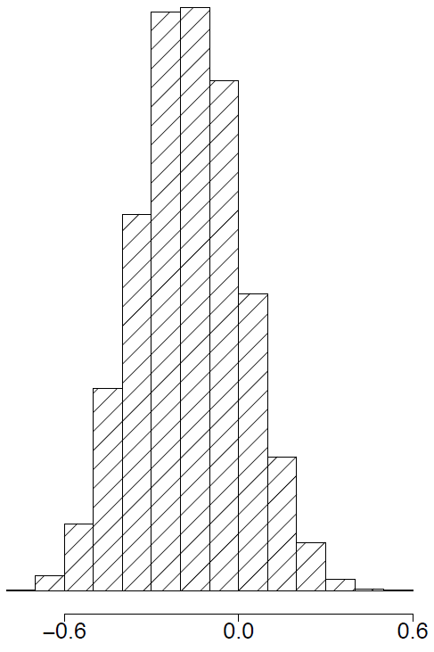
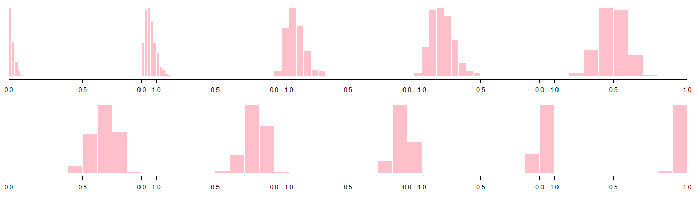
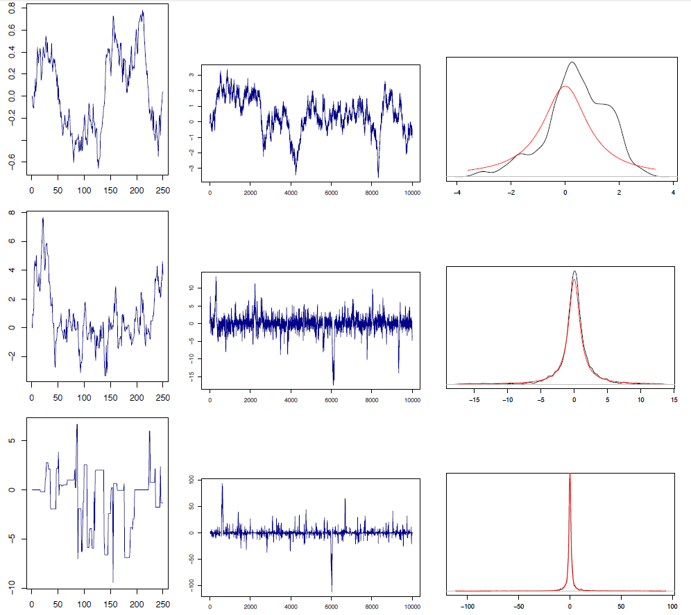

# Chapter 12 Bayesian Inference

Author: H. Liu and L. Wasserman

[Origin](http://www.stat.cmu.edu/~larry/=sml/Bayes.pdf)

Year: 2014

Related Course: [36-708 Statistical Methods for Machine Learning](http://www.stat.cmu.edu/~larry/=sml/)

## 12.3 Theoretical Aspects of Bayesian Inference

### 12.3.1 Bayesian Decision Theory

+ Risk of an estimator
  + $\widehat{\theta}(X)$:
    + an estimator of a parameter $\theta \in \Theta$
    + $\widehat{\theta}$ as a function of the data $X$
  + measuring ht discrepancy btw a parameter $\theta$ and its estimator $\widehat{\theta}(X)$ using a loss function $L: \Theta \times \Theta \to \mathbb{R}$
  + the risk of an estimator $\widehat{\theta}(X)$

    \[ R(\theta, \widehat{\theta}) = \mathbb{E}_\theta(L(\theta, \widehat{\theta})) = \int L(\theta, \widehat{\theta}(x)) p_\theta(x) dx \]

+ Decision theory from frequentist viewpoint
  + the parameter $\theta$ as a deterministic quantity
  + purpose: finding a minimax estimator $\widehat{\theta}$ to minimize the maximum risk, i.e.,

    \[ R_{\max}(\widetilde{\theta}) := \sup_{\theta \in \Theta} R(\theta, \,\widetilde{\theta}) \]

+ Decision theory from Bayesian viewpoint
  + the parameter $\theta$ as a random quantity w/ a prior distribution $\pi(\theta)$
  + purpose: finding the estimator $\widehat{\theta}(X)$ to minimize the posterior expected loss

    \[ R_{\pi}(\widehat{\theta} \,|\, X) = \int_{\Theta} L\left(\theta, \widehat{\theta}(X)\right) p(\theta \,|\, X) d\theta \]
  
  + estimator $\widehat{\theta}$: a Bayes rule w.r.t. the prior $\pi(\theta)$ if

    \[ R_{\pi}(\widehat{\theta}) = \inf_{\widetilde{\theta} \in \Theta} R_{\pi}(\widehat{\theta} \,|\, X) \]

+ Bayes risk
  + minimizing the posterior expected loss $\equiv$ minimizing the average risk, Bayes risk

    \[ B_{\pi} = \int R(\theta, \widehat{\theta}) \pi(\theta) \,d\theta \]

  + __Theorem__. The Bayes rules minimizes the $B_\pi$

  + __Theorem__. Bayes estimators
    + $L(\theta, \widehat{\theta}) = (\theta, \widehat{\theta})^2 \implies$ the posterior mean
    + $L(\theta, \widehat{\theta}) = |\theta, \widehat{\theta}| \implies$ the posterior median
    + $L(\theta, \widehat{\theta}) = I(\theta \neq \widehat{\theta}) \implies$ the posterior mode

### 12.3.2 Large Sample Properties of Bayes's Procedures

+ Bayesian approach w/ large samples
  + under appropriate conditions
    + the posterior distribution $\approx$ Normal distribution
    + the posterior mean $\approx$ mle
  + __Theorem__.
    + $I(\theta)$: the Fisher information
    + $\widehat{\theta}_n$: the maximum likelihood estimator
    + $\widehat{se} = 1 / \sqrt{n I(\widehat{\theta}_n)}$
    + Under appropriate regularity conditions, the posterior $\approx N(\widehat{\theta}_n, \widehat{se})$, i.e.,

      \[ \int \left|p(\theta \,|\, X_1, \dots, X_n) - N(\theta; \widehat{\theta}, \widehat{se} )\right| \,d\theta \xrightarrow{P} 0 \]

    + $\overline{\theta} - \widehat{\theta} = O_P(1/n)$
    + $z_{\alpha/2}: \alpha/2$-quantile of a standard Gaussian distribution
    + $C_n = [\widehat{\theta}_n - z_{\alpha/2} \, \widehat{se}, \,\widehat{\theta}_n + z_{\alpha/2}\,\widehat{se}]$: the asymptotic frequentist $1-\alpha$ confidence interval

      \[ \mathbb{P}(\theta \in C_n \,|\, \mathcal{D}_n) \to 1 - \alpha \]

  + _Proof_.
    + rigorous proof w van der Vaart (1998)
    + the effect of the prior diminishes as $n \nearrow \;\ni$ $p(\theta \,|\, \mathcal{D}_n) \propto \mathcal{L}_n(\theta)p(\theta) \approx \mathcal{L}_n(\theta)$
    + $l_n(\theta) = \log \mathcal{L}_n(\theta) \implies \log p(\theta\,|\, \mathcal{D}_n) \approx l_n(\theta)$
    + by Taylor expansion around $\widehat{\theta}_n$

      \[\begin{align*}
        l_n(\theta) &\approx l_n(\widehat{\theta}_n) + (\theta - \widehat{\theta}_n) \underbrace{l_n^\prime (\widehat{\theta})}_{=0} + [(\theta - \widehat{\theta}_n)^2/2] l_n^{\prime\prime} (\widehat{\theta}_n) \\
        &= l_n(\widehat{\theta}_n) + [(\theta - \widehat{\theta}_n)^2 / 2] l_n^{\prime\prime} (\widehat{\theta}_n) \\\\
        &\Downarrow (\sigma_n^2 = -1 / l_n^{\prime\prime} (\widehat{\theta}_n) \text{ and exponetiating both sides}) \\\\
        p(\theta \,|\, \mathcal{D}_n) &\propto \exp\left( -\frac{1}{2} \frac{(\theta - \widehat{\theta}_n)^2}{\sigma_n^2} \right)
      \end{align*}\]

    + $\therefore$ the posterior of $\theta \approx N(\widehat{\theta}_n, \sigma_n^2)$
    + $l_i(\theta) = \log p(X_i \,|\, \theta) \implies$

      \[\begin{align*}
        \frac{1}{\sigma_n^2} &= -l^{\prime\prime}(\widehat{\theta_n}) = \sum_{i=1}^n -l_i^{\prime\prime}(\widehat{\theta}_n) = n \left(\frac{1}{n}\right) \sum_{i=1}^n -l_i^{\prime\prime}(\widehat{\theta}_n) \approx n\mathbb{E}_\theta [-l_i^{\prime\prime}(\widehat{\theta}_n)] = nI(\widehat{\theta}_n) \\\\
        & \implies \sigma_n \approx se(\widehat{\theta}_n) \tag*{$\Box$} 
      \end{align*}\]

  + Bayes delta method: $\tau = g(\theta) \implies \tau \,|\, \mathcal{D}_n \approx N(\widehat{\tau}, \widetilde{se}^2), \;\;\widehat{\tau} = g(\widehat{\theta}), \,\widetilde{se} = \widehat{se} \,g'(\widehat{\theta})$

## 12.4 Examples of Bayesian Inference

### 12.4.1 Bayesian Linear Model

+ Gaussian linear regression
  + many frequentist method viewed as the maximum a posterior (MAP) estimator under a Bayesian framework
  + Gaussian linear regression w/ known $\sigma$

    \[ Y = \beta_0 + \sum_{j=1}^d \beta_j X_j = \varepsilon, \quad \varepsilon \sim N(0, \sigma^2) \]

  + sampling distribution: $\mathcal{D}_n = \{ (\pmb{X}_1, Y_1), \dots,  (\pmb{X}_n, Y_n)\}$
  + the conditional likelihood of $\pmb{\beta} = (\beta_0, \beta_1, \dots, \beta_s)^T$

    \[ \mathcal{L}(\pmb{\beta}) = \prod_{i=1}^n p(y_i \,|\, x_i, \pmb{\beta}) \propto \exp\left( -\frac{\sum_{i=1}^n (y_i - \beta_0 - \sum_{j=1}^d \beta_j x_{ij})^2}{2 \sigma^2} \right) \]

  + a Gaussian prior $\pi_\lambda(\pmb{\beta}) \propto \exp( -\lambda \|\pmb{\beta}\|^2_2 / 2) \implies$ the posterior

    \[ p(\pmb{\beta} \,|\, \mathcal{D}_n) \propto \mathcal{L}(\pmb{\beta}) \pi_\lambda(\pmb{\beta}) \]

  + the MAP estimator, $\widehat{\pmb{\beta}}^{\,MAP}$

    \[ \widehat{\pmb{\beta}}^{\,MAP} = \mathop{\arg\min}_{\pmb{\beta}} p(\pmb{\beta} \,|\, \mathcal{D}_n) = \mathop{\arg\min}_{\pmb{\beta}} \left\{ \sum_{i=1}^n \left(Y_i - \beta_0 - \sum_{j=1}^d \beta_j X_{ij}\right)^2 + \lambda \sigma^2 \|\pmb{\beta}\|_1 \right\} \]

    + exactly the ridge regression w/ the regularization parameter $\lambda' = \lambda \sigma^2$
  + adopting the Laplacian prior $\pi_\lambda(\pmb{\beta}) \propto \exp(-\lambda \|\pmb{\beta}\|_1 / 2) \implies$ the Lasso estimator

    \[ \hat{\pmb{\beta}}^{\,MAP} = \mathop{\arg\min}_{\pmb{\beta}} \left\{ \sum_{i=1}^n \left(Y_i - \beta_0 - \sum_{j=1}^d \beta_j X_{ij}\right)^2 + \lambda \sigma^2 \|\pmb{\beta}\|_1 \right\} \]

  + a complete Bayesian analysis aiming at obtaining the whole posterior distribution $p(\pmb{\beta} \,|\, \mathcal{D}_n)$
  + in general, $p(\pmb{\beta} \,|\, \mathcal{D}_n)$ not having an analytic form and resorting to simulation to approximate the posterior

### 12.4.2 Hierarchical Models

+ Hieracrhical model
  + a multi-level statistical model
  + a typical hierarchical model

    \[\begin{align*}
      \alpha &\sim \pi(\alpha) \\
      \theta_1, \dots, \theta_n \,|\, \alpha &\sim p(\theta \,|\, \alpha) \\
      X_i \,|\, \theta &\sim p(X_i \,|\, \theta_i), \; i=1, \dots, n
    \end{align*}\]

  + example: infection rate at hospital
    + $\theta_i$: the infection rate at hospital $i$
    + $X_i$: presence or absence of infection in a patient at hospital $i$
    + $\theta_1, \dots, \theta_n$ as random draws from a distribution $p(\theta \,|\, \alpha)$
    + the distribution depending on parameters $\alpha$, known as hyperparameters

## 12.5 Simulation Methods for Bayesian Computation

+ Simulation approach for distribution
  + drawing sample $X$ from a distribution $F$
    + $F(X)$: uniform distribution over the interval (0, 1)
    + a basic strategy to sample $U \sim \text{Uniform}(0, 1) \to X = F^{-1}(U)$
  + procedure
    + sampling from a distribution that is easy to draw from, $\text{Uniform}(0, 1)$
    + using it to sample from a more complicated complicated distribution $F$

+ Basic simulation approach to estimate integral
  + estimating the integral $\int_0^1 h(x) \,dx$ for some complicated function $h$
  + drawing $N$ samples $X_i \sim \text{Uniform}(01, 1)$
  + estimating the integral

    \[ \int_0^1 h(x) \,dx \approx \frac{1}{N} \sum_{i=1}^N h(X_i) \]

  + converged to the desired integral by the law of large numbers

+ Simulation methods for Bayesian inference
  + the prior: $\pi(\theta)$
  + sampling distribution: $\mathcal{D}_n = \{ X_1, \dots, X_n \}$
  + the posterior density

    \[ \pi(\theta \,|\, \mathcal{D}_n) = \frac{\mathcal{L}_n(\theta)\pi(\theta)}{c} \]

    + $\mathcal{L}_n(\theta)$: the likelihood function
    + the normalizing constant $c = \int \mathcal{L}_n(\theta) \pi(\theta) \,d\theta$
  + the posterior mean
  
    \[ \overline{\theta} = \int \theta \pi(\theta \,|\, \mathcal{D}_n) \,d\theta = \frac{1}{c} \int \theta\mathcal{L}_n(\theta) \pi(\theta) \,d\theta \]

  + $\pmb{\theta} = (\theta_1, \dots, \theta_s)^T$ multidimensional
  + the marginal posterior density for $\theta_i$

    \[ \pi(\theta_i \,|\, \mathcal{D}_n) = \int\int\cdots\int \pi(\theta_1,  \cdots, \theta_d) \,d\theta_1 \cdots d\theta_{i-1} d\theta_{i+1} \cdots d\theta_s \]

  + high-dimensional $\theta$
    + not feasible to calculate these integrals analytically
    + simulation methods helpful

### 12.5.1 Basic Monte Carlo Integration

+ Numerical method for integral
  + $\exists\, \text{ a function } h$, to evaluate the integral

    \[ I = \int_a^b h(x) dx \]

  + easy $h$: calculating the integral in closed form
  + complicated $h$: no known closed form expression for $I$
  + numerical techniques for evaluating $I$
    + Simpson's rule
    + the trapezoidal rule
    + Gaussian quadrature
    + Monte Carlo integration
  
+ Basic Monte Carlo integration method
  + approximating $I$ which is notable for its simplicity, generality and scalability
  + $\exists\; w(x) - h(x) (b-a), f(x) = 1/(b-a) \ni$
  
    \[ I = \int_a^b h(x) dx = \int_a^b w(x) f(x) dx \]

  + $f$: the probability density for a uniform random variable over $(a, b)$ w/ $X \sim \text{Uniform}(a, b)$

    \[ I = \mathbb{E}_f(w(X)) \]

  + generating $X_1, \dots, X_N \sim \text{Uniform}(a, b) \implies$ the the law of large numbers

    \[ \widehat{I} \equiv \frac{1}{N} \sum_{i=1}^N w(X_i) \xrightarrow{P} \mathbb{E}(w(X)) = I \]

  + the standard error of the estimate

    \[ \widehat{se} = \frac{s}{\sqrt{N}}, \qquad s^2 = \frac{\sum_{i=1}^N (\widehat{Y}_i - \widehat{I})^2}{N - 1} \;\;\text{ and }\;\; Y_i = w(X_i) \]

  + region estimate: $(1 - \alpha)$ confidence interval = $\widehat{I} \pm z_{\alpha/2} \cdot \widehat{se}$
  + $N \nearrow  \implies CI \searrow$
  + example
    + $h(x) = x^3 \implies I = \int_0^1 x^3 dx = 1/4$
    + $N = 10,000$ observations from a Uniform(0, 1)
    + obtaining $\widehat{I} = .248, \widehat{se} = 0.0028$

+ Generalized Monte Carlo integration methods
  + the integral w/ $f(x)$ a probability density function

    \[ I = \int_a^b h(x) f(x) dx \]

  + special case: $f \sim \text{Uniform}(a, b)$
  + drawing $X_1, \dots, X_N \sim f$

    \[ \widehat{I} := \frac{1}{N} \sum_{i=1}^N h(X_i) \]

+ Numerical methods for Gaussian density
  + the standard normal PDF

    \[ f(x) = \frac{1}{\sqrt{2\pi}} e^{-x^2/2} \]

  + computing the CDF at some point $x$

    \[ I = \int_{-\infty}^x f(s) ds = \Phi(x) \implies I = \int h(s) f(s) ds, \quad h(s) = \begin{cases} 1 & s < x \\ 0 & s \geq x  \end{cases} \]

  + generating $X_1, \dots, X_N \sim N(0, 1)$ and 

    \[ \widehat{I} = \frac{1}{N} \sum_i h(X_i) = \frac{\text{number of observations w/ their values} \leq x}{N} \]

  + example:
    + $x = 2$ and the true answer $\Phi(2) = .9772$
    + the Mont Carlo estimate
      + $N = 10,000 \to \Phi(2) = .9751$
      + $N = 100,000 to \Phi(2) = .9771$

+ Bayesian inference for two binomial
  + freqentist analysis
    + $X \sim \text{Binomial}(n, p_1), \,Y \sim \text{Binomial}(m, p_2)$
    + task: to estimate $\delta = p_2 - p_1$
    + the MLE: $\widehat{\delta} = \widehat{p}_1 - \widehat{p}_2 = (Y/m) - (X/n)$
    + the standard error $\widehat{se}$ using the delta method

      \[ \widehat{se} = \sqrt{\frac{\widehat{p}_1 (1 - \widehat{p}_1)}{n} + \frac{\widehat{p}_2 (1 - \widehat{p}_2)}{m}} \]

    + 95% confidence interval: $\widehat{\delta} \pm 2 \cdot \widehat{se}$
  + Bayesian analysis
    + the prior: $\pi(p_1, p_2) = \pi(p_1) \pi(p_2) = 1 \implies$ a flat prior on $(p_1, p_2)$
    + the posterior

      \[ \pi(p_1, p_2 \,|\, X, Y) \propto p_1^X(1 - p_1)^{n - X} p_2^Y (1 - p_2)^{m-Y} \]

    + the posterior mean of $\delta$

      \[ \overline{\delta} = \int_0^1\int_0^1 \delta(p_1, p_2) \pi(p_1, p_2 \,|\, X, Y)\,dp_1 dp_2 = \int_0^1\int_0^1 (p_2 - p_1) \pi(p_1, p_2 \,|\, X, Y) \,dp_1 dp_2 \]

    + obtaining the posterior CDF w/ $A = \{ (p_1, p_2): p_2 - p_1 \leq c \}$

      \[ F(c \,|\, X, Y) = \mathbb{P}(\delta \leq c \,|\, X, Y) = \int_A \pi(p_1, p_2 \,|\, X, Y) \]

    + then differentiate $F \to$ too complicated
  + simulation approach
    + $\pi(p_1, p_2 \,|\, X, Y) = \pi(p_1 \,|\, X) \pi(p_2 \,|\, Y) \implies p_1, p_2$ independent under the posterior distribution
    + simulate $(P_1^{(1)}, P_2^{(1)}), \dots, (P_1^{(N)}, P_2^{(N)})$ from the posterior by drawing ($i = 1,  \dots, N$)

      \[\begin{align*}
        P_1^{(i)} \sim \text{Beta}(X + 1, n - X + 1) \\
        P_2^{(i)} \sim \text{Beta}(Y + 1, n - Y + 1)
      \end{align*}\]

    + $\delta^{(i)} = P_2^{(i)} - P_1{(i)} \implies$

      \[ \overline{\delta} \approx \frac{1}{N} \sum_{i=1}^N \delta^{(i)} \]

    + 95% posterior interval for $\delta$:
      + sorting the simulated values
      + finding the .025 and .975 quantile
    + the posterior density $f(\delta \,|\, X, Y)$
      + applying density estimation techniques to $\delta^{(1)}, \dots, \delta^{(N)}$
      + plotting a histogram
  + simulation example
    + $n = m = 10, \, X = 9, \,Y = 6$
    + posterior sample size = 1000
    + 95% posterior interval = (-0.52, 0.20)

    

      
    

+ Bayesian inference for multiple parameters
  + example: Bayesian inference for dose response
  + conducting an experiment by giving rats one of 10 possible doses of a drug, $x_1 \leq x_2 \leq \cdots \leq x_{10}$
  + for each dose level $x_i$ using $n$ rates and observing the survival numbers $Y_i$
  + sampling distribution 10 independent binomials $Y_i \sim \text{Binomial}(n, p_i)$
  + biological considerations: higher dose w/ higher probability of death, i.e., $p_1 \leq p_2 \leq \cdots, \leq p_{10}$
  + task: to estimate the dose at which the animals w/ 50% chance of dying, LD50
  
    \[ \delta = x_j^*  \qquad j^* = \min\{ j: p_j \geq 1/2 \} \]

  + $\delta$ implicitly just a complicated function of $p_1, \dots, p_{10} \to \delta = g(p_1, \dots, p_{10})$
  + known $(p_1, \dots, p_{10}) \implies$ find $\delta$
  + the posterior mean of $\delta$ w/ $A = \{ (p_1, \dots, p_{10}): p_1 \leq \cdots \leq p_{10}) \}$

    \[ \int\int\cdots\int_A g(p_1, \dots, p_{10})\pi(p_1, \dots, p_{10} \,|\, Y_1, \dots, Y_{10}) \,dp_1 dp_2 \cdots dp_{10} \]

  + the posterior CDF of $\delta$ w/ $B = A \cup \{ (p_1, \dots, p_{10}): g(p_1, \dots, p_{10}) \leq c \}$

    \[\begin{align*}
      F(c \,|\, Y_1, \dots, Y_{10}) &= \mathbb{P}(\delta \leq c \,|\, Y_1, \dots, Y_{10}) \\
      &= \int\int \cdots\int_B \pi(p_1, \cdots, p_{10} \,|\, Y_1, \dots, Y_{10}) dp_1 dp_2 \cdots dp_{10}
    \end{align*}\]

  + simulation procedure
    + taking a flat prior truncated over $A$
    + each $P_i \sim$  Beta distribution
    + drawing from the posterior
      + drawing $P_i \sim \text{Beta}(Y_i + 1, \,n - Y_i +1), \;i = 1, \dots, 10$
      + if $P_1 \leq P_2 \leq \dots \leq P_{10}$ keeping this draw.  Otherwise, throw it away and draw again until getting one to keep
      + let $\delta = x_j^\ast$ w/ $j^\ast = \min \{ j: P_j > 1/2 \}$
    + repeat $N$ times to get $\delta{(1)}, \dots, \delta^{(N)}$ and take

      \[ \mathbb{E}(\delta \,|\, Y_1, \dots, Y_{10}) \approx \frac{1}{N} \sum_{i=1}^N \delta^{(i)} \]

    + estimate the probability mass function as $\delta$ a discrete variable

      \[ \mathbb{P}(\delta = x_j \,|\, Y_1, \dots, Y_{10}) \approx \frac{1}{N} \sum_{i=1}^N I(\delta^{(i)} = x_j) \]
  + example
    + the simulated data

      | Dose | 1 | 2 | 3 | 4 | 5 | 6 | 7 | 8 | 9 | 10 |
      |------|---|---|---|---|---|---|---|---|---|---|
      | Number of animals $n_i$ | 15 | 15 | 15 | 15 | 15 | 15 | 15 | 15 | 15 | 15 |
      | Number of survivors $Y_i$ | 0 | 0 | 2 | 2 | 8 | 10 | 12 | 14 | 15 | 14 |

    + the posterior draws for $p_1, \dots, p_{10}$ w/ $N = 500 \implies \overline{\delta} = 5.45$ and 95% CI = $(5, 7)$

    

      
    

### 12.5.2 Importance Sampling

+ Issue on basic Monte Carlo method
  + $\exists\; f$ a probability density $\ni I = \int h(x) f(x) dx$
  + cases not knowing how to sample from $f$
  + in Bayesian inference, the posterior obtained from the likelihood $\mathcal{L}_n(\theta)$ and the prior $\pi(\theta)$
  + issue: no guarantee $\pi(\theta | \mathcal{D}_n)$ w/ a known distribution
  + solution: importance sampling - a generalization of basic Monte Carlo

+ Modeling of importance sampling
  + $\exists\; g$ a probability density w/ known distribution
  + the integral

    \[ I = \int h(x) f(x) dx = \int \frac{h(x) f(x)}{g(x)} g(x) dx = \mathbb{E}_g (W) \]

    + $W = h(X)f(X)/g(X)$
    + $\mathbb{E}_g(W)$: the expectation w.r.t $g$

  + importance sampling:
    + simulate $X_1, \dots, X_N \sim g$ 
    + estimate $I$ by the sample average

      \[ \widehat{I} = \frac{1}{N} \sum_{i=1}^N Y_i = \frac{1}{N} \sum_{i=1}^N \frac{h(X_i)f(X_i)}{g(X_i)} \]

  + by the law of large number: $\widehat{I} \xrightarrow{P} I$

+ Guideline to importance sampling
  + $\widehat{I}$ probably w/ an infinite standard error
  + as $I = \mathbb{E}[w(x)] = \mathbb{E}_g[h(x)f(x)/g(x)]$, the 2nd moment

    \[ \mathbb{E}_g[w^2(X)] = \int \left( \frac{h(x)f(x)}{g(x)} \right)^2 g(x) \,dx = \int \frac{h^2(x)f^2(x)}{g(x)} dx \]

  + $g$ w/ thinner tails than $f$, i.e., $g(x)$ small over some set $A$ where $f(x)$ is large $\implies$ the integral probably infinite
  + basic rule of importance sampling: to sample  from a density $g$ w/ thicker tails than $f$
  + large $f/g \to$ a large variance $\implies$ choosing $g$ to be similar in shape to $f$
  + summary: a good choice for an importance sampling density $g$ should be similar to $f$ but w/ thicker tails
  + __Theorem__: the choice of $g$ that minimizes the variance of $\widehat{I}$ is

    \[ g^*(x) = \frac{|h(x)| f(x)}{\int |h(s)| f(s) ds} \]

  + _Proof_
    + the variance of $w = fh/g$

      \[\begin{align*}
        \mathbb{E}_g(w^2) - (\mathbb{E}(w))^2 &= \int w^2(x) g(x) dx - \left(\int w(x)g(x)dx\right)^2 \\
        &= \int \frac{h^2(x)f^2(x)}{g^2(x)} g(x)dx - \left(\int \frac{h(x)f(x)}{g(x)} g(x)dx\right)^2 \\
        &= \int \frac{h^2(x)f^2(x)}{g(x)} dx - \underbrace{\left(\int h(x)f(x) dx\right)^2}_{\text{not depending on }g}
      \end{align*}\]

    + minimizing the 1st term w/ Jensen's inequality to have lower bound

      \[ \mathbb{E}_g(W^2) \geq \left( \mathbb{E}_g(|W|) \right)^2 = \left(\int |h(x)| f(x) dx \right)^2 \]

    + $\therefore \;\mathbb{E}_{g^*}(W^2) = \left( \mathbb{E}_g(|W|) \right)^2$ $\tag*{$\Box$}$

+ Importance sampling w/ tail probability
  + estimate $I = \mathbb{P}(Z > 3) = .0013, \; Z \sim N(0,1)$
  + the integral w/ standard normal density $f$

    \[ I = \int h(x) f(x) dx, \qquad h(x) = \begin{cases} 1 & x > 3 \\ 0 & \text{otherwise} \end{cases} \]

  + basic Monte Carlo estimator w/ $X_1, \dots, X_N \sim N(0, 1)$

    \[ \widehat{I} = \frac{1}{N} \sum_i h(X_i) \]

  + $N = 100 \implies \mathbb{E}(\widehat{I}) = .0015, \;Var(\widehat{I}) = .0039$
  + estimate w/ importance sampling taking $g \sim N(4, 1)$
  + simulation by drawing values from $g$ and the estimate

    \[ \widehat{I} = N^{-1} \sum_{i=1}^N f(X_i) h(X_i) / g(X_i) \implies \mathbb{E}(\widehat{I}) = .0011 \text{ and } Var(\widehat{I}) = .0002 \]

  + reducing the standard deviation by a factor of 20

+ Modeling importance sampling in Bayesian inference
  + the posterior mean: $\overline{\theta} = \mathbb{E}[\theta \,|\, X_1, \dots, X_n]$
  + $g$: an importance sampling distribution
  + the posterior mean

    \[\begin{align*}
      \mathbb{E}[\theta \,|\, X_1, \dots, X_n] = \frac{\int \theta \mathcal{L}(\theta) \pi(\theta) \,d\theta}{\int \mathcal{L}(\theta) \pi(\theta) \,d\theta} &= \frac{\int h_1(\theta) g(\theta) \,d\theta}{\int h_2(\theta) g(\theta) \,d\theta}, \\\\ 
      h_1(\theta) = \frac{\theta \mathcal{L}(\theta) \pi(\theta)}{g(\theta)}, &\quad h_2(\theta) = \frac{\mathcal{L}(\theta) \pi(\theta)}{g(\theta)}
    \end{align*}\]

  + $\theta_1, \dots, \theta_N$ as a sample from $g$, the posterior mean

    \[ \mathbb{E}[\theta \,|\, X_1, \dots, X_n] \approx \frac{\frac{1}{N} \sum_{i=1}^N h_1(\theta_i)}{\frac{1}{N} \sum_{i=1}^N h_2(\theta_i)} \]

  + very difficult to choose a good importance sampler $g$, especially in high dimensions

### 12.5.3 Markov Chain Monte Carlo (MCMC)

+ Markov chain Monte Carlo methods
  + constructing a Markov chain $X_1, X_2, \dots$ w/ $f$ as their stationary distribution
  + problem: estimating the integral $I = \int h(x) f(x) dx$
  + under certain conditions, the integral following

    \[ \frac{1}{N} \sum_{i=1}^N h(X_i) \xrightarrow{P} \mathbb{E}_f(h(X)) = I \]

+ Metropolis-Hastings algorithm
  + a specific MCMC method
  + the proposal distribution
    + $g(y \,|\, x)$: an arbitrary "friendly" distribution
    + knowing how to sample efficiently from $q(y \,|\, x)$
  + __algorithm__

    
choose $X_0$ arbitrary 

    
Given $X_0, X_1, \dots, X_i$, generate $X_{i+1}$ as following: 

      
1. generate a proposal or candidate value $Y \sim q(y | X_i)$

      
2. Evaluate $r \equiv r(X_i, Y)$ where

      
$r(x, y) = \min \{ \frac{f(y)}{f(x)}\,\frac{q(x|y)}{q(y|x)}, \; 1 \}$

      
3. Set

      
$X_{i+1} = \begin{cases} Y & \text{with probability } r \\ X_i & \text{with probability } 1 - r \end{cases}$
 

  + simple way to execute step 3: generate $U \sim \text{Uniform}(0, 1)$

    \[ X_{i+1} = \begin{cases} Y & U < r \\ X_i & \text{otherwise} \end{cases} \]

  + common choice: 
    + $q(Y|x) \sim N(x, b^2), \,b >0 \ni$ the proposal drawing from a normal, centered at the current value
    + the proposal density $q$ symmetric $\implies q(y|x) = q(x|y)$ and

      \[ r = \min\left\{ \frac\left{f(Y)}{f(X_i)}, \,1 \right\} \]

  + constructed $X_0, X_1, \dots \to$ Markov chain
  + the chain mixing well: the sample from the Markov chain starts look like the target distribution $f$ quickly
    + tuning parameter ($b$) $\implies$ the efficiency and mixing-well of the chain

+ Example: Cauchy distribution
  + Cauchy density

    \[ f(x) = \frac{1}{\pi} \frac{1}{1 + x^2} \]

  + task: simulate a Markov chain whose stationary distribution is $f$
  + taking $q(Y|x) \sim N(x, b^2)$

    \[ r(x, y) = \min\left\{ \frac{f(y)}{f(x)}, \,1 \right\} = \min \left\{ \frac{1+x^2}{1+y^2}, \,1 \right\} \]

  + drawing $Y \sim N(x, b^2)$ w/ Metropolis-Hastings algorithm w/

    \[ X_{i+1} = \begin{cases} Y & \text{with probability } r(X_i, Y) \\ X_i & \text{with probability } 1 - r(X_i, Y) \end{cases} \]

  + simulation results (see diagram)
    + $b = .1$
      + forcing the chain to take small steps
      + the chain not exploring much of the sample space
      + histogram: the sample not approximating the true density very well
    + $b = 10$
      + causing the proposals too often being far in tails, making $r$ small
      + rejecting the proposal and keeping the chain in its current position
      + the chain traps at the same place quite often
      + histogram: not approximating the true density very well
    + $b = 1$
      + avoiding extremes
      + resulting in a Markov chain sample representing the density well and sooner

    

      
    

### 12.5.4 Why It Works

+ Interpretation of Markov chain
  + a Markov chain w/ the transition kernel $p(y|x)$ = the probability of transiting from $x$ to $y$
  + $f(x) = \int f(y) p(x|y) dy \implies f$ is a stationary distribution for the Markov chain
  + Interpretation of stationary
    + the chain reaching the distribution $f \to$ the chain staying in $f$
    + another step of the chain $p(x|y) \to$  not changing the distribution
  + $f$ as a stationary distribution for a Markov chain $\implies$ the data from a sample run of the Markov chain approximating the distribution $f$
  + designing a Markov chain w/ stationary distribution $f \implies$ running the Markov chain and using the resulting data as if it were a sample from $f$

+ Derivative of the Metropolis-Hastings algorithm
  + detailed balance
    + $f(x)p(y|x) = f(y) p(x|y) \implies$ the chain satisfies _detailed balance_ holds w.r.t. $f$
    + $(x, y)$ w/ the same probability as $(y, x)$
    + the chain time reversible
  + the chain satisfying detailed balance holds w.r.t. $f \implies$ $f$ as a stationary distribution
  + $f(x) = \int f(y)p(x|y)dy$ required $\ni$

    \[ \int f(y)p(x|y) dy = \int f(x) p(y|x) dy = f(x) \int p(y|x) dy  = f(x) \]

  + goal: shown that $p(y|x)$ as the Markov chain defined by the Metropolis-Hastings algorithm $\implies f$ satisfies detailed balance $\implies f$ is a stationary distribution for the chain
  + the Metropolis-Hastings algorithm
    + using a user-chosen distribution $q(y|x)$ w/ a accept/reject step $\implies$ a Markov chain w/ transition probability $p(y|x) = q(y|x) r(x, y)$
    + two situations: $f(x) q(y|x) < f(y) q(x|y)$ or $f(x) q(y|x) > f(y) q(x|y)$
  + $f(x) q(y|x) > f(y) q(x|y) \implies$

    \[ r(x, y) = \frac{f(y)}{f(x)} \frac{q(x | y)}{q(y | x)} < 1  \text{ and } r(y, x) = 1 \]

  + $p(y|x)$: the probability of jumping from $x$ to $y$
    + the proposal distribution must generate $y$
    + $y$ must be accepted

    \[ p(y|x) = q(y|x) r(x, y) = q(y|x) \frac{f(y)}{f(x)} \frac{q(x|y)}{q(x|y)} = \frac{f(y)}{f(x)} q(x|y) \]

    \[ \therefore f(x)p(y|x) = f(y) q(x|y) \tag{7} \]

  + $p(x|y)$: the probability of jumping from $y$ to $x$
    + the proposal distribution must generate $x$
    + $x$ must be accepted

    \[ p(x | y) = q(x | y) r(y, x) = q(x | y) \]

    \[ \therefore f(y)p(x|y) = f(y) q(x | y) \tag{8}\]

  + comparing (Eq.7) and (Eq. 8), it has been shown that detailed balance holds

### 12.5.5 Different Flavors of MCMC

+ Random-Walk-Metropolis-Hastings method
  + drawing a proposal $Y$ of the form

    \[ Y = X_i + \epsilon_i \implies q(y|x) = g(y-x) \]

    + $\epsilon_i$: coming from some distribution w/ density $g$
  + the acceptance probability

    \[ r(x, y) = \min \left\{ 1, \frac{f(y)}{f(x)} \right\} \]

  + random-walk-Metropolis-Hastings w/o accept-reject step = random walk simulation
  + common choice: $g \sim N(0, b^2)$
  + issue: choosing $b$ to mix well for the Markov chain
  + rule of thumb: choosing $b \ni$  about 50% of the proposal are accepted
  + assumption: $X \in \mathbb{R}$
    + $X$ restricted to some interval $\to$ transform $X$
    + e.g., $X \in (0, \infty), Y = log X \implies $ simulating $Y$ instead of $X$

+ Independence-Metropolis-Hastings method
  + an importance sampling version of MCMC
  + drawing the proposal from a fixed distribution $g$
  + $g$ chosen to be an approximation to $f$
  + the acceptance probability

    \[ r(x, y) = \min \left\{ 1, \frac{f(y)}{f(x)} \frac{g(x)}{f(y)} \right\} \ \min \left\{ 1, \frac{f(y)}{g(y)} \frac{g(x)}{f(x)} \right\} \]

### 12.5.6 Normalizing Constants

