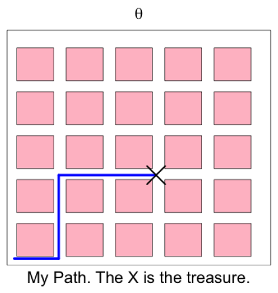
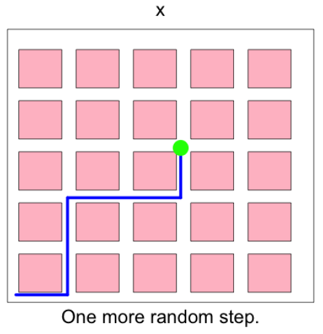
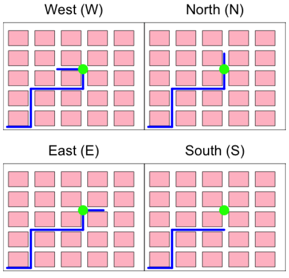

# Chapter 12 Bayesian Inference

Author: H. Liu and L. Wasserman

[Origin](http://www.stat.cmu.edu/~larry/=sml/Bayes.pdf)

Year: 2014

Related Course: [36-708 Statistical Methods for Machine Learning](http://www.stat.cmu.edu/~larry/=sml/)

## 12.6 Examples Where Bayesian Inference and Frequentist Inference Disagree

+ Bayesian inference
  + Bayes' theorem: a natural way to combine prior information w/ data
  + Bayesian methods: providing no guarantees on long run performance
  + Bayesian methods w/ poor frequency behavior in some cases

+ Multivariate Normal distribution w/ sum of squared mean
  + sampling distribution: $\mathcal{D}_n = \{ X_1, \dots, X_n \}, \, X \sim N(\mu_i, 1)$
  + the prior: $\pi(\mu_1, \dots, \mu_n)$
  + task: estimate $\pmb{\mu} = (\mu_1, \dots, \mu_n)^T$
  + the posterior of $\pmb{\mu}$
    + multivariate Normal w/ mean $\mathbb{E}(\pmb{\mu} \,|\, \mathcal{D}_n) = (X_1, \dots, X_n)$
    + covariance = the identity matrix
  + $\theta = \sum_{i=1}^n \mu^2_i$
  + $\exists\, c_n, \,C_n = [c_n , \infty) \to \mathbb{P}(\theta \in C_n \,|\, \mathcal{D}_n) = 0.95$
  + frequentist sense

    \[ n \to \infty \ni \mathbb{P}_{\pmb{\mu}} (\theta \in C_n) \to 0 \]

  + a sharp difference btw $\mathbb{P}_{\pmb{\mu}}(\theta \in C_n)$ and $\mathbb{P}(\theta \in \mathcal{D}_n \,|\, \mathcal{D}_n)$

+ Sampling to a Foregone Conclusion
  + random variable: $X \sim N(\theta, 1)$
  + sampling distribution: $\mathcal{D}_N = \{ X_1, \dots, X_N \}$
  + $X_i$: statistics comparing to a new drug to a placebo
  + continuing sampling until $T_n > k, \,T_N = \sqrt{NX_N}, k= 10 \implies$ stop when the drug appears to be much better than the placebo
  + $N$ becoming as a random variable
  + it has been shown that $\mathbb{P}(N < \infty) = 1$
  + it has been shown that the posterior $p(\theta \,|\, X_1, \dots, X_N)$ same as if $N$ had been fixed in advance, i.e., the randomness in $N$ not affecting the posterior
  + approximating to Normal distribution: the prior $\pi(\theta)$ smooth $\implies$ the posterior approximately $\theta \,|\, X_1, \dots, X_N \sim N(\overline{X}_N, 1/N)$
  + region estimate: $C_N = \overline{X}_N \pm 1.96/\sqrt{N} \implies \mathbb{P}(\theta \in C_N \,|\, X_1, \dots, X_N) \approx 0.95$ w/ $0 \notin C_N$
  + frequentist perspective:
    + stop sampling w/ $T > 10 \ni$

      \[ \overline{X}_N - \frac{1.96}{\sqrt{N}} > \frac{10}{\sqrt{N}} - \frac{1.96}{\sqrt{N}} > 0  \quad\therefore \theta = 0 \ni \mathbb{P}_\theta(\theta \in C_N) = 0 \]

    + the frequentist coverage

      \[ \text{Coverage} = \inf_{\theta} \mathbb{P}_\theta(\theta \in C_N) = 0 \]

  + sampling to a forgone conclusion: a serious issue in sequential clinical trials

+ Godambe's example
  + $\exists\; C = \{ c_1, \dots, c_N \}$, a finite set of constants
  + $c_i \in \{0, 1 \}$ for simplification
  + to estimate $\theta = N^{-1}\sum_{j=1}^N c_j$
  + $S_1, \dots, S_n \sim \text{Bernoulli}(\pi)$, w/ known $\pi$ and $c_i = \begin{cases} 1 & S_i = 1 \\ 0 & S_i \neq 1 \end{cases}$
  + the likelihood function

    \[ \prod_i \pi^{S_i}(1 - \pi)^{1- S_i} \]
  
  + the unknown parameter $\theta$ not appearing in the likelihood $\to$ no information at all
  + the posterior for $\theta$ = the prior for $\theta$
  + frequentist perspective
    + to estimate $\theta$

      \[ \widehat{\theta} = \frac{1}{N\pi} \sum_{j=1}^N c_j S_j \implies \mathbb{E}(\widehat{\theta}) = \theta \]

    + Hoeffding's inequality $\implies$

      \[ \mathbb{P}(|\widehat{P} - \theta | > \epsilon ) \leq 2e^{-2n\epsilon^2\pi^2} \]

    + $\therefore\, \widehat{\theta}$ closed to $\theta$ w/ high probability

+ Flatland - Stone's paradox
  + it had been shown that a finitely additive on the free group w/ two generators is non-conglomerable.
  + i.e., even for a simple problem w/ a discrete parameters space, Bayesian inference can lead to surprises
  + $\exists\, A$ wondering randomly in two dimensional grid-world (left diagram)
    + A drags a taut elastic string
    + only moving four directions North, East, South , West
    + wandering around for a while
    + stop and bury a treasure
    + $\theta$: the path A wondering
  + A taking one more random step w/ equal probability for each direction, the path $x$ (middle diagram)
  + B (Bayesian) and F (frequentist) trying to find the treasure
  + only four possible paths w/ the path $x$ (right diagram)
    + same likelihood for each direction: $p(x \,|\, \theta) = 1/4, \, \theta = \{ N, E, S, W \}$
    + $B$ using a flat prior
    + the likelihood: flat
    + the posterior

      \[ P(\theta = N \,|\, x) = P(\theta = S \,|\, x) = P(\theta = W \,|\, x) = P(\theta = E \,|\, x) = 1/4  \]

  + $\exists\, Ext = \{ N, W, E \}$ as the three paths extending $x \implies p(\theta \in Ext |x) = 3/4$
  + F very confident and selecting a confidence set w/ only one path, the path shortening $x \implies Short = Ext^C$ as the confidence set
  + B's experience unable to be learned $\gets$ each hunt independent of the other
  + $A_{event}$ as the event shortening string at the final step
    + using the posterior B finding that $P(A_{event} | x) = 3/4, \forall\, x \to$ hold for each $x \implies P(A) = 3/4$
    + B notes that $P(A |\theta) =1/4 \;\forall\, \theta \implies P(A) = 1/4$
    + B just proved $1/4 = 3/4$

    

      
    

  + contradiction: stemming from the improper prior
  + technically, an example of the non-congolomerability of finite additive measures

+ Brief explanation for Stone's paradox (Kass and Wasserman, 1996)
  + first impression
    + $\pi$ B's improper flat prior
    + $\pi(\theta|x)$: B's posterior distribution
    + $\pi_p$: the (proper) prior w/ uniform on  the set of all paths of length $p$
    + $\forall\, \text{fixed } x, \pi_p(A_{event} | x) \to 3/4 \text{ as }p \to \infty$
    + $\therefore$ B's posterior distribution as a limit of well-defined posterior distributions
  + carefully examined
    + $m_p(x) = \sum_\theta f(x|\theta) \pi_p(\theta)$: the marginal of $x$ induced by $\pi_p$
    + $X_p$: all $x$'s of length $p$ or $p+1$
    + $\pi_p(\theta|x), \,x \in X_p$: a poor approximation to $\pi(\theta|x)$
    + $p$ focused on a single point while $p+1$ concentrated on four points
    + the total variation distance $\sup_{\theta|x} |\pi_p(\theta|x) - \pi(\theta|x)| = 3/4, \;\forall\, x \in X_p$
    + $X_p$: a set w/ high probability
    + $m_p(X_p) \to 2/3$ as $p \to \infty$
    + $\pi_p(\theta | x) \xrightarrow{D} \pi(\theta|x)$ as $p \to \infty \;\forall\, \text{ fixed } x \implies$  not close w/ high probability
  + alternative description
    + considering a four sided die w/ labels as $\{a, b, a^{-1}, b^{-1}\}$
    + rolling the die several time s and recording the label on the lowermost face
    + a typical outcome as a string of symbols, e.g., $a \; a \; b \; a^{-1} \; b \;b^{-1} \;a \;a^{-1} \; b$
    + annihilation rule: eliminating both $a$ and $a^{-1}$ (or vice verse) if they are next to each other; same as $b$ and $b^{-1}$
    + applying annihilation rule to the string: $a \; a \; b \; a^{-1} \; b \;b^{-1} \;b\;a \;a^{-1} \; b \to a\;a\;b\;a^{-1}\;b\;b$
    + $\theta$: the resulting string of symbols after applying annihilation
    + tossing the die one more time $\to$ adding the symbol to the last symbol to $\theta$ $\to$ applying annihilation rule again $\to x$
    + task: observing $x$ to estimate $\theta$
      + 4 possible values of $\theta$ and each w/ the same likelihood
      + e.g., $x = (a, a) \ni \theta$ w/ one of the following

        \[ (a), \quad (a\;a\;a), \quad (a\;a\;b^{-1}), \quad (a\;a\;b) \]

    + the likelihood function is constant over these four values
    + a flat prior on $\theta \implies$ the posterior as uniform on these four possibilities
    + $C = C(x)$: the three values of $\theta > x$
    + the posterior satisfies

      \[ P(\theta \in C \,|\, x) = 3/4 \implies C(x) \text{ a 75% posterior confidence set} \]

    + the frequentist coverage: $C(x) = 1/4 \;\forall\, \theta$ fixed
    + $\theta \in C(x) \iff \theta + x < \theta$
    + applying proper prior not helpful
      + proper prior very flat $\to$ the posterior similar to the posterior from the uniform
      + choosing a specifically designed prior $to$ the posterior mimics the frequentist answer
    + issue: choosing a prior to represent one's beliefs $\implies$ not giving a good, winning behavior of the frequentist method
    + choosing a prior specifically to get a posterior approximating the frequentist answer $\to$ no point of doing Bayesian inference
  + References
    + Stone, M. (1970). [Necessary and sufficient condition for convergence in probability to invariant posterior distributions](https://tinyurl.com/yanmef72). The Annals of Mathematical Statistics, 41, 1349-1353,
    + Stone, M. (1976). Strong inconsistency from uniform priors. Journal of the American Statistical Association, 71, 114-116.
    + Stone, M. (1982). Review and analysis of some inconsistencies related to improper priors and finite additivity. Studies in Logic and the Foundations of Mathematics, 104, 413-426.
    + Kass, R.E. and Wasserman, L. (1996). [The selection of prior distributions by formal rules](https://tinyurl.com/y7k3ar8z). Journal of the American Statistical Association, 91, 1343-1370.

## 12.7 Freedman's Theorem

+ $weak^\ast$ topology
  + $X_1, \dots, X_n$: an i.i.d. sample from distribution $P$ on the natural numbers $I = \{ 1, 2, 3, \dots \}$
  + $\mathcal{P}$: the set of all such distributions
  + $\Pi$: all priors
  + $f$: bounded, continuous, real functions
  + endowing $\mathcal{P}$ w/ the $weak^\ast$ topology: $P_n \to P$ in the $weak^*$ topology $\iff P_n(i) \to  P(i) \;\forall\, i$
  + endowing the set w/ the $weak^\ast$ topology: $\mu_n \to \mu \iff \int fd\mu_n \to \int fd\mu, \;\forall\, f$
  + $\mu$: a prior distribution on $\mathcal{P}$, more precisely, a prior on an appropriate $\sigma$-field
  + $\mu_n$: the posterior corresponding to the prior $\mu$ after $n$ observations
  + the pair $(P, \mu)$ is __consistent__ if

    \[ P^\infty\left(\lim_{n\to\infty} \mu_n = \delta_p\right) = 1 \]

    + $P^\infty$: the product measure corresponding to $P$
    + $\delta_p$: a point mass at $P$

+ Meager set
  + a set is nowhere dense if its closure has an empty interior
  + a set is __meager__ (or first category) if it is a countable union of nowhere dense set
  + meager sets are small
  + a meager set: the topological version of a null set in measure theory

+ Freedman's theorem
  + __Theorem__ (Freedman 965) The sets of pairs $(P, \mu)$ is meager.
  + topological sense: consistency rare for Bayesian procedures
  + most pairs lead to inferences that disagree
  + the agreeing pairs are meager
  + "for essentially any pair of Bayesian, each thinks the other is crazy." - Freedman
  + priors guaranteeing consistency in the frequentist sense are rare
  + choosing a prior to get consistency $\implies$ really trying to be frequentists
  + choosing a prior to represent one's belief $\implies$ the posterior likely inconsistent by Freedman's theorem

## 12.8 The Bayes-Frequestist Debate

## 12.9 Summary

