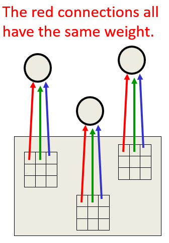
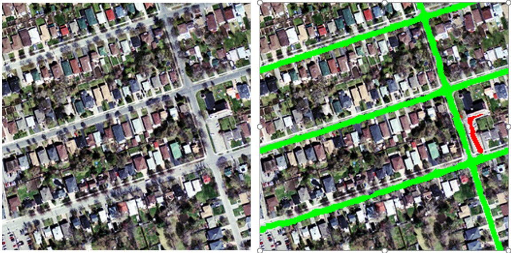
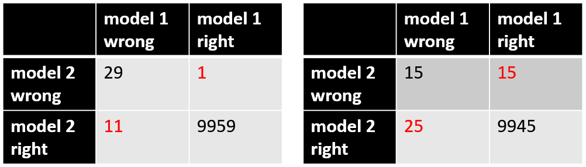

# Convolutional Neural Network

## Object Recognition and Classification

+ [Issues about object recognition](../ML/MLNN-Hinton/05-CNN.md#lecture-notes)
  + Segmentation: real scenes cluttered with other objects
  + Lighting: intensities of pixels determined by the nature of the object
  + Deformation: deforming objects in various non-affine ways
  + Affordances: the quality or property of an object that defines its possible uses or makes clear how it can or should be used
  + Viewpoint: 3-D object w/ variety of viewpoints

+ [Dimension-hopping phenomenon](../ML/MLNN-Hinton/05-CNN.md#lecture-notes):
  + info jumping from one input dimension to another
  + e.g., age and weight of a patient are inputs

+ [Image classification](../ML/MLNN-Hinton/a10-CNNsGuide.md#the-problem-space):
  + the task of taking an input image and outputting a class (a cat, dog, etc) or a probability of classes that best describes the image
  + humans: one of the first skills learned from the moment we are born and one that comes naturally and effortlessly as adults
    + able to immediately characterize the scene and give each object a label, all without even consciously noticing
    + able to quickly recognize patterns, generalize from prior knowledge, and adapt to different image environments

## Solutions for Viewpoint Invariance

+ [Viewpoint invariance](../ML/MLNN-Hinton/05-CNN.md#lecture-notes-1)
  + one of the main difficulties in making computers perceive
  + still no accepted solutions
  + Approaches
    + redundant invariant features
    + a box around the object w/ normalized pixels
    + convolutional neural networks by replicating features with pooling
    + hierarchy of parts that have explicit poses relative to the camera

+ [Redundant invariant feature approach](../ML/MLNN-Hinton/05-CNN.md#lecture-notes-1)
  + extract a large, redundant set of invariant features under transformations
  + with enough invariant features, only one way to assemble them into an object
  + avoid forming features from parts of different objects

+ [Judicious normalization approach](../ML/MLNN-Hinton/05-CNN.md#lecture-notes-1)
  + putting a box around the object
  + using the box as a coordinate frame for a set of normalized pixels
  + solving the dimension-hopping problem
    + correctly choosing the box results in the same normalized pixels for the same part of an object
    + any box providing invariant to many degrees of freedom: translation, rotation, scale, shear, stretch, ...
  + Issues
    + segmentation errors
    + occlusion
    + unusual orientations
  + chicken-egg problem: getting the box right $\leftrightarrow$ recognizing the shape
  + Human recognizes the letter before doing mental rotation to decide if it's a mirror image

+ [Brute force normalization approach](../ML/MLNN-Hinton/05-CNN.md#lecture-notes-1)
  + Using well-segmented, upright images to fit the correct box for training
  + Designing period - try all possible boxes in a range of positions and scales

## Replicated Feature Approach

+ [The replicated feature approach](../ML/MLNN-Hinton/05-CNN.md#lecture-notes-2)
  + using many different copies of the same feature detector w/ different positions
  + using several different feature types, each with its own map of replicated detectors
  + Example

    

      
    

+ [Backpropagation with weight constraints](../ML/MLNN-Hinton/05-CNN.md#lecture-notes-2)
  + modify the backpropagation algorithm to incorporated linear constraints btw the weights for replicated features
  + compute the gradients as usual
  + modify the gradients to satisfy the constraints
  + once the weights satisfying the linear constrains, they continue satisfying the linear constrain after weight update

+ [Replicated feature](../ML/MLNN-Hinton/05-CNN.md#lecture-notes-2)
  + not translation invariant
  + Equivariant activities
    + replicated features not make the neural activities invariant to translation
    + activities equivalent
  + Invariant knowledge
    + a feature useful in some locations during training $\to$ the feature available in all locations during testing
    + knowing how to detect a feature in one place $\to$ knowing how to detect same feature in another place

+ [Pooling for invariant activities](../ML/MLNN-Hinton/05-CNN.md#lecture-notes-2)
  + to achieve some invariance in the activities, pull the outputs of replicated feature detectors
  + get a small amount of translational invariance at each level by averaging four neighboring replicated detectors to give a single output to the next level
  + slightly better to take the maximum of the four neighboring feature detectors than averaging them
  + Problem: lost information about the precise positions of things after several levels of pooling
  + impossible to use the precise spatial relationships btw high-level parts for recognition

## Transfer Learning

+ [Transfer learning](../ML/MLNN-Hinton/a10-CNNsGuide.md#transfer-learning)
  + the process of taking a pre-trained model (the weights and parameters of a network that has been trained on a large dataset by someone else) and "fine-tuning" the model with own dataset
  + pre-trained model acting as a feature extractors
  + Procedure
    + remove the last layer of the network and replace it with own classifier (depending on what your problem space is)
    + freeze the weights (not  changing the weights during gradient descent/optimization) of all the other layers and train the network normally

+ [Example w/ pre-trained on ImageNet](../ML/MLNN-Hinton/a10-CNNsGuide.md#transfer-learning)
  + ImageNet containing 14 million images with over 1,000 classes
  + lower layers of the network detecting features like edges & curves
  + unless very unique problem space and dataset, network needs to detect curves and edges as well
  + using the weights of the pre-trained model (and freeze them) and focus on the more important layers (ones higher up) for training
  + dataset quite different than something like ImageNet, just train more of your layers and freeze only a couple of the low layers

## Other Models

### Generative Adversarial Networks (2014)

+ I. Goodfellow, et. al., [Generative Adversarial Nets](https://arxiv.org/pdf/1406.2661v1.pdf), 2014
  + The next big development - Yann LeCun

+ [Example](../ML/MLNN-Hinton/a11-9Papers.md#generative-adversarial-networks-2014)
  + taking an example image and applying a perturbation, or a slight modification
  + the prediction error maximized
  + the object category of the prediction changes, while the image itself looks the same when compared to the image without the perturbation

  

    
  

  + ConvNet makes drastic errors in classification even the difference btw the images imperceptible to human

+ C. Szegedy, et. al., [Intriguing properties of neural networks](https://arxiv.org/pdf/1312.6199v4.pdf)

+ [Generative adversarial networks](../ML/MLNN-Hinton/a11-9Papers.md#generative-adversarial-networks-2014)
  + consisting of two models
    + a generative model
    + a discriminative model
  + generative model
    + determining whether a given image looks natural (an image from the dataset) or artificially created
    + similar to "a team of counterfeiters, trying to produce and use fake currency"
    + the generator trying to fool the discriminator
  + discriminative model
    + creating images so that the discriminator gets trained to produce the correct outputs
    + similar to "the police, trying to detect the counterfeit currency"
    + the discriminator trying to not get indistinguishable the genuine articles

+ [Why it's important](../ML/MLNN-Hinton/a11-9Papers.md#generative-adversarial-networks-2014)
  + the discriminator is aware of the "internal representation of the data"
  + the discriminator trained to understand the differences btw real images from the dataset and artificially created ones
  + used as a feature extractor using in CNN

### Region Based CNNs (R-CNN - 2013, Fast R-CNN - 2015, Faster R-CNN - 2015)

+ Articles
  + R. Girshick, J. Donahue, T. Darrell, and J. Malik, [Rich feature hierarchies for accurate object detection and semantic segmentation](https://arxiv.org/pdf/1311.2524v5.pdf), 2013
  + R. Girshick, [Fast R-CNN](https://arxiv.org/pdf/1504.08083.pdf), 2015
  + S. Ren, K. He, R. Girshick, and J. Sun, [Faster R-CNN: Toward Real-Time Object Detection with Region Proposal Networks](https://arxiv.org/pdf/1504.08083.pdf), 2015

+ [R-CNN](../ML/MLNN-Hinton/a11-9Papers.md#region-based-cnns-r-cnn---2013-fast-r-cnn---2015-faster-r-cnn---2015)
  + one of the most impactful advancement in computer vision
  + Fast R-CNN and Faster R-CNN: making the model faster and better for modern object detection tasks
  + Purpose of R-CNNs
    + solving the problem of object detection
    + able to draw bounding boxes over all the objects
  + split into two general components:
    + the region proposal step
    + the classification step

+ [Region proposal method](../ML/MLNN-Hinton/a11-9Papers.md#region-based-cnns-r-cnn---2013-fast-r-cnn---2015-faster-r-cnn---2015)
  + any class agnostic region proposal method should fit
  + Selective Search:
    + J. Uijlings, K. van de Sande, T. Gevers, and A. Smeulders, [Selective Search for Object Recognition](https://ivi.fnwi.uva.nl/isis/publications/2013/UijlingsIJCV2013/UijlingsIJCV2013.pdf)
    + used in particular for R-CNN
  + perform the function of generating 2000 different regions that have the highest probability of containing an object
  + obtained a set of region proposals
  + proposals wrapped into an an image size that can be fed into a trained CNN (AlexNet in this case) that extracts a feature vector of each region
  + vector used as the input to a set of linear SVMs trained for each class and output a classification
  + the vector gets into a bounding box regressor to obtain the most accurate coordinates

  

    
  

  + non-maxima suppression: used to suppress bounding boxes that have a significant overlap with each other

+ [Fast R-CNN](../ML/MLNN-Hinton/a11-9Papers.md#faster-r-cnn)
  + R-CNN problems
    + multiple stages (ConvNets to SVMs to bounding box regressors)
    + computationally expensive
    + extremely slow: R-CNN - 53 seconds per image
  + Fast R-CNN
    + able to solve the problem of speed
    + basically sharing computation of convolutional layers between different proposals and swapping the order of generating region proposals and running th CNN
    + first fed through a ConvNet to obtain features of the region proposals from the last feature map of the ConvNet
    + lastly connected layers as well as regression and classification heads

    

      
    

+ [Faster R-CNN](../ML/MLNN-Hinton/a11-9Papers.md#faster-r-cnn)
  + Combat the complex training pipeline that both R-CNN and Fast R-CNN exhibited
  + inserting a region proposal network (RPN) after the last convolutional layer
  + able to just look at the last convolutional feature map and produce region proposals from that
  + the same pipeline as R-CNN used (ROI pooling, FC, and then classification and regression heads)

+ [What it's Important](../ML/MLNN-Hinton/a11-9Papers.md#what-its-important)
  + able to determine that a specific object in an image is one thing, but able to determine that object's exact location is a huge jump in knowledge for the computer
  + Fast R-CNN: the standard for object detection programs today

### Generating Image Descriptions (2014)

+ Articles
  + A. Karpathy and F. Li, [Deep visual semantic alignment for Generating Image Descriptions](https://arxiv.org/pdf/1412.2306v2.pdf), 2015
  + A. Karpathy, A. Joulin and F. Li, [Deep fragment embeddings for bidirectional image sentence mapping](https://arxiv.org/pdf/1406.5679v1.pdf), 2014

+ Combining CNNs and bidirectional RNNs (Recurrent Neural Networks) to generate natural language descriptions of different image regions

+ Example of Generating image descriptions

  

    
  

+ [Comparison w/ normal CNNs](../ML/MLNN-Hinton/a11-9Papers.md#generating-image-descriptions-2014)
  + traditional CNNs: a single clear label associated with each image in the training data
  + image descriptions:
    + having a sentence (or caption) associated with each image
    + weak label: segments of the sentence refer to (unknown) parts of the image

+ [Generating image descriptions](../ML/MLNN-Hinton/a11-9Papers.md#generating-image-descriptions-2014)
  + Using this training data, a deep neural network "infers the latent alignment between segments of the sentences and the region that they described".
  + Another neural network takes in the image as input and generates a description in text.
  + Two components: alignment and generation

+ [Alignment model](../ML/MLNN-Hinton/a11-9Papers.md#alignment-model)
  + goal: align the visual and textual data
  + Alignment model
    + input: an image and a sentence
    + output: a score for how well they match
    + trained on compatible and incompatible image-sentence pairs
  + Representation:
    + information about image
      + feeding the image into an R-CNN to detect the individual objects
      + trained on ImageNet data
      + the top 19 (plus the original image) object regions are embedded to a 500 dimensional space
      + having 20 different 500 dimensional vectors for each image
    + information about the sentence
      + embedding words into the same multimodal space
      + using a bidirectional recurrent neural network
      + illustrating information about the context of words in a given sentence
    + information about the picture and the sentence in the same space
    + compute inner products to show a measure of similarity

+ [Generative Model](../ML/MLNN-Hinton/a11-9Papers.md#generative-model)
  + the main purpose of creating a dataset where you have a set of image regions (found by the R-CNN) and corresponding text (BRNN)
  + learning from that dataset to generate descriptions given an image
  + taking in an image abd feeding it through a CNN
  + softmax layer: disregarded as the outputs of the fully connected layer become the inputs to another RNN
  + RNN: the function basically form probability distributions on the different words in a sentence

  

    
  

+ [What it's Important](../ML/MLNN-Hinton/a11-9Papers.md#what-its-important-1)
  + Using seemingly different RNN and CNN models to create a very useful application that in a way combines the fields of Computer Vision and Natural Language Processing
  + New idea in terms of how to make computers and models smarter when dealing with tasks that cross different fields

### Vald Mnih (ICML 2012) - Finding roads

+ [Finding Roads](../ML/MLNN-Hinton/05-CNN.md#lecture-notes-3)
  + extra roads from cluttered aerial images of urban scenes
  + Objective: predicting a binary road label for the central 16x16 pixels

+ [Modeling for finding roads](../ML/MLNN-Hinton/05-CNN.md#lecture-notes-3)
  + a non-convolutional net w/ local fields and multiple layers of rectified linear units
  + lots of labeled training data available for this task
  + Difficulties
    + occlusion by buildings trees and cars
    + shadows, lighting changes
    + minor viewpoint changes
  + Worse problems: incorrect labels
    + badly registered maps: a pixel ~ 1 squared meter
    + arbitrary decisions about what counts as a road and what counts as a laneway
  + Only hope: trained on big image patches w/ millions of examples
  + Examples

    

      
    

    + green line: the correct answer
    + red lines: incorrect answer

## Hyperparameters

+ [Parameters to choose](../ML/MLNN-Hinton/a10-CNNsGuide.md#choosing-hyperparameters)
  + How do we know how many layers to use?
  + How many convolution layers?
  + What are the filter sizes?
  + What are the values for stride and padding?

+ [Considerations](../ML/MLNN-Hinton/a10-CNNsGuide.md#choosing-hyperparameters)
  + not trivial questions and there isn’t a set standard that is used by all researchers
  + depend on the type of data that you have
  + find the right combination that creates abstractions of the image at a proper scale

### Stride and Padding

+ [Stride](../ML/MLNN-Hinton/a10-CNNsGuide.md#relu-rectified-linear-units-layers)
  + control how the filter convolves around the input volume
  + the filter convolves around the input volume by shifting one unit at a time
  + The amount by which the filter shifts is the stride.
  + the output volume is an integer and not a fraction

+ [Padding](../ML/MLNN-Hinton/a10-CNNsGuide.md#relu-rectified-linear-units-layers)
  + applying convolution layers, the size of the volume decreasing faster than expected
  + preserve as much information about the original input volume to extract those low level features
  + zero padding pads the input volume with zeros around he border
  + Set the size of zero padding

    \[zero padding = \frac{(K - 1)}{2}\]

    + $K$ = filter size
    + input & output w/ the same spatial dimensions
  + formula for calculating the output size for any given convolutional layer

    \[o = \frac{(W - K - 2P}{S} + 1\]

    + $O$ = the output height/length
    + $W$ = the input height/length
    + $K$ = filter size
    + $P$ = the padding
    + $S$ = the stride

### ReLU (Rectified Linear Units) Layers

+ [nonlinear layer (or activation layer)](../ML/MLNN-Hinton/a10-CNNsGuide.md#relu-rectified-linear-units-layers)
  + introduce nonlinearity to system that basically has been computing linear operations during the convolutional layer
  + linear operation: element wise multiplications and summations
  + nonlinearity: tanh, sigmoid, and ReLU
  + increasing the nonlinearity properties of the model and the overall network without affecting the receptive fields of the convolutional layer

+ [Rectified Linear Units](../ML/MLNN-Hinton/a10-CNNsGuide.md#relu-rectified-linear-units-layers)
  + working far better
  + able to train a lot faster (computational efficiency) w/o making a significant difference to the accuracy
  + alleviating the vanishing gradient problem
  + applying yje function $f(x) = \max(0, x)$ to all of the values in the input volume

+ [Vanishing gradient issue](../ML/MLNN-Hinton/a10-CNNsGuide.md#relu-rectified-linear-units-layers)
  + the lower layers of the network training very slowly
  + the gradient decreasing exponentially through the layers
  + Wiki, [Vanishing gradient problem](https://en.wikipedia.org/wiki/Vanishing_gradient_problem)
  + Quora, [https://www.quora.com/What-is-the-vanishing-gradient-problem](https://www.quora.com/What-is-the-vanishing-gradient-problem)

### Pooling Layers

+ [Pooling layer](../ML/MLNN-Hinton/a10-CNNsGuide.md#pooling-layers)
  + a downsampling layer
  + maxipooling being the most popular option
    + taking a filter (normally of size 2x2) and a stride of the same length
    + applied to the input volume and outputs the maximum number in every subregion that the filter convolves
  + other options: average pooling and L2-norm pooling
  + intuitive reasoning: knowing a specific feature in the origin input volume, its exact location is not as important as its relative location to the other features
  + drastically reducing the spatial dimension (the length and the width change but not the depth) of the input volume
  + purposes:
    + the amount of parameters or weights reduced by 75%, thus lessening the computation cost
    + control overfitting
      + model tuned to the training examples that sre not able to generalize well for the validation and test sets
      + eg., a model getting 100% or 99% on the training set, but only 50% on the test data

  

### Dropout Layers

+ [Dropout layers](../ML/MLNN-Hinton/a10-CNNsGuide.md#dropout-layers)
  + a very specific function in neural networks
  + randomly drop out a set of activations by setting them to zero
  + forcing the network to be redundant
  + able to provide the right classification or output a specific example even if some of the activations are dropped out
  + ensuring the network not too "fitting" to the training data and to alleviate the overfitting problem
  + only used during training not during test time

### Network in Network layers

+ [Network in Network Layers](../ML/MLNN-Hinton/a10-CNNsGuide.md#network-in-network-layers)
  + a convolutional layer where a 1 x 1 size filter is used
  + receptive fields normally larger than space they map to
  + a 1 x 1 x N convolution where N is the number of filters applied in the layer
  + performing a N-D element-wise multiplication where $N$ = the depth of the input volume into the layer

## Application - Hand-written Recognition

### Le Net (Yann LeCun & collaborators)

+ [Objective](../ML/MLNN-Hinton/05-CNN.md#lecture-notes-2)
  + a really good recognizer for hand-written digits
  + using backpropagation in feed-forward net

+ [Architecture](../ML/MLNN-Hinton/05-CNN.md#lecture-notes-2)
  + many hidden layers
  + many maps of replicated units in each layer
  + pooling of the outputs of nearby replicated units btw layers
  + a wide net able to cope with several characters at once even if they overlap
  + no segmented individual characters required before fed into the net
  + a clever way of training a complete system, not just a recognizer for individual characters
  + maximum margined method: way before maximum margin invented
  + input: (A)
  + feature maps (c1)
  + Subsampling/pooling

  

    
  

+ [Priors and Prejudice](../ML/MLNN-Hinton/05-CNN.md#lecture-notes-2)
  + design appropriately by applying prior knowledge about the task into the network
  + using prior knowledge to create a more training data
  + allowing optimization to discover clever ways of using the multilayer network

### Brute Force Approach for Hand-written Recognition

+ [Brute force approach](../ML/MLNN-Hinton/05-CNN.md#lecture-notes-2)
  + Designing LeNet w/ the invariant knowledge
    + local connectivity
    + weight-sharing
    + pooling
  + about 80 errors w/ origin LeNet

+ [Ciresan et. al. net (2010)](../ML/MLNN-Hinton/05-CNN.md#lecture-notes-2)
  + applying knowledge of invariance
  + creating a huge amount of carefully designed extra training data (synthetic data)
  + producing many new training examples by applying many different transformations on each training image
  + train a large deep, dumb net on a GPU w/o much overfitting
  + 3 tricks used to prevent from overfitting when generating synthetic data
  + Achieving about 35 errors

### Measurement for Hand-written Recognition

+ [McNemar test](../ML/MLNN-Hinton/05-CNN.md#lecture-notes-2)
  + using the particular errors in diagrams
  + much more powerful than a test counting the numbers of errors

+ [Example](../ML/MLNN-Hinton/05-CNN.md#lecture-notes-2)

  

    
  

### Spatial Transformer Networks (2015)

+ M. Jaderberg, K. Simonyan, A. Zisserman, and K. Kavukcuoglu, [Spatial Transformer Networks](https://arxiv.org/pdf/1506.02025.pdf), 2016
  + The basic idea: transform the input image in a way so that the subsequent layers have an easier time making a classification
  + issue: making changes on image before fed into the specific convolutional layer
  + this module intends to correct: pose normalization (scenarios where the object is tilted or scaled) and spatial attention (brining attention to the correct object in a crowded image)
  + traditional CNNs: make model invariant to images with different scales and rotations requiring a lot of training examples for the model to learn properly

+ [Spatial transformer](../ML/MLNN-Hinton/a11-9Papers.md#spatial-transformer-networks-2015)
  + traditional CNN models
    + the maxpooling layer dealing with spatial invariant
    + knowing a specific feature in the original input volume
    + relative location not as important as exact location
  + dynamically to produce different behavior (different distortions/transformations) for each input image
  + module components
    + localization network
      + take input volume and output parameters of the spatial transformation applied
      + parameters $\theta$: 6 dimensions for an affine transformation
    + grid generator
      + creation of a sampling grid
      + the result of wrapping the regular grid with affine transformation ($\theta$) created in the localization network
    + sampler: perform a wrapping of the input feature map
  + the module dropped into a CNN at any point and basically helps the network learn how to transform feature maps in a way that minimizes the cost function during training
  + example of spatial transformer

  

    
  

+ [What it's important](../ML/MLNN-Hinton/a11-9Papers.md#spatial-transformer-networks-2015)
  + improvements in CNN's not necessarily from changes in network architecture
  + the simple idea of making affine transformations to the input image to help models become more invariant to translation, scale, and rotation
  + [video](https://drive.google.com/file/d/0B1nQa_sA3W2iN3RQLXVFRkNXN0k/view) from Deepmind w/ a great animation of the results of placing a Spatial Transformer module in CNN
  + Quora [discussion](https://www.quora.com/How-do-spatial-transformer-networks-work)

## Application - Object Classification

### Problem Space and Analogy

+ [Objective](../ML/MLNN-Hinton/a10-CNNsGuide.md#what-we-want-the-computer-to-do)
  + able to differentiate between all the images it’s given and figure out the unique features that make a dog a dog or that make a cat a cat
  + able perform image classification by looking for low level features such as edges and curves, and then building up to more abstract concepts through a series of convolutional layers

+ [Input](../ML/MLNN-Hinton/a10-CNNsGuide.md#inputs-and-outputs)
  + Image: an array of pixel values
  + resolution & size: e.g., 32 x 32 x 3 (RGB) array of numbers
  + intensity at a point: values from 0 to 255

+ Output: the probability of the image being a certain class

+ [Basis behind CNNs](../ML/MLNN-Hinton/a10-CNNsGuide.md#biological-connection): specialized components inside of a system having specific tasks (the neuronal cells in the visual cortex looking for specific characteristics) is one that machines use as well

### Modeling for the CNN for Object Classification

  

+ [Typical convolutional network](../ML/MLNN-Hinton/a10-CNNsGuide.md#going-deeper-through-the-network)
  + A classic CNN architecture

    input $\rightarrow$ Conv $\to$ ReLU $\to$ Conv $\to$ ReLU $\to$ Pool $\to$ ReLU $\to$ Conv $\to$ ReLU $\to$ Fully Connected

  + The first convolutional layer
    + filters in this layer designed to detect
    + detect low level features such as edges and curves
  + network needs to recognize higher level features such as hands or paws or ears
  + 2nd convolutional layer
    + the output of the first convolutional layer as the input
    + input of 1st convolutional layer: original image
    + input of 2nd convolutional layer: activation map of 1st convolutional layer
  + each layer of the input is basically describing the locations in the original image for where certain low level features appear.
  + output of higher level features: semicircles (combination of a curve and straight edge) or squares (combination of several straight edges)
  + activation maps that represent more and more complex features as more convolutional layer went through
  + as deeper into the network, the filters w/ a larger and larger receptive
  + able to consider information from a larger area of the original input volume (more responsive to a larger region of pixel space)

+ [First convolutional layer](../ML/MLNN-Hinton/a10-CNNsGuide.md#first-layer---math-part)
  + always the first layer in CNNs
  + remember what the input to this convolutional layer is
  + Definition
    + __filter__: the flashlight (or sometimes referred to as a neuron or a kernel)
    + __receptive field__: the region shining over
    + __weights__ or __parameters__: numbers containing in the filter
    + __convolving__: sliding
    + __activation map__ or __feature map__: all the numbers of multiplications
  + Analogy for convolutional layer
    + a flashlight that is shining over the top left of the image
    + flashlight sliding across all the areas of the input image
    + the depth of this filter has to be the same as the depth of the input
    + multiplying the values in the filter with the original pixel values of the image (aka computing element wise multiplications)
    + summed up all multiplications

+ [Spatial dimension concern](../ML/MLNN-Hinton/a10-CNNsGuide.md#first-layer---math-part)
  + using more filters to preserve the spatial dimensions better
  + The more filters, the greater the depth of the activation map, and the more information about the input volume.
  + eg. total output volume: 28 x 28 x 2 with 2 filters

+ [Interpretation of the first layer](../ML/MLNN-Hinton/a10-CNNsGuide.md#first-layer---high-level-perspective)
  + feature identifier = filter
  + features: straight edges, simple colors, and curves
  + curve detector: a pixel structure w/ higher numerical values along the area that is a shape of a curve

+ [Example for first layer](../ML/MLNN-Hinton/a10-CNNsGuide.md#first-layer---high-level-perspective)
  + feature identifier: 7 x 7
  + put filter at the top left corner
  + multiply the values in the filter with the original pixel values of the image
  + remove receptive field with the filter (summed multiplication = 0)
  + activation map: the output of this convolutional layer (26 x 26 x 1)
  + The filters on the first layer convolve around the input image and “activate” (or compute high values) when the specific feature it is looking for is in the input volume.

+ [Fully connected layer](../ML/MLNN-Hinton/a10-CNNsGuide.md#fully-connected-layer)
  + end of the network
  + input volume: whatever the output is of the convolutional or ReLU or pool layer preceding it
  + outputs: an N dimensional vector where N is the number of classes that the program has to choose from
  + look at the output of the previous layer and determine which features most correlate to a particular class
  + what high level features most strongly correlate to a particular class
  + particular weights so that when you compute the products between the weights and the previous layer
  + get the correct probabilities for the different classes

### Training the CNN for Object Classification

+ [Backpropagation procedure](../ML/MLNN-Hinton/a10-CNNsGuide.md#training-aka-what-makes-this-stuff-work)
  + forward pass
  + loss function
  + backward pass
  + weight update

+ [Forward pass](../ML/MLNN-Hinton/a10-CNNsGuide.md#training-aka-what-makes-this-stuff-work)
  + take a training image, eg, 32 x 32 x 3 array of numbers
  + pass through the whole network

+ [Loss function](../ML/MLNN-Hinton/a10-CNNsGuide.md#training-aka-what-makes-this-stuff-work)
  + training data w/ image and label
  + Definition: commonly used MSE (mean squared error)

    \[E_{total} = \sum \frac{1}{2} (target - output)^2\]

  + expect the predict label (output of the ConvNet) same as the training data
  + a.k.a. minimize the amount of loss
  + visualizing as an optimization problem
  + the mathematical equivalent of a $dL/dW$ where $W$ = weights at a particular layer

+ [Backward pass & weight update](../ML/MLNN-Hinton/a10-CNNsGuide.md#training-aka-what-makes-this-stuff-work)
  + determining which weights contributed most to the loss and finding ways to adjust them to make the loss decreases
  + using the derivative to do weight update
  + Gradient descent

    \[w = w_i - \eta \frac{dL}{dW}\]

    + $w$ = weight
    + $w_i$ = initial weight
    + $\eta$ = learning rate

+ [Learning rate](../ML/MLNN-Hinton/a10-CNNsGuide.md#training-aka-what-makes-this-stuff-work)
  + a parameter chosen by the programmer
  + high learning rate
    + bigger step taken in the weight update
    + less time for the model to converge on an optimal set ot weight
    + too high result in large jump
    + no precise enough to reach the optimal point
  + low learning rate
    + smaller step taken in the weight update
    + make the convergence too slow

+ [Process](../ML/MLNN-Hinton/a10-CNNsGuide.md#training-aka-what-makes-this-stuff-work)
  + one training iteration: forward pass, loss function, backward pass and parameter update
  + repeat the process for a fixed number iterations for each set of training images (commonly called a batch)
  + hopefully yje weights of the layers tuned correctly once the parameter update on the last training example

### Testing of the CNN for Object Classification

+ [to verify whether or not CNN works](../ML/MLNN-Hinton/a10-CNNsGuide.md#testing)
  + a different set of images and labels
  + pass the images through the CNN
  + compare the outputs to the ground truth

## CNN for Object Recognition

### Overview of Object Recognition

+ [3-D object recognition](../ML/MLNN-Hinton/05-CNN.md#lecture-notes-3)
  + object recognition more complicated than hand-written digits
  + convolutional neural network work for 3-D color object?

+ [ILSVRC competition on ImageNet](../ML/MLNN-Hinton/05-CNN.md#lecture-notes-3)
  + dataset: a subset with 12 million high-resolution training images
  + classification task
    + 1000 classes
    + images manually labeled but not reliable
    + images could contain 2 or more objects but only one labeled
    + get the "correct" class in the top 5 bets
  + localization task
    + many computer vision systems using a bag of features approach for the whole image or said a quadrant of the image
    + knowing what features are but w/o knowing where they are
    + balance syndrome: a curious kind of brain damage recognizing objects w/o knowing where they are
    + put a box around the object for each bet
    + at least 50% overlap with the correct box

### AlexNet (2012)

+ A. Krizhevsky, I. Sutskever, and G. Hinton, [ImageNet Classification with Deep Convolutional Neural Networks](https://papers.nips.cc/paper/4824-imagenet-classification-with-deep-convolutional-neural-networks.pdf)
  + using a CNN
  + achieving a top 5 test error rate of 15.4%

+ [Architecture](../ML/MLNN-Hinton/05-CNN.md#lecture-notes-3)
  + 7 hidden layers not counting max pooling layers
  + early layers: convolutional reducing
  + last two layers: globally connected using most of parameters

+ [Activation functions](../ML/MLNN-Hinton/05-CNN.md#lecture-notes-3)
  + Rectified linear units (ReLU) in every hidden layer
  + Competitive normalization with a layer

+ [Generalization tricks](../ML/MLNN-Hinton/05-CNN.md#lecture-notes-3)
  + Transformations to enhance the training data
  + Dropout - regularizing the weights

+ [Architecture](../ML/MLNN-Hinton/a11-9Papers.md#alexnet-2012)
  + 5 convolutional layers
  + max-pooling layers
  + dropout layers
  + 3 fully connected layers

  

    
  

+ [Main Points](../ML/MLNN-Hinton/a11-9Papers.md#alexnet-2012)
  + training on ImageNet w/ 15 million annotated images from a total of over 22,000 categories
  + used ReLU for nonlinearity functions
  + used data argumentation techniques w/ image translations, horizontal reflections, and patch extractions
  + implemented dropout layers to combat the problem of overfitting to the training data
  + trained the model using batch stochastic gradient descent, w/ specific values for momentum and weight decay
  + trained on 2 GTX 580 GPUs for 5 or 6 days

### ZF Net (2013)

+ M. Zeiler and R. Fergus, [Visualizing and Understanding Convolutional Networks](https://arxiv.org/pdf/1311.2901v3.pdf)
  + a large increase in the number of CNN models
  + model achieved an 11.2% error rate
  + developed some very keys ideas about improving performance
  + a good amount of time explaining a lot of the intuition behind ConvNets and showing how to visualize the filters and weights correctly
  + the renewed interest in CNNs is due to the accessibility of large training sets and increased computational power with the usage of GPUs
  + the limited knowledge that researchers had on inner mechanisms of these models, saying that without this insight, the “development of better models is reduced to trial and error”
  + main contributions: details of a slightly modified AlexNet model and a very interesting way of visualizing feature maps

+ [Architecture](../ML/MLNN-Hinton/a11-9Papers.md#zf-net-2013)

  

    
  

+ [Main Points](../ML/MLNN-Hinton/a11-9Papers.md#zf-net-2013)
  + Very similar architecture to AlexNet, except for a few minor modifications.
  + AlexNet trained on 15 million images, while ZF Net trained on only 1.3 million images.
  + using filters of size 7x7 and a decreased stride value in the first layer instead of using 11x11 sized filters
    + a smaller filter size in the first convolutional layer helps retain a lot of original pixel information in the input volume
    + skipping a lot of relevant information
  + a rise in the number of filters used as the network growth
  + using ReLUs for their activation functions, cross-entropy loss for the error function, and trained using batch stochastic gradient descent
  + training on a GTX 580 GPU for twelve days
  + Developed a visualization technique named Deconvolutional Network
    + help to examine different feature activations and their relation to the input space
    + deconvnet: mapping features to pixels (the opposite of what a convolutional layer does)

+ [DeConvNet](../ML/MLNN-Hinton/a11-9Papers.md#zf-net-2013)
  + at every layer of the trained CNN, attach a “deconvnet” which has a path back to the image pixels
  + forward pass: an input image is fed into the CNN and activations are computed at each level
  + examine the activations of a certain feature in the 4th convolutional layer
  + store the activations of this one feature map, but set all of the other activations in the layer to 0
  + pass this feature map as the input into the deconvnet
  + this deconvnet has the same filters as the original CNN
  + the input then goes through a series of unpool (reverse maxpooling), rectify, and filter operations for each preceding layer until the input space is reached

+ [Demo of DeConvNet](https://www.youtube.com/watch?v=ghEmQSxT6tw)

+ Why It’s Important
  + provide great intuition as to the workings on CNNs and illustrated more ways to improve performance
  + visualization approach: not only to explain the inner workings of CNNs, but also provides insight for improvements to network architectures

### VGG Net (2014)

+ K. Simonyan and A. Zisserman, [Very Deep Convolutional Networks for Large-scale Image Recognition](https://arxiv.org/pdf/1409.1556v6.pdf)
  + the winners of ILSVRC 2014, best utilized with its 7.3% error rate
  + Architecture: a 19 layer CNN that strictly used 3x3 filters with stride and pad of 1, along with 2x2 maxpooling layers with stride 2

+ [Main points](../ML/MLNN-Hinton/a11-9Papers.md#vgg-net-2014)
  + use of only 3x3 sized filters
    + the combination of two 3x3 convolutional layers has an effective receptive field of 5x5
    + simulating a larger filter while keeping the benefits of smaller filter sizes
    + benefit: a decrease in the number of parameters
    + with two convolutional layers, able to use two ReLU layers instead of one
  + 3 convolutional layers back to back have an effective receptive field of 7x7
  + As the spatial size of the input volumes at each layer decrease (result of the convolutional and pool layers), the depth of the volumes increase due to the increased number of filters as you go down the network.
  + the number of filters doubles after each maxpool layer, reinforcing the idea of shrinking spatial dimensions, but growing depth
  + worked well on both image classification and localization tasks, used a form of localization as regression
  + built model with the Caffe toolbox
  + used scale jittering as one data augmentation technique during training
  + used ReLU layers after each convolutional layer and trained with batch gradient descent
  + trained on 4 Nvidia Titan Black GPUs for two to three weeks

+ [Why It’s Important](../ML/MLNN-Hinton/a11-9Papers.md#vgg-net-2014)
  + one of the most influential papers
  + reinforcing the notion that convolutional neural networks have to have a deep network of layers in order for this hierarchical representation of visual data to work

### GoogLeNet (2015)

+ C. Szegedy, et. al., [Going Deeper with Convolutions](https://www.cv-foundation.org/openaccess/content_cvpr_2015/papers/Szegedy_Going_Deeper_With_2015_CVPR_paper.pdf)

+ [GoogLeNet: a 22 layer CNN](../ML/MLNN-Hinton/a11-9Papers.md#googlenet-2015)

  

    
    
  

  + a top 5 error rate of 6.7%
  + one of the first CNN architectures that really strayed from the general approach of simply stacking conv and pooling layers on top of each other in a sequential structure
  + this new model places notable consideration on memory and power usage

+ [Inception module](../ML/MLNN-Hinton/a11-9Papers.md#inception-module)

  

    
    
  

  + Previous layer (bottom green box): input
  + Filter concatenation (top green box): output
  + traditional ConvNet:make a choice of whether to have a pooling operation or a convolutional operation (the choice of filter size)
  + Inception module: perform all of these operations in parallel

+ [Naive inception module vs. Inception Module](../ML/MLNN-Hinton/a11-9Papers.md#inception-module)
  + Naive inception module: too many output end up with extremely large depth channel for the output volume
  + 1x1 convolutions: providing a method of dimensionality reduction
  + eg., an input volume of 100x100x60 and applying 20 filters of 1x1 convolution would reduce the volume to 100x100x20
  + Adding 1x1 convolutional operations before the 3x3 adn 5x5 layers $\longrightarrow$ the 3x3 and 5x5 convolutions won't have as large of a volume to deal with.
    + Analogy: a "pooling of features" - reducing the depth of the volume
    + Similar to how er reduce the dimensions of height and width with normal maxpooling layers.
  + 1x1 convolutional layers followed by ReLU units
    + [the effectiveness of 1x1 convolutions](http://iamaaditya.github.io/2016/03/one-by-one-convolution/)
    + [visualization of the filter concatenation](https://www.youtube.com/watch?v=VxhSouuSZDY)

+ [How dows this architecture help?](../ML/MLNN-Hinton/a11-9Papers.md#inception-module)
  + a module consisting of a network in network layer, a medium sized filter convolution and a pool operation
  + network in network convolution: able to extract information about the very find grain details in the volume
  + the 5x5 filter: able to cover a large receptive field of the input and thus able to extract its information as well
  + pooling operation: reducing spatial sizes and combating overfitting
  + ReLU: improving the nonlinearity of the network
  + able to perform the functions of these different operations and still remain computationally considerate

+ [Main Points](../ML/MLNN-Hinton/a11-9Papers.md#main-points)
  + used 9 inception modules in the whole architectures, with over 100 layers in total.
  + no use of fully connected layers
  + using an average pool instead, to go from a 7x7x1024 volume to a 1x1x1024 volume
  + using 12x fewer parameters than AlexNet
  + during testing, multiple corps of the same image were created, fed into the network and the maxsoft probabilities were averages to give us the final solution
  + utilized concepts from R-CNN for their detection module
  + there are updated versions to the Inception module 9version 6 & 7)
  + trained on a few high-end GPUs within a week

+ [Why it's important](../ML/MLNN-Hinton/a11-9Papers.md#why-its-important)
  + one of the first models that introduced the idea that CNN layers didn't always have to stacked up sequentially
  + the Inception module: a creative structuring of layers can lead to improved performance and computationally efficiency

### Microsoft ResNet (2015)

+ K. He, X. Zhang, S. Ren, and J. Sun, [Deep Residual Learning for Image Recognition](https://arxiv.org/pdf/1512.03385v1.pdf)
  + ResNet: a new 152 layer network architecture that set new records in classification, detection, and localization through one architecture
  + ILSVRC 2015 with an incredible error rate of 3.6%
  + humans generally hover around a 5-10% error rate

  

    
    

      
    
original input $x$. the hypothesis function is $H(x) = F(x) + x$
  + traditional CNNs: $H(x) = F(x)$, computing $F(x)$
    + complete new representation w.r.t. input $x$
  + Residual module: computing $F(x) + x$
    + computing a "delta" or a slight change to the original input to get a slightly altered representation
    + easier to optimize the residual mapping than to optimize the original
  + might be effective during the backward pass of backpropagation
  + the gradient will flow easily through the graph because addition operations distribute the gradient

  

    
  

+ [Main Points](../ML/MLNN-Hinton/a11-9Papers.md#microsoft-resnet-2015)
  + "Ultra-deep" - Yann LeCun
  + 152 layers
  + after fist 2 layers, the spatial size gets compressed from an input volume of 224x224 to a 56x56 volume
  + a naive increase of layers in plain nets result in higher training and test error
  + tried 1024-layer network but a lower test accuracy, presumably due to overfitting
  + trained on an 8 CPU machine for 2~3 weeks

+ [Why it's important](../ML/MLNN-Hinton/a11-9Papers.md#microsoft-resnet-2015)
  + 3.6% error rate
  + the best CNN architecture so far
  + stacking more layers on top of each other isn't going to result in a substantial performance boost

