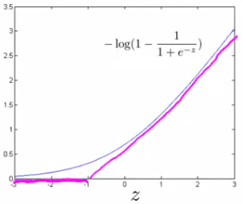
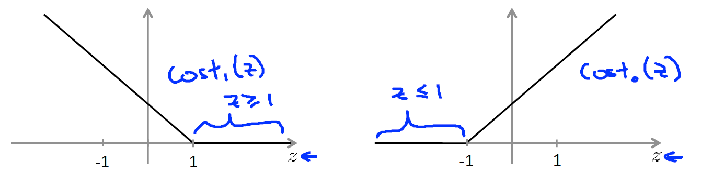
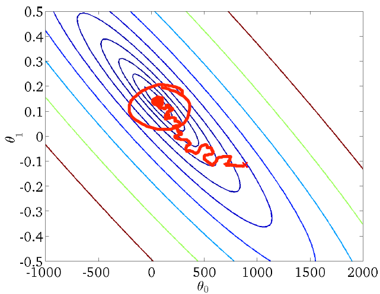
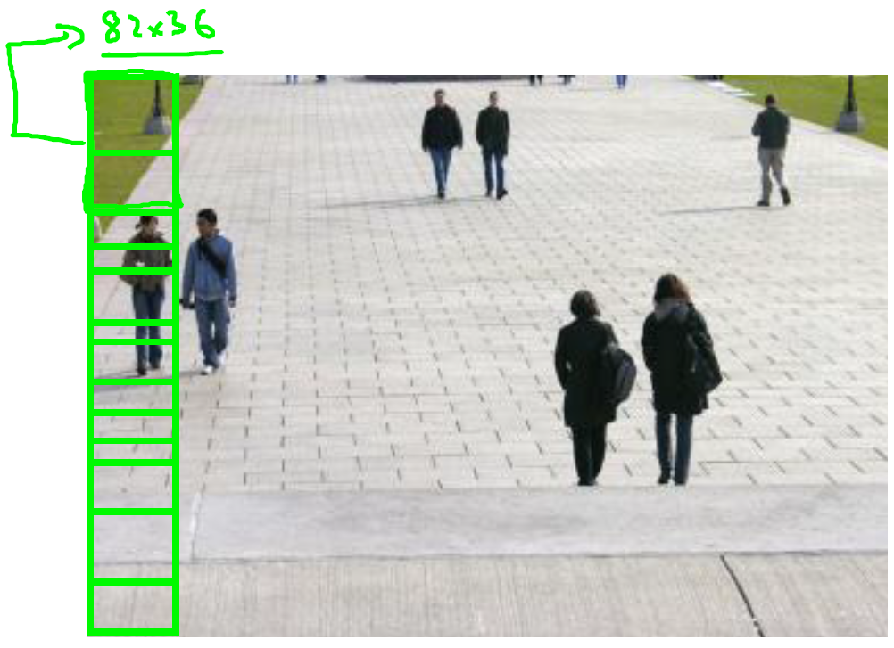

# Machine Learning Theory Aspects

## General

### Model Representation

<a href="https://www.coursera.org/learn/machine-learning/supplement/cRa2m/model-representation">
    
</a>

+ $h\;$: hypothesis function
  + mapping from $x$ to predicted $y$
  + E.g., $h_\theta(x) = \theta_0 + \theta_1 \cdot x_1$

### Pipeline

+ [Photo OCR Pipeline](../ML/ML-Stanford/18-OCR.md#problem-description-and-pipeline)
  1. Text detection
  2. Character segmentation: Splitting “ADD” for example
  3. Character classification: First character “A”, second “D”, and so on

  <div style="display:flex;justify-content:center;align-items:center;flex-flow:row wrap;">
    <div><a href="https://www.ritchieng.com/machine-learning-photo-ocr/#problem-description-and-pipeline">
      
      
    </a></div>
  </div>


### Model Selection

+ [Recommended approach](../ML/ML-Stanford/11-System.md#error-analysis)
  + Start with a __simple algorithm__ that you can implement quickly. Implement it and test it on your cross­‐validation data.
  + Plot __learning curves__ to decide if more data, more features, etc. are likely to help.
  + __Error analysis__: 
    + Manually examine the examples (in cross validation set) that your algorithm made errors on.
    + See if you spot any systematic trend in what type of examples it is making errors on.
    + Don't base anything oo your gut feeling.


+ [Model selection with number of features](../ML/ML-Stanford/10-Advice.md#model-selection-and-train-validation-test-sets)

  $$\begin{array}{crclcccccc} d = 1 & h_\theta(x) &=& \theta_0 + \theta_1 x & \quad\rightarrow\quad  \min_{\theta} J(\theta) & \rightarrow & \theta^{(1)} & \rightarrow & J_{cv}(\theta^{(1)}) \\ d = 2 & h_\theta(x) &=& \theta_0 + \theta_1 x + \theta_2 x^2 & \quad\rightarrow\quad  \min_{\theta} J(\theta) & \rightarrow & \theta^{(2)} & \rightarrow & J_{cv}(\theta^{(2)}) \\ d = 3 & h_\theta(x) &=& \theta_0 + \theta_1 x + \ldots + \theta_3 x^3 & \quad\rightarrow\quad  \min_{\theta} J(\theta) & \rightarrow & \theta^{(3)} & \rightarrow & J_{cv}(\theta^{(3)}) \\ & & \vdots & & & \vdots & & \vdots \\ d = 10 & h_\theta(x) &=& \theta_0 + \theta_1 x + \ldots + \theta_{10} x^{10} & \quad\rightarrow\quad  \min_{\theta} J(\theta) & \rightarrow & \theta^{(10)} & \rightarrow & J_{cv}(\theta^{(10)}) \end{array}$$

  + Pick $\theta_0 + \theta_1 x + \ldots + \theta_4 x^4$
  + Estimate generalization error for test set $J_{test}(\theta^{(4)})$


## Supervised Learning

### Linear Regression

#### Model: Linear Regression

+ [Simple Linear Regression](../ML/ML-Stanford/02-ModelCost.md#cost-function-intuition-ii):
	+ Hypothesis: $h_\theta (x) = \theta_0 + \theta_1 \cdot x$
  + Parameters: $\theta_0$, $\theta_1$
  + Cost Function: $J(\theta_0, \theta_1) = \displaystyle \frac{1}{2m} \sum_{i=1}^m (h_\theta(x^{(i)}) - y^{(i)})^2$
  + Goal: $\displaystyle \min_{\theta_0, \theta_1} J(\theta_0, \theta_1)$


+ [Multivariate Linear Regression Model](../ML/ML-Stanford/04-LRegMVar.md#gradient-descent-for-multiple)
  + Hypothesis function

    $$h_\theta(x) = \theta_0 x_0 + \theta_1 x_1 + \ldots + \theta_n x_n \Longrightarrow \theta^T \cdot x$$

  + Parameters: 
  
    $$\quad \theta_0, \theta_1, \ldots, \theta_n \Longrightarrow \theta = \underbrace{\begin{bmatrix} \theta_0 \\ \theta_1 \\ \ldots \\ \theta_n \end{bmatrix}}_{(n+1)-\text{dim vector}}$$

  + Cost function:

    $$J(\theta) = J(\theta_0, \theta_1, \ldots, \theta_n) = \displaystyle \frac{1}{m} \sum_{i=1}^m (h_\theta (x^{(i)}) - y^{(i)})^2$$


#### Cost Function: Linear Regression

+ [Squared error function](../ML/ML-Stanford/02-ModelCost.md#cost-function-intuition-ii): $J(\theta_0, \theta_1)$

	An average difference (actually a fancier version of an average) of all the results of the hypothesis with inputs from x's and the actual output y's.

	$$J(\theta_0, \theta_1) = \dfrac {1}{2m} \displaystyle \sum _{i=1}^m \left ( \hat{y}_{i}- y_{i} \right)^2 = \dfrac {1}{2m} \displaystyle \sum _{i=1}^m \left (h_\theta (x_{i}) - y_{i} \right)^2$$

+ [Multivariate Cost Function](../ML/ML-Stanford/04-LRegMVar.md#gradient-descent-for-multiple)

  $$J(\theta) = J(\theta_0, \theta_1, \ldots, \theta_n) = \displaystyle \frac{1}{m} \sum_{i=1}^m (h_\theta (x^{(i)}) - y^{(i)})^2$$

+ [Convergence](../ML/ML-Stanford/06-Logistic.md#logistic-regression-model)

  $$J(\theta) = \dfrac{1}{m} \sum_{i=1}^m \dfrac{1}{2} (h_\theta(x^{(i)}) - y^{(i)})^2$$

  <br/>

  $$\text{Cost}(h_\theta(x^{(i)}, y^{(i)})) = \dfrac{1}{2} (h_\theta(x^{(i)}) - y^{(i)})^2 \quad \Longrightarrow \quad \text{Cost}(h_\theta(x, y)) = \dfrac{1}{2} (h_\theta(x) - y)^2  \quad \Rightarrow \quad \text{Convex}$$


+ [Cost Function with regularization](../ML/ML-Stanford/07-Overfit.md#regularized-linear-regression)

  $$J(\theta) = \dfrac{1}{2m} \left[ \sum_{i=1}^m (h_\theta (x^{(i)}) - y^{(i)})^2 + \lambda \sum_{j=1}^n \theta_j^2 \right] \quad \Longrightarrow \quad \min_\theta J(\theta)$$

+ [Regularization linear regression](../ML/ML-Stanford/07-Overfit.md#the-problem-of-overfitting)

  $$\min_\theta\ \dfrac{1}{2m}\ \sum_{i=1}^m (h_\theta(x^{(i)}) - y^{(i)})^2 + \lambda\ \sum_{j=1}^n \theta_j^2$$

+ [Cost function of regularized linear regression](../ML/ML-Stanford/ex05.md#1-2-regularized-linear-regression-cost-function)

  $$J(\theta) = \dfrac{1}{2m} \left( \sum_{i=1}^m (h_\theta(x^{(i)}) - y^{(i)})^2 \right) + \dfrac{\lambda}{2m} \left( \sum_{j=1}^n \theta_j^2 \right)$$

  + $\lambda\;$: regularization parameter to control the degree of regularization [prevent from overfitting]
  + put a penalty on the overall cost $J$
  + $\theta\uparrow \implies J \uparrow$


#### Gradient Descent: Linear Regression

+ [Simplest Gradient descent](../ML/ML-Stanford/02-ModelCost.md#gradient-descent)
  + Objective: Have some function $J(\theta_0, \theta_1)$ <br/>
    Want $\;\;\displaystyle \min_{\theta_0, \theta_1} J(\theta_0, \theta_1)$
  + Outline
    + start with some $\theta_0, \theta_1$
    + keep changing $\theta_0, \theta_1$ to reduce $J(\theta_0, \theta_1)$ until we hopefully end up with at a minimum


+ [Simplest Gradient descent algorithm](../ML/ML-Stanford/02-ModelCost.md#gradient-descent):

   Repeat until convergence {

	<span style="padding-left: 2em;"/> $$\theta_j := \theta_j - \alpha \displaystyle \frac{\partial}{\partial \theta_j} J(\theta_0, \theta_1)$$

	<span style="padding-left: calc(50vw - 10em);">(simultaneously update</span> $i = 0, 1$)<br/>
	}

	+ $\frac{\partial}{\partial \theta_j} J(\theta_0, \theta_1)\;$: derivative; sign (+, -) as slope and value as steepness
	+ $:=\;$: assignment, take the right-hand side value asn assign to the symbol right-hand side
	+ $=\;$: truth association, comparison
	+ $\alpha\;$: learning rate, step size


+ [Multivariate gradient decent](../ML/ML-Stanford/02-ModelCost.md#gradient-descent)
  + Objective: Have some function $J(\theta)$ where $\theta = (\theta_0, \theta_1, \ldots, \theta_n)$ <br/>
    Want $\;\;\displaystyle \min_{\theta} J(\theta)$
  + Outline
    + start with some $\theta$
    + keep changing $\theta$ to reduce $J(\theta)$ until we hopefully end up with at a minimum

+ [Multivariate linear repression ($n \geq 1$) algorithm](../ML/ML-Stanford/04-LRegMVar.md#gradient-descent-for-multiple)

  Repeat {

    $$\theta_j := \theta_j -\alpha \frac{1}{m} \sum_{i=1}^m (h_\theta (x^{(i)}) - y^{(i)})= \theta_j -\alpha \frac{\partial}{\partial \theta_j} J(\theta)$$
    <span style="padding-top: 0.5em; padding-left: calc(50vw - 5em);"> (simultaneously update </span> $\theta_j \;$ for $j=0, 1, \ldots, n$)<br/>
  }

  Extended version: with $x_0^{(i)} = 1$

    $$\begin{array}{ccc}
      \theta_0 &:=& \theta_0 -\alpha \displaystyle \frac{1}{m} \sum_{i=1}^m (h_\theta (x^{(i)}) - y^{(i)}) \cdot x_0^{(i)} \\
      \theta_1 &:=& \theta_1 -\alpha \displaystyle \frac{1}{m} \sum_{i=1}^m (h_\theta (x^{(i)}) - y^{(i)}) \cdot x_1^{(i)} \\
      \theta_2 &:=& \theta_2 -\alpha \displaystyle \frac{1}{m} \sum_{i=1}^m (h_\theta (x^{(i)}) - y^{(i)}) \cdot x_2^{(i)} \\
      & \cdots &
    \end{array}$$

+ [Gradient Descent with Regularization](../ML/ML-Stanford/07-Overfit.md#regularized-linear-regression)

  Repeat {
  
    $$\begin{array}{rcl} \theta_0 &:=& \theta_0 − \alpha \dfrac{1}{m} \sum_{i=1}^m (h_\theta(x^{(i)}) − y^{(i)}) x^{(i)}_0 \\\\  \theta_j &:=& \theta_j − \alpha \left[(\dfrac{1}{m} \sum_{i=1}^m (h_\theta(x^{(i)})−y^{(i)})x^{(i)}_j) + \dfrac{\lambda}{m} \theta_j \right] \quad\quad j \in \{1,2\ldots n\} \end{array}$$
  }

  $$\theta_j := \underbrace{\theta_j (1 - \alpha \dfrac{\lambda}{m})}_{ \approx \theta_j, \text{ eg. }\theta_j \times 0.99} - \underbrace{\alpha \dfrac{1}{m} \sum_{i=1}^m (h_\theta(x^{(i)}) - y^{(i)})x^{(i)}}_{\text{same as } J(\theta)}$$

+ [The partial derivatives of regularized linear regression's cost for $\theta_j$](../ML/ML-Stanford/ex05.md#1-3-regularized-linear-regression-gradient)

  $$\dfrac{\partial J(\theta)}{\partial \theta_0}  = \begin{cases} \dfrac{1}{m} \sum_{i=1}^m (h_\theta(x^{(i)}) - y^{(i)}) x_j^{(i)} & \text{for } j = 0 \\\\ \dfrac{1}{m} \sum_{i=1}^m (h_\theta(x^{(i)}) - y^{(i)}) x_j^{(i)} + \dfrac{\lambda}{m} \theta_j & \text{for } j \geq 1 \end{cases}$$


#### Vectorization: Linear Regression


+ The Gradient Descent rule can be expressed as:

  $$\theta := \theta - \alpha \nabla J(\theta)$$

  Where $\nabla J(\theta)$ is a column vector of the form:

  $$\nabla J(\theta) = \begin{bmatrix} \partial J(\theta) / \partial \theta_0 \\ \partial J(\theta) / \partial \theta_1 \\ \vdots \\  \partial J(\theta) / \partial \theta_n \end{bmatrix}$$

  The $j$-th component of the gradient is the summation of the product of two terms:

  $$\dfrac{\partial J(\theta)}{\partial \theta_j}  = \dfrac{1}{m} \displaystyle \sum_{i=1}^m (h_\theta(x^{(i)}) - y^{(i)}) \cdot x_j^{(i)} =  \dfrac{1}{m} \displaystyle \sum_{i=1}^m x_j^{(i)} \cdot (h_\theta(x^{(i)}) - y^{(i)})$$

  Sometimes, the summation of the product of two terms can be expressed as the product of two vectors.

  Here, $x_j^{(i)}$, for $i = 1, \ldots, m$, represents the $m$ elements of the j-th column, $\vec{x_j}$, of the training set $x$.

  The other term $\left(h_\theta(x^{(i)}) - y^{(i)} \right)$ is the vector of the deviations between the predictions $h_\theta(x^{(i)})$ and the true values $y^{(i)}$. Re-writing $\frac{\partial J(\theta)}{\partial \theta_j}$, we have:

  $$\begin{array}{ccc} \dfrac{\partial J(\theta)}{\partial \theta_j} & = & \dfrac{1}{m} \vec{x_j}^T (x\theta - \vec{y}) \\\\ \nabla J(\theta) &=& \dfrac{1}{m} X^T (x\theta - \vec{y}) \end{array}$$

  Finally, the matrix notation (vectorized) of the Gradient Descent rule is:

  $$\theta := \theta - \dfrac{\alpha}{m} x^T (x\theta - \vec{y})$$

+ [Batch gradient descent for each iteration](../ML/ML-Stanford/ex01.md#update-equations-derivation-)

  $$\theta_j := \theta_j - \alpha \dfrac{1}{m} \sum_{i=1}^{m} (h_\theta(x^{(i)}) - y^{(i)}) x_j^{(i)}$$
  <span style="padding-top: 0.5em; padding-left: calc(50vw - 5em);"> (simultaneously update </span>
  $\; \theta_j, \;\; \forall j$)<br/>

  + Notations:

    $$x = \underbrace{\begin{bmatrix} x_0^{(1)} & x_1^{(1)} & \cdots & x_n^{(1)} \\
    x_0^{(2)} & x_1^{(2)} & \cdots & x_n^{(2)} \\
    \vdots & \vdots & \ddots & \vdots \\
    x_0^{(m)} & x_1^{(m)} & \cdots & x_n^{(m)}
    \end{bmatrix}}_{(m \times n) \text{ matrix }} = \begin{bmatrix} x^{(1)} \\ x^{(2)} \\ \vdots \\ x^{(m)} \end{bmatrix}\quad\quad\quad
    \vec{y} = \underbrace{\begin{bmatrix} y^{(0)} \\ y^{(2)} \\ \vdots \\ y^{(m)}  \end{bmatrix}}_{(m \times 1) \text{ vector}} \quad\quad\quad
    \vec{\theta} = \underbrace{\begin{bmatrix} \theta_0 \\ \theta_1 \\ \vdots \\ \theta_m \end{bmatrix}}_{(m \times 1) \text{ vector}}
    $$
    <br/>

  + Vectorization of Hypothesis Function

    $$\begin{array}{rcl}
    h_\theta (x^{(i)}) & = & \theta_0 x_0^{(i)} + \theta_1 x_1^{(i)} + \cdots + \theta_n x_n^{(i)} \\\\
    h_\theta (x) & = & x \vec{\theta}
    \end{array}$$

  + Vectorization for Cost function

    $$\begin{array}{rcl} J(\vec{\theta}) & = & \dfrac{1}{2m} \sum_{i=1}^m (h_\theta(x^{(i)}) - y^{(i)})^2 \\\\ & = & \dfrac{1}{2m} (x\vec{\theta} - \vec{y})^T (x\vec{\theta} - \vec{y}) \end{array}$$

  + Vectorization for Batch Gradient Descent

    $$\vec{\theta} := \vec{\theta} - \alpha \dfrac{1}{m} \begin{bmatrix} \sum_{i=1}^m (h_\theta (x^{(i)} - y^{(i)}) x_0^{(i)} \\\\ \sum_{i=1}^m (h_\theta (x^{(i)} - y^{(i)}) x_1^{(i)} \\ \vdots \\ \sum_{i=1}^m (h_\theta (x^{(m)} - y^{(m)}) x_1^{(m)} \end{bmatrix}  = \vec{\theta} - \dfrac{\alpha}{m} \left( \underbrace{\begin{bmatrix} \sum_{i=1}^m h_\theta (x^{(i)} \cdot x_0^{(i)} \\\\ \sum_{i=1}^m h_\theta (x^{(i)} \cdot x_1^{(i)} \\ \vdots \\ \sum_{i=1}^m h_\theta (x^{(i)} \cdot x_m^{(i)}  \end{bmatrix}}_{(A)} - \underbrace{\begin{bmatrix} \sum_{i=1}^m y^{(i)}) \cdot x_0^{(i)} \\\\ \sum_{i=1}^m y^{(i)}) \cdot x_1^{(i)} \\ vdots \\ \sum_{i=1}^m y^{(i)}) \cdot x_m^{(i)}  \end{bmatrix}}_{(B)} \right)$$

    Part (A) with $j$

    $$\displaystyle \sum_{i=1}^m h_\theta(x^{(i)}) \cdot x_j^{(i)} =  h_\theta(x^{(1)}) x_j^{(1)} + h_\theta(x^{(2)}) x_j^{(2)} + \cdots + h_\theta(x^{(n)}) x_j^{(n)} = \begin{bmatrix} x_j^{(1)} & x_j^{(2)} & \cdots & x_j^{(m)} \end{bmatrix} x\vec{\theta}$$

    Part (A) $\;\forall j$

    $$\begin{bmatrix} \sum_{i=1}^m h_\theta (x^{(i)} \cdot x_0^{(i)} \\\\ \sum_{i=1}^m h_\theta (x^{(i)} \cdot x_1^{(i)} \\ \vdots \\ \sum_{i=1}^m h_\theta (x^{(i)} \cdot x_m^{(i)}  \end{bmatrix} = \begin{bmatrix} x_0^{(1)} & x_0^{(2)} & \cdots & x_0^{(m)} \\ x_1^{(1)} & x_1^{(2)} & \cdots & x_1^{(m)} \\ \vdots & \vdots & \ddots & \vdots \\ x_j^{(1)} & x_j^{(2)} & \cdots & x_j^{(m)} \end{bmatrix} h_\theta(x) = x^Tx\vec{\theta}$$

    Part (B) for $j$

    $$\sum_{i=1}^m y^{(i)} x_j^{(i)} = x_j^{(1)} y^{(1)} + x_j^{(2)} y^{(2)} + \cdots + x_j^{(m)} y^{(m)} = \begin{bmatrix} x_j^{(1)} & x_j^{(2)} & \cdots & x_j^{(m)} \end{bmatrix} \vec{y}$$

    Part (B) $\;\forall j$

    $$\begin{bmatrix} \sum_{i=1}^m y^{(i)}) \cdot x_0^{(i)} \\\\ \sum_{i=1}^m y^{(i)}) \cdot x_1^{(i)} \\ \vdots \\ \sum_{i=1}^m y^{(i)}) \cdot x_m^{(i)}  \end{bmatrix} = \begin{bmatrix} x_0^{(1)} & x_0^{(2)} & \cdots & x_0^{(m)} \\ x_1^{(1)} & x_1^{(2)} & \cdots & x_1^{(m)} \\ \vdots & \vdots & \ddots & \vdots \\ x_j^{(1)} & x_j^{(2)} & \cdots & x_j^{(m)} \end{bmatrix} \vec{y} = x^T \vec{y}$$

    Therefore, the batch gradient descent iteration can be obtained with

    $$\vec{\theta} := \vec{\theta} - \alpha \dfrac{1}{m} \begin{bmatrix} \sum_{i=1}^m (h_\theta (x^{(i)} - y^{(i)}) x_0^{(i)} \\\\ \sum_{i=1}^m (h_\theta (x^{(i)} - y^{(i)}) x_1^{(i)} \\ \vdots \\ \sum_{i=1}^m (h_\theta (x^{(m)} - y^{(m)}) x_1^{(m)} \end{bmatrix} = \vec{\theta} - \dfrac{\alpha}{m} (x^Tx\vec{\theta} - x^T\vec{Y}) = \vec{\theta} - \dfrac{\alpha}{m} x^T (x\vec{\theta} - \vec{y})$$


#### Polynomial Regression

+ [Polynomial regression](../ML/ML-Stanford/04-LRegMVar.md#features-and-polynomial-regression)

  <div style="display:flex;justify-content:center;align-items:center;flex-flow:row wrap;">
    <div><a href="url">
      
    </a></div>
  </div>

  $$\theta_0 + \theta_1 x + \theta_2 x^2 \quad \text{or} \quad \theta_0 + \theta_1 x + \theta_2 x^2 + \theta_3 x^3 \quad \text {or} \quad \ldots$$

  + If cubic model fits,

      $$\begin{array}{rcl}
          h_\theta(x) & = & \theta_0 + \theta_1 x_1 + \theta_2 x_2 + \theta_3 x_3 \\\\
          & = & \theta_0 + \theta(size) + \theta_2 (size)^2 + \theta_3 (size)^3
      \end{array}$$

      where $x_1 = (size), x_2 = (size)^2, x_3 = (size)^3$

+ [Choose of features](../ML/ML-Stanford/04-LRegMVar.md#features-and-polynomial-regression)

  <div style="display:flex;justify-content:center;align-items:center;flex-flow:row wrap;">
    <div><a href="url">
      
    </a></div>
  </div>

  $$\begin{array}{rcl}
    h_\theta(x) & = & \theta_0 + \theta_1 (size) + \theta_2 (size)^3 \\\\
    h_\theta(x) & = & \theta_0 + \theta_1 (size) + \theta_2 \sqrt{(size)}
  \end{array}$$


#### Normal Equation

+ Normal equation: Method to solve for $\theta$ analytically.

+ [Generalized](../ML/ML-Stanford/04-LRegMVar.md#normal-equation): for $\; \theta \in \mathbb{R}^{n+1}$

  $$\begin{array}{c} J(\theta_0, \theta_1, \ldots, \theta_m) = \dfrac{1}{2m} \sum_{i=1}^m (h_\theta(x^{(i)}) - y^{(i)})^2 \\ \theta = \begin{bmatrix} \theta_1 \\ \theta_2 \\ \vdots \\ \theta_m \end{bmatrix} = (X^TX)^{-1} X^T y \\ \dfrac{\partial}{\partial \theta_j} J(\theta) = \cdots = 0, \quad \forall j \Longrightarrow \text{solve for } \theta_0, \theta_1, \ldots, \theta_n \end{array}$$

+ [Comparison of gradient descent and the normal equation:](../ML/ML-Stanford/04-LRegMVar.md#normal-equation)
  + Gradient descent
    + Need to choose $\alpha$
    + Need many iterations
    + $\mathcal{O}(kn^2)$
    + Works well when $n$ is large
  + Normal Equation
    + Not need to choose $\alpha$
    + No need to iterate
    + $\mathcal{O}(n^3)$, need to calculate inverse of $X^TX$ 
    + Slow if $n$ is very large

+ [What if $X^TX$ is non-invertible?](../ML/ML-Stanford/04-LRegMVar.md#normal-equation-noninvertibility)
  + Redundant features (linearly dependent)
  + Too many features (e.g. $m \leq n$): Delete some features, or use regularization

+ [Vectorized Normal Equation](../ML/ML-Stanford/07-Overfit.md#regularized-linear-regression)

  $$X = \underbrace{\begin{bmatrix}(x^{(1)})^T \\ \vdots \\ (x^{(m)})^T \end{bmatrix}}_{m \times (n+1) \text{ matrix}} \qquad\qquad y = \underbrace{\begin{bmatrix} y^{(1)} \\ \vdots \\ y^{(m)} \end{bmatrix}}_{\in \mathbb{R}^m}$$

  To $\min_\theta J(\theta) \qquad \Longrightarrow \qquad \text{(set) }\dfrac{\partial}{\partial \theta_j} J(\theta) = 0$,

  $$\theta = \left(X^TX + \lambda \underbrace{\begin{bmatrix} 0 & & & & \\ & 1 & & & \\ & & 1 & & \\ & & & \ddots & \\ & & & & 1\end{bmatrix}}_{(n+1) \times (n+1) \text{ matrix}} \right)^{-1} X^Ty$$

+ [Non-invertibility for Vectorized Normal Equation](../ML/ML-Stanford/07-Overfit.md#regularized-linear-regression)

  Suppose $m \leq n$, $m$ as the number of examples and $n$ as the number of features

  $$\theta = (X^TX)^{-1}X^T y$$

  where $((X^TX)^{-1}$ is non-invertible / singular.

  If $\lambda > 0$, the regularization will solve the non-invertible issue, 

  $$\theta = \left(\underbrace{X^TX + \lambda \begin{bmatrix} 0 & & & & \\ & 1 & & & \\ & & 1 & & \\ & & & \ddots & \\ & & & & 1\end{bmatrix}}_{invertible} \right)^{-1} X^Ty$$


### Logistic Regression

#### Model: Logistic Regression

+ [Classification problem](../ML/ML-Stanford/06-Logistic.md#cost-function)
  + Training set: $\quad \{(x^{(1)}, y^{(1)}), (x^{(2)}, y^{(2)}), \ldots, (x^{(m)}, y^{(m)})\}$
  + $m$ examples: $\quad x \in \begin{bmatrix} x_0 \\ x_1 \\ \cdots \\ x_n \end{bmatrix} \in \mathbb{R}^{n+1} \quad\quad x_0 = 1, y \in \{0, 1\}$
  + Hypothesis function: $\quad h_\theta(x) = \dfrac{1}{1 + e^{-\theta^Tx}}$
  + How to choose parameters $\theta$?

+ [Logistic Regression Model](../ML/ML-Stanford/06-Logistic.md#hypothesis-representation)
  + Want: $\quad 0 \leq h_\theta (x) \leq 1$

      $$h_\theta(x) = \theta^T x$$
  + Sigmoid/Logistic function
    <div style="display:flex;justify-content:center;align-items:center;flex-flow:row wrap;">
      <div style="background-color: white;"><a href="https://en.wikipedia.org/wiki/Logistic_function">
      
      </a></div>
    </div><br/>

    $$h_\theta(x) = \dfrac{1}{1+e^{-x}} \quad \Longrightarrow \quad g(z) = h_\theta(x) = g(\theta^Tx) = \dfrac{1}{1 + e^{-\theta^T x}}$$

  + Parameter: $\theta \;\; \longleftarrow \;\;$ find the value to fit parameter

+ [Regularization logistic regression](../ML/ML-Stanford/07-Overfit.md#regularized-logistic-regression)

  $$h_\theta(x) = g(\theta_0 + \theta_1 x_1 + \theta_2 x_1^2 + \theta_3 x_1^2x_2 + \theta_4 x_1^2 x_2^2 + \theta_5 x_1^2 x_2^3 + \ldots)$$


+ [Decision Boundary](../ML/ML-Stanford/06-Logistic.md#decision-boundary)

  $$h_\theta(x) = g(\theta^T x) = P(y=1 | x; \theta)$$

  + Logistic Function

    $$\begin{array}{rcl} g(z) =  \dfrac{1}{1 + e^{-z}} & & \\\\ z=0,\quad e^0=1 & \Rightarrow & g(z)=1/2 \\ z \rightarrow  \infty, \quad e^{−\infty} \rightarrow  0 & \Rightarrow & g(z)=1 \\ z \rightarrow −\infty, \quad e^{\infty} \rightarrow \infty & \Rightarrow & g(z)=0 \end{array}$$

  + Suppose predict "$y = 1$" if $\;\; h_\theta(x) \geq 0.5$:

    $$g(z) \geq 0.5 \text{ when } z \geq 0 \quad \Longrightarrow \quad h_\theta(x) = g(\theta^Tx) \geq 0.5 \;\;\text{  whenever  } \theta^Tx \geq 0$$
  + Suppose predict "$y = 0$" if $\;\; h_\theta(x) < 0.5$:

    $$g(z) < 0.5 \text{ when } z < 0 \quad \Longrightarrow \quad h_\theta(x) = g(\theta^Tx) < 0.5 \;\;\text{  whenever  } \theta^Tx < 0$$


#### Cost Function: Logistic Regression

+ [Cost function](../ML/ML-Stanford/06-Logistic.md#simplified-cost-function-and-gradient-descent)

  + cost function, __[Cross-Entropy](https://ml-cheatsheet.readthedocs.io/en/latest/loss_functions.html#loss-cross-entropy)__, also known as __Log Loss__,

    $$\begin{array}{rcl} J(\theta) & = & \dfrac{1}{m} \text{Cost}(h_\theta(x^{(i)}), y^{(i)}) \\\\\\ \text{Cost}(h_\theta(x), y) & = & \left\{ \begin{array}{rl} -\log(h_\theta(x)) & \;\; \text{if } y = 1 \\ -\log(1 - h_\theta(x)) & \;\; \text{if } y = 0 \end{array} \right. \\\\ & & \Downarrow \\\\ \text{Cost}(h_\theta(x), y) & = & -y \cdot \log(h_\theta(x)) - (1-y) \cdot \log(1 - h_\theta(x)) \quad y \in \{0, 1\} \\\\ \text{If } y=1 & : & \text{Cost}(h_\theta(x), y) = -y \cdot \log(h_\theta(x)) \\ \text{If } y=0 & : & \text{Cost}(h_\theta(x), y) = (1-y) \cdot \log(1 - h_\theta(x)) \end{array}$$
  
    Therefore,

    $$\begin{array}{rcl} J(\theta) & = & \dfrac{1}{m} \displaystyle \sum_{i=1}^m \text{Cost}(h_\theta(x^{(i)}), y^{(i)}) \\\\ & = & - \dfrac{1}{m} \left[ \displaystyle \sum_{i=1}^m \log(h_\theta(x^{(i)}) + (1 - y^{(i)}) \log(1 - h_\theta(x^{(i)})) \right]  \end{array}$$

  + fit parameter $\theta$:

    $$\min_{\theta} J(\theta)$$

  + prediction with new $x$:

    Output of $h_\theta(x) = \dfrac{1}{1 + e^{\theta^Tx}} \quad \Leftarrow P(y = 1 | x; \theta)$

+ [Cost Function with Regularization](../ML/ML-Stanford/07-Overfit.md#regularized-logistic-regression)

  $$J(\theta) = - \frac{1}{m} \sum_{i=1}^m \left[ y^{(i)}\ \log (h_\theta (x^{(i)})) + (1 - y^{(i)})\ \log (1 - h_\theta(x^{(i)}))\right] + \frac{\lambda}{2m}\sum_{j=1}^n \theta_j^2$$

+ [Regularized cost function in logistic regression](../ML/ML-Stanford/ex02.md#cost-function-and-gradient)

  $$\begin{array}{rcl} J(\theta) & = & \dfrac{1}{m} \displaystyle \sum_{i=1}^m \left[ -y^{(i)} \log(h_\theta)x^{(i)}) -(1 - y^{(i)}) \log(1 - h_\theta(x^{(i)})) \right] + \dfrac{\lambda}{2m} \displaystyle \sum_{j=1}^n \theta_j^2 \\\\ & = & \dfrac{1}{m} \left[ -y^T \cdot \log(h) - (1 - y)^T \cdot \log(1 - h) \right] + \dfrac{\lambda}{2m} (\theta^T \theta - \theta_0^2)\end{array}$$


+ [Convergence](../ML/ML-Stanford/06-Logistic.md#logistic-regression-model):

  $$J(\theta) = \dfrac{1}{m} \sum_{i=1}^m \text{Cost}(h_\theta(x^{(i)}), y^{(i)})$$

  <br/>

  $$\text{Cost}(h_\theta(x^{(i)}, y^{(i)})) = \dfrac{1}{2} (h_\theta(x^{(i)}) - y^{(i)})^2 \quad \Longrightarrow \quad \text{Cost}(h_\theta(x, y)) = \dfrac{1}{2} (\dfrac{1}{1+ e^{-\theta^Tx}} - y)^2  \quad \Rightarrow \quad \text{Non-Convex}$$


#### Gradient Descent: Logistic Regression

+ [Simple Gradient Descent](../ML/ML-Stanford/06-Logistic.md#simplified-cost-function-and-gradient-descent)

  $$J(\theta) = - \dfrac{1}{m} \left[ \displaystyle \sum_{i=1}^m \log(h_\theta(x^{(i)}) + (1 - y^{(i)}) \log(1 - h_\theta(x^{(i)})) \right]$$

  Objective: $\min_{\theta} J(\theta)$

  Repeat {

    $$\theta_j := \theta_j - \alpha \dfrac{\partial}{\partial \theta_j} J(\theta)$$
    <span style="text-align: center; padding-top: 0.5em;padding-left: calc(50vw - 2em);"> (Simultaneously update all </span> $\theta_j$)
  
  }

  $$\dfrac{\partial}{\partial \theta_j} J(\theta) = \dfrac{1}{m} \sum_{i=1}^m (h_\theta(x^{(i)}) - y^{(i)}) \cdot x_j^{(i)}$$

+ [Gradient Descent with Regularization](../ML/ML-Stanford/07-Overfit.md#regularized-logistic-regression)

  Repeat {

    $$\begin{array}{rcl} \theta &:=& \theta_0 - \alpha \dfrac{1}{m} \sum_{i=1}^m (h_\theta(x^{(i)}) - y^{(i)}) - y^{(i)}) x_0^{(i)} \\\\ \theta_j &:=& \theta_j - \alpha \underbrace{ \left[\dfrac{1}{m} \sum_{i=1}^m (h_\theta(x^{(i)}) - y^{(i)}) x_j^{(i)} + \dfrac{\lambda}{m} \theta_j \right] }_{\frac{\partial}{\partial \theta_j} J(\theta) = 0}\qquad (j = 1, 2, 3, \ldots, n)  \end{array}$$
  }

  For logistic regression 

  $$h_\theta(x) = \dfrac{1}{1 + e^{-\theta^Tx}}$$

+ [The gradient of the cost function](../ML/ML-Stanford/ex02.md#cost-function-and-gradient)

  $$\begin{array}{rcl} \dfrac{\partial J(\theta)}{\partial \theta_0} & = & \dfrac{1}{m} \displaystyle \sum_{i=1}^m (h_\theta(x^{(i)}) - y^{(i)})x_0^{(i)} \\\\ \dfrac{\partial J(\theta)}{\partial \theta_j} & = & \left( \dfrac{1}{m} \displaystyle \sum_{i=1}^m (h_\theta(x^{(i)}) - y^{(i)})x_j^{(i)} \right) + \dfrac{\lambda}{m} \theta_j \qquad j = 1, 2, \ldots, n \\\\    & = &  \dfrac{1}{m} \begin{bmatrix} x^{(1)}_j & x^{(2)}_j & \cdots & x^{(m)}_j \end{bmatrix} (g(X\theta) - y) + \dfrac{\lambda}{m} \theta_j \end{array}$$


#### Vectorization: Logistic Regression

+ [Derivation of Vectorized Cost and Hypothesis function](../ML/ML-Stanford/06-Logistic.md#simplified-cost-function-and-gradient-descent)

  $$X = \begin{bmatrix} x_0^{(1)} & x_1^{(1)} & \cdots & x_n^{(1)} \\ x_0^{(2)} & x_1^{(2)} & \cdots & x_n^{(2)} \\ \vdots & \vdots & \ddots & \vdots \\ x_0^{(m)} & x_1^{(m)} & \cdots & x_n^{(m)} \\ \end{bmatrix} \quad\quad \theta = \begin{bmatrix} \theta_0 \\ \theta_1 \\ \vdots \\ \theta_n \end{bmatrix} \quad\quad y = \begin{bmatrix} y^{(1)} \\ y^{(2)} \\ \vdots \\ y^{(m)}  \end{bmatrix}\quad\quad  h_\theta(x) = h = g(X\theta) = \begin{bmatrix} h_\theta(x^{(1)}) \\ h_\theta(x^{(2)}) \\ \vdots \\ h_\theta(x^{(m)}) \end{bmatrix}$$

  __Cost function:__

  $$J(\theta) =  \dfrac{-1}{m} \left[ \underbrace{\sum_{i=1}^m (y^{(i)} \cdot \log(h_\theta(x^{(i)})))}_{(A)} + \underbrace{\sum_{i=1}^m (1 - y^{(i)})\cdot \log(1 - h_\theta(x^{(i)}))}_{(B)}   \right]$$

  Part (A):

  $$(A)  = \sum_{i=1}^m (y^{(i)} \cdot \log(h_\theta(x^{(i)}))) = y^T \cdot \log(h)$$

  Part (B):

  $$(B) = \sum_{i=1}^m (1 - y^{(i)})\cdot \log(1 - h_\theta(x^{(i)})) = ( 1 - y)^T \cdot \log(1-h)$$

  Therefore,

  $$J(\theta) = \dfrac{1}{m} \left[ -y^T  \cdot \log(h) - (1-y)^T \cdot \log(1-h)  \right]$$

  __Gradient Descent:__

  $$\begin{array}{rcl} \theta_j := \theta_j - \alpha \dfrac{\partial}{\partial \theta_j} J(\theta) & \text{ and } & \dfrac{\partial}{\partial \theta_j} J(\theta) = \dfrac{1}{m} \sum_{i=1}^m (h_\theta(x^{(i)}) - y^{(i)}) x_j^{(i)} \\\\ \theta_j := \theta_j & - \;\; \dfrac{\alpha}{m} & \left( \begin{bmatrix} x_j^{(1)} & x_j^{(2)} & \cdots & x_j^{(m)} \end{bmatrix} \begin{bmatrix} h_\theta(x^{(1)}) \\ h_\theta(x^{(2)}) \\ \vdots \\ h_\theta(x^{(m)}) \end{bmatrix} \right)\end{array}$$

  <br/>

  $$\theta :=  \theta - \dfrac{\alpha}{m} \left( X^T \cdot g(X\theta) - X^T \cdot y \right) = \theta - \dfrac{\alpha}{m}\; X^T \left( g(X\theta) - y \right)$$

+ [Vectorized Cost function in logistic regression](../ML/ML-Stanford/ex02.md#1-2-2-cost-function-and-gradient)

  $$\begin{array}{rcl} J(\theta) & = & \dfrac{1}{m} \sum_{i=1}^m \left[ -y^{(i)} \log(h_\theta(x^{(i)})) - (1 - y^{(i)}) \log(1 - h_\theta(x^{(i)})) \right] \\\\ & = & \dfrac{1}{m} \left[ -y^T \cdot \log(g(X\theta)) - (1-y)^T \cdot \log(1 - g(X\theta)) \right] \end{array}$$

+ [Vectorized Gradient Descent of Logistic Regression](../ML/ML-Stanford/ex02.md#1-2-2-cost-function-and-gradient)

  $$\begin{array}{rcl} \dfrac{\partial J(\theta)}{\partial \theta_j} & = &\dfrac{1}{m} \sum_{i=1}^m (h_\theta(x^{(i)}) - y^{(i)})x^{(i)} \\\\ & = & \dfrac{1}{m} \begin{bmatrix} x^{(1)}_j & x^{(2)}_j & \cdots & x^{(m)}_j \end{bmatrix} (h_\theta(x) - y) = \dfrac{1}{m} \begin{bmatrix} x^{(1)}_j & x^{(2)}_j & \cdots & x^{(m)}_j \end{bmatrix} (g(X\theta) - y) \end{array}$$


+ [Cost function in (unregularized) logistic regression](../ML/ML-Stanford/ex03.md#vectorizing-logistic-regression)

  $$J(\theta) = \dfrac{1}{m} \sum_{i=1}^m \left[ -y^{(i)} \log(h_\theta(x^{(i)})) - (1 - y^{(i)}) \log(1 - h_\theta(x^{(i)})) \right]$$

  + To compute each element in the summation, compute $h_\theta(x^{(i)})$ for every example $i$, where $h_\theta(x^{(i)}) = g(\theta^T x^{(i)})$ and $g(z) = \dfrac{1}{1+e^{-z}})$ is the sigmoid function,
  + Define $X$ and $\theta$

    $$X = \begin{bmatrix} - & (x^{(1)})^T & - \\ - & (x^{(2)})^T & - \\ & \vdots \\ - & (x^{(m)})^T & - \end{bmatrix} \quad \text{ and } \quad  \theta = \begin{bmatrix} \theta_0 \\ \theta_1 \\ \vdots \\ \theta_n \end{bmatrix}$$

  + Computing the matrix product $X\theta$,

    $$X\theta = \begin{bmatrix} - & (x^{(1)})^T\theta & - \\ - & (x^{(2)})^T\theta & - \\ & \vdots & \\ - & (x^{(m)})^T\theta & - \end{bmatrix} = \begin{bmatrix} - & \theta^T(x^{(1)}) & - \\ - & \theta^T(x^{(2)}) & - \\ & \vdots & \\ - & \theta^T(x^{(m)}) & - \end{bmatrix}$$

  + Property: $a^T b = b^T a$ if $a$ and $b$ are vectors.
  + Compute the products $\theta^Tx^{(i)}$ for all examples $i$ in one line of code.
  + No loop with fully vectorized approach to calculate $\theta^Tx^{(i)}$
  + Hint: use element-wise multiplication operation (`.*`) and the sum operation `sum`

+ [Gradient of the (unregularized) logistic regression cost](../ML/ML-Stanford/ex03.md#vectorizing-logistic-regression)

  + A vector where the $j^{th}$ element defined as

    $$\dfrac{\partial J}{\partial \theta_j} = \dfrac{1}{m} \sum_{i=1}^m ((h_\theta(x^{(i)}) - y^{(i)}) x^{(i)}_j)$$

  + The partial derivatives explicitly for all$\theta_j$

    $$\begin{bmatrix} \frac{\partial J}{\partial \theta_0} & \frac{\partial J}{\partial \theta_1}  & \frac{\partial J}{\partial \theta_2} & \cdots & \frac{\partial J}{\partial \theta_n} \end{bmatrix}^T = \dfrac{1}{m} \displaystyle \sum_{i=1}^m \left((h_\theta(x^{(i)}) - y^{(i)}) x^{(i)} \right) = \frac{1}{m} X^T (h_\theta(x) - y)$$

  + Note that $x^{(i)}$ is a vector, while $(h_\theta(x^{(i)}) - y^{(i)})$ is a scalar (single number).  Let $\beta_i = (h_\theta(x^{(i)})- y^{(i)})$

    $$\sum_i \beta_i x^{(i)} = \begin{bmatrix}  \mid & \mid & & \mid \\ x^{(1)} & x^{(2)} & \cdots & x^{(m)} \\ \mid & \mid & & \mid \end{bmatrix} \begin{bmatrix} \beta_1 \\ \beta_2 \\ \vdots \\ \beta_m \end{bmatrix} = X^T \beta$$

    where $\beta_i = (h_\theta(x^{(i)}) - y^{(i)})$

  + Compute all the partial derivatives without any loops.  

+ [Regularized logistic regression, the cost function](../ML/ML-Stanford/ex03.md#vectorizing-logistic-regression)

  $$J(\theta) = \frac{1}{m} \sum_{i=1}^m \left[ -y^{(i)} \log(H_\theta(x^{(i)})) - (1-y^{(i)}) \log(1 - h_\theta(x^{(i)})) \right] + \dfrac{\lambda}{2m} \sum_{i=1}^n \theta_j^2$$

  Note that not regularizing $\theta_0$ used for the bias term.

  The partial derivative of regularized logistic regression cost for $\theta_j$ defined as 

  $$\begin{array}{rcl} \dfrac{\partial J(\theta)}{\partial \theta_0} &=& \dfrac{1}{m} \sum_{i=1}^m (h_\theta(x^{(i)}) - y^{(i)})x_j^{(i)} \qquad \text{ for } \; j = 0 \\\\ \dfrac{\partial J(\theta)}{\partial \theta_j} & = & (\dfrac{1}{m} \sum_{i=1}^m (h_\theta(x^{(i)}) - y^{(i)})x^{(i)}_j) + \dfrac{\lambda}{m} \theta_j \qquad \text {for } \; j \geq 1 \end{array}$$


### Neural Network

#### Model: Neural Network

+ Neural Network - 3 layers
  + 1 Layer: input layer
  + 2 Layer: hidden layer
    + Unable to observe values
    + Anything other than input or output layer
  + 3 Layer: output layer

  <div style="display:flex;justify-content:center;align-items:center;flex-flow:row wrap;">
    <div><a href="https://www.coursera.org/learn/machine-learning/supplement/Bln5m/model-representation-i">
      
    </a></div>
  </div>
  <br/>

  $$\begin{array}{rcccl} & & a^{(2)}_1 &=& g(\Theta^{(1)}_{10} x_ 0 + \Theta^{(1)}_{11} x_1 + \Theta^{(1)}_{12} x_2 + \Theta^{(1)}_{13} x_3) \\\\ & & a^{(2)}_2 &=& g(\Theta^{(1)}_{20} x_0 + \Theta^{(1)}_{21} x_1 + \Theta^{(1)}_{22} x_2 + \Theta^{(1)}_{23} x_3) \\\\ & & a^{(2)}_3 &=& g(\Theta^{(1)}_{30} x_0 + \Theta^{(1)}_{31} x_1 + \Theta^{(1)}_{32} x_2 + \Theta^{(1)}_{33} x_3) \\\\ h_\theta(x) &=& a^{(3)}_1 & = & g(\Theta^{(2)}_{10} a^{(2)}_0 + \Theta^{(2)}_{11} a^{(2)}_1 + \Theta^{(2)}_{12} a^{(2)}_2 + \Theta^{(2)}_{13} a^{(2)}_3) \end{array}$$

  <br/>

  $$\Theta^{(1)} \; \in  \; \mathbb{R}^{3 \times 4}  \qquad \& \qquad \Theta^{(2)} \; \in \; \mathbb{R}^{1 \times 4}$$

  + __If network has $s_j$ units in layer and $s_{j+1}$ units in layer $j+1$, then $\Theta^{(j)}$ will be of dimension $s_{j+1} \times (s_j+1)$.__
  + Notation:
    + $a_i^{(j)}$ - activation of unit $i$ in layer $j$
      + E.g, $a_1^2$ - the activation of the 1st unit in the second layer5
      + activation: the value computed and output by that node
    + $\Theta^{(l)}$ - matrix of parameters controlling the function mapping from layer $l$ to layer $l+1$
      + parameters fro controlling mapping from one layer to the next
      + if network has
        + $s_l$ units in layer $l$
        + $s_{l+1}$ units in layer $l+1$
        + then, $\Theta^j$ a $s_{l+1} \times s_l$ matrix
          + $s_{l+1}$ = the number of units in layer $(l+1)$
          + $(l+1)$: the number of units in layer $l$ with bias unit
      + for $\Theta$ matrix
        + column length = the number of units in the following layer
        + row length = the number of units in the current layer $+1$ (bias unit required)

+ [Glossary](../ML/ML-Stanford/ex04.md#ex4-tutorial-for-forward-propagation-and-cost)

  Each of these variables will have a subscript, noting which NN layer it is associated with.

  + $\Theta\;$: A Theta matrix of weights to compute the inner values of the neural network. When we used a vector theta, it was noted with the lower-case theta character $\theta$.
  + $z\;$ is the result of multiplying a data vector with a Θ matrix. A typical variable name would be "z2".
  + $a\;$: The "activation" output from a neural layer. This is always generated using a sigmoid function `g()` on a z value. A typical variable name would be "a2".
  + $\delta\;$: lower-case delta is used for the "error" term in each layer. A typical variable name would be "d2".
  + $\Delta\;$: upper-case delta is used to hold the sum of the product of a $\delta$ value with the previous layer's $a$ value. In the vectorized solution, these sums are calculated automatically though the magic of matrix algebra. A typical variable name would be "Delta2".
  + $\Theta$`_`gradient: This is the thing we're solving for, the partial derivative of theta. There is one of these variables associated with each $\Delta$. These values are returned by `nnCostFunction()`, so the variable names must be "Theta1_grad" and "Theta2_grad".
  + $g()\;$: the sigmoid function.
  + $g^\prime()\;$: the sigmoid gradient function.


+ [Neural Network (Classification)](../ML/ML-Stanford/09-NNLearn.md#cost-function)

  <div style="display:flex;justify-content:center;align-items:center;flex-flow:row wrap;">
    <div><a href="https://d3c33hcgiwev3.cloudfront.net/_1afdf5a2e2e24350ec9bad90aefd19fe_Lecture9.pdf?Expires=1554422400&Signature=Fdn-74XPrEq818ccQ~1kycVY5vHzeUq6aDckAhRkPSHa3v~v8fr5K335M0tkDkxhPl~8s~RK2yY2U0DwViXUT0pZMKSho0zZczW0MGhZ0ojYRe2UcjiVaH1YSft6cDdSWVQUi16uV44NNTFQA71N~55TdCkEXd9RiqR1DCaGF20_&Key-Pair-Id=APKAJLTNE6QMUY6HBC5A">
      
    </a></div>
  </div>

  + Dataset: $\{(x^{(1)}, y^{(1)}), (x^{(2)}, y^{(2)}), \ldots, (x^{(m)}, y^{(m)})\}$
  + Notations
    + $L\;$ = total no. of layers in network
    + $s_l\;$: no. of units (not counting bias unit) in layer $l$
    + E.g, $L = 4, s_1 = 3, s_2 = 5, s_3 = 5, s_4 = s_L = 4$
  + Binary classification: $y \in \{0, 1 \}$
    + 1 output unit: $h_\Theta(x) \in \mathbb{R}$
    + $L = 2, s_L = s_2 = 1 , K = 1$
  + Multi-class classification ($K$ classes)
    + K Output units ($K$ classes): $y \in \mathbb{R}^K$
    + E.g, 

      $$\underbrace{\begin{bmatrix} 1\\0\\0\\0 \end{bmatrix}}_{pedestrian}, \qquad \underbrace{\begin{bmatrix} 0\\1\\0\\0 \end{bmatrix}}_{car}, \qquad \underbrace{\begin{bmatrix} 0\\0\\1\\0 \end{bmatrix}}_{motocycle}, \quad \underbrace{\begin{bmatrix} 0\\0\\0\\1 \end{bmatrix}}_{truck}$$
    + In general, $K \geq 3$

+ [Overview](../ML/ML-Stanford/09-NNLearn.md#cost-function) ([Ref](https://www.ritchieng.com/neural-networks-learning/#1b-overview))
  + Forward propagation
    + Algorithm that takes your neural network and the initial input ($x$) and pushes the input through the network
  + Back propagation
    + Takes output from your neural network $H(\Theta)$
      + Compares it to actual output $y$
      + Calculates $H(\theta)$’s deviation from actual output
    + Takes the error $H(\Theta)$ - $y$ from layer $L$
      + Back calculates error associated with each unit from the preceding layer $L - 1$
      + Error calculated from each unit used to calculate partial derivatives
    + Use partial derivatives with gradient descent to minimise cost function $J(\Theta)$
  + Basic things to note
    + $\Theta$ matrix for each layer in the network
      + This has each node in layer $l$ as one dimension and each node in $l+ 1$ as the other dimension
    + $\Delta$ matrix for each layer
      + This has each node as one dimension and each training data example as the other


+ [Generalization: Parameter vector $\theta$](../ML/ML-Stanford/09-NNLearn.md#gradient-checking)
  + $\theta \;\in\; \mathbb{R}^n \quad$ (E.g. $\theta$ is "unrolled" version of $\Theta^{(1)}, \Theta^{(2)}, \Theta^{(3)}$)
  + $\theta = \theta_1, \theta_2, \theta_3, \ldots, \theta_n$

  $$\begin{array}{ccc} \dfrac{\partial}{\partial \theta_1} J(\theta) &\approx& \dfrac{J(\theta_1+\epsilon, \theta_2, \theta_3, \ldots,\theta_n) - J(\theta_1-\epsilon, \theta_2, \theta_3, \ldots,\theta_n)}{2\epsilon} \\\\ \dfrac{\partial}{\partial \theta_2} J(\theta) &\approx& \dfrac{J(\theta_1, \theta_2+\epsilon, \theta_3, \ldots,\theta_n) - J(\theta_1, \theta_2-\epsilon, \theta_3, \ldots,\theta_n)}{2\epsilon} \\ \vdots & & \vdots \\ \dfrac{\partial}{\partial \theta_n} J(\theta) &\approx& \dfrac{J(\theta_1, \theta_2, \theta_3, \ldots,\theta_n+\epsilon) - J(\theta_1, \theta_2, \theta_3, \ldots,\theta_n-\epsilon)}{2\epsilon} \end{array}$$


#### Forward Propagation

+ [Cost Function: Neural network](/ML/ML-Stanford/09-NNLearn.md#cost-function)

  $$h_\Theta(x) \; \in \; \mathbb{R}^K \quad \Rightarrow \quad (h_\Theta(x))_i = i^{th} \text{output}$$

  <br/>

  $$J(\Theta) = -\dfrac{1}{m} \sum_{i=1}^m \sum_{k=1}^K \left[ y^{(i)}_k \log((h_\Theta(x^{(i)}))_k) + (1-y^{(i)}_k) \log(1-(h_\Theta(x^{(i)}))_k) \right] + \dfrac{\lambda}{2m} \sum_{l=1}^{L-1} \sum_{i=1}^{s_l} \sum_{j=1}^{s_{l+1}} (\Theta^{(l)}_{j,i})^2$$

+ [Gradient computation: Forward propagation](../ML/ML-Stanford/09-NNLearn.md#backpropagation-intuition)

  Given one training example $(x, y)$,

  <div style="display:flex;justify-content:center;align-items:center;flex-flow:row wrap;">
    <div><a href="https://d3c33hcgiwev3.cloudfront.net/_1afdf5a2e2e24350ec9bad90aefd19fe_Lecture9.pdf?Expires=1554422400&Signature=Fdn-74XPrEq818ccQ~1kycVY5vHzeUq6aDckAhRkPSHa3v~v8fr5K335M0tkDkxhPl~8s~RK2yY2U0DwViXUT0pZMKSho0zZczW0MGhZ0ojYRe2UcjiVaH1YSft6cDdSWVQUi16uV44NNTFQA71N~55TdCkEXd9RiqR1DCaGF20_&Key-Pair-Id=APKAJLTNE6QMUY6HBC5A">
      
    </a></div>
  </div>
  <br/>

  Transformation from layer $l$ to layer $l+1$

  $$\begin{array}{rcl} z^{(l+1)} & = & \Theta^{(l)} a^{(l)} = \begin{bmatrix} \Theta^{(l)}_{10} & \Theta^{(l)}_{11} & \cdots & \Theta^{(l)}_{1s_{l}} \\ \Theta^{(l)}_{20} & \Theta^{(l)}_{21} & \cdots & \Theta^{(l)}_{2s_{l}} \\ \vdots & \vdots & \ddots & \vdots \\ \Theta^{(l)}_{s_{l+1}0} & \Theta^{(l)}_{s_{l+1}1} & \cdots & \Theta^{(l)}_{s_{l+1}s_{l}} \end{bmatrix} \begin{bmatrix} a^{(l+1)}_0 \\ a^{(l+1)}_1 \\ \vdots \\ a^{(l+1)}_{s_{l+1}} \end{bmatrix} = \begin{bmatrix} z^{(l+1)}_1 \\ z^{(l+1)}_2 \\ \vdots \\ z^{(l+1)}_{s_{l+1}} \end{bmatrix} \\\\ a^{(l+1)} & = & g(z^{(l+1)}) = g \left( \begin{bmatrix} z^{(l+1)}_0 \\ z^{(l+1)}_1 \\ \vdots \\ z^{(l+1)}_{s_{l+1}} \end{bmatrix}  \right) = \begin{bmatrix} a^{(l+1)}_0 \\ a^{(l+)}_1 \\ \vdots \\ a^{(l+1)}_{s_{l+1}} \end{bmatrix} \end{array}$$

+ [Cost function for the neural network (w/o regularization)](../ML/ML-Stanford/ex04.md#1-3-feedbackforward-and-cost-function)

  $$J(\Theta) = \dfrac{1}{m} \sum_{i=1}^m \sum_{k=1}^K \left[ -y^{(i)} \log((h_\theta(x^{(i)}))_k) - (1 - y^{(i)}_k) \log(1 - (h_\theta(x^{(i)}))_k) \right]$$

+ [Formula for the 3-layer neural network](../ML/ML-Stanford/ex04.md#1-3-feedbackforward-and-cost-function)
  + $K = 10\;$: the total number of possible labels
  + $h_\theta(x^{(i)})_k = a^{(3)}_k$: the activation (output value) of the $k$-th output unit
  + the original labels: $1, 2, \ldots, 10$

    $$y = \underbrace{\begin{bmatrix} 1 \\ 0 \\ 0 \\ \vdots \\ 0 \end{bmatrix}, \quad \begin{bmatrix} 0 \\ 1 \\ 0 \\ \vdots \\ 0 \end{bmatrix}, \quad \cdots \quad,  \begin{bmatrix} 0 \\ 0 \\ 0 \\ \vdots \\ 1 \end{bmatrix}}_{\text{10 items}}$$

+ [The cost function for neural network with regularization](../ML/ML-Stanford/ex04.md#1-4-regularized-cost-function)

  $$J(\Theta) = \dfrac{1}{m} \sum_{i=1}^m \sum_{k=1}^K \left[ -y^{(i)} \log((h_\theta(x^{(i)}))_k) - (1 - y^{(i)}_k) \log(1 - (h_\theta(x^{(i)}))_k) \right] + \dfrac{\lambda}{2m} \left[ \sum_{j=1}^{25}\sum_{k=1}^{400} (\Theta^{(1)}_{j,k})^2 + \sum_{j=1}^{10}\sum_{k=1}^{25} (\Theta^{(2)}_{j,k})^2 \right]$$

  + assume that the cost function for 3-layer
  + The code can be generalized to any number of input units, hidden units, and output units
  + explicitly listed the indices for $\Theta^{(1)}$ and $\Theta^{(2)}$ for clarity

+ [Generalized cost function with regularization](../ML/ML-Stanford/ex04.md#1-4-regularized-cost-function)

  $$J(\Theta) = −\dfrac{1}{m} \sum_{t=1}^m \sum_{k=1}^K \left[ y^{(t)}_k \log (h_\Theta(x^{(t)}))_k + (1−y^{(t)}_k) \log (1 − h_\Theta(x^{(t)})_k) \right] + \dfrac{\lambda}{2m} \sum_{l=1}^{L−1} \sum_{i=1}^{s_l} \sum_{j=1}^{s_{l + 1}} (\Theta^{(l)}_{j,i})^2$$


#### Backward Propagation

+ [Gradient computation: Backpropagation algorithm](../ML/ML-Stanford/09-NNLearn.md#backpropagation-intuition)
  + Intuition: $\delta^{(l)}_j = \;$ "error" of node $j$ in layer $l$
  + For each output unit (layer $L=4$)

    $$\begin{array}{rcl} \delta^{(4)}_j = a^{(4)}_j - y_j = (h_\Theta(x))_j - y_j & \Rightarrow & \delta^{(4)} = a^{(4)} - y \\\\ \delta^{(3)} = (\Theta^{(3)})^T \delta^{(4)} .\ast g^\prime (z^{(3)}) &=& (\Theta^{(3)})^T \delta^{(4)} \;.\ast\; a^{(3)} \;.\ast\; (1-a^{(3)}) \\ \delta^{(2)} = (\Theta^{(2)})^T \delta^{(4)} \;.\ast\; g^\prime (z^{(2)}) & = & (\Theta^{(2)})^T \delta^{(3)} .\ast a^{(3)} \;.\ast\; (1-a^{(2)}) \end{array}$$

    No $\delta^{(1)}$ term

    $$\dfrac{\partial}{\partial \Theta_{ij}^{(l)}} J(\Theta) = a^{(l)}_j \delta^{(l+1)}_i \qquad (\text{ignore } \lambda; \text{ if } \lambda = 0)$$
  + Algorithm

    Set $\Delta_{ij}^{(l)} = 0 \;\; \forall \;\; l, i, j\quad\Longrightarrow\quad \text{ use to compute } \frac{\partial}{\partial \Theta_{ij}^{(l)}} J(\Theta)$ <br/>
    For $i=1$ to $m \qquad \rightarrow (x^{(i)}, y^{(i)})$ <br/>
    <span style="padding-left: 2em" />Set $a^{(1)} = x^{(i)}$<br/>
    <span style="padding-left: 2em" />Perform forward propagation to compute $a^{(l)}$ for $l = 2, 3, \ldots, L$ <br/>
    <span style="padding-left: 2em" />Using $y^{(i)}$, compute $\delta^{(L)} = a^{(L)} - y^{(i)}$ [Last later error]<br/>
    <span style="padding-left: 2em" />Computer $\delta^{(L-1)}, \delta^{(L-2)}, \ldots, \delta^{(2)}$ (without $\delta^{(1)}$)<br/><br/>
    <span style="padding-left: 2em" />$\Delta_{ij}^{(l)} \;:=\; \Delta_{ij}^{(l)} + a^{(l)}_j \delta^{(l+1)}_i \quad \Rightarrow \quad \Delta^{(l)} \;:=\; \Delta^{(l)} + \delta^{(l+1)} (a^{(l)})^T$ <br/><br/>
    $D_{ij}^{(l)} \;:=\; \begin{cases} \frac{1}{m} \Delta_{ij}^{(l)} + \lambda \Theta_{ij}^{(l)} & \text{if } \; j \neq 0 \\\\ \frac{1}{m} \Delta_{ij}^{(l)} & \text{if } \; j = 0 \end{cases}$
  + Gradeint

    $$\dfrac{\partial}{\partial \Theta_{ij}^{(l)}} J(\Theta) = D_{ij}^{(l)}$$

+ [The gradient with regularization](../ML/ML-Stanford/ex04.md#2-5-regularized-neural-networks)

  $$\dfrac{\partial}{\partial \Theta^{(l)}_{ij}} J(\Theta) = D^{((l)}_{ij} = \begin{cases} \frac{1}{m} \Delta^{(l)}_{ij} & \text{for } j = 0 \\ \frac{1}{m} \Delta^{(l)}_{ij} + \frac{\lambda}{m} \Theta^{(l)}_{ij} & \text{for } j \geq 1 \end{cases}$$

+ [Back propagation Algorithm](../ML/ML-Stanford/09-NNLearn.md#backpropagation-algorithm)

  Given training set $\{(x^{(1)},y^{(1)}) \cdots (x^{(m)},y^{(m)})\}$
  + Set $\Delta^{(l)}_{i,j} \;:=\; 0$ for all $(l,i,j)$, (hence you end up having a matrix full of zeros)

  For training example $t =1$ to $m$:

  1. Set $a^{(1)} := x^{(t)}$

  2. Perform forward propagation to compute $a^{(l)}$ for $l=2,3, \ldots,L$

      Given one training example: $(x, y)$<br/>
      Forward propagation: (example: 4-layer Neural Network)

      <div style="display:flex;justify-content:center;align-items:center;flex-flow:row wrap;">
        <div><a href="https://d3c33hcgiwev3.cloudfront.net/_1afdf5a2e2e24350ec9bad90aefd19fe_Lecture9.pdf?Expires=1554422400&Signature=Fdn-74XPrEq818ccQ~1kycVY5vHzeUq6aDckAhRkPSHa3v~v8fr5K335M0tkDkxhPl~8s~RK2yY2U0DwViXUT0pZMKSho0zZczW0MGhZ0ojYRe2UcjiVaH1YSft6cDdSWVQUi16uV44NNTFQA71N~55TdCkEXd9RiqR1DCaGF20_&Key-Pair-Id=APKAJLTNE6QMUY6HBC5A">
          
        </a></div>
      </div>
      <br/>

      $$\begin{array}{rcl} a^{(1)} &=& x &\quad\Longrightarrow\quad& z^{(2)} &=& \Theta^{(1)} a^{(1)} \\ a^{(2)} &=& g(z^{(2)}) \quad (\text{ add } a^{(2)}_0) &\quad\Longrightarrow\quad& z^{(3)} &=& \Theta^{(2)} a^{(2)} \\ a^{(3)} &=& g(z^{(3)}) \quad (\text{ add } a^{(3)}_0) &\quad\Longrightarrow\quad& z^{(4)} &=& \Theta^{(3)} a^{(3)} \\ a^{(4)} & = & h_\Theta(x) = g(z^{(4)}) \end{array}$$

  3. Using $y^{(t)}$, compute $\delta^{(L)} = a^{(L)} - y^{(t)}$

      Where $L$ is our total number of layers and $a^{(L)}$ is the vector of outputs of the activation units for the last layer. So our "error values" for the last layer are simply the differences of our actual results in the last layer and the correct outputs in y. To get the delta values of the layers before the last layer, we can use an equation that steps us back from right to left:

  4. Compute $\delta^{(L-1)}, \delta^{(L-2)},\dots,\delta^{(2)}$ using $\delta^{(l)} = ((\Theta^{(l)})^T \delta^{(l+1)}) .\ast a^{(l)} .\ast (1-a^{(l)})$

      The delta values of layer l are calculated by multiplying the delta values in the next layer with the theta matrix of layer l. We then element-wise multiply that with a function called $g^\prime$, or g-prime, which is the derivative of the activation function g evaluated with the input values given by $z^{(l)}$.

      The g-prime derivative terms can also be written out as:

      $$g'(z^{(l)}) = a^{(l)}\ .\ast \ (1 - a^{(l)})$$
  5. $\Delta^{(l)}_{i,j}\ :=\ \Delta^{(l)}_{i,j} + a_j^{(l)} \delta_i^{(l+1)}$ or with vectorization, $\Delta^{(l)}\ :=\ \Delta^{(l)} + \delta^{(l+1)}(a^{(l)})^T$

  Update our new $\Delta$ matrix.

  $$D^{(l)}_{i,j}\ := \begin{cases} \dfrac{1}{m} (\Delta^{(l)}_{i,j} + \lambda \Theta^{(l)}_{i,j}), & \text{ if } j \neq 0. \\\\ \dfrac{1}{m}\Delta^{(l)}_{i,j}& \text { if } j=0 \end{cases}$$

  The capital-delta matrix $D$ is used as an "accumulator" to add up our values as we go along and eventually compute our partial derivative. Thus we get $\frac{\partial}{\partial \Theta^{(l)}_{ij}} J(\Theta) = D_{ij}^{(l)}$

+ [implement backpropagation algorithm](../ML/ML-Stanford/ex04.md#2-3-backpropagation)
  1. given a training example $(x^{(t)}, y^{(t)})$ and run a "forward pass" to compute all the activations through the network and obtain the output value of the hypothesis $h_\Theta(x)$
  2. compute the error term $\delta^{(l)}_j \;\forall \text{ node } j \text{ and layer } l$ to measure the how much the error terms of the nodes was "responsible" for any errors in the output
  3. output node - $\delta^{(L)}_j\;$: directly measure the difference btw the network's activation and true target value, e.g., $\delta^{(3)}_j$ where L$L=3$
  4. hidden node - $\delta^{(l)}\;$: compute $\delta^{(l)}\;$ based on a weighted average of the error terms of the nodes in layer $(l+1)$
  5. divided the accumulated gradients by $m$ to obtain the gradients for the neural network cost function


#### Vectorization: Neural Network

+ [Forward propagation: Vectorized implementation](../ML/ML-Stanford/08-NNRepres.md#model-representation-ii)

  $$\begin{array}{rcccl} a^{(2)}_1 &=& g(z^{(2)}_1) & = & g(\underbrace{\Theta^{(1)}_{10} x_ 0 + \Theta^{(1)}_{11} x_1 + \Theta^{(1)}_{12} x_2 + \Theta^{(1)}_{13} x_3}_{z_1^{(2)}}) \\\\ a^{(2)}_2  &=& g(z^{(2)}_2) &=& g(\underbrace{\Theta^{(1)}_{20} x_0 + \Theta^{(1)}_{21} x_1 + \Theta^{(1)}_{22} x_2 + \Theta^{(1)}_{23} x_3}_{z^{(2)}_2}) \\\\ a^{(2)}_3  &=& g(z^{(2)}_3) &=& g(\underbrace{\Theta^{(1)}_{30} x_0 + \Theta^{(1)}_{31} x_1 + \Theta^{(1)}_{32} x_2 + \Theta^{(1)}_{33} x_3}_{z_3^{(3)}}) \\\\ h_\Theta(x) &=& \Theta^{(1)}x & = & g(\underbrace{\Theta^{(2)}_{10} a^{(2)}_0 + \Theta^{(2)}_{11} a^{(2)}_1 + \Theta^{(2)}_{12} a^{(2)}_2 + \Theta^{(2)}_{13} a^{(2)}_3}_{z^{(3)}}) \end{array}$$

  <br/>

  $$x = \begin{bmatrix} x_0 \\ x_1 \\ x_2 \\ x_3 \end{bmatrix} \qquad z^{(2)} = \begin{bmatrix} z^{(2)}_1 \\ z^{(2)}_2 \\ z^{(2)}_3 \end{bmatrix} = \begin{bmatrix} \Theta_{10}^{(1)} & \Theta_{11}^{(1)} & \Theta_{12}^{(1)} & \Theta_{13}^{(1)} \\ \Theta_{20}^{(1)} & \Theta_{21}^{(1)} & \Theta_{22}^{(1)} & \Theta_{23}^{(1)} \\ \Theta_{30}^{(1)} & \Theta_{31}^{(1)} & \Theta_{32}^{(1)} & \Theta_{33}^{(1)} \end{bmatrix} \begin{bmatrix} x_0 \\ x_1 \\ x_2 \\ x_3 \end{bmatrix} = \Theta^{(1)} x \qquad a^{(2)} = g(z^{(2)}) = \begin{bmatrix} a_1^{(2)} \\ a_2^{(2)} \\ a_3^{(2)} \end{bmatrix}$$

  Add $a_0^{(2)} = \bf{1} \quad \Rightarrow \quad a^{(2)} \; \in \mathbb{R}^4$

  $$\begin{array}{c} z^{(3)} = \begin{bmatrix} \Theta_{10}^{(2)} & \Theta_{11}^{(2)} & \Theta_{12}^{(2)} & \Theta_{13}^{(2)} \end{bmatrix}  \begin{bmatrix} a_0^{(2)} \\ a_1^{(2)} \\ a_2^{(2)} \\ a_3^{(2)} \end{bmatrix} = \Theta^{(2)}a^{(2)} \\\\ h_\theta(x) = a^{(3)} = g(z^{(3)}) \end{array}$$

+ [Vectorized Backpropagation Algorithm](../ML/ML-Stanford/ex04.md#vectorized-backpropagation-algorithm)

  1. Perform forward propagation, see the separate tutorial if necessary.

  2. $\delta_3$ or `d3` is the difference between `a3` and the `y_matrix`. The dimensions are the same as both, $(m \times r)$.

  3. `z2` comes from the forward propagation process - it's the product of `a1` and `Theta1`, prior to applying the `sigmoid()` function. Dimensions are $(m \times n) \cdot (n \times h) \;\rightarrow\; (m \times h)$. In step 4, you're going to need the sigmoid gradient of `z2`. From ex4.pdf section 2.1, we know that if `u = sigmoid(z2)`, then `sigmoidGradient(z2) = u .* (1-u)`.

  4. $\delta_2$ or `d2` is tricky. It uses the `(:,2:end)` columns of `Theta2`. `d2` is the product of `d3` and `Theta2` (without the first column), then multiplied element-wise by the sigmoid gradient of `z2`. The size is $(m \times r) \cdot (r \times h) \;\rightarrow\; (m \times h)$. The size is the same as `z2`.<br/>
    Note: Excluding the first column of `Theta2` is because the hidden layer bias unit has no connection to the input layer - so we do not use backpropagation for it. See Figure 3 in ex4.pdf for a diagram showing this.

  5. $\Delta_1$ or `Delta1` is the product of `d2` and `a1`. The size is $(h \times m) \cdot (m \times n) \;\rightarrow\; (h \times n)$

  6. $\Delta_2$ or `Delta2` is the product of `d3` and `a2`. The size is $(r \times m) \cdot (m \times [h+1]) \;\rightarrow\; (r \times [h+1])$

  7. `Theta1_grad` and `Theta2_grad` are the same size as their respective Deltas, just scaled by $1/m$.

  Now you have the unregularized gradients. Check your results using ex4.m, and submit this portion to the grader.


#### Applications: Logic Operations

+ [Non-linear classification example: XOR/NXOR](../ML/ML-Stanford/08-NNRepres.md#examples-and-intuitions-i)

  <div style="display:flex;justify-content:center;align-items:center;flex-flow:row wrap;">
    <div><a href="https://www.ritchieng.com/neural-networks-representation/">
      
      
    </a></div>
  </div>

+ [Non-linear classification example: AND](/ML/ML-Stanford/08-NNRepres.md#examples-and-intuitions-i)

  <div style="display:flex;justify-content:center;align-items:center;flex-flow:row wrap;">
    <div><a href="https://www.ritchieng.com/neural-networks-representation/">
      
      
      
    </a></div>
  </div>

+ [Non-linear classification example: NOT/XNOR](/ML/ML-Stanford/08-NNRepres.md#examples-and-intuitions-ii)

  <div style="display:flex;justify-content:center;align-items:center;flex-flow:row wrap;">
    <div><a href="https://www.ritchieng.com/neural-networks-representation/">
      
      
    </a></div>
  </div>


#### Gradient Check & Initialization

+ [Numerically estimate gradients](../ML/ML-Stanford/09-NNLearn.md#gradient-checking)

  <div style="display:flex;justify-content:center;align-items:center;flex-flow:row wrap;">
    <div><a href="https://www.ritchieng.com/neural-networks-learning/">
      
    </a></div>
  </div>

  + Two-sided difference: $\dfrac{d}{d \Theta} \approx \dfrac{J(\Theta + \epsilon) - J(\Theta - \epsilon)}{2\epsilon}$
  + One-side difference (less accuracy): $\dfrac{d}{d \Theta} \approx \dfrac{J(\Theta + \epsilon) - J(\Theta)}{\epsilon}$
  + Implement: `gradApprox = (J(theta + EPSILON) - J(theta - EPSILON)) / (2*EPSILON)`

+ [Gradient checking](../ML/ML-Stanford/ex04.md#2-4-gradient-checking)
  + "unrolling" the paramters $\Theta^{(1)}, \Theta^{(2)}$ into a given long vector $\theta$
  + the cost function being $J(\theta)$ instead
  + suppose that a function $f_i(\theta)$ that purportedly computes $\frac{\partial}{\partial \theta_i} J(\theta)$
  + check if $f_i$ is outputting correct derivative values

    $$\theta^{(i+)} = \theta + \begin{bmatrix} 0 \\ 0\\ \vdots \\ \epsilon \\ \vdots \\ 0 \end{bmatrix} \quad \text{and} \quad \theta^{(i-)} = \theta - \begin{bmatrix} 0 \\ 0\\ \vdots \\ \epsilon \\ \vdots \\ 0 \end{bmatrix}$$

  + $\theta^{(i+)}\;$: same as $\theta$ except the $i$-th element incremented by $\epsilon$
  + $\theta^{(i-)}\;$: same as $\theta$ except the $i$-th element decreased by $\epsilon$
  + numerically verify $f_i(\theta)$'s correctness by checking, $\forall\; i\;$,

    $$f_i(\theta) \approx \dfrac{J(\theta^{(i+)} - J(\theta^{(i-)}))}{2\epsilon}$$

  + assuming $\epsilon = 10^{-4} \implies$ the left-side and right-hand sides of the above will agree at least 4 significant digits (and oten many more)

+ [Random initialization: Symmetry breaking](../ML/ML-Stanford/09-NNLearn.md#random-initialization)
  + Initialize each $\Theta^{(l)}_{ij}$ to a random value in $[-\epsilon, \epsilon]\;\;$ (i.e. $-\epsilon \leq \Theta^{(l)}_{ij} \leq \epsilon$)
  + Example:

    ```matlab
    Theta1 = rand(10, 11) * (2 * INIT_EPSILON) - INIT_EPSILON;
    Theta2 = rand(1, 11) * (2 * INIT_EPSILON) - INIT_EPSILON;
    ```
    + `rand(10, 11)` generates random $10 \times 11$ matrix w/ values in $[0, 1]$
    + `Theta1` and `Theta2` $\;\in\; [-\epsilon, \epsilon]$

+ [Effective strategy](../ML/ML-Stanford/ex04.md#2-2-random-initialization)
  + select values for $\Theta^{(l)}$ uniformly in the range $[-\epsilon_{init}, \epsilon_{init}]$ w/ $\epsilon_init = 0.12$
  + choosing $\epsilon_{init}$ based on the number of units in the network
  + good choice: $\epsilon_{init} = \dfrac{\sqrt{6}}{\sqrt{L_in + L_out}}$ where $L_{in} - s_l$ and $L_{out} = s_{l+1}$ are number of units in the layers adjacent to $\Theta^{(l)}$


#### Neural Network Algorithm

+ [Training Neural Network](../ML/ML-Stanford/09-NNLearn.md#putting-it-together)
  1. Randomly initialize weights
  2. Implement forward propagation to get $h_\Theta(x^{(i)}) \;\forall x^{(i)}$
  3. Implement code to compute cost function $J(\Theta)$
  4. Implement backprop to compute partial derivative $\dfrac{\partial}{\partial \Theta^{(l)}_{ij} J(\Theta)}$

    <span style="padding-left: 4em;" />for i = 1:m <br/>
    <span style="padding-left: 6em;" />Perform forward propagation and backpropagation using example $(x^{(i)}, y^{(i)})$ <br/>
    <span style="padding-left: 6em;" />(Get activations $a^{(l)}$ and delta terms $\delta^{(l)} \text{ for } l =2, \ldots, L$)<br/>
    <span style="padding-left: 6em;" />$\Delta^{(l)} := \Delta^{(l)}\delta^{(l)} (a^{(l)})^T$ <br/>
    <span style="padding-left: 6em;" /> ...<br/>
    <span style="padding-left: 4em;" /> end;<br/>
    <span style="padding-left: 4em;" /> ... <br/>
    <span style="padding-left: 4em;" />Compute $\dfrac{\partial}{\partial \Theta^{(l)}_{jk}} J(\Theta)$

  5. Use gradient checking to compare $\dfrac{\partial}{\partial \Theta^{(l)}_{ik}} J(\Theta)$ computed using backpropagation vs. using numerical estimate of gradient of $J(\Theta)$

      Then disable gradient checking code.
  6. Use gradient descent or advanced optimization method with backpropagation ($\dfrac{\partial}{\partial \Theta^{(l)}_{jk}} J(\Theta)$) to try to minimize $J(\Theta)$ as a function of parameters $\Theta$ ($J(\Theta)$ - non-convex)

+ $J(\Theta)$ closeness to actual values
  + Gradient descent: taking little steps downhill to find lowest $J(\Theta)$
  + Backpropagation: computing direction of gradient
    + Able to fit non-linear functions

    <div style="display:flex;justify-content:center;align-items:center;flex-flow:row wrap;">
      <div><a href="https://www.ritchieng.com/neural-networks-learning/">
        
      </a></div>
    </div>


+ [Neural Network Algorithm](../ML/ML-Stanford/ex04.md#2-3-backpropagation)
  1. set the input layer's values $(a^{(1)})$ to the $t$-th training example $x^{(t)}$
    + perform a feedforward pass, computing the activations $(z^{(2)}, a^{(2)}, z^{(3)}, a^{(3)})$ for layer 2 and 3
    + need to add $a+1$ term to ensure that vectors off activations for layer $a^{(1)}$ and $a^{(2)}$ also include the bias unit
  2. for each output unit $k$ in layer 3 (the output layer)
    + set $\delta^{(3)}_k = a^{(3)}_k - y_k$
    + $y_k \in \{0, 1\}$ indicates whether the current training example belongs to class $k (y_k=1)$ or it is belongs to a different class $(y_k = 0)$
    + logical arrays might be helpful
  3. for hidden layer $l=2$
    + set $\delta^{(2)} = (\Theta^{(2)})^T \delta^{(3)} \;.\ast\; g^\prime(z^{(2)})$
  4. accumulate the gradients from this example using the following formula.
    + skip and remove $\delta^{(2)}_0\;$: `delta_2 = delta_2(2:end)`
    + compute with $\Delta^{(l)} := \Delta^{(l)} + \delta^{(l+1)} (a^{(l)})^T$
  5. obtain the (unregularized) gradient for the neural network cost function by dividing the accumulated gradients by $1/m$:

    $$\dfrac{\partial}{\partial \Theta^{(l)}_{ij}} J(\Theta) = D^{(l)}_{ij} = \dfrac{1}{m} \Delta^{(l)}_{ij}$$

### Support Vector Machine (SVM)

#### Model: SVM
 
+ [hinge loss](https://en.wikipedia.org/wiki/Hinge_loss) function

  <div style="display:flex;justify-content:center;align-items:center;flex-flow:row wrap;">
    <div><a href="https://www.coursera.org/learn/machine-learning/resources/Es9Qo">
      
      
    </a></div>
  </div>

+ [Support vector machine: Objective](../ML/ML-Stanford/12-SVM.md#large-margin-classification)

  $$\min_\theta C \cdot \sum_{j=1}^m \left[y^{(i)} \text{cost}_1 (\theta^T x^{(i)}) + (1 - y^{(i)}) \text{cost}_0 (\theta^T x^{(i)}) \right] + \dfrac{1}{2} \sum_{j=1}^n \theta_j^2$$

+ [cost functions](../ML/ML-Stanford/12-SVM.md#large-margin-intuition)

    <div style="display:flex;justify-content:center;align-items:center;flex-flow:row wrap;">
      <div><a href="https://d3c33hcgiwev3.cloudfront.net/_246c2a4e4c249f94c895f607ea1e6407_Lecture12.pdf?Expires=1555459200&Signature=Aibx4MyH1R-oUJMXRrW3chKna-a~XoCJd-c~g3UwUpgnzRFULWlxriuLCniD~Q92GzKqNrslw0CwCyCyMBKemvQnjt-iVThjFe9Q23SDi3qmcAPq1eprZTr84Vq2IccOXYuPf7XaHwBj~r16BTEDnkiLWOZ79H1d1zTG6DBQpT0_&Key-Pair-Id=APKAJLTNE6QMUY6HBC5A">
        
      </a></div>
    </div><br/>

  + If $y=1$, we want $\theta^T x \geq 1$ (not just $\geq 0$) <br/>
    If $y=0$, we want $\theta^T x \leq -1$ (not just $< 0$)

+ [Logistic regression vs SVMs](../ML/ML-Stanford/12-SVM.md#svms-in-practice-using-an-svm)
  + logistic regression or SVM
    $n =\;$ number of features ($x \in \mathbb{R}^{n+1}$), $m = \;$ number of training examples <br/>
    if $n$ is large (relative to $m$): <br/>
    <span style="padding-left: 1em;"/>Use logistic regression, or SVM without a kernel ("linear kernel") <br/>
    <span style="padding-left: 2em;"/>if $n$ is mall, $m$ is intermediate: (e.g, n = 1~1,000, m = 10~10,000) <br/>
    <span style="padding-left: 3em;"/>Use SVM with Gaussian kernel<br/><br/>
    <span style="padding-left: 2em;"/>if $n$ is small, $m$ is large: (e.g., n = 1~1,000, m = 50,000+) <br/>
    <span style="padding-left: 3em;"/>Creat/add more features, then use logistic regression or SVM without a kernel
  
  + Neural network likely to work well for most of these settings, but may be slower to train

+ [Multi-class classification](../ML/ML-Stanford/12-SVM.md#svms-in-practice-using-an-svm)
  + classes: $y \;\in\; \{1, 2, 3, \ldots, K\}$
  + Many SVM packages already have built-in multi-class classification functionality
  + Otherwise, use one-vs-all method. (Train $K$ SVMs, one to distinguish $y=i$ from the rest, for $i=1, 2, \ldots, K$), get $\theta^{(1)}, \theta^{(2)}, \ldots, \theta^{(K)}$. Pick class $i$ with largest $(\theta^{(i)})^Tx$

  <div style="display:flex;justify-content:center;align-items:center;flex-flow:row wrap;">
    <div><a href="https://www.ritchieng.com/machine-learning-svms-support-vector-machines/#2b-kernels-ii">
      
    </a></div>
  </div>


#### Decision Boundary

+ [Simplification for Decision Boundary](../ML/ML-Stanford/12-SVM.md#large-margin-intuition)
  + Objective:

    $$\min_\theta C \underbrace{\sum_{i=1}^m \left[ y^{(i)} \text{cost}_1(\theta^Tx^{(i)}) + (1 - y^{(i)}) \text{cost}_0(\theta^Tx^{(i)}) \right]}_{(A)} + \dfrac{1}{2} \sum_{j=1}^n \theta_j^2$$

  + $C \gg 0$, $(A) = 0\;$ to minimize the cost function
  + Wherever $y^{(i)} = 1\;: \theta^T x^{(i)} \geq 1$ <br/>
    Wherever $y^{(i)} = 0\;: \theta^T x^{(i)} \leq -1$

    $$\begin{array}{rl} \min_\theta & C \cdot 0 + \dfrac{1}{2} \sum_{j=1}^n \theta^2_j \\\\ \text{s.t.} & \theta^T x^{(i)} \geq 1 \quad \text{if } y^{(i)} = 1 \\ & \theta^T x^{(i)} \leq -1 \quad \text{if } y^{(i)} = 0 \end{array}$$


+ [SVM decision boundary](../ML/ML-Stanford/12-SVM.md#mathematics-behind-large-margin-classification)
  + Objective

    $$\begin{array}{ll} \displaystyle \min_\theta & \dfrac{1}{2} \sum_{j=1}^n \theta^2_j \\\\ \text{s.t. } & \theta^T x^{(i)} \geq 1 \quad \text{if } y^{(i)} = 1 \\ & \theta^T x^{(i)} \leq -1 \quad \text{if } y^{(i)} = 0 \end{array}$$

  + Projections and hypothesis

    $$\begin{array}{ll} \displaystyle \min_\theta & \dfrac{1}{2} \displaystyle \sum_{j=1}^n \theta^2_j = \dfrac{1}{2} \parallel \theta \parallel^2 \\\\ \text{s.t. } & p^{(i)} \cdot \parallel \theta \parallel \geq 1 \quad \text{if } y^{(i)} = 1 \\ & p^{(i)} \cdot \parallel \theta \parallel \leq -1 \quad \text{if } y^{(i)} = 0 \end{array}$$

    where $p^{(i)}$ is the projection of $x^{(i)}$ onto the vector $\theta$.

    + Simplification: $\theta_0 = 0$ - When $\theta_0 = 0$, the vector passes through the origin.
    + $\theta$ projection: always $90^o$ to the decision boundary


#### Kernels

+ [Gaussian kernel](../ML/ML-Stanford/12-SVM.md#kernels-i)
  + Given $x$, compute new feature depending on proximity to landmarks $l^{(1)}, l^{(2)}, l^{(3)}, \ldots$
  
    $$\begin{array}{rcl} f_1 & = & similarity(x, l^{(1)}) = \exp \left( -\dfrac{\parallel x - l^{(1)} \parallel^2}{2 \sigma^2} \right) \\ f_2 & = & similarity(x, l^{(2)}) = \exp \left( -\dfrac{\parallel x - l^{(2)} \parallel^2}{2 \sigma^2} \right) \\  f_3 & = & similarity(x, l^{(3)}) = \exp \left( -\dfrac{\parallel x - l^{(3)} \parallel^2}{2 \sigma^2} \right) \\ & \cdots \end{array}$$

  + manually pick 3 landmarks
  + given an example $x$, define the features as a measure of similarity between $x$ ans the landmarks
  
    $$\begin{array}{rcl} f_1 &=& similarity(x, l^{(1)}) \\ f_2 &=& similarity(x, l^{(2)}) \\ f_3 &=& similarity(x, l^{(3)}) \end{array}$$

  + kernel: $k(x, l^{(i)}) = similarity(x, l^{(i)})$
  + The similarity functions are __Gaussian kernels__, $\exp\left( - \dfrac{\parallel x - l^{(i)} \parallel^2}{2\sigma^2} \right)$.

+ [Kernels and Similarity](../ML/ML-Stanford/12-SVM.md#kernels-i)

  $$f_1 = similarity(x, l^{(1)}) = exp \left(-\dfrac{\parallel x - l^{(1)} \parallel^2}{2\sigma^2} \right) = \exp \left( -\dfrac{\sum_{j=1}^n (x_j - l_j^{(1)})^2}{2 \sigma^2} \right)$$

  + If $x \approx l^{(1)}: f_1 \approx \exp \left( -\dfrac{0^2}{2\sigma^2} \right) \approx 1$
  + If $x$ is far from $l^{(1)}: f_1 = \exp \left( - \dfrac{(\text{large number})^2}{2\sigma^2} \right) \approx 0$

+ [SVM with kernels](../ML/ML-Stanford/12-SVM.md#kernels-ii)
  + Given $(x^{(1)}, y^{(1)}), (x^{(2)}, y^{(2)}), \ldots, (x^{(m)}, y^{(m)})$, choose $l^{(1)} = x^{(1)}, l^{(2)} = x^{(2)}, \ldots, l^{(m)} = x^{(m)}$
  + Given example $x$:

    $$\begin{array}{lcl} f_0  =  1 \\f_1 = similarity(x, l^{(1)}) \\ f_1 = similarity(x, l^{(2)})  \\ \cdots \end{array} \implies f = \begin{bmatrix} f_0 \\ f_1 \\ \vdots \\ f_m \end{bmatrix}$$

  + For training example $(x^{(i)}, y^{(i)})\;$:

    $$x^{(i)} \quad\implies\quad \begin{array}{rcl} f_0^{(i)} &=& 1 \\ f_1^{(i)} &=& sim(x^{(i)}, l^{(1)}) \\ f_2^{(i)} &=& sim(x^{(i)}, l^{(2)}) \\ &\cdots& \\ f_i^{(i)} &=& sim(x^{(i)}, l^{(i)}) = \exp \left( -\dfrac{0}{2\sigma^2} \right) \\ &\cdots& \\ f_m^{(i)} &=& sim(x^{(i)}, l^{(m)}) \end{array} \implies f^{(i)} = \begin{bmatrix} f_0^{(i)} \\ f_1^{(1)} \\ \vdots \\ f_m^{(i)} \end{bmatrix}$$

  + Hypothesis: Given $x$, compute features $f \in \mathbb{R}^{m+1}$

    Predict "y=1" if $\theta^Tf = \theta_0 f_0  + \theta_1 f_1 + \ldots + \theta_m f_m \geq 0, \quad \theta \in \mathbb{R}^{m+1}$

  + Training

    $$min_\theta C \cdot \sum_{i=1}^m \left[ y^{(i)} \text{cost}_1(\theta^T f^{(i)}) + (1 - y^{(i)}) \text{cost}_0(\theta^T f^{(i)}) \right] + \dfrac{1}{2} \sum_{j=1}^{n (=m)} \theta_j^2$$

    $$\begin{array}{crl} \sum_{j} \theta_j^2 &=& \theta^T \theta = \begin{bmatrix} \theta_1 & \theta_2 & \cdots & \theta_m \end{bmatrix} \begin{bmatrix} \theta_1 \\ \theta_2 \ \vdots \\ \theta_m \end{bmatrix} = \parallel \theta \parallel^2 \\\\ &=& \theta^TM\theta = \begin{bmatrix} \theta_0 & \theta_1 & \cdots & \theta_m \end{bmatrix} \begin{bmatrix} 0 & 0 & 0 & \cdots & 0 \\ 0 & 1 & 0 & \cdots & 0 \\ 0 & 0 & 1 & \cdots & 0 \\ \vdots & \vdots & \vdots & \ddots & \vdots \\ 0 & 0 & 0 & \cdots & 1 \end{bmatrix} \begin{bmatrix} \theta_0 \\ \theta_1 \\ \vdots \\ \theta_m \end{bmatrix} \end{array}$$

  + applying kernel's idea to other algorithms
    + able to do so by applying the kernel's idea and define the source of features using landmarks
    + unable to generalize SVM's computational tricks to other algorithms

+ [SVM parameters](../ML/ML-Stanford/12-SVM.md#kernels-ii)
  + $C (= 1/\lambda)$
    + Large C (small $\lambda$): lower bias, high variance
    + Small C (large $\lambda$): higher bias, lower variance
  + $\sigma^2$
    + Large $\sigma^2\;$: feature $f_i$ vary more smoothly $\implies$ higher bias, lower variance
    + Small $\sigma^2\;$: feature $f_i$ vary less smoothly $\implies$ lower bias, higher variance

+ [Other choice of kernel](../ML/ML-Stanford/12-SVM.md#svms-in-practice-using-an-svm)
  + Note: not all similarity functions $similarity(x, l)$ make valid kernels. (Need to satisfy technical condition called "Mercer's Theorem" to make sure SVM packages' optimizations run correctly, and do not diverge).
  + Many off-the-shelf kernels available
    + Polynomial kernel: $k(x, l) = (x^Tl + \text{constant})^{\text{degree}}$ such as $(x^T l)^2, (x^T l)^3, (x^T l) + 1^3, (x^T l)^4, \ldots$
    + More esoteric: String kernel, chi-square kernel, histogram intersection kernel, ...


## Unsupervised Learning

### K-means

#### Model: K-Means

+ [K-Means optimization objective: Cost function (distortion function)](../ML/ML-Stanford/13-Clustering.md#optimization-objective)
  + Objective: find $c^{(i)}$ and $\mu_k$ to minimize the cost function
  + Notations:
    + $c^{(i)}\;$: index of cluster $\{1, 2, \dots, K \}$ to which example $x^{(i)}$ is currently assigned
    + $\mu_k\;$: cluster centroid $k$ ($\mu_k \;\in\; \mathbb{R}^n$)
    + $\mu_c(i)\;$: cluster centroid of cluster to which example $x^{(i)}$ has been assigned
  + Optimization objective (Cost function = Distortion function)

    $$\begin{array}{l} J(c^{(1)}, \dots, c^{(m)}, \mu_1, \dots, \mu_K) = \dfrac{1}{m} \sum_{i=1}^m \parallel x^{(i)} - \mu_c(i) \parallel^2 \\\\ \displaystyle \min_{\begin{array}{c}c^{(1)},\dots,c^{(m)},\\ \mu_1,\dots,\mu_K\end{array}} J(c^{(1)}, \dots, c^{(m)}, \mu_1, \dots, \mu_K) \end{array}$$

+ [K-means for non-separated clusters](../ML/ML-Stanford/13-Clustering.md#k-means-algorithm)

  <div style="display:flex;justify-content:center;align-items:center;flex-flow:row wrap;">
    <div><a href="https://www.ritchieng.com/machine-learning-unsupervised-learning/#optimization-objective">
      
    </a></div>
  </div><br/>

  + K-means would try to separate the data into multiple clusters like the graph on the right
  + Often times, you may not find clusters that are obvious like the graph on the left
  + look at the clusters and find meaning
    + e.g., design a small, medium and large shirt based on the data shown
    + similar to market segmentation


+ [Centroid Means](../ML/ML-Stanford/ex07.md#1-1-2-computing-centroid-means)

  for every centroid $k$

  $$\mu_k := \dfrac{1}{|C_k|} \sum_{k \in C_k} x^{i}$$

  + $C_k\;$ = the set of examples assigned to centroid $k$


+ [Typical Clustering Applications](../ML/ML-Stanford/13-Clustering.md#unsupervised-learning-introduction-1)
  + Market segmentation
  + Social network analysis
  + Organizing computer clusters
  + Astronomical data analysis


#### Algorithm: K-Mean

+ [K-Means Algorithm](../ML/ML-Stanford/13-Clustering.md#k-means-algorithm)
  + Input: 
    + $K\;$: number of clusters
    + Training set: $\{x^{(1)},x^{(2)},\ldots,x^{(m)}\}$
  + $x^{(i)} \;\in\; \mathbb{R}^n$ (drop $x_0 = 1$ convention)
  + Randomly initialize $K$ cluster centroids $\mu_1, \mu_2, \ldots, \mu_K \;\in\; \mathbb{R}^n$

    Repeat { <br/>
    <span style="padding-left: 1em"/> for $i$ = 1 to $m$ [Cluster assignment step: minimize$J(\dots)$ w.r.t $c^{(1)}, c^{(2)}, \dots, c^{(m)}$ (holding $\mu_1, \mu_2, \dots, \mu_K$ fixed)]<br/>
    <span style="padding-left: 2em"/> $c^{(i)} :=\;$ index (from 1 to $K$) of cluster centroid closest to $x^{(i)} \implies c^{(i)} = \min_k \parallel x^{(i)} - \mu_k \parallel^2$ <br/>
    <span style="padding-left: 1em"/> for $k$ = 1 to $K$ [Move centroid step: minimize $J(\dots)$ w.r.t $\mu_1, \mu_2, \dots, \mu_K$] <br/>
    <span style="padding-left: 2em"/> $\mu_k :=\;$ average (mean) of points assigned to cluster $k \implies \mu_k = \frac{1}{m_k} \sum_{i=1}^{m_k} x^{(k_i)} \;\in\; \mathbb{R}^n$ <br/>
    }


#### Initialization: K-Mean

+ [conditions & recommended](../ML/ML-Stanford/13-Clustering.md#random-initialization)
  + Should have $K < m$
  + Randomly pick $K$ training examples
  + Set $\mu_1, \mu_2, \dots, \mu_K$ equal to these $K$ examples $\implies \mu_1 = x^{(1)}, \mu_2 = x^{(2)}, \dots$

+ [multiple trials](../ML/ML-Stanford/13-Clustering.md#random-initialization)

  for i = 1 to 100 { <br/>
  <span style="padding-left: 1em;" /> randomly initialize K-Means <br/>
  <span style="padding-left: 1em;" /> run k-means. Get $c^{(1)}, \dots, c^{(m)}, \mu_1, \dots, \mu_K$ <br/>
  <span style="padding-left: 1em;" /> compute cost function (distortion): $J(c^{(1)}, \dots, c^{(m)}, \mu_1, \dots, \mu_K)$ <br/>
  }

  Pick clustering that gave the lowest cost $J(c^{(1)}, \dots, c^{(m)}, \mu_1, \dots, \mu_K) \qquad K=2~10$


#### Parameter

+ [Choosing the value of $K$](/ML/ML-Stanford/13-Clustering.md#choosing-the-number-of-clusters)
  + Elbow method
    <div style="display:flex;justify-content:center;align-items:center;flex-flow:row wrap;">
      <div><a href="https://www.ritchieng.com/machine-learning-unsupervised-learning/#random-initialization">
        
      </a></div>
    </div>

  + Left diagram: often there is no clear Elbow $\rightarrow$ difficult to choose, just best guest, plot cost function vs K value not necessary


### Principal Component Analysis (PCA)

#### Model: PCA

+ [Problem formulation](../ML/ML-Stanford/14-Dimension.md#principal-component-analysis-problem-formulation)

  <div style="display:flex;justify-content:center;align-items:center;flex-flow:row wrap;">
    <div><a href="https://www.ritchieng.com/machine-learning-dimensionality-reduction/">
      
    </a></div>
    
    </a></div>
  </div>

  + Goal
    + find the lowest dimensional surface onto which to project the data with minimal squared projection error
    + minimize the square distance between each point and the location of where it gets projected

  + Reduce from 2D to 1D: find a direction (a vector $u^{(1)} \in \mathbb{R}$ onto which to project the data so as to minimize the projection error
  + Reduce from $n$-dimensional to $k$-dimensional: find $k$ vectors $u^{(1)}, u^{(2)}, \dots, u^{(k)}$ onto which to project the data so as to minimize the projection error

+ [PCA is not linear regression](,,/ML/ML-Stanford/14-Dimension.md#principal-component-analysis-problem-formulation)
  + Linear regression:
    + predict $y$ according to given $x$
    + minimize the squared error between point and the regression line
    + 2D Example: the distance between point and regression line (might along $y$-axis)
  + PCA to minimize the orthogonal distance
    + minimize the projection distance between point and the given line
    + no specific value to predict and all variables treat equally


#### Algorithm: PCA

+ [Principle Component Analysis (PCA) algorithm](../ML/ML-Stanford/14-Dimension.md#principal-component-analysis-algorithm)

  + Reduce data from 2D to 1D: compute vector $x$
  + Reduce data from 3D to 2D: compute vectors $z_1$ and $z_2$
  + Procedure
    + using eigen vector (`eig()`) or singular value decomposition (`svd()`), but later more stable
    + get 3 matrix: $U, S$, and $V$

    Reduce data from $n$-dimensions to $k$-dimensions<br/>
    Compute "covariance matrix":

      $$\Sigma = \dfrac{1}{m} \sum_{i=1}^m \underbrace{(x^{(i)})}_{n\times 1} \underbrace{(x^{(i)})^T}_{1 \times n} \implies Sigma$$

    Compute "eigenvectors"/"singular value decomposition" of matrix $\Sigma \;(n \times n \text{ matrix})$:

      $$U = \begin{bmatrix} | & | & & | & & |\\ u^{(1)} & u^{(2)} & \cdots & u^{(k)} & \cdots & u^{(m)} \\ | & | & & | & & | \end{bmatrix} \implies U \in \mathbb{R}^{n \times n} \text{ but take the first $k$ columns as } U_{reduced}$$

  + With matrix $U_{reduced} \implies x \in \mathbb{R}^{n} \longrightarrow z \in \mathbb{R}^k$

    $$z = \underbrace{\begin{bmatrix} | & | & & | \\ u^{(1)} & u^{(2)} & \cdots & u^{(k)} \\ | & | & & | \end{bmatrix}^T}_{k \times n}  x = \begin{bmatrix} - & (u^{(1)})^T & - \\ - & (u^{(1)})^T & - \\ & \vdots & \\ - & (u^{(k)})^T & - \end{bmatrix} x$$

+ [Summary of PCA algorithm](../ML/ML-Stanford/14-Dimension.md#principal-component-analysis-algorithm)

  After mean normalization (ensure every feature has zero mean) and optionally feature scaling

    $$\text{Sigma } = \dfrac{1}{m} \sum_{i=1}^m (x^{(i)})(x^{(i)})^T = \dfrac{1}{m} x^T \cdot x$$

  where $x = \begin{bmatrix} - & x^{(1)} & - \\ & \vdots & \\ - & x^{(m)} & - \end{bmatrix}$

+ [PCA: two computational steps](../ML/ML-Stanford/ex07.md#2-2-implementing-pca)
  1. compute the covariance matrix of the data
  2. use `svd` function to compute the eigenvectors $U_1, U_2, \dots, U_n$ as the principle components of variation in the data

+ [Covariance matrix of the data](../ML/ML-Stanford/ex07.md#2-2-implementing-pca)

  $$\Sigma = \frac{1}{m} X^TX$$

  + $X = \;$ the data matrix with examples in rows
  + $m = \;$ the number of examplres
  + $\Sigma\;$: a $n \times n$ matrix


#### Reconstruction of PCA

+ [Reconstruction from compressed representation](../ML/ML-Stanford/14-Dimension.md#reconstruction-from-compressed-representation)

  <div style="display:flex;justify-content:center;align-items:center;flex-flow:row wrap;">
    <div><a href="https://www.ritchieng.com/machine-learning-dimensionality-reduction/">
      
    </a></div>
  </div>

  + Reconstruction from 1D to 2D:

    $$x_{approx} = \underbrace{U_{reduce}}_{n \times k} \cdot \underbrace{z}_{k \times 1}$$


#### Number of PA

+ [Choosing $k$ (number of principle components)](/ML/ML-Stanford/14-Dimension.md#choosing-the-number-of-principal-components)
  + Average squared projection error $\dfrac{1}{m} \sum_{i=1}^m  \parallel x^{(i)} - x_{approx}^{(i)} \parallel^2$
  + Total variation in the data: $\dfrac{1}{m} \sum_{i=1}^m \parallel x^{(i)} \parallel^2$
  + Typically, choose $k$ to be smallest value so that

    $$\dfrac{\dfrac{1}{m} \sum_{i=1}^m \parallel x^{(i)} - x_{approx}^{(i)} \parallel^2}{\dfrac{1}{m} \sum_{i=1}^m \parallel x^{(i)} \parallel^2} \leq 0.01 \quad (1\%)$$

  + "99\%" of variance is retained"
  + Algorithm:

    Try PCA with $k=1, 2, 3, \dots$ <br/>
    Compute $U_{reduce}, z^{(1)}, z^{(2)}, \dots, z^{(m)}, x_{approx}^{(1)}, \dots, x_{approx}^{(m)}$<br/>
    Check if

    $$\dfrac{\dfrac{1}{m} \sum_{i=1}^m \parallel x^{(i)} - x_{approx}^{(i)} \parallel^2}{\dfrac{1}{m} \sum_{i=1}^m \parallel x^{(i)} \parallel^2} \leq 0.01?$$

  + Compute hypothesis checking equation

    Apply Octave `[U, S, V] = svd(Sigma)`, where

    $$S = \begin{bmatrix} S_{11} & 0 & 0 & \cdots & 0 \\ 0 & S_{22} & 0 & \cdots & 0 \\ 0 & 0 & S_{33} & \cdots & 0 \\ \vdots & \vdots & \vdots & \ddots & \vdots \\ 0 & 0 & 0 & \cdots & S_{nn} \end{bmatrix}$$

    For given $k$

      $$1 - \dfrac{\sum_{i=1}^k S_{ii}}{\sum_{i=1}^n S_{ii}} \leq 0.01 \implies \dfrac{\sum_{i=1}^k S_{ii}}{\sum_{i=1}^n S_{ii}} \geq 0.99$$

    Pick smallest  value of $k$ for which $\dfrac{\sum_{i=1}^k S_{ii}}{\sum_{i=1}^m S_{ii}} \geq 0.99$ (99% of variance retained)
  
  + Typical hypothesis significance values: $0.01, 0.05. 0.10 \implies 99\%, 95\%, 90\%$


#### Advice of PCA

+ [Supervised learning speedup](/ML/ML-Stanford/14-Dimension.md#advice-for-applying-pca)
  + Training dataset: $(x^{(1)}, y^{(1)}), (x^{(2)}, y^{(2)}), \dots, (x^{(m)}, y^{(m)})$
  + Extract inputs: Unlabeled dataset

    $$\begin{array}{ccl} x^{(1)}, x^{(2)}, \dots, x^{(m)} & \in & \mathbb{R}^{10000} \\ \downarrow PCA & & \\ z^{(1)}, z^{(2)}, \dots, z^{(m)} & \in & \mathbb{R}^{1000} \end{array}$$
  
  + With $z$ vector, the logistic regression function: $h_\theta(z)  = \dfrac{1}{1 + e^{-\theta^T z}}$
  + New training set: $(z^{(1)}, y^{(1)}), (z^{(2)}, y^{(2)}) \dots, (z^{(m)}, y^{(m)})$
  + Note: Mapping $x^{(i)} \;\rightarrow\; z^{(i)}$ (i.e., compute $U_{reduce}\;$) should be defined by running PCA only on the training set.  This mapping can be applied as well to the examples $x_{cv}^{(i)}$ and $x_{test}^{(i)}$ in the cross validation and test sets.

+ [Application of PCA](/ML/ML-Stanford/14-Dimension.md#advice-for-applying-pca)
  + Compression
    + Reduce memory/risk needed to store data
    + Speed up learning algorithm
    + Choose $k$ by given significance level ($\alpha = 90\%, 95\%, 99\%$) (variance $1\%, 5\%, 10\%$ retained)
  + Visualization
    + Choose $k = 2$ or $k= 3$

+ [Bad use of PCA: to prevent overfitting](/ML/ML-Stanford/14-Dimension.md#advice-for-applying-pca)
  + Use $z^{(i)}$ instead of $x^{(i)}$ to reduce number of features to $k < n$
  + Thus, fewer features, less likely to overfit. $\implies$ bad usage, PCA not intend to solve overfitting issue
  + This might work OK, but isn't a good way to address overfitting.  Using __regularization__ instead.

    $$\min_\theta \dfrac{1}{2m} \sum_{i=1}^m (h_\theta(x^{(i)}) - y^{(i)})^2 + \underbrace{\dfrac{1}{2m} \sum_{j=1}^n \theta_j^2}_{\text{regularization}}$$

+ [PCA is sometimes used where it shouldn't be](/ML/ML-Stanford/14-Dimension.md#advice-for-applying-pca)
  + Design of ML system:
    + Get training set $\{(x^{(1)}, y^{(1)}), (x^{(2)}, y^{(2)}), \dots, (x^{(m)}, y^{(m)})\}$
    + Run PCA to reduce $x^{(i)}$ in dimension to get $z^{(i)}$
    + Train logistic regression on $\{(z^{(1)}, y^{(1)}), (z^{(2)}, y^{(2)}), \dots, (x^{(m)}, y^{(m)})\}$
    + Test on test set: Map $x_{test}^{(i)}$ to $z_{test}^{(i)}$.  Run $h_\theta(z)$ on $\{(z_{test}^{(1)}, y_{test}^{(1)}), (z_{test}^{(2)}, y_{test}^{(2)}), \dots, (z_{test}^{(m)}, y_{test}^{(m)}) \}$
  + How about doing the whole thing without using PCA?
  + Before implementing PCA, first try running whatever you wnt to do with the original/raw data $x^{(i)}$. Only if that doesn't do what you want, then implement PCA and consider using $z^{(i)}$.


#### Vectorization: PCA

+ [Dimensional analysis](../ML/ML-Stanford/ex07.md#vectorized-computecentroid)
  + The input "sample matrix" $X$ is $m \times n$, where each of the $m$ rows is one sample. 
  + The input index vector $idx$ is $m \times 1$, where each row gives the $k$ value for the corresponding row of $X$ to tell which centroid it is assigned to. 
  + The output centroid matrix will be $K \times n$ where each row is the new $k^{th}$ centroid and is the average of all the rows of $X$ that are assigned to centroid number $k$.
  + Result: 

  $$K \times m * m \times n \implies K \times n$$

  + The $k^{th}$ row of it needs to "select" the rows of $X$ that are assigned to centroid $k$. So row $k$ needs to have a $1$ in the corresponding column positions that map to each of the mm rows of $X$ assigned to centroid $k$. 


### Anomaly Detection

#### Problem Description

+ [Density estimation](../ML/ML-Stanford/15-Detection.md#problem-motivation)
	+ Dataset: $\{x^{(1)}, x^{(2)}, \dots, x^{(m)}\}$
	+ Is $X_{test}$ anomalous?
	+ Given model $p(x)$ to predict $x_{test}$

		$$ \text{Decision } = \begin{cases} \text{anomaly} & \text{if } p(x_{test}) < \epsilon \\ \text{ok} & \text{if }  p(x_{test}) \geq \epsilon  \end{cases}$$

+ [Anomaly detection examples](../ML/ML-Stanford/15-Detection.md#problem-motivation)
	+ Fraud detection:
		+ $x^{(i)}\;$ = features of user $i$'s activities
		+ Model $p(x)$ from data
		+ Identify unusual users by checking which have $p(x) < \epsilon$
	+ Manufacturing (e.g., aircraft engines)
	+ Monitoring computers in a data center
		+ $x^{(i)}\;$ = features of machine $i$
		+ $x_1\;$ = memory use
		+ $x_2\;$ = number of disk accesses/sec
		+ $x_3\;$ = CPU load
		+ $x_4\;$ = CPU load/network traffic
		+ ...

+ [Anomaly detection vs. Supervised learning](../ML/ML-Stanford/15-Detection.md#anomaly-detection-vs-supervised-learning)
  + Anomaly detection
    + Very small number of positive examples ($y=1$). (__0-20__ is common)
    + Large number of negative ($y=0$) examples (to fit $p(x)$ with Gaussian distribution)
    + Many different "types" of anomalies.  hard for any algorithm to learn from positive examples what the anomalies look like
    + Future anomalies may look nothing like any of the anomalous examples we've see so far
  + Supervised learning
    + Large number of positive and negative examples
    + Enough positive examples for algorithm to get a sense of what positive examples are like
    + Future positive examples likely to be similar to ones in training set

+ [Procedure](../ML/ML-Stanford/ex08.md#1-anomaly-detection)
  + visualize the dataset
  + fit a Gaussian distribution
  + find values with low probability
  + considered as anomalies w/ low probability


#### Gaussian Distribution

+ [Gaussian (Normal) Distribution](../ML/ML-Stanford/15-Detection.md#gaussian-distribution)
	+ Say $x \in \mathbb{R}$. If $x$ is a distributed Gaussian with mena $\mu$, variance $\sigma^2$ with $\sigma$ as standard deviation.
	+ Normal distribution: $x \backsim \mathcal{N}(\mu, \sigma^2)$ where `~` means "distributed as"

		$$p(x; \mu, \sigma^2) = \dfrac{1}{\sqrt{2\pi \sigma^2}} \exp \left(- \dfrac{(x - \mu)^2}{2\sigma^2} \right)$$

+ [Parameter estimation](../ML/ML-Stanford/15-Detection.md#gaussian-distribution)
	+ Dataset: $\{x^{(1)}, x^{(2)}, \dots, x^{(m)}\} \quad x^{(i)} \in \mathbb{R}$
	+ mean ($\mu$): 

		$$\mu = \dfrac{1}{m} \sum_{i=1}^m x^{(i)}$$

	+ Standard deviation($\sigma$): (maximum likelihood estimation form or statistics form)

		$$\sigma^2 = \dfrac{1}{m} \sum_{j=1}^m (x^{(i)} - \mu)^2 \qquad \text{ or } \qquad \sigma^2 = \dfrac{1}{m-1} \sum_{j=1}^{m-1} (x^{(i)} - \mu)^2$$


+ [Estimate the Gaussian distribution for each of the features $x_i$](../ML/ML-Stanford/ex08.md#1-1-gaussian-distribution)
  + find parameters $\mu_i$ and $\sigma_i$ that fit the data inb the $i$-th dimension $x_i^{(1)}, \dots, x_i^{(m)}, \forall i = 1, \dots, n$
  + Gaussian distribution

    $$p(x; \mu_, \sigma) = \dfrac{1}{\sqrt{2\pi\sigma^2}} e^{-\frac{(x-\mu)^2}{2\sigma^2}}$$

    where $\mu$ = mean, $\sigma^2$ = variance

+ [Estimate the parameters, $(\mu_i, \sigma_i^2)$](../ML/ML-Stanford/ex08.md#1-2-estimating-parameters-for-a-gaussian)
  + the mean

    $$\mu_i = \dfrac{1}{m} \sum_{j=1}^m x_i^{(i)}$$

  + the variance

    $$\sigma_i^2 = \dfrac{1}{m} \sum_{j=1}^m (x_i^{(j)} - \mu_i)^2$$


+ [Multivariate Gaussian (Normal) Distribution](../ML/ML-Stanford/15-Detection.md#anomaly-detection-using-the-multivariate-gaussian-distribution)
  + Parameters: $\mu \in \mathbb{R}^n, \Sigma \in \mathbb{R}^{n \times n}$
  
    $$p(x; \mu, \Sigma) = \dfrac{1}{(2\pi)^{n/2} |\Sigma|^{1/2}} \exp \left( -\frac{1}{2} (x - \mu)^T \Sigma^{-1} (x - \mu) \right)$$

    where $|\Sigma|\;$ = determent of $\Sigma = \det(\Sigma)$

  + Parameter fitting:
  
    Given training set: $\{ x^{(1)}, x^{(2)}, \dots, x^{(m)} \}$ with $x^{(i)} \in \mathbb{R}^n$

    $$ \mu = \dfrac{1}{m} \sum_{i=1}^m x^{(i)} \qquad\qquad \Sigma = \dfrac{1}{m} \sum_{i=1}^m (x^{(i)} - \mu)(x^{(i)} - \mu)^T$$


#### Algorithm: Anomaly Detection

+ [Density estimation](../ML/ML-Stanford/15-Detection.md#algorithm)
	+ Training set: $\{x^{(1)}, x^{(2)}, \dots, x^{(m)}\}$
	+ Each example is $x \in \mathbb{R}^n$ and independent
	+ Gaussian distribution for each feature: $x_i \backsim \mathcal{N}(\mu_i, \sigma_i^2) \quad \forall i = 1, 2, \dots, n$
	+ the probability density

		$$\begin{array}{rcl} p(x) & =& p(x_1; \mu_1, \sigma_1^2)p(x_2,; \mu_2, \sigma_2^2)p(x_3,; \mu_3, \sigma_3^2) \dots p(x_n,; \mu_n, \sigma_n^2) \\ &=& \displaystyle \prod_{j=1}^n p(x_j,; \mu_j, \sigma_j^2) \end{array}$$

+ [Anomaly detection algorithm](../ML/ML-Stanford/15-Detection.md#algorithm)
	1. Choose features $x_i$ that you think might be indicative of anomalous examples.
	2. Fit parameters $\mu_1, \dots, \mu_n, \sigma_1^2, \dots, \sigma_n^2$ 

		$$\mu_j = E(x_j) = \dfrac{1}{m} \sum_{i=1}^m x_j^{(i)} \qquad\qquad \sigma_j^2 = \dfrac{1}{m} \sum_{j=1}^m (x_j^{(i)} - \mu_j)^2$$

		Vectorized form:

		$$\mu = \begin{bmatrix} \mu_1 \\ \mu_2 \\ \vdots \\ \mu_n \end{bmatrix} = E(X) = \dfrac{1}{m} \sum_{i=1}^m x^{(i)} \qquad\qquad \sigma^2 = Var(X) = E(X \cdot X^T) - E(X) \cdot E(X)^T$$

	3. Given new example $x$, compute $p(x)$:

		$$p(x) = \prod_{j-1}^n p(x_j; \mu_j, \sigma_j^2) = \prod_{j=1}^n \dfrac{1}{\sqrt{2\pi} \sigma_j} \exp \left( - \dfrac{(x_j - \mu_j)^2}{2\sigma_j^2}  \right)$$

		Anomaly if $p(x) < \epsilon$

+ [Anomaly detection with the multivariate Gaussian](../ML/ML-Stanford/15-Detection.md#anomaly-detection-using-the-multivariate-gaussian-distribution)

  1. Fit model $p(x)$ by setting

    $$\mu = \dfrac{1}{m} \sum_{i=1}^m x^{(i)} \qquad\qquad \Sigma = \dfrac{1}{m} \sum_{i=1}^m (x^{(i)} - \mu)(x^{(i)} - \mu)^T$$

  2. Given a new example $x$, compute

    $$p(x) = \dfrac{1}{(2\pi)^{\frac{n}{2}} |\Sigma|^{\frac{1}{2}}} \exp \left( - \dfrac{1}{2} (x - \mu)^T\Sigma^{-1}(x-\mu) \right)$$

    Flag anomaly if $p(x) < \epsilon$


+ [Practical Procedure](../ML/ML-Stanford/ex08.md#1-3-selecting-the-threshold-1963-)
  + use a cross validation set $\{(x_{cv}^{(1)}, y_{cv}^{(1)}), \dots, (x_{cv}^{(m_{cv})}, y_{cv}^{(m_{cv})}) \}$
  + $y=1\;$: anomalous example
  + $y=0\;$: normal example
  + compute $p(x_{cv}^{(i)})$ for each cross validation  example
  + required inputs
    + `pval`: the vector of all of these probabilities $p(x_{cv}^{(1)}), \dots, p(x_{cv}^{(m_{cv})})$
    + `yval`: the corresponding labels $y_{cv}^{(1)}, \dots, y_{cv}^{(m_{cv})}$
  + outputs
    + the threshold $\epsilon$
    + the $F_1$ score
  + Anomaly: an example $x$ with low probability $p(x) < \epsilon$


#### System: Anomaly Detection

+ [The importance of real-number evaluation](../ML/ML-Stanford/15-Detection.md#developing-and-evaluating-an-anomaly-detection-system)
	+ When developing a learning algorithm (choosing features, etc.), making decisions is much easier if we have a way of evaluating our learning algorithm
	+ Assume we have some labeled data, of anomalous and non-anomalous examples, ($y = 0$ if normal, $y=1$ if anomalous)
	+ Training dataset: $x^{(1)}, x^{(2)}, \dots, x^{(m)}$ (assume normal examples/not anomalous)

	+ Cross validation set: $(x_{cv}^{(1)}, y_{cv}^{(1)}), \dots, (x_{cv}^{(m_{cv})}, y_{cv}^{(m_{cv})})$

  + Test set: $(x_{test}^{(1)}, y_{test}^{(1)}), \dots, (x_{test}^{(m_{test})}, y_{test}^{(m_{test})})$  

+ [Algorithm evaluation](../ML/ML-Stanford/15-Detection.md#developing-and-evaluating-an-anomaly-detection-system)
  + Fit model $p(x)$ on training set $\{x^{(1)}, x^{(2)}, \dots, x^{(m)} \}$
  + On a cross validation/test example $x$ predict

    $$y = \begin{cases} 1 & \text{if } p(x) < \epsilon \text{ (anomaly)} \\ 0 & \text{if } p(x) \geq \epsilon \text{ (normal)} \end{cases}$$
  + Possible evaluation metrics:
    + True positive, false positive, false negative, true negative
    + Precision/recall
    + $F_1$-score
  + Can also use cross validation set to choose parameters $\epsilon$ (maximize $F_1$-score)

+ [Relationship to original model](../ML/ML-Stanford/15-Detection.md#anomaly-detection-using-the-multivariate-gaussian-distribution)
  + Original model: $p(x) = p(x_1; \mu_1, \sigma_1^2) \times p(x_2; \mu_2, \sigma_2^2) \times \cdots \times p(x_n; \mu_n, \sigma_n^2)$

    <div style="display:flex;justify-content:center;align-items:center;flex-flow:row wrap;">
      <div><a href="https://d3c33hcgiwev3.cloudfront.net/_76dc0f4717572c816be29a39cdd2237a_Lecture15.pdf?Expires=1556755200&Signature=DTYe3QSPM-Y3QsNgYKQdrdSZ1qER7iRM2W29fz3pQhrj00~D3KKoT6Lh8cLXn~AgenhNVBTtSVRU6lrATK~VD6HaYDLpsYeLyIsyDUWZmveOF7Th1E-VCp3nZ6gjNrw3uNq5wHoQkXADhxATIZwN78LVHIvQQAg4a90rYPcYJCk_&Key-Pair-Id=APKAJLTNE6QMUY6HBC5A">
        
      </a></div>
    </div>
  
  + Corresponding to multivariate Gaussian

    $$p(x; \mu, \Sigma) = \dfrac{1}{(2\pi)^{\frac{n}{2}} |\Sigma|^{\frac{1}{2}}} \exp \left( -\dfrac{1}{2} (x - \mu)^T\Sigma^{-1}(x - \mu) \right)$$

    where

    $$\Sigma = \begin{bmatrix} \sigma_1^2 & 0 & \cdots & 0 \\ 0 & \sigma_2^2 & \cdots & 0 \\ \vdots & \vdots & \ddots & 0 \\ 0 & 0 & \cdots & \sigma_n^2 \end{bmatrix}$$

+ [Original Model vs. Multivariate Gaussian Model](../ML/ML-Stanford/15-Detection.md#anomaly-detection-using-the-multivariate-gaussian-distribution)
  + Original model
    + $p(x) = p(x_1; \mu_1, \sigma_1^2) \times p(x_2; \mu_2, \sigma_2^2) \times \cdots \times p(x_n; \mu_n, \sigma_n^2)$
    + Manually create features to capture anomalies where $x_1, x_2,$ take unusual combinations of values, e.g., $x_3 = \dfrac{x_1}{x_2} = \dfrac{\text{CPU load}}{\text{memory}}$
    + Computationally cheaper (alternatively, scales better to large); e.g., $n = 10,000, n=100,000$
    + OK even if $m$ (training size) is small
  + Multivariate Gaussian model
    + $p(x; \mu, \Sigma) = \dfrac{1}{(2\pi)^{\frac{n}{2}} |\Sigma|^{\frac{1}{2}}} \exp \left( -\dfrac{1}{2} (x - \mu)^T\Sigma^{-1}(x - \mu) \right)$
    + Automatically captures correlations between features; $\Sigma \in \mathbb{R}^{n \times n}$ and $\Sigma^{-1}$
    + Computationally more expensive: $\Sigma \backsim \frac{n^2}{2}$ parameters
    + Must have $m > n$ (typical condition: $m \geq 10 \cdot n$), or else $\Sigma$ is non-invertible (redundant features, including duplicate or linear relation)


## Advice on building a Machine Learning System

### [Learning Rate $\alpha$](../ML/ML-Stanford/04-LRegMVar.md#gradient-descent-in-practice-ii-learning-rate)

+ Learning rate & Gradient Descent

  <div style="display:flex;justify-content:center;align-items:center;flex-flow:row wrap;">
    <div><a href="https://www.coursera.org/learn/machine-learning/supplement/TnHvV/gradient-descent-in-practice-ii-learning-rate">
      
    </a></div>
  </div>

  + $J(\theta) \uparrow$ as number of iterations $\uparrow \quad \Longrightarrow \quad$ gradient not working, $\alpha$ too big
  + For sufficiently small $\alpha$, $J(\theta)$ should decrease on every iteration.
  + If $\alpha$ is too small, gradient descent can be slow to converge.

+ Summary
  + If $\alpha$ too small: slow convergence.
  + If $\alpha$ too large: $J(\theta)$ may not decrease on every iteration; may not converge; slow converge also possible
  + Best practice: to choose $\alpha$, try

    $$\ldots, 0.001, 0.003, , 0.01, 0.03, 0.1, 0.3, 1, \ldots$$

### Optimization

+ [Advanced Optimization for Linear Regression](../ML/ML-Stanford/06-Logistic.md#advanced-optimization)
  + Cost function $J(\theta)$. Objective: $\;\; min_{\theta} J(\theta)$
  + Given $\theta$, compute
    + $J(\theta)$
    + $\frac{\partial}{\partial \theta_j} J(\theta) \quad \forall \;j = 0, 1, \ldots, n$
  + Gradient descent:

    Repeat{

      $$\theta_j := \theta_j - \alpha \dfrac{\partial}{\partial \theta_j} J(\theta)$$
    }
  + Optimization algorithms:
    + Gradient descent
    + Conjugate gradient
    + BFGS
    + L-BFGS
  + Advantages:
    + No need to manually pick $\alpha$
    + Often faster than gradient descent
  + Disadvantages:
    + More complex

+ [Advanced optimization for Logistic Regression with Regularization](../ML/ML-Stanford/07-Overfit.md#regularized-logistic-regression)

  <span style="padding-left: 2em;"/> fucntion [jVal, gradient] = costFunction(theta)<br/>
  <span style="padding-left: 4em;"/> jVal = [code to compute $J(\theta)$]; <br/>
  <span style="padding-left: 4em;"/> gradient(1) = [code to computer $\frac{\partial}{\partial \theta_0} J(\theta)$]; <br/>
  <span style="padding-left: 4em;"/> gradient(2) = [code to computer $\frac{\partial}{\partial \theta_1} J(\theta)$]; <br/>
  <span style="padding-left: 4em;"/> gradient(3) = [code to computer $\frac{\partial}{\partial \theta_2} J(\theta)$]; <br/>
  <span style="padding-left: 8em;"/> $\vdots$ <br/>
  <span style="padding-left: 4em;"/> gradient(n+1) = [code to computer $\frac{\partial}{\partial \theta_n} J(\theta)$]; <br/>

  where

  $$\begin{array}{rcl} J(\theta) & = & \left[ -\dfrac{1}{m} \sum_{i=1}^m y^{(i)} \log(h_\theta(x^{(i)}) + (1-y^{(i)}) \log(1 - h_\theta(x^{(i)})) \right] + \dfrac{\lambda}{2m} \theta_j^2 \\\\ \dfrac{\partial}{\partial \theta_0} J(\theta) & = & \dfrac{1}{m} \sum_{i=1}^m (h_\theta(x^{(i)}) - y^{(i)})x_0^{(i)} \\\\ \dfrac{\partial}{\partial \theta_j} J(\theta) & = & \dfrac{1}{m} \sum_{i=1}^m (h_\theta(x^{(i)}) - y^{(i)})x_j^{(i)} - \dfrac{\lambda}{m} \theta_j \qquad j = 1, 2, \ldots, n\end{array}$$


### [Multiclass Classification: One-vs-all](../ML/ML-Stanford/06-Logistic.md#multiclass-classification-one-vs-all)

<div style="display:flex;justify-content:center;align-items:center;flex-flow:row wrap;">
  <div><a href="https://www.coursera.org/learn/machine-learning/supplement/HuE6M/multiclass-classification-one-vs-all">
    
  </a></div>
</div>

+ Hypothesis: $h_\theta^{(i)} = P(y=i | x; \theta) \quad \forall \; i$
+ Train a logistic regression classifier $\;\; h_\theta^{(i)}(x)\;$ for each class $i$ to predict the probability that $y=i$.
+ On a new input $x$ to make a prediction, pick the class $i$ that maximizes $\;\max_i h_\theta^{(i)}(x)$.


### Bias/Variance

+ [Diagnosing bias vs. variance for Polynomial Regression](../ML/ML-Stanford/10-Advice.md#bias-vs-variance)
  + Suppose the learning algorithm is performing less well than expected.  ($J_{cv}(\theta)$ or $J_{test}(\theta)$ is high.) Is it a bias problem or a variance problem?
  + Bias (underfit): $J_{train}(\theta)$ will be high, while $J_{cv}(\theta) \approx J_{train}(\theta)$
  + Variance (overfit): $J_{train}(\theta)$ will be low, while $J_{cv}(\theta) \gg J_{train}(\theta)$

  <br/>
  <div style="display:flex;justify-content:center;align-items:center;flex-flow:row wrap;">
    <div><a href="https://www.coursera.org/learn/machine-learning/supplement/81vp0/diagnosing-bias-vs-variance">
      
    </a></div>
  </div>

+ [Relationship between lambda and the hypothesis](../ML/ML-Stanford/10-Advice.md#regularization-and-bias-variance):

  <div style="display:flex;justify-content:center;align-items:center;flex-flow:row wrap;">
    <div><a href="http://www.saberismywife.com/2016/12/13/Machine-Learning-6/">
      
    </a></div>
  </div>

+ [Procedure to choose the model and the regularization $\lambda$](http://www.saberismywife.com/2016/12/13/Machine-Learning-6/)

  1. Create a list of lambda (i.e. $\lambda \in \{0,0.01,0.02,0.04,0.08,0.16,0.32,0.64,1.28,2.56,5.12,10.24\}$);
  2. Select a lambda to compute;
  3. Create a model set like degree of the polynomial or others;
  4. Select a model to learn $\theta$;
  5. Learn the parameter $\theta$ for the model selected, using $J_{train}(\theta)$ with $\lambda$ selected (this will learn $\theta$ for the next step);
  6. Compute the train error using the learned $\theta$ (computed with $\lambda$ ) on the $J_{train}(\theta)$ without regularization or $\lambda = 0$;
  7. Compute the cross validation error using the learned $\theta$ (computed with $\lambda$) on the $J_{cv}(\theta)$ without regularization or $\lambda = 0$;
  8. Do this for the entire model set and lambdas, then select the best combo that produces the lowest error on the cross validation set;
  9. Now if you need visualize to help you understand your decision, you can plot to the figure like above with: ($\lambda \times J_{train}(\theta)$) and ($\lambda \times J_{cv}(\theta)$);
  10. Now using the best combo $\theta$ and $\lambda$, apply it on $J_{cv}(\theta)$ to see if it has a good generalization of the problem.
  11. To help decide the best polynomial degree and $\lambda$ to use, we can diagnose with the learning curves, that is the next subject.

+ [Large data rationale](../ML/ML-Stanford/11-System.md#using-large-data-sets)
  + Assume feature $x \in \mathbb{R}^{n+1}$ has sufficient information to predict $y$ accurately.
  + Example: For breakfast I ate _______ eggs.
  + Counterexample: Predict housing price from only size ($\text{feet}^2$) and no other features.
  + Useful test: Given the input $x$, can a human expert confidently predict $y$?
  + Use a learning algorithm with many parameters $\implies$ low bias algorithms $\implies J_{train}(\theta)$ will be small
    + logistic regression/linear regression with many features
    + neural network with many hidden units
  + Use very large training set (unlikely to overfit) $\implies$ low variance algorithm $\implies J_{train}(\theta) \approx J_{test}(\theta) \text{ and } J_{train}(\theta) \approx 0 \implies J_{test}(\theta)$ will be small.

+ [Impacts](../ML/ML-Stanford/17-LargeScale.md#learning-with-large-datasets)
  + High variance: adding more training examples would increase the accuracy
  + High bias: need to plot to a large value of $m$ -> add extra features or units (in neural networks)


### Evaluation

+ [Machine Learning Diagnostic](../ML/ML-Stanford/10-Advice.md#evaluating-a-learning-algorithm)
  + Test that you can run to gain insight what is or isn’t working with a learning algorithm and gain guidance as to how best to improve its performance
  + Diagnostics can take time to implement, but doing so can be a very good use of your time
  + But it’s worth the time compared to spending months on unsuitable avenues

+ [Troubleshooting for errors in predictions by](../ML/ML-Stanford/10-Advice.md#evaluating-a-hypothesis):
  + Getting more training examples
  + Trying smaller sets of features
  + Trying additional features
  + Trying polynomial features
  + Increasing or decreasing $\lambda$

+ [break down dataset into the three sets](../ML/ML-Stanford/10-Advice.md#model-selection-and-train-validation-test-sets)
  + Training set: 60%
  + Cross validation set: 20%
  + Test set: 20%

+ [Train/validation/test error](../ML/ML-Stanford/10-Advice.md#model-selection-and-train-validation-test-sets)
  + Training error:

    $$J_{train}(\theta) = \dfrac{1}{2m} \sum_{i=1}^m \left( h_\theta(x^{(i)}) - y^{(i)} \right)^2$$

  + Cross Validation error:

    $$J_{cv}(\theta) = \dfrac{1}{2m_{cv}} \sum_{i=1}^{m_{cv}} \left( h_\theta(x^{(i)}_{cv}) - y^{(i)}_{cv} \right)^2$$

  + Test error: 

    $$J_{test}(\theta) = \dfrac{1}{2m_{test}} \sum_{i=1}^{m_{test}} \left( h_\theta(x^{(i)}_{test}) - y^{(i)}_{test} \right)^2$$

+ [Error values for the three different sets using the following method](../ML/ML-Stanford/10-Advice.md#model-selection-and-train-validation-test-sets)
  1. Optimize the parameters in $\theta$ using the training set for each polynomial degree.
  2. Find the polynomial degree $d$ with the least error using the cross validation set.
  3. Estimate the generalization error using the test set with $J_{test}(\theta^{(d)})$, ($d =\$ theta from polynomial with lower error)


### Learning Curve

+ [Learning curves](../ML/ML-Stanford/10-Advice.md#learning-curves)

  <div style="display:flex;justify-content:center;align-items:center;flex-flow:row wrap;">
    <div><a href="https://www.ritchieng.com/applying-machine-learning/#1a-deciding-what-to-try-next">
      
    </a></div>
  </div>

+ [High Bias (Underfit)](../ML/ML-Stanford/10-Advice.md#learning-curves)
  + Poor performance on both training and test sets
  + Cross validation error decreases, but it decreases to a high value
    + Even if you have large $m$, you still have a straight line with a high bias
    + Cross validation error would still be high
  + Training error increases close to the level achieve from cross validation error
  + If a learning algorithm is suffering from high bias, getting more training data will not (by itself) help much
    + As seen from the two graphs, even with a higher $m$, there’s no use collecting more data to decrease cross validation error

  <div style="display:flex;justify-content:center;align-items:center;flex-flow:row wrap;">
    <div><a href="https://www.ritchieng.com/applying-machine-learning/#1a-deciding-what-to-try-next">
      
    </a></div>
  </div>

+ [High Variance (Overfit)](../ML/ML-Stanford/10-Advice.md#learning-curves)
  + Gap in errors where training error is low but test error is high
  + Training error would remain small
    + Happen when using a small $\lambda$
    + Training error increases with $m$ because it becomes harder to fit data
  + Cross validation error would remain high
    + Happen when using a small $\lambda$
  + If a learning algorithm is suffering from high variance, getting __more data__ is likely to help

  <div style="display:flex;justify-content:center;align-items:center;flex-flow:row wrap;">
    <div><a href="https://www.ritchieng.com/applying-machine-learning/#1a-deciding-what-to-try-next">
      
    </a></div>
  </div>


### Diagnostic

+ [Debugging a learning algorithm](../ML/ML-Stanford/10-Advice.md#deciding-what-to-do-next-revisited)

  + __Getting more training examples__: Fixes high variance
  + __Trying smaller sets of features__: Fixes high variance
  + __Adding features__: Fixes high bias
  + __Adding polynomial features__: Fixes high bias
  + __Decreasing $\lambda$__: Fixes high bias
  + __Increasing $\lambda$__: Fixes high variance.

+ [Diagnosing Neural Networks](../ML/ML-Stanford/10-Advice.md#deciding-what-to-do-next-revisited)
  + Small neural network: (typical)
    + 1 hidden layer
    + 1 input layer
    + 1 output layer
    + Computationally cheaper
  + Large neural network (typical)
    + Multiple hidden layers
    + 1 input layer
    + 1 output layer
    + Computationally expensive


### Error Analysis

+ [Error analysis for anomaly detection](../ML/ML-Stanford/15-Detection.md#choosing-what-features-to-use)
  + Allows us to come up with extra features to extract anomaly
  + Similar to the error analysis procedure for supervised learning
  + Procedure
    + train a complete algorithm
    + run the algorithm on a cross validation set
    + look at the examples it gets wrong
    + see if extra features come up to help the algorithm do better on the examples that it got wrong in the cross-validation set
  + Objective:
    + $p(x)\;$ large for normal examples $x$
    + $p(x)\;$ small for anomalous examples $x$
  + Most common problems
    + $p(x)\;$ is comparable (say, both large) for normal and anomalous examples
  + Diagrams
    + plot with unlabeled data with feature $x_1$ (left diagram)
    + fit the data with Gaussian distribution
    + an anomaly example happened at $x_1 = 2.5$ and buried in the middle of a bunch of normal examples
    + exam the data and observe what went wrong
    + the examination might inspire to come up a new feature $x_2$ to distinguish the anomaly
    + plot the feature $x_2$ with $x_1$, hopefully the anomaly can be identify with the new feature, e.g., $x_2 = 3.5$

  <div style="display:flex;justify-content:center;align-items:center;flex-flow:row wrap;">
    <div><a href="https://www.ritchieng.com/machine-learning-anomaly-detection/#2c-choosing-what-features-to-use">
      
    </a></div>
  </div>


### Ceiling Analysis

+ [Estimating the errors due to each component (ceiling analysis)](../ML/ML-Stanford/18-OCR.md#ceiling-analysis-what-part-of-the-pipeline-to-work-on-next)

  <div style="display:flex;justify-content:center;align-items:center;flex-flow:row wrap;">
    <div><a href="https://www.ritchieng.com/machine-learning-photo-ocr/#problem-description-and-pipeline">
      
      
    </a></div>
  </div>

  + What part of the pipeline should you spend the most time trying to improve?
  + execute the text detection and find out the accuracy of text detection
  + Manually identify the text segments on test set with correct answers as inputs for the character segmentation
  + the inputs of each stage must be 100% accuracy for test set; e.g., assume that the overall system as iput of text detecction is 100% acuracy.

    <table style="border: 1px solid black; border-collapse: collapse; margin: 0 auto;">
      <thead style=" padding-left: 10em; border-bottom: 1px double black;"><tr style="">
        <th style="width-min: 15em;"> Component </th>
        <th style="width-min: 10em;"> Accuracy </th>
      </tr></thead>
      <tbody>
        <tr>
          <td> Overall system </td>
          <td style="text-align: center;"> 72% </td>
        </tr>
        <tr>
          <td> Text detection </td>
          <td style="text-align: center;"> 89% </td>
        </tr>
        <tr>
          <td> Character segmentation </td>
          <td style="text-align: center;"> 90% </td>
        </tr>
        <tr>
          <td> Character recognition </td>
          <td style="text-align: center;"> 100% </td>
        </tr>
      <tbody>
    </table> <br/>

    + Performance gain: Overall system --(17%)--> Text detection --(1%)--> Character segmentation --(10%)--> Character recognition
    + a great indication for resource allocation

+ [Face recognition from images (Artificial example)](../ML/ML-Stanford/18-OCR.md#ceiling-analysis-what-part-of-the-pipeline-to-work-on-next)

  <div style="display:flex;justify-content:center;align-items:center;flex-flow:row wrap;">
    <div><a href="https://www.ritchieng.com/machine-learning-photo-ocr/#ceiling-analysis-what-part-of-the-pipeline-to-work-on-next">
      
    </a></div>
  </div>

  + Ceiling analysis

    <table style="border: 1px solid black; border-collapse: collapse; margin: 0 auto;">
      <thead style=" padding-left: 10em; border-bottom: 1px double black;"><tr style="">
        <th style="width-min: 15em;"> Component </th>
        <th style="width-min: 10em;"> Accuracy </th>
      </tr></thead>
      <tbody>
        <tr>
          <td> Overall system </td>
          <td style="text-align: center;"> 85% </td>
        </tr>
        <tr>
          <td> Preprocess (remove background) </td>
          <td style="text-align: center;"> 85.1% </td>
        </tr>
        <tr>
          <td> Face detection </td>
          <td style="text-align: center;"> 91% </td>
        </tr>
        <tr>
          <td> Face detection </td>
          <td style="text-align: center;"> 91% </td>
        </tr>
        <tr>
          <td> Eyes segmentation </td>
          <td style="text-align: center;"> 95% </td>
        </tr>
        <tr>
          <td> Noise detection </td>
          <td style="text-align: center;"> 96% </td>
        </tr>
        <tr>
          <td> Mouth segmentatio </td>
          <td style="text-align: center;"> 97% </td>
        </tr>
        <tr>
          <td> Logistic regression </td>
          <td style="text-align: center;"> 100% </td>
        </tr>
      <tbody>
    </table> <br/>

  + Performance gain: Overall system --(0.1%)--> Preprocess --(5.9%)--> Face detection --(4%)--> Eyes segmentation --(1%)--> Nose segmentation --(1%)--> Mouth segmentation --(3%)--> Logistic regression
  + Preprocessing is not necessary


### Performance Measurement

+ [Accuracy](https://blog.exsilio.com/all/accuracy-precision-recall-f1-score-interpretation-of-performance-measures/)
  + the most intuitive performance measure
  + the ratio of correctly predicted observation to the total observations
  + high accuracy then our model is best
  + a great measure but only when you have symmetric datasets where values of false positive and false negatives are almost same

+ [Precision and Recall](../ML/ML-Stanford/11-System.md#trading-off-precision-and-recall)
  + $y=1$ in presence of rare class that we want to detect
  + Confusion matrix

    <div style="display:flex;justify-content:center;align-items:center;flex-flow:row wrap;">
      <div><a href="https://towardsdatascience.com/beyond-accuracy-precision-and-recall-3da06bea9f6c">
        
      </a></div>
    </div>

    + A confusion matrix for binary classification shows the four different outcomes: true positive, false positive, true negative, and false negative.
    + The actual values form the columns, and the predicted values (labels) form the rows. 
    + The intersection of the rows and columns show one of the four outcomes.
  + __Precision__ (Positive predictive value, PPV)
    + the ratio of correctly predicted positive observations to the total predicted positive observations.
    + the ability of a classification model to identify only the relevant data points
    + of all patients where we predicted $y=1$, what fraction actually has cancer

    $$\dfrac{\text{True positive}}{\text{Total predicted positive}} = \dfrac{\text{True positive}}{\text{True positive} + \text{False positive}}$$

  + __Recall__ (Sensitivity)
    + the ratio of correctly predicted positive observations to the all observations in actual class 
    + the ability of a model to find all the relevant cases within a dataset
    + of all patients that actually have cancer, what fraction did we correctly detect as having cancer?

    $$\dfrac{\text{True positive}}{\text{Total actual positive}} = \dfrac{\text{True positive}}{\text{True positive} + \text{False negative}}$$

  + While recall expresses the ability to find all relevant instances in a dataset, precision expresses the proportion of the data points our model says was relevant actually were relevant.

+ [Trading off precision and recall](../ML/ML-Stanford/11-System.md#trading-off-precision-and-recall)
  + Model: logistic regression $0 \leq h_\theta(x) \leq 1$
  + E.g., increasing the confidence (0.5 -> 0.7 -> 0.9) or avoid the missing (0.3)
    + Predict 1 if $h_\theta(x) \geq 0.5 \quad 0.7 \quad 0.9 \quad 0.3$
    + Predict 0 if $h_\theta(x) < 0.5 \quad 0.7 \quad 0.9 \quad 0.3$
  + Suppose that we want to predict $y=1$ (cancer) only if very confident $\implies$ high precision & low recall
  + Suppose that we want to avoid missing too many cases of cancer (avoid false negatives) $\implies$ higher recall, lower precision
  + More generally, predict 1 if $h_\theta (x) \geq\;$ threshold

  <div style="display:flex;justify-content:center;align-items:center;flex-flow:row wrap;">
    <div><a href="https://d3c33hcgiwev3.cloudfront.net/_bfa875d182c5d3c11e9a44e72b1e0f49_Lecture11.pdf?Expires=1555286400&Signature=SprONOFv0wfUZV4RPjjzYNs51TlfoMxaigbaYF~zl6vlLoUvuneIU8R17uIG5VHUY0OVgE8XrIBJHx8wv7nYtfrWj~obcWWNfurE-aNaIxwZA4zAIFhCG5xznUnfXhJEVemUJFXIy3TMXUn71T7DQ~blPwD7kqevty4WlWndaDk_&Key-Pair-Id=APKAJLTNE6QMUY6HBC5A">
      
    </a></div>
  </div>

+ [$F_1$ Score (F score)](../ML/ML-Stanford/11-System.md#trading-off-precision-and-recall)
  + Average: $\dfrac{\text{P + R}}{2} \implies$ not a good classifier with skewed classes
  + $F_1$ Score: $2 \dfrac{PR}{P + R}$
    + $P = 0 \text{ or } R = 0 \implies F_1 \text{score} = 0$
    + $P = 1 \text{ and } R = 1 \implies F_1 \text{score} = 1$

+ [The $F_1$ score](../ML/ML-Stanford/ex08.md#1-3-selecting-the-threshold-1963-)
  + computed using precision ($prec$) and recall ($rec$)
  
    $$F_1 = \dfrac{2 \cdot prec \cdot rec}{prec + rec}$$
  + compute precision and recall

    $$prec = \dfrac{tp}{tp + fp} \qquad rec = \dfrac{tp}{tp + fn}$$
  + Notation
    + $tp$ is the number of true positive: the ground truth label says it's an anomaly and our algorithm correctly classified it is an anomaly
    + $fp$ is the number of false positive: the ground truth label says it's not an anomaly, but our incorrectly classified it is as an anomaly
    + $fn$ is the number of false negative: thr ground truth label says it's an anomaly, but our algorithm incorrectly classified it as not being anomalous

+ [Contingency matrix and measures](../ML/ML-Stanford/11-System.md#trading-off-precision-and-recall)

  <div style="display:flex;justify-content:center;align-items:center;flex-flow:row wrap;">
    <div><a href="https://www.researchgate.net/figure/Contingency-matrix-and-measures-calculated-based-on-it-2x2-contigency-table-for_fig4_230614354">
      
    </a></div>
  </div>

+ [Classification performance metrics based on the confusion matrix](../ML/ML-Stanford/11-System.md#trading-off-precision-and-recall)

  <div style="display:flex;justify-content:center;align-items:center;flex-flow:row wrap;">
    <div><a href="https://www.researchgate.net/figure/Classification-performance-metrics-based-on-the-confusion-matrix_tbl3_324952663">
      
    </a></div>
  </div>

+ [Confusion matrix and metrics](../ML/ML-Stanford/11-System.md#trading-off-precision-and-recall)

  <div style="display:flex;justify-content:center;align-items:center;flex-flow:row wrap;">
    <div><a href="https://www.researchgate.net/figure/Confusion-matrix-and-metrics-A-The-performance-of-an-agent-discriminating-between-two_fig2_261999456">
      
    </a></div>
  </div>
  <br/>

  + (A) The performance of an agent discriminating between two classes (positives and negatives) is described by a confusion matrix. 
    + Top: The probabilities of the two classes are overlapping in the discrimination space as illustrated by class distributions. The agent deals with this using a decision boundary to make a prediction.
    + Middle: The resulting confusion matrix shows how the prediction by the agent (columns) is related to the actual class (rows). 
    + Bottom: The true positive rate (TPR) and the true negative rate (TNR) quantify the proportion of correctly predicted elements of the respective class. The TPR is also called Sensitivity or Recall. The TNR is equal to the Specificity. 
  + (B) Metrics based on the confusion matrix (see text) grouped into sensitive and non-sensitive metrics for class imbalance when both classes are considered. When the two classes are balanced, the ACC and the BA are equal with the WA being a more general version introducing a class weight w (for BA: w = 0.5). 
    + The BA is sometimes also referred to as the balanced classification rate (Lannoy et al., 2011), classwise balanced binary classification accuracy (Hohne and Tangermann, 2012), or as a simplified version of the AUC (Sokolova et al., 2006; Sokolova and Lapalme, 2009). 
    + Another simplification of the AUC is to assume standard normal distributions so that each value of the AUC corresponds to a particular shape of the ROC curve. This simplification is denoted AUCz and it is the shape of the AUC that is assumed when using the performance measure d′. This measure is the distance between the means of signal and noise distributions in standard deviation units given by the z-score. The two are related by AUCz=Θ(d′/2) where Θ is the normal distribution function. 
    + An exceptional metric is the illustrated MI, because it is based on the calculation of entropies from the confusion matrix. It can be used as a metric by computing the difference between the prior entropy $H(X)$ determined by the class ratios and the entropy of the agent's result $H(X|Y)$ (calculated from the confusion matrix).
    + The boxes and connecting lines indicate the respective entropy subsets. The MI I(X;Y) is a measure of what these two quantities share.


### Dimensionality Reduction

+ [Data Compression](../ML/ML-Stanford/14-Dimension.md#motivation-i-data-compression)
  + Reduce data from 2D to 1D
    + pilot skill and pilot happiness can be reduced to pilot’s aptitude
    + Generally, reduce $x_1, x_2$ to $z_1$

      $$\begin{array}{rcl} x^{(1)} \in \mathbb{R}^2 & \rightarrow& z^{(1)} \in \mathbb{R} \\ x^{(2)} \in \mathbb{R}^2 & \rightarrow& z^{(2)} \in \mathbb{R} \\ & \vdots & \\ x^{(m)} \in \mathbb{R}^2 & \rightarrow& z^{(m)} \in \mathbb{R} \end{array}$$

  + Reduce data from 3D to 2D
    + Project the data such that they lie on a plane
    + Specify 2 axes: $z_1$ & $z_2$ as the basis of vectors

      $$z = \begin{bmatrix} z_1 \\ z_2 \end{bmatrix} \qquad z^{(i)} = \begin{bmatrix} z_1^{(i)} \\ z_2^{(i)} \end{bmatrix}$$ 

+ [Reduce data for Data Visualization](../ML/ML-Stanford/14-Dimension.md#motivation-ii-visualization)
  + $z^{(i)} \in \mathbb{R}^2$
  + Typically the meaning is unknown for the 2D
  + able to make sense of out of the 2D


### Artificial Data

+ [Artificial data synthesis for photo OCR](../ML/ML-Stanford/18-OCR.md#getting-lots-of-data-and-artificial-data)
  + Creating data from scratch
  + having a small training set, turn that into a large training set
  + take free fonts, copy the alphabets and paste them on random backgrounds
  + Right diagram: synthesized image

  <div style="display:flex;justify-content:center;align-items:center;flex-flow:row wrap;">
    <div><a href="http://ai.stanford.edu/~twangcat/">
      
    </a></div>
  </div>

+ [Synthesizing data by introducing distortions](../ML/ML-Stanford/18-OCR.md#getting-lots-of-data-and-artificial-data)
  + distort existing examples to create new data
  + the way to distort is through warping the image
  + Distortion introduced should be representation of the type of noise/distortions in the test set
    + Text: distortion as shown in diagram
    + [Audio](www.pdsounds.org]): background noise, bad cellphone connection
  + Usually does not help to add purely random/meaningless noise to your data
    + $x_i =\;$ intensity (brightness) of pixel $i$
    + $x_i \leftarrow x_1 +\;$ random noise

  <div style="display:flex;justify-content:center;align-items:center;flex-flow:row wrap;">
    <div><a href="https://www.ritchieng.com/machine-learning-photo-ocr/#getting-lots-of-data-and-artificial-data">
      
    </a></div>
  </div>

+ [Discussion on getting more data](../ML/ML-Stanford/18-OCR.md#getting-lots-of-data-and-artificial-data)
  1. Make sure you have a low bias (high variance) classifier before expending the effort to get more data
    + Plot the learning curves to find out
    + Keep increasing the number of features or number of hidden units in the neural network until you have a low bias classifier
  2. How much work would it be to get 10x as much data as you currently have
    + Artificial data synthesis
    + Collect/label it yourself: # of hours? E.g., $10 \text{ secs/example }$, how about $m-1,000 \rightarrow m=10,000$?
    + Crowd source: Hire people on the web to label data (amazon mechanical turk)
  


## Special Applications

### Spam Classifier

+ [Building a spam classifier](../ML/ML-Stanford/11-System.md#building-a-spam-classifier)
  + Classes: Spam (1), Non-spam (0)
  + Supervised learning
  + $x\;$ = features of emails
  + $y\;$ = spam(1) or not spam (0)
  + Features: choose 100 word indicative of spam/not spam, e.g. deal, buy, discount, andrew, now, ...

    $$x_j = \begin{cases} 1 & \text{if word } j \text{ appears in email} \\ 0 & \text{otherwose} \end{cases}$$

    $$X = \begin{bmatrix} 0 \\ 1 \\ 1 \\ 0 \\ \vdots \\ 1 \\ \vdots \end{bmatrix} \quad \begin{matrix} \text{andrew} \\ \text{buy} \\ \text{deal} \\ \text{discount} \\ \vdots \\ \text{now} \\ \vdots \end{matrix} \quad\implies X \;\in\; \mathbb{R}^{100}$$
  
  + Note: In practice, take most frequently occurring $n$ words (10,000 to 50,000) in training set, rather than manually pick 100 words.
  + How to spend your time to make it have low error?
    + Collect lots of data, e.g., "honeypot" project
    + Develop sophisticated features based on email routing information (from email header)
    + Develop sophisticated feature for message body
      + Should "discount" and "discounts" be treated as the same word?
      + How about "deal" and "Dealer"?
      + Features about punctuation?
    + Develop sophisticated algorithm to detect misspellings (e.g. m0rtgage, med1cine, w4tches)

+ [Error Analysis](../ML/ML-Stanford/11-System.md#error-analysis)
  + $m_{cv}\;$ = 500 examples in cross validation set
  + Algorithm misclassifies 100 emails
  + Manually examine the 100 errors, and categorize then based on:
    1. what type of email it is, e.g. pharma (12), replica/fake (4), steal passwords (53), other (31)
    2. what cues (features) you think would have helped the algorithm classify them correctly.
      + Deliberate misspellings (m0rgage, med1cine, etc.): 5
      + Unusual email routing: 16
      + Unusual (spamming) punctuation" 32 (might be worthwhile to spend time to develop sophisticated features)
  + Find out what makes the algorithm misclassification most
  + The reason to develop quick and dirty implementation to discover errors and identify areas to focus on

+ [Implement email preprocessing and normalization](../ML/ML-Stanford/ex06.md#2-1-preprocessing-emails)
  + __Lower-casing__: convert all character into lower case
  + __Stripping HTML__: remove all HTML tags
  + __Normalizing URLs__: replace all URLs with "httpaddr"
  + __Normalizing Email Addresses__: replace email address with "emailaddr"
  + __Normalizing Numbers__: replace numbers with "number"
  + __Normalizing Dollars__: replace all dollar signs ($) with "dollar"
  + __Word Stemming__: reduce the words to their stemmed form
    + "discount": "discount", "discounts", "discounted", "discounting"
    + "includ": "include", "includes", "included", :including"
  + __Removal of non-words__: remove all non-words, punctuation, and white spaces (tabs, newlines, spaces)

+ [Vocabulary List](../ML/ML-Stanford/ex06.md#2-1-1-vocabulary-list)
  + choose which words used in classifier and which to leave out
  + Choose only the most frequently occurring words as out set of words considered
  + map each word in the preprocessed emails into a list of word indices that contains the index of the word in the vocabulary list


### Recommender System

#### System: Recommender System

+ [Problem formulation](../ML/ML-Stanford/16-Recommend.md#content-based-recommendations)
  + $r(i, j)$ = 1 if user $j$ has rated movie $i$ (0 otherwise)
  + $y^{(i, j)}$ = rating by user $j$ on movie $i$ (if defined)
  + $\theta^{(j)}$ = parameter vector for user $j$; $\theta^{(j)} \in \mathbb{R}^{n+1}$
  + $x^{(i)}$ = feature vector for movie $i$
  + Predicted rating: $(\theta^{(j)})^T(x^{(i)})$ for user $j$, movie $i$
  + $m^{(j)}$ = no. of movies rated by user $j$
  + Objective: to learn $\theta^{(j)}$

    $$\min_{\theta^{(j)}} \dfrac{1}{2m^{(j)}} \sum_{i: r(i, j) = 1} \left( (\theta^{(j)})^T(x^{(i)}) - y^{(i, j)} \right)^2 + \dfrac{\lambda}{2m^{(j)}} \sum_{k=1}^n  \left(\theta_k^{(j)}\right)^2$$


#### Model: Recommender System

+ [Optimization objective](../ML/ML-Stanford/16-Recommend.md#content-based-recommendations)
  + To learn $\theta^{(j)}$ (parameter for user $j$): (with $m^{(j)}$ factor removed)

    $$\min_{\theta^{(j)}} \underbrace{\dfrac{1}{2} \sum_{i: r(i, j) = 1} \left( (\theta^{(j)})^T(x^{(i)}) - y^{(i, j)} \right)^2}_{\text{cost function}} + \underbrace{\dfrac{\lambda}{2} \sum_{k=1}^n  \left(\theta_k^{(j)}\right)^2}_{\text{regularization}}$$
  + To learn $\theta^{(1)}, \theta^{(2)}, \dots, \theta^{(n_u)}$:

    $$\min_{\theta^{(1)},\dots,\theta^{(n_u)}} \dfrac{1}{2}\displaystyle \sum_{j=1}^{n_u} \underbrace{\sum_{i:r(i,j)=1} \left((\theta^{(j)})^T(x^{(i)}) - y^{(i,j)} \right)^2}_{\theta^{(1)}, \theta^{(2)}, \dots, \theta^{(n_u)}} + \dfrac{\lambda}{2} \sum_{j=1}^{n_u} \sum_{k=1}^n \left(\theta_k^{(j)}\right)^2$$

+ [Collaboration filtering optimization objective](../ML/ML-Stanford/16-Recommend.md#collaborative-filtering-algorithm)
  + Given $x^{(1)}, \dots, x^{(n_m)}$ (and movie ratings), can estimate $\theta^{(1)}, \dots, \theta^{(n_u)}$

    $$\min_{\theta^{(1)},\dots,\theta^{(n_u)}} \dfrac{1}{2}\displaystyle \sum_{j=1}^{n_u} \sum_{i:r(i,j)=1} \left((\theta^{(j)})^T x^{(i)} - y^{(i,j)} \right)^2 + \dfrac{\lambda}{2} \sum_{j=1}^{n_u} \sum_{k=1}^n \left(\theta_k^{(j)}\right)^2$$

  + Given $\theta^{(1)}, \dots, \theta^{(n_u)}$, can estimate  $x^{(1)}, \dots, x^{(n_m)}$

    $$\min_{x^{(1)}, \dots, x^{(n_m)}} \dfrac{1}{2} \sum_{i=1}^{n_m} \sum_{j: r(i, j) = 1} \left( (\theta^{(j)})^T x^{(i)} - y^{(i, j)}) \right)^2 + \dfrac{\lambda}{2} \sum_{i=1}^{n_m} \sum_{k=1}^n  \left(x_k^{(i)}\right)^2$$

  + Minimizing $x^{(1)}, \dots, x^{(n_m)}$ and $\theta^{(1)}, \dots, \theta^{(n_u)}$ simultaneously:

    $$J(x^{(1)}, \dots, x^{(n_m)}, \theta^{(1)}, \dots, \theta^{(n_u)}) = \dfrac{1}{2} \displaystyle \sum_{(i,j):r(i,j)=1} \left( (\theta^{(j)})^Tx^{(i)} - y^{(i,j)} \right)^2 + \dfrac{\lambda}{2}\sum_{i=1}^{n_m} \sum_{k=1}^{n} (x_k^{(i)})^2 + \dfrac{\lambda}{2}\sum_{j=1}^{n_u} \sum_{k=1}^{n} \left(\theta_k^{(j)}\right)^2$$
    <br/>

  + Objective:

    $$\min_{\substack{x^{(1)}, \dots, x^{(n_m)},\\ \theta^{(1)}, \dots, \theta^{(n_u)}}} J(x^{(1)}, \dots, x^{(n_m)}, \theta^{(1)}, \dots, \theta^{(n_u)})$$
  
  + $\theta_0$ and $x_0$ are not required: $x \in \mathbb{R}^n, \theta \in \mathbb{R}^n$

+ [Notation and objecive](../ML/ML-Stanford/ex08.md#2-1-movie-ratings-dataset)
  + The matrix `Y` (a num_movies x num_users matrix) stores the rating $y^{(i, j)}$ (from 1 to 5).
  + The matrix `R`: an binary-valued indicator matrix, where $R(i, j) = 1$ if user $j$ gave a rating to movie $i$, and $R(i, j) = 0$ otherwise.
  + objective of collaborative filtering: predict movie ratings for the movies that users have not yet rated, that is, the entries with $R(i, j) = 0$.
  + The matrices

    $$\text{X } = \begin{bmatrix} - & (x^{(1)})^T & - \\ - & (x^{(2)})^T & - \\ & \vdots & \\ - & (x^{(n_m)})^T & - \end{bmatrix},  \qquad\qquad \text{Theta } = \begin{bmatrix} - & (\theta^{(1)})^T & - \\ - & (\theta^{(2)})^T & - \\ & \vdots & \\ - & (\theta^{(n_u)})^T & - \ \end{bmatrix}$$

    + the $i$-th row of `X`  corresponding to the feature vector $x^{(i)}$ for the $i$-th movie
    + the $j$-th row of `Theta` corresponding to one parameter vector $\theta^{(j)}$, for the $j$-th user
    + both $x^{(i)}$ and $\theta^{(i)}$ are $n$-dim vectors


+ [Gradients of cost function](../ML/ML-Stanford/ex08.md#2-2-2-collaborative-filtering-gradient)

  $$\begin{array}{rcl} \dfrac{\partial J}{\partial x_k^{(i)}} & = & \sum_{j:r(i, j)= 1} \left( (\theta^{(j)})^T x^{(i)} - y^{(i, j)} \right) \theta_k^{(j)} \\\\ \dfrac{\partial J}{\partial \theta_k^{(j)}} & = & \sum_{i:r(i, j)= 1} \left( (\theta^{(j)})^T x^{(i)} - y^{(i, j)} \right) x_k^{(j)} \end{array}$$


#### Algorithm

+ [Collaborative filtering algorithm](../ML/ML-Stanford/16-Recommend.md#collaborative-filtering-algorithm)
  1. Initialize $x^{(1)}, \dots, x^{(n_m)}, \theta^{(1)}, \dots, \theta^{(n_u)}$ to small random values
  2. Minimize $J(x^{(1)}, \dots, x^{(n_m)}, \theta^{(1)}, \dots, \theta^{(n_u)})$ using gradient decent (or an advanced optimization algorithm)., e.g., for every $j = 1, \dots, n_u, i=1, \dots, n_m$:

    $$\begin{array}{rcl} x_k^{(i)} &:=& x_k^{(i)} - \alpha\left (\displaystyle \sum_{j:r(i,j)=1}{((\theta^{(j)})^T x^{(i)} - y^{(i,j)}) \theta_k^{(j)}} + \lambda x_k^{(i)} \right) \\\\ \theta_k^{(j)} &:=& \theta_k^{(j)} - \alpha\left (\displaystyle \sum_{i:r(i,j)=1}{((\theta^{(j)})^T x^{(i)} - y^{(i,j)}) x_k^{(i)}} + \lambda \theta_k^{(j)} \right)\end{array}$$
  3. For a user with parameters $\theta$ and a movie with (learned) features $x$, predict a start rating of $\theta^Tx$. [rating for user $j$ and movie $i$: $(\theta^{(j)})^T(x^{(i)})$]

+ [Collaborative filtering](../ML/ML-Stanford/16-Recommend.md#collaborative-filtering)
  + Given $x^{(1)}, \dots, x^{(n_m)}$ (and movie ratings), can estimate $\theta^{(1)}, \dots, \theta^{(n_u)}$
  + Given $\theta^{(1)}, \dots, \theta^{(n_u)}$, can estimate  $x^{(1)}, \dots, x^{(n_m)}$
  + Guess $\theta \;\rightarrow\; x \;\rightarrow\; \theta \;\rightarrow\; x \;\rightarrow\; \theta \;\rightarrow\; x \;\rightarrow\; \theta \;\rightarrow\; x \;\rightarrow\; \dots$

+ [collaborative filtering cost function (without regularization)](../ML/ML-Stanford/ex08.md#2-2-1-collaborative-filtering-cost-function)

  $$J(x^{(1)}, \dots, x^{(n_m)}, \theta^{(1)}, \dots, \theta^{(n_u)}) = \dfrac{1}{2} \sum_{(i, j): r(i, j) = 1} ((\theta^{(j)})^Tx^{(i)} - y^{(i, j)})^2$$

+ [Implementation Note](../ML/ML-Stanford/ex08.md#2-2-2-collaborative-filtering-gradient)
  + able to implement the gradient with a for-loop over movies (for computing $\frac{\partial J}{\partial x_k^{(i)}}$) and a for-loop over users (for computing $\frac{\partial J}{\theta_k^{(j)}}$)
  + initial implement: start with an unconvectorized version, by implementing another inner for-loop that computes each element in the summation
  + vectorized the inner for-loops: left with only two for-loops (one for looping over movies to compute $\frac{\partial J}{\partial x_k^{(i)}}$ for each movie, and one for looping over users to compute $\frac{\partial J}{\partial \theta_k^{(j)}}$ for each user)

+ [The cost function for collaborative filtering with regularization](../ML/ML-Stanford/ex08.md#2-2-3-regularized-cost-function)
  $$J(x^{(1)}, \dots, x^{(n_m)}, \theta^{(1)}, \dots, \theta^{(n_u)}) = \dfrac{1}{2} \sum_{(i, j): r(i, j) = 1} ((\theta^{(j)})^Tx^{(i)} - y^{(i, j)})^2 + \left( \dfrac{\lambda}{2} \sum_{j=1}^{n_u} \sum_{k=1}^{n} (\theta_k^{(j)})^T \right) + \left( \dfrac{\lambda}{2} \sum_{i=1}^{n_m} \sum_{k=1}^{n} (x_k^{(i)})^2 \right)$$

+ [The gradients for the regularized cost function](../ML/ML-Stanford/ex08.md#2-2-4-regularized-gradient)

  $$\begin{array}{rcl} \dfrac{\partial J}{\partial x_k^{(i)}} & = & \sum_{j:r(i, j)= 1} \left( (\theta^{(j)})^T x^{(i)} - y^{(i, j)} \right) \theta_k^{(j)} + \lambda x_k^{(i)} \\\\ \dfrac{\partial J}{\partial \theta_k^{(j)}} & = & \sum_{i:r(i, j)= 1} \left( (\theta^{(j)})^T x^{(i)} - y^{(i, j)} \right) x_k^{(j)} + \lambda \theta_k^{(j)} \end{array}$$

  + add $\lambda x^{(i)}$ to `X_grad(i, :)`
  + add $\lambda \theta^{(j)}$ to `Theta_grad(i, :)`


#### Vectorization

+ [Collaborative filtering](../ML/ML-Stanford/16-Recommend.md#vectorization-low-rank-matrix-factorization)
  + Predicted ratings: $(i,j) \rightarrow (\theta^{(j)})^T(x^{(i)})$

    $$X \Theta^T = \begin{bmatrix} (\theta^{(1)})^T(x^{(1)}) & (\theta^{(2)})^T(x^{(1)}) & \cdots & (\theta^{(n_u)})^T(x^{(1)}) \\ (\theta^{(1)})^T(x^{(2)}) & (\theta^{(2)})^T(x^{(2)}) & \cdots & (\theta^{(n_u)})^T(x^{(2)}) \\ \vdots & \vdots & \ddots & \vdots \\ (\theta^{(1)})^T(x^{(n_m)}) & (\theta^{(2)})^T(x^{(n_m)}) & \cdots & (\theta^{(n_u)})^T(x^{(n_m)}) \end{bmatrix}$$ 
    <br/>

    $$X = \begin{bmatrix} - & (x^{(1)})^T & - \\ - & (x^{(2)})^T & - \\ & \vdots & \\ - & (x^{(n_m)})^T & - \end{bmatrix} \qquad\qquad \Theta = \begin{bmatrix} - & (\theta^{(1)})^T & - \\ - & (\theta^{(2)})^T & - \\ & \vdots & \\ - & (\theta^{(n_u)})^T & - \end{bmatrix}$$
  + a.k.a Low rank matrix factorization

+ [Finding related movies](../ML/ML-Stanford/16-Recommend.md#vectorization-low-rank-matrix-factorization)
  + For each product $i$, we learn a feature vector $x^{(i)} \in \mathbb{R}^n$; e.g., $x_1$ = romance, $x_2$ = action, $x_3$ = comedy, $x_4 = \dots$
  + How to fidn movies $j$ related to movie $i$?

    $$\parallel x^{(i)} - x^{(j)} \parallel \rightarrow 0 \implies \text{movie } j \text{ and } i \text { are "similar"}$$
  + 5 most similar movies to movie $i$: find the 5 movies with the smallest $\parallel x^{(i)} - x^{(j)} \parallel$

+ [Implementation Tip](/ML/ML-Stanford/ex08.md#2-2-2-collaborative-filtering-gradient)
  + come up a way to compute all the derivatives associated with $x_1^{(i)}, x_2^{(i)}, \dots, x_n^{(i)}$ (i.e., the derivative terms associated with the feature vector $x^{(i)]}$) at the sam etime
  + define the derivatives for the feature vector of the $i$-th movie

    $$(X_{grad}(i,:))^T = \begin{bmatrix} \frac{\partial J}{\partial x_1^{(i)}} \\ \frac{\partial J}{\partial x_2^{(i)}} \\ \vdots \\ \frac{\partial J}{\partial x_n^{(i)}} \end{bmatrix} = \sum_{j: r(i, j)=1} \left( (\theta^{(j)})^T x^{(i)} - y^{(i, j)} \right) \theta^{(j)}$$

    + start by indexing into `Theta` and `Y` to select only the elements of interests (i.e., those with $r(i, j) = 1$)
    + consider the features for the $i$-th movie
    + only concern the users who had given ratings to the movie
    + allow to remove all the other users from `Theta` and `Y`
  + set `idx = find(R(i, :) == 1)`to be a list if all the users that have rated movie $i$
  + allow to create the temporary matrices $Theta_{temp} = Theta(idx, :)$ and $Y_{temp} = Y(idx, :)$ that index into `Theta` and `Y` to give you only the set of users which have rated the $i$-th movie
  + The derivatives

    $$X_{grad}(i, :) = (X(i, :) \ast Theta_{temp}^T - y_{temp}) \ast Theta_{temp}$$

    + the vectorized computation returns a row-vector
  + After vectorized he computations of the derivatives wrt $x^{(i)}$, use a similar method to vectorize the derivatives wrt $\theta^{(j)}$

+ [Notations](../ML/ML-Stanford/ex08.md#notations)

  $$\begin{array}{crl} x^{(i)} = \begin{bmatrix} x_1^{(i)} \\ x_2^{(i)} \\ \vdots \\ x_n^{(i)} \end{bmatrix} & \implies & X = \underbrace{\begin{bmatrix} (x^{(1)})^T \\ (x^{(2)})^T \\ \vdots \\ (x^{(n_m)})^T \end{bmatrix}}_{n_m \times n} = \begin{bmatrix} x_1^{(1)} & x_2^{(1)} & \cdots & x_n^{(1)} \\ x_1^{(2)} & x_2^{(2)} & \cdots & x_n^{(2)}  \\ \vdots & \vdots & \ddots & \vdots \\ x_1^{(n_m)} & x_2^{(n_m)} & \cdots & x_n^{(n_m)} \end{bmatrix} \\\\ \theta^{(j)} = \begin{bmatrix} \theta_1^{(i)} \\ \theta_2^{(i)} \\ \vdots \\ \theta_n^{(i)} \end{bmatrix} & \implies & \theta = \underbrace{\begin{bmatrix} (\theta^{(1)})^T \\ (\theta^{(2)})^T \\ \vdots \\ (\theta^{(n_m)})^T \end{bmatrix}}_{n_u \times n} = \begin{bmatrix} \theta_1^{(1)} & \theta_2^{(1)} & \cdots & \theta_n^{(1)} \\ \theta_1^{(2)} & \theta_2^{(2)} & \cdots & \theta_n^{(2)}  \\ \vdots & \vdots & \ddots & \vdots \\ \theta_1^{(n_m)} & \theta_2^{(n_m)} & \cdots & \theta_n^{(n_m)} \end{bmatrix} \end{array}$$

  <br/>

  $$ e_{n_m} = \underbrace{\begin{bmatrix} 1 \\ 1 \\ \vdots \\ 1 \end{bmatrix}}_{n_m \times 1} \qquad e_{n_u} = \underbrace{\begin{bmatrix} 1 \\ 1 \\ \vdots \\ 1 \end{bmatrix}}_{n_u \times 1} \qquad R = \begin{bmatrix} r(1,1) & r(1, 2) & \cdots & r(1, n_u) \\ r(2,1) & r(2, 2) & \cdots & r(2, n_u) \\ \vdots & \vdots & \ddots & \vdots \\ r(n_m, 1) & r(n_m, 2) & \cdots & r(n_m, n_u) \\ \end{bmatrix} \quad Y = \begin{bmatrix} y^{(1, 1)} & y^{(1, 2)} & \cdots & y^{(1, n_u)} \\ y^{(2, 1)} & y^{(2, 2)} & \cdots & y^{(2, n_u)} \\ \vdots & \vdots & \ddots & \vdots \\ y^{(n_m, 1)} & y^{(n_m, 2)} & \cdots & y^{(n_m, n_u)} \end{bmatrix}$$

+ [Cost Function](../ML/ML-Stanford/ex08.md#cost-function)
  + Dimension analysis:

    $$J(x^{(1)}, \dots, x^{(n_m)}, \theta^{(1)}, \dots, \theta^{(n_u)}) = \dfrac{1}{2} \sum_{(i, j): r(i, j) = 1} (\underbrace{(\theta^{(j)})^Tx^{(i)}}_{(A)} - y^{(i, j)})^2$$

    Term (A): $Y_{pred} (n_m \times n_u) \Leftarrow (n_m \times n) \times (n \times n_u) \;\therefore\; Y_{pred} = X \cdot \theta^T$

  + Vectorized Cost Function

    $$\begin{array}{rcl} J(x^{(1)}, \dots, x^{(n_m)}, \theta^{(1)}, \dots, \theta^{(n_u)}) & = & \dfrac{1}{2} \sum_{(i, j): r(i, j) = 1} ((\theta^{(j)})^Tx^{(i)} - y^{(i, j)})^2 \\\\ & = & \frac{1}{2} \cdot e_{n_m}^T \left( ((X \cdot \theta^T) \circ R) -  Y \right)^{\circ 2} \cdot e_{n_u} \end{array}$$

    + Hadamard product ($\circ$)
      + Def:

        $$[A \circ B]_{ij} = [A]_{ij} \cdot [B]_{ij}$$

      + Analogous operations

        $$\begin{array}{rcl} B = A^{\circ 2} & \implies & B_{ij} = A_{ij}^2 \\\\ B = A^{\circ \frac{1}{2}} & \implies & B_{ij} = A_{ij}^{\frac{1}{2}} \\\\ B = A^{\circ -1} & \implies & B_{ij} = A_{ij}^{-1} \\\\ C = A \oslash B & \implies & C_{ij} = \dfrac{A_{ij}}{B_{ij}} \end{array}$$


+ [Gradient](../ML/ML-Stanford/ex08.md#gradient)

  + Dimension analysis for feature vector:

    $$(X_{grad}(i,:))^T = \begin{bmatrix} \frac{\partial J}{\partial x_1^{(i)}} \\ \frac{\partial J}{\partial x_2^{(i)}} \\ \vdots \\ \frac{\partial J}{\partial x_n^{(i)}} \end{bmatrix} = \sum_{j: r(i, j)=1} \underbrace{\left( (\theta^{(j)})^T x^{(i)} - y^{(i, j)} \right) \theta^{(j)}}_{(A)}$$

    Term (A): $X_{grad} (n_m \times n) \;\Leftarrow\; \text{error term } (n_m \times n_u) \times \theta (n_u \times n)$

  + derivatives of the feature vector

    $$\begin{array}{rcl} X_{grad}(i, :) & = & \begin{bmatrix} \dfrac{\partial J}{\partial x_1^{(i)}} & \dfrac{\partial J}{\partial x_2^{(i)}} & \cdots & \dfrac{\partial J}{\partial x_n^{(i)}} \end{bmatrix} \\\\ X_{grad} & = & \begin{bmatrix} \frac{\partial J}{\partial x_1^{(1)}} & \frac{\partial J}{\partial x_2^{(1)}} & \cdots & \frac{\partial J}{\partial x_n^{(1)}} \\ \frac{\partial J}{\partial x_1^{(2)}} & \frac{\partial J}{\partial x_2^{(2)}} & \cdots & \frac{\partial J}{\partial x_n^{(2)}} \\ \vdots & \vdots & \ddots & \vdots \\ \frac{\partial J}{\partial x_1^{(n_m)}} & \frac{\partial J}{\partial x_2^{(n_m)}} & \cdots & \frac{\partial J}{\partial x_n^{(n_m)}} \end{bmatrix} = ((X \cdot \theta^T) \circ R - Y) \cdot \theta \end{array}$$

  + Dimension analysis for feature weighting vector

    $$\theta_{grad}(:, j) = \begin{bmatrix} \frac{\partial J}{\partial \theta_1^{(i)}} \\ \frac{\partial J}{\partial \theta_2^{(i)}} \\ \vdots \\ \frac{\partial J}{\partial \theta_n^{(i)}} \end{bmatrix} = \sum_{j: r(i, j)=1} \underbrace{\left( (\theta^{(j)})^T x^{(i)} - y^{(i, j)} \right) x^{(i)}}_{(B)}$$

    Term (B): $\theta_{grad} (n_u \times n) \;\Leftarrow\; \text{error term}^T \ (n_u \times n_m) \times X (n_m \times n)$

  + derivatives of the feature weighting matrix

    $$\theta_{grad} = \begin{bmatrix} \frac{\partial J}{\partial \theta_1^{(1)}} & \frac{\partial J}{\partial \theta_2^{(1)}} & \cdots & \frac{\partial J}{\partial \theta_n^{(1)}} \\ \frac{\partial J}{\partial \theta_1^{(2)}} & \frac{\partial J}{\partial \theta_2^{(2)}} & \cdots & \frac{\partial J}{\partial \theta_n^{(2)}} \\ \vdots & \vdots & \ddots & \vdots \\ \frac{\partial J}{\partial \theta_1^{(n_m)}} & \frac{\partial J}{\partial \theta_2^{(n_m)}} & \cdots & \frac{\partial J}{\partial \theta_n^{(n_m)}} \end{bmatrix} = ((X \cdot \theta^T) \circ R - Y)^T \cdot X$$


### Regularization

+ The cost function for collaborative filtering with regularization

  $$\begin{array}{c} J(x^{(1)}, \dots, x^{(n_m)}, \theta^{(1)}, \dots, \theta^{(n_u)}) = \displaystyle \dfrac{1}{2} \sum_{(i, j): r(i, j) = 1} ((\theta^{(j)})^Tx^{(i)} - y^{(i, j)})^2 + \left( \dfrac{\lambda}{2} \sum_{j=1}^{n_u} \sum_{k=1}^{n} (\theta_k^{(j)})^2 \right) + \left( \dfrac{\lambda}{2} \sum_{i=1}^{n_m} \sum_{k=1}^{n} (x_k^{(i)})^2 \right) \\\\ \downarrow \\\\ J(x^{(1)}, \dots, x^{(n_m)}, \theta^{(1)}, \dots, \theta^{(n_u)}) = \frac{1}{2} \cdot e_{n_m}^T \left( ((X \cdot \theta^T) \circ R) -  Y \right)^{\circ 2} \cdot e_{n_u} + \dfrac{\lambda}{2} e_{n_u}^T \theta^{\circ 2} e_{n_u} + \dfrac{\lambda}{2} e_{n_m}^T X^{\circ 2} e_{n_m} \end{array}$$

+ Gradient for features: derivatives of the feature vector with regularization

 $$\begin{array}{c} \dfrac{\partial J}{\partial x_k^{(i)}} = \sum_{j:r(i, j)= 1} \left( (\theta^{(j)})^T x^{(i)} - y^{(i, j)} \right) \theta_k^{(j)} + \lambda x_k^{(i)} \\\\ \downarrow \\\\ X_{grad} = \begin{bmatrix} \frac{\partial J}{\partial x_1^{(1)}} & \frac{\partial J}{\partial x_2^{(1)}} & \cdots & \frac{\partial J}{\partial x_n^{(1)}} \\ \frac{\partial J}{\partial x_1^{(2)}} & \frac{\partial J}{\partial x_2^{(2)}} & \cdots & \frac{\partial J}{\partial x_n^{(2)}} \\ \vdots & \vdots & \ddots & \vdots \\ \frac{\partial J}{\partial x_1^{(n_m)}} & \frac{\partial J}{\partial x_2^{(n_m)}} & \cdots & \frac{\partial J}{\partial x_n^{(n_m)}} \end{bmatrix} = ((X \cdot \theta^T) \circ R - Y) \cdot \theta + \lambda \cdot X \end{array}$$


+ Gradient for feature weights: derivatives of the feature weighting vector with regularization

 $$\begin{array}{c} \dfrac{\partial J}{\partial \theta_k^{(j)}} = \sum_{i:r(i, j)= 1} \left( (\theta^{(j)})^T x^{(i)} - y^{(i, j)} \right) x_k^{(j)} + \lambda \theta_k^{(j)} \\\\ \downarrow \\\\ \theta_{grad} = \begin{bmatrix} \frac{\partial J}{\partial \theta_1^{(1)}} & \frac{\partial J}{\partial \theta_2^{(1)}} & \cdots & \frac{\partial J}{\partial \theta_n^{(1)}} \\ \frac{\partial J}{\partial \theta_1^{(2)}} & \frac{\partial J}{\partial \theta_2^{(2)}} & \cdots & \frac{\partial J}{\partial \theta_n^{(2)}} \\ \vdots & \vdots & \ddots & \vdots \\ \frac{\partial J}{\partial \theta_1^{(n_m)}} & \frac{\partial J}{\partial \theta_2^{(n_m)}} & \cdots & \frac{\partial J}{\partial \theta_n^{(n_m)}} \end{bmatrix} = ((X \cdot \theta^T) \circ R - Y)^T \cdot X + \lambda \cdot \theta \end{array}$$


### Large Scale Machine Learning

+ [Linear regression with gradient descent](../ML/ML-Stanford/17-LargeScale.md#stochastic-gradient-descent)

  + Hypothesis and Cost functions

    $$\begin{array}{rcl} h_\theta(x) & = & \displaystyle \sum_{j=0}^n \theta_j x_j \\ J_{train}(\theta) & = & \dfrac{1}{2m} \displaystyle \sum_{i=1}^m \left( h_\theta(x^{(i)} - y^{(i)} \right)^2 \end{array}$$

  + Algorithm

    Repeat { <br/>
    <span style="padding-left: 2em;" /> $\theta_j := \theta_j - \alpha \dfrac{1}{m} \displaystyle \sum_{i=1}^m \left( h_\theta(x^{(i)} - y^{(i)}) \right) x^{(i)} \quad (\forall j = 0, \dots, n)$ <br/>
    }

+ [Batch vs. Stochastic gradient descent](../ML/ML-Stanford/17-LargeScale.md#stochastic-gradient-descent)
  + Batch gradient descent

    $$J_{train}(\theta) = \dfrac{1}{2m} \displaystyle \sum_{i=1}^m \left( h_\theta(x^{(i)} - y^{(i)} \right)^2$$

    Repeat { <br/>
    <span style="padding-left: 2em;"/> $\theta_j := \theta_j - \alpha \underbrace{\frac{1}{m} \sum_{i=1}^m \left( h_\theta(x^{(i)} - y^{(i)}) \right) x^{(i)}}_{\frac{\partial}{\partial \theta_j}J_{train} (\theta)} \quad (\forall j = 0, \dots, n)$ <br/>
    }
  + Stochastic gradient descent

    $$\begin{array}{rcl} cost \left( \theta, (x^{(i)}, y^{(i)}) \right) &=& \frac{1}{2} \left( h_\theta(x^{(i)}) - y^{(i)}) \right)^2 \\\\ J_{train}(\theta) &=& \frac{1}{m} \sum_{i=1}^m cost \left( \theta, (x^{(i)}, y^{(i)}) \right) \end{array}$$

    + General Algorithm
      1. Randomly shuffle (reorder) training examples
      2. Repeat { <br/>
        <span style="padding-left: 1em;"/> for $i=1, \dots, m$ { <br/>
        <span style="padding-left: 2em;"/> $\theta_j := \theta_j - \alpha \underbrace{\left( h_\theta(x^{(i)}) - y^{(i)} \right) x_j^{(i)}}_{\frac{\partial}{\partial \theta_j} cost \left(\theta, (x^{(i)}, y^{(i)}) \right)} \quad (\forall j=0, \dots, n) \Rightarrow (x^{(1)}, y^{(1)}), (x^{(2)}, y^{(2)}), (x^{(3)}, y^{(3)}), \dots$ <br/>
        <span style="padding-left: 1em;"/>} <br/>
        } <br/>
  + Differences
    + Rather than waiting to take the parts of all the training examples (batch gradient descent), we look at a single training example and we are making progress towards moving to the global minimum
    + Batch gradient descent (red path)
    + Stochastic gradient descent (magenta path with a more random-looking path where it wonders around near the global minimum) not converge ti global minimum but oscillate around it
    + In practice, as long as the parameters close to the global minimum, it’s sufficient (within a region of global minimum)
    + repeat the loop maybe 1 to 10 times depending on the size of training set
    + It is possible even with 1 loop, where your $m$ is large, you can have good parameters
    + the $J_{train}$ (cost function) may not decrease with every iteration for stochastic gradient descent

+ [Mini-batch gradient descent](../ML/ML-Stanford/17-LargeScale.md#mini-batch-gradient-descent)

  Say $b=10, m = 1000$ <br/>
  Repeat { <br/>
  <span style="padding-left: 1em;"/> for $i = 1, 11, 21, 31, \dots, 991$ { <br/>
  <span style="padding-left: 2em;"/> $\theta_j := \theta_j - \alpha \dfrac{1}{10} \displaystyle \sum_{k=i}^{i+9} \left( h_\theta(x^{(k)}) - y^{(k)} \right) x_j^{(k)} \quad (\forall j=0,\dots,n)$ <br/>
  <span style="padding-left: 1em;"/>} <br/>
  }

  + vectorization with $b$ examples

+ [Checking for convergence](../ML/ML-Stanford/17-LargeScale.md#stochastic-gradient-descent-convergence)
  + Batch gradient descent:
    + Plot $J_{train}(\theta)$ as function of the number of iterations of gradient descent
    + Cost function

      $$J_{train}(\theta) = \dfrac{1}{2m} \sum_{i=1}^m \left( h_\theta(x^{(i)}) - y^{(i)} \right)^2$$

  + Stochastic gradient descent

    $$cost(\theta, (x^{(i)}, y^{(i)})) = \dfrac{1}{2} (h_\theta(x^{(i)}) - y^{(i)})^2$$

    + During learning, compute $cost(\theta, (x^{(i)}, y^{(i)}))$ before updating $\theta$ using $(x^{(i)}, y^{(i)})$
    + Every $1000$ iterations (say), plot $cost(\theta, (x^{(i)}, y^{(i)}))$ averaged over the last $1000$ examples processed by algorithm

    <div style="display:flex;justify-content:center;align-items:center;flex-flow:row wrap;">
      <div><a href="https://www.ritchieng.com/machine-learning-large-scale/#1d-stochastic-gradient-descent-convergence">
        
      </a></div>
    </div>

      + top left diagram:
        + different learning rate (blue line > red line)
        + smaller learning rate with smaller oscillation
        + the difference of cost values sometimes will be negligible
      + top right diagram:
        + different size of examples (1000 vs 5000)
        + red line (5000) having a smoother curve than blue line (1000)
        + slower with bigger example size
      + bottom left diagram:
        + blue curve looks like not learning at all
        + increase example size might see the slightly decrease curve (5000 - red curve)
        + sometime the increasing size of examples not learning much for whatever reason (magenta curve), then either changing learning rate, the features or something else about the algorithm
      + bottom right diagram:
        + blue curve is divergent
        + use smaller learning rate ($\alpha$)

+ [Stochastic gradient descent](../ML/ML-Stanford/17-LargeScale.md#stochastic-gradient-descent-convergence)
  + Cost functions

    $$\begin{array}{c} cost \left(\theta, (x^{(i)}, y^{(i)}) \right) = \frac{1}{2} (h_\theta(x^{(i)}) - y^{(i)})^2 \\\\ J_{train} = \dfrac{1}{2m} \displaystyle \sum_{i=1}^m cost(\theta, (x^{(i)}, y^{(i)})) \end{array}$$
  
  + Algorithm
    1. Randomly shuffle dataset
    2. Repeat { <br/>
      <span style="paddin-left: 1em;"/> for $i = 1, \dots, m$ { <br/>
      <span style="paddin-left: 2em;"/> $\theta_j := \theta_j - \alpha (h_\theta(x^{(i)}) - y^{(i)}) x_j^{(i)} \quad (\forall j = 0, \dots, n)$
      <span style="paddin-left: 1em;"/>} <br/>
      }

  + Learning rate $\alpha$ is typically held constant.  Can slowly decrease $\alpha$ over time if we want $\theta$ to converge. (E.g., $\alpha = \dfrac{\text{const1}}{\text{iterationNumber + const2}}$)

  <div style="display:flex;justify-content:center;align-items:center;flex-flow:row wrap;">
    <div><a href="https://www.coursera.org/learn/machine-learning/lecture/fKi0M/stochastic-gradient-descent-convergence">
      
    </a></div>
  </div>


### Online Learning

+ [Online learning](../ML/ML-Stanford/17-LargeScale.md#online-learning)
  + Shipping service website where user comes, specifies origin and destination, you offer to ship their package for some asking price, and users sometimes choose to use your shipping service ($y = 1$), sometimes not ($y = 0$)
  + Features $x$ captures properties of user, of origin/destination and asking price.  We want to learn $p(y=1 | x; \theta)$ to optimize price ($x$).
  + Model wih logistic regression

    Repeat forever { <br/>
    <span style="padding-left: 1em;"/> Get $(x, y)$ corresponding to user <br/>
    <span style="padding-left: 1em;"/> Update $\theta$ using $(x, y)$: [$(x, y) \leftarrow (x^{(i)}, y^{(i)})$]<br/>
    <span style="padding-left: 2em;"/> $\theta_j := \theta_j - \alpha (h_\theta(x) - y) x_j \quad (j=0, \dots, n)$ <br/>
    }
  + Can adapt to changing user preference

+ [Other online learning example](../ML/ML-Stanford/17-LargeScale.md#online-learning)
  + Product search (learning to search)
    + User searches for "Android phone 1080p camera"
    + Have 100 phones in store.  Will return 10 results
    + $x = \;$ features of phone, how many words in user query match name of phone, how many words in query match description of phone, etc.
    + $y = 1\;$ if user clicks on link.  $y = 0\;$ otherwise
    + Learn $p(y =1 | x; \theta) \quad \rightarrow$ learn predicted CTR (click through rate)
    + Use to show user the 10 phones they're most likely to click on.
  + Other examples:
    + choosing special offers to sho user
    + customized selection of news articles
    + product recommendation
    + ...


### Map Reduce

+ [Map-reduce](../ML/ML-Stanford/17-LargeScale.md#map-reduce-and-data-parallelism)
  + Batch gradient descent: $m = 400$

    $$\theta_j := \theta - \alpha \dfrac{1}{400} \displaystyle \sum_{i=1}^{400} \left( h_\theta(x^{(i)} - y^{(i)}) \right) x_j^{(i)}$$

  + Map-reduce gradient descent
    + Training set: $(x^{(1)}, y^{(1)}), \dots, (x^{(m)}, y^{(m)})$, said $m=400$
    + split the training set into different subsets for servers, said 4 machines
    + Machine 1: use $(x^{(1)}, y^{(1)}), \dots, (x^{(100)}, y^{(100)})$

      $$temp_j^{(1)} = \sum_{i=1}^{100} \left( h_\theta(x^{(i)} - y^{(i)}) \right) x_j^{(i)}$$

    + Machine 2: use $(x^{(101)}, y^{(101)}), \dots, (x^{(200)}, y^{(100)})$

      $$temp_j^{(2)} = \sum_{i=101}^{200} \left( h_\theta(x^{(i)} - y^{(i)}) \right) x_j^{(i)}$$

    + Machine 3: use $(x^{(201)}, y^{(201)}), \dots, (x^{(300)}, y^{(300)})$

      $$temp_j^{(3)} = \sum_{i=201}^{300} \left( h_\theta(x^{(i)} - y^{(i)}) \right) x_j^{(i)}$$

    + Machine 4: use $(x^{(301)}, y^{(301)}), \dots, (x^{(400)}, y^{(400)})$

      $$temp_j^{(4)} = \sum_{i=031}^{400} \left( h_\theta(x^{(i)} - y^{(i)}) \right) x_j^{(i)}$$

  + Combine Machine 1~4:

    $$\theta_j := \theta_j - \alpha \dfrac{1}{400} (temp_j^{(1)} + temp_j^{(2)} + temp_j^{(3)} + temp_j^{(4)}) \quad (j = 0, \dots, n)$$

  <div style="display:flex;justify-content:center;align-items:center;flex-flow:row wrap;">
    <div><a href="https://lyusungwon.github.io/distributed-processing/2018/09/12/mr.html">
      
    </a></div>
    <div><a href="https://www.ritchieng.com/machine-learning-large-scale/#1d-stochastic-gradient-descent-convergence">
      
    </a></div>
  </div>

+ [Map-reduce and summation over the training set](../ML/ML-Stanford/17-LargeScale.md#map-reduce-and-data-parallelism)
  + Many learning algorithms can be expressed as computing sums of functions over the training set.
  + Example: for advanced optimization, with logistic regression, need:

    $$\begin{array}{rcl} J_{train}(\theta) &=& - \dfrac{1}{m} \displaystyle \sum_{i=1}^m y^{(i)} \log(h_\theta(x^{(i)})) - (1 - y^{(i)}) \log(1 - h_\theta(x^{(i)})) \\\\ \dfrac{\partial}{\partial \theta_j} J_{train}(\theta) &=& \dfrac{1}{m} \displaystyle \sum_{i=1}^m (h_\theta(x^{(i)}) - y^{(i)}) \cdot x_j^{(i)} \end{array}$$

+ [Map reduce and neural network](../ML/ML-Stanford/17-LargeScale.md#map-reduce-and-data-parallelism)
  + Suppose you want to apply map-reduce to train a neural network on 10 machines
  + In each iteration, compute forward propagation and back propagation on 1/10 of the data to compute the derivative with respect to that 1/10 of the data

+ [Multi-core machines](../ML/ML-Stanford/17-LargeScale.md#map-reduce-and-data-parallelism)
  + split training sets to different cores and then combine the results
  + “Parallelizing” over multiple cores in the same machine makes network latency less of an issue
  + There are some libraries to automatically “parallelize” by just implementing the usual vectorized implementation


### Photo OCR

+ [Photo OCR Pipeline](../ML/ML-Stanford/18-OCR.md#problem-description-and-pipeline)
  1. Text detection
  2. Character segmentation: Splitting “ADD” for example
  3. Character classification: First character “A”, second “D”, and so on

  <div style="display:flex;justify-content:center;align-items:center;flex-flow:row wrap;">
    <div><a href="https://www.ritchieng.com/machine-learning-photo-ocr/#problem-description-and-pipeline">
      
      
    </a></div>
  </div>

+ [Supervised learning for pedestrian detection](../ML/ML-Stanford/18-OCR.md#sliding-windows)
  + standardizing the image: x = pixels in 82 x 36 image patches
  + train model with given positive nad negative classified image patches

  <div style="display:flex;justify-content:center;align-items:center;flex-flow:row wrap;">
    <div><a href="https://www.ritchieng.com/machine-learning-photo-ocr/#problem-description-and-pipeline">
      
    </a></div>
  </div>

+ [Sliding window detection for pedestrians](../ML/ML-Stanford/18-OCR.md#sliding-windows)
  + slide a green box (82 x 36) with a defined step-size/stride
    + usually step-size/stride = 1 performs the best
    + step-size/stride = 4/8 or more pixels are more cost efficient
  + continue sliding the window over the whole image
    + slide the window row by row with the given step-size/stride (row-wise & column-wise)
    + take a large box and sliding window again
    + resize the larger box to 82 x 36
    + way to train a supervised learning classifier to identify pedestrians

    <div style="display:flex;justify-content:center;align-items:center;flex-flow:row wrap;">
      <div><a href="https://www.coursera.org/learn/machine-learning/lecture/bQhq3/sliding-windows">
        
        
        
        
      </a></div>
    </div>

+ [Text detection](../ML/ML-Stanford/18-OCR.md#sliding-windows)
  + Positive examples ($y = 1$), patches with text
  + Negative examples ($y = 0$), patches without text
  + Run a sliding window classifier on the image
    + the bottom left: white areas that indicate text areas
    + Bright white: classifier output a very high probability of text in the location
  + If we take one more text by taking the output of the classifier and apply an expansion operator
    + It takes the white region and expand them
    + If we use heuristics and discard those with abnormal height-to-width ratio
  + 1D Sliding window for character segmentation
    + classify the patches with two characters (some whitespace in the middle) as positive examples and others are negative examples
    + using the sliding windows with positive examples to segment the characters
  + Character classification with the segments

  <div style="display:flex;justify-content:center;align-items:center;flex-flow:row wrap;">
    <div><a href="https://www.coursera.org/learn/machine-learning/lecture/bQhq3/sliding-windows">
      
      
      
    </a></div>
  </div>


