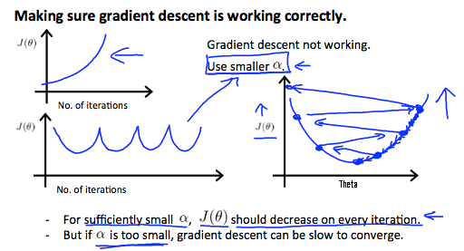

# Machine Learning Theory Aspects

## General

### Model Representation

+ $h\;$: hypothesis function
  + mapping from $x$ to predicted $y$
  + E.g., $h_\theta(x) = \theta_0 + \theta_1 \cdot x_1$

### Pipeline

## Supervised Learning

### Linear Regression

#### Model: Linear Regression

+ [Simple Linear Regression](../ML/ML-Stanford/02-ModelCost.md#cost-function-intuition-ii):

	+ Hypothesis: $h_\theta (x) = \theta_0 + \theta_1 \cdot x$

  + Parameters: $\theta_0$, $\theta_1$

  + Cost Function: $J(\theta_0, \theta_1) = \displaystyle \frac{1}{2m} \sum_{i=1}^m (h_\theta(x^{(i)}) - y^{(i)})^2$

  + Goal: $\displaystyle \min_{\theta_0, \theta_1} J(\theta_0, \theta_1)$

+ [Multivariate Linear Regression Model](../ML/ML-Stanford/04-LRegMVar.md#gradient-descent-for-multiple)

  + Hypothesis function

    $$h_\theta(x) =\theta^T x = \theta_0 x_0 + \theta_1 x_1 + \ldots + \theta_n x_n \Longrightarrow \theta^T \cdot X$$

  + Parameters: 
  
    $$\quad \theta_0, \theta_1, \ldots, \theta_n \Longrightarrow \theta = \begin{bmatrix} \theta_0 \\ \theta_1 \\ \ldots \\ \theta_n \end{bmatrix}\quad$$

    $\theta$: a $(n+1)$-dimensional vector

  + Cost function:

    $$J(\theta) = J(\theta_0, \theta_1, \ldots, \theta_n) = \displaystyle \frac{1}{m} \sum_{i=1}^m (h_\theta (x^{(i)}) - y^{(i)})^2$$

#### Cost Function: Linear Regression

+ [Squared error function](../ML/ML-Stanford/02-ModelCost.md#cost-function-intuition-ii): $J(\theta_0, \theta_1)$

	An average difference (actually a fancier version of an average) of all the results of the hypothesis with inputs from x's and the actual output y's.

	$$J(\theta_0, \theta_1) = \dfrac {1}{2m} \displaystyle \sum _{i=1}^m \left ( \hat{y}_{i}- y_{i} \right)^2 = \dfrac {1}{2m} \displaystyle \sum _{i=1}^m \left (h_\theta (x_{i}) - y_{i} \right)^2$$

+ [Multivariate Cost Function](../ML/ML-Stanford/04-LRegMVar.md#gradient-descent-for-multiple)

  $$J(\theta) = J(\theta_0, \theta_1, \ldots, \theta_n) = \displaystyle \frac{1}{m} \sum_{i=1}^m (h_\theta (x^{(i)}) - y^{(i)})^2$$

#### Gradient Descent: Linear Regression

+ [Simplest Gradient descent](../ML/ML-Stanford/02-ModelCost.md#gradient-descent)
  + Objective: Have some function $J(\theta_0, \theta_1)$  
    Want $\;\;\displaystyle \min_{\theta_0, \theta_1} J(\theta_0, \theta_1)$
  + Outline
    + start with some $\theta_0, \theta_1$
    + keep changing $\theta_0, \theta_1$ to reduce $J(\theta_0, \theta_1)$ until we hopefully end up with at a minimum

+ [Simplest Gradient descent algorithm](../ML/ML-Stanford/02-ModelCost.md#gradient-descent):

   Repeat until convergence {

	$$\theta_j := \theta_j - \alpha \displaystyle \frac{\partial}{\partial \theta_j} J(\theta_0, \theta_1)$$

	(simultaneously update $i = 0, 1$) 
	}

	+ $\frac{\partial}{\partial \theta_j} J(\theta_0, \theta_1)\;$: derivative; sign (+, -) as slope and value as steepness
	+ $:=\;$: assignment, take the right-hand side value asn assign to the symbol right-hand side
	+ $=\;$: truth association, comparison
	+ $\alpha\;$: learning rate, step size

+ [Multivariate gradient decent](../ML/ML-Stanford/02-ModelCost.md#gradient-descent)
  + Objective: Have some function $J(\theta)$ where $\theta = (\theta_0, \theta_1, \ldots, \theta_n)$  
    Want $\;\;\displaystyle \min_{\theta} J(\theta)$
  + Outline
    + start with some $\theta$
    + keep changing $\theta$ to reduce $J(\theta)$ until we hopefully end up with at a minimum

+ [Multivariate linear repression ($n \geq 1$) algorithm](../ML/ML-Stanford/04-LRegMVar.md#gradient-descent-for-multiple)

  Repeat {

    $$\theta_j := \theta_j -\alpha \frac{1}{m} \sum_{i=1}^m (h_\theta (x^{(i)}) - y^{(i)})= \theta_j -\alpha \frac{\partial}{\partial \theta_j} J(\theta)$$
     (simultaneously update  $\theta_j \;$ for $j=0, 1, \ldots, n$) 
  }

  Extended version: with $x_0^{(i)} = 1$

    $$\begin{array}{ccc}
      \theta_0 &:=& \theta_0 -\alpha \displaystyle \frac{1}{m} \sum_{i=1}^m (h_\theta (x^{(i)}) - y^{(i)}) \cdot x_0^{(i)} \\\\
      \theta_1 &:=& \theta_1 -\alpha \displaystyle \frac{1}{m} \sum_{i=1}^m (h_\theta (x^{(i)}) - y^{(i)}) \cdot x_1^{(i)} \\\\
      \theta_2 &:=& \theta_2 -\alpha \displaystyle \frac{1}{m} \sum_{i=1}^m (h_\theta (x^{(i)}) - y^{(i)}) \cdot x_2^{(i)} \\\\
      & \cdots &
    \end{array}$$

#### Vectorization: Linear Regression

+ The Gradient Descent rule can be expressed as:

  $$\theta := \theta - \alpha \nabla J(\theta)$$

  Where $\nabla J(\theta)$ is a column vector of the form:

  $$\nabla J(\theta) = \begin{bmatrix} \dfrac{\partial J(\theta)}{\partial \theta_0} \\\\ \dfrac{\partial J(\theta)}{\partial \theta_1} \\ \vdots \\  \dfrac{\partial J(\theta)}{\partial \theta_n} \end{bmatrix}$$

  The $j$-th component of the gradient is the summation of the product of two terms:

  $$\begin{array}{ccc} \dfrac{\partial J(\theta)}{\partial \theta_j} & = &\dfrac{1}{m} \displaystyle \sum_{i=1}^m (h_\theta(x^{(i)}) - y^{(i)}) \cdot x_j^{(i)} \\\\ & = & \dfrac{1}{m} \displaystyle \sum_{i=1}^m x_j^{(i)} \cdot (h_\theta(x^{(i)}) - y^{(i)}) \end{array}$$

  Sometimes, the summation of the product of two terms can be expressed as the product of two vectors.

  Here, $x_j^{(i)}$, for $i = 1, \ldots, m$, represents the $m$ elements of the j-th column, $\vec{x_j}$, of the training set $X$.

  The other term $\left(h_\theta(x^{(i)}) - y^{(i)} \right)$ is the vector of the deviations between the predictions $h_\theta(x^{(i)})$ and the true values $y^{(i)}$. Re-writing $\frac{\partial J(\theta)}{\partial \theta_j}$, we have:

  $$\begin{array}{ccc} \dfrac{\partial J(\theta)}{\partial \theta_j} & = & \dfrac{1}{m} \vec{x_j}^T (X\theta - \vec{y}) \\\\ \nabla J(\theta) &=& \dfrac{1}{m} X^T (X\theta - \vec{y}) \end{array}$$

  Finally, the matrix notation (vectorized) of the Gradient Descent rule is:

  $$\theta := \theta - \dfrac{\alpha}{m} X^T (X\theta - \vec{y})$$

#### [Polynomial Regression](../ML/ML-Stanford/04-LRegMVar.md#features-and-polynomial-regression)

+ Polynomial regression

  

    

  

  $$\theta_0 + \theta_1 x + \theta_2 x^2 \quad \text{or} \quad \theta_0 + \theta_1 x + \theta_2 x^2 + \theta_3 x^3 \quad \text {or} \quad \ldots$$

  + If cubic model fits,

      $$\begin{array}{rcl}
          h_\theta(x) & = & \theta_0 + \theta_1 x_1 + \theta_2 x_2 + \theta_3 x_3 \\\\
          & = & \theta_0 + \theta(size) + \theta_2 (size)^2 + \theta_3 (size)^3
      \end{array}$$

      where $x_1 = (size), x_2 = (size)^2, x_3 = (size)^3$

+ Choose of features

  

    

  

  $$\begin{array}{rcl}
    h_\theta(x) & = & \theta_0 + \theta_1 (size) + \theta_2 (size)^3 \\\\
    h_\theta(x) & = & \theta_0 + \theta_1 (size) + \theta_2 \sqrt{(size)}
  \end{array}$$

#### [Normal Equation](../ML/ML-Stanford/04-LRegMVar.md#normal-equation)

+ Normal equation: Method to solve for $\theta$ analytically.

+ Generalized: for $\; \theta \in \mathbb{R}^{n+1}$

  $$J(\theta_0, \theta_1, \ldots, \theta_m) = \dfrac{1}{2m} \sum_{i=1}^m (h_\theta(x^{(i)}) - y^{(i)})^2$$
   

  $$\theta = \begin{bmatrix} \theta_1 \\ \theta_2 \\ \vdots \\ \theta_m \end{bmatrix} = (X^TX)^{-1} X^T y$$
   

  $$\dfrac{\partial}{\partial \theta_j} J(\theta) = \cdots = 0, \quad \forall j \Longrightarrow \text{solve for } \theta_0, \theta_1, \ldots, \theta_n$$

+ comparison of gradient descent and the normal equation:
  + Gradient descent
    + Need to choose $\alpha$
    + Need many iterations
    + $\mathcal{O}(kn^2)$
    + Works well when $n$ is large
  + Normal Equation
    + Not need to choose $\alpha$
    + No need to iterate
    + $\mathcal{O}(n^3)$, need to calculate inverse of $X^TX$ 
    + Slow if $n$ is very large

+ [What if $X^TX$ is non-invertible?](../ML/ML-Stanford/04-LRegMVar.md#normal-equation-noninvertibility)
  + Redundant features (linearly dependent)
  + Too many features (e.g. $m \leq n$): Delete some features, or use regularization

### Logistic Regression

### Neural Network

### Support Vector Machine (SVM)

## Unsupervised Learning

### K-means

### Principal Component Analysis (PCA)

### Anomaly Detection

## Special Applications

### Recommender System

### Large Scale Machine Learning

## Advice on building a Machine Learning System

### [Learning Rate $\alpha$](../ML/ML-Stanford/04-LRegMVar.md#gradient-descent-in-practice-ii-learning-rate)

+ Learning rate & Gradient Descent

  

    

  

  + $J(\theta) \uparrow$ as number of iterations $\uparrow \quad \Longrightarrow \quad$ gradient not working, $\alpha$ too big
  + For sufficiently small $\alpha$, $J(\theta)$ should decrease on every iteration.
  + If $\alpha$ is too small, gradient descent can be slow to converge.

+ Summary
  + If $\alpha$ too small: slow convergence.
  + If $\alpha$ too large: $J(\theta)$ may not decrease on every iteration; may not converge; slow converge also possible
  + Best practice: to choose $\alpha$, try

    $$\ldots, 0.001, 0.003, , 0.01, 0.03, 0.1, 0.3, 1, \ldots$$

### Bias/Variance

### Regularization

### Evaluation

### Learning Curve

### Error Analysis

### Ceiling Analysis