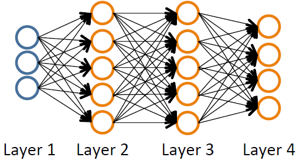

# Machine Learning Theory Aspects

## General

### Model Representation

<a href="https://www.coursera.org/learn/machine-learning/supplement/cRa2m/model-representation">
    
</a>

+ $h\;$: hypothesis function
  + mapping from $x$ to predicted $y$
  + E.g., $h_\theta(x) = \theta_0 + \theta_1 \cdot x_1$

### Pipeline


## Supervised Learning

### Linear Regression

#### Model: Linear Regression

+ [Simple Linear Regression](../ML/ML-Stanford/02-ModelCost.md#cost-function-intuition-ii):
	+ Hypothesis: $h_\theta (x) = \theta_0 + \theta_1 \cdot x$
  + Parameters: $\theta_0$, $\theta_1$
  + Cost Function: $J(\theta_0, \theta_1) = \displaystyle \frac{1}{2m} \sum_{i=1}^m (h_\theta(x^{(i)}) - y^{(i)})^2$
  + Goal: $\displaystyle \min_{\theta_0, \theta_1} J(\theta_0, \theta_1)$


+ [Multivariate Linear Regression Model](../ML/ML-Stanford/04-LRegMVar.md#gradient-descent-for-multiple)
  + Hypothesis function

    $$h_\theta(x) =\theta^T x = \theta_0 x_0 + \theta_1 x_1 + \ldots + \theta_n x_n \Longrightarrow \theta^T \cdot X$$

  + Parameters: 
  
    $$\quad \theta_0, \theta_1, \ldots, \theta_n \Longrightarrow \theta = \begin{bmatrix} \theta_0 \\ \theta_1 \\ \ldots \\ \theta_n \end{bmatrix}\quad$$

    $\theta$: a $(n+1)$-dimensional vector

  + Cost function:

    $$J(\theta) = J(\theta_0, \theta_1, \ldots, \theta_n) = \displaystyle \frac{1}{m} \sum_{i=1}^m (h_\theta (x^{(i)}) - y^{(i)})^2$$


#### Cost Function: Linear Regression

+ [Squared error function](../ML/ML-Stanford/02-ModelCost.md#cost-function-intuition-ii): $J(\theta_0, \theta_1)$

	An average difference (actually a fancier version of an average) of all the results of the hypothesis with inputs from x's and the actual output y's.

	$$J(\theta_0, \theta_1) = \dfrac {1}{2m} \displaystyle \sum _{i=1}^m \left ( \hat{y}_{i}- y_{i} \right)^2 = \dfrac {1}{2m} \displaystyle \sum _{i=1}^m \left (h_\theta (x_{i}) - y_{i} \right)^2$$

+ [Multivariate Cost Function](../ML/ML-Stanford/04-LRegMVar.md#gradient-descent-for-multiple)

  $$J(\theta) = J(\theta_0, \theta_1, \ldots, \theta_n) = \displaystyle \frac{1}{m} \sum_{i=1}^m (h_\theta (x^{(i)}) - y^{(i)})^2$$

+ [Convergence](../ML/ML-Stanford/06-Logistic.md#logistic-regression-model)

  $$J(\theta) = \dfrac{1}{m} \sum_{i=1}^m \dfrac{1}{2} (h_\theta(x^{(i)}) - y^{(i)})^2$$

  <br/>

  $$\text{Cost}(h_\theta(x^{(i)}, y^{(i)})) = \dfrac{1}{2} (h_\theta(x^{(i)}) - y^{(i)})^2 \quad \Longrightarrow \quad \text{Cost}(h_\theta(x, y)) = \dfrac{1}{2} (h_\theta(x) - y)^2  \quad \Rightarrow \quad \text{Convex}$$


+ [Cost Function with regularization](../ML/ML-Stanford/07-Overfit.md#regularized-linear-regression)

  $$J(\theta) = \dfrac{1}{2m} \left[ \sum_{i=1}^m (h_\theta (x^{(i)}) - y^{(i)})^2 + \lambda \sum_{j=1}^n \theta_j^2 \right] \quad \Longrightarrow \quad \min_\theta J(\theta)$$

+ [Regularization linear regression](../ML/ML-Stanford/07-Overfit.md#the-problem-of-overfitting)

  $$\min_\theta\ \dfrac{1}{2m}\ \sum_{i=1}^m (h_\theta(x^{(i)}) - y^{(i)})^2 + \lambda\ \sum_{j=1}^n \theta_j^2$$

+ [Cost function of regularized linear regression](../ML/ML-Stanford/ex05.md#1-2-regularized-linear-regression-cost-function)

  $$J(\theta) = \dfrac{1}{2m} \left( \sum_{i=1}^m (h_\theta(x^{(i)}) - y^{(i)})^2 \right) + \dfrac{\lambda}{2m} \left( \sum_{j=1}^n \theta_j^2 \right)$$

  + $\lambda\;$: regularization parameter to control the degree of regularization [prevent from overfitting]
  + put a penalty on the overall cost $J$
  + $\theta\uparrow \implies J \uparrow$


#### Gradient Descent: Linear Regression

+ [Simplest Gradient descent](../ML/ML-Stanford/02-ModelCost.md#gradient-descent)
  + Objective: Have some function $J(\theta_0, \theta_1)$ <br/>
    Want $\;\;\displaystyle \min_{\theta_0, \theta_1} J(\theta_0, \theta_1)$
  + Outline
    + start with some $\theta_0, \theta_1$
    + keep changing $\theta_0, \theta_1$ to reduce $J(\theta_0, \theta_1)$ until we hopefully end up with at a minimum


+ [Simplest Gradient descent algorithm](../ML/ML-Stanford/02-ModelCost.md#gradient-descent):

   Repeat until convergence {

	<span style="padding-left: 2em;"/> $$\theta_j := \theta_j - \alpha \displaystyle \frac{\partial}{\partial \theta_j} J(\theta_0, \theta_1)$$

	<span style="padding-left: calc(50vw - 10em);">(simultaneously update</span> $i = 0, 1$)<br/>
	}

	+ $\frac{\partial}{\partial \theta_j} J(\theta_0, \theta_1)\;$: derivative; sign (+, -) as slope and value as steepness
	+ $:=\;$: assignment, take the right-hand side value asn assign to the symbol right-hand side
	+ $=\;$: truth association, comparison
	+ $\alpha\;$: learning rate, step size


+ [Multivariate gradient decent](../ML/ML-Stanford/02-ModelCost.md#gradient-descent)
  + Objective: Have some function $J(\theta)$ where $\theta = (\theta_0, \theta_1, \ldots, \theta_n)$ <br/>
    Want $\;\;\displaystyle \min_{\theta} J(\theta)$
  + Outline
    + start with some $\theta$
    + keep changing $\theta$ to reduce $J(\theta)$ until we hopefully end up with at a minimum

+ [Multivariate linear repression ($n \geq 1$) algorithm](../ML/ML-Stanford/04-LRegMVar.md#gradient-descent-for-multiple)

  Repeat {

    $$\theta_j := \theta_j -\alpha \frac{1}{m} \sum_{i=1}^m (h_\theta (x^{(i)}) - y^{(i)})= \theta_j -\alpha \frac{\partial}{\partial \theta_j} J(\theta)$$
    <span style="padding-top: 0.5em; padding-left: calc(50vw - 5em);"> (simultaneously update </span> $\theta_j \;$ for $j=0, 1, \ldots, n$)<br/>
  }

  Extended version: with $x_0^{(i)} = 1$

    $$\begin{array}{ccc}
      \theta_0 &:=& \theta_0 -\alpha \displaystyle \frac{1}{m} \sum_{i=1}^m (h_\theta (x^{(i)}) - y^{(i)}) \cdot x_0^{(i)} \\\\
      \theta_1 &:=& \theta_1 -\alpha \displaystyle \frac{1}{m} \sum_{i=1}^m (h_\theta (x^{(i)}) - y^{(i)}) \cdot x_1^{(i)} \\\\
      \theta_2 &:=& \theta_2 -\alpha \displaystyle \frac{1}{m} \sum_{i=1}^m (h_\theta (x^{(i)}) - y^{(i)}) \cdot x_2^{(i)} \\\\
      & \cdots &
    \end{array}$$

+ [Gradient Descent with Regularization](../ML/ML-Stanford/07-Overfit.md#regularized-linear-regression)

  Repeat {
  
    $$\begin{array}{rcl} \theta_0 &:=& \theta_0 − \alpha \dfrac{1}{m} \sum_{i=1}^m (h_\theta(x^{(i)}) − y^{(i)}) x^{(i)}_0 \\\\  \theta_j &:=& \theta_j − \alpha \left[(\dfrac{1}{m} \sum_{i=1}^m (h_\theta(x^{(i)})−y^{(i)})x^{(i)}_j) + \dfrac{\lambda}{m} \theta_j \right] \quad\quad j \in \{1,2\ldots n\} \end{array}$$
  }

  $$\theta_j := \underbrace{\theta_j (1 - \alpha \dfrac{\lambda}{m})}_{ \approx \theta_j, \text{ eg. }\theta_j \times 0.99} - \underbrace{\alpha \dfrac{1}{m} \sum_{i=1}^m (h_\theta(x^{(i)}) - y^{(i)})x^{(i)}}_{\text{same as } J(\theta)}$$

+ [The partial derivatives of regularized linear regression's cost for $\theta_j$](../ML/ML-Stanford/ex05.md#1-3-regularized-linear-regression-gradient)

  $$\dfrac{\partial J(\theta)}{\partial \theta_0}  = \begin{cases} \dfrac{1}{m} \sum_{i=1}^m (h_\theta(x^{(i)}) - y^{(i)}) x_j^{(i)} & \text{for } j = 0 \\\\ \dfrac{1}{m} \sum_{i=1}^m (h_\theta(x^{(i)}) - y^{(i)}) x_j^{(i)} + \dfrac{\lambda}{m} \theta_j & \text{for } j \geq 1 \end{cases}$$


#### Vectorization: Linear Regression


+ The Gradient Descent rule can be expressed as:

  $$\theta := \theta - \alpha \nabla J(\theta)$$

  Where $\nabla J(\theta)$ is a column vector of the form:

  $$\nabla J(\theta) = \begin{bmatrix} \dfrac{\partial J(\theta)}{\partial \theta_0} \\\\ \dfrac{\partial J(\theta)}{\partial \theta_1} \\ \vdots \\  \dfrac{\partial J(\theta)}{\partial \theta_n} \end{bmatrix}$$

  The $j$-th component of the gradient is the summation of the product of two terms:

  $$\begin{array}{ccc} \dfrac{\partial J(\theta)}{\partial \theta_j} & = &\dfrac{1}{m} \displaystyle \sum_{i=1}^m (h_\theta(x^{(i)}) - y^{(i)}) \cdot x_j^{(i)} \\\\ & = & \dfrac{1}{m} \displaystyle \sum_{i=1}^m x_j^{(i)} \cdot (h_\theta(x^{(i)}) - y^{(i)}) \end{array}$$

  Sometimes, the summation of the product of two terms can be expressed as the product of two vectors.

  Here, $x_j^{(i)}$, for $i = 1, \ldots, m$, represents the $m$ elements of the j-th column, $\vec{x_j}$, of the training set $X$.

  The other term $\left(h_\theta(x^{(i)}) - y^{(i)} \right)$ is the vector of the deviations between the predictions $h_\theta(x^{(i)})$ and the true values $y^{(i)}$. Re-writing $\frac{\partial J(\theta)}{\partial \theta_j}$, we have:

  $$\begin{array}{ccc} \dfrac{\partial J(\theta)}{\partial \theta_j} & = & \dfrac{1}{m} \vec{x_j}^T (X\theta - \vec{y}) \\\\ \nabla J(\theta) &=& \dfrac{1}{m} X^T (X\theta - \vec{y}) \end{array}$$

  Finally, the matrix notation (vectorized) of the Gradient Descent rule is:

  $$\theta := \theta - \dfrac{\alpha}{m} X^T (X\theta - \vec{y})$$

+ [Batch gradient descent for each iteration](../ML/ML-Stanford/ex01.md#update-equations-derivation-)

  $$\theta_j := \theta_j - \alpha \dfrac{1}{m} \sum_{i=1}^{m} (h_\theta(x^{(i)}) - y^{(i)}) x_j^{(i)}$$
  <span style="text-align: center; padding-top: 0.5em;padding-left: calc(50vw - 5em);"> (simultaneously update </span>
  $\; \theta_j, \;\; \forall j$)<br/>

  + Notations:

    $$X = \begin{bmatrix} x_0^{(1)} & x_1^{(1)} & \cdots & x_n^{(1)} \\
    x_0^{(2)} & x_1^{(2)} & \cdots & x_n^{(2)} \\
    \vdots & \vdots & \ddots & \vdots \\
    x_0^{(m)} & x_1^{(m)} & \cdots & x_n^{(m)}
    \end{bmatrix} = \begin{bmatrix} x^{(1)} \\ x^{(2)} \\ \vdots \\ x^{(m)} \end{bmatrix}\quad\quad\quad
    \vec{y} = \begin{bmatrix} y^{(0)} \\ y^{(2)} \\ \vdots \\ y^{(m)}  \end{bmatrix} \quad\quad\quad
    \vec{\theta} = \begin{bmatrix} \theta_0 \\ \theta_1 \\ \vdots \\ \theta_m \end{bmatrix}
    $$
    <br/>

  + Vectorization of Hypothesis Function

    $$\begin{array}{rcl}
    h_\theta (x^{(i)}) & = & \theta_0 x_0^{(i)} + \theta_1 x_1^{(i)} + \cdots + \theta_n x_n^{(i)} \\\\
    h_\theta (X) & = & \begin{bmatrix} h_\theta(x^{(1)}) \\ h_\theta(x^{(2)}) \\ \vdots \\ h_\theta(x^{(m)}) \end{bmatrix} = 
    \begin{bmatrix} \theta_0 x_0^{(1)} + \theta_1 x_1^{(1)} + \cdots + \theta_n x_n^{(1)} \\ \theta_0 x_0^{(2)} + \theta_1 x_1^{(2)} + \cdots + \theta_n x_n^{(2)} \\ \vdots \\ \theta_0 x_0^{(m)} + \theta_1 x_1^{(m)} + \cdots + \theta_n x_n^{(m)} \end{bmatrix} = \begin{bmatrix} x_0^{(1)} & x_1^{(1)} & \cdots & x_n^{(1)} \\ x_0^{(1)} & x_1^{(2)} & \cdots & x_n^{(2)}  \\ \vdots & \vdots & \ddots & \vdots \\ x_0^{(m)} & x_1^{(m)} & \cdots & x_n^{(m)} \end{bmatrix} 
    \begin{bmatrix} \theta_0 \\ \theta_1 \\ \vdots \\ \theta_n \end{bmatrix} = X \vec{\theta}
    \end{array}$$

  + Vectorization for Cost function

    $$\begin{array}{rcl}
    J(\vec{\theta}) & = & \dfrac{1}{2m} \sum_{i=1}^m (h_\theta(x^{(i)}) - y^{(i)})^2 \\\\ & = & \dfrac{1}{2m} \begin{bmatrix} h_\theta(x^{(1)}) - y^{(1)} & h_\theta(x^{(2)}) - y^{(2)} & \cdots & h_\theta(x^{(m)}) - y^{(m)} \end{bmatrix}  \begin{bmatrix} h_\theta(x^{(1)}) - y^{(1)} \\ h_\theta(x^{(2)}) - y^{(2)} \\ \vdots \\ h_\theta(x^{(m)}) - y^{(m)} \end{bmatrix} \\\\ & = & \dfrac{1}{2m} \begin{bmatrix} h_\theta(x^{(1)}) - y^{(1)} \\ h_\theta(x^{(2)}) - y^{(2)} \\ \vdots \\ h_\theta(x^{(m)}) - y^{(m)} \end{bmatrix}^T \begin{bmatrix} h_\theta(x^{(1)}) - y^{(1)} \\ h_\theta(x^{(2)}) - y^{(2)} \\ \vdots \\ h_\theta(x^{(m)}) - y^{(m)} \end{bmatrix} \\ \\ & = & \dfrac{1}{2m} \left( \begin{bmatrix} h_\theta(x^{(1)}) \\ h_\theta(x^{(2)}) \\ \vdots \\ h_\theta(x^{(m)})\end{bmatrix} - \begin{bmatrix} y^{(1)} \\ y^{(2)} \\ \vdots \\ y^{(m)} \end{bmatrix} \right)^T \left( \begin{bmatrix} h_\theta(x^{(1)}) \\ h_\theta(x^{(2)}) \\ \vdots \\ h_\theta(x^{(m)})\end{bmatrix} - \begin{bmatrix} y^{(1)} \\ y^{(2)} \\ \vdots \\ y^{(m)} \end{bmatrix} \right) \\\\ & = & \dfrac{1}{2m} (X\vec{\theta} - \vec{y})^T (X\vec{\theta} - \vec{y}) \end{array}$$

  + Vectorization for Batch Gradient Descent

    $$\begin{array}{rcl} \vec{\theta} & := & \vec{\theta} - \alpha \dfrac{1}{m} \begin{bmatrix} \sum_{i=1}^m (h_\theta (x^{(i)} - y^{(i)}) x_0^{(i)} \\\\ \sum_{i=1}^m (h_\theta (x^{(i)} - y^{(i)}) x_1^{(i)} \\ \vdots \\ \sum_{i=1}^m (h_\theta (x^{(m)} - y^{(m)}) x_1^{(m)} \end{bmatrix} = \vec{\theta} - \dfrac{\alpha}{m} \begin{bmatrix} \sum_{i=1}^m h_\theta (x^{(i)} \cdot x_0^{(i)} - \sum_{i=1}^m y^{(i)}) \cdot x_0^{(i)} \\\\  \sum_{i=1}^m h_\theta (x^{(i)} \cdot x_1^{(i)} - \sum_{i=1}^m y^{(i)}) \cdot x_1^{(i)} \\ \vdots \\ \sum_{i=1}^m h_\theta (x^{(i)} \cdot x_m^{(i)} - \sum_{i=1}^m y^{(i)}) \cdot x_m^{(i)} \end{bmatrix} \\\\ & = & \vec{\theta} - \dfrac{\alpha}{m} \left( \underbrace{\begin{bmatrix} \sum_{i=1}^m h_\theta (x^{(i)} \cdot x_0^{(i)} \\\\ \sum_{i=1}^m h_\theta (x^{(i)} \cdot x_1^{(i)} \\ \vdots \\ \sum_{i=1}^m h_\theta (x^{(i)} \cdot x_m^{(i)}  \end{bmatrix}}_{(A)} - \underbrace{\begin{bmatrix} \sum_{i=1}^m y^{(i)}) \cdot x_0^{(i)} \\\\ \sum_{i=1}^m y^{(i)}) \cdot x_1^{(i)} \\ vdots \\ \sum_{i=1}^m y^{(i)}) \cdot x_m^{(i)}  \end{bmatrix}}_{(B)} \right)
    \end{array}$$

    Part (A) with $j$

    $$\begin{array}{rcl} \displaystyle \sum_{i=1}^m h_\theta(x^{(i)}) \cdot x_j^{(i)} & = &h_\theta(x^{(1)}) x_0^{(1)} + h_\theta(x^{(2)}) x_j^{(2)} + \cdots + h_\theta(x^{(n)}) x_j^{(n)} \\\\ & = & \begin{bmatrix} x_j^{(1)} & x_j^{(2)} & \cdots & x_j^{(m)}\end{bmatrix} \begin{bmatrix} h_\theta(x^{(1)}) \\ h_\theta(x^{(2)}) \\ \vdots \\ h_\theta(x^{(m)}) \end{bmatrix}  \\ & = & \begin{bmatrix} x_j^{(1)} & x_j^{(2)} & \cdots & x_j^{(m)}\end{bmatrix} h_\theta(X) = \begin{bmatrix} x_j^{(1)} & x_j^{(2)} & \cdots & x_j^{(m)} \end{bmatrix} X\vec{\theta} \end{array}$$

    Part (A) $\;\forall j$

    $$\begin{bmatrix} \sum_{i=1}^m h_\theta (x^{(i)} \cdot x_0^{(i)} \\\\ \sum_{i=1}^m h_\theta (x^{(i)} \cdot x_1^{(i)} \\ \vdots \\ \sum_{i=1}^m h_\theta (x^{(i)} \cdot x_m^{(i)}  \end{bmatrix} = \begin{bmatrix} x_0^{(1)} & x_0^{(2)} & \cdots & x_0^{(m)} \\ x_1^{(1)} & x_1^{(2)} & \cdots & x_1^{(m)} \\ \vdots & \vdots & \ddots & \vdots \\ x_j^{(1)} & x_j^{(2)} & \cdots & x_j^{(m)} \end{bmatrix} h_\theta(X) = X^TX\vec{\theta}$$

    Part (B) for $j$

    $$\begin{array}{rcl} \sum_{i=1}^m y^{(i)} x_j^{(i)} & = & x_j^{(1)} y^{(1)} + x_j^{(2)} y^{(2)} + \cdots + x_j^{(m)} y^{(m)} \\\\ & = & \begin{bmatrix} x_j^{(1)} & x_j^{(2)} & \cdots & x_j^{(m)} \end{bmatrix} \begin{bmatrix} y^{(1)} \\ y^{(2)} \\ \vdots \\ y^{(m)} \end{bmatrix} = \begin{bmatrix} x_j^{(1)} & x_j^{(2)} & \cdots & x_j^{(m)} \end{bmatrix} \vec{y}
    \end{array}$$

    Part (B) $\;\forall j$

    $$\begin{bmatrix} \sum_{i=1}^m y^{(i)}) \cdot x_0^{(i)} \\\\ \sum_{i=1}^m y^{(i)}) \cdot x_1^{(i)} \\ \vdots \\ \sum_{i=1}^m y^{(i)}) \cdot x_m^{(i)}  \end{bmatrix} = \begin{bmatrix} x_0^{(1)} & x_0^{(2)} & \cdots & x_0^{(m)} \\ x_1^{(1)} & x_1^{(2)} & \cdots & x_1^{(m)} \\ \vdots & \vdots & \ddots & \vdots \\ x_j^{(1)} & x_j^{(2)} & \cdots & x_j^{(m)} \end{bmatrix} \vec{y} = X^T \vec{y}$$

    Therefore, the batch gradient descent iteration can be obtained with

    $$\vec{\theta} := \vec{\theta} - \alpha \dfrac{1}{m} \begin{bmatrix} \sum_{i=1}^m (h_\theta (x^{(i)} - y^{(i)}) x_0^{(i)} \\\\ \sum_{i=1}^m (h_\theta (x^{(i)} - y^{(i)}) x_1^{(i)} \\ \vdots \\ \sum_{i=1}^m (h_\theta (x^{(m)} - y^{(m)}) x_1^{(m)} \end{bmatrix} = \vec{\theta} - \dfrac{\alpha}{m} (X^TX\vec{\theta} - X^T\vec{Y}) = \vec{\theta} - \dfrac{\alpha}{m} X^T (X\vec{\theta} - \vec{y})$$


#### [Polynomial Regression](../ML/ML-Stanford/04-LRegMVar.md#features-and-polynomial-regression)

+ Polynomial regression

  <div style="display:flex;justify-content:center;align-items:center;flex-flow:row wrap;">
    <div><a href="url">
      
    </a></div>
  </div>

  $$\theta_0 + \theta_1 x + \theta_2 x^2 \quad \text{or} \quad \theta_0 + \theta_1 x + \theta_2 x^2 + \theta_3 x^3 \quad \text {or} \quad \ldots$$

  + If cubic model fits,

      $$\begin{array}{rcl}
          h_\theta(x) & = & \theta_0 + \theta_1 x_1 + \theta_2 x_2 + \theta_3 x_3 \\\\
          & = & \theta_0 + \theta(size) + \theta_2 (size)^2 + \theta_3 (size)^3
      \end{array}$$

      where $x_1 = (size), x_2 = (size)^2, x_3 = (size)^3$

+ Choose of features

  <div style="display:flex;justify-content:center;align-items:center;flex-flow:row wrap;">
    <div><a href="url">
      
    </a></div>
  </div>

  $$\begin{array}{rcl}
    h_\theta(x) & = & \theta_0 + \theta_1 (size) + \theta_2 (size)^3 \\\\
    h_\theta(x) & = & \theta_0 + \theta_1 (size) + \theta_2 \sqrt{(size)}
  \end{array}$$


#### [Normal Equation](../ML/ML-Stanford/04-LRegMVar.md#normal-equation)

+ Normal equation: Method to solve for $\theta$ analytically.

+ Generalized: for $\; \theta \in \mathbb{R}^{n+1}$

  $$J(\theta_0, \theta_1, \ldots, \theta_m) = \dfrac{1}{2m} \sum_{i=1}^m (h_\theta(x^{(i)}) - y^{(i)})^2$$
  <br/>

  $$\theta = \begin{bmatrix} \theta_1 \\ \theta_2 \\ \vdots \\ \theta_m \end{bmatrix} = (X^TX)^{-1} X^T y$$
  <br/>

  $$\dfrac{\partial}{\partial \theta_j} J(\theta) = \cdots = 0, \quad \forall j \Longrightarrow \text{solve for } \theta_0, \theta_1, \ldots, \theta_n$$

+ comparison of gradient descent and the normal equation:
  + Gradient descent
    + Need to choose $\alpha$
    + Need many iterations
    + $\mathcal{O}(kn^2)$
    + Works well when $n$ is large
  + Normal Equation
    + Not need to choose $\alpha$
    + No need to iterate
    + $\mathcal{O}(n^3)$, need to calculate inverse of $X^TX$ 
    + Slow if $n$ is very large

+ [What if $X^TX$ is non-invertible?](../ML/ML-Stanford/04-LRegMVar.md#normal-equation-noninvertibility)
  + Redundant features (linearly dependent)
  + Too many features (e.g. $m \leq n$): Delete some features, or use regularization

+ [Vectorized Normal Equation](../ML/ML-Stanford/07-Overfit.md#regularized-linear-regression)

  $$X = \underbrace{\begin{bmatrix}(x^{(1)})^T \\ \vdots \\ (x^{(m)})^T \end{bmatrix}}_{m \times (n+1) \text{ matrix}} \qquad\qquad y = \underbrace{\begin{bmatrix} y^{(1)} \\ \vdots \\ y^{(m)} \end{bmatrix}}_{\in \mathbb{R}^m}$$

  To $\min_\theta J(\theta) \qquad \Longrightarrow \qquad \text{(set) }\dfrac{\partial}{\partial \theta_j} J(\theta) = 0$,

  $$\theta = \left(X^TX + \lambda \underbrace{\begin{bmatrix} 0 & & & & \\ & 1 & & & \\ & & 1 & & \\ & & & \ddots & \\ & & & & 1\end{bmatrix}}_{(n+1) \times (n+1) \text{ matrix}} \right)^{-1} X^Ty$$

+ [Non-invertibility for Vectorized Normal Equation](../ML/ML-Stanford/07-Overfit.md#regularized-linear-regression)

  Suppose $m \leq n$, $m$ as the number of examples and $n$ as the number of features

  $$\theta = (X^TX)^{-1}X^T y$$

  where $((X^TX)^{-1}$ is non-invertible / singular.

  If $\lambda > 0$, the regularization will solve the non-invertible issue, 

  $$\theta = \left(\underbrace{X^TX + \lambda \begin{bmatrix} 0 & & & & \\ & 1 & & & \\ & & 1 & & \\ & & & \ddots & \\ & & & & 1\end{bmatrix}}_{invertible} \right)^{-1} X^Ty$$


### Logistic Regression

#### Model: Logistic Regression

+ [Classification problem](../ML/ML-Stanford/06-Logistic.md#cost-function)
  + Training set: $\quad \{(x^{(1)}, y^{(1)}), (x^{(2)}, y^{(2)}), \ldots, (x^{(m)}, y^{(m)})\}$
  + $m$ examples: $\quad x \in \begin{bmatrix} x_0 \\ x_1 \\ \cdots \\ x_n \end{bmatrix} \in \mathbb{R}^{n+1} \quad\quad x_0 = 1, y \in \{0, 1\}$
  + Hypothesis function: $\quad h_\theta(x) = \dfrac{1}{1 + e^{-\theta^Tx}}$
  + How to choose parameters $\theta$?

+ [Logistic Regression Model](../ML/ML-Stanford/06-Logistic.md#hypothesis-representation)
  + Want: $\quad 0 \leq h_\theta (x) \leq 1$

      $$h_\theta(x) = \theta^T x$$
  + Sigmoid/Logistic function
    <div style="display:flex;justify-content:center;align-items:center;flex-flow:row wrap;">
      <div style="background-color: white;"><a href="https://en.wikipedia.org/wiki/Logistic_function">
      
      </a></div>
    </div><br/>

    $$h_\theta(x) = \dfrac{1}{1+e^{-x}} \quad \Longrightarrow \quad g(z) = h_\theta(x) = g(\theta^Tx) = \dfrac{1}{1 + e^{-\theta^T x}}$$

  + Parameter: $\theta \;\; \longleftarrow \;\;$ find the value to fit parameter

+ [Regularization logistic regression](../ML/ML-Stanford/07-Overfit.md#regularized-logistic-regression)

  $$h_\theta(x) = g(\theta_0 + \theta_1 x_1 + \theta_2 x_1^2 + \theta_3 x_1^2x_2 + \theta_4 x_1^2 x_2^2 + \theta_5 x_1^2 x_2^3 + \ldots)$$


+ [Decision Boundary](../ML/ML-Stanford/06-Logistic.md#decision-boundary)

  $$h_\theta(x) = g(\theta^T x) = P(y=1 | x; \theta)$$

  + Logistic Function

    $$\begin{array}{rcl} g(z) =  \dfrac{1}{1 + e^{-z}} & & \\\\ z=0,\quad e^0=1 & \Rightarrow & g(z)=1/2 \\ z \rightarrow  \infty, \quad e^{−\infty} \rightarrow  0 & \Rightarrow & g(z)=1 \\ z \rightarrow −\infty, \quad e^{\infty} \rightarrow \infty & \Rightarrow & g(z)=0 \end{array}$$

  + Suppose predict "$y = 1$" if $\;\; h_\theta(x) \geq 0.5$:

    $$g(z) \geq 0.5 \text{ when } z \geq 0 \quad \Longrightarrow \quad h_\theta(x) = g(\theta^Tx) \geq 0.5 \;\;\text{  whenever  } \theta^Tx \geq 0$$
  + Suppose predict "$y = 0$" if $\;\; h_\theta(x) < 0.5$:

    $$g(z) < 0.5 \text{ when } z < 0 \quad \Longrightarrow \quad h_\theta(x) = g(\theta^Tx) < 0.5 \;\;\text{  whenever  } \theta^Tx < 0$$


#### Cost Function: Logistic Regression

+ [Cost function](../ML/ML-Stanford/06-Logistic.md#simplified-cost-function-and-gradient-descent)

  + cost function, __[Cross-Entropy](https://ml-cheatsheet.readthedocs.io/en/latest/loss_functions.html#loss-cross-entropy)__, also known as __Log Loss__,

    $$\begin{array}{rcl} J(\theta) & = & \dfrac{1}{m} \text{Cost}(h_\theta(x^{(i)}), y^{(i)}) \\\\\\ \text{Cost}(h_\theta(x), y) & = & \left\{ \begin{array}{rl} -\log(h_\theta(x)) & \;\; \text{if } y = 1 \\ -\log(1 - h_\theta(x)) & \;\; \text{if } y = 0 \end{array} \right. \\\\ & & \Downarrow \\\\ \text{Cost}(h_\theta(x), y) & = & -y \cdot \log(h_\theta(x)) - (1-y) \cdot \log(1 - h_\theta(x)) \quad y \in \{0, 1\} \\\\ \text{If } y=1 & : & \text{Cost}(h_\theta(x), y) = -y \cdot \log(h_\theta(x)) \\ \text{If } y=0 & : & \text{Cost}(h_\theta(x), y) = (1-y) \cdot \log(1 - h_\theta(x)) \end{array}$$
  
    Therefore,

    $$\begin{array}{rcl} J(\theta) & = & \dfrac{1}{m} \displaystyle \sum_{i=1}^m \text{Cost}(h_\theta(x^{(i)}), y^{(i)}) \\\\ & = & - \dfrac{1}{m} \left[ \displaystyle \sum_{i=1}^m \log(h_\theta(x^{(i)}) + (1 - y^{(i)}) \log(1 - h_\theta(x^{(i)})) \right]  \end{array}$$

  + fit parameter $\theta$:

    $$\min_{\theta} J(\theta)$$

  + prediction with new $x$:

    Output of $h_\theta(x) = \dfrac{1}{1 + e^{\theta^Tx}} \quad \Leftarrow P(y = 1 | x; \theta)$

+ [Cost Function with Regularization](../ML/ML-Stanford/07-Overfit.md#regularized-logistic-regression)

  $$J(\theta) = - \frac{1}{m} \sum_{i=1}^m \left[ y^{(i)}\ \log (h_\theta (x^{(i)})) + (1 - y^{(i)})\ \log (1 - h_\theta(x^{(i)}))\right] + \frac{\lambda}{2m}\sum_{j=1}^n \theta_j^2$$

+ [Regularized cost function in logistic regression](../ML/ML-Stanford/ex02.md#cost-function-and-gradient)

  $$\begin{array}{rcl} J(\theta) & = & \dfrac{1}{m} \displaystyle \sum_{i=1}^m \left[ -y^{(i)} \log(h_\theta)x^{(i)}) -(1 - y^{(i)}) \log(1 - h_\theta(xx^{(i)})) \right] + \dfrac{\lambda}{2m} \displaystyle \sum_{j=1}^n \theta_j^2 \\\\ & = & \dfrac{1}{m} \left[ -y^T \cdot \log(h) - (1 - y)^T \cdot \log(1 - h) \right] + \dfrac{\lambda}{2m} (\theta^T \theta - \theta_0^2)\end{array}$$


+ [Convergence](../ML/ML-Stanford/06-Logistic.md#logistic-regression-model):

  $$J(\theta) = \dfrac{1}{m} \sum_{i=1}^m \text{Cost}(h_\theta(x^{(i)}), y^{(i)})$$

  <br/>

  $$\text{Cost}(h_\theta(x^{(i)}, y^{(i)})) = \dfrac{1}{2} (h_\theta(x^{(i)}) - y^{(i)})^2 \quad \Longrightarrow \quad \text{Cost}(h_\theta(x, y)) = \dfrac{1}{2} (\dfrac{1}{1+ e^{-\theta^Tx}} - y)^2  \quad \Rightarrow \quad \text{Non-Convex}$$


#### Gradient Descent: Logistic Regression

+ [Simple Gradient Descent](../ML/ML-Stanford/06-Logistic.md#simplified-cost-function-and-gradient-descent)

  $$J(\theta) = - \dfrac{1}{m} \left[ \displaystyle \sum_{i=1}^m \log(h_\theta(x^{(i)}) + (1 - y^{(i)}) \log(1 - h_\theta(x^{(i)})) \right]$$

  Objective: $\min_{\theta} J(\theta)$

  Repeat {

    $$\theta_j := \theta_j - \alpha \dfrac{\partial}{\partial \theta_j} J(\theta)$$
    <span style="text-align: center; padding-top: 0.5em;padding-left: calc(50vw - 2em);"> (Simultaneously update all </span> $\theta_j$)
  
  }

  $$\dfrac{\partial}{\partial \theta_j} J(\theta) = \dfrac{1}{m} \sum_{i=1}^m (h_\theta(x^{(i)}) - y^{(i)}) \cdot x_j^{(i)}$$

+ [Gradient Descent with Regularization](../ML/ML-Stanford/07-Overfit.md#regularized-logistic-regression)

  Repeat {

    $$\begin{array}{rcl} \theta &:=& \theta_0 - \alpha \dfrac{1}{m} \sum_{i=1}^m (h_\theta(x^{(i)}) - y^{(i)}) - y^{(i)}) x_0^{(i)} \\\\ \theta_j &:=& \theta_j - \alpha \underbrace{ \left[\dfrac{1}{m} \sum_{i=1}^m (h_\theta(x^{(i)}) - y^{(i)}) x_j^{(i)} + \dfrac{\lambda}{m} \theta_j \right] }_{\frac{\partial}{\partial \theta_j} J(\theta) = 0}\qquad (j = 1, 2, 3, \ldots, n)  \end{array}$$
  }

  For logistic regression 

  $$h_\theta(x) = \dfrac{1}{1 + e^{-\theta^Tx}}$$

+ [The gradient of the cost function](../ML/ML-Stanford/ex02.md#cost-function-and-gradient)

  $$\begin{array}{rcl} \dfrac{\partial J(\theta)}{\partial \theta_0} & = & \dfrac{1}{m} \displaystyle \sum_{i=1}^m (h_\theta(x^{(i)}) - y^{(i)})x_0^{(i)} \\\\ \dfrac{\partial J(\theta)}{\partial \theta_j} & = & \left( \dfrac{1}{m} \displaystyle \sum_{i=1}^m (h_\theta(x^{(i)}) - y^{(i)})x_j^{(i)} \right) + \dfrac{\lambda}{m} \theta_j \qquad j = 1, 2, \ldots, n \\\\  & = & \dfrac{1}{m} \begin{bmatrix} x^{(1)}_j & x^{(2)}_j & \cdots & x^{(m)}_j \end{bmatrix} (h_\theta(x) - y) + \dfrac{\lambda}{m} \theta_j \\\\  & = &  \dfrac{1}{m} \begin{bmatrix} x^{(1)}_j & x^{(2)}_j & \cdots & x^{(m)}_j \end{bmatrix} (g(X\theta) - y) + \dfrac{\lambda}{m} \theta_j \end{array}$$


#### Vectorization: Logistic Regression

+ [Derivation of Vectorized Cost and Hypothesis function](../ML/ML-Stanford/06-Logistic.md#simplified-cost-function-and-gradient-descent)

  $$X = \begin{bmatrix} x_0^{(1)} & x_1^{(1)} & \cdots & x_n^{(1)} \\ x_0^{(2)} & x_1^{(2)} & \cdots & x_n^{(2)} \\ \vdots & \vdots & \ddots & \vdots \\ x_0^{(m)} & x_1^{(m)} & \cdots & x_n^{(m)} \\ \end{bmatrix} \quad\quad \theta = \begin{bmatrix} \theta_0 \\ \theta_1 \\ \vdots \\ \theta_n \end{bmatrix} \quad\quad y = \begin{bmatrix} y^{(1)} \\ y^{(2)} \\ \vdots \\ y^{(m)}  \end{bmatrix}\quad\quad  h_\theta(x) = h = g(X\theta) = \begin{bmatrix} h_\theta(x^{(1)}) \\ h_\theta(x^{(2)}) \\ \vdots \\ h_\theta(x^{(m)}) \end{bmatrix}$$

  __Cost function:__

  $$\begin{array}{rcl} J(\theta) & = & - \dfrac{1}{m} \left[ \displaystyle \sum_{i=1}^m \log(h_\theta(x^{(i)}) + (1 - y^{(i)}) \log(1 - h_\theta(x^{(i)})) \right] \\\\ & = & \dfrac{-1}{m} \left[ \underbrace{\sum_{i=1}^m (y^{(i)} \cdot \log(h_\theta(x^{(i)})))}_{(A)} + \underbrace{\sum_{i=1}^m (1 - y^{(i)})\cdot \log(1 - h_\theta(x^{(i)}))}_{(B)}   \right]
  \end{array}$$

  Part (A): 

  $$\begin{array}{rcl} (A) & = & \sum_{i=1}^m (y^{(i)} \cdot \log(h_\theta(x^{(i)}))) = y^{(1)} \cdot \log(h_\theta(x^{(1)})) + y^{(2)} \cdot \log(h_\theta(x^{(2)})) + \ldots + y^{(m)} \cdot \log(h_\theta(x^{(m)})) \\\\ & = & \begin{bmatrix} y^{(1)} & y^{(2)} & \cdots & y^{(m)} \end{bmatrix} \begin{bmatrix} \log(h_\theta(x^{(1)})) \\ \log(h_\theta(x^{(2)})) \\ \vdots \\ \log(h_\theta(x^{(m)})) \end{bmatrix} = y^T \cdot \log \left(\begin{bmatrix} h_\theta(x^{(1)} \\ h_\theta(x^{(2)})) \\ \vdots \\ h_\theta(x^{(m)}) \end{bmatrix} \right) = y^T \cdot \log(h) \end{array}$$

  Part (B):

  $$(B) = \sum_{i=1}^m (1 - y^{(i)})\cdot \log(1 - h_\theta(x^{(i)})) = ( 1 - y)^T \cdot \log(1-h)$$

  Therefore,

  $$J(\theta) = \dfrac{1}{m} \left[ -y^T  \cdot \log(h) - (1-y)^T \cdot \log(1-h)  \right]$$

  __Gradient Descent:__

  $$\begin{array}{rcl} \theta_j := \theta_j - \alpha \dfrac{\partial}{\partial \theta_j} J(\theta) & \text{ and } & \dfrac{\partial}{\partial \theta_j} J(\theta) = \dfrac{1}{m} \sum_{i=1}^m (h_\theta(x^{(i)}) - y^{(i)}) x_j^{(i)} \\\\ \theta_j := \theta_j & - \;\; \dfrac{\alpha}{m} & \left( \begin{bmatrix} x_j^{(1)} & x_j^{(2)} & \cdots & x_j^{(m)} \end{bmatrix} \begin{bmatrix} h_\theta(x^{(1)}) \\ h_\theta(x^{(2)}) \\ \vdots \\ h_\theta(x^{(m)}) \end{bmatrix} \right)\end{array}$$

  <br/>

  $$\begin{array}{rcl} 
    \theta & := & \theta - \alpha \dfrac{1}{m} \begin{bmatrix} \sum_{i=1}^m (h_\theta(x^{(i)})) \cdot x^{(i)}_0 - \sum_{i=1}^m y^{(i)} \cdot x^{(i)}_0 \\ \sum_{i=1}^m (h_\theta(x^{(i)})) \cdot x^{(i)}_1 - \sum_{i=1}^m y^{(i)} \cdot x^{(i)}_0 \\ \vdots \\ \sum_{i=1}^m (h_\theta(x^{(i)})) \cdot x^{(i)}_n - \sum_{i=1}^m y^{(i)} \cdot x^{(i)}_n  \end{bmatrix}  =  \theta -\alpha \dfrac{1}{m} \left( \begin{bmatrix} \sum_{i=1}^m (h_\theta(x^{(i)})) \cdot x^{(i)}_0 \\ \sum_{i=1}^m (h_\theta(x^{(i)})) \cdot x^{(i)}_1 \\ \vdots \\ \sum_{i=1}^m (h_\theta(x^{(i)})) \cdot x^{(i)}_n \end{bmatrix} - \begin{bmatrix} \sum_{i=1}^m y^{(i)} \cdot x^{(i)}_0 \\ \sum_{i=1}^m y^{(i)} \cdot x^{(i)}_1 \\ \vdots \\ \sum_{i=1}^m y^{(i)} \cdot x^{(i)}_n \end{bmatrix} \right) \\\\ & = & \theta - \dfrac{\alpha}{m} \left( \begin{bmatrix} x_0^{(1)} & x_0^{(2)} & \cdots & x_0^{(m)} \\ x_1^{(1)} & x_1^{(2)} & \cdots & x_1^{(m)} \\ \vdots & \vdots & \ddots & \vdots \\ x_n^{(1)} & x_n^{(2)} & \cdots & x_n^{(m)} \end{bmatrix} \begin{bmatrix} h_\theta(x_0^{(1)})  \\ h_\theta(x^{(2)}) \\ \vdots  \\ h_\theta(x^{(m)})  \end{bmatrix} - \begin{bmatrix} x_0^{(1)} & x_0^{(2)} & \cdots & x_0^{(m)} \\ x_1^{(1)} & x_1^{(2)} & \cdots & x_1^{(m)} \\ \vdots & \vdots & \ddots & \vdots \\ x_n^{(1)} & x_n^{(2)} & \cdots & x_n^{(m)} \end{bmatrix} \begin{bmatrix} y^{(1)} \\ y^{(2)} \\ \vdots \\ y^{(m)} \end{bmatrix} \right) \\\\ & = &  \theta - \dfrac{\alpha}{m} \left( X^T \cdot g(X\theta) - X^T \cdot y \right) = \theta - \dfrac{\alpha}{m}\; X^T \left( g(X\theta) - y \right)
  \end{array}$$

+ [Vectorized Cost function in logistic regression](../ML/ML-Stanford/ex02.md#1-2-2-cost-function-and-gradient)

  $$\begin{array}{rcl} J(\theta) & = & \dfrac{1}{m} \sum_{i=1}^m \left[ -y^{(i)} \log(h_\theta(x^{(i)})) - (1 - y^{(i)}) \log(1 - h_\theta(x^{(i)})) \right] \\\\ & = &  \dfrac{1}{m} \left[ -y^T \cdot \log(h_\theta(x)) - (1-y)^T \cdot \log(1 - h_\theta(x)) \right] \\\\ & = & \dfrac{1}{m} \left[ -y^T \cdot \log(g(X\theta)) - (1-y)^T \cdot \log(1 - g(X\theta)) \right] \end{array}$$

+ [Vectorized Gradient Descent of Logistic Regression](../ML/ML-Stanford/ex02.md#1-2-2-cost-function-and-gradient)

  $$\begin{array}{rcl} \dfrac{\partial J(\theta)}{\partial \theta_j} & = &\dfrac{1}{m} \sum_{i=1}^m (h_\theta(x^{(i)}) - y^{(i)})x^{(i)} \\\\ & = & \dfrac{1}{m} \left( \begin{bmatrix} x^{(1)}_j & x^{(2)}_j & \cdots & x^{(m)}_j \end{bmatrix} \begin{bmatrix} h_\theta(x^{(0)}) \\ h_\theta(x^{(2)}) \\ \cdots \\ h_\theta(x^{(m)}) \end{bmatrix} - \begin{bmatrix} x^{(1)}_j & x^{(2)}_j & \cdots & x^{(m)}_j \end{bmatrix} \begin{bmatrix}  y^{(1)} \\ y^{(2)} \\ \vdots \\ y^{(m)} \end{bmatrix} \right) \\\\ & = & \dfrac{1}{m} \begin{bmatrix} x^{(1)}_j & x^{(2)}_j & \cdots & x^{(m)}_j \end{bmatrix} (h_\theta(x) - y) = \dfrac{1}{m} \begin{bmatrix} x^{(1)}_j & x^{(2)}_j & \cdots & x^{(m)}_j \end{bmatrix} (g(X\theta) - y) \end{array}$$


+ [Cost function in (unregularized) logistic regression](../ML/ML-Stanford/ex03.md#vectorizing-logistic-regression)

  $$J(\theta) = \dfrac{1}{m} \sum_{i=1}^m \left[ -y^{(i)} \log(h_\theta(x^{(i)})) - (1 - y^{(i)}) \log(1 - h_\theta(x^{(i)})) \right]$$

  + To compute each element in the summation, compute $h_\theta(x^{(i)})$ for every example $i$, where $h_\theta(x^{(i)}) = g(\theta^T x^{(i)})$ and $g(z) = \dfrac{1}{1+e^{-z}})$ is the sigmoid function,
  + Define $X$ and $\theta$

    $$X = \begin{bmatrix} - & (x^{(1)})^T & - \\ - & (x^{(2)})^T & - \\ & \vdots \\ - & (x^{(m)})^T & - \end{bmatrix} \quad \text{ and } \quad  \theta = \begin{bmatrix} \theta_0 \\ \theta_1 \\ \vdots \\ \theta_n \end{bmatrix}$$

  + Computing the matrix product $X\theta$,

    $$X\theta = \begin{bmatrix} - & (x^{(1)})^T\theta & - \\ - & (x^{(2)})^T\theta & - \\ & \vdots & \\ - & (x^{(m)})^T\theta & - \end{bmatrix} = \begin{bmatrix} - & \theta^T(x^{(1)}) & - \\ - & \theta^T(x^{(2)}) & - \\ & \vdots & \\ - & \theta^T(x^{(m)}) & - \end{bmatrix}$$

  + Property: $a^T b = b^T a$ if $a$ and $b$ are vectors.
  + Compute the products $\theta^Tx^{(i)}$ for all examples $i$ in one line of code.
  + No loop with fully vectorized approach to calculate $\theta^Tx^{(i)}$
  + Hint: use element-wise multiplication operation (`.*`) and the sum operation `sum`

+ [Gradient of the (unregularized) logistic regression cost](../ML/ML-Stanford/ex03.md#vectorizing-logistic-regression)

  + A vector where the $j^{th}$ element defined as

    $$\dfrac{\partial J}{\partial \theta_j} = \dfrac{1}{m} \sum_{i=1}^m ((h_\theta(x^{(i)}) - y^{(i)}) x^{(i)}_j)$$

  + The partial derivatives explicitly for all$\theta_j$

    $$\begin{array}{rcl} \begin{bmatrix} \frac{\partial J}{\partial \theta_0} \\ \frac{\partial J}{\partial \theta_1}  \\ \frac{\partial J}{\partial \theta_2} \\\vdots \\ \frac{\partial J}{\partial \theta_n} \end{bmatrix} & = & \dfrac{1}{m} \begin{bmatrix} \sum_{i=1}^m ((h_\theta(x^{(i)} - y^{(i)}) x_0^{(i)} \\ \sum_{i=1}^m ((h_\theta(x^{(i)} - y^{(i)}) x_1^{(i)} \\ \sum_{i=1}^m ((h_\theta(x^{(i)} - y^{(i)}) x_2^{(i)} \\ \vdots \\ \sum_{i=1}^m ((h_\theta(x^{(i)} - y^{(i)}) x_n^{(i)} \end{bmatrix} \\\\ & = & \dfrac{1}{m} \displaystyle \sum_{i=1}^m \left((h_\theta(x^{(i)}) - y^{(i)}) x^{(i)} \right) = \frac{1}{m} X^T (h_\theta(x) - y) \end{array}$$

    where

    $$h_\theta(x) -y = \begin{bmatrix} h_\theta(x^{(1)}) - y^{(1)} \\ h_\theta(x^{(2)}) - y^{(2)} \\ \vdots \\ h_\theta(x^{(m)}) - y^{(m)} \end{bmatrix}$$

  + Note that $x^{(i)}$ is a vector, while $(h_\theta(x^{(i)}) - y^{(i)})$ is a scalar (single number).  Let $\beta_i = (h_\theta(x^{(i)})- y^{(i)})$

    $$\sum_i \beta_i x^{(i)} = \begin{bmatrix}  \mid & \mid & & \mid \\ x^{(1)} & x^{(2)} & \cdots & x^{(m)} \\ \mid & \mid & & \mid \end{bmatrix} \begin{bmatrix} \beta_1 \\ \beta_2 \\ \vdots \\ \beta_m \end{bmatrix} = X^T \beta$$

    where $\beta_i = (h_\theta(x^{(i)}) - y^{(i)})$

  + Compute all the partial derivatives without any loops.  

+ [Regularized logistic regression, the cost function](../ML/ML-Stanford/ex03.md#vectorizing-logistic-regression)

  $$J(\theta) = \frac{1}{m} \sum_{i=1}^m \left[ -y^{(i)} \log(H_\theta(x^{(i)})) - (1-y^{(i)}) \log(1 - h_\theta(x^{(i)})) \right] + \dfrac{\lambda}{2m} \sum_{i=1}^n \theta_j^2$$

  Note that not regularizing $\theta_0$ used for the bias term.

  The partial derivative of regularized logistic regression cost for $\theta_j$ defined as 

  $$\begin{array}{rcl} \dfrac{\partial J(\theta)}{\partial \theta_0} &=& \dfrac{1}{m} \sum_{i=1}^m (h_\theta(x^{(i)}) - y^{(i)})x_j^{(i)} \qquad \text{ for } \; j = 0 \\\\ \dfrac{\partial J(\theta)}{\partial \theta_j} & = & (\dfrac{1}{m} \sum_{i=1}^m (h_\theta(x^{(i)}) - y^{(i)})x^{(i)}_j) + \dfrac{\lambda}{m} \theta_j \qquad \text {for } \; j \geq 1 \end{array}$$


### Neural Network

#### Model: Neural Network

+ Neural Network - 3 layers
  + 1 Layer: input layer
  + 2 Layer: hidden layer
    + Unable to observe values
    + Anything other than input or output layer
  + 3 Layer: output layer

  <div style="display:flex;justify-content:center;align-items:center;flex-flow:row wrap;">
    <div><a href="https://www.coursera.org/learn/machine-learning/supplement/Bln5m/model-representation-i">
      
    </a></div>
  </div>
  <br/>

  $$\begin{array}{rcccl} & & a^{(2)}_1 &=& g(\Theta^{(1)}_{10} x_ 0 + \Theta^{(1)}_{11} x_1 + \Theta^{(1)}_{12} x_2 + \Theta^{(1)}_{13} x_3) \\\\ & & a^{(2)}_2 &=& g(\Theta^{(1)}_{20} x_0 + \Theta^{(1)}_{21} x_1 + \Theta^{(1)}_{22} x_2 + \Theta^{(1)}_{23} x_3) \\\\ & & a^{(2)}_3 &=& g(\Theta^{(1)}_{30} x_0 + \Theta^{(1)}_{31} x_1 + \Theta^{(1)}_{32} x_2 + \Theta^{(1)}_{33} x_3) \\\\ h_\theta(x) &=& a^{(3)}_1 & = & g(\Theta^{(2)}_{10} a^{(2)}_0 + \Theta^{(2)}_{11} a^{(2)}_1 + \Theta^{(2)}_{12} a^{(2)}_2 + \Theta^{(2)}_{13} a^{(2)}_3) \end{array}$$

  <br/>

  $$\Theta^{(1)} \; \in  \; \mathbb{R}^{3 \times 4}  \qquad \& \qquad \Theta^{(2)} \; \in \; \mathbb{R}^{1 \times 4}$$

  + __If network has $s_j$ units in layer and $s_{j+1}$ units in layer $j+1$, then $\Theta^{(j)}$ will be of dimension $s_{j+1} \times (s_j+1)$.__
  + Notation:
    + $a_i^{(j)}$ - activation of unit $i$ in layer $j$
      + E.g, $a_1^2$ - the activation of the 1st unit in the second layer5
      + activation: the value computed and output by that node
    + $\Theta^{(l)}$ - matrix of parameters controlling the function mapping from layer $l$ to layer $l+1$
      + parameters fro controlling mapping from one layer to the next
      + if network has
        + $s_l$ units in layer $l$
        + $s_{l+1}$ units in layer $l+1$
        + then, $\Theta^j$ a $s_{l+1} \times s_l$ matrix
          + $s_{l+1}$ = the number of units in layer $(l+1)$
          + $(l+1)$: the number of units in layer $l$ with bias unit
      + for $\Theta$ matrix
        + column length = the number of units in the following layer
        + row length = the number of units in the current layer $+1$ (bias unit required)

+ [Glossary](../ML/ML-Stanford/ex04.md#ex4-tutorial-for-forward-propagation-and-cost)

  Each of these variables will have a subscript, noting which NN layer it is associated with.

  + $\Theta\;$: A Theta matrix of weights to compute the inner values of the neural network. When we used a vector theta, it was noted with the lower-case theta character $\theta$.
  + $z\;$ is the result of multiplying a data vector with a Θ matrix. A typical variable name would be "z2".
  + $a\;$: The "activation" output from a neural layer. This is always generated using a sigmoid function `g()` on a z value. A typical variable name would be "a2".
  + $\delta\;$: lower-case delta is used for the "error" term in each layer. A typical variable name would be "d2".
  + $\Delta\;$: upper-case delta is used to hold the sum of the product of a $\delta$ value with the previous layer's $a$ value. In the vectorized solution, these sums are calculated automatically though the magic of matrix algebra. A typical variable name would be "Delta2".
  + $\Theta$`_`gradient: This is the thing we're solving for, the partial derivative of theta. There is one of these variables associated with each $\Delta$. These values are returned by `nnCostFunction()`, so the variable names must be "Theta1_grad" and "Theta2_grad".
  + $g()\;$: the sigmoid function.
  + $g^\prime()\;$: the sigmoid gradient function.


+ [Neural Network (Classification)](../ML/ML-Stanford/09-NNLearn.md#cost-function)

  <div style="display:flex;justify-content:center;align-items:center;flex-flow:row wrap;">
    <div><a href="https://d3c33hcgiwev3.cloudfront.net/_1afdf5a2e2e24350ec9bad90aefd19fe_Lecture9.pdf?Expires=1554422400&Signature=Fdn-74XPrEq818ccQ~1kycVY5vHzeUq6aDckAhRkPSHa3v~v8fr5K335M0tkDkxhPl~8s~RK2yY2U0DwViXUT0pZMKSho0zZczW0MGhZ0ojYRe2UcjiVaH1YSft6cDdSWVQUi16uV44NNTFQA71N~55TdCkEXd9RiqR1DCaGF20_&Key-Pair-Id=APKAJLTNE6QMUY6HBC5A">
      
    </a></div>
  </div>

  + Dataset: $\{(x^{(1)}, y^{(1)}), (x^{(2)}, y^{(2)}), \ldots, (x^{(m)}, y^{(m)})\}$
  + Notations
    + $L\;$ = total no. of layers in network
    + $s_l\;$: no. of units (not counting bias unit) in layer $l$
    + E.g, $L = 4, s_1 = 3, s_2 = 5, s_3 = 5, s_4 = s_L = 4$
  + Binary classification: $y \in \{0, 1 \}$
    + 1 output unit: $h_\Theta(x) \in \mathbb{R}$
    + $L = 2, s_L = s_2 = 1 , K = 1$
  + Multi-class classification ($K$ classes)
    + K Output units ($K$ classes): $y \in \mathbb{R}^K$
    + E.g, 

      $$\underbrace{\begin{bmatrix} 1\\0\\0\\0 \end{bmatrix}}_{pedestrian}, \qquad \underbrace{\begin{bmatrix} 0\\1\\0\\0 \end{bmatrix}}_{car}, \qquad \underbrace{\begin{bmatrix} 0\\0\\1\\0 \end{bmatrix}}_{motocycle}, \quad \underbrace{\begin{bmatrix} 0\\0\\0\\1 \end{bmatrix}}_{truck}$$
    + In general, $K \geq 3$

+ [Overview](../ML/ML-Stanford/09-NNLearn.md#cost-function) ([Ref](https://www.ritchieng.com/neural-networks-learning/#1b-overview))
  + Forward propagation
    + Algorithm that takes your neural network and the initial input ($x$) and pushes the input through the network
  + Back propagation
    + Takes output from your neural network $H(\Theta)$
      + Compares it to actual output $y$
      + Calculates $H(\theta)$’s deviation from actual output
    + Takes the error $H(\Theta)$ - $y$ from layer $L$
      + Back calculates error associated with each unit from the preceding layer $L - 1$
      + Error calculated from each unit used to calculate partial derivatives
    + Use partial derivatives with gradient descent to minimise cost function $J(\Theta)$
  + Basic things to note
    + $\Theta$ matrix for each layer in the network
      + This has each node in layer $l$ as one dimension and each node in $l+ 1$ as the other dimension
    + $\Delta$ matrix for each layer
      + This has each node as one dimension and each training data example as the other


+ [Generalization: Parameter vector $\theta$](../ML/ML-Stanford/09-NNLearn.md#gradient-checking)
  + $\theta \;\in\; \mathbb{R}^n \quad$ (E.g. $\theta$ is "unrolled" version of $\Theta^{(1)}, \Theta^{(2)}, \Theta^{(3)}$)
  + $\theta = \theta_1, \theta_2, \theta_3, \ldots, \theta_n$

  $$\begin{array}{ccc} \dfrac{\partial}{\partial \theta_1} J(\theta) &\approx& \dfrac{J(\theta_1+\epsilon, \theta_2, \theta_3, \ldots,\theta_n) - J(\theta_1-\epsilon, \theta_2, \theta_3, \ldots,\theta_n)}{2\epsilon} \\\\ \dfrac{\partial}{\partial \theta_2} J(\theta) &\approx& \dfrac{J(\theta_1, \theta_2+\epsilon, \theta_3, \ldots,\theta_n) - J(\theta_1, \theta_2-\epsilon, \theta_3, \ldots,\theta_n)}{2\epsilon} \\ \vdots & & \vdots \\ \dfrac{\partial}{\partial \theta_n} J(\theta) &\approx& \dfrac{J(\theta_1, \theta_2, \theta_3, \ldots,\theta_n+\epsilon) - J(\theta_1, \theta_2, \theta_3, \ldots,\theta_n-\epsilon)}{2\epsilon} \end{array}$$


#### Forward Propagation

+ [Cost Function: Neural network](/ML/ML-Stanford/09-NNLearn.md#cost-function)

  $$h_\Theta(x) \; \in \; \mathbb{R}^K \quad \Rightarrow \quad (h_\Theta(x))_i = i^{th} \text{output}$$

  <br/>

  $$J(\Theta) = -\dfrac{1}{m} \sum_{i=1}^m \sum_{k=1}^K \left[ y^{(i)}_k \log((h_\Theta(x^{(i)}))_k) + (1-y^{(i)}_k) \log(1-(h_\Theta(x^{(i)}))_k) \right] + \dfrac{\lambda}{2m} \sum_{l=1}^{L-1} \sum_{i=1}^{s_l} \sum_{j=1}^{s_{l+1}} (\Theta^{(l)}_{j,i})^2$$

+ [Gradient computation: Forward propagation](../ML/ML-Stanford/09-NNLearn.md#backpropagation-intuition)

  Given one training example $(x, y)$,

  <div style="display:flex;justify-content:center;align-items:center;flex-flow:row wrap;">
    <div><a href="https://d3c33hcgiwev3.cloudfront.net/_1afdf5a2e2e24350ec9bad90aefd19fe_Lecture9.pdf?Expires=1554422400&Signature=Fdn-74XPrEq818ccQ~1kycVY5vHzeUq6aDckAhRkPSHa3v~v8fr5K335M0tkDkxhPl~8s~RK2yY2U0DwViXUT0pZMKSho0zZczW0MGhZ0ojYRe2UcjiVaH1YSft6cDdSWVQUi16uV44NNTFQA71N~55TdCkEXd9RiqR1DCaGF20_&Key-Pair-Id=APKAJLTNE6QMUY6HBC5A">
      
    </a></div>
  </div>
  <br/>

  $$\begin{array}{rcl} a^{(1)} &=& x = \begin{bmatrix} x_0 \\ x_1 \\ x_2 \\ x_3 \end{bmatrix} \quad (x_0 = +1) \\ 
  z^{(2)} &=& \Theta^{(1)} a^{(1)} = \begin{bmatrix} \Theta^{(1)}_{10} & \Theta^{(1)}_{11} & \Theta^{(1)}_{12} & \Theta^{(1)}_{13} \\ \Theta^{(1)}_{20} & \Theta^{(1)}_{21} & \Theta^{(1)}_{22} & \Theta^{(1)}_{23} \\ \Theta^{(1)}_{30} & \Theta^{(1)}_{31} & \Theta^{(1)}_{32} & \Theta^{(1)}_{33} \\ \Theta^{(1)}_{40} & \Theta^{(1)}_{41} & \Theta^{(1)}_{42} & \Theta^{(1)}_{43} \\ \Theta^{(1)}_{50} & \Theta^{(1)}_{51} & \Theta^{(1)}_{52} & \Theta^{(1)}_{53} \end{bmatrix} \begin{bmatrix} x_0 \\ x_1 \\ x_2 \\ x_3 \end{bmatrix} = \begin{bmatrix} z^{(2)}_1 \\ z^{(2)}_2 \\ z^{(2)}_3 \\z^{(2)}_4 \\ z^{(2)}_5 \end{bmatrix} \\ 
  a^{(2)} &=& g(z^{(2)}) = g \left( \begin{bmatrix} z^{(2)}_0 \\ z^{(2)}_1 \\ z^{(2)}_2 \\ z^{(2)}_3 \\z^{(2)}_4 \\ z^{(2)}_5 \end{bmatrix} \right) = \begin{bmatrix} a^{(2)}_0 \\ a^{(2)}_1 \\ a^{(2)}_2 \\ a^{(2)}_3 \\ a^{(2)}_4 \\ a^{(2)}_5 \end{bmatrix} \quad (\text{ add } z^{(2)}_0 \;\;\&\;\; a^{(2)}_0 = g(z^{(2)}_0) = +1) \\ 
  z^{(3)} &=& \Theta^{(2)} a^{(2)} = \begin{bmatrix} \Theta^{(2)}_{10} &  \Theta^{(2)}_{11} &  \Theta^{(2)}_{12} &  \Theta^{(2)}_{13} &  \Theta^{(2)}_{14} &  \Theta^{(2)}_{15} \\ \Theta^{(2)}_{20} &  \Theta^{(2)}_{21} & \Theta^{(2)}_{22} &  \Theta^{(2)}_{23} &  \Theta^{(2)}_{24} &  \Theta^{(2)}_{25} \\ \Theta^{(2)}_{30} &  \Theta^{(2)}_{31} &  \Theta^{(2)}_{32} &  \Theta^{(2)}_{33} &  \Theta^{(2)}_{34} &  \Theta^{(2)}_{35} \\ \Theta^{(2)}_{40} &  \Theta^{(2)}_{41} &  \Theta^{(2)}_{42} &  \Theta^{(2)}_{43} &  \Theta^{(2)}_{44} &  \Theta^{(2)}_{45} \\ \Theta^{(2)}_{50} &  \Theta^{(2)}_{51} &  \Theta^{(2)}_{52} &  \Theta^{(2)}_{53} &  \Theta^{(2)}_{54} &  \Theta^{(2)}_{55} \end{bmatrix} \begin{bmatrix} a^{(2)}_0 \\ a^{(2)}_1 \\ a^{(2)}_2 \\ a^{(2)}_3 \\ a^{(2)}_4 \\ a^{(2)}_5 \end{bmatrix} = \begin{bmatrix} z^{(3)}_1 \\ z^{(3)}_2 \\ z^{(3)}_3 \\z^{(3)}_4 \\ z^{(3)}_5 \end{bmatrix} \\ 
  a^{(3)} &=& g(z^{(3)}) = g \left( \begin{bmatrix} z^{(3)}_0 \\ z^{(3)}_1 \\ z^{(3)}_2 \\ z^{(3)}_3 \\z^{(3)}_4 \\ z^{(3)}_5 \end{bmatrix} \right) = \begin{bmatrix} a^{(3)}_0 \\ a^{(3)}_1 \\ a^{(3)}_2 \\ a^{(3)}_3 \\ a^{(3)}_4 \\ a^{(3)}_5 \end{bmatrix} \quad (\text{ add } z^{(3)}_0 \;\&\; a^{(3)}_0 = g(z^{(3)}_0) = +1) \\
  z^{(4)} &=& \Theta^{(3)} a^{(3)} = \begin{bmatrix} \Theta^{(3)}_{10} &  \Theta^{(3)}_{11} &  \Theta^{(3)}_{12} &  \Theta^{(3)}_{13} &  \Theta^{(3)}_{14} &  \Theta^{(3)}_{15} \\ \Theta^{(3)}_{20} &  \Theta^{(3)}_{21} & \Theta^{(3)}_{22} &  \Theta^{(3)}_{23} &  \Theta^{(3)}_{24} &  \Theta^{(3)}_{25} \\ \Theta^{(3)}_{30} &  \Theta^{(3)}_{31} &  \Theta^{(3)}_{32} &  \Theta^{(3)}_{33} &  \Theta^{(3)}_{34} &  \Theta^{(3)}_{35} \\ \Theta^{(3)}_{40} &  \Theta^{(3)}_{41} &  \Theta^{(3)}_{42} &  \Theta^{(3)}_{43} &  \Theta^{(3)}_{44} &  \Theta^{(3)}_{45} \end{bmatrix} \begin{bmatrix} a^{(3)}_0 \\ a^{(3)}_1 \\ a^{(3)}_2 \\ a^{(3)}_3 \\ a^{(3)}_4 \\ a^{(3)}_5 \end{bmatrix} = \begin{bmatrix} z^{(4)}_1 \\ z^{(4)}_2 \\ z^{(4)}_3 \\z^{(4)}_4 \end{bmatrix}\\ 
  a^{(4)} & = & h_\Theta(x) = h_\Theta \left( \begin{bmatrix} x_0 \\ x_1 \\ x_2 \\ x_3 \end{bmatrix} \right) = g(z^{(4)}) = g \left( \begin{bmatrix} z^{(4)}_1 \\ z^{(4)}_2 \\ z^{(4)}_3 \\ z^{(4)}_4 \end{bmatrix} \right) = \begin{bmatrix} y_1 \\ y_2 \\ y_3 \\ y_4 \end{bmatrix} \end{array}$$

  Generalization: Transformation from layer $l$ to layer $l+1$

  $$\begin{array}{rcl} z^{(l+1)} & = & \Theta^{(l)} a^{(l)} = \begin{bmatrix} \Theta^{(l)}_{10} & \Theta^{(l)}_{11} & \cdots & \Theta^{(l)}_{1s_{l}} \\ \Theta^{(l)}_{20} & \Theta^{(l)}_{21} & \cdots & \Theta^{(l)}_{2s_{l}} \\ \vdots & \vdots & \ddots & \vdots \\ \Theta^{(l)}_{s_{l+1}0} & \Theta^{(l)}_{s_{l+1}1} & \cdots & \Theta^{(l)}_{s_{l+1}s_{l}} \end{bmatrix} \begin{bmatrix} a^{(l+1)}_0 \\ a^{(l+1)}_1 \\ \vdots \\ a^{(l+1)}_{s_{l+1}} \end{bmatrix} = \begin{bmatrix} z^{(l+1)}_1 \\ z^{(l+1)}_2 \\ \vdots \\ z^{(l+1)}_{s_{l+1}} \end{bmatrix} \\\\ a^{(l+1)} & = & g(z^{(l+1)}) = g \left( \begin{bmatrix} z^{(l+1)}_0 \\ z^{(l+1)}_1 \\ \vdots \\ z^{(l+1)}_{s_{l+1}} \end{bmatrix}  \right) = \begin{bmatrix} a^{(l+1)}_0 \\ a^{(l+)}_1 \\ \vdots \\ a^{(l+1)}_{s_{l+1}} \end{bmatrix} \end{array}$$

+ [Cost function for the neural network (w/o regularization)](../ML/ML-Stanford/ex04.md#1-3-feedbackforward-and-cost-function)

  $$J(\Theta) = \dfrac{1}{m} \sum_{i=1}^m \sum_{k=1}^K \left[ -y^{(i)} \log((h_\theta(x^{(i)}))_k) - (1 - y^{(i)}_k) \log(1 - (h_\theta(x^{(i)}))_k) \right]$$

+ [Formula for the 3-layer neural network](../ML/ML-Stanford/ex04.md#1-3-feedbackforward-and-cost-function)
  + $K = 10\;$: the total number of possible labels
  + $h_\theta(x^{(i)})_k = a^{(3)}_k$: the activation (output value) of the $k$-th output unit
  + the original labels: $1, 2, \ldots, 10$

    $$y = \underbrace{\begin{bmatrix} 1 \\ 0 \\ 0 \\ \vdots \\ 0 \end{bmatrix}, \quad \begin{bmatrix} 0 \\ 1 \\ 0 \\ \vdots \\ 0 \end{bmatrix}, \quad \cdots \quad,  \begin{bmatrix} 0 \\ 0 \\ 0 \\ \vdots \\ 1 \end{bmatrix}}_{\text{10 items}}$$

+ [The cost function for neural network with regularization](../ML/ML-Stanford/ex04.md#1-4-regularized-cost-function)

  $$J(\Theta) = \dfrac{1}{m} \sum_{i=1}^m \sum_{k=1}^K \left[ -y^{(i)} \log((h_\theta(x^{(i)}))_k) - (1 - y^{(i)}_k) \log(1 - (h_\theta(x^{(i)}))_k) \right] + \dfrac{\lambda}{2m} \left[ \sum_{j=1}^{25}\sum_{k=1}^{400} (\Theta^{(1)}_{j,k})^2 + \sum_{j=1}^{10}\sum_{k=1}^{25} (\Theta^{(2)}_{j,k})^2 \right]$$

  + assume that the cost function for 3-layer
  + The code can be generalized to any number of input units, hidden units, and output units
  + explicitly listed the indices for $\Theta^{(1)}$ and $\Theta^{(2)}$ for clarity

+ [Generalized cost function with regularization](../ML/ML-Stanford/ex04.md#1-4-regularized-cost-function)

  $$J(\Theta) = −\dfrac{1}{m} \sum_{t=1}^m \sum_{k=1}^K \left[ y^{(t)}_k \log (h_\Theta(x^{(t)}))_k + (1−y^{(t)}_k) \log (1 − h_\Theta(x^{(t)})_k) \right] + \dfrac{\lambda}{2m} \sum_{l=1}^{L−1} \sum_{i=1}^{s_l} \sum_{j=1}^{s_{l + 1}} (\Theta^{(l)}_{j,i})^2$$

#### Backward Propagation

+ [Gradient computation: Backpropagation algorithm](../ML/ML-Stanford/09-NNLearn.md#backpropagation-intuition)
  + Intuition: $\delta^{(l)}_j = \;$ "error" of node $j$ in layer $l$
  + For each output unit (layer $L=4$)

    $$\begin{array}{rcl} \delta^{(4)}_j = a^{(4)}_j - y_j = (h_\Theta(x))_j - y_j & \Rightarrow & \delta^{(4)} = a^{(4)} - y \\\\ \delta^{(3)} = (\Theta^{(3)})^T \delta^{(4)} .\ast g^\prime (z^{(3)}) &=& (\Theta^{(3)})^T \delta^{(4)} \;.\ast\; a^{(3)} \;.\ast\; (1-a^{(3)}) \\ \delta^{(2)} = (\Theta^{(2)})^T \delta^{(4)} \;.\ast\; g^\prime (z^{(2)}) & = & (\Theta^{(2)})^T \delta^{(3)} .\ast a^{(3)} \;.\ast\; (1-a^{(2)}) \end{array}$$

    No $\delta^{(1)}$ term

    $$\dfrac{\partial}{\partial \Theta_{ij}^{(l)}} J(\Theta) = a^{(l)}_j \delta^{(l+1)}_i \qquad (\text{ignore } \lambda; \text{ if } \lambda = 0)$$
  + Algorithm

    Set $\Delta_{ij}^{(l)} = 0 \;\; \forall \;\; l, i, j\quad\Longrightarrow\quad \text{ use to compute } \frac{\partial}{\partial \Theta_{ij}^{(l)}} J(\Theta)$ <br/>
    For $i=1$ to $m \qquad \rightarrow (x^{(i)}, y^{(i)})$ <br/>
    <span style="padding-left: 2em" />Set $a^{(1)} = x^{(i)}$<br/>
    <span style="padding-left: 2em" />Perform forward propagation to compute $a^{(l)}$ for $l = 2, 3, \ldots, L$ <br/>
    <span style="padding-left: 2em" />Using $y^{(i)}$, compute $\delta^{(L)} = a^{(L)} - y^{(i)}$ [Last later error]<br/>
    <span style="padding-left: 2em" />Computer $\delta^{(L-1)}, \delta^{(L-2)}, \ldots, \delta^{(2)}$ (without $\delta^{(1)}$)<br/><br/>
    <span style="padding-left: 2em" />$\Delta_{ij}^{(l)} \;:=\; \Delta_{ij}^{(l)} + a^{(l)}_j \delta^{(l+1)}_i \quad \Rightarrow \quad \Delta^{(l)} \;:=\; \Delta^{(l)} + \delta^{(l+1)} (a^{(l)})^T$ <br/><br/>
    $D_{ij}^{(l)} \;:=\; \begin{cases} \frac{1}{m} \Delta_{ij}^{(l)} + \lambda \Theta_{ij}^{(l)} & \text{if } \; j \neq 0 \\\\ \frac{1}{m} \Delta_{ij}^{(l)} & \text{if } \; j = 0 \end{cases}$
  + Gradeint

    $$\dfrac{\partial}{\partial \Theta_{ij}^{(l)}} J(\Theta) = D_{ij}^{(l)}$$

+ [The gradient with regularization](../ML/ML-Stanford/ex04.md#2-5-regularized-neural-networks)

  $$\dfrac{\partial}{\partial \Theta^{(l)}_{ij}} J(\Theta) = D^{((l)}_{ij} = \begin{cases} \frac{1}{m} \Delta^{(l)}_{ij} & \text{for } j = 0 \\ \frac{1}{m} \Delta^{(l)}_{ij} + \frac{\lambda}{m} \Theta^{(l)}_{ij} & \text{for } j \geq 1 \end{cases}$$


+ [Back propagation Algorithm](../ML/ML-Stanford/09-NNLearn.md#backpropagation-algorithm)

  Given training set $\{(x^{(1)},y^{(1)}) \cdots (x^{(m)},y^{(m)})\}$
  + Set $\Delta^{(l)}_{i,j} \;:=\; 0$ for all $(l,i,j)$, (hence you end up having a matrix full of zeros)

  For training example $t =1$ to $m$:

  1. Set $a^{(1)} := x^{(t)}$

  2. Perform forward propagation to compute $a^{(l)}$ for $l=2,3, \ldots,L$

      Given one training example: $(x, y)$<br/>
      Forward propagation: (example: 4-layer Neural Network)

      <div style="display:flex;justify-content:center;align-items:center;flex-flow:row wrap;">
        <div><a href="https://d3c33hcgiwev3.cloudfront.net/_1afdf5a2e2e24350ec9bad90aefd19fe_Lecture9.pdf?Expires=1554422400&Signature=Fdn-74XPrEq818ccQ~1kycVY5vHzeUq6aDckAhRkPSHa3v~v8fr5K335M0tkDkxhPl~8s~RK2yY2U0DwViXUT0pZMKSho0zZczW0MGhZ0ojYRe2UcjiVaH1YSft6cDdSWVQUi16uV44NNTFQA71N~55TdCkEXd9RiqR1DCaGF20_&Key-Pair-Id=APKAJLTNE6QMUY6HBC5A">
          
        </a></div>
      </div>
      <br/>

      $$\begin{array}{rcl} a^{(1)} &=& x &\quad\Longrightarrow\quad& z^{(2)} &=& \Theta^{(1)} a^{(1)} \\ a^{(2)} &=& g(z^{(2)}) \quad (\text{ add } a^{(2)}_0) &\quad\Longrightarrow\quad& z^{(3)} &=& \Theta^{(2)} a^{(2)} \\ a^{(3)} &=& g(z^{(3)}) \quad (\text{ add } a^{(3)}_0) &\quad\Longrightarrow\quad& z^{(4)} &=& \Theta^{(3)} a^{(3)} \\ a^{(4)} & = & h_\Theta(x) = g(z^{(4)}) \end{array}$$

  3. Using $y^{(t)}$, compute $\delta^{(L)} = a^{(L)} - y^{(t)}$

      Where $L$ is our total number of layers and $a^{(L)}$ is the vector of outputs of the activation units for the last layer. So our "error values" for the last layer are simply the differences of our actual results in the last layer and the correct outputs in y. To get the delta values of the layers before the last layer, we can use an equation that steps us back from right to left:

  4. Compute $\delta^{(L-1)}, \delta^{(L-2)},\dots,\delta^{(2)}$ using $\delta^{(l)} = ((\Theta^{(l)})^T \delta^{(l+1)}) .\ast a^{(l)} .\ast (1-a^{(l)})$

      The delta values of layer l are calculated by multiplying the delta values in the next layer with the theta matrix of layer l. We then element-wise multiply that with a function called $g^\prime$, or g-prime, which is the derivative of the activation function g evaluated with the input values given by $z^{(l)}$.

      The g-prime derivative terms can also be written out as:

      $$g'(z^{(l)}) = a^{(l)}\ .\ast \ (1 - a^{(l)})$$
  5. $\Delta^{(l)}_{i,j}\ :=\ \Delta^{(l)}_{i,j} + a_j^{(l)} \delta_i^{(l+1)}$ or with vectorization, $\Delta^{(l)}\ :=\ \Delta^{(l)} + \delta^{(l+1)}(a^{(l)})^T$

  Update our new $\Delta$ matrix.

  $$D^{(l)}_{i,j}\ := \begin{cases} \dfrac{1}{m} (\Delta^{(l)}_{i,j} + \lambda \Theta^{(l)}_{i,j}), & \text{ if } j \neq 0. \\\\ \dfrac{1}{m}\Delta^{(l)}_{i,j}& \text { if } j=0 \end{cases}$$

  The capital-delta matrix $D$ is used as an "accumulator" to add up our values as we go along and eventually compute our partial derivative. Thus we get $\frac{\partial}{\partial \Theta^{(l)}_{ij}} J(\Theta) = D_{ij}^{(l)}$

+ [implement backpropagation algorithm](../ML/ML-Stanford/ex04.md#2-3-backpropagation)
  1. given a training example $(x^{(t)}, y^{(t)})$ and run a "forward pass" to compute all the activations through the network and obtain the output value of the hypothesis $h_\Theta(x)$
  2. compute the error term $\delta^{(l)}_j \;\forall \text{ node } j \text{ and layer } l$ to measure the how much the error terms of the nodes was "responsible" for any errors in the output
  3. output node - $\delta^{(L)}_j\;$: directly measure the difference btw the network's activation and true target value, e.g., $\delta^{(3)}_j$ where L$L=3$
  4. hidden node - $\delta^{(l)}\;$: compute $\delta^{(l)}\;$ based on a weighted average of the error terms of the nodes in layer $(l+1)$
  5. divided the accumulated gradients by $m$ to obtain the gradients for the neural network cost function


#### Vectorization: Neural Network

+ [Forward propagation: Vectorized implementation](../ML/ML-Stanford/08-NNRepres.md#model-representation-ii)

  $$\begin{array}{rcccl} a^{(2)}_1 &=& g(z^{(2)}_1) & = & g(\underbrace{\Theta^{(1)}_{10} x_ 0 + \Theta^{(1)}_{11} x_1 + \Theta^{(1)}_{12} x_2 + \Theta^{(1)}_{13} x_3}_{z_1^{(2)}}) \\\\ a^{(2)}_2  &=& g(z^{(2)}_2) &=& g(\underbrace{\Theta^{(1)}_{20} x_0 + \Theta^{(1)}_{21} x_1 + \Theta^{(1)}_{22} x_2 + \Theta^{(1)}_{23} x_3}_{z^{(2)}_2}) \\\\ a^{(2)}_3  &=& g(z^{(2)}_3) &=& g(\underbrace{\Theta^{(1)}_{30} x_0 + \Theta^{(1)}_{31} x_1 + \Theta^{(1)}_{32} x_2 + \Theta^{(1)}_{33} x_3}_{z_3^{(3)}}) \\\\ h_\Theta(x) &=& \Theta^{(1)}x & = & g(\underbrace{\Theta^{(2)}_{10} a^{(2)}_0 + \Theta^{(2)}_{11} a^{(2)}_1 + \Theta^{(2)}_{12} a^{(2)}_2 + \Theta^{(2)}_{13} a^{(2)}_3}_{z^{(3)}}) \end{array}$$

  <br/>

  $$x = \begin{bmatrix} x_0 \\ x_1 \\ x_2 \\ x_3 \end{bmatrix} \qquad z^{(2)} = \begin{bmatrix} z^{(2)}_1 \\ z^{(2)}_2 \\ z^{(2)}_3 \end{bmatrix} = \begin{bmatrix} \Theta_{10}^{(1)} & \Theta_{11}^{(1)} & \Theta_{12}^{(1)} & \Theta_{13}^{(1)} \\ \Theta_{20}^{(1)} & \Theta_{21}^{(1)} & \Theta_{22}^{(1)} & \Theta_{23}^{(1)} \\ \Theta_{30}^{(1)} & \Theta_{31}^{(1)} & \Theta_{32}^{(1)} & \Theta_{33}^{(1)} \end{bmatrix} \begin{bmatrix} x_0 \\ x_1 \\ x_2 \\ x_3 \end{bmatrix} = \Theta^{(1)} x \qquad a^{(2)} = g(z^{(2)}) = \begin{bmatrix} a_1^{(2)} \\ a_2^{(2)} \\ a_3^{(2)} \end{bmatrix}$$

  Add $a_0^{(2)} = \bf{1} \quad \Rightarrow \quad a^{(2)} \; \in \mathbb{R}^4$

  $$\begin{array}{c} z^{(3)} = \begin{bmatrix} \Theta_{10}^{(2)} & \Theta_{11}^{(2)} & \Theta_{12}^{(2)} & \Theta_{13}^{(2)} \end{bmatrix}  \begin{bmatrix} a_0^{(2)} \\ a_1^{(2)} \\ a_2^{(2)} \\ a_3^{(2)} \end{bmatrix} = \Theta^{(2)}a^{(2)} \\\\ h_\theta(x) = a^{(3)} = g(z^{(3)}) \end{array}$$

+ [Vectorized Backpropagation Algorithm](../ML/ML-Stanford/ex04.md#vectorized-backpropagation-algorithm)

  1. Perform forward propagation, see the separate tutorial if necessary.

  2. $\delta_3$ or `d3` is the difference between `a3` and the `y_matrix`. The dimensions are the same as both, $(m \times r)$.

  3. `z2` comes from the forward propagation process - it's the product of `a1` and `Theta1`, prior to applying the `sigmoid()` function. Dimensions are $(m \times n) \cdot (n \times h) \;\rightarrow\; (m \times h)$. In step 4, you're going to need the sigmoid gradient of `z2`. From ex4.pdf section 2.1, we know that if `u = sigmoid(z2)`, then `sigmoidGradient(z2) = u .* (1-u)`.

  4. $\delta_2$ or `d2` is tricky. It uses the `(:,2:end)` columns of `Theta2`. `d2` is the product of `d3` and `Theta2` (without the first column), then multiplied element-wise by the sigmoid gradient of `z2`. The size is $(m \times r) \cdot (r \times h) \;\rightarrow\; (m \times h)$. The size is the same as `z2`.<br/>
    Note: Excluding the first column of `Theta2` is because the hidden layer bias unit has no connection to the input layer - so we do not use backpropagation for it. See Figure 3 in ex4.pdf for a diagram showing this.

  5. $\Delta_1$ or `Delta1` is the product of `d2` and `a1`. The size is $(h \times m) \cdot (m \times n) \;\rightarrow\; (h \times n)$

  6. $\Delta_2$ or `Delta2` is the product of `d3` and `a2`. The size is $(r \times m) \cdot (m \times [h+1]) \;\rightarrow\; (r \times [h+1])$

  7. `Theta1_grad` and `Theta2_grad` are the same size as their respective Deltas, just scaled by $1/m$.

  Now you have the unregularized gradients. Check your results using ex4.m, and submit this portion to the grader.


#### Applications: Logic Operations

+ [Non-linear classification example: XOR/NXOR](../ML/ML-Stanford/08-NNRepres.md#examples-and-intuitions-i)

  <div style="display:flex;justify-content:center;align-items:center;flex-flow:row wrap;">
    <div><a href="https://www.ritchieng.com/neural-networks-representation/">
      
      
    </a></div>
  </div>

+ [Non-linear classification example: AND](/ML/ML-Stanford/08-NNRepres.md#examples-and-intuitions-i)

  <div style="display:flex;justify-content:center;align-items:center;flex-flow:row wrap;">
    <div><a href="https://www.ritchieng.com/neural-networks-representation/">
      
      
      
    </a></div>
  </div>

+ [Non-linear classification example: NOT/XNOR](/ML/ML-Stanford/08-NNRepres.md#examples-and-intuitions-ii)

  <div style="display:flex;justify-content:center;align-items:center;flex-flow:row wrap;">
    <div><a href="https://www.ritchieng.com/neural-networks-representation/">
      
      
    </a></div>
  </div>


#### Gradient Check & Initialization

+ [Numerically estimate gradients](../ML/ML-Stanford/09-NNLearn.md#gradient-checking)

  <div style="display:flex;justify-content:center;align-items:center;flex-flow:row wrap;">
    <div><a href="https://www.ritchieng.com/neural-networks-learning/">
      
    </a></div>
  </div>

  + Two-sided difference: $\dfrac{d}{d \Theta} \approx \dfrac{J(\Theta + \epsilon) - J(\Theta - \epsilon)}{2\epsilon}$
  + One-side difference (less accuracy): $\dfrac{d}{d \Theta} \approx \dfrac{J(\Theta + \epsilon) - J(\Theta)}{\epsilon}$
  + Implement: `gradApprox = (J(theta + EPSILON) - J(theta - EPSILON)) / (2*EPSILON)`

+ [Gradient checking](../ML/ML-Stanford/ex04.md#2-4-gradient-checking)
  + "unrolling" the paramters $\Theta^{(1)}, \Theta^{(2)}$ into a given long vector $\theta$
  + the cost function being $J(\theta)$ instead
  + suppose that a function $f_i(\theta)$ that purportedly computes $\frac{\partial}{\partial \theta_i} J(\theta)$
  + check if $f_i$ is outputting correct derivative values

    $$\theta^{(i+)} = \theta + \begin{bmatrix} 0 \\ 0\\ \vdots \\ \epsilon \\ \vdots \\ 0 \end{bmatrix} \quad \text{and} \quad \theta^{(i-)} = \theta - \begin{bmatrix} 0 \\ 0\\ \vdots \\ \epsilon \\ \vdots \\ 0 \end{bmatrix}$$

  + $\theta^{(i+)}\;$: same as $\theta$ except th e$i$-th element incremented by $\epsilon$
  + $\theta^{(i-)}\;$: same as $\theta$ except th e$i$-th element decreased by $\epsilon$
  + numerically verify $f_i(\theta)$'s correctness by checking, $\forall\; i\;$,

    $$f_i(\theta) \approx \dfrac{J(\theta^{(i+)} - J(\theta^{(i-)}))}{2\epsilon}$$

  + assuming $\epsilon = 10^{-4} \implies$ the left-side and right-hand sides of the above will agree at least 4 significant digits (and oten many more)

+ [Random initialization: Symmetry breaking](../ML/ML-Stanford/09-NNLearn.md#random-initialization)
  + Initialize each $\Theta^{(l)}_{ij}$ to a random value in $[-\epsilon, \epsilon]\;\;$ (i.e. $-\epsilon \leq \Theta^{(l)}_{ij} \leq \epsilon$)
  + Example:

    ```matlab
    Theta1 = rand(10, 11) * (2 * INIT_EPSILON) - INIT_EPSILON;
    Theta2 = rand(1, 11) * (2 * INIT_EPSILON) - INIT_EPSILON;
    ```
    + `rand(10, 11)` generates random $10 \times 11$ matrix w/ values in $[0, 1]$
    + `Theta1` and `Theta2` $\;\in\; [-\epsilon, \epsilon]$

+ [Effective strategy](../ML/ML-Stanford/ex04.md#2-2-random-initialization)
  + select values for $\Theta^{(l)}$ uniformly in the range $[-\epsilon_{init}, \epsilon_{init}]$ w/ $\epsilon_init = 0.12$
  + choosing $\epsilon_{init}$ based on the number of units in the network
  + good choice: $\epsilon_{init} = \dfrac{\sqrt{6}}{\sqrt{L_in + L_out}}$ where $L_{in} - s_l$ and $L_{out} = s_{l+1}$ are number of units in the layers adjacent to $\Theta^{(l)}$


#### Neural Network Algorithm

+ [Training Neural Network](../ML/ML-Stanford/09-NNLearn.md#putting-it-together)
  1. Randomly initialize weights
  2. Implement forward propagation to get $h_\Theta(x^{(i)}) \;\forall x^{(i)}$
  3. Implement code to compute cost function $J(\Theta)$
  4. Implement backprop to compute partial derivative $\dfrac{\partial}{\partial \Theta^{(l)}_{ij} J(\Theta)}$

    <span style="padding-left: 4em;" />for i = 1:m <br/>
    <span style="padding-left: 6em;" />Perform forward propagation and backpropagation using example $(x^{(i)}, y^{(i)})$ <br/>
    <span style="padding-left: 6em;" />(Get activations $a^{(l)}$ and delta terms $\delta^{(l)} \text{ for } l =2, \ldots, L$)<br/>
    <span style="padding-left: 6em;" />$\Delta^{(l)} := \Delta^{(l)}\delta^{(l)} (a^{(l)})^T$ <br/>
    <span style="padding-left: 6em;" /> ...<br/>
    <span style="padding-left: 4em;" /> end;<br/>
    <span style="padding-left: 4em;" /> ... <br/>
    <span style="padding-left: 4em;" />Compute $\dfrac{\partial}{\partial \Theta^{(l)}_{jk}} J(\Theta)$

  5. Use gradient checking to compare $\dfrac{\partial}{\partial \Theta^{(l)}_{ik}} J(\Theta)$ computed using backpropagation vs. using numerical estimate of gradient of $J(\Theta)$

      Then disable gradient checking code.
  6. Use gradient descent or advanced optimization method with backpropagation ($\dfrac{\partial}{\partial \Theta^{(l)}_{jk}} J(\Theta)$) to try to minimize $J(\Theta)$ as a function of parameters $\Theta$ ($J(\Theta)$ - non-convex)

+ $J(\Theta)$ closeness to actual values
  + Gradient descent: taking little steps downhill to find lowest $J(\Theta)$
  + Backpropagation: computing direction of gradient
    + Able to fit non-linear functions

    <div style="display:flex;justify-content:center;align-items:center;flex-flow:row wrap;">
      <div><a href="https://www.ritchieng.com/neural-networks-learning/">
        
      </a></div>
    </div>


+ [Neural Network Algorithm](../ML/ML-Stanford/ex04.md#2-3-backpropagation)
  1. set the input layer's values $(a^{(1)})$ to the $t$-th training example $x^{(t)}$
    + perform a feedforward pass, computing the activations $(z^{(2)}, a^{(2)}, z^{(3)}, a^{(3)})$ for layer 2 and 3
    + need to add $a+1$ term to ensure that vectors off activations for layer $a^{(1)}$ and $a^{(2)}$ also include the bias unit
  2. for each output unit $k$ in layer 3 (the output layer)
    + set $\delta^{(3)}_k = a^{(3)}_k - y_k$
    + $y_k \in \{0, 1\}$ indicates whether the current training example belongs to class $k (y_k=1)$ or it is belongs to a different class $(y_k = 0)$
    + logical arrays might be helpful
  3. for hidden layer $l=2$
    + set $\delta^{(2)} = (\Theta^{(2)})^T \delta^{(3)} \;.\ast\; g^\prime(z^{(2)})$
  4. accumulate the gradients from this example using the following formula.
    + skip and remove $\delta^{(2)}_0\;$: `delta_2 = delta_2(2:end)`
    + compute with $\Delta^{(l)} := \Delta^{(l)} + \delta^{(l+1)} (a^{(l)})^T$
  5. obtain the (unregularized) gradient for the neural network cost function by dividing the accumulated gradients by $1/m$:

    $$\dfrac{\partial}{\partial \Theta^{(l)}_{ij}} J(\Theta) = D^{(l)}_{ij} = \dfrac{1}{m} \Delta^{(l)}_{ij}$$

### Support Vector Machine (SVM)


## Unsupervised Learning

### K-means


### Principal Component Analysis (PCA)


### Anomaly Detection


## Advice on building a Machine Learning System


### [Learning Rate $\alpha$](../ML/ML-Stanford/04-LRegMVar.md#gradient-descent-in-practice-ii-learning-rate)

+ Learning rate & Gradient Descent

  <div style="display:flex;justify-content:center;align-items:center;flex-flow:row wrap;">
    <div><a href="https://www.coursera.org/learn/machine-learning/supplement/TnHvV/gradient-descent-in-practice-ii-learning-rate">
      
    </a></div>
  </div>

  + $J(\theta) \uparrow$ as number of iterations $\uparrow \quad \Longrightarrow \quad$ gradient not working, $\alpha$ too big
  + For sufficiently small $\alpha$, $J(\theta)$ should decrease on every iteration.
  + If $\alpha$ is too small, gradient descent can be slow to converge.

+ Summary
  + If $\alpha$ too small: slow convergence.
  + If $\alpha$ too large: $J(\theta)$ may not decrease on every iteration; may not converge; slow converge also possible
  + Best practice: to choose $\alpha$, try

    $$\ldots, 0.001, 0.003, , 0.01, 0.03, 0.1, 0.3, 1, \ldots$$

### Optimization

+ [Advanced Optimization for Linear Regression](../ML/ML-Stanford/06-Logistic.md#advanced-optimization)
  + Cost function $J(\theta)$. Objective: $\;\; min_{\theta} J(\theta)$
  + Given $\theta$, we have code that can compute
    + $J(\theta)$
    + $\dfrac{\partial}{\partial \theta_j} J(\theta) \quad \forall \;j = 0, 1, \ldots, n$
  + Gradient descent:

    Repeat{

      $$\theta_j := \theta_j - \alpha \dfrac{\partial}{\partial \theta_j} J(\theta)$$
    }
  + Optimization algorithms:
    + Gradient descent
    + Conjugate gradient
    + BFGS
    + L-BFGS
  + Advantages:
    + No need to manually pick $\alpha$
    + Often faster than gradient descent
  + Disadvantages:
    + More complex

+ Optimization for Logistic Regression with Regularization

+ [Advanced optimization for Logistic Regression with Regularization](../ML/ML-Stanford/07-Overfit.md#regularized-logistic-regression)

  <span style="padding-left: 2em;"/> fucntion [jVal, gradient] = costFunction(theta)<br/>
  <span style="padding-left: 4em;"/> jVal = [code to compute $J(\theta)$]; <br/>
  <span style="padding-left: 4em;"/> gradient(1) = [code to computer $\dfrac{\partial}{\partial \theta_0} J(\theta)$]; <br/>
  <span style="padding-left: 4em;"/> gradient(2) = [code to computer $\dfrac{\partial}{\partial \theta_1} J(\theta)$]; <br/>
  <span style="padding-left: 4em;"/> gradient(3) = [code to computer $\dfrac{\partial}{\partial \theta_2} J(\theta)$]; <br/>
  <span style="padding-left: 8em;"/> $\vdots$ <br/>
  <span style="padding-left: 4em;"/> gradient(n+1) = [code to computer $\dfrac{\partial}{\partial \theta_n} J(\theta)$]; <br/>

  where

  $$\begin{array}{rcl} J(\theta) & = & \left[ -\dfrac{1}{m} \sum_{i=1}^m y^{(i)} \log(h_\theta(x^{(i)}) + (1-y^{(i)}) \log(1 - h_\theta(x^{(i)})) \right] + \dfrac{\lambda}{2m} \theta_j^2 \\\\ \dfrac{\partial}{\partial \theta_0} J(\theta) & = & \dfrac{1}{m} \sum_{i=1}^m (h_\theta(x^{(i)}) - y^{(i)})x_0^{(i)} \\\\ \dfrac{\partial}{\partial \theta_j} J(\theta) & = & \dfrac{1}{m} \sum_{i=1}^m (h_\theta(x^{(i)}) - y^{(i)})x_j^{(i)} - \dfrac{\lambda}{m} \theta_j \qquad j = 1, 2, \ldots, n\end{array}$$


### [Multiclass Classification: One-vs-all](../ML/ML-Stanford/06-Logistic.md#multiclass-classification-one-vs-all)

<div style="display:flex;justify-content:center;align-items:center;flex-flow:row wrap;">
  <div><a href="https://www.coursera.org/learn/machine-learning/supplement/HuE6M/multiclass-classification-one-vs-all">
    
  </a></div>
</div>

+ Hypothesis: $h_\theta^{(i)} = P(y=i | x; \theta) \quad \forall \; i$
+ Train a logistic regression classifier $\;\; h_\theta^{(i)}(x)\;$ for each class $i$ to predict the probability that $y=i$.
+ On a new input $x$ to make a prediction, pick the class $i$ that maximizes $\;\max_i h_\theta^{(i)}(x)$.


### Bias/Variance

+ [Diagnosing bias vs. variance](../ML/ML-Stanford/10-Advice.md#bias-vs-variance)
  + Suppose the learning algorithm is performing less well than expected.  ($J_{cv}(\theta)$ or $J_{test}(\theta)$ is high.) Is it a bias problem or a variance problem?
  + Bias (underfit): $J_{train}(\theta)$ will be high, while $J_{cv}(\theta) \approx J_{train}(\theta)$
  + Variance (overfit): $J_{train}(\theta)$ will be low, while $J_{cv}(\theta) \gg J_{train}(\theta)$

  <br/>
  <div style="display:flex;justify-content:center;align-items:center;flex-flow:row wrap;">
    <div><a href="https://www.coursera.org/learn/machine-learning/supplement/81vp0/diagnosing-bias-vs-variance">
      
    </a></div>
  </div>

+ [Bias/Variance as a function of the regularization parameter $\lambda$](../ML/ML-Stanford/10-Advice.md#regularization-and-bias-variance)

  <div style="display:flex;justify-content:center;align-items:center;flex-flow:row wrap;">
    <div><a href="https://www.ritchieng.com/applying-machine-learning/#1a-deciding-what-to-try-next">
      
    </a></div>
  </div>


+ [Relationship between lambda and the hypothesis](../ML/ML-Stanford/10-Advice.md#regularization-and-bias-variance):

  <div style="display:flex;justify-content:center;align-items:center;flex-flow:row wrap;">
    <div><a href="http://www.saberismywife.com/2016/12/13/Machine-Learning-6/">
      
    </a></div>
  </div>

+ [Procedure to choose the model and the regularization $\lambda$](http://www.saberismywife.com/2016/12/13/Machine-Learning-6/)

  1. Create a list of lambda (i.e. $\lambda \in \{0,0.01,0.02,0.04,0.08,0.16,0.32,0.64,1.28,2.56,5.12,10.24\}$);
  2. Select a lambda to compute;
  3. Create a model set like degree of the polynomial or others;
  4. Select a model to learn $\theta$;
  5. Learn the parameter $\theta$ for the model selected, using $J_{train}(\theta)$ with λ selected (this will learn $\theta$ for the next step);
  6. Compute the train error using the learned $\theta$ (computed with λ ) on the $J_{train}(\theta)$ without regularization or $\lambda = 0$;
  7. Compute the cross validation error using the learned $\theta$ (computed with λ) on the $J_{cv}(\theta)$ without regularization or $\lambda = 0$;
  8. Do this for the entire model set and lambdas, then select the best combo that produces the lowest error on the cross validation set;
  9. Now if you need visualize to help you understand your decision, you can plot to the figure like above with: ($\lambda \times J_{train}(\theta)$) and ($\lambda \times J_{cv}(\theta)$);
  10. Now using the best combo $\theta$ and $\lambda$, apply it on $J_{cv}(\theta)$ to see if it has a good generalization of the problem.
  11. To help decide the best polynomial degree and λ to use, we can diagnose with the learning curves, that is the next subject.

+ [Large data rationale](../ML/ML-Stanford/11-System.md#using-large-data-sets)
  + Assume feature $x \in \mathbb{R}^{n+1}$ has sufficient information to predict $y$ accurately.
  + Example: For breakfast I ate _______ eggs.
  + Counterexample: Predict housing price from only size ($\text{feet}^2$) and no other features.
  + Useful test: Given the input $x$, can a human expert confidently predict $y$?
  + Use a learning algorithm with many parameters $\implies$ low bias algorithms $\implies J_{train}(\theta)$ will be small
    + logistic regression/linear regression with many features
    + neural network with many hidden units
  + Use very large training set (unlikely to overfit) $\implies$ low variance algorithm $\implies J_{train}(\theta) \approx J_{test}(\theta) \text{ and } J_{train}(\theta) \approx 0 \implies J_{test}(\theta)$ will be small.


### Evaluation

+ [Machine Learning Diagnostic](../ML/ML-Stanford/10-Advice.md#evaluating-a-learning-algorithm)
  + Test that you can run to gain insight what is or isn’t working with a learning algorithm and gain guidance as to how best to improve its performance
  + Diagnostics can take time to implement, but doing so can be a very good use of your time
  + But it’s worth the time compared to spending months on unsuitable avenues

+ [Troubleshooting for errors in our predictions by](../ML/ML-Stanford/10-Advice.md#evaluating-a-hypothesis):
  + Getting more training examples
  + Trying smaller sets of features
  + Trying additional features
  + Trying polynomial features
  + Increasing or decreasing $\lambda$

+ [break down our dataset into the three sets](../ML/ML-Stanford/10-Advice.md#model-selection-and-train-validation-test-sets)
  + Training set: 60%
  + Cross validation set: 20%
  + Test set: 20%

+ [Train/validation/test error](../ML/ML-Stanford/10-Advice.md#model-selection-and-train-validation-test-sets)
  + Training error:

    $$J_{train}(\theta) = \dfrac{1}{2m} \sum_{i=1}^m (h_\theta(x^{(i)}) - y^{(i)})^2$$

  + Cross Validation error:

    $$J_{cv}(\theta) = \dfrac{1}{2m_{cv}} \sum_{i=1}^{m_{cv}} (h_\theta(x^{(i)}_{cv}) - y^{(i)}_{cv})^2$$

  + Test error: 

    $$J_{test}(\theta) = \dfrac{1}{2m_{test}} \sum_{i=1}^{m_{test}} (h_\theta(x^{(i)}_{test}) - y^{(i)}_{test})^2$$

+ [Model selection](../ML/ML-Stanford/10-Advice.md#model-selection-and-train-validation-test-sets)

  $$\begin{array}{crclcccccc} d = 1 & h_\theta(x) &=& \theta_0 + \theta_1 x & \quad\rightarrow\quad  \min_{\theta} J(\theta) & \rightarrow & \theta^{(1)} & \rightarrow & J_{cv}(\theta^{(1)}) \\ d = 2 & h_\theta(x) &=& \theta_0 + \theta_1 x + \theta_2 x^2 & \quad\rightarrow\quad  \min_{\theta} J(\theta) & \rightarrow & \theta^{(2)} & \rightarrow & J_{cv}(\theta^{(2)}) \\ d = 3 & h_\theta(x) &=& \theta_0 + \theta_1 x + \ldots + \theta_3 x^3 & \quad\rightarrow\quad  \min_{\theta} J(\theta) & \rightarrow & \theta^{(3)} & \rightarrow & J_{cv}(\theta^{(3)}) \\ & & \vdots & & & \vdots & & \vdots \\ d = 10 & h_\theta(x) &=& \theta_0 + \theta_1 x + \ldots + \theta_{10} x^{10} & \quad\rightarrow\quad  \min_{\theta} J(\theta) & \rightarrow & \theta^{(10)} & \rightarrow & J_{cv}(\theta^{(10)}) \end{array}$$

  + Pick $\theta_0 + \theta_1 x + \ldots + \theta_4 x^4$
  + Estimate generalization error for test set $J_{test}(\theta^{(4)})$

+ [Error values for the three different sets using the following method](../ML/ML-Stanford/10-Advice.md#model-selection-and-train-validation-test-sets)
  1. Optimize the parameters in $\theta$ using the training set for each polynomial degree.
  2. Find the polynomial degree $d$ with the least error using the cross validation set.
  3. Estimate the generalization error using the test set with $J_{test}(\theta^{(d)})$, (d = theta from polynomial with lower error)


### [Learning Curve](../ML/ML-Stanford/10-Advice.md#learning-curves)

+ Learning curves

  <div style="display:flex;justify-content:center;align-items:center;flex-flow:row wrap;">
    <div><a href="https://www.ritchieng.com/applying-machine-learning/#1a-deciding-what-to-try-next">
      
    </a></div>
  </div>

+ High Bias (Underfit)
  + Poor performance on both training and test sets
  + Your cross validation error decreases, but it decreases to a high value
    + Even if you have large m, you still have a straight line with a high bias
    + Your cross validation error would still be high
  + Your training error increases close to the level achieve from your cross validation error
  + If a learning algorithm is suffering from high bias, getting more training data will not (by itself) help much
    + As seen from the two graphs, even with a higher m, there’s no use collecting more data to decrease your cross validation error

  <div style="display:flex;justify-content:center;align-items:center;flex-flow:row wrap;">
    <div><a href="https://www.ritchieng.com/applying-machine-learning/#1a-deciding-what-to-try-next">
      
    </a></div>
  </div>

+ High Variance (Overfit)
  + Gap in errors where training error is low but test error is high
  + Training error would remain small
    + This happens when you use a small λ
    + Your training error increases with m because it becomes harder to fit your data
  + Cross validation error would remain high
    + This happens when you use a small λ
  + If a learning algorithm is suffering from high variance, getting more data is likely to help

  <div style="display:flex;justify-content:center;align-items:center;flex-flow:row wrap;">
    <div><a href="https://www.ritchieng.com/applying-machine-learning/#1a-deciding-what-to-try-next">
      
    </a></div>
  </div>


### [Diagnostic](../ML/ML-Stanford/10-Advice.md#deciding-what-to-do-next-revisited)

+ Debugging a learning algorithm

  + __Getting more training examples__: Fixes high variance
  + __Trying smaller sets of features__: Fixes high variance
  + __Adding features__: Fixes high bias
  + __Adding polynomial features__: Fixes high bias
  + __Decreasing $\lambda$__: Fixes high bias
  + __Increasing $\lambda$__: Fixes high variance.

+ Diagnosing Neural Networks

  <div style="display:flex;justify-content:center;align-items:center;flex-flow:row wrap;">
    <div><a href="https://www.ritchieng.com/applying-machine-learning/">
      
    </a></div>
  </div>

  + Small neural network: (typical)
    + 1 hidden layer
    + 1 input layer
    + 1 output layer
    + Computationally cheaper
  + Large neural network (typical)
    + Multiple hidden layers
    + 1 input layer
    + 1 output layer
    + Computationally expensive


### Error Analysis

+ [Recommended approach](../ML/ML-Stanford/11-System.md#error-analysis)
  + Start with a __simple algorithm__ that you can implement quickly. Implement it and test it on your cross­‐validation data.
  + Plot __learning curves__ to decide if more data, more features, etc. are likely to help.
  + __Error analysis__: 
    + Manually examine the examples (in cross validation set) that your algorithm made errors on.
    + See if you spot any systematic trend in what type of examples it is making errors on.
    + Don't base anything oo your gut feeling.


### Ceiling Analysis


### Performance Measurement

+ [Accuracy](https://blog.exsilio.com/all/accuracy-precision-recall-f1-score-interpretation-of-performance-measures/)
  + the most intuitive performance measure
  + the ratio of correctly predicted observation to the total observations
  + high accuracy then our model is best
  + a great measure but only when you have symmetric datasets where values of false positive and false negatives are almost same

+ Precision and Recall
  + $y=1$ in presence of rare class that we want to detect
  + Confusion matrix

    <div style="display:flex;justify-content:center;align-items:center;flex-flow:row wrap;">
      <div><a href="https://towardsdatascience.com/beyond-accuracy-precision-and-recall-3da06bea9f6c">
        
      </a></div>
    </div>

    + A confusion matrix for binary classification shows the four different outcomes: true positive, false positive, true negative, and false negative.
    + The actual values form the columns, and the predicted values (labels) form the rows. 
    + The intersection of the rows and columns show one of the four outcomes.
  + __Precision__ (Positive predictive value, PPV)
    + the ratio of correctly predicted positive observations to the total predicted positive observations.
    + the ability of a classification model to identify only the relevant data points
    + of all patients where we predicted $y=1$, what fraction actually has cancer

    $$\dfrac{\text{True positive}}{\text{Total predicted positive}} = \dfrac{\text{True positive}}{\text{True positive} + \text{False positive}}$$

  + __Recall__ (Sensitivity)
    + the ratio of correctly predicted positive observations to the all observations in actual class 
    + the ability of a model to find all the relevant cases within a dataset
    + of all patients that actually have cancer, what fraction did we correctly detect as having cancer?

    $$\dfrac{\text{True positive}}{\text{Total actual positive}} = \dfrac{\text{True positive}}{\text{True positive} + \text{False negative}}$$

  + While recall expresses the ability to find all relevant instances in a dataset, precision expresses the proportion of the data points our model says was relevant actually were relevant.

+ [Trading off precision and recall](../ML/ML-Stanford/11-System.md#trading-off-precision-and-recall)
  + Model: logistic regression $0 \leq h_\theta(x) \leq 1$
  + E.g., increasing the confidence (0.5 -> 0.7 -> 0.9) or avoid the missing (0.3)
    + Predict 1 if $h_\theta(x) \geq 0.5 \quad 0.7 \quad 0.9 \quad 0.3$
    + Predict 0 if $h_\theta(x) > 0.5 \quad 0.7 \quad 0.9 \quad 0.3$
  + Suppose that we want to predict $y=1$ (cancer) only if very confident $\implies$ high precision & low recall
  + Suppose that we want to avoid missing too many cases of cancer (avoid false negatives) $\implies$ higher recall, lower precision
  + More generally, predict 1 if $h_\theta (x) \geq\;$ threshold

  <div style="display:flex;justify-content:center;align-items:center;flex-flow:row wrap;">
    <div><a href="https://d3c33hcgiwev3.cloudfront.net/_bfa875d182c5d3c11e9a44e72b1e0f49_Lecture11.pdf?Expires=1555286400&Signature=SprONOFv0wfUZV4RPjjzYNs51TlfoMxaigbaYF~zl6vlLoUvuneIU8R17uIG5VHUY0OVgE8XrIBJHx8wv7nYtfrWj~obcWWNfurE-aNaIxwZA4zAIFhCG5xznUnfXhJEVemUJFXIy3TMXUn71T7DQ~blPwD7kqevty4WlWndaDk_&Key-Pair-Id=APKAJLTNE6QMUY6HBC5A">
      
    </a></div>
  </div>

+ [$F_1$ Score (F score)](../ML/ML-Stanford/11-System.md#trading-off-precision-and-recall)
  + Average: $\dfrac{\text{P + R}}{2} \implies$ not a good classifier with skewed classes
  + $F_1$ Score: $2 \dfrac{PR}{P + R}$
    + $P = 0 \text{ or } R = 0 \implies F_1 \text{score} = 0$
    + $P = 1 \text{ and } R = 1 \implies F_1 \text{score} = 1$

+ Contingency matrix and measures

  <div style="display:flex;justify-content:center;align-items:center;flex-flow:row wrap;">
    <div><a href="https://www.researchgate.net/figure/Contingency-matrix-and-measures-calculated-based-on-it-2x2-contigency-table-for_fig4_230614354">
      
    </a></div>
  </div>

+ Classification performance metrics based on the confusion matrix

  <div style="display:flex;justify-content:center;align-items:center;flex-flow:row wrap;">
    <div><a href="https://www.researchgate.net/figure/Classification-performance-metrics-based-on-the-confusion-matrix_tbl3_324952663">
      
    </a></div>
  </div>

+ Confusion matrix and metrics

  <div style="display:flex;justify-content:center;align-items:center;flex-flow:row wrap;">
    <div><a href="https://www.researchgate.net/figure/Confusion-matrix-and-metrics-A-The-performance-of-an-agent-discriminating-between-two_fig2_261999456">
      
    </a></div>
  </div>

  + (A) The performance of an agent discriminating between two classes (positives and negatives) is described by a confusion matrix. 
    + Top: The probabilities of the two classes are overlapping in the discrimination space as illustrated by class distributions. The agent deals with this using a decision boundary to make a prediction.
    + Middle: The resulting confusion matrix shows how the prediction by the agent (columns) is related to the actual class (rows). 
    + Bottom: The true positive rate (TPR) and the true negative rate (TNR) quantify the proportion of correctly predicted elements of the respective class. The TPR is also called Sensitivity or Recall. The TNR is equal to the Specificity. 
  + (B) Metrics based on the confusion matrix (see text) grouped into sensitive and non-sensitive metrics for class imbalance when both classes are considered. When the two classes are balanced, the ACC and the BA are equal with the WA being a more general version introducing a class weight w (for BA: w = 0.5). 
    + The BA is sometimes also referred to as the balanced classification rate (Lannoy et al., 2011), classwise balanced binary classification accuracy (Hohne and Tangermann, 2012), or as a simplified version of the AUC (Sokolova et al., 2006; Sokolova and Lapalme, 2009). 
    + Another simplification of the AUC is to assume standard normal distributions so that each value of the AUC corresponds to a particular shape of the ROC curve. This simplification is denoted AUCz and it is the shape of the AUC that is assumed when using the performance measure d′. This measure is the distance between the means of signal and noise distributions in standard deviation units given by the z-score. The two are related by AUCz=Θ(d′/2) where Θ is the normal distribution function. 
    + An exceptional metric is the illustrated MI, because it is based on the calculation of entropies from the confusion matrix. It can be used as a metric by computing the difference between the prior entropy $H(X)$ determined by the class ratios and the entropy of the agent's result $H(X|Y)$ (calculated from the confusion matrix).
    + The boxes and connecting lines indicate the respective entropy subsets. The MI I(X;Y) is a measure of what these two quantities share.


## Special Applications

### Spam Classifier

+ [Building a spam classifier](../ML/ML-Stanford/11-System.md#building-a-spam-classifier)
  + Classes: Spam (1), Non-spam (0)
  + Supervised learning
  + $x\;$ = features of emails
  + $y\;$ = spam(1) or not spam (0)
  + Features: choose 100 word indicative of spam/not spam, e.g. deal, buy, discount, andrew, now, ...

    $$x_j = \begin{cases} 1 & \text{if word } j \text{ appears in email} \\ 0 & \text{otherwose} \end{cases}$$

    $$X = \begin{bmatrix} 0 \\ 1 \\ 1 \\ 0 \\ \vdots \\ 1 \\ \vdots \end{bmatrix} \quad \begin{matrix} \text{andrew} \\ \text{buy} \\ \text{deal} \\ \text{discount} \\ \vdots \\ \text{now} \\ \vdots \end{matrix} \quad\implies X \;\in\; \mathbb{R}^{100}$$
  
  + Note: In practice, take most frequently occurring $n$ words (10,000 to 50,000) in training set, rather than manually pick 100 words.
  + How to spend your time to make it have low error?
    + Collect lots of data, e.g., "honeypot" project
    + Develop sophisticated features based on email routing information (from email header)
    + Develop sophisticated feature for message body
      + Should "discount" and "discounts" be treated as the same word?
      + How about "deal" and "Dealer"?
      + Features about punctuation?
    + Develop sophisticated algorithm to detect misspellings (e.g. m0rtgage, med1cine, w4tches)

+ [Error Analysis](../ML/ML-Stanford/11-System.md#error-analysis)
  + $m_{cv}\;$ = 500 examples in cross validation set
  + Algorithm misclassifies 100 emails
  + Manually examine the 100 errors, and categorize then based on:
    1. what type of email it is, e.g. pharma (12), replica/fake (4), steal passwords (53), other (31)
    2. what cues (features) you think would have helped the algorithm classify them correctly.
      + Deliberate misspellings (m0rgage, med1cine, etc.): 5
      + Unusual email routing: 16
      + Unusual (spamming) punctuation" 32 (might be worthwhile to spend time to develop sophisticated features)
  + Find out what makes the algorithm misclassification most
  + The reason to develop quick and dirty implementation to discover errors and identify areas to focus on


### Recommender System


### Large Scale Machine Learning


