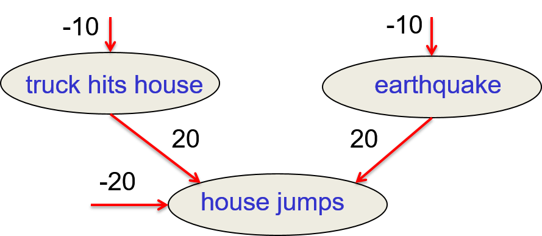
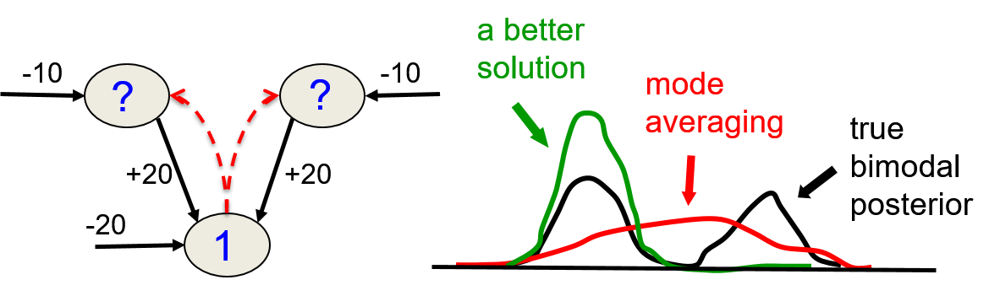
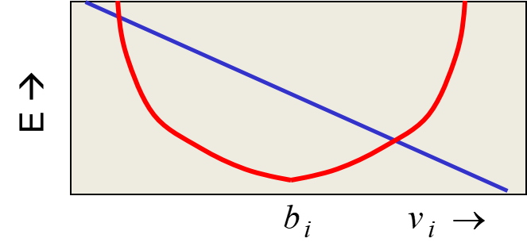
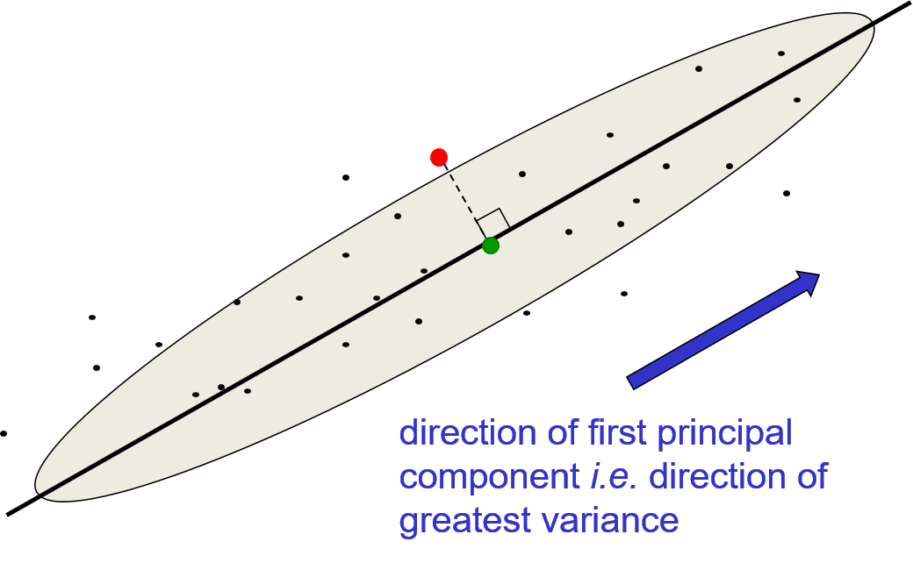

# Belief/Bayesian Networks

## Overview

+ [Incorporating probability into AI](../ML/MLNN-Hinton/13-BeliefNets.md#132-belief-networks)
  + combination of graph theory and probability theory
  + AI works in the 1980's
    + using bags of rules for tasks such as medical diagnosis and exploration for minerals
    + dealing w/ uncertainty for practical problems
    + made up ways of doing uncertainty that did not involve probabilities $\to$ bad bet
  + Graphical models
    + Pearl, Heckeman, Lauritzen, and others shown that probabilities worked better than the ad-hoc methods of expert systems
    + discrete graph good for representing what depended on what other variables
    + computing for nodes of the graph, given the states of other nodes
  + Belief nets:
    + a particular subset of graph
    + sparsely connected, directly acyclic graphs
    + clever inference algorithms to compute the probabilities of unobserved node efficiently for sparsely connected graph
    + working exponentially in the number of nodes that influence each node $\implies$ not for densely connected networks

+ [Belief Networks](../ML/MLNN-Hinton/13-BeliefNets.md#132-belief-networks)
  + a directed acyclic graph composed of stochastic variables (see diagram)
  + observe some of the variables
  + Problems to solve:
    + __the inference problem__: infer the states of the unobserved variables
    + __the learning problem__: adjust the interactions btw variables to make the network more likely to generate the training data

  

    
  

+ [Graphical models vs. Neural networks](../ML/MLNN-Hinton/13-BeliefNets.md#132-belief-networks)
  + early graphical models
    + using experts to define the graph structure and the conditional probabilities; example: medical experts
    + sparsely connected
    + initially focused on doing correct inference, not on learning
  + Neural networks
    + main task: learning
    + hand-wiring knowledge $\to$ not cool: wiring in some basic properties as in convolutional nets was a very sensible thing to do
    + knowledge from learning the training data not from experts
    + not aiming for interpretability or sparse connectivity

+ [Types of generative neural network composed of stochastic binary neurons](../ML/MLNN-Hinton/13-BeliefNets.md#132-belief-networks)
  + Energy-based models
    + connected binary stochastic neurons using symmetric connections to get a Boltzmann Machine
    + ways to learn a Boltzmann machine but difficult $\implies$ restrict the connectivity in a special way (RBM)
  + Causal models
    + connecting binary stochastic neurons in a directed acyclic graph
    + Sigmoid Belief Networks (Neal 1992) $\to$ easier to learn than BM
    + causal sequence from layer to layer to get unbiased sample of the kinds of vectors of visible values that the NN believes in
  + causal model easier to generate data than Boltzmann machine

## Sigmoid Belief Networks

+ [Sigmoid Belief Networks](../ML/MLNN-Hinton/13-BeliefNets.md#133-learning-sigmoid-belief-nets)
  + only one positive phase required
  + locally normalized models, no partition function or derivatives required
  + easily to generate an unbiased example at the leaf nodes
  + following the gradient specified by maximum likelihood learning in a mini-batch stochastic kinds of ways $\to$ understanding what kinds of data the network believes in
  + hard to infer the posterior distribution over all possible configurations of hidden causes when observing the visible effects
  + hard to even get a sample from the posterior $\gets$ stochastic gradient descent required
  + how to learn sigmoid belief networks w/ millions of parameters?
    + very different regime from the normally used graphical models
    + graphical models: interpretable models and trying to learn dozens or hundreds of parameters

## Explaining Away Effects

+ [Explaining away](../ML/MLNN-Hinton/13-BeliefNets.md#133-learning-sigmoid-belief-nets)
  + two independent hidden causes in the prior
  + becoming dependent when observing an effect that they can both influence
  + example: earthquake and truck (see diagram)

    

      
    

## Factorial Distribution

+ [Factorial distributions](../ML/MLNN-Hinton/13-BeliefNets.md#134-the-wake-sleep-algorithm)
  + defintion: the probability of a whole vector is just the product of the probabilities of its individual terms
  + example:
    + individual probabilities of three hidden units in a layer: 0.3, 0.6. 0.8
    + probability of the hidden units w/ states $(1, 0, 1)$ if the distribution is factorial: $p(1, 0, 1) = 0.3 \times (1 -0.6) \times 0.8$
  + degrees of freedom
    + a general distribution over binary vectors of length $N: (2^N - 1)$ degrees of freedom
    + factorial distribution: only $N$ degrees of freedom

## Learning for Belief Networks

+ [Learning rule](../ML/MLNN-Hinton/13-BeliefNets.md#133-learning-sigmoid-belief-nets)
  + learning is easy $\gets$ getting an unbiased sample from the posterior distribution over hidden states given the observed data

    

      
    

  
  + maximizing the log probability for each unit
    + $p_i$: the probability to turn on node $i$ involves the binary states of the parents
    + $\Delta w_{ji}$: the maximum likelihood learning rule

    \[\begin{align*}
      p_i \equiv p(s_i = 1) &= \frac{1}{1 + \exp \left( -b_i - \sum_j s_j w_{ji} \right)} \\
      \Delta w_{ji} &= \varepsilon \, s_j (s_i - p_i)
    \end{align*}\]

  + given an assignment of binary states to all the hidden nodes $\implies$ easily to do maximum likelihood learning in typical stochastic way

+ [Issue for learning](../ML/MLNN-Hinton/13-BeliefNets.md#133-learning-sigmoid-belief-nets)
  + multiple layers of hidden variables to give rise to some data in the causal model (see diagram)
  + hard to learn sigmoid belief nets one layer at a time
  + learning $W$: reqiring sample from the posterio distribution in the first hidden layer
  + problem 1: the posterior not factorial because of "explaining away"
  + problem 2: posterior depending on the prior as well as the likelihood
  + problem 3: required to integrate over all possible configurations in the higher layers to get the prior for the first hidden layer $\to$ hopeless

  

    
  

+ [Learning methods](../ML/MLNN-Hinton/13-BeliefNets.md#133-learning-sigmoid-belief-nets)
  + Monte Carlo methods
  + Variational mehods: only get approximated samples from the posterior
  + Learning from wrong distribution: maximum likelihood learning requiring unbiased samples from the posterior
  + sampling from wrong distribution + the maximum likelihood learning rule:
    + no guarantee on improvement
    + guaranteed to improve:
      + the log probability related to the generation of data
      + providing a lower bound on that mode probability
      + pushing lower bound to push up log probability

## The Wake-Sleep Algorithm

+ [Crazy idea](../ML/MLNN-Hinton/13-BeliefNets.md#134-the-wake-sleep-algorithm)
  + problem: hard to infer to the posterior distribution over hidden configurations when given a data vector
  + Crazy idea: doing the inference wrong
    + observe what's driving the weights during the learning when using an approximate posterior
    + two terms driving the weights
  + each hidden layer
    + using distribution that ignores explaining away
    + assumption (__wrongly__): the posterior over hidden configurations factorizes into a product of distributions for each separate hidden unit

+ [The wake-sleep algorithm](../ML/MLNN-Hinton/13-BeliefNets.md#134-the-wake-sleep-algorithm)
  + lead new area of machine learning $\to$ variational learning in the late 1990s for learing complicated graphical models
  + used for directly graphical models like sigmoid belief nets
  + make uses of the idea of using the wrong distribution
  + architecture: (see diagram)
    + a neural network w/ two different sets of weights
    + a generative model
  + Wake phase
    + use recognition weights to perform a bottom-up pass
    + train the generative weights to reconstruct activities in each layer from the layer above
  + Sleep phase
    + use generative weights to generate samples from the model
    + train the recognition weights to reconstruct activities in each layer from the layer below

  

    
  

+ [Limitations of the wake-sleep algorithm](../ML/MLNN-Hinton/13-BeliefNets.md#134-the-wake-sleep-algorithm)
  + the recognition weights
    + initial phase: weights not very good at the beginning of learing $\to$ waste not not big issue
    + progressive phase: only approximately follow the gradient of the variational bound on the probability $\to$ incorrect mode-averaging
  + explaning away effects $\implies$ the posterior over the top hidden layer is very far from independent
  + Karl Friston: similar to how the brian works

+ [Mode averaging](../ML/MLNN-Hinton/13-BeliefNets.md#134-the-wake-sleep-algorithm)
  + learning recognition weights (left diagram)
    + learning to produce $(0.5, 0.5)$ for the recognition weights
    + representing a distribution that put half its mass on $(1, 0)$ or $(0, 1)$: very improbabe hidden configurations
  + much better picking one mode (right diagram)
    + the best solution to pick one of its states to give it all the probability mass (green curve)
    + variational learning manipulating the true posterior to make it fit the approximation
    + normal learing manipulating an approximation to fit the true posterior

  

    
  

## Deep Belief Networks and RBMs

+ [Stacking RBMs as deep belief net](../ML/MLNN-Hinton/14-DBNsRBM.md#lecture-notes)
  + procedure
    + training a layer of features w/ input directly from the pixels
    + treating the activations of the trained features as if they were pixels and learn features from features
    + repeat the steps
  + each new layer of features by modeling the correlated activity in the feature in the layer below
  + adding another layer of features
    + improving a variatonal lower bound on the log probability of generating the training data
    + complicated proof and only applied to unreal cases
    + proof based on a neat equivalence btw an RBM and an infinitely deep belief net

    

      
    

+ [Generative model w/ 3 layers](../ML/MLNN-Hinton/14-DBNsRBM.md#lecture-notes)
  + procedure to generate data
    + get an equilibrium sample from the top-level RBM by performing alternating Gibbs sampling for a long time
    + perform a top-down pass to get states for all the other layers
  + the lower bottom-up connections (transposes of corresponding weights) not part of the generative model $\to$ used for inference

+ [Mechanism in greedy learning](../ML/MLNN-Hinton/14-DBNsRBM.md#lecture-notes)
  + weights, $w$, in the bottom level RBM define many different distribution
  + the RBM models: $p(v) = \sum_h p(h) p(v|h)$
  + $p(v|h)$ fixed, improve $p(h) \implies p(v)$ improved
    + learn new parameters giving a better model of $p(h)$
    + substitute $p(h)$ in stead of the old model out of $p(h) \to$ improve model over  $v$
  + to improve $p(h)$, a better model than $p(h; w)$ of the aggregated posterior distribution over hidden vectors produced by applying $W$ transpose to the data
    + better model $p(h)$: fitting the aggregated posterior better
    + the aggregated posterior: the average over all vectors in the training set of the posterior distribution over $h$

## Contrastive Wake-Sleep Algorithm

+ [Contrastive version of the wake-sleep algorithm](../ML/MLNN-Hinton/14-DBNsRBM.md#lecture-notes)   after learning many layers of features, fine-tune the features to improve generation
  1. do a stochastic bottom-up pass
    + adjust the top-bottom generative weights of lower layer to be good at reconstructing the feature activities in the layer below
  2. do a few iterations of sampling in the top level RBM
    + adjust the weights in the top-level RBM using contrasted divergence (CD)
  3. do a stochastic top-down pass
    + adjust the bottom-up weights to be good at reconstructing the feature activities in the layer above
  + differences
    + top-level RBM acts as a much better prior over the top layers than just a layer of units assumed to be independent
    + rather than generating data by sampling from the prior, looking at a training case going up to the top-level RBM and just running a few iterations before generating data

+ [Example](../ML/MLNN-Hinton/14-DBNsRBM.md#lecture-notes): Modeling with the DBN on MNIST digits
  + first two hidden layers learned w/o labels
  + top layer learned as an RBM for modeling the labels concatenated w/ the features in the second hidden layer
  + fine-tuning weights as a better generative model using contrastive wake-sleep

  

    
  

## Discriminative Fine-Tune

+ [Fine-tuning for discrimination](../ML/MLNN-Hinton/14-DBNsRBM.md#142-discriminative-fine-tuning-for-dbns)
  + learn on layer at a time by staking RBMs
  + treating this as "pre-training"
  + backpropagation used to find-tune the model

+ [Backpropagation better than greedy pre-training](../ML/MLNN-Hinton/14-DBNsRBM.md#142-discriminative-fine-tuning-for-dbns)
  + the optimization view
    + greedily learning one layer at a time scales well to really big networks, especially locality in each layer
    + not starting backpropagation until sensible feature detectors very helpful for the discrimination task
  + the overfitting view
    + pre-trained notes exhibiting much less overfitting
    + most of the information in the final weights from modeling the distribution of input vectors
    + fine-tuning only modifying the features slightly to get the category boundaries right $\to$ backpropagation not required to discover new features
    + unlabeled training data
    + objection: learning many of the features
      + useless for any particular discriminative task
      + more useful than the raw inputs

+ [Modeling MNIST digits w/ a DBM](../ML/MLNN-Hinton/14-DBNsRBM.md#142-discriminative-fine-tuning-for-dbns)
  + learning w/ 3 hidden layers of features entirely unsupervised (see diagram)
  + the network learns a density model for unlabeled digit images
  + adding a 10-way softmax at the top and the doing backpropagation

  

    
  

+ [Unsupervised "pre-training"](../ML/MLNN-Hinton/14-DBNsRBM.md#142-discriminative-fine-tuning-for-dbns): help for models w/ more data and better priors

+ [Mechanism of unsupervised pre-training](../ML/MLNN-Hinton/14-DBNsRBM.md#143-what-happens-during-discriminative-fine-tuning)
  + sequential image-label pairs (left diagram)
  + parallel image-label pairs (right diagram)
  + much more plausible model of how to assign names to things in images
  + justifying the procedure:
    + having pre-training phase to discover the underlying causes of the images
    + followed by a descriptive phase to get the underlying label where slightly fine-tune the mapping from the image to the underlying causes

  

    
  

## Modeling Real-Valued Data

+ [Modeling real-valued data](../ML/MLNN-Hinton/14-DBNsRBM.md#144-modeling-real-valued-data-with-an-rbm)
  + intermediate intensities of digit images
    + represented as probabilities by using 'mean-field' logistic units
    + treating intermediate values as the probability of the inked pixel
  + not working for real images
    + real-image: intensity of a pixel almost always and almost exactly the average of the neighboring pixels
    + mean-field logistic units unable to represent precise intermediate values

+ [A standard type of real-valued visible unit](../ML/MLNN-Hinton/14-DBNsRBM.md#144-modeling-real-valued-data-with-an-rbm)
  + modeling pixels as Gaussian variables
  + Gibbs sampling: still easy but slow learning
  + energy function

    \[ E(\mathbb{v}, \mathbb{h}) = \underbrace{\sum_{i \in vis} \frac{(v_i - b_i)^2}{2\sigma^2}}_{\text{parabolic containment}\\ \text{function}} - \quad\sum_{j \in hid} b_j h_j\quad - \underbrace{\sum_{i, j} \frac{v_i}{\sigma_i} h_j w_{ij}}_{\text{energy-gradient produced by}\\ \text{the total input to a visible unit}} \]

  

    
  

+ [Gaussian-binary RBM architecture](../ML/MLNN-Hinton/14-DBNsRBM.md#144-modeling-real-valued-data-with-an-rbm)
  + extremely hard to learn tight variances for the visible units (see diagram)
    + $\sigma \ll 1$: the bottom-up effects too big while top-down effect too small
    + conflict: hidden units firmly on and off all the time
  + Solution:
    + small $\sigma \to$ many more hidden units required than visible units
    + allowing small weights to produce big top-down effects

  

    
  

+ [Stepped sigmoid units](../ML/MLNN-Hinton/14-DBNsRBM.md#144-modeling-real-valued-data-with-an-rbm)
  + a neat way to implement integer values
  + making many copies of a stochastic binary unit
  + all copies w/ the same weights and the same adaptive bias, $b$, but different fixed offsets to the bias: $b - 0.5, b-1.5, b-2.5, b-3.5, \dots$
  + issue
    + expensive to use a big population of binary stochastic units w/ offset biases
    + each on required the total input through the logistic function

  

    
  

+ [Fast approximations](../ML/MLNN-Hinton/14-DBNsRBM.md#144-modeling-real-valued-data-with-an-rbm)
  + Rectified Linear unit (ReLU): approximation of multiple sigmoid functions (see diagram)

    \[ \langle y \rangle = \sum_{n=1}^{\infty} \sigma(x+0.5-n) \approx \log(1+e^x) \approx \max(0, x+noise) \]

  + contrastive divergence learning working well for the sum of stochastic logistic units w/ offset biases
  + $\sigma(y)$: the noise variance

  

    
  

+ [Property of Rectified linear unit](../ML/MLNN-Hinton/14-DBNsRBM.md#144-modeling-real-valued-data-with-an-rbm)
  + ReUL w/ bias of zero $\implies$ exhibiting __scale equivariance__
    + scaling up all intensities in the image = scaling up the activities of all hidden units but maintaining the same ratios
    + ReLU not fully linear: adding two ReUL $\neq$ the sum of the representations of each image separately

    \[ R(a\mathbb{x}) = aR(\mathbb{x}) \qquad \text{but} \qquad R(a + b) \neq R(a) + R(b) \]

  + similar to the property of translational equivariance exhibited in convolutional nets
    + convolutional net w/o pooling = translations of the input flowing through the layers of the net w/o effecting anything
    + tanslating the representation of every layer

    \[ R(shift(\mathbb{x})) = shift(R(\mathbb{x})) \]

## Infinite Sigmoid Belief Net = RBM

+ [Mechanism of layer-by-layer learning](../ML/MLNN-Hinton/14-DBNsRBM.md#145-rbms-are-infinite-sigmoid-belief-nets)
  + unexpected equivalence btw RBMs and directed networks
  + RBM = finitely deep sigmoid belief net

+ [An infinite sigmoid belief net equivalent to an RBM](../ML/MLNN-Hinton/14-DBNsRBM.md#145-rbms-are-infinite-sigmoid-belief-nets)
  + infinite sigmod belief net w/ same weights at every layer (see diagram)
  + distribution generated by this infinite directed net w/ replicated weights
  + top-down pass of the directed net exactly equivalent to letting a RBM settle to equilibrium
  + infinite directed net defining the same distribution as a RBM
  + sample from $v_0$ in the infinite directed net = the equilibrium sample of the equivalent RBM

  

    
  

+ [Inference in an infinite belief sigmoid belief net](../ML/MLNN-Hinton/14-DBNsRBM.md#145-rbms-are-infinite-sigmoid-belief-nets)
  + starting at $v_0$ to infer the state of $h_0$ $\to$ difficult due to explaining away
  + variables in $h_0$
    + conditionally independent given $v_0$
    + trivial inference: $v_0 \times W^T$
    + model layers above $h_0$ by implementing a complementary prior
    + $v_0 \times W^T$: the product of the likelihood term and the prior term
    + complementary prior canceling the explaining away
  + inference in the directed net exactly equivalent to letting an RBM settle to equilibrium starting at the data

  

    <a href="https://bit.ly/2JpLNti" ismap target="_blank">
      
    </a
  

+ [Learning a deep directed network](../ML/MLNN-Hinton/14-DBNsRBM.md#145-rbms-are-infinite-sigmoid-belief-nets)
  + learning rule for a sigmoid belief net

    \[ \Delta w_{ij} \propto s_j(s_i - p_i) \]

  + w/ replicated weights

    \[\begin{array}{lllll}
      s_j^0(s_i^0 & - s_i^1) + & & & &  (s_j^0 \xrightarrow{W} s_i^0) \\
       & s_i^1 (s_j^0 & - s_j^1) + & & &  (s_i^1 \xrightarrow{W^T} s_j^0) \\
       & & s_j^1(s_i^1 & - s_i^2) & +  \dots &  \\
       & & & & - s_j^\infty s_i^\infty & 
    \end{array}\]

  + learning w/ all the weights tied together (middle left diagram = middle diagram)
    + exactly equivalent to learning a RBM
    + thinking of the symmetric connections as a shorthand notation for an infinite directed net w/ tied weights
  + using CD1 as a shortcut instead, ought to use maximum likelihood learning
  + freezing the first layer of weights in both directions and learning the remaining weights (still tie together)

  

    <a href="https://bit.ly/2JpLNti" ismap target="_blank">
      
      
      
      
      
    </a
  

+ [Weights in higher layers](../ML/MLNN-Hinton/14-DBNsRBM.md#145-rbms-are-infinite-sigmoid-belief-nets)
  + assumption: differ from the weights in the first layer
  + higher layer no longer implemented a complementary prior
  + learned from a prior closer to the aggregated posterior distribution of the first hidden layer
    + improving the network's model of the data
    + improvement always bigger than the loss in the variational bound caused by using less accurate inference - Hinton, Osindero and Teh (2006)

+ [Contrastive divergence learning](../ML/MLNN-Hinton/14-DBNsRBM.md#145-rbms-are-infinite-sigmoid-belief-nets)
  + infinite sigmoid belief net (left diagram) equivalent to the RBM (right diagram)
  + maximum likelihood learning for the RBM = maximum likelihood learning for the infinite sigmoid belief net
  + equivalent to ignoring the small derivatives contributed by the tied wights in higher layers

    \[\begin{array}{lll}
      s_j^0(s_i^0 & - s_i^1) + & \\
       & s_i^1 (s_j^0 & - s_j^1) = s_j^0s_i^0 - s_i^1s_j^1
    \end{array}\]

  

    <a href="https://bit.ly/2JpLNti" ismap target="_blank">
      
      
    </a
  

+ [Impact on ignoring the derivatives in higher layers](../ML/MLNN-Hinton/14-DBNsRBM.md#145-rbms-are-infinite-sigmoid-belief-nets)
  + small weights $\implies$ Markov chain mixing fast
    + higher layer closed to the equilibrium distribution; i.e., "forgotten" the data vector
    + at equilibrium, the average of derivatives $\to 0$
  + weight $\nearrow \to$ running more iteration of CD
    + allowing CD to continue $\to$ a good approximation to maximum likelihood
    + using CD to build a stack of RBMs to learn multiple features

## Autoencoder and Principal Components Analysis

+ [Principal Components Analysis (PCA) -Intro](../ML/MLNN-Hinton/15-Hierarchy.md#151-from-principal-components-analysis-to-autoencoders)
  + higher dimensional data represented by a much lower dimensional code
  + situation: a data lying a linear manifold in the high dimensional space
  + task: finding a data manifold and projecting the data onto the manifold = representation on the manifold $\to$ orthogonal directions not variation much in the data $\implies$ not losing much information
  + operation:
    + standard principal components methods: efficient
    + neural network w/ one linear hidden layer and linear output layer: inefficient
  + advantage of using neural networks:
    + generalizing the technique by using deep neural networks where the code is a nonlinear function of the input
    + reconstructing the data from the code as a nonlinear function of the input vector
    + able to deal w/ curved manifold in the input space

+ [Principal Components Analysis](../ML/MLNN-Hinton/15-Hierarchy.md#151-from-principal-components-analysis-to-autoencoders)
  + finding the $M$ orthogonal directions
    + $M$ principal directions forming a lower-dimensional subspace
    + representing an $N$-dimensional datapoint by its projections onto the $M$ principal directions
    + losing all information about where the datapoint located in the remaining orthogonal directions but not much
  + reconstructing by using the mean value (over all the data)
    + the mean value w/ $N-M$ directions not represented w/ $M$ orthogonal directions
    + reconstruction error = sum over all these unrepresented directions of the squared differences of the datapoint from the mean
  + example: PCA w/ $N=2$ and $M=1$ (see diagram)

  

    
  

+ [Implementing PCA w/ backpropagation](../ML/MLNN-Hinton/15-Hierarchy.md#151-from-principal-components-analysis-to-autoencoders)
  + inefficient implementation
  + task: making output = the input in a network w/ a central bottleneck

    

      
    

  + efficient code = the activities of the hidden units $\to$ the bottleneck
    + the activities of the hidden unit forming a bottleneck
    + the code vector = a compressed representation of the input vector
  + linear hidden and output layers $\implies$ autoencoder
    + autoencoder
      + learning hidden units w/ a linear function of the data
      + minimizing the squared reconstruction error
    + exactly what PCA does
  + $M$ hidden units
    + spanning the same space at the first $M$ components found by PCA
    + weight vectors probably not orthogonal
    + tending to have equal variances
    + $\therefore\;$ the networks $\equiv$ principal components
    + performance: the stochastic gradient descent learning for the network < PCA algorithm

+ [Generalizing PCA w/ backpropagation](../ML/MLNN-Hinton/15-Hierarchy.md#151-from-principal-components-analysis-to-autoencoders)
  + purpose: generalizing PCA
    + able to represent data w/ a curved manifold rather than a linear manifold in a high dimensional space
  + adding nonlinear layers before and after the code: encoding and decoding weights
    + encoder: converting coordinates in the input space to coordinates on the manifold
    + decoder: inverting the mapping of encoder
  + learned $\to$ mapping on both directions  
  + network architecture (see diagram)
    + output layer trained as similar as possible to the input vector
    + using supervisor learning algorithm to do unsupervised learning

  

    
  

## Deep Autoencoder

+ [Deep autoencoders](../ML/MLNN-Hinton/15-Hierarchy.md#152-deep-autoencoders)
  + always looking like a nice way to do nonlinear dimensional reduction
    + providing flexible mapping both ways
    + mapping able to be nonlinear
    + linear (or better) learning time in the number of training cases
    + final encoding model: fairly compact and fast $\impliedby$ multiplication of matrices for each layer
  + difficulties
    + very difficult to optimize deep autoencoders using backpropagation
    + small initial weights $\to$ backpropagation gradient vanished
  + Solutions
    + unspervised layer-by-layer pre-training
    + initializing the weights carefully as in Echo-state nets

## Document Retrieval with Autoencoders

+ Modeling similarity of documents
  + converting each documents into a "bag of words"
    + a vector of word counts ignoring order
    + ignoring stop words (like "the" or "over") $\impliedby$ not containing much information about the topic
  + comparison the word counts of the query document and millions of other documents
    + issue: too slow $\impliedby$ involving big vectors
    + solution: reducing each query vector to a much smaller vector
    + the vector still containing most of the information about the content of the document

+ Mechanism to compress the count vector
  + deep autoencoder architecture
    + compressing 2000 word counts $\to$ 10 real numbers
    + reconstructing the 2000 words w/ the 10 numbers
  + training the neural network to reproduce its input vector as its output
  + forcing the net to compress as much information as possible into the 10 numbers in the central bottleneck
  + comparing documents w/ these 10 numbers

  

    
  

+ Reconstructing bag of words w/ non-linearity
  + word frequency in the document
    + dividing the counts in a bag of words vector by $N$
    + $N$ = the total number of non-stop words in the document
    + result: probability vector = the probability of getting a particular word if picking a non-stop word at random from the document
  + using softmax at the output of the autoencoder
  + training the first RBM in the stack by using the same trick
    + $N$ observations from the probability distribution
    + treating the word counts as probabilities
    + the visible to hidden weights = $N \times$ the hidden to visible weights
    + input in probabilities $\implies$ very small activities for the 1st hidden layer

+ Finding binary codes for documents
  + binary descriptors of images $\to$ a good way of retrieving images quickly
  + training an autoencoder using 30 logistic units for the code layer
  + procedure
    + first, training w/ a stack of RBMs
    + then unrolling these RBMs by using the transposes of the weight matrices for the decoder
    + last, fine-tuning w/ backpropagation
  + fine-tuning stage
    + adding noise to the inputs to the code units
    + noise forcing their activities to become bimodal in order to resist the effects of the noise
    + simply threshold the activities of the 30 code units to get a binary code
  + easier to just use binary stochastic units in the code layer during training - Krizhevsky

+ Semantic hashing
  + deep autoencoder as hash-function
    + task: finding approximate matches
    + using autoencoder as a hash function to convert a document into a 30 bit address
    + advantage: avoiding searching a big list but flipping a few bits in memory addresses
    + a.k.a. supermarket search (see diagram)
  + fast retrieval methods: working by intersecting stored lists that are associated w/ cues extracted from the query
  + memory bus in computer hardware
  + using machine learning to map the retrieval problem onto the type of list intersection the computer is good at

