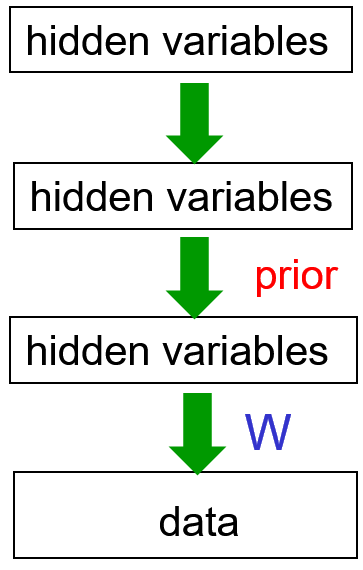
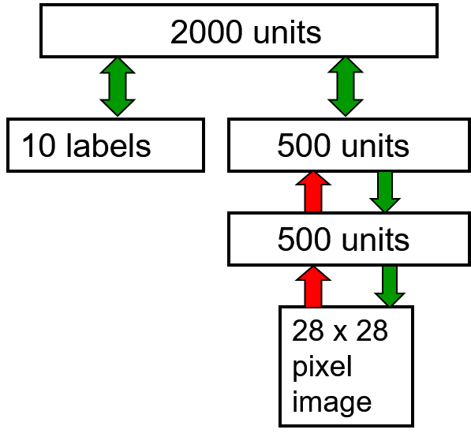

# Belief/Bayesian Networks

## Overview

+ [Incorporating probability into AI](../ML/MLNN-Hinton/13-BeliefNets.md#132-belief-networks)
  + combination of graph theory and probability theory
  + AI works in the 1980's
    + using bags of rules for tasks such as medical diagnosis and exploration for minerals
    + dealing w/ uncertainty for practical problems
    + made up ways of doing uncertainty that did not involve probabilities $\to$ bad bet
  + Graphical models
    + Pearl, Heckeman, Lauritzen, and others shown that probabilities worked better than the ad-hoc methods of expert systems
    + discrete graph good for representing what depended on what other variables
    + computing for nodes of the graph, given the states of other nodes
  + Belief nets:
    + a particular subset of graph
    + sparsely connected, directly acyclic graphs
    + clever inference algorithms to compute the probabilities of unobserved node efficiently for sparsely connected graph
    + working exponentially in the number of nodes that influence each node $\implies$ not for densely connected networks

+ [Belief Networks](../ML/MLNN-Hinton/13-BeliefNets.md#132-belief-networks)
  + a directed acyclic graph composed of stochastic variables (see diagram)
  + observe some of the variables
  + Problems to solve:
    + __the inference problem__: infer the states of the unobserved variables
    + __the learning problem__: adjust the interactions btw variables to make the network more likely to generate the training data

  

    
  

+ [Graphical models vs. Neural networks](../ML/MLNN-Hinton/13-BeliefNets.md#132-belief-networks)
  + early graphical models
    + using experts to define the graph structure and the conditional probabilities; example: medical experts
    + sparsely connected
    + initially focused on doing correct inference, not on learning
  + Neural networks
    + main task: learning
    + hand-wiring knowledge $\to$ not cool: wiring in some basic properties as in convolutional nets was a very sensible thing to do
    + knowledge from learning the training data not from experts
    + not aiming for interpretability or sparse connectivity

+ [Types of generative neural network composed of stochastic binary neurons](../ML/MLNN-Hinton/13-BeliefNets.md#132-belief-networks)
  + Energy-based models
    + connected binary stochastic neurons using symmetric connections to get a Boltzmann Machine
    + ways to learn a Boltzmann machine but difficult $\implies$ restrict the connectivity in a special way (RBM)
  + Causal models
    + connecting binary stochastic neurons in a directed acyclic graph
    + Sigmoid Belief Networks (Neal 1992) $\to$ easier to learn than BM
    + causal sequence from layer to layer to get unbiased sample of the kinds of vectors of visible values that the NN believes in
  + causal model easier to generate data than Boltzmann machine

## Sigmoid Belief Networks

+ [Sigmoid Belief Networks](../ML/MLNN-Hinton/13-BeliefNets.md#133-learning-sigmoid-belief-nets)
  + only one positive phase required
  + locally normalized models, no partition function or derivatives required
  + easily to generate an unbiased example at the leaf nodes
  + following the gradient specified by maximum likelihood learning in a mini-batch stochastic kinds of ways $\to$ understanding what kinds of data the network believes in
  + hard to infer the posterior distribution over all possible configurations of hidden causes when observing the visible effects
  + hard to even get a sample from the posterior $\gets$ stochastic gradient descent required
  + how to learn sigmoid belief networks w/ millions of parameters?
    + very different regime from the normally used graphical models
    + graphical models: interpretable models and trying to learn dozens or hundreds of parameters

## Explaining Away Effects

+ [Explaining away](../ML/MLNN-Hinton/13-BeliefNets.md#133-learning-sigmoid-belief-nets)
  + two independent hidden causes in the prior
  + becoming dependent when observing an effect that they can both influence
  + example: earthquake and truck (see diagram)

    

      
    

## Factorial Distribution

+ [Factorial distributions](../ML/MLNN-Hinton/13-BeliefNets.md#134-the-wake-sleep-algorithm)
  + defintion: the probability of a whole vector is just the product of the probabilities of its individual terms
  + example:
    + individual probabilities of three hidden units in a layer: 0.3, 0.6. 0.8
    + probability of the hidden units w/ states $(1, 0, 1)$ if the distribution is factorial: $p(1, 0, 1) = 0.3 \times (1 -0.6) \times 0.8$
  + degrees of freedom
    + a general distribution over binary vectors of length $N: (2^N - 1)$ degrees of freedom
    + factorial distribution: only $N$ degrees of freedom

## Learning for Belief Networks

+ [Learning rule](../ML/MLNN-Hinton/13-BeliefNets.md#133-learning-sigmoid-belief-nets)
  + learning is easy $\gets$ getting an unbiased sample from the posterior distribution over hidden states given the observed data

    

      
    

  
  + maximizing the log probability for each unit
    + $p_i$: the probability to turn on node $i$ involves the binary states of the parents
    + $\Delta w_{ji}$: the maximum likelihood learning rule

    \[\begin{align*}
      p_i \equiv p(s_i = 1) &= \frac{1}{1 + \exp \left( -b_i - \sum_j s_j w_{ji} \right)} \\
      \Delta w_{ji} &= \varepsilon \, s_j (s_i - p_i)
    \end{align*}\]

  + given an assignment of binary states to all the hidden nodes $\implies$ easily to do maximum likelihood learning in typical stochastic way

+ [Issue for learning](../ML/MLNN-Hinton/13-BeliefNets.md#133-learning-sigmoid-belief-nets)
  + multiple layers of hidden variables to give rise to some data in the causal model (see diagram)
  + hard to learn sigmoid belief nets one layer at a time
  + learning $W$: reqiring sample from the posterio distribution in the first hidden layer
  + problem 1: the posterior not factorial because of "explaining away"
  + problem 2: posterior depending on the prior as well as the likelihood
  + problem 3: required to integrate over all possible configurations in the higher layers to get the prior for the first hidden layer $\to$ hopeless

  

    
  

+ [Learning methods](../ML/MLNN-Hinton/13-BeliefNets.md#133-learning-sigmoid-belief-nets)
  + Monte Carlo methods
  + Variational mehods: only get approximated samples from the posterior
  + Learning from wrong distribution: maximum likelihood learning requiring unbiased samples from the posterior
  + sampling from wrong distribution + the maximum likelihood learning rule:
    + no guarantee on improvement
    + guaranteed to improve:
      + the log probability related to the generation of data
      + providing a lower bound on that mode probability
      + pushing lower bound to push up log probability

## The Wake-Sleep Algorithm

+ [Crazy idea](../ML/MLNN-Hinton/13-BeliefNets.md#134-the-wake-sleep-algorithm)
  + problem: hard to infer to the posterior distribution over hidden configurations when given a data vector
  + Crazy idea: doing the inference wrong
    + observe what's driving the weights during the learning when using an approximate posterior
    + two terms driving the weights
  + each hidden layer
    + using distribution that ignores explaining away
    + assumption (__wrongly__): the posterior over hidden configurations factorizes into a product of distributions for each separate hidden unit

+ [The wake-sleep algorithm](../ML/MLNN-Hinton/13-BeliefNets.md#134-the-wake-sleep-algorithm)
  + lead new area of machine learning $\to$ variational learning in the late 1990s for learing complicated graphical models
  + used for directly graphical models like sigmoid belief nets
  + make uses of the idea of using the wrong distribution
  + architecture: (see diagram)
    + a neural network w/ two different sets of weights
    + a generative model
  + Wake phase
    + use recognition weights to perform a bottom-up pass
    + train the generative weights to reconstruct activities in each layer from the layer above
  + Sleep phase
    + use generative weights to generate samples from the model
    + train the recognition weights to reconstruct activities in each layer from the layer below

  

    
  

+ [Limitations of the wake-sleep algorithm](../ML/MLNN-Hinton/13-BeliefNets.md#134-the-wake-sleep-algorithm)
  + the recognition weights
    + initial phase: weights not very good at the beginning of learing $\to$ waste not not big issue
    + progressive phase: only approximately follow the gradient of the variational bound on the probability $\to$ incorrect mode-averaging
  + explaning away effects $\implies$ the posterior over the top hidden layer is very far from independent
  + Karl Friston: similar to how the brian works

+ [Mode averaging](../ML/MLNN-Hinton/13-BeliefNets.md#134-the-wake-sleep-algorithm)
  + learning recognition weights (left diagram)
    + learning to produce $(0.5, 0.5)$ for the recognition weights
    + representing a distribution that put half its mass on $(1, 0)$ or $(0, 1)$: very improbabe hidden configurations
  + much better picking one mode (right diagram)
    + the best solution to pick one of its states to give it all the probability mass (green curve)
    + variational learning manipulating the true posterior to make it fit the approximation
    + normal learing manipulating an approximation to fit the true posterior

  

    
  

## Deep Belief Networks and RBMs

+ [Stacking RBMs as deep belief net](../ML/MLNN-Hinton/14-DBNsRBM.md#lecture-notes)
  + procedure
    + training a layer of features w/ input directly from the pixels
    + treating the activations of the trained features as if they were pixels and learn features from features
    + repeat the steps
  + each new layer of features by modeling the correlated activity in the feature in the layer below
  + adding another layer of features
    + improving a variatonal lower bound on the log probability of generating the training data
    + complicated proof and only applied to unreal cases
    + proof based on a neat equivalence btw an RBM and an infinitely deep belief net

    

      
    

+ [Generative model w/ 3 layers](../ML/MLNN-Hinton/14-DBNsRBM.md#lecture-notes)
  + procedure to generate data
    + get an equilibrium sample from the top-level RBM by performing alternating Gibbs sampling for a long time
    + perform a top-down pass to get states for all the other layers
  + the lower bottom-up connections (transposes of corresponding weights) not part of the generative model $\to$ used for inference

+ [Mechanism in greedy learning](../ML/MLNN-Hinton/14-DBNsRBM.md#lecture-notes)
  + weights, $w$, in the bottom level RBM define many different distribution
  + the RBM models: $p(v) = \sum_h p(h) p(v|h)$
  + $p(v|h)$ fixed, improve $p(h) \implies p(v)$ improved
    + learn new parameters giving a better model of $p(h)$
    + substitute $p(h)$ in stead of the old model out of $p(h) \to$ improve model over  $v$
  + to improve $p(h)$, a better model than $p(h; w)$ of the aggregated posterior distribution over hidden vectors produced by applying $W$ transpose to the data
    + better model $p(h)$: fitting the aggregated posterior better
    + the aggregated posterior: the average over all vectors in the training set of the posterior distribution over $h$

## Contrastive Wake-Sleep Algorithm

+ [Contrastive version of the wake-sleep algorithm](../ML/MLNN-Hinton/14-DBNsRBM.md#lecture-notes)   after learning many layers of features, fine-tune the features to improve generation
  1. do a stochastic bottom-up pass
    + adjust the top-bottom generative weights of lower layer to be good at reconstructing the feature activities in the layer below
  2. do a few iterations of sampling in the top level RBM
    + adjust the weights in the top-level RBM using contrasted divergence (CD)
  3. do a stochastic top-down pass
    + adjust the bottom-up weights to be good at reconstructing the feature activities in the layer above
  + differences
    + top-level RBM acts as a much better prior over the top layers than just a layer of units assumed to be independent
    + rather than generating data by sampling from the prior, looking at a training case going up to the top-level RBM and just running a few iterations before generating data

+ [Example](../ML/MLNN-Hinton/14-DBNsRBM.md#lecture-notes): Modeling with the DBN on MNIST digits
  + first two hidden layers learned w/o labels
  + top layer learned as an RBM for modeling the labels concatenated w/ the features in the second hidden layer
  + fine-tuning weights as a better generative model using contrastive wake-sleep

  

    
  

## Discriminative Fine-Tune

+ [Fine-tuning for discrimination](../ML/MLNN-Hinton/14-DBNsRBM.md#142-discriminative-fine-tuning-for-dbns)
  + learn on layer at a time by staking RBMs
  + treating this as "pre-training"
  + backpropagation used to find-tune the model

+ [Backpropagation better than greedy pre-training](../ML/MLNN-Hinton/14-DBNsRBM.md#142-discriminative-fine-tuning-for-dbns)
  + the optimization view
    + greedily learning one layer at a time scales well to really big networks, especially locality in each layer
    + not starting backpropagation until sensible feature detectors very helpful for the discrimination task
  + the overfitting view
    + pre-trained notes exhibiting much less overfitting
    + most of the information in the final weights from modeling the distribution of input vectors
    + fine-tuning only modifying the features slightly to get the category boundaries right $\to$ backpropagation not required to discover new features
    + unlabeled training data
    + objection: learning many of the features
      + useless for any particular discriminative task
      + more useful than the raw inputs

+ [Modeling MNIST digits w/ a DBM](../ML/MLNN-Hinton/14-DBNsRBM.md#142-discriminative-fine-tuning-for-dbns)
  + learning w/ 3 hidden layers of features entirely unsupervised (see diagram)
  + the network learns a density model for unlabeled digit images
  + adding a 10-way softmax at the top and the doing backpropagation

  

    
  

+ [Unsupervised "pre-training"](../ML/MLNN-Hinton/14-DBNsRBM.md#142-discriminative-fine-tuning-for-dbns): help for models w/ more data and better priors

